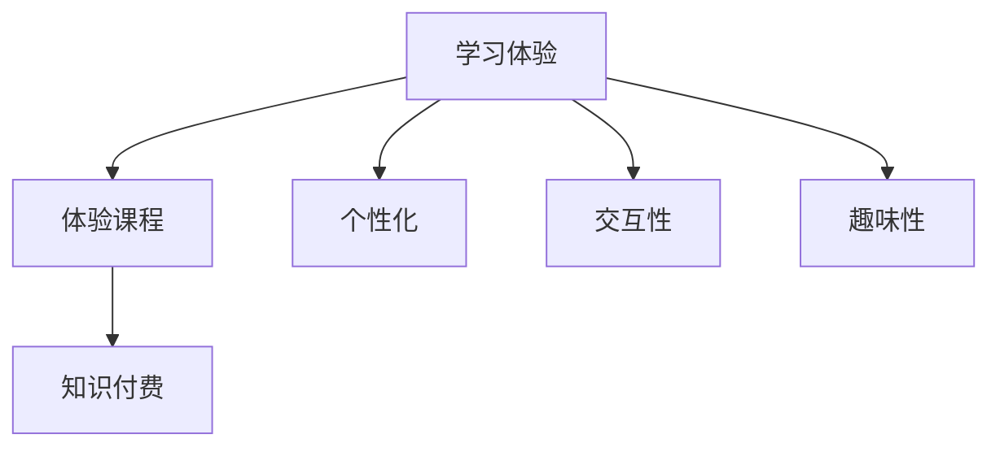

                 

在这个数字时代，程序员的知识付费已经成为一种趋势。知识付费不仅为知识生产者提供了新的收入来源，也为学习者提供了更优质、个性化的学习体验。本文将探讨如何通过打造体验课程，让程序员知识付费更具吸引力，更有效地传递知识和技能。

## 文章关键词

程序员，知识付费，体验课程，学习体验，个性化，技术培训

## 文章摘要

本文将讨论如何通过打造体验课程，实现程序员知识付费的目标。文章首先介绍了知识付费的背景和意义，然后探讨了体验课程的设计要点，最后通过实例展示了如何将理论知识与实践相结合，提高学习效果。

## 1. 背景介绍

随着互联网技术的快速发展，知识传播的途径日益丰富。传统的教育模式逐渐无法满足现代人对于灵活、高效、个性化的学习需求。知识付费作为一种新的教育模式，应运而生。知识付费通过将知识打包成课程，以付费形式提供给学习者，实现了知识的商业化。对于程序员而言，知识付费不仅提供了学习的新途径，也成为了他们提升技能、拓展职业发展的重要手段。

### 1.1 知识付费的兴起

知识付费的兴起，源于以下几个原因：

1. **信息过载**：随着信息爆炸，人们无法在有限的时间内消化海量的信息。知识付费将信息进行筛选、整理，以课程的形式呈现，提高了学习效率。

2. **个性化需求**：每个人对于知识的理解和掌握程度不同，知识付费提供了个性化的学习路径和内容，满足了不同学习者的需求。

3. **商业化趋势**：知识付费将知识转化为产品，实现了知识的商业化，为知识生产者提供了新的收入来源。

### 1.2 程序员知识付费的优势

对于程序员而言，知识付费具有以下几个优势：

1. **技能提升**：通过付费学习，程序员可以系统性地提升自己的技能，适应快速变化的技术领域。

2. **职业发展**：知识付费提供了丰富的学习资源，帮助程序员拓宽知识面，提升职业竞争力。

3. **时间灵活性**：知识付费课程通常具有灵活的时间安排，程序员可以根据自己的时间进行学习，避免了传统培训的固定时间和地点限制。

## 2. 核心概念与联系

为了打造出具有吸引力的体验课程，我们需要理解几个核心概念，并了解它们之间的联系。

### 2.1 学习体验

学习体验是指学习者在学习过程中的感受和体验。一个良好的学习体验能够激发学习者的兴趣，提高学习效果。学习体验包括以下几个方面：

1. **交互性**：课程应该提供与学习者的实时互动，例如在线问答、讨论区等。

2. **个性化**：课程内容应根据学习者的背景和需求进行定制。

3. **趣味性**：课程设计应具有趣味性，以吸引学习者的注意力。

### 2.2 体验课程

体验课程是指以实践操作为主，理论学习为辅的课程。这种课程设计旨在通过实际操作，使学习者更好地理解和掌握知识。体验课程的关键在于如何将理论知识与实践相结合。

### 2.3 知识付费

知识付费是指将知识产品化，通过付费方式提供给学习者。知识付费的核心在于如何提供高质量、有价值的学习内容。

### 2.4 三者之间的联系

学习体验、体验课程和知识付费之间有着紧密的联系。良好的学习体验是体验课程成功的关键，而体验课程则是实现知识付费的手段。通过打造具有良好学习体验的体验课程，我们可以更好地实现程序员的知识付费。

### 2.5 Mermaid 流程图

## 3. 核心算法原理 & 具体操作步骤

### 3.1 算法原理概述

在打造体验课程时，我们需要关注以下几个核心算法原理：

1. **学习算法**：用于分析学习者的行为和进度，提供个性化的学习建议。

2. **内容推荐算法**：根据学习者的兴趣和学习记录，推荐相关的课程内容。

3. **互动算法**：设计课程互动环节，提高学习者的参与度和满意度。

### 3.2 算法步骤详解

1. **学习算法**：
   - 数据收集：收集学习者的学习行为数据，如学习时间、学习进度、问题反馈等。
   - 数据分析：分析学习行为数据，了解学习者的学习习惯和需求。
   - 个性化建议：根据分析结果，为学习者提供个性化的学习建议。

2. **内容推荐算法**：
   - 数据预处理：对学习者的兴趣和学习记录进行预处理，提取关键词和标签。
   - 推荐算法实现：使用协同过滤、基于内容的推荐等算法，为学习者推荐相关课程。
   - 推荐结果优化：根据学习者的反馈，不断优化推荐结果。

3. **互动算法**：
   - 互动设计：根据课程内容和目标，设计互动环节，如在线问答、讨论区、练习题等。
   - 互动分析：分析互动数据，了解学习者的参与度和满意度。
   - 互动优化：根据分析结果，不断优化互动环节，提高学习体验。

### 3.3 算法优缺点

1. **学习算法**：
   - 优点：能够为学习者提供个性化的学习建议，提高学习效果。
   - 缺点：需要大量的数据支持，且算法的准确性受数据质量影响。

2. **内容推荐算法**：
   - 优点：能够为学习者推荐相关的课程内容，提高学习兴趣。
   - 缺点：推荐的准确性受推荐算法和数据质量的影响。

3. **互动算法**：
   - 优点：能够提高学习者的参与度和满意度。
   - 缺点：互动环节的设计和优化需要耗费大量时间和精力。

### 3.4 算法应用领域

1. **在线教育平台**：通过学习算法，为学习者提供个性化的学习体验；通过内容推荐算法，提高课程推荐的准确性；通过互动算法，提高学习者的参与度和满意度。

2. **企业培训**：通过学习算法，为企业员工提供个性化的培训方案；通过内容推荐算法，为企业推荐相关的培训课程；通过互动算法，提高员工的参与度和学习效果。

## 4. 数学模型和公式 & 详细讲解 & 举例说明

### 4.1 数学模型构建

在打造体验课程时，我们可以构建以下数学模型：

1. **学习效果模型**：用于评估学习者的学习效果，包括学习进度、知识掌握程度等。

2. **课程推荐模型**：用于根据学习者的兴趣和学习记录，推荐相关的课程。

3. **互动效果模型**：用于评估互动环节的有效性，包括参与度、满意度等。

### 4.2 公式推导过程

1. **学习效果模型**：

   - 学习进度 = 学习时长 / 课程时长
   - 知识掌握程度 = 正确回答题目数 / 总题目数

2. **课程推荐模型**：

   - 相似度 = 内积（学习者兴趣向量，课程内容向量）
   - 排名 = 相似度 / 总相似度

3. **互动效果模型**：

   - 参与度 = 回复数 / 互动总数
   - 满意度 = 用户评价分数 / 总评价数

### 4.3 案例分析与讲解

假设我们有一个在线教育平台，用户名为A的学习者正在学习一门编程课程。我们可以根据以下数据，分析学习者的学习效果：

1. **学习进度**：

   - 学习时长：2小时
   - 课程时长：5小时
   - 学习进度 = 2 / 5 = 0.4，即学习者完成了40%的课程。

2. **知识掌握程度**：

   - 正确回答题目数：5道
   - 总题目数：10道
   - 知识掌握程度 = 5 / 10 = 0.5，即学习者掌握了50%的知识。

3. **课程推荐**：

   - 学习者兴趣向量：[0.2, 0.4, 0.3, 0.1]
   - 课程内容向量：[0.3, 0.5, 0.2, 0.

