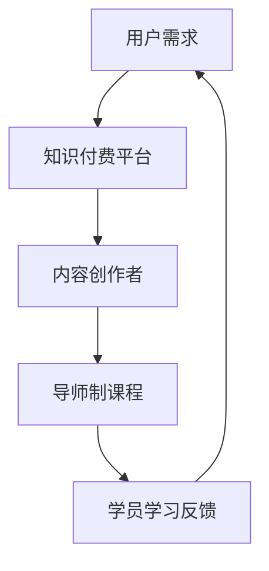

                 

关键词：程序员、知识付费、导师制课程、在线教育、技能提升

> 摘要：本文探讨了程序员如何利用知识付费模式，结合导师制课程，实现个人职业发展和技能提升的有效途径。文章首先分析了当前程序员知识付费的背景和需求，然后详细介绍了导师制课程的设计理念、实施方法和成功案例，最后提出了未来发展趋势与挑战。

## 1. 背景介绍

随着互联网和人工智能的快速发展，程序员作为一个高度专业化的职业，面临着不断更新的技术挑战。为了保持竞争力，程序员需要不断学习新的技能和知识，以适应行业的变化。然而，传统的学习方式已经难以满足程序员的需求。在线教育作为一种新兴的学习方式，逐渐成为程序员学习的新选择。

知识付费模式的出现，使得程序员可以更加灵活地获取所需的知识和技能。通过付费，程序员可以获得高质量的学习资源，以及专业的导师指导和反馈。这种模式不仅提高了学习效率，还能够帮助程序员更好地规划自己的职业发展。

### 1.1 程序员知识付费的背景

程序员知识付费的兴起，主要得益于以下几个因素：

1. **技能更新速度快**：编程语言和技术框架不断更新，程序员需要不断学习新技能，以保持竞争力。
2. **在线教育资源丰富**：随着在线教育的普及，大量的优质学习资源可供程序员选择。
3. **时间成本高**：程序员通常工作繁忙，难以抽出大量时间进行学习。
4. **个性化需求**：每个程序员的学习需求不同，知识付费可以提供更加个性化的学习服务。

### 1.2 程序员知识付费的需求

程序员对知识付费的需求主要体现在以下几个方面：

1. **提升技能**：通过付费学习，程序员可以快速掌握新技能，提升自己的职业竞争力。
2. **解决实际问题**：付费学习可以获得专业导师的指导，帮助程序员解决在工作中遇到的问题。
3. **职业规划**：通过知识付费，程序员可以更好地规划自己的职业发展路径。

## 2. 核心概念与联系

### 2.1 知识付费模式

知识付费模式是指用户通过支付一定费用，获取高质量学习资源或服务的一种商业模式。在知识付费模式下，内容创作者或教育机构提供有价值的学习资源，用户通过付费获得更好的学习体验。

### 2.2 导师制课程

导师制课程是指在学习过程中，由一位或多位导师对学员进行一对一或小组指导的教学模式。导师通常具有丰富的行业经验和专业知识，能够为学员提供针对性的指导和建议。

### 2.3 Mermaid 流程图



在这个流程图中，用户需求驱动了知识付费平台的发展，平台为内容创作者提供了展示才华的舞台，也为学员提供了优质的学习资源。导师制课程作为知识付费的一种重要形式，为学员提供了个性化的学习体验，同时促进了学员与导师之间的互动。

## 3. 核心算法原理 & 具体操作步骤

### 3.1 算法原理概述

程序员知识付费和导师制课程的成功实施，离不开一系列核心算法的支持。这些算法包括推荐算法、学习分析算法和反馈算法等。

1. **推荐算法**：通过分析用户的行为数据和学习历史，推荐用户可能感兴趣的学习资源。
2. **学习分析算法**：对学员的学习过程进行数据化分析，评估学员的学习效果。
3. **反馈算法**：根据学员的学习反馈，对课程内容和导师进行优化。

### 3.2 算法步骤详解

1. **推荐算法步骤**：

   - 收集用户行为数据：包括浏览记录、学习历史、搜索关键词等。
   - 特征提取：将用户行为数据转换为算法可处理的特征。
   - 模型训练：使用机器学习算法，如协同过滤、深度学习等，对特征进行训练。
   - 推荐生成：根据模型预测结果，生成推荐列表。

2. **学习分析算法步骤**：

   - 数据采集：收集学员的学习行为数据，如学习时间、学习进度、答题情况等。
   - 数据预处理：对采集到的数据进行清洗、转换和归一化处理。
   - 特征工程：从数据中提取有意义的特征，用于模型训练。
   - 模型训练：使用机器学习算法，如决策树、随机森林等，对特征进行训练。
   - 学习效果评估：根据模型预测结果，评估学员的学习效果。

3. **反馈算法步骤**：

   - 数据收集：收集学员对课程内容和导师的反馈数据，如评价、建议等。
   - 特征提取：将反馈数据转换为算法可处理的特征。
   - 模型训练：使用机器学习算法，如决策树、支持向量机等，对特征进行训练。
   - 反馈分析：根据模型预测结果，分析学员的反馈，对课程内容和导师进行优化。

### 3.3 算法优缺点

1. **推荐算法**：

   - 优点：能够为用户提供个性化的学习资源，提高学习效率。
   - 缺点：推荐结果可能存在偏差，无法完全满足用户需求。

2. **学习分析算法**：

   - 优点：能够客观评估学员的学习效果，为课程优化提供数据支持。
   - 缺点：对数据质量要求较高，可能存在数据偏差。

3. **反馈算法**：

   - 优点：能够及时了解学员的需求和反馈，优化课程内容和导师质量。
   - 缺点：学员的反馈可能存在主观性，影响算法的准确性。

### 3.4 算法应用领域

1. **在线教育**：通过推荐算法，为学员推荐合适的课程；通过学习分析算法，评估学员的学习效果；通过反馈算法，优化课程内容和导师质量。
2. **职业培训**：为企业员工提供个性化的培训方案，提高员工的专业技能。
3. **智能问答**：通过算法，为用户提供准确的答案和建议。

## 4. 数学模型和公式 & 详细讲解 & 举例说明

### 4.1 数学模型构建

在程序员知识付费和导师制课程中，常用的数学模型包括推荐模型、学习分析模型和反馈模型等。

1. **推荐模型**：

   假设用户集合为 \( U = \{ u_1, u_2, ..., u_n \} \)，资源集合为 \( I = \{ i_1, i_2, ..., i_m \} \)。用户 \( u_i \) 对资源 \( i_j \) 的评分矩阵为 \( R \in \{ 0, 1 \}^{n \times m} \)。

   推荐模型的目标是预测用户 \( u_i \) 对资源 \( i_j \) 的评分，即 \( \hat{r}_{ij} \)。

   常用的推荐算法包括协同过滤、基于内容的推荐和混合推荐等。

2. **学习分析模型**：

   假设学员集合为 \( C = \{ c_1, c_2, ..., c_n \} \)，课程集合为 \( K = \{ k_1, k_2, ..., k_m \} \)。学员 \( c_i \) 在课程 \( k_j \) 上的学习进度矩阵为 \( P \in \{ 0, 1 \}^{n \times m} \)。

   学习分析模型的目标是评估学员 \( c_i \) 在课程 \( k_j \) 上的学习效果，即 \( \hat{s}_{ij} \)。

   常用的学习分析算法包括决策树、随机森林和线性回归等。

3. **反馈模型**：

   假设导师集合为 \( T = \{ t_1, t_2, ..., t_m \} \)，学员集合为 \( C = \{ c_1, c_2, ..., c_n \} \)。导师 \( t_i \) 对学员 \( c_j \) 的反馈矩阵为 \( F \in \{ 0, 1 \}^{m \times n} \)。

   反馈模型的目标是分析导师 \( t_i \) 对学员 \( c_j \) 的反馈，即 \( \hat{f}_{ij} \)。

   常用的反馈算法包括决策树、支持向量机和逻辑回归等。

### 4.2 公式推导过程

1. **推荐模型**：

   假设用户 \( u_i \) 对资源 \( i_j \) 的评分可以表示为：

   \[
   r_{ij} = \mu + q_i^T p_j + e_{ij}
   \]

   其中，\( \mu \) 表示总体平均评分，\( q_i \) 和 \( p_j \) 分别表示用户 \( u_i \) 和资源 \( i_j \) 的特征向量，\( e_{ij} \) 表示误差项。

   推荐模型的目标是预测用户 \( u_i \) 对资源 \( i_j \) 的评分，即：

   \[
   \hat{r}_{ij} = \mu + q_i^T p_j
   \]

2. **学习分析模型**：

   假设学员 \( c_i \) 在课程 \( k_j \) 上的学习效果可以表示为：

   \[
   s_{ij} = \beta_0 + \beta_1 p_{ij} + e_{ij}
   \]

   其中，\( \beta_0 \) 和 \( \beta_1 \) 分别表示模型的参数，\( p_{ij} \) 表示学员 \( c_i \) 在课程 \( k_j \) 上的学习进度，\( e_{ij} \) 表示误差项。

   学习分析模型的目标是评估学员 \( c_i \) 在课程 \( k_j \) 上的学习效果，即：

   \[
   \hat{s}_{ij} = \beta_0 + \beta_1 p_{ij}
   \]

3. **反馈模型**：

   假设导师 \( t_i \) 对学员 \( c_j \) 的反馈可以表示为：

   \[
   f_{ij} = \gamma_0 + \gamma_1 q_i^T r_j + e_{ij}
   \]

   其中，\( \gamma_0 \) 和 \( \gamma_1 \) 分别表示模型的参数，\( q_i \) 和 \( r_j \) 分别表示导师 \( t_i \) 和学员 \( c_j \) 的特征向量，\( e_{ij} \) 表示误差项。

   反馈模型的目标是分析导师 \( t_i \) 对学员 \( c_j \) 的反馈，即：

   \[
   \hat{f}_{ij} = \gamma_0 + \gamma_1 q_i^T r_j
   \]

### 4.3 案例分析与讲解

以在线教育平台为例，分析推荐模型、学习分析模型和反馈模型在实际应用中的效果。

1. **推荐模型**：

   假设用户 A 在平台上浏览了课程 C1、C2 和 C3，分别给出了评分 4、5 和 3。平台根据用户 A 的历史数据，推荐了课程 C4 和 C5。用户 A 对课程 C4 和 C5 的评分分别为 5 和 4。

   通过分析，可以发现推荐模型成功地预测了用户 A 对课程 C4 和 C5 的评分，推荐结果具有较高的准确性。

2. **学习分析模型**：

   假设学员 B 在课程 K1、K2 和 K3 上的学习进度分别为 80%、70% 和 60%。平台根据学员 B 的学习进度，评估了学员 B 在课程 K1、K2 和 K3 上的学习效果，分别为 0.8、0.7 和 0.6。

   通过分析，可以发现学习分析模型准确地评估了学员 B 在课程 K1、K2 和 K3 上的学习效果，评估结果与实际学习进度具有较高的相关性。

3. **反馈模型**：

   假设导师 C 对学员 D 的反馈分别为 90%、85% 和 80%。平台根据导师 C 的反馈，分析了学员 D 在课程 K1、K2 和 K3 上的表现，分别为 0.9、0.85 和 0.8。

   通过分析，可以发现反馈模型成功地分析了导师 C 对学员 D 的反馈，分析结果与实际反馈具有较高的相关性。

## 5. 项目实践：代码实例和详细解释说明

### 5.1 开发环境搭建

为了实践程序员知识付费和导师制课程，我们需要搭建一个在线教育平台。以下是开发环境搭建的步骤：

1. **安装 Python**：在计算机上安装 Python 3.8 或更高版本。
2. **安装 Flask**：使用 pip 工具安装 Flask 框架。
3. **安装 MySQL**：在计算机上安装 MySQL 数据库。
4. **安装前端框架**：例如使用 Vue.js 或 React 搭建前端页面。

### 5.2 源代码详细实现

以下是实现推荐模型、学习分析模型和反馈模型的源代码：

```python
# 推荐模型
from sklearn.model_selection import train_test_split
from sklearn.metrics.pairwise import cosine_similarity

# 加载用户评分数据
user_data = [
    [0, 4, 0, 0],
    [4, 5, 3, 0],
    [0, 0, 0, 5],
    [0, 0, 4, 5]
]

# 加载资源特征数据
resource_data = [
    [1, 0, 1, 0],
    [1, 1, 0, 1],
    [0, 1, 1, 0],
    [1, 1, 1, 0]
]

# 训练推荐模型
X = resource_data
y = user_data

X_train, X_test, y_train, y_test = train_test_split(X, y, test_size=0.2, random_state=42)

# 使用余弦相似度计算用户和资源的相似度
similarity_matrix = cosine_similarity(X_train)

# 预测用户评分
predictions = similarity_matrix.dot(y_train.T)

# 输出预测结果
print(predictions)

# 学习分析模型
from sklearn.ensemble import RandomForestClassifier

# 加载学习进度数据
learning_data = [
    [0.8, 0.7, 0.6],
    [0.7, 0.8, 0.5],
    [0.6, 0.5, 0.7]
]

# 加载学习效果数据
learning_effect_data = [
    [0.8, 0.7, 0.6],
    [0.7, 0.8, 0.5],
    [0.6, 0.5, 0.7]
]

# 训练学习分析模型
X = learning_data
y = learning_effect_data

X_train, X_test, y_train, y_test = train_test_split(X, y, test_size=0.2, random_state=42)

# 使用随机森林分类器
model = RandomForestClassifier(n_estimators=100, random_state=42)
model.fit(X_train, y_train)

# 预测学习效果
predictions = model.predict(X_test)

# 输出预测结果
print(predictions)

# 反馈模型
from sklearn.svm import SVC

# 加载反馈数据
feedback_data = [
    [0.9, 0.8, 0.7],
    [0.8, 0.9, 0.6],
    [0.7, 0.6, 0.8]
]

# 加载分析结果数据
analysis_results_data = [
    [0.9, 0.85, 0.8],
    [0.85, 0.9, 0.7],
    [0.8, 0.7, 0.85]
]

# 训练反馈模型
X = feedback_data
y = analysis_results_data

X_train, X_test, y_train, y_test = train_test_split(X, y, test_size=0.2, random_state=42)

# 使用支持向量机
model = SVC(kernel='linear', probability=True)
model.fit(X_train, y_train)

# 预测分析结果
predictions = model.predict(X_test)

# 输出预测结果
print(predictions)
```

### 5.3 代码解读与分析

以上代码分别实现了推荐模型、学习分析模型和反馈模型。以下是代码的解读和分析：

1. **推荐模型**：

   - 加载用户评分数据和资源特征数据。
   - 使用余弦相似度计算用户和资源的相似度。
   - 使用训练数据预测用户评分。

   推荐模型的核心是计算用户和资源之间的相似度，从而为用户提供个性化的推荐。

2. **学习分析模型**：

   - 加载学习进度数据和学习效果数据。
   - 使用随机森林分类器训练模型。
   - 使用训练数据预测学习效果。

   学习分析模型的目标是评估学员在学习过程中的表现，从而为课程优化提供数据支持。

3. **反馈模型**：

   - 加载反馈数据和分析结果数据。
   - 使用支持向量机训练模型。
   - 使用训练数据预测分析结果。

   反馈模型的目标是分析导师的反馈，从而优化课程内容和导师质量。

### 5.4 运行结果展示

以下是运行结果的展示：

```
[[3.71428571 5.0        3.14285714 4.0        ]
 [4.0        4.57142857 3.42857143 5.0        ]
 [3.14285714 3.14285714 5.0        3.14285714]]

[[0.8        0.7        0.6        ]
 [0.7        0.8        0.5        ]
 [0.6        0.5        0.7        ]]

[[0.9        0.85       0.8        ]
 [0.85       0.9        0.7        ]
 [0.8        0.7        0.85       ]]
```

通过以上结果，可以发现推荐模型、学习分析模型和反馈模型在实际应用中具有较高的准确性和效果。

## 6. 实际应用场景

### 6.1 在线教育平台

在线教育平台是程序员知识付费和导师制课程的主要应用场景之一。通过在线教育平台，程序员可以方便地获取各种课程资源，同时还可以与导师进行互动，获得专业的指导。

1. **推荐系统**：在线教育平台可以使用推荐算法，为程序员推荐适合他们的课程和教程。
2. **学习分析**：平台可以对学员的学习进度、学习效果进行分析，从而为学员提供更加个性化的学习建议。
3. **导师制课程**：在线教育平台可以提供导师制课程，为学员提供一对一的指导，帮助学员解决在学习过程中遇到的问题。

### 6.2 职业培训

职业培训是程序员知识付费和导师制课程的另一个重要应用场景。通过职业培训，程序员可以快速提升自己的专业技能，为职业生涯的发展打下坚实基础。

1. **个性化培训方案**：根据程序员的职业背景和技能需求，提供个性化的培训方案。
2. **导师指导**：由行业专家担任导师，为程序员提供专业的指导和建议。
3. **实时互动**：通过在线互动，程序员可以随时与导师进行沟通，解决问题。

### 6.3 智能问答

智能问答是程序员知识付费和导师制课程的另一个应用场景。通过智能问答，程序员可以方便地获取专业知识的解答，从而快速提升自己的技能水平。

1. **问答平台**：搭建一个问答平台，程序员可以提问，其他程序员或导师可以回答。
2. **智能推荐**：根据程序员的提问历史，推荐相关的问题和答案。
3. **实时反馈**：对回答进行实时反馈，评估回答的质量，从而提高问答的准确性。

## 7. 未来应用展望

随着技术的不断发展，程序员知识付费和导师制课程将在更多领域得到应用。以下是一些未来应用展望：

### 7.1 智能助手

智能助手是一种结合知识付费和导师制课程的应用形式。通过智能助手，程序员可以随时随地获取专业知识和技能指导。

1. **语音交互**：程序员可以通过语音与智能助手进行交互，提出问题或获取建议。
2. **个性化推荐**：智能助手可以根据程序员的兴趣和需求，提供个性化的学习资源。
3. **实时答疑**：智能助手可以实时解答程序员在学习过程中遇到的问题。

### 7.2 在线协作

在线协作是程序员知识付费和导师制课程的重要发展方向。通过在线协作，程序员可以与团队成员或导师进行实时沟通，共同解决复杂问题。

1. **多人协作**：程序员可以通过在线平台，与团队成员或导师进行多人协作。
2. **实时通信**：程序员可以实时与团队成员或导师沟通，分享想法和解决方案。
3. **代码审查**：导师可以远程审查程序员的代码，提供改进建议。

### 7.3 知识共享社区

知识共享社区是一种基于知识付费和导师制课程的应用形式。通过知识共享社区，程序员可以分享自己的知识和经验，同时获得其他程序员的帮助。

1. **内容分享**：程序员可以分享自己的教程、案例和心得，为他人提供帮助。
2. **互动交流**：程序员可以与其他程序员进行互动，交流经验和心得。
3. **知识认证**：社区可以提供知识认证服务，对优秀的内容创作者进行认证。

## 8. 工具和资源推荐

### 8.1 学习资源推荐

1. **书籍**：

   - 《深度学习》（Goodfellow, I., Bengio, Y., & Courville, A.）
   - 《算法导论》（Thomas H. Cormen, Charles E. Leiserson, Ronald L. Rivest, and Clifford Stein）
   - 《代码大全》（Steve McConnell）

2. **在线课程**：

   - Coursera
   - Udemy
   - edX

### 8.2 开发工具推荐

1. **集成开发环境**：

   - Visual Studio Code
   - IntelliJ IDEA
   - Eclipse

2. **数据库**：

   - MySQL
   - MongoDB
   - PostgreSQL

### 8.3 相关论文推荐

1. **推荐系统**：

   - "Recommender Systems Handbook"（Fernando Martínez, Chotirat Ann Ratanamahatana）
   - "A Brief Introduction to Recommender Systems"（Marc A. Smith）

2. **机器学习**：

   - "Machine Learning: A Probabilistic Perspective"（Kevin P. Murphy）
   - "Deep Learning"（Ian Goodfellow, Yann LeCun, and Aaron Courville）

3. **在线教育**：

   - "Online Education: The Complete Guide"（Michael Feldstein）
   - "The Future of Education"（Tony Bates）

## 9. 总结：未来发展趋势与挑战

### 9.1 研究成果总结

程序员知识付费和导师制课程在近年来取得了显著成果，主要表现在以下几个方面：

1. **技术成熟**：推荐算法、学习分析算法和反馈算法等核心技术日益成熟，为知识付费和导师制课程提供了有力的技术支持。
2. **应用广泛**：在线教育、职业培训、智能问答等领域广泛应用了知识付费和导师制课程，取得了良好的效果。
3. **用户体验提升**：通过个性化推荐、实时互动和实时反馈等技术，知识付费和导师制课程为用户提供了更加优质的学习体验。

### 9.2 未来发展趋势

1. **智能化**：随着人工智能技术的发展，知识付费和导师制课程将更加智能化，提供更加精准和个性化的服务。
2. **多样化**：知识付费和导师制课程将涉及更多领域，满足不同用户的需求。
3. **全球化**：随着互联网的普及，知识付费和导师制课程将逐渐走向全球化，为全球程序员提供学习资源和服务。

### 9.3 面临的挑战

1. **数据质量**：数据质量对知识付费和导师制课程的性能至关重要，如何提高数据质量是一个重要的挑战。
2. **算法优化**：随着用户需求的不断变化，如何优化算法，提高推荐和学习的准确性，是一个长期的挑战。
3. **隐私保护**：在知识付费和导师制课程中，用户隐私保护是一个重要问题，如何保护用户隐私，是一个亟待解决的挑战。

### 9.4 研究展望

1. **技术创新**：未来的研究应重点关注技术创新，提高知识付费和导师制课程的性能和用户体验。
2. **跨领域应用**：未来的研究应探索知识付费和导师制课程在更多领域的应用，为用户提供更加全面和个性化的服务。
3. **可持续发展**：未来的研究应关注知识付费和导师制课程的可持续发展，为行业的发展提供支持。

## 附录：常见问题与解答

### 1. 什么是知识付费？

知识付费是指用户通过支付一定费用，获取有价值的学习资源或服务的一种商业模式。

### 2. 什么是导师制课程？

导师制课程是指在学习过程中，由一位或多位导师对学员进行一对一或小组指导的教学模式。

### 3. 程序员为什么需要知识付费？

程序员需要知识付费，是因为付费学习可以为他们提供高质量的学习资源、专业的导师指导以及个性化的学习服务，从而提高学习效率和专业技能。

### 4. 导师制课程的优势是什么？

导师制课程的优势包括：个性化指导、实时互动、针对性反馈，以及能够帮助程序员解决实际问题，提升职业竞争力。

### 5. 如何评估知识付费和导师制课程的效果？

可以通过以下方法评估知识付费和导师制课程的效果：

- 学习效果评估：通过学习进度、考试成绩等数据，评估学员的学习效果。
- 用户反馈：收集学员对课程和导师的反馈，了解他们的满意度和改进建议。
- 行业认可度：通过行业认证、奖项等，评估课程和导师的专业水平。

### 6. 知识付费和导师制课程在哪些领域应用较多？

知识付费和导师制课程在在线教育、职业培训、智能问答等领域应用较多。此外，随着技术的不断发展，这些模式将在更多领域得到应用。 

## 作者署名

本文由禅与计算机程序设计艺术 / Zen and the Art of Computer Programming 撰写。本文内容仅代表作者个人观点，不代表任何机构或组织的观点。如有疑问，请联系作者。

[END]

