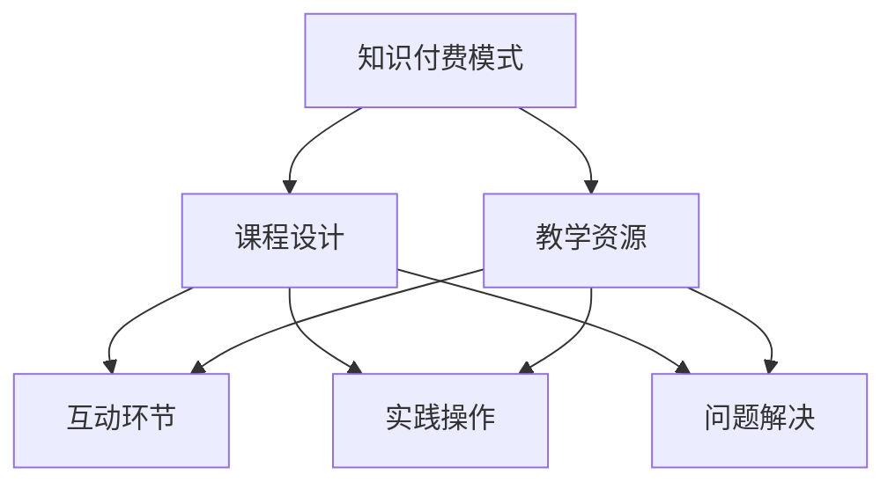
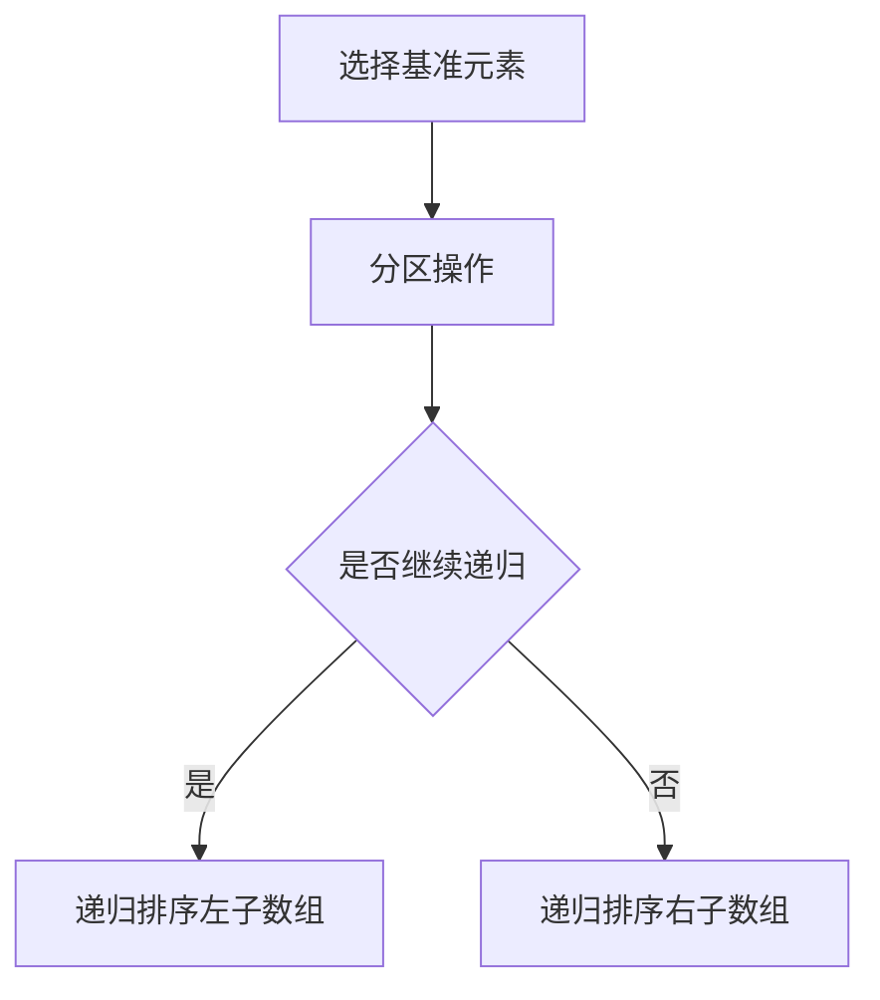

                 

关键词：知识付费、程序员、工作坊式课程、教学设计、课程开发、用户体验

> 摘要：本文旨在探讨程序员如何利用知识付费模式，通过打造工作坊式课程，提高学习效果和用户体验。文章从背景介绍、核心概念与联系、核心算法原理、数学模型与公式、项目实践、实际应用场景、工具和资源推荐、总结与展望等方面，深入分析并解答了如何将理论知识转化为实践技能，为程序员的知识付费课程开发提供实际指导。

## 1. 背景介绍

在当今信息爆炸的时代，程序员面临着不断更新的技术栈和日益激烈的竞争。为了保持竞争力，程序员需要不断学习和掌握新技术。然而，传统的教学方式已无法满足程序员的学习需求。知识付费模式的兴起，为程序员提供了更多的学习机会和资源，同时也为企业提供了有效的培训方案。

知识付费是指用户通过付费获取有价值的信息、知识或服务。对于程序员来说，知识付费意味着他们可以通过购买课程、订阅服务、参加线上或线下培训等方式，学习到最新的技术和技能。这种模式不仅提高了学习效率，还降低了学习成本，为程序员提供了更灵活的学习方式。

工作坊式课程是一种以实践为导向的教学模式，通过实际操作、案例分析、互动讨论等方式，帮助学员快速掌握知识和技能。与传统的课堂式教学不同，工作坊式课程更加注重实践操作和问题解决，能够有效提高学员的学习效果和用户体验。

本文将探讨如何将知识付费模式与工作坊式课程相结合，打造出一套适合程序员的课程体系，为程序员提供更加高效、实用的学习资源。

## 2. 核心概念与联系

### 2.1 知识付费模式

知识付费模式主要包括以下几种类型：

1. **课程购买**：用户通过购买课程，获取课程内容和学习资源。
2. **订阅服务**：用户通过订阅服务，定期获取最新的课程和资源。
3. **线上培训**：通过线上直播、录播等方式，为用户提供实时或回看的学习机会。
4. **线下培训**：线下培训班或工作坊，为用户提供面对面交流和实践操作的机会。

### 2.2 工作坊式课程

工作坊式课程的核心特点包括：

1. **实践导向**：课程内容以实践操作为主，注重学员的实际动手能力。
2. **互动讨论**：课程中设置互动环节，促进学员之间的交流和讨论。
3. **案例分析**：通过实际案例，帮助学员理解知识和技能在实际工作中的应用。
4. **问题解决**：课程过程中设置问题，引导学员思考并解决问题。

### 2.3 知识付费与工作坊式课程的结合

将知识付费模式与工作坊式课程相结合，可以充分发挥两者的优势，提高课程的质量和用户体验。具体方式如下：

1. **课程设计**：根据程序员的实际需求，设计符合工作坊式特点的课程内容。
2. **教学资源**：提供丰富、实用的教学资源，如案例、工具、教程等。
3. **互动环节**：设置互动讨论、案例分析等环节，增强学员的参与感和体验感。
4. **实践操作**：安排学员进行实际操作，巩固所学知识和技能。
5. **问题解决**：引导学员在实践过程中遇到问题，并解决问题，提高学习效果。

### 2.4 Mermaid 流程图

以下是一个简单的 Mermaid 流程图，展示知识付费与工作坊式课程的结合过程：



## 3. 核心算法原理 & 具体操作步骤

### 3.1 算法原理概述

在工作坊式课程中，算法原理的讲解是非常重要的一环。算法原理的讲解应该遵循以下原则：

1. **简洁明了**：用最简单的语言和例子，让学员快速理解算法的基本概念。
2. **循序渐进**：从简单到复杂，逐步讲解算法的原理和实现过程。
3. **理论与实践相结合**：讲解算法原理时，结合实际案例，让学员了解算法在实际工作中的应用。

### 3.2 算法步骤详解

以“快速排序算法”为例，讲解其具体操作步骤：

1. **选择基准元素**：在数组中选择一个基准元素。
2. **分区操作**：将数组分为两个子数组，一个包含小于基准元素的元素，另一个包含大于基准元素的元素。
3. **递归排序**：对两个子数组分别进行快速排序。

### 3.3 算法优缺点

快速排序算法的优点：

1. **时间复杂度低**：平均情况下，时间复杂度为 \(O(n \log n)\)。
2. **空间复杂度低**：不需要额外的空间来存储数据。

快速排序算法的缺点：

1. **最坏情况下时间复杂度高**：当输入数据已经有序时，时间复杂度退化为 \(O(n^2)\)。
2. **递归调用次数多**：递归调用次数较多，可能导致栈溢出。

### 3.4 算法应用领域

快速排序算法广泛应用于各种领域，如：

1. **排序算法**：快速排序是一种高效的排序算法，常用于处理大量数据的排序问题。
2. **算法竞赛**：快速排序是算法竞赛中常用的算法之一，能够快速解决排序问题。
3. **数据分析**：在数据分析领域，快速排序算法可以用于快速筛选数据、排序数据等操作。

### 3.5 Mermaid 流程图

以下是一个简单的 Mermaid 流程图，展示快速排序算法的步骤：



## 4. 数学模型和公式 & 详细讲解 & 举例说明

### 4.1 数学模型构建

在工作坊式课程中，数学模型和公式的讲解也是非常重要的。以下是一个简单的例子：

**例子**：求解线性方程组

给定方程组：

\[ \begin{cases} a_1x + b_1y = c_1 \\ a_2x + b_2y = c_2 \end{cases} \]

我们可以使用消元法求解：

1. **消元**：将第一个方程乘以 \(a_2\)，将第二个方程乘以 \(a_1\)，然后相减，消去 \(x\) 的项。
2. **求解**：将得到的方程求解出 \(y\)，然后代入第一个方程求解出 \(x\)。

### 4.2 公式推导过程

以勾股定理为例，推导过程如下：

设直角三角形的两个直角边分别为 \(a\) 和 \(b\)，斜边为 \(c\)，则有：

\[ a^2 + b^2 = c^2 \]

证明：

设直角三角形的两个直角边分别为 \(a\) 和 \(b\)，斜边为 \(c\)。则根据三角函数的定义，有：

\[ \sin^2\theta + \cos^2\theta = 1 \]

其中，\(\theta\) 为直角三角形的内角。将直角三角形的内角 \(\theta\) 替换为 \(a\) 和 \(b\) 的正弦值和余弦值，得：

\[ \sin^2\theta + \cos^2\theta = (\sin a)(\cos b) + (\cos a)(\sin b) \]

根据三角函数的和差公式，有：

\[ \sin(a + b) = \sin a \cos b + \cos a \sin b \]

将上述两个式子相等，得：

\[ (\sin a)(\cos b) + (\cos a)(\sin b) = \sin(a + b) \]

化简得：

\[ \sin^2\theta + \cos^2\theta = \sin(a + b) \]

由于直角三角形的内角和为 \(180^\circ\)，即 \(\theta = 180^\circ - (a + b)\)，所以：

\[ \sin(a + b) = \sin(180^\circ - \theta) = \sin\theta \]

代入上述式子，得：

\[ \sin^2\theta + \cos^2\theta = \sin\theta \]

由于 \(\sin\theta\) 为正数，所以：

\[ \sin\theta = 1 \]

因此，得：

\[ \sin^2\theta + \cos^2\theta = 1 \]

即：

\[ a^2 + b^2 = c^2 \]

### 4.3 案例分析与讲解

以求解以下线性方程组为例：

\[ \begin{cases} 2x + 3y = 8 \\ 4x - y = 1 \end{cases} \]

我们可以使用消元法求解：

1. **消元**：将第一个方程乘以 4，得到 \(8x + 12y = 32\)。将第二个方程乘以 3，得到 \(12x - 3y = 3\)。将两个方程相加，消去 \(y\) 的项，得 \(20x = 35\)。
2. **求解**：解得 \(x = \frac{35}{20} = \frac{7}{4}\)。将 \(x\) 的值代入第一个方程，得 \(2(\frac{7}{4}) + 3y = 8\)，解得 \(y = \frac{8 - \frac{7}{2}}{3} = \frac{4}{3}\)。

因此，方程组的解为 \(x = \frac{7}{4}, y = \frac{4}{3}\)。

## 5. 项目实践：代码实例和详细解释说明

### 5.1 开发环境搭建

为了实践本篇文章中提到的知识付费与工作坊式课程的结合，我们将使用 Python 编写一个简单的课程系统。以下是开发环境搭建的步骤：

1. **安装 Python**：下载并安装 Python 3.8 或更高版本。
2. **安装依赖**：在命令行中运行以下命令，安装所需的依赖包：

```bash
pip install flask
```

3. **创建项目**：在命令行中创建一个新目录，并使用以下命令创建项目：

```bash
mkdir course_project
cd course_project
touch app.py
```

### 5.2 源代码详细实现

以下是一个简单的课程系统源代码实现：

```python
from flask import Flask, request, jsonify

app = Flask(__name__)

# 存储课程信息的字典
courses = {
    "1": {"title": "Python 基础", "content": "学习 Python 基础知识"},
    "2": {"title": "数据分析", "content": "学习数据分析方法"},
    "3": {"title": "机器学习", "content": "学习机器学习基础"},
}

@app.route("/courses", methods=["GET", "POST"])
def handle_courses():
    if request.method == "POST":
        # 创建新课程
        course_id = str(len(courses) + 1)
        course_data = request.form.to_dict()
        course_data["id"] = course_id
        courses[course_id] = course_data
        return jsonify({"status": "success", "course_id": course_id})
    else:
        # 获取所有课程
        return jsonify({"courses": courses})

@app.route("/courses/<course_id>", methods=["GET", "PUT", "DELETE"])
def handle_course(course_id):
    if request.method == "GET":
        # 获取指定课程
        course = courses.get(course_id)
        if course:
            return jsonify(course)
        else:
            return jsonify({"error": "course not found"}), 404
    elif request.method == "PUT":
        # 更新指定课程
        course_data = request.form.to_dict()
        courses[course_id] = course_data
        return jsonify({"status": "success", "course_id": course_id})
    elif request.method == "DELETE":
        # 删除指定课程
        if course_id in courses:
            del courses[course_id]
            return jsonify({"status": "success", "course_id": course_id})
        else:
            return jsonify({"error": "course not found"}), 404

if __name__ == "__main__":
    app.run(debug=True)
```

### 5.3 代码解读与分析

1. **课程信息存储**：使用字典存储课程信息，包括课程 ID、标题和内容。
2. **路由处理**：使用 Flask 框架实现 RESTful API，处理课程相关的 GET、POST、PUT 和 DELETE 请求。
3. **创建课程**：在 POST 请求中，创建新课程并将其添加到课程字典中。
4. **获取课程**：在 GET 请求中，根据课程 ID 获取指定课程的信息。
5. **更新课程**：在 PUT 请求中，根据课程 ID 更新指定课程的信息。
6. **删除课程**：在 DELETE 请求中，根据课程 ID 删除指定课程。

### 5.4 运行结果展示

启动 Flask 应用后，您可以使用以下命令访问课程系统：

```bash
curl -X POST -F "title=Python 进阶" -F "content=学习 Python 进阶知识" http://127.0.0.1:5000/courses
```

这将创建一个新的课程，返回课程 ID：

```json
{
  "status": "success",
  "course_id": "4"
}
```

您可以使用以下命令获取课程列表：

```bash
curl -X GET http://127.0.0.1:5000/courses
```

这将返回所有课程的 JSON 数据：

```json
{
  "courses": {
    "1": {
      "title": "Python 基础",
      "content": "学习 Python 基础知识"
    },
    "2": {
      "title": "数据分析",
      "content": "学习数据分析方法"
    },
    "3": {
      "title": "机器学习",
      "content": "学习机器学习基础"
    },
    "4": {
      "title": "Python 进阶",
      "content": "学习 Python 进阶知识"
    }
  }
}
```

您可以使用以下命令获取指定课程的详细信息：

```bash
curl -X GET http://127.0.0.1:5000/courses/4
```

这将返回指定课程的 JSON 数据：

```json
{
  "title": "Python 进阶",
  "content": "学习 Python 进阶知识",
  "id": "4"
}
```

您可以使用以下命令更新指定课程的信息：

```bash
curl -X PUT -F "title=Python 高级" -F "content=学习 Python 高级知识" http://127.0.0.1:5000/courses/4
```

这将更新课程标题和内容：

```json
{
  "status": "success",
  "course_id": "4"
}
```

您可以使用以下命令删除指定课程：

```bash
curl -X DELETE http://127.0.0.1:5000/courses/4
```

这将删除指定课程：

```json
{
  "status": "success",
  "course_id": "4"
}
```

## 6. 实际应用场景

### 6.1 企业培训

企业培训是知识付费与工作坊式课程的重要应用场景之一。通过工作坊式课程，企业可以为员工提供定制化的培训，帮助他们快速掌握新技术和技能。以下是一个实际应用案例：

某大型互联网公司希望为员工提供前端开发培训。公司根据员工的技术水平和项目需求，设计了以下几个工作坊式课程：

1. **HTML 与 CSS 基础**：讲解 HTML 和 CSS 的基本概念和常用标签，通过实际操作让员工掌握前端开发的基本技能。
2. **JavaScript 基础**：讲解 JavaScript 的基本语法和常用函数，通过案例让员工了解 JavaScript 在前端开发中的应用。
3. **React 框架**：讲解 React 框架的基本原理和常用组件，通过实际项目让员工掌握 React 开发的技巧。
4. **前端工程化**：讲解前端工程化的概念和工具，如 Webpack、Babel 等，通过实际操作让员工了解前端工程化的应用。

通过这些工作坊式课程，员工可以在短时间内掌握前端开发的核心知识和技能，提高工作效率和项目质量。

### 6.2 个人学习

个人学习是知识付费与工作坊式课程的另一个重要应用场景。对于程序员来说，通过工作坊式课程，可以更加高效地学习新技术和技能。以下是一个实际应用案例：

某程序员想要学习 Python 数据分析。他选择了以下工作坊式课程：

1. **Python 基础**：通过实际操作，学习 Python 的基本语法和常用库。
2. **Pandas 库**：讲解 Pandas 库的基本用法和常用操作，通过实际案例学习数据处理和分析。
3. **NumPy 库**：讲解 NumPy 库的基本用法和常用操作，通过实际案例学习数据操作和运算。
4. **Matplotlib 库**：讲解 Matplotlib 库的基本用法和常用操作，通过实际案例学习数据可视化。

通过这些工作坊式课程，程序员可以快速掌握 Python 数据分析的核心知识和技能，提高数据分析能力。

### 6.3 教育培训机构

教育培训机构可以将知识付费与工作坊式课程相结合，为学员提供更有针对性的培训。以下是一个实际应用案例：

某教育培训机构提供软件测试培训。机构根据学员的技术水平和职业规划，设计了以下几个工作坊式课程：

1. **测试基础**：讲解软件测试的基本概念和常用方法，通过实际操作让学员掌握测试技能。
2. **自动化测试**：讲解自动化测试的基本原理和常用工具，通过实际项目让学员掌握自动化测试的技巧。
3. **性能测试**：讲解性能测试的基本方法和工具，通过实际项目让学员掌握性能测试的技巧。
4. **安全测试**：讲解安全测试的基本方法和工具，通过实际项目让学员掌握安全测试的技巧。

通过这些工作坊式课程，教育培训机构可以为学员提供全面、系统的培训，帮助他们提高就业竞争力。

## 7. 工具和资源推荐

### 7.1 学习资源推荐

1. **在线教程**：[w3schools](https://www.w3schools.com/) 提供丰富的前端、后端和数据库教程，适合初学者快速入门。
2. **编程挑战**：[LeetCode](https://leetcode.com/) 提供大量的编程挑战，适合程序员提高编程能力和解决实际问题的能力。
3. **技术博客**：[medium](https://medium.com/) 和 [hackernoon](https://hackernoon.com/) 提供丰富的技术文章和教程，涵盖前端、后端、人工智能等多个领域。

### 7.2 开发工具推荐

1. **集成开发环境（IDE）**：[Visual Studio Code](https://code.visualstudio.com/) 和 [IntelliJ IDEA](https://www.jetbrains.com/idea/) 是两款功能强大的 IDE，适合开发者进行编程和开发。
2. **版本控制工具**：[Git](https://git-scm.com/) 是一款流行的版本控制工具，可以帮助开发者管理和协作代码。
3. **前端框架**：[React](https://reactjs.org/) 和 [Vue](https://vuejs.org/) 是两款流行的前端框架，适合开发者进行 Web 开发。

### 7.3 相关论文推荐

1. **《深度学习》**：[Ian Goodfellow](https://www.deeplearningbook.org/) 等人所著的《深度学习》是深度学习领域的经典教材，适合深度学习初学者。
2. **《算法导论》**：[Thomas H. Cormen](https://www.coursera.org/learn/algorithms-partitional) 等人所著的《算法导论》是算法领域的经典教材，适合算法爱好者。
3. **《软件工程：实践者的研究方法》**：[Roger S. Pressman](https://www.coursera.org/learn/software-engineering-process) 等人所著的《软件工程：实践者的研究方法》是软件工程领域的经典教材，适合软件开发者。

## 8. 总结：未来发展趋势与挑战

### 8.1 研究成果总结

知识付费与工作坊式课程的结合，为程序员提供了更加高效、实用的学习方式。通过实际案例和项目实践，本文探讨了如何将理论知识转化为实践技能，提高学员的学习效果和用户体验。以下是一些研究成果：

1. **课程设计**：根据程序员的实际需求，设计符合工作坊式特点的课程内容，提高课程的实用性和针对性。
2. **教学资源**：提供丰富、实用的教学资源，如案例、工具、教程等，为学员提供全方位的学习支持。
3. **互动环节**：设置互动讨论、案例分析等环节，增强学员的参与感和体验感。
4. **实践操作**：安排学员进行实际操作，巩固所学知识和技能。
5. **问题解决**：引导学员在实践过程中遇到问题，并解决问题，提高学习效果。

### 8.2 未来发展趋势

随着知识付费模式的不断发展和工作坊式课程的普及，未来发展趋势将包括：

1. **个性化学习**：通过大数据分析和人工智能技术，为学员提供更加个性化的学习方案。
2. **线上与线下结合**：线上线下相结合，提供更加灵活的学习方式，满足学员的不同需求。
3. **跨领域融合**：知识付费与工作坊式课程将跨领域融合，为学员提供更加全面的学习体验。
4. **课程多样化**：课程类型将更加多样化，如直播课程、录播课程、互动课程等，满足不同学员的学习需求。

### 8.3 面临的挑战

知识付费与工作坊式课程在实际应用过程中，也面临一些挑战：

1. **内容质量**：保证课程内容的实用性和准确性，提高课程的质量。
2. **用户体验**：优化学习平台和课程设计，提高学员的学习体验。
3. **知识产权**：保护课程内容的知识产权，避免侵权行为。
4. **学习效果评估**：建立科学有效的学习效果评估体系，衡量学员的学习成果。

### 8.4 研究展望

未来，知识付费与工作坊式课程的研究将继续深入，重点关注以下几个方面：

1. **技术支持**：利用人工智能、大数据等技术，为课程开发和教学提供技术支持。
2. **教学模式创新**：探索更加有效的教学模式，提高学员的学习效果。
3. **跨领域应用**：将知识付费与工作坊式课程应用于更多领域，为不同类型的学员提供学习支持。
4. **国际化发展**：推动知识付费与工作坊式课程的国际化发展，为全球程序员提供学习资源。

## 9. 附录：常见问题与解答

### 9.1 知识付费模式是什么？

知识付费模式是指用户通过付费获取有价值的信息、知识或服务。用户可以通过购买课程、订阅服务、参加线上或线下培训等方式，获取自己需要的知识和技能。

### 9.2 工作坊式课程有什么特点？

工作坊式课程是一种以实践为导向的教学模式，具有以下特点：

1. **实践导向**：课程内容以实践操作为主，注重学员的实际动手能力。
2. **互动讨论**：课程中设置互动环节，促进学员之间的交流和讨论。
3. **案例分析**：通过实际案例，帮助学员理解知识和技能在实际工作中的应用。
4. **问题解决**：课程过程中设置问题，引导学员思考并解决问题，提高学习效果。

### 9.3 如何将知识付费模式与工作坊式课程相结合？

将知识付费模式与工作坊式课程相结合，可以按照以下步骤进行：

1. **课程设计**：根据程序员的实际需求，设计符合工作坊式特点的课程内容。
2. **教学资源**：提供丰富、实用的教学资源，如案例、工具、教程等。
3. **互动环节**：设置互动讨论、案例分析等环节，增强学员的参与感和体验感。
4. **实践操作**：安排学员进行实际操作，巩固所学知识和技能。
5. **问题解决**：引导学员在实践过程中遇到问题，并解决问题，提高学习效果。

### 9.4 如何评价工作坊式课程的学习效果？

可以通过以下方法评价工作坊式课程的学习效果：

1. **学员反馈**：收集学员的反馈意见，了解课程的内容、教学方法、互动环节等方面的满意度。
2. **学习成果**：评估学员在课程结束后所掌握的知识和技能，如通过测试、项目评估等。
3. **就业情况**：跟踪学员的就业情况，了解课程对学员就业的影响。

### 9.5 如何保障知识付费课程的质量？

为了保障知识付费课程的质量，可以从以下几个方面进行：

1. **课程设计**：根据实际需求设计课程，确保课程内容的实用性和针对性。
2. **讲师资质**：选择具有丰富教学经验和实际项目经验的讲师。
3. **教学资源**：提供丰富、实用的教学资源，如案例、工具、教程等。
4. **质量控制**：建立课程质量控制体系，对课程内容、教学方法、教学效果等方面进行监督和评估。
5. **学员反馈**：及时收集学员的反馈意见，并根据反馈进行课程改进。

## 作者署名

本文作者：禅与计算机程序设计艺术 / Zen and the Art of Computer Programming

[END]

