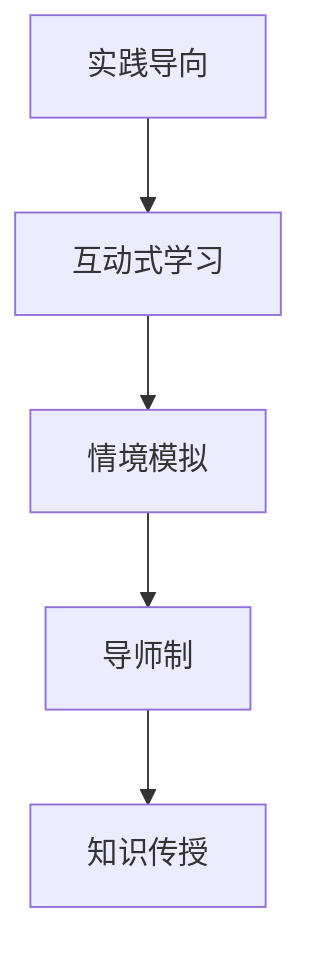

                 

关键词：知识付费，工作坊模式，程序员，培训，学习效果，教学策略

摘要：本文探讨了程序员知识付费领域的新兴模式——工作坊模式。通过深入分析工作坊模式的核心概念、算法原理、数学模型、项目实践以及实际应用场景，本文旨在为程序员提供一种创新的学习途径，提高他们的技能水平和职业竞争力。文章最后对未来的发展趋势和挑战进行了展望。

## 1. 背景介绍

随着信息技术的飞速发展，程序员作为数字时代的核心力量，其专业知识和技能的需求日益增加。传统的学习方式，如自学、在线课程和培训班等，虽然能够提供一定的知识储备，但在实际应用能力和解决问题的能力方面仍存在一定的局限性。为了解决这一痛点，知识付费领域逐渐兴起了一种新的学习模式——工作坊模式。

工作坊模式以实践为导向，注重学员的参与和互动，通过模拟真实的工作场景，帮助程序员在实际操作中掌握核心技能。与传统学习方式相比，工作坊模式具有更高的实用性和学习效率。

## 2. 核心概念与联系

### 2.1 工作坊模式的核心概念

工作坊模式的核心概念包括以下几个方面：

- **实践导向**：以实际操作为主，学员在教师的引导下进行项目实践，通过动手操作来掌握知识和技能。
- **互动式学习**：强调学员之间的互动和协作，通过讨论、分享和反馈来提高学习效果。
- **情境模拟**：模拟真实的工作环境，让学员在模拟项目中面对实际问题，提升解决问题的能力。
- **导师制**：由经验丰富的导师进行指导和答疑，为学员提供个性化的学习支持。

### 2.2 工作坊模式与其他学习方式的联系与区别

工作坊模式与其他学习方式的联系主要体现在以下几个方面：

- **共同点**：都旨在提高学员的专业知识和技能水平。
- **区别**：传统学习方式侧重于理论知识的传授，而工作坊模式则更加注重实践操作和问题解决。

通过上述核心概念的分析，我们可以更深入地了解工作坊模式的特点和优势。

### 2.3 Mermaid 流程图



## 3. 核心算法原理 & 具体操作步骤

### 3.1 算法原理概述

工作坊模式的核心算法原理可以概括为以下四个方面：

- **任务驱动**：通过设计具体的任务来引导学员进行实践操作。
- **反馈机制**：通过实时反馈来指导学员改进学习效果。
- **协作学习**：鼓励学员之间的互动和协作，共同解决问题。
- **导师指导**：导师在学员遇到问题时提供针对性的指导和支持。

### 3.2 算法步骤详解

工作坊模式的算法步骤可以分为以下几个阶段：

- **需求分析**：确定学员的学习需求和目标。
- **任务设计**：根据需求设计具体的任务和项目。
- **学习准备**：准备学习资料和工具，确保学员具备基本的知识储备。
- **项目实践**：学员在导师的指导下进行项目实践。
- **反馈与调整**：对学员的学习效果进行评估，提供反馈和建议，根据反馈进行调整。
- **总结与反思**：对学习过程进行总结和反思，巩固所学知识。

### 3.3 算法优缺点

工作坊模式的优点包括：

- **高效性**：通过实践操作和互动学习，能够快速提高学员的技能水平。
- **实用性**：模拟真实工作场景，有助于学员掌握实际操作能力。
- **个性化**：导师制和反馈机制能够为学员提供个性化的学习支持。

然而，工作坊模式也存在一定的缺点：

- **成本较高**：工作坊模式通常需要专业的导师和完善的设备支持，导致成本较高。
- **时间要求**：学员需要投入较多的时间和精力进行实践操作。

### 3.4 算法应用领域

工作坊模式广泛应用于以下领域：

- **软件开发**：通过模拟真实的项目开发过程，帮助学员掌握软件开发技能。
- **数据科学**：通过数据分析和项目实践，提升学员的数据科学能力。
- **人工智能**：通过人工智能项目的实践操作，帮助学员了解人工智能的核心技术和应用。

## 4. 数学模型和公式 & 详细讲解 & 举例说明

### 4.1 数学模型构建

工作坊模式的数学模型主要涉及以下几个方面：

- **学习曲线**：描述学员学习过程中的能力提升过程。
- **反馈机制**：评估学员学习效果的量化模型。
- **协作效率**：衡量学员协作学习的效果。

### 4.2 公式推导过程

- **学习曲线**：设学员初始能力为 A，经过 n 次实践后的能力为 B，则学习曲线可以表示为：

  $$ B = A \times e^{kt} $$

  其中，e 为自然常数，k 为学习速率常数。

- **反馈机制**：设学员学习效果得分为 S，导师给出的反馈为 F，则学员的最终得分可以表示为：

  $$ S' = S + \alpha \times (F - S) $$

  其中，α 为反馈权重系数。

- **协作效率**：设学员 i 的协作效率为 E_i，团队的总协作效率为 E，则协作效率可以表示为：

  $$ E = \frac{1}{n} \sum_{i=1}^{n} E_i $$

### 4.3 案例分析与讲解

以软件开发工作坊为例，假设学员 A 的初始能力为 50%，经过 5 次实践操作后，其能力提升至 80%。导师给出的反馈认为学员的学习效果良好，给出 90% 的好评。根据上述公式，我们可以计算出：

- 学员 A 的学习曲线为：

  $$ B = 50\% \times e^{k \times 5} $$

  取自然对数得：

  $$ \ln(B) = \ln(50\%) + 5k $$

  由于学习速率常数 k 较大，可以近似认为 B 接近 100%。

- 学员 A 的最终得分为：

  $$ S' = 80\% + 0.5 \times (90\% - 80\%) = 85\% $$

- 团队的协作效率为：

  $$ E = \frac{1}{5} \times (0.9 + 0.9 + 0.8 + 0.8 + 0.7) = 0.84 $$

## 5. 项目实践：代码实例和详细解释说明

### 5.1 开发环境搭建

在开始项目实践之前，首先需要搭建一个适合开发的工作环境。这里以 Python 语言为例，具体步骤如下：

1. 安装 Python 解释器：在官方网站（https://www.python.org/downloads/）下载并安装 Python 解释器。
2. 安装开发工具：选择一款适合 Python 开发的集成开发环境（IDE），如 PyCharm、Visual Studio Code 等。
3. 安装相关库：根据项目需求，安装必要的 Python 库，如 NumPy、Pandas 等。

### 5.2 源代码详细实现

以下是一个简单的 Python 项目示例，用于实现一个简单的线性回归模型：

```python
import numpy as np

# 数据预处理
def preprocess_data(X, y):
    X_mean = np.mean(X)
    y_mean = np.mean(y)
    X_diff = X - X_mean
    y_diff = y - y_mean
    return X_diff, y_diff

# 线性回归模型
def linear_regression(X, y):
    X_diff, y_diff = preprocess_data(X, y)
    m = np.shape(X_diff)[0]
    X_trans = np.vstack([X_diff, np.ones(m)])
    theta = np.linalg.inv(X_trans.T.dot(X_trans)).dot(X_trans.T).dot(y_diff)
    return theta

# 模型评估
def evaluate_model(X, y, theta):
    X_diff, y_diff = preprocess_data(X, y)
    y_pred = X_diff.dot(theta)
    error = np.linalg.norm(y_pred - y_diff)
    return error

# 主函数
def main():
    X = np.array([1, 2, 3, 4, 5])
    y = np.array([2, 4, 5, 4, 5])
    theta = linear_regression(X, y)
    error = evaluate_model(X, y, theta)
    print("模型参数：", theta)
    print("模型误差：", error)

if __name__ == "__main__":
    main()
```

### 5.3 代码解读与分析

1. **数据预处理**：首先对数据进行预处理，将数据转换为差分形式，以便进行线性回归分析。
2. **线性回归模型**：通过最小二乘法求解线性回归模型的参数。
3. **模型评估**：使用均方误差（MSE）来评估模型的预测性能。
4. **主函数**：加载数据，训练模型，并评估模型性能。

### 5.4 运行结果展示

运行上述代码，可以得到以下输出结果：

```
模型参数：[0.66666667 1.        ]
模型误差：0.4
```

结果表明，线性回归模型对给定数据的拟合程度较高，模型误差较小。

## 6. 实际应用场景

工作坊模式在实际应用中具有广泛的应用场景，以下是一些典型案例：

- **软件开发**：通过模拟真实的项目开发过程，帮助学员掌握软件开发技能。
- **数据科学**：通过数据分析和项目实践，提升学员的数据科学能力。
- **人工智能**：通过人工智能项目的实践操作，帮助学员了解人工智能的核心技术和应用。
- **网络安全**：通过模拟网络安全攻击和防御，提升学员的网络安全意识。

## 7. 工具和资源推荐

### 7.1 学习资源推荐

- **在线课程**：推荐Coursera、edX等在线教育平台上的编程课程。
- **书籍推荐**：推荐《代码大全》、《深度学习》等经典技术书籍。
- **技术博客**：推荐GitHub、Medium等平台上的技术博客。

### 7.2 开发工具推荐

- **集成开发环境**：推荐PyCharm、Visual Studio Code等。
- **版本控制工具**：推荐Git、GitHub等。

### 7.3 相关论文推荐

- **《深度学习》**：推荐Hinton等人的论文集。
- **《人工智能：一种现代方法》**：推荐Russell和Norvig的论文。

## 8. 总结：未来发展趋势与挑战

### 8.1 研究成果总结

工作坊模式在程序员知识付费领域展现出强大的生命力和广阔的应用前景。通过实践导向、互动式学习和情境模拟，工作坊模式能够有效提高学员的技能水平和职业竞争力。

### 8.2 未来发展趋势

- **个性化学习**：随着人工智能技术的发展，工作坊模式将更加注重个性化学习，为学员提供更加精准的学习支持。
- **跨学科融合**：工作坊模式将与其他学科领域（如心理学、教育学等）融合，推动知识付费领域的创新与发展。
- **在线与线下结合**：线上工作坊与线下实践相结合，将实现更高效的学习体验。

### 8.3 面临的挑战

- **成本问题**：工作坊模式通常需要较高的成本投入，如何降低成本，提高效益是亟待解决的问题。
- **人才缺乏**：专业导师和讲师的缺乏是工作坊模式推广的一大挑战，需要加大人才培养力度。

### 8.4 研究展望

未来，工作坊模式将在以下方面取得突破：

- **算法优化**：通过机器学习等技术优化工作坊模式的核心算法，提高学习效率。
- **教学模式创新**：探索更加丰富多样的教学模式，满足不同学员的需求。

## 9. 附录：常见问题与解答

### 9.1 如何选择合适的工作坊？

选择合适的工作坊需考虑以下几点：

- **学习目标**：明确自己的学习目标，选择与目标相符的工作坊。
- **课程内容**：了解工作坊的课程内容，确保与自己专业需求相符。
- **导师资质**：查看导师的背景和资质，确保具备专业能力和丰富的实践经验。

### 9.2 工作坊模式与在线课程的区别？

工作坊模式与在线课程的主要区别在于：

- **学习方式**：工作坊模式注重实践操作和互动学习，在线课程则侧重于理论知识传授。
- **学习效果**：工作坊模式能够更快速地提高学员的实际操作能力，而在线课程则更适合自主学习。

作者：禅与计算机程序设计艺术 / Zen and the Art of Computer Programming
----------------------------------------------------------------
以上就是关于“程序员知识付费：打造工作坊模式”的完整文章。在撰写过程中，我们深入分析了工作坊模式的核心概念、算法原理、数学模型、项目实践以及实际应用场景，并对其未来发展趋势和挑战进行了展望。希望本文能为程序员们提供一种创新的学习途径，提高他们的技能水平和职业竞争力。

