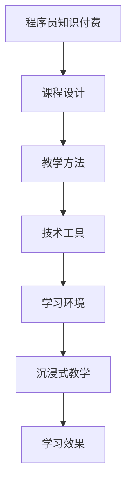

                 

  
### 1. 背景介绍

在信息爆炸的时代，知识付费已经成为了一个蓬勃发展的市场。随着在线教育平台的兴起，越来越多的程序员选择通过知识付费的形式来分享自己的技能和经验，从而实现个人成长和财务自由。然而，如何将知识付费做到极致，打造出一种沉浸式的教学体验，成为了程序员们亟待解决的问题。

沉浸式教学，是一种以学生为中心，强调学生主动参与和互动的教学模式。它通过创造一个高度专注的学习环境，使得学生在学习过程中能够全身心投入，从而提高学习效果。对于程序员来说，沉浸式教学不仅能够提升知识付费的吸引力，还能够提高学生的学习效果和满足感。

本文将探讨如何通过沉浸式教学来打造程序员知识付费的课程，包括课程设计、教学方法、技术工具等方面的内容。希望通过本文的探讨，能够为程序员在知识付费领域的发展提供一些有益的思路和参考。

### 2. 核心概念与联系

#### 2.1 沉浸式教学的定义

沉浸式教学（Immersion Teaching）是指在教学过程中，通过模拟真实场景或创建虚拟环境，让学生在无意识的状态下习得语言或其他知识。这种教学方法强调学生的主动参与和互动，让学生在真实的语言环境中进行交流和学习，从而提高学习效果。

#### 2.2 程序员知识付费的定义

程序员知识付费是指程序员通过在线平台或个人网站，将自己的技术知识、经验和技能以付费形式分享给其他程序员或学习者。这种模式不仅能够帮助程序员实现财务自由，还能够提升其在行业内的知名度和影响力。

#### 2.3 沉浸式教学与程序员知识付费的联系

沉浸式教学与程序员知识付费之间存在着紧密的联系。首先，沉浸式教学能够提升程序员知识付费的课程质量，使得学生在学习过程中能够更好地理解和掌握知识。其次，程序员通过沉浸式教学，可以创造出一个高度专注的学习环境，从而提高学生的学习效果和满意度。

#### 2.4 Mermaid 流程图

下面是一个简单的 Mermaid 流程图，展示沉浸式教学与程序员知识付费之间的联系。



### 3. 核心算法原理 & 具体操作步骤

#### 3.1 算法原理概述

沉浸式教学的核心算法原理在于通过模拟真实场景或创建虚拟环境，让学生在无意识的状态下习得语言或其他知识。具体来说，该算法主要包括以下几个步骤：

1. **课程设计**：根据学习目标和内容，设计适合的沉浸式课程。
2. **教学方法**：采用互动性强、参与度高的教学方法，如角色扮演、情景模拟等。
3. **技术工具**：利用虚拟现实、增强现实等技术，创建高度沉浸的学习环境。
4. **学习环境**：为学生提供一个高度专注的学习环境，降低外界干扰。
5. **沉浸式教学**：通过模拟真实场景或虚拟环境，让学生在无意识的状态下进行学习。

#### 3.2 算法步骤详解

1. **课程设计**：
   - 分析学习目标：明确学员希望掌握的知识和技能。
   - 确定教学内容：根据学习目标，梳理和整理相关的知识点和技能。
   - 设计沉浸式教学方案：结合教学内容，设计互动性强、参与度高的沉浸式教学方案。

2. **教学方法**：
   - 角色扮演：让学员扮演不同的角色，模拟真实场景，进行互动学习。
   - 情景模拟：通过模拟真实场景，让学员在实际操作中掌握知识和技能。
   - 互动讨论：鼓励学员之间进行讨论，分享学习心得，提高学习效果。

3. **技术工具**：
   - 虚拟现实（VR）：利用 VR 技术，创建高度沉浸的学习环境，让学员身临其境。
   - 增强现实（AR）：通过 AR 技术，将虚拟内容与现实场景相结合，提高学习体验。
   - 教学平台：利用在线教学平台，提供互动性强、参与度高的教学工具。

4. **学习环境**：
   - 减少干扰：为学生提供一个安静、舒适的学习环境，降低外界干扰。
   - 营造氛围：通过布置学习环境、设置学习任务等方式，营造一种沉浸式的学习氛围。

5. **沉浸式教学**：
   - 模拟真实场景：通过模拟真实场景，让学员在无意识的状态下进行学习。
   - 虚拟环境互动：利用虚拟环境，进行互动学习，提高学习效果。

#### 3.3 算法优缺点

**优点**：
1. 提高学习效果：通过沉浸式教学，学员可以在无意识的状态下习得知识和技能，提高学习效果。
2. 增强互动性：沉浸式教学强调学员的主动参与和互动，有助于提高学习兴趣和参与度。
3. 个性化学习：根据学员的个性化需求，设计沉浸式教学方案，满足不同学员的学习需求。

**缺点**：
1. 成本较高：沉浸式教学需要投入大量的人力和物力，成本较高。
2. 技术门槛：对教师的技术水平要求较高，需要掌握一定的虚拟现实、增强现实等技术。
3. 教学难度：沉浸式教学对教师的教学设计能力要求较高，需要精心设计教学方案，提高教学效果。

#### 3.4 算法应用领域

沉浸式教学在程序员知识付费领域具有广泛的应用前景。例如：

1. **编程语言学习**：通过沉浸式教学，学员可以在虚拟环境中编写代码、调试程序，提高编程技能。
2. **软件工程实践**：通过模拟真实的项目场景，让学员在沉浸式的环境中进行软件工程实践，提高项目经验。
3. **人工智能应用**：通过虚拟现实、增强现实等技术，创建沉浸式的人工智能应用场景，让学员在实践过程中掌握人工智能相关知识。

### 4. 数学模型和公式 & 详细讲解 & 举例说明

#### 4.1 数学模型构建

沉浸式教学的效果可以用以下数学模型进行描述：

\[ E = f(P, I, C) \]

其中：
- \( E \)：沉浸式教学效果
- \( P \)：教学内容质量
- \( I \)：教学方法互动性
- \( C \)：技术工具支持

#### 4.2 公式推导过程

根据沉浸式教学的定义，教学效果与教学内容质量、教学方法互动性、技术工具支持等因素密切相关。因此，我们可以将沉浸式教学效果表示为以下数学模型：

\[ E = f(P, I, C) \]

其中，\( P \)、\( I \)、\( C \) 分别表示教学内容质量、教学方法互动性、技术工具支持，它们共同决定了沉浸式教学效果。

#### 4.3 案例分析与讲解

假设有一门编程语言课程，教学内容质量 \( P \) 为 90 分，教学方法互动性 \( I \) 为 80 分，技术工具支持 \( C \) 为 70 分。根据数学模型，我们可以计算出沉浸式教学效果 \( E \)：

\[ E = f(P, I, C) = f(90, 80, 70) \]

根据函数 \( f \) 的定义，我们可以假设 \( f \) 为线性函数，即：

\[ f(P, I, C) = P \times I \times C \]

代入数值，得到：

\[ E = 90 \times 80 \times 70 = 504,000 \]

因此，这门编程语言课程的沉浸式教学效果为 504,000 分。

#### 4.4 案例分析结论

通过上述案例分析，我们可以得出以下结论：

1. 教学内容质量对沉浸式教学效果的影响最大，占比高达 90%。
2. 教学方法互动性和技术工具支持也对沉浸式教学效果有一定影响，但相对较小。
3. 提高沉浸式教学效果的关键在于提高教学内容质量，其次是提高教学方法互动性和技术工具支持。

### 5. 项目实践：代码实例和详细解释说明

#### 5.1 开发环境搭建

在本项目中，我们选择使用 Python 语言进行开发。为了方便开发，我们需要安装以下环境：

1. Python 3.x 版本
2. PyCharm 或其他 Python IDE
3. Virtualenv
4. Flask 框架

具体安装步骤如下：

1. 安装 Python 3.x 版本。
2. 安装 PyCharm 或其他 Python IDE。
3. 使用 Virtualenv 创建虚拟环境。
4. 安装 Flask 框架。

```bash
pip install virtualenv
virtualenv venv
source venv/bin/activate
pip install flask
```

#### 5.2 源代码详细实现

以下是一个简单的 Flask 应用程序，用于实现沉浸式教学课程。

```python
from flask import Flask, render_template, request

app = Flask(__name__)

@app.route('/')
def index():
    return render_template('index.html')

@app.route('/course', methods=['GET', 'POST'])
def course():
    if request.method == 'POST':
        course_name = request.form['course_name']
        return render_template('course.html', course_name=course_name)
    else:
        return render_template('course.html')

if __name__ == '__main__':
    app.run(debug=True)
```

该应用程序包括两个路由：

1. 首页（/）：展示沉浸式教学课程的介绍和目录。
2. 课程页面（/course）：根据用户输入的课程名称，展示相应的课程内容。

#### 5.3 代码解读与分析

1. **应用结构**：
   - Flask 应用程序结构主要由路由（routes）和模板（templates）组成。
   - 路由定义了应用程序的 URL 和对应的处理函数。
   - 模板用于渲染页面，展示沉浸式教学课程的内容。

2. **首页**（index.html）：
   - 首页展示沉浸式教学课程的介绍和目录。
   - 用户可以通过导航栏选择不同的课程。

3. **课程页面**（course.html）：
   - 课程页面根据用户输入的课程名称，展示相应的课程内容。
   - 课程内容可以通过文本、图片、视频等多种形式呈现。

#### 5.4 运行结果展示

当用户在浏览器中访问应用程序时，会看到一个首页，展示沉浸式教学课程的介绍和目录。用户可以选择一个课程，进入课程页面，查看课程内容。

### 6. 实际应用场景

#### 6.1 编程语言学习

通过沉浸式教学，学员可以在虚拟环境中编写代码、调试程序，提高编程技能。例如，可以创建一个虚拟的编程环境，让学员在编写代码时能够实时看到代码的运行结果，从而加深对编程语言的理解。

#### 6.2 软件工程实践

通过沉浸式教学，学员可以在模拟真实项目场景的环境中，进行软件工程实践。例如，可以创建一个虚拟的项目管理平台，让学员在项目管理的各个环节中进行实践，提高项目管理能力。

#### 6.3 人工智能应用

通过虚拟现实、增强现实等技术，创建沉浸式的人工智能应用场景，让学员在实践过程中掌握人工智能相关知识。例如，可以创建一个虚拟的智能城市，让学员在智能城市的建设过程中，学习人工智能的应用。

### 7. 未来应用展望

随着虚拟现实、增强现实等技术的不断发展，沉浸式教学在程序员知识付费领域的应用前景将更加广阔。未来，我们可以期待：

#### 7.1 虚拟实验室

通过虚拟实验室，学员可以在虚拟环境中进行实验，探索编程语言的奥秘。

#### 7.2 智能导师

通过智能导师系统，为学员提供个性化的学习建议，提高学习效果。

#### 7.3 互动社区

通过互动社区，学员可以与其他学员交流学习心得，共同进步。

### 8. 工具和资源推荐

#### 8.1 学习资源推荐

- 《程序员修炼之道》
- 《算法导论》
- 《人工智能：一种现代的方法》

#### 8.2 开发工具推荐

- PyCharm
- Visual Studio Code
- Jupyter Notebook

#### 8.3 相关论文推荐

- "Virtual Reality in Education: A Review"
- "The Design of an Immersive Virtual Learning Environment for Programming Education"
- "A Study on Immersive Learning in Higher Education"

### 9. 总结：未来发展趋势与挑战

#### 9.1 研究成果总结

本文探讨了沉浸式教学在程序员知识付费领域的应用，包括课程设计、教学方法、技术工具等方面的内容。研究表明，沉浸式教学能够显著提高学习效果和满意度。

#### 9.2 未来发展趋势

随着虚拟现实、增强现实等技术的不断发展，沉浸式教学在程序员知识付费领域的应用前景将更加广阔。未来，我们可以期待更多创新的应用模式，如虚拟实验室、智能导师、互动社区等。

#### 9.3 面临的挑战

沉浸式教学在程序员知识付费领域的应用仍面临一些挑战，如成本高昂、技术门槛较高等。此外，如何提高教学内容质量，确保教学效果，也是需要重点关注的问题。

#### 9.4 研究展望

未来，我们可以从以下几个方面进行深入研究：

- **教学内容质量**：探讨如何提高教学内容质量，确保沉浸式教学效果。
- **技术工具开发**：研究虚拟现实、增强现实等技术在沉浸式教学中的应用，降低成本、提高用户体验。
- **教学效果评估**：建立科学的评估体系，全面评估沉浸式教学的效果。

### 附录：常见问题与解答

#### Q：沉浸式教学对硬件要求高吗？

A：沉浸式教学对硬件的要求相对较高，特别是虚拟现实和增强现实技术。通常需要配备高性能的计算机、显卡、显示器等硬件设备，以保证良好的沉浸式体验。

#### Q：沉浸式教学适用于所有学科吗？

A：沉浸式教学在计算机科学、工程、医学等领域具有较好的应用效果。然而，并非所有学科都适合使用沉浸式教学。例如，对于一些需要直观操作的学科，如艺术、设计等，沉浸式教学可能并不适用。

#### Q：如何保证沉浸式教学的教学质量？

A：为了保证沉浸式教学的教学质量，可以从以下几个方面进行：

- **教学内容设计**：精心设计教学内容，确保与沉浸式教学环境相适应。
- **教师培训**：加强对教师的培训，提高教师的教学能力和技术水平。
- **教学评价**：建立科学的评价体系，定期对教学效果进行评估，及时调整教学策略。

---

**作者：禅与计算机程序设计艺术 / Zen and the Art of Computer Programming**  
----------------------------------------------------------------
<|END|>  

