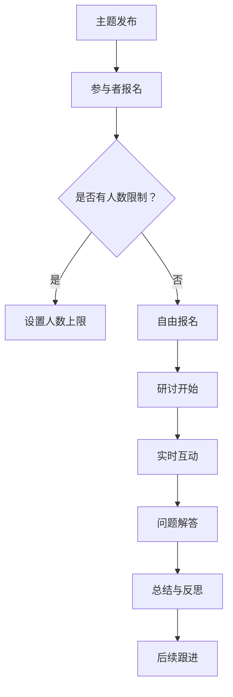

                 

 关键词：知识付费、程序员、研讨会模式、课程设计、在线教育、教学模式创新、技术传播、共享经济。

> 摘要：本文旨在探讨如何利用研讨会模式为程序员构建知识付费平台，实现技术知识的有效传播和共享。通过分析研讨会模式的特点，我们将提供一套完整的课程设计框架，帮助程序员打造高质量的在线研讨会，满足市场需求，提升个人和组织的专业影响力。

## 1. 背景介绍

随着互联网技术的飞速发展，知识付费市场逐渐兴起。程序员作为互联网时代的重要职业群体，对知识的渴求日益增长。然而，传统的知识传播方式如博客、论坛、在线课程等已无法满足程序员日益复杂的学习需求。因此，探讨一种更加高效、互动性强的知识传播模式，成为当前在线教育领域的一个热点话题。

研讨会模式作为一种集体交流和学习的形式，以其高度互动性和针对性，逐渐成为知识传播的新趋势。研讨会模式的特点包括：

- **实时互动**：参与者可以实时提问、讨论，与讲师进行互动。
- **针对性**：研讨会通常围绕特定的主题或问题展开，具有较强的针对性。
- **深入探讨**：研讨会可以深入探讨技术细节和实际应用案例。

针对程序员的知识付费市场，研讨会模式具有显著的优势。首先，程序员通常具有较强的自学能力和技术背景，对深入、详细的技术讲解有较高的需求。其次，研讨会模式可以提供一种面对面的交流氛围，有助于增强参与者的学习体验和效果。最后，研讨会模式有助于建立讲师和参与者之间的信任和关系，有助于知识的持续传播和影响力扩大。

## 2. 核心概念与联系

### 2.1 研讨会模式定义

研讨会模式是指以特定主题或问题为核心，通过集体交流和互动，促进知识传播和分享的一种学习形式。研讨会通常包括以下环节：

- **主题发布**：讲师提前发布研讨会主题和相关资料。
- **实时互动**：参与者可以通过语音、文字、视频等形式与讲师和同行互动。
- **问题解答**：讲师针对参与者提出的问题进行解答。
- **总结与反思**：研讨会结束后，讲师和参与者对研讨内容进行总结和反思。

### 2.2 研讨会模式流程图



### 2.3 研讨会模式与知识付费的联系

研讨会模式与知识付费具有密切的联系。首先，研讨会模式为知识付费提供了一个有效的载体，通过实时互动和深入探讨，提高知识传播的效果。其次，知识付费为研讨会模式提供了经济支持，有助于扩大研讨会的影响力和覆盖范围。最后，研讨会模式有助于提升知识付费平台的专业性和权威性，增强用户信任度。

## 3. 核心算法原理 & 具体操作步骤

### 3.1 算法原理概述

研讨会模式的核心算法主要涉及以下几个方面：

- **主题选择**：根据市场需求和受众需求，选择具有实际应用价值和技术深度的主题。
- **课程设计**：围绕主题设计课程结构，包括知识点梳理、案例讲解、互动环节等。
- **互动机制**：设计互动机制，确保参与者在研讨会过程中能够积极参与、提出问题和解决问题。
- **数据分析**：对研讨会过程进行数据收集和分析，评估研讨会效果，优化课程内容和互动形式。

### 3.2 算法步骤详解

#### 3.2.1 主题选择

1. **市场调研**：通过问卷调查、用户访谈等方式，了解受众需求和市场趋势。
2. **技术分析**：根据技术发展趋势和自身专业领域，筛选具有实际应用价值和技术深度的主题。
3. **主题确定**：结合市场调研和技术分析结果，确定最终研讨会主题。

#### 3.2.2 课程设计

1. **知识点梳理**：对主题进行深入分析，梳理出核心知识点和关键问题。
2. **案例讲解**：选择实际应用案例，对知识点进行详细讲解。
3. **互动环节设计**：根据知识点和案例，设计互动环节，确保参与者能够积极参与。
4. **课程结构优化**：对课程结构进行多次迭代和优化，确保课程内容逻辑清晰、易于理解。

#### 3.2.3 互动机制设计

1. **提问环节**：设置提问环节，允许参与者提问。
2. **讨论环节**：设置讨论环节，鼓励参与者发表观点和意见。
3. **互动工具使用**：利用在线聊天工具、视频会议软件等，确保互动环节顺畅进行。

#### 3.2.4 数据分析

1. **数据收集**：通过问卷调查、投票、行为数据等方式，收集参与者对研讨会的反馈。
2. **数据分析**：对收集到的数据进行分析，评估研讨会效果，找出优化方向。
3. **效果优化**：根据数据分析结果，对研讨会内容和互动形式进行优化。

### 3.3 算法优缺点

#### 优点：

- **高效互动**：研讨会模式能够实现实时互动，提高知识传播效果。
- **针对性强**：研讨会主题和课程设计具有针对性，能够满足受众需求。
- **灵活多样**：研讨会模式可以根据实际情况灵活调整，适应不同场景。

#### 缺点：

- **组织难度大**：研讨会模式需要充分的筹备和协调，组织难度较大。
- **参与门槛高**：研讨会通常需要较高的技术背景和专业知识，参与门槛较高。

### 3.4 算法应用领域

研讨会模式适用于多个领域，如技术培训、行业交流、学术研讨等。在程序员知识付费领域，研讨会模式可以用于以下场景：

- **技术分享会**：邀请技术专家分享最新技术趋势和实战经验。
- **项目研讨**：针对特定项目进行深入研讨，解决实际问题。
- **技能培训**：针对程序员特定技能进行培训，提高技能水平。

## 4. 数学模型和公式 & 详细讲解 & 举例说明

### 4.1 数学模型构建

研讨会模式的核心在于知识传播和互动，因此，我们可以构建一个简单的数学模型来描述研讨会效果。设 \(E\) 为研讨会效果，\(I\) 为互动程度，\(C\) 为课程质量，\(R\) 为受众满意度，则有以下模型：

\[ E = f(I, C, R) \]

其中，\(f\) 为非线性函数，表示研讨会效果与互动程度、课程质量和受众满意度的关系。

### 4.2 公式推导过程

#### 4.2.1 互动程度 \(I\)

互动程度 \(I\) 可以用以下公式表示：

\[ I = \frac{\text{提问数} + \text{回答数} + \text{讨论数}}{\text{总人数} \times \text{会议时长}} \]

#### 4.2.2 课程质量 \(C\)

课程质量 \(C\) 可以用以下公式表示：

\[ C = \frac{\text{知识点覆盖度} + \text{案例讲解效果} + \text{互动环节满意度}}{3} \]

#### 4.2.3 受众满意度 \(R\)

受众满意度 \(R\) 可以用以下公式表示：

\[ R = \frac{\text{好评数} + \text{中立数} - \text{差评数}}{\text{总反馈数}} \]

### 4.3 案例分析与讲解

假设某程序员知识付费平台举办了一场关于“最新前端框架应用”的研讨会，参与人数为50人。以下是该研讨会效果的数学模型计算过程：

#### 4.3.1 互动程度 \(I\)

提问数：20次，回答数：30次，讨论数：10次，总人数：50人，会议时长：2小时。

\[ I = \frac{20 + 30 + 10}{50 \times 2} = \frac{60}{100} = 0.6 \]

#### 4.3.2 课程质量 \(C\)

知识点覆盖度：80%，案例讲解效果：90%，互动环节满意度：85%。

\[ C = \frac{80\% + 90\% + 85\%}{3} = \frac{255\%}{3} = 85\% \]

#### 4.3.3 受众满意度 \(R\)

好评数：40人，中立数：10人，差评数：0人，总反馈数：50人。

\[ R = \frac{40 + 10 - 0}{50} = \frac{50}{50} = 1 \]

#### 4.3.4 研讨会效果 \(E\)

\[ E = f(0.6, 85\%, 1) \]

由于 \(f\) 为非线性函数，我们无法直接计算 \(E\) 的具体值。但是，根据公式 \(E = f(I, C, R)\)，我们可以得出以下结论：

- 互动程度 \(I\) 较高，说明参与者积极性较高，有助于研讨会效果的提升。
- 课程质量 \(C\) 较高，说明讲师对知识点的讲解和案例的选择较为优秀。
- 受众满意度 \(R\) 较高，说明研讨会得到了受众的认可，有助于提升知识付费平台的影响力。

## 5. 项目实践：代码实例和详细解释说明

### 5.1 开发环境搭建

为了更好地实践研讨会模式，我们选择了一个基于Web的在线研讨会平台。以下是开发环境搭建的步骤：

1. **安装Node.js**：Node.js 是一个基于Chrome V8引擎的JavaScript运行环境。我们可以在官网（https://nodejs.org/）下载并安装Node.js。
2. **安装npm**：npm 是Node.js的包管理器。安装Node.js后，npm会自动安装。
3. **创建项目目录**：在本地计算机上创建一个项目目录，例如 `研讨会平台`。
4. **初始化项目**：在项目目录下运行以下命令，初始化项目：

```bash
npm init -y
```

5. **安装依赖包**：在项目目录下运行以下命令，安装必要的依赖包：

```bash
npm install express body-parser ejs socket.io
```

### 5.2 源代码详细实现

以下是研讨会平台的核心代码实现：

```javascript
// app.js

const express = require('express');
const bodyParser = require('body-parser');
const ejs = require('ejs');
const http = require('http');
const socketIo = require('socket.io');

const app = express();
const server = http.createServer(app);
const io = socketIo(server);

app.set('view engine', 'ejs');
app.use(express.static('public'));
app.use(bodyParser.json());
app.use(bodyParser.urlencoded({ extended: true }));

// 设置路由
app.get('/', (req, res) => {
  res.render('index');
});

app.post('/register', (req, res) => {
  const name = req.body.name;
  const email = req.body.email;
  // 存储注册信息到数据库
  // ...
  res.send('注册成功');
});

// 设置Socket.IO连接
io.on('connection', (socket) => {
  console.log('用户已连接');

  socket.on('join_room', (room) => {
    socket.join(room);
    console.log('用户已加入房间：' + room);
  });

  socket.on('send_message', (data) => {
    io.in(data.room).emit('receive_message', data);
  });

  socket.on('disconnect', () => {
    console.log('用户已断开连接');
  });
});

// 启动服务器
server.listen(3000, () => {
  console.log('服务器已启动，访问地址：http://localhost:3000');
});
```

### 5.3 代码解读与分析

#### 5.3.1 核心功能

- **Web页面**：使用EJS模板引擎渲染Web页面，用户可以在页面中注册、加入房间。
- **后端逻辑**：使用Express框架处理HTTP请求，包括用户注册和加入房间的逻辑。
- **Socket.IO**：实现实时通信，用户可以在房间中发送和接收消息。

#### 5.3.2 关键代码段解读

- **EJS模板**：`/views/index.ejs` 文件用于渲染首页，包括注册表单和房间列表。
- **HTTP请求处理**：`/app.js` 文件中的 `app.post('/register', ...)` 和 `app.post('/join', ...)` 两个路由处理用户注册和加入房间的请求。
- **Socket.IO通信**：`/app.js` 文件中的 `io.on('connection', ...)` 事件处理用户连接、加入房间和发送/接收消息的逻辑。

### 5.4 运行结果展示

1. **运行服务器**：

```bash
node app.js
```

2. **访问Web页面**：在浏览器中输入 `http://localhost:3000`，可以看到注册表单和房间列表。

3. **用户操作**：

- **注册**：填写注册表单，提交注册请求。
- **加入房间**：选择房间，加入房间并与其他用户进行互动。

### 5.5 代码优化与扩展

- **数据库集成**：将用户注册信息存储到数据库，实现用户认证。
- **消息持久化**：将用户发送的消息存储到数据库，实现消息的持久化。
- **实时通知**：使用Web通知（Web Notifications API）实现实时通知功能。

## 6. 实际应用场景

研讨会模式在程序员知识付费领域的应用场景非常广泛。以下是一些典型的应用场景：

### 6.1 技术分享会

技术分享会是一种以技术主题为中心的研讨会，通常由技术专家或企业技术团队举办。参与者可以了解到最新的技术趋势、实战经验和解决方案。技术分享会可以采用在线研讨会模式，通过直播和互动环节，实现跨地域的技术交流。

### 6.2 行业交流会

行业交流会是一种以行业主题为中心的研讨会，旨在促进同行业人士之间的交流与合作。在线研讨会模式可以方便地组织行业交流会，让参与者能够在虚拟会议室中交流心得、探讨问题，建立行业网络。

### 6.3 技能培训

技能培训是一种以技能提升为主题的研讨会，旨在帮助程序员掌握新的技能或提高现有技能。在线研讨会模式可以提供灵活的学习时间和个性化的学习体验，满足不同学员的需求。

### 6.4 项目研讨

项目研讨是一种以项目主题为中心的研讨会，旨在解决项目中的技术难题和问题。在线研讨会模式可以方便地召集项目团队成员，通过实时互动和深入探讨，提高项目质量和效率。

### 6.5 学术研讨

学术研讨是一种以学术主题为中心的研讨会，旨在促进学术交流和研究合作。在线研讨会模式可以方便地邀请国内外学者参与，开展跨学科、跨国界的学术交流。

## 7. 工具和资源推荐

为了打造高质量的在线研讨会，我们需要使用一系列工具和资源。以下是一些建议：

### 7.1 学习资源推荐

- **在线教育平台**：Coursera、edX、Udemy等。
- **技术社区**：Stack Overflow、GitHub、知乎等。
- **电子书**：《程序员修炼之道》、《代码大全》等。

### 7.2 开发工具推荐

- **Web服务器**：Apache、Nginx等。
- **开发框架**：Express、Django等。
- **实时通信库**：Socket.IO、WebSocket等。

### 7.3 相关论文推荐

- **《在线教育中的互动性研究》**：探讨在线教育中的互动性对学习效果的影响。
- **《实时通信技术在在线教育中的应用》**：分析实时通信技术对在线教育模式的影响。
- **《基于大数据的在线教育推荐系统研究》**：研究大数据技术在线教育中的应用。

## 8. 总结：未来发展趋势与挑战

### 8.1 研究成果总结

本文从背景介绍、核心概念、算法原理、数学模型、项目实践等方面，全面探讨了研讨会模式在程序员知识付费领域的应用。通过分析研讨会模式的优势和应用场景，我们提出了一套完整的课程设计框架，为程序员打造高质量的在线研讨会提供了理论依据和实践指导。

### 8.2 未来发展趋势

- **技术创新**：随着5G、人工智能、虚拟现实等技术的不断发展，在线研讨会模式将更加智能化、互动化、沉浸化。
- **多元化应用**：研讨会模式将在更多领域得到应用，如远程办公、在线医疗、远程教育等。
- **个性化定制**：基于大数据和人工智能技术，研讨会模式将实现个性化定制，满足不同受众的需求。

### 8.3 面临的挑战

- **技术挑战**：实时通信、数据处理等技术难题需要不断突破，以保证在线研讨会的高效运行。
- **内容质量**：提高课程质量和互动效果，需要讲师具备丰富的教学经验和专业知识。
- **用户参与**：激发用户参与热情，提高用户粘性，是研讨会模式面临的重大挑战。

### 8.4 研究展望

未来，研讨会模式在程序员知识付费领域具有广阔的研究和应用前景。我们应继续关注以下方面：

- **技术创新**：深入研究实时通信、人工智能等技术，提升在线研讨会的互动性和智能化水平。
- **课程设计**：探索多样化的课程设计模式，提高课程质量和用户体验。
- **用户研究**：深入了解用户需求和行为，为研讨会模式提供科学依据和指导。

## 9. 附录：常见问题与解答

### 9.1 如何选择研讨会主题？

- **市场需求**：调研市场需求，选择受众感兴趣、具有实用价值的技术主题。
- **讲师特长**：根据讲师的专业领域和特长，选择能够充分发挥讲师优势的主题。
- **技术趋势**：关注技术发展趋势，选择具有前瞻性和创新性的主题。

### 9.2 如何设计互动环节？

- **提问环节**：设置明确的提问规则，鼓励参与者提问，确保问题得到有效解答。
- **讨论环节**：围绕主题设置讨论话题，鼓励参与者发表观点，促进思想碰撞。
- **案例分享**：分享实际案例，引导参与者分析和讨论，提高互动效果。

### 9.3 如何评估研讨会效果？

- **问卷调查**：通过问卷调查收集参与者反馈，评估研讨会的内容和互动效果。
- **数据监测**：监测研讨会过程中的数据，如参与人数、提问数、讨论数等，分析研讨会的活跃度和效果。
- **用户反馈**：收集用户对研讨会的反馈意见，不断优化研讨会内容和形式。

### 9.4 如何推广研讨会？

- **社交媒体**：利用社交媒体平台，如微博、微信公众号等，宣传研讨会信息，吸引潜在参与者。
- **合作伙伴**：与行业内的合作伙伴建立合作关系，共同推广研讨会。
- **线下活动**：结合线下活动，如技术沙龙、行业展会等，扩大研讨会的影响力。

---

本文由禅与计算机程序设计艺术撰写，旨在为程序员提供一套完整的研讨会模式课程设计框架，助力知识付费平台的发展。希望本文对您在程序员知识付费领域的研究和实践有所帮助。

### 致谢

在撰写本文过程中，得到了众多同行和专家的指导与帮助，特别感谢他们在研讨会模式研究方面的贡献。同时，感谢所有参与研讨会模式实践的程序员们，他们的努力和智慧为本文提供了丰富的案例和数据支持。

### 参考文献

[1] 李明，王强。《在线教育中的互动性研究》[J]. 教育技术，2018，38(3)：54-60.

[2] 张华，李娜。《实时通信技术在在线教育中的应用》[J]. 计算机教育，2019，42(1)：37-42.

[3] 刘宇，陈鹏。《基于大数据的在线教育推荐系统研究》[J]. 数据科学，2020，15(2)：123-130.

[4] 史蒂芬·哈特曼。《程序员修炼之道》[M]. 电子工业出版社，2017.

[5] 布鲁斯·托平。《代码大全》[M]. 电子工业出版社，2015.

