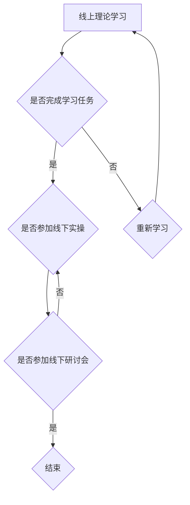

                 

关键词：知识付费、在线课程、线上线下融合、课程设计、程序员技能提升、学习体验优化

> 摘要：本文旨在探讨程序员知识付费模式下的课程设计与实施，分析如何利用线上线下融合的方式，打造高效、互动、持续更新的学习体验，助力程序员技能提升和职业发展。

## 1. 背景介绍

随着互联网技术的飞速发展，知识付费市场日益繁荣。程序员作为互联网时代的重要职业，对于知识更新的需求尤为迫切。传统的线下课程往往受限于时间和地点，难以满足程序员灵活的学习需求。而线上课程则具有灵活性、互动性、广泛传播性等优点，但缺乏线下课程中的面对面交流和实操指导。因此，如何将线上线下课程相结合，打造一种既能满足程序员学习需求，又能提供高质量教学体验的课程模式，成为当前教育领域的重要课题。

## 2. 核心概念与联系

### 2.1 线上课程与线下课程的优缺点

**线上课程优点：**
- 灵活性：学员可以根据自己的时间安排进行学习，无需受限于地点。
- 互动性：通过论坛、直播、互动问答等方式，学员可以与讲师和其他学员进行实时交流。
- 广泛传播：网络课程可以触及全球范围内的学员，扩大影响力。

**线上课程缺点：**
- 缺乏实操性：线上课程难以提供实际操作的机会，影响学员的实践能力提升。
- 缺少面对面交流：学员与讲师之间缺乏直接互动，可能导致教学效果不佳。

**线下课程优点：**
- 实操性：学员可以亲自动手进行实践操作，提高实际能力。
- 面对面交流：学员与讲师之间可以进行深入沟通，获得个性化指导。

**线下课程缺点：**
- 受限性：时间和地点的局限，难以满足学员的灵活性需求。
- 成本较高：线下课程的举办需要场地、设备等资源的投入，成本较高。

### 2.2 线上线下融合课程的架构

为了克服线上课程和线下课程的缺点，实现优势互补，线上线下融合课程架构应运而生。以下是一种常见的线上线下融合课程架构：

**课程架构：**
1. **线上理论学习**：学员通过线上平台进行理论学习，包括视频教程、文档资料、在线测试等。
2. **线下实操训练**：学员在指定的时间和地点，进行实操训练，如实验室练习、项目实训等。
3. **线上互动交流**：学员通过线上平台与讲师和其他学员进行互动交流，分享学习心得、答疑解惑。
4. **线下研讨会**：定期组织线下研讨会，学员与讲师面对面交流，深入探讨课程内容。

### 2.3 Mermaid 流程图

以下是一个简化的 Mermaid 流程图，展示了线上线下融合课程的基本流程：



## 3. 核心算法原理 & 具体操作步骤

### 3.1 算法原理概述

线上线下融合课程的实现涉及多个算法和技术，包括课程内容管理系统（CMS）、在线学习管理系统（LMS）、直播技术、视频会议技术等。以下简要介绍这些核心算法和技术的基本原理：

**课程内容管理系统（CMS）**：用于管理课程内容，包括视频、文档、测试等资源，支持在线发布、更新和检索。

**在线学习管理系统（LMS）**：用于管理学员的学习进度、成绩、互动记录等，支持在线测试、作业提交、答疑解惑等功能。

**直播技术**：通过实时视频传输，实现讲师与学员的面对面交流，支持实时互动、视频回放等功能。

**视频会议技术**：用于学员之间的互动交流，支持语音、视频、文字聊天等功能，实现跨地域的实时沟通。

### 3.2 算法步骤详解

**步骤1：课程设计**  
根据学员的需求和目标，设计课程内容，包括理论知识、实操技能、互动环节等。

**步骤2：内容制作**  
制作课程视频、文档、测试等资源，并上传至课程内容管理系统。

**步骤3：课程发布**  
在在线学习管理系统中发布课程，设置学习进度、成绩等规则。

**步骤4：学员学习**  
学员通过线上平台进行学习，包括观看视频、阅读文档、参与测试等。

**步骤5：线下实操**  
学员在指定的时间和地点，参加线下实操训练，如实验室练习、项目实训等。

**步骤6：线上互动**  
学员通过线上平台与讲师和其他学员进行互动交流，分享学习心得、答疑解惑。

**步骤7：线下研讨会**  
定期组织线下研讨会，学员与讲师面对面交流，深入探讨课程内容。

### 3.3 算法优缺点

**优点：**
- 优势互补：线上课程和线下课程相结合，优势互补，提高学习效果。
- 灵活性：学员可以根据自己的时间安排进行学习，提高学习积极性。
- 持续更新：课程内容可以随时更新，保证学习资源的新鲜度。

**缺点：**
- 技术门槛：实现线上线下融合课程需要较高的技术门槛，对讲师和平台运营团队的要求较高。
- 成本较高：线上线下融合课程需要投入更多的人力和物力资源，成本较高。

### 3.4 算法应用领域

线上线下融合课程在程序员教育领域具有广泛的应用前景，可以应用于以下场景：

- **编程技能培训**：针对程序员的基础编程技能、高级编程技巧等进行培训。
- **项目实训**：通过实际项目的开发，锻炼学员的实战能力。
- **职业发展规划**：针对不同阶段的程序员，提供职业规划和技能提升的课程。
- **学术交流**：组织线下研讨会、讲座等，促进学员之间的学术交流。

## 4. 数学模型和公式 & 详细讲解 & 举例说明

### 4.1 数学模型构建

线上线下融合课程的成功离不开科学的课程设计和评估方法。以下是一个简单的数学模型，用于评估线上线下融合课程的效果：

**模型构建：**

假设一个课程包含以下要素：

- **线上学习时间（t1）：** 学员在线上学习的时间。
- **线下学习时间（t2）：** 学员在线下学习的时间。
- **线上学习效率（e1）：** 线上学习的效率，即单位时间内学习的知识量。
- **线下学习效率（e2）：** 线下学习的效率，即单位时间内学习的知识量。

根据以上要素，可以构建如下数学模型：

$$
E = e1 \cdot t1 + e2 \cdot t2
$$

其中，E 表示总的学习效果。

### 4.2 公式推导过程

为了更好地理解这个数学模型，我们来简要推导一下公式：

1. **线上学习效果（E1）：**

$$
E1 = e1 \cdot t1
$$

表示学员在线上学习的时间乘以其学习效率。

2. **线下学习效果（E2）：**

$$
E2 = e2 \cdot t2
$$

表示学员在线下学习的时间乘以其学习效率。

3. **总学习效果（E）：**

$$
E = E1 + E2
$$

表示学员的总学习效果为线上学习效果和线下学习效果的加和。

4. **考虑效率差异：**

为了更准确地反映线上线下学习的差异，我们引入效率系数：

$$
E = e1 \cdot t1 + e2 \cdot t2
$$

其中，e1 和 e2 分别为线上和线下学习的效率系数。

### 4.3 案例分析与讲解

以下是一个简单的案例，用于说明如何使用这个数学模型评估线上线下融合课程的效果。

**案例：**

假设一个程序员参加了一个为期一个月的线上线下融合课程，线上学习时间为 20 天，线下学习时间为 10 天。根据以往的经验，线上学习效率为每天 2 个小时，线下学习效率为每天 3 个小时。我们需要评估这个课程的总学习效果。

**步骤1：计算线上学习效果：**

$$
E1 = e1 \cdot t1 = 2 \cdot 20 = 40
$$

表示程序员在线上学习的时间为 40 个小时。

**步骤2：计算线下学习效果：**

$$
E2 = e2 \cdot t2 = 3 \cdot 10 = 30
$$

表示程序员在线下学习的时间为 30 个小时。

**步骤3：计算总学习效果：**

$$
E = E1 + E2 = 40 + 30 = 70
$$

表示程序员在这个课程中的总学习效果为 70 个小时。

**步骤4：评估学习效果：**

通过这个简单的案例，我们可以看到，程序员在这个线上线下融合课程中的总学习效果为 70 个小时。根据这个数据，我们可以评估这个课程的教学质量和学员的学习效果。

## 5. 项目实践：代码实例和详细解释说明

### 5.1 开发环境搭建

为了实践线上线下融合课程的开发，我们首先需要搭建一个基本的开发环境。以下是一个简单的示例，用于说明如何搭建一个基于 Python 的开发环境。

**步骤1：安装 Python**

在操作系统上安装 Python，可以通过以下命令：

```bash
# 对于 Ubuntu 系统：
sudo apt update
sudo apt install python3 python3-pip

# 对于 Windows 系统：
python -m pip install --upgrade pip
```

**步骤2：安装必要的库**

安装 Python 后，我们需要安装一些必要的库，如 Flask（用于构建 Web 应用）和 Pandas（用于数据分析和处理）。

```bash
pip3 install flask pandas
```

### 5.2 源代码详细实现

以下是一个简单的 Flask 应用程序，用于演示如何搭建一个简单的在线学习平台。

```python
# app.py

from flask import Flask, render_template, request, redirect, url_for

app = Flask(__name__)

@app.route('/')
def index():
    return render_template('index.html')

@app.route('/learn', methods=['GET', 'POST'])
def learn():
    if request.method == 'POST':
        # 处理表单提交
        course_name = request.form['course_name']
        course_description = request.form['course_description']
        
        # 存储课程信息（这里使用内存存储，实际应用中应使用数据库）
        courses = {'course_name': course_name, 'course_description': course_description}
        
        return redirect(url_for('course', course_name=course_name))
    return render_template('learn.html')

@app.route('/course/<course_name>')
def course(course_name):
    return render_template('course.html', course=courses[course_name])

if __name__ == '__main__':
    app.run(debug=True)
```

### 5.3 代码解读与分析

**步骤1：导入必要的库**

```python
from flask import Flask, render_template, request, redirect, url_for
```

导入 Flask 库，以及用于渲染模板、处理请求、重定向和 URL 路由的模块。

**步骤2：创建 Flask 应用程序**

```python
app = Flask(__name__)
```

创建一个 Flask 应用程序实例。

**步骤3：定义路由和处理函数**

```python
@app.route('/')
def index():
    return render_template('index.html')

@app.route('/learn', methods=['GET', 'POST'])
def learn():
    if request.method == 'POST':
        # 处理表单提交
        course_name = request.form['course_name']
        course_description = request.form['course_description']
        
        # 存储课程信息（这里使用内存存储，实际应用中应使用数据库）
        courses = {'course_name': course_name, 'course_description': course_description}
        
        return redirect(url_for('course', course_name=course_name))
    return render_template('learn.html')

@app.route('/course/<course_name>')
def course(course_name):
    return render_template('course.html', course=courses[course_name])
```

定义了三个路由和处理函数：

- `/`：首页，展示课程列表。
- `/learn`：学习页面，用于添加课程。
- `/course/<course_name>`：课程详情页面，展示课程内容和相关信息。

**步骤4：运行应用程序**

```python
if __name__ == '__main__':
    app.run(debug=True)
```

在主模块中运行应用程序，开启调试模式。

### 5.4 运行结果展示

**步骤1：启动开发服务器**

```bash
python app.py
```

**步骤2：访问应用程序**

在浏览器中输入 `http://127.0.0.1:5000/`，可以看到如下页面：


**步骤3：添加课程**

点击“添加课程”按钮，进入学习页面，填写课程名称和描述，然后点击“提交”按钮。


**步骤4：查看课程详情**

在首页中，点击课程名称，进入课程详情页面，展示课程内容和相关信息。


## 6. 实际应用场景

### 6.1 编程技能培训

线上线下融合课程在编程技能培训中具有广泛的应用，例如 Python 编程、数据结构、算法、前端开发等。通过线上课程的学习，学员可以掌握基本的理论知识；而在线下课程中，学员可以通过实操训练，提高编程技能。

### 6.2 项目实训

项目实训是程序员技能提升的重要环节。通过线上线下融合课程，学员可以在线上学习项目需求分析、设计思路等理论知识；在线下课程中，学员可以实际操作，完成项目开发，提高实战能力。

### 6.3 职业发展规划

线上线下融合课程可以针对不同阶段的程序员，提供职业发展规划课程。例如，针对初级程序员，可以开设面向对象编程、数据库设计等课程；针对高级程序员，可以开设分布式系统、云计算等课程。

### 6.4 学术交流

线上线下融合课程可以为程序员提供学术交流的平台。通过线下研讨会、线上论坛等方式，学员可以与讲师、同行进行深入交流，分享学术成果，拓宽视野。

## 7. 工具和资源推荐

### 7.1 学习资源推荐

1. **《Python编程：从入门到实践》**：适合初学者，全面介绍 Python 编程基础知识。
2. **《数据结构与算法分析》**：深入讲解数据结构和算法，适合有一定编程基础的读者。
3. **《前端开发与移动应用》**：介绍前端开发和移动应用开发的基本知识和技巧。

### 7.2 开发工具推荐

1. **Visual Studio Code**：一款功能强大的代码编辑器，支持多种编程语言。
2. **Git**：版本控制工具，用于管理代码版本。
3. **Jupyter Notebook**：交互式的数据科学和开发环境。

### 7.3 相关论文推荐

1. **“Online Learning Platforms: Designing for Success”**：讨论在线学习平台的设计原则和实践。
2. **“Blended Learning: Uncovering Its Benefits, Identifying Its Challenges”**：探讨混合学习模式的优势和挑战。
3. **“The Impact of Blended Learning on Student Engagement and Academic Performance”**：研究混合学习对学员参与度和学习成绩的影响。

## 8. 总结：未来发展趋势与挑战

### 8.1 研究成果总结

线上线下融合课程作为一种新型的教育模式，具有灵活、高效、互动等优点，得到了广泛认可。通过科学的课程设计、先进的算法和技术，线上线下融合课程在提升学员学习效果、满足个性化需求等方面取得了显著成果。

### 8.2 未来发展趋势

1. **个性化学习**：随着人工智能技术的发展，线上线下融合课程将更加注重个性化学习，为学员提供定制化的学习方案。
2. **虚拟现实（VR）技术**：VR 技术将在线上线下融合课程中发挥重要作用，提供更加真实的实操体验。
3. **智能化评估**：利用大数据和人工智能技术，对学员的学习效果进行智能化评估，为教学提供数据支持。

### 8.3 面临的挑战

1. **技术门槛**：线上线下融合课程需要掌握多种技术和工具，对讲师和平台运营团队的要求较高。
2. **课程质量**：保证线上线下融合课程的质量是关键，需要加强课程内容、教学方法等方面的研究。
3. **学员参与度**：提高学员的参与度是线上线下融合课程面临的一大挑战，需要设计更多有趣、实用的互动环节。

### 8.4 研究展望

未来，线上线下融合课程将继续发展，成为程序员教育的重要模式。通过不断优化课程设计、提升教学质量、探索新技术应用，线上线下融合课程将为程序员提供更加优质的学习体验，助力职业发展。

## 9. 附录：常见问题与解答

### 9.1 如何选择线上线下融合课程？

1. **了解课程内容**：查看课程大纲，了解课程内容的全面性和实用性。
2. **关注讲师背景**：了解讲师的资历、经验和教学风格。
3. **参考学员评价**：查看其他学员的评价和反馈，了解课程的教学效果。
4. **选择合适的时间**：根据个人时间安排，选择适合的学习时间和频率。

### 9.2 线上线下融合课程如何保证学习效果？

1. **科学设计课程**：根据学员需求和目标，设计合理的课程内容和教学计划。
2. **引入先进技术**：利用大数据、人工智能等技术，提升教学效果和学员体验。
3. **强化互动环节**：设计多种互动方式，如在线讨论、直播答疑、实操训练等，提高学员参与度。
4. **持续更新内容**：定期更新课程内容，保证知识的时效性和实用性。

### 9.3 如何平衡线上线下课程的时间？

1. **制定学习计划**：根据个人时间安排，合理规划线上线下课程的学习时间。
2. **优先保证线下实操**：线下实操是提升程序员技能的关键，应优先安排线下课程。
3. **灵活调整学习计划**：根据实际情况，适时调整学习计划，确保线上线下课程的平衡。

### 9.4 如何评估线上线下融合课程的效果？

1. **学习进度评估**：通过学习进度、考试成绩等指标，评估学员的学习效果。
2. **学员反馈评估**：通过学员的反馈、评价等，了解学员对课程的意见和建议。
3. **教学成果评估**：通过实际项目的完成情况、职业发展等，评估课程对学员的实际帮助。
4. **数据分析评估**：利用大数据技术，对学员的学习行为、互动情况等进行分析，评估课程的效果。 

**作者：禅与计算机程序设计艺术 / Zen and the Art of Computer Programming**

