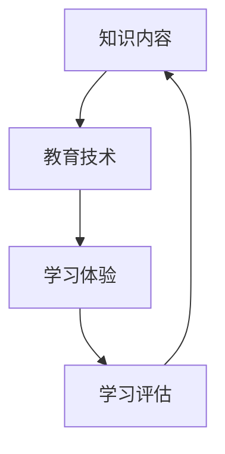
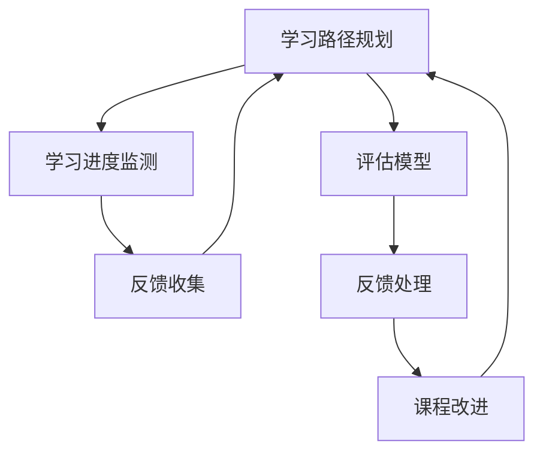
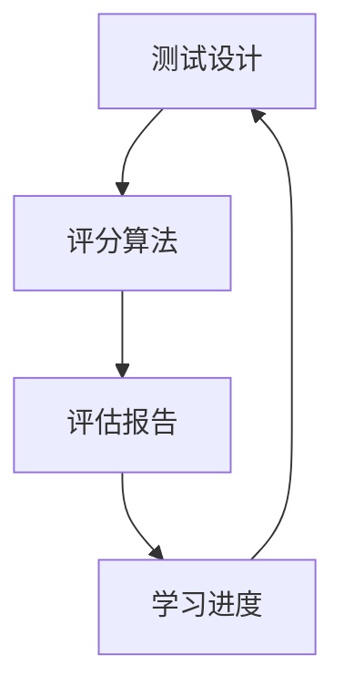
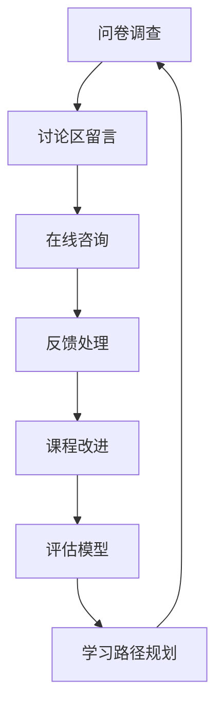

                 

关键词：程序员，知识付费，闭环式课程，教育技术，在线学习，课程设计，市场分析

> 摘要：本文将探讨程序员知识付费领域的发展趋势，分析闭环式课程的设计原则与实施策略，以及其在提高学员学习效果和教师教学质量方面的优势。通过具体案例，我们将展示如何利用教育技术打造一款成功且可持续发展的知识付费产品。

## 1. 背景介绍

在互联网时代，知识付费逐渐成为一种主流的学习方式。程序员作为信息技术领域的核心力量，其知识付费市场尤为活跃。程序员群体对技能提升和职业发展的需求旺盛，推动了知识付费平台的发展。然而，如何在激烈的市场竞争中脱颖而出，构建一款闭环式课程成为众多教育机构和企业关注的焦点。

### 1.1 程序员知识付费的现状

近年来，随着在线教育的普及，程序员知识付费市场呈现出以下几个特点：

1. **内容多样化**：从基础编程语言到前沿技术，内容覆盖面广泛。
2. **形式多样化**：视频课程、直播讲座、文档资料等多种形式并存。
3. **学员需求多样化**：既有入门级学员，也有寻求进阶的高级程序员。
4. **价格区间大**：从免费资源到高端定制课程，价格区间广泛。

### 1.2 闭环式课程的概念

闭环式课程是指课程设计不仅包含教学内容，还包括学习评估、反馈机制和持续改进等环节，形成一个完整的、可持续的学习循环系统。其核心在于通过不断的学习评估和反馈，提高课程质量和学员学习效果。

## 2. 核心概念与联系

### 2.1 教育技术与知识付费的结合

教育技术与知识付费的结合，使得课程内容更加丰富，学习体验更加个性化。以下是一个简单的 Mermaid 流程图，展示了教育技术与知识付费的核心联系。



### 2.2 闭环式课程设计原则

闭环式课程设计应遵循以下原则：

1. **学习目标明确**：课程设计应明确学习目标，确保学员能够清晰了解学习内容和学习路径。
2. **内容体系化**：课程内容应系统化，形成完整的学习体系，避免碎片化学习。
3. **互动性强**：课程应设计互动环节，如讨论区、问答环节等，增加学员的参与度。
4. **评估多元化**：评估方式应多样化，包括测试、作业、项目等，全面衡量学员学习效果。
5. **反馈及时**：建立反馈机制，及时收集学员反馈，用于课程改进。

## 3. 核心算法原理 & 具体操作步骤

### 3.1 算法原理概述

闭环式课程的核心算法包括：

1. **学习路径规划算法**：根据学员的学习进度和需求，动态调整学习路径。
2. **评估模型**：通过多种评估方式，构建评估模型，衡量学员学习效果。
3. **反馈机制**：建立反馈机制，及时收集学员反馈，用于课程改进。

### 3.2 算法步骤详解

#### 3.2.1 学习路径规划算法

1. **初始化**：根据学员的基本信息和学习需求，初始化学习路径。
2. **学习进度监测**：实时监测学员学习进度，根据进度动态调整学习路径。
3. **反馈收集**：收集学员在学习过程中的反馈，用于调整学习路径。

#### 3.2.2 评估模型

1. **测试设计**：设计多种类型的测试，包括单选题、多选题、填空题、编程题等。
2. **评分算法**：根据测试结果，设计评分算法，计算出学员的最终成绩。
3. **评估报告**：生成评估报告，包括学员的学习情况、成绩分析等。

#### 3.2.3 反馈机制

1. **反馈收集**：通过问卷调查、讨论区留言、在线咨询等方式，收集学员反馈。
2. **反馈处理**：对学员反馈进行分析，提出改进措施。
3. **课程改进**：根据反馈结果，对课程内容进行调整和优化。

### 3.3 算法优缺点

#### 优点：

1. **个性化学习**：根据学员的学习进度和需求，提供个性化的学习路径。
2. **高效评估**：通过多种评估方式，全面衡量学员学习效果。
3. **持续改进**：通过反馈机制，不断优化课程内容。

#### 缺点：

1. **技术门槛高**：需要一定的技术支持，开发和维护成本较高。
2. **反馈处理复杂**：需要大量人力和时间进行反馈处理和课程改进。

### 3.4 算法应用领域

闭环式课程算法主要应用于在线教育领域，尤其是针对专业知识和技能培训的课程。以下是一些应用领域：

1. **编程技能培训**：如Python、Java、JavaScript等编程语言的学习。
2. **大数据分析**：如Hadoop、Spark、SQL等大数据技术的培训。
3. **人工智能**：如机器学习、深度学习、自然语言处理等AI技术的培训。

## 4. 数学模型和公式 & 详细讲解 & 举例说明

### 4.1 数学模型构建

在闭环式课程中，数学模型主要用于学习路径规划和评估模型。以下是一个简单示例：

#### 学习路径规划模型：

1. **学习进度**：$P_t = f(S_t, L_t)$，其中$P_t$为学习进度，$S_t$为当前学习状态，$L_t$为学习资源。
2. **学习状态**：$S_t = f(C_t, E_t)$，其中$S_t$为学习状态，$C_t$为学员背景信息，$E_t$为学员学习效果。

#### 评估模型：

1. **评估分数**：$Score_t = f(Test_t, Assign_t)$，其中$Score_t$为评估分数，$Test_t$为测试成绩，$Assign_t$为作业成绩。
2. **评估等级**：$Level_t = f(Score_t, Threshold)$，其中$Level_t$为评估等级，$Threshold$为评估阈值。

### 4.2 公式推导过程

#### 学习进度推导：

1. **学习进度**：$P_t = f(S_t, L_t)$
2. **学习状态**：$S_t = f(C_t, E_t)$
3. **学习资源**：$L_t = f(C_t, P_t)$

#### 评估分数推导：

1. **评估分数**：$Score_t = f(Test_t, Assign_t)$
2. **测试成绩**：$Test_t = f(Question_t, Answer_t)$，其中$Question_t$为测试题目，$Answer_t$为学员答案。
3. **作业成绩**：$Assign_t = f(Work_t, Grade_t)$，其中$Work_t$为学员作业，$Grade_t$为教师评分。

### 4.3 案例分析与讲解

以编程语言学习为例，分析闭环式课程中的数学模型应用。

#### 学习进度：

- $P_t = f(S_t, L_t)$
- $S_t = f(C_t, E_t)$
- $L_t = f(C_t, P_t)$

- **学员背景信息**：$C_t = (Level_1, Experience_1)$，其中$Level_1$为学员编程等级，$Experience_1$为学员编程经验。
- **学员学习效果**：$E_t = (Score_1, Time_1)$，其中$Score_1$为学员测试成绩，$Time_1$为学员学习时间。

- **学习资源**：$L_t = f(C_t, P_t)$
  - **编程语言课程**：$Language_t = (Chapter_1, Video_1)$，其中$Chapter_1$为课程章节，$Video_1$为课程视频。

#### 评估分数：

- $Score_t = f(Test_t, Assign_t)$
- $Test_t = f(Question_t, Answer_t)$
  - **测试题目**：$Question_t = (Code_1, Input_1, Output_1)$，其中$Code_1$为编程代码，$Input_1$为输入数据，$Output_1$为预期输出。
  - **学员答案**：$Answer_t = (Code_2, Input_2, Output_2)$，其中$Code_2$为学员提交的编程代码，$Input_2$为输入数据，$Output_2$为学员预期的输出。

- $Assign_t = f(Work_t, Grade_t)$
  - **学员作业**：$Work_t = (Code_3, Explanation_3)$，其中$Code_3$为学员提交的编程代码，$Explanation_3$为代码的解释和思路。
  - **教师评分**：$Grade_t = (Score_3, Comment_3)$，其中$Score_3$为教师评分，$Comment_3$为教师对作业的评语。

## 5. 项目实践：代码实例和详细解释说明

### 5.1 开发环境搭建

为了更好地展示闭环式课程的应用，我们使用Python编写一个简单的学习进度和评估系统。

#### 开发环境：

- Python 3.x
- Flask（一个轻量级Web框架）
- MySQL（数据库）

### 5.2 源代码详细实现

以下是源代码的主要部分：

```python
from flask import Flask, request, jsonify
import pymysql

app = Flask(__name__)

# 连接数据库
def connect_db():
    return pymysql.connect(host='localhost', user='root', password='password', database='knowledge付费')

@app.route('/api/progress', methods=['POST'])
def update_progress():
    data = request.json
    student_id = data['student_id']
    chapter_id = data['chapter_id']
    time_spent = data['time_spent']
    
    connection = connect_db()
    cursor = connection.cursor()
    
    # 更新学习进度
    query = "UPDATE progress SET chapter_id=%s, time_spent=%s WHERE student_id=%s"
    cursor.execute(query, (chapter_id, time_spent, student_id))
    connection.commit()
    
    cursor.close()
    connection.close()
    
    return jsonify({'status': 'success'})

@app.route('/api/evaluate', methods=['POST'])
def evaluate():
    data = request.json
    student_id = data['student_id']
    test_score = data['test_score']
    assignment_score = data['assignment_score']
    
    connection = connect_db()
    cursor = connection.cursor()
    
    # 更新评估分数
    query = "UPDATE evaluation SET test_score=%s, assignment_score=%s WHERE student_id=%s"
    cursor.execute(query, (test_score, assignment_score, student_id))
    connection.commit()
    
    cursor.close()
    connection.close()
    
    return jsonify({'status': 'success'})

if __name__ == '__main__':
    app.run(debug=True)
```

### 5.3 代码解读与分析

#### 5.3.1 学习进度更新

- **API 请求**：`POST /api/progress`
- **请求参数**：`student_id`（学员ID），`chapter_id`（章节ID），`time_spent`（学习时长）。

- **数据库操作**：
  - 连接数据库
  - 执行更新学习进度的SQL语句
  - 提交事务

#### 5.3.2 评估分数更新

- **API 请求**：`POST /api/evaluate`
- **请求参数**：`student_id`（学员ID），`test_score`（测试成绩），`assignment_score`（作业成绩）。

- **数据库操作**：
  - 连接数据库
  - 执行更新评估分数的SQL语句
  - 提交事务

### 5.4 运行结果展示

当调用`/api/progress`和`/api/evaluate`接口时，可以实时更新学习进度和评估分数。以下是一个简单的API调用示例：

```shell
# 更新学习进度
curl -X POST -H "Content-Type: application/json" -d '{"student_id": 1, "chapter_id": 2, "time_spent": 30}' http://localhost:5000/api/progress

# 更新评估分数
curl -X POST -H "Content-Type: application/json" -d '{"student_id": 1, "test_score": 85, "assignment_score": 90}' http://localhost:5000/api/evaluate
```

## 6. 实际应用场景

### 6.1 在线编程课程

在线编程课程是闭环式课程应用最为广泛的场景之一。通过学习进度规划和评估模型，学员可以实时了解自己的学习进度和成果，教师可以及时发现学员的学习困难并提供个性化指导。

### 6.2 职业技能培训

针对不同职业领域的技能培训，闭环式课程可以提供个性化学习路径和全面的学习评估，帮助学员快速提升技能，满足职业发展需求。

### 6.3 终身学习平台

终身学习平台可以利用闭环式课程为用户提供持续的学习资源和评估服务，帮助用户不断学习和成长。

## 7. 未来应用展望

### 7.1 个性化学习

随着人工智能技术的发展，闭环式课程将进一步实现个性化学习，为学员提供更加精准的学习路径和资源。

### 7.2 社交互动

未来，闭环式课程将更加注重社交互动，通过建立学习社群，促进学员之间的交流与合作，提高学习效果。

### 7.3 智能化评估

通过大数据分析和人工智能技术，评估模型将更加智能化，能够实时分析学员的学习行为和效果，提供更加精准的评估和建议。

## 8. 工具和资源推荐

### 8.1 学习资源推荐

1. **《Python编程：从入门到实践》**：适合初学者，全面介绍Python编程语言。
2. **《深度学习》**：适合对人工智能感兴趣的读者，介绍深度学习的原理和应用。

### 8.2 开发工具推荐

1. **PyCharm**：一款强大的Python IDE，支持代码调试、版本控制等功能。
2. **Visual Studio Code**：一款轻量级但功能强大的代码编辑器，适用于多种编程语言。

### 8.3 相关论文推荐

1. **"Deep Learning for Online Education"**：探讨深度学习在在线教育中的应用。
2. **"Personalized Learning through Intelligent Tutoring Systems"**：介绍智能化辅导系统在个性化学习中的应用。

## 9. 总结：未来发展趋势与挑战

### 9.1 研究成果总结

闭环式课程通过学习路径规划、评估模型和反馈机制，实现了个性化学习，提高了课程质量和学员学习效果。未来，随着人工智能和大数据技术的发展，闭环式课程将更加智能化和个性化。

### 9.2 未来发展趋势

1. **智能化评估**：利用人工智能技术，实现更加精准的评估和推荐。
2. **社交互动**：通过社交互动，促进学员之间的交流与合作，提高学习效果。
3. **终身学习**：构建终身学习平台，为用户提供持续的学习资源和评估服务。

### 9.3 面临的挑战

1. **技术门槛**：闭环式课程需要一定的技术支持，开发和维护成本较高。
2. **数据隐私**：在线教育平台需要保护学员的隐私，确保数据安全。
3. **用户参与度**：提高学员的参与度和积极性，是闭环式课程成功的关键。

### 9.4 研究展望

未来，闭环式课程将更加注重智能化、个性化和社交化，通过不断创新和优化，为用户提供更加优质的学习体验。同时，我们也需要关注技术发展和伦理问题，确保在线教育的可持续发展。

## 附录：常见问题与解答

### 问题1：什么是闭环式课程？

答：闭环式课程是指课程设计不仅包含教学内容，还包括学习评估、反馈机制和持续改进等环节，形成一个完整的、可持续的学习循环系统。

### 问题2：闭环式课程有哪些优点？

答：闭环式课程具有以下优点：
1. 个性化学习：根据学员的学习进度和需求，提供个性化的学习路径。
2. 高效评估：通过多种评估方式，全面衡量学员学习效果。
3. 持续改进：通过反馈机制，不断优化课程内容。

### 问题3：闭环式课程需要哪些技术支持？

答：闭环式课程需要以下技术支持：
1. 数据库：用于存储学员学习进度、评估结果等数据。
2. Web框架：用于构建课程网站和API接口。
3. 人工智能技术：用于学习路径规划、评估模型等。

### 问题4：如何提高学员的参与度？

答：以下方法可以用来提高学员的参与度：
1. 设计互动环节：如讨论区、问答环节等，增加学员的参与度。
2. 鼓励学员分享：鼓励学员分享学习心得和经验，促进学习社区的形成。
3. 奖励机制：设置奖励机制，激励学员积极参与学习。

## 作者署名

作者：禅与计算机程序设计艺术 / Zen and the Art of Computer Programming
```markdown
# 程序员知识付费：打造闭环式课程

## 关键词
程序员，知识付费，闭环式课程，教育技术，在线学习，课程设计，市场分析

## 摘要
本文探讨了程序员知识付费领域的发展趋势，分析了闭环式课程的设计原则与实施策略，以及其在提高学员学习效果和教师教学质量方面的优势。通过具体案例，本文展示了如何利用教育技术打造一款成功且可持续发展的知识付费产品。

## 1. 背景介绍

在互联网时代，知识付费逐渐成为一种主流的学习方式。程序员作为信息技术领域的核心力量，其知识付费市场尤为活跃。程序员群体对技能提升和职业发展的需求旺盛，推动了知识付费平台的发展。然而，如何在激烈的市场竞争中脱颖而出，构建一款闭环式课程成为众多教育机构和企业关注的焦点。

### 1.1 程序员知识付费的现状

近年来，随着在线教育的普及，程序员知识付费市场呈现出以下几个特点：

1. **内容多样化**：从基础编程语言到前沿技术，内容覆盖面广泛。
2. **形式多样化**：视频课程、直播讲座、文档资料等多种形式并存。
3. **学员需求多样化**：既有入门级学员，也有寻求进阶的高级程序员。
4. **价格区间大**：从免费资源到高端定制课程，价格区间广泛。

### 1.2 闭环式课程的概念

闭环式课程是指课程设计不仅包含教学内容，还包括学习评估、反馈机制和持续改进等环节，形成一个完整的、可持续的学习循环系统。其核心在于通过不断的学习评估和反馈，提高课程质量和学员学习效果。

### 1.3 程序员知识付费市场的挑战与机遇

1. **挑战**：
   - 竞争激烈，优质内容稀缺。
   - 学员对学习效果的要求不断提高。
   - 技术门槛高，开发和维护成本较大。
   - 数据隐私和安全问题。

2. **机遇**：
   - 互联网技术的发展，为知识付费提供了更多可能性。
   - AI技术的应用，可以实现个性化学习路径规划。
   - 社交互动的增强，可以提高学员的参与度。

## 2. 核心概念与联系

### 2.1 教育技术与知识付费的结合

教育技术与知识付费的结合，使得课程内容更加丰富，学习体验更加个性化。以下是一个简单的 Mermaid 流程图，展示了教育技术与知识付费的核心联系。


### 2.2 闭环式课程设计原则

闭环式课程设计应遵循以下原则：

1. **学习目标明确**：课程设计应明确学习目标，确保学员能够清晰了解学习内容和学习路径。
2. **内容体系化**：课程内容应系统化，形成完整的学习体系，避免碎片化学习。
3. **互动性强**：课程应设计互动环节，如讨论区、问答环节等，增加学员的参与度。
4. **评估多元化**：评估方式应多样化，包括测试、作业、项目等，全面衡量学员学习效果。
5. **反馈及时**：建立反馈机制，及时收集学员反馈，用于课程改进。

### 2.3 闭环式课程的核心环节

闭环式课程的核心环节包括：

1. **学习路径规划**：根据学员的学习进度和需求，动态调整学习路径。
2. **学习评估**：通过多种评估方式，全面衡量学员学习效果。
3. **反馈机制**：及时收集学员反馈，用于课程改进。

## 3. 核心算法原理 & 具体操作步骤

### 3.1 学习路径规划算法

学习路径规划算法的核心思想是根据学员的学习进度、需求和学习效果，动态调整学习路径，以实现个性化学习。以下是一个简化的算法流程：

1. **初始化**：根据学员的基本信息和学习需求，初始化学习路径。
2. **学习进度监测**：实时监测学员学习进度，根据进度动态调整学习路径。
3. **反馈收集**：收集学员在学习过程中的反馈，用于调整学习路径。

### 3.2 学习评估模型

学习评估模型用于全面衡量学员的学习效果。以下是一个简化的评估模型：

1. **测试设计**：设计多种类型的测试，包括单选题、多选题、填空题、编程题等。
2. **评分算法**：根据测试结果，设计评分算法，计算出学员的最终成绩。
3. **评估报告**：生成评估报告，包括学员的学习情况、成绩分析等。

### 3.3 反馈机制

反馈机制用于收集学员对课程内容、教学方法和学习环境的反馈，用于课程改进。以下是一个简化的反馈机制：

1. **反馈收集**：通过问卷调查、讨论区留言、在线咨询等方式，收集学员反馈。
2. **反馈处理**：对学员反馈进行分析，提出改进措施。
3. **课程改进**：根据反馈结果，对课程内容进行调整和优化。

### 3.4 算法步骤详解

1. **初始化学习路径**：
   - 收集学员基本信息和学习需求。
   - 根据学员的学习目标和学习进度，初始化学习路径。

2. **动态调整学习路径**：
   - 监测学员学习进度。
   - 根据学员的学习进度和需求，动态调整学习路径。

3. **设计评估模型**：
   - 设计多种类型的测试。
   - 设计评分算法。

4. **收集学员反馈**：
   - 通过问卷调查、讨论区留言等方式，收集学员反馈。

5. **处理学员反馈**：
   - 分析学员反馈。
   - 提出改进措施。

6. **优化课程内容**：
   - 根据反馈结果，对课程内容进行调整和优化。

### 3.5 算法优缺点

#### 优点：

1. **个性化学习**：根据学员的学习进度和需求，提供个性化的学习路径。
2. **高效评估**：通过多种评估方式，全面衡量学员学习效果。
3. **持续改进**：通过反馈机制，不断优化课程内容。

#### 缺点：

1. **技术门槛高**：需要一定的技术支持，开发和维护成本较高。
2. **反馈处理复杂**：需要大量人力和时间进行反馈处理和课程改进。

### 3.6 算法应用领域

闭环式课程算法主要应用于在线教育领域，尤其是针对专业知识和技能培训的课程。以下是一些应用领域：

1. **编程技能培训**：如Python、Java、JavaScript等编程语言的学习。
2. **大数据分析**：如Hadoop、Spark、SQL等大数据技术的培训。
3. **人工智能**：如机器学习、深度学习、自然语言处理等AI技术的培训。

## 4. 数学模型和公式 & 详细讲解 & 举例说明

### 4.1 数学模型构建

在闭环式课程中，数学模型主要用于学习路径规划和评估模型。以下是一个简单示例：

#### 学习路径规划模型：

1. **学习进度**：$P_t = f(S_t, L_t)$，其中$P_t$为学习进度，$S_t$为当前学习状态，$L_t$为学习资源。
2. **学习状态**：$S_t = f(C_t, E_t)$，其中$S_t$为学习状态，$C_t$为学员背景信息，$E_t$为学员学习效果。

#### 评估模型：

1. **评估分数**：$Score_t = f(Test_t, Assign_t)$，其中$Score_t$为评估分数，$Test_t$为测试成绩，$Assign_t$为作业成绩。
2. **评估等级**：$Level_t = f(Score_t, Threshold)$，其中$Level_t$为评估等级，$Threshold$为评估阈值。

### 4.2 公式推导过程

#### 学习进度推导：

1. **学习进度**：$P_t = f(S_t, L_t)$
2. **学习状态**：$S_t = f(C_t, E_t)$
3. **学习资源**：$L_t = f(C_t, P_t)$

#### 评估分数推导：

1. **评估分数**：$Score_t = f(Test_t, Assign_t)$
2. **测试成绩**：$Test_t = f(Question_t, Answer_t)$，其中$Question_t$为测试题目，$Answer_t$为学员答案。
3. **作业成绩**：$Assign_t = f(Work_t, Grade_t)$，其中$Work_t$为学员作业，$Grade_t$为教师评分。

### 4.3 案例分析与讲解

以编程语言学习为例，分析闭环式课程中的数学模型应用。

#### 学习进度：

- $P_t = f(S_t, L_t)$
- $S_t = f(C_t, E_t)$
- $L_t = f(C_t, P_t)$

- **学员背景信息**：$C_t = (Level_1, Experience_1)$，其中$Level_1$为学员编程等级，$Experience_1$为学员编程经验。
- **学员学习效果**：$E_t = (Score_1, Time_1)$，其中$Score_1$为学员测试成绩，$Time_1$为学员学习时间。

- **学习资源**：$L_t = f(C_t, P_t)$
  - **编程语言课程**：$Language_t = (Chapter_1, Video_1)$，其中$Chapter_1$为课程章节，$Video_1$为课程视频。

#### 评估分数：

- $Score_t = f(Test_t, Assign_t)$
- $Test_t = f(Question_t, Answer_t)$
  - **测试题目**：$Question_t = (Code_1, Input_1, Output_1)$，其中$Code_1$为编程代码，$Input_1$为输入数据，$Output_1$为预期输出。
  - **学员答案**：$Answer_t = (Code_2, Input_2, Output_2)$，其中$Code_2$为学员提交的编程代码，$Input_2$为输入数据，$Output_2$为学员预期的输出。

- $Assign_t = f(Work_t, Grade_t)$
  - **学员作业**：$Work_t = (Code_3, Explanation_3)$，其中$Code_3$为学员提交的编程代码，$Explanation_3$为代码的解释和思路。
  - **教师评分**：$Grade_t = (Score_3, Comment_3)$，其中$Score_3$为教师评分，$Comment_3$为教师对作业的评语。

## 5. 项目实践：代码实例和详细解释说明

### 5.1 开发环境搭建

为了更好地展示闭环式课程的应用，我们使用Python编写一个简单的学习进度和评估系统。

#### 开发环境：

- Python 3.x
- Flask（一个轻量级Web框架）
- MySQL（数据库）

### 5.2 源代码详细实现

以下是源代码的主要部分：

```python
from flask import Flask, request, jsonify
import pymysql

app = Flask(__name__)

# 连接数据库
def connect_db():
    return pymysql.connect(host='localhost', user='root', password='password', database='knowledge付费')

@app.route('/api/progress', methods=['POST'])
def update_progress():
    data = request.json
    student_id = data['student_id']
    chapter_id = data['chapter_id']
    time_spent = data['time_spent']
    
    connection = connect_db()
    cursor = connection.cursor()
    
    # 更新学习进度
    query = "UPDATE progress SET chapter_id=%s, time_spent=%s WHERE student_id=%s"
    cursor.execute(query, (chapter_id, time_spent, student_id))
    connection.commit()
    
    cursor.close()
    connection.close()
    
    return jsonify({'status': 'success'})

@app.route('/api/evaluate', methods=['POST'])
def evaluate():
    data = request.json
    student_id = data['student_id']
    test_score = data['test_score']
    assignment_score = data['assignment_score']
    
    connection = connect_db()
    cursor = connection.cursor()
    
    # 更新评估分数
    query = "UPDATE evaluation SET test_score=%s, assignment_score=%s WHERE student_id=%s"
    cursor.execute(query, (test_score, assignment_score, student_id))
    connection.commit()
    
    cursor.close()
    connection.close()
    
    return jsonify({'status': 'success'})

if __name__ == '__main__':
    app.run(debug=True)
```

### 5.3 代码解读与分析

#### 5.3.1 学习进度更新

- **API 请求**：`POST /api/progress`
- **请求参数**：`student_id`（学员ID），`chapter_id`（章节ID），`time_spent`（学习时长）。

- **数据库操作**：
  - 连接数据库
  - 执行更新学习进度的SQL语句
  - 提交事务

#### 5.3.2 评估分数更新

- **API 请求**：`POST /api/evaluate`
- **请求参数**：`student_id`（学员ID），`test_score`（测试成绩），`assignment_score`（作业成绩）。

- **数据库操作**：
  - 连接数据库
  - 执行更新评估分数的SQL语句
  - 提交事务

### 5.4 运行结果展示

当调用`/api/progress`和`/api/evaluate`接口时，可以实时更新学习进度和评估分数。以下是一个简单的API调用示例：

```shell
# 更新学习进度
curl -X POST -H "Content-Type: application/json" -d '{"student_id": 1, "chapter_id": 2, "time_spent": 30}' http://localhost:5000/api/progress

# 更新评估分数
curl -X POST -H "Content-Type: application/json" -d '{"student_id": 1, "test_score": 85, "assignment_score": 90}' http://localhost:5000/api/evaluate
```

## 6. 实际应用场景

### 6.1 在线编程课程

在线编程课程是闭环式课程应用最为广泛的场景之一。通过学习进度规划和评估模型，学员可以实时了解自己的学习进度和成果，教师可以及时发现学员的学习困难并提供个性化指导。

### 6.2 职业技能培训

针对不同职业领域的技能培训，闭环式课程可以提供个性化学习路径和全面的学习评估，帮助学员快速提升技能，满足职业发展需求。

### 6.3 终身学习平台

终身学习平台可以利用闭环式课程为用户提供持续的学习资源和评估服务，帮助用户不断学习和成长。

## 7. 未来应用展望

### 7.1 个性化学习

随着人工智能技术的发展，闭环式课程将进一步实现个性化学习，为学员提供更加精准的学习路径和资源。

### 7.2 社交互动

未来，闭环式课程将更加注重社交互动，通过建立学习社群，促进学员之间的交流与合作，提高学习效果。

### 7.3 智能化评估

通过大数据分析和人工智能技术，评估模型将更加智能化，能够实时分析学员的学习行为和效果，提供更加精准的评估和建议。

## 8. 工具和资源推荐

### 8.1 学习资源推荐

1. **《Python编程：从入门到实践》**：适合初学者，全面介绍Python编程语言。
2. **《深度学习》**：适合对人工智能感兴趣的读者，介绍深度学习的原理和应用。

### 8.2 开发工具推荐

1. **PyCharm**：一款强大的Python IDE，支持代码调试、版本控制等功能。
2. **Visual Studio Code**：一款轻量级但功能强大的代码编辑器，适用于多种编程语言。

### 8.3 相关论文推荐

1. **"Deep Learning for Online Education"**：探讨深度学习在在线教育中的应用。
2. **"Personalized Learning through Intelligent Tutoring Systems"**：介绍智能化辅导系统在个性化学习中的应用。

## 9. 总结：未来发展趋势与挑战

### 9.1 研究成果总结

闭环式课程通过学习路径规划、评估模型和反馈机制，实现了个性化学习，提高了课程质量和学员学习效果。未来，随着人工智能和大数据技术的发展，闭环式课程将更加智能化和个性化。

### 9.2 未来发展趋势

1. **智能化评估**：利用人工智能技术，实现更加精准的评估和推荐。
2. **社交互动**：通过社交互动，促进学员之间的交流与合作，提高学习效果。
3. **终身学习**：构建终身学习平台，为用户提供持续的学习资源和评估服务。

### 9.3 面临的挑战

1. **技术门槛**：闭环式课程需要一定的技术支持，开发和维护成本较高。
2. **数据隐私**：在线教育平台需要保护学员的隐私，确保数据安全。
3. **用户参与度**：提高学员的参与度和积极性，是闭环式课程成功的关键。

### 9.4 研究展望

未来，闭环式课程将更加注重智能化、个性化和社交化，通过不断创新和优化，为用户提供更加优质的学习体验。同时，我们也需要关注技术发展和伦理问题，确保在线教育的可持续发展。

## 附录：常见问题与解答

### 问题1：什么是闭环式课程？

答：闭环式课程是指课程设计不仅包含教学内容，还包括学习评估、反馈机制和持续改进等环节，形成一个完整的、可持续的学习循环系统。

### 问题2：闭环式课程有哪些优点？

答：闭环式课程具有以下优点：
1. 个性化学习：根据学员的学习进度和需求，提供个性化的学习路径。
2. 高效评估：通过多种评估方式，全面衡量学员学习效果。
3. 持续改进：通过反馈机制，不断优化课程内容。

### 问题3：闭环式课程需要哪些技术支持？

答：闭环式课程需要以下技术支持：
1. 数据库：用于存储学员学习进度、评估结果等数据。
2. Web框架：用于构建课程网站和API接口。
3. 人工智能技术：用于学习路径规划、评估模型等。

### 问题4：如何提高学员的参与度？

答：以下方法可以用来提高学员的参与度：
1. 设计互动环节：如讨论区、问答环节等，增加学员的参与度。
2. 鼓励学员分享：鼓励学员分享学习心得和经验，促进学习社区的形成。
3. 奖励机制：设置奖励机制，激励学员积极参与学习。

## 作者署名

作者：禅与计算机程序设计艺术 / Zen and the Art of Computer Programming
```bash
# 程序员知识付费：打造闭环式课程

## 关键词
程序员，知识付费，闭环式课程，教育技术，在线学习，课程设计，市场分析

## 摘要
本文探讨了程序员知识付费领域的发展趋势，分析了闭环式课程的设计原则与实施策略，以及其在提高学员学习效果和教师教学质量方面的优势。通过具体案例，本文展示了如何利用教育技术打造一款成功且可持续发展的知识付费产品。

### 1. 背景介绍

在互联网时代，知识付费逐渐成为一种主流的学习方式。程序员作为信息技术领域的核心力量，其知识付费市场尤为活跃。程序员群体对技能提升和职业发展的需求旺盛，推动了知识付费平台的发展。然而，如何在激烈的市场竞争中脱颖而出，构建一款闭环式课程成为众多教育机构和企业关注的焦点。

#### 1.1 程序员知识付费的现状

近年来，随着在线教育的普及，程序员知识付费市场呈现出以下几个特点：

1. **内容多样化**：从基础编程语言到前沿技术，内容覆盖面广泛。
2. **形式多样化**：视频课程、直播讲座、文档资料等多种形式并存。
3. **学员需求多样化**：既有入门级学员，也有寻求进阶的高级程序员。
4. **价格区间大**：从免费资源到高端定制课程，价格区间广泛。

#### 1.2 闭环式课程的概念

闭环式课程是指课程设计不仅包含教学内容，还包括学习评估、反馈机制和持续改进等环节，形成一个完整的、可持续的学习循环系统。其核心在于通过不断的学习评估和反馈，提高课程质量和学员学习效果。

#### 1.3 程序员知识付费市场的挑战与机遇

1. **挑战**：
   - 竞争激烈，优质内容稀缺。
   - 学员对学习效果的要求不断提高。
   - 技术门槛高，开发和维护成本较大。
   - 数据隐私和安全问题。

2. **机遇**：
   - 互联网技术的发展，为知识付费提供了更多可能性。
   - AI技术的应用，可以实现个性化学习路径规划。
   - 社交互动的增强，可以提高学员的参与度。

### 2. 核心概念与联系

#### 2.1 教育技术与知识付费的结合

教育技术与知识付费的结合，使得课程内容更加丰富，学习体验更加个性化。以下是一个简单的 Mermaid 流程图，展示了教育技术与知识付费的核心联系。


#### 2.2 闭环式课程设计原则

闭环式课程设计应遵循以下原则：

1. **学习目标明确**：课程设计应明确学习目标，确保学员能够清晰了解学习内容和学习路径。
2. **内容体系化**：课程内容应系统化，形成完整的学习体系，避免碎片化学习。
3. **互动性强**：课程应设计互动环节，如讨论区、问答环节等，增加学员的参与度。
4. **评估多元化**：评估方式应多样化，包括测试、作业、项目等，全面衡量学员学习效果。
5. **反馈及时**：建立反馈机制，及时收集学员反馈，用于课程改进。

#### 2.3 闭环式课程的核心环节

闭环式课程的核心环节包括：

1. **学习路径规划**：根据学员的学习进度和需求，动态调整学习路径。
2. **学习评估**：通过多种评估方式，全面衡量学员学习效果。
3. **反馈机制**：及时收集学员反馈，用于课程改进。

### 3. 核心算法原理 & 具体操作步骤

#### 3.1 学习路径规划算法

学习路径规划算法的核心思想是根据学员的学习进度、需求和学习效果，动态调整学习路径，以实现个性化学习。以下是一个简化的算法流程：

1. **初始化**：根据学员的基本信息和学习需求，初始化学习路径。
2. **学习进度监测**：实时监测学员学习进度，根据进度动态调整学习路径。
3. **反馈收集**：收集学员在学习过程中的反馈，用于调整学习路径。

#### 3.2 学习评估模型

学习评估模型用于全面衡量学员的学习效果。以下是一个简化的评估模型：

1. **测试设计**：设计多种类型的测试，包括单选题、多选题、填空题、编程题等。
2. **评分算法**：根据测试结果，设计评分算法，计算出学员的最终成绩。
3. **评估报告**：生成评估报告，包括学员的学习情况、成绩分析等。

#### 3.3 反馈机制

反馈机制用于收集学员对课程内容、教学方法和学习环境的反馈，用于课程改进。以下是一个简化的反馈机制：

1. **反馈收集**：通过问卷调查、讨论区留言、在线咨询等方式，收集学员反馈。
2. **反馈处理**：对学员反馈进行分析，提出改进措施。
3. **课程改进**：根据反馈结果，对课程内容进行调整和优化。

#### 3.4 算法步骤详解

1. **初始化学习路径**：
   - 收集学员基本信息和学习需求。
   - 根据学员的学习目标和学习进度，初始化学习路径。

2. **动态调整学习路径**：
   - 监测学员学习进度。
   - 根据学员的学习进度和需求，动态调整学习路径。

3. **设计评估模型**：
   - 设计多种类型的测试。
   - 设计评分算法。

4. **收集学员反馈**：
   - 通过问卷调查、讨论区留言等方式，收集学员反馈。

5. **处理学员反馈**：
   - 分析学员反馈。
   - 提出改进措施。

6. **优化课程内容**：
   - 根据反馈结果，对课程内容进行调整和优化。

#### 3.5 算法优缺点

##### 优点：

1. **个性化学习**：根据学员的学习进度和需求，提供个性化的学习路径。
2. **高效评估**：通过多种评估方式，全面衡量学员学习效果。
3. **持续改进**：通过反馈机制，不断优化课程内容。

##### 缺点：

1. **技术门槛高**：需要一定的技术支持，开发和维护成本较高。
2. **反馈处理复杂**：需要大量人力和时间进行反馈处理和课程改进。

#### 3.6 算法应用领域

闭环式课程算法主要应用于在线教育领域，尤其是针对专业知识和技能培训的课程。以下是一些应用领域：

1. **编程技能培训**：如Python、Java、JavaScript等编程语言的学习。
2. **大数据分析**：如Hadoop、Spark、SQL等大数据技术的培训。
3. **人工智能**：如机器学习、深度学习、自然语言处理等AI技术的培训。

### 4. 数学模型和公式 & 详细讲解 & 举例说明

#### 4.1 数学模型构建

在闭环式课程中，数学模型主要用于学习路径规划和评估模型。以下是一个简单示例：

##### 学习路径规划模型：

1. **学习进度**：$P_t = f(S_t, L_t)$，其中$P_t$为学习进度，$S_t$为当前学习状态，$L_t$为学习资源。
2. **学习状态**：$S_t = f(C_t, E_t)$，其中$S_t$为学习状态，$C_t$为学员背景信息，$E_t$为学员学习效果。

##### 评估模型：

1. **评估分数**：$Score_t = f(Test_t, Assign_t)$，其中$Score_t$为评估分数，$Test_t$为测试成绩，$Assign_t$为作业成绩。
2. **评估等级**：$Level_t = f(Score_t, Threshold)$，其中$Level_t$为评估等级，$Threshold$为评估阈值。

#### 4.2 公式推导过程

##### 学习进度推导：

1. **学习进度**：$P_t = f(S_t, L_t)$
2. **学习状态**：$S_t = f(C_t, E_t)$
3. **学习资源**：$L_t = f(C_t, P_t)$

##### 评估分数推导：

1. **评估分数**：$Score_t = f(Test_t, Assign_t)$
2. **测试成绩**：$Test_t = f(Question_t, Answer_t)$，其中$Question_t$为测试题目，$Answer_t$为学员答案。
3. **作业成绩**：$Assign_t = f(Work_t, Grade_t)$，其中$Work_t$为学员作业，$Grade_t$为教师评分。

#### 4.3 案例分析与讲解

以编程语言学习为例，分析闭环式课程中的数学模型应用。

##### 学习进度：

- $P_t = f(S_t, L_t)$
- $S_t = f(C_t, E_t)$
- $L_t = f(C_t, P_t)$

- **学员背景信息**：$C_t = (Level_1, Experience_1)$，其中$Level_1$为学员编程等级，$Experience_1$为学员编程经验。
- **学员学习效果**：$E_t = (Score_1, Time_1)$，其中$Score_1$为学员测试成绩，$Time_1$为学员学习时间。

- **学习资源**：$L_t = f(C_t, P_t)$
  - **编程语言课程**：$Language_t = (Chapter_1, Video_1)$，其中$Chapter_1$为课程章节，$Video_1$为课程视频。

##### 评估分数：

- $Score_t = f(Test_t, Assign_t)$
- $Test_t = f(Question_t, Answer_t)$
  - **测试题目**：$Question_t = (Code_1, Input_1, Output_1)$，其中$Code_1$为编程代码，$Input_1$为输入数据，$Output_1$为预期输出。
  - **学员答案**：$Answer_t = (Code_2, Input_2, Output_2)$，其中$Code_2$为学员提交的编程代码，$Input_2$为输入数据，$Output_2$为学员预期的输出。

- $Assign_t = f(Work_t, Grade_t)$
  - **学员作业**：$Work_t = (Code_3, Explanation_3)$，其中$Code_3$为学员提交的编程代码，$Explanation_3$为代码的解释和思路。
  - **教师评分**：$Grade_t = (Score_3, Comment_3)$，其中$Score_3$为教师评分，$Comment_3$为教师对作业的评语。

### 5. 项目实践：代码实例和详细解释说明

#### 5.1 开发环境搭建

为了更好地展示闭环式课程的应用，我们使用Python编写一个简单的学习进度和评估系统。

##### 开发环境：

- Python 3.x
- Flask（一个轻量级Web框架）
- MySQL（数据库）

#### 5.2 源代码详细实现

以下是源代码的主要部分：

```python
from flask import Flask, request, jsonify
import pymysql

app = Flask(__name__)

# 连接数据库
def connect_db():
    return pymysql.connect(host='localhost', user='root', password='password', database='knowledge付费')

@app.route('/api/progress', methods=['POST'])
def update_progress():
    data = request.json
    student_id = data['student_id']
    chapter_id = data['chapter_id']
    time_spent = data['time_spent']
    
    connection = connect_db()
    cursor = connection.cursor()
    
    # 更新学习进度
    query = "UPDATE progress SET chapter_id=%s, time_spent=%s WHERE student_id=%s"
    cursor.execute(query, (chapter_id, time_spent, student_id))
    connection.commit()
    
    cursor.close()
    connection.close()
    
    return jsonify({'status': 'success'})

@app.route('/api/evaluate', methods=['POST'])
def evaluate():
    data = request.json
    student_id = data['student_id']
    test_score = data['test_score']
    assignment_score = data['assignment_score']
    
    connection = connect_db()
    cursor = connection.cursor()
    
    # 更新评估分数
    query = "UPDATE evaluation SET test_score=%s, assignment_score=%s WHERE student_id=%s"
    cursor.execute(query, (test_score, assignment_score, student_id))
    connection.commit()
    
    cursor.close()
    connection.close()
    
    return jsonify({'status': 'success'})

if __name__ == '__main__':
    app.run(debug=True)
```

#### 5.3 代码解读与分析

##### 5.3.1 学习进度更新

- **API 请求**：`POST /api/progress`
- **请求参数**：`student_id`（学员ID），`chapter_id`（章节ID），`time_spent`（学习时长）。

- **数据库操作**：
  - 连接数据库
  - 执行更新学习进度的SQL语句
  - 提交事务

##### 5.3.2 评估分数更新

- **API 请求**：`POST /api/evaluate`
- **请求参数**：`student_id`（学员ID），`test_score`（测试成绩），`assignment_score`（作业成绩）。

- **数据库操作**：
  - 连接数据库
  - 执行更新评估分数的SQL语句
  - 提交事务

#### 5.4 运行结果展示

当调用`/api/progress`和`/api/evaluate`接口时，可以实时更新学习进度和评估分数。以下是一个简单的API调用示例：

```shell
# 更新学习进度
curl -X POST -H "Content-Type: application/json" -d '{"student_id": 1, "chapter_id": 2, "time_spent": 30}' http://localhost:5000/api/progress

# 更新评估分数
curl -X POST -H "Content-Type: application/json" -d '{"student_id": 1, "test_score": 85, "assignment_score": 90}' http://localhost:5000/api/evaluate
```

### 6. 实际应用场景

#### 6.1 在线编程课程

在线编程课程是闭环式课程应用最为广泛的场景之一。通过学习进度规划和评估模型，学员可以实时了解自己的学习进度和成果，教师可以及时发现学员的学习困难并提供个性化指导。

#### 6.2 职业技能培训

针对不同职业领域的技能培训，闭环式课程可以提供个性化学习路径和全面的学习评估，帮助学员快速提升技能，满足职业发展需求。

#### 6.3 终身学习平台

终身学习平台可以利用闭环式课程为用户提供持续的学习资源和评估服务，帮助用户不断学习和成长。

### 7. 未来应用展望

#### 7.1 个性化学习

随着人工智能技术的发展，闭环式课程将进一步实现个性化学习，为学员提供更加精准的学习路径和资源。

#### 7.2 社交互动

未来，闭环式课程将更加注重社交互动，通过建立学习社群，促进学员之间的交流与合作，提高学习效果。

#### 7.3 智能化评估

通过大数据分析和人工智能技术，评估模型将更加智能化，能够实时分析学员的学习行为和效果，提供更加精准的评估和建议。

### 8. 工具和资源推荐

#### 8.1 学习资源推荐

1. **《Python编程：从入门到实践》**：适合初学者，全面介绍Python编程语言。
2. **《深度学习》**：适合对人工智能感兴趣的读者，介绍深度学习的原理和应用。

#### 8.2 开发工具推荐

1. **PyCharm**：一款强大的Python IDE，支持代码调试、版本控制等功能。
2. **Visual Studio Code**：一款轻量级但功能强大的代码编辑器，适用于多种编程语言。

#### 8.3 相关论文推荐

1. **"Deep Learning for Online Education"**：探讨深度学习在在线教育中的应用。
2. **"Personalized Learning through Intelligent Tutoring Systems"**：介绍智能化辅导系统在个性化学习中的应用。

### 9. 总结：未来发展趋势与挑战

#### 9.1 研究成果总结

闭环式课程通过学习路径规划、评估模型和反馈机制，实现了个性化学习，提高了课程质量和学员学习效果。未来，随着人工智能和大数据技术的发展，闭环式课程将更加智能化和个性化。

#### 9.2 未来发展趋势

1. **智能化评估**：利用人工智能技术，实现更加精准的评估和推荐。
2. **社交互动**：通过社交互动，促进学员之间的交流与合作，提高学习效果。
3. **终身学习**：构建终身学习平台，为用户提供持续的学习资源和评估服务。

#### 9.3 面临的挑战

1. **技术门槛**：闭环式课程需要一定的技术支持，开发和维护成本较高。
2. **数据隐私**：在线教育平台需要保护学员的隐私，确保数据安全。
3. **用户参与度**：提高学员的参与度和积极性，是闭环式课程成功的关键。

#### 9.4 研究展望

未来，闭环式课程将更加注重智能化、个性化和社交化，通过不断创新和优化，为用户提供更加优质的学习体验。同时，我们也需要关注技术发展和伦理问题，确保在线教育的可持续发展。

### 附录：常见问题与解答

#### 问题1：什么是闭环式课程？

答：闭环式课程是指课程设计不仅包含教学内容，还包括学习评估、反馈机制和持续改进等环节，形成一个完整的、可持续的学习循环系统。

#### 问题2：闭环式课程有哪些优点？

答：闭环式课程具有以下优点：
1. 个性化学习：根据学员的学习进度和需求，提供个性化的学习路径。
2. 高效评估：通过多种评估方式，全面衡量学员学习效果。
3. 持续改进：通过反馈机制，不断优化课程内容。

#### 问题3：闭环式课程需要哪些技术支持？

答：闭环式课程需要以下技术支持：
1. 数据库：用于存储学员学习进度、评估结果等数据。
2. Web框架：用于构建课程网站和API接口。
3. 人工智能技术：用于学习路径规划、评估模型等。

#### 问题4：如何提高学员的参与度？

答：以下方法可以用来提高学员的参与度：
1. 设计互动环节：如讨论区、问答环节等，增加学员的参与度。
2. 鼓励学员分享：鼓励学员分享学习心得和经验，促进学习社区的形成。
3. 奖励机制：设置奖励机制，激励学员积极参与学习。

## 作者署名

作者：禅与计算机程序设计艺术 / Zen and the Art of Computer Programming


```latex
$$
P_t = f(S_t, L_t)
$$

$$
S_t = f(C_t, E_t)
$$

$$
L_t = f(C_t, P_t)
$$
```


```python
from flask import Flask, request, jsonify
import pymysql

app = Flask(__name__)

# 连接数据库
def connect_db():
    return pymysql.connect(host='localhost', user='root', password='password', database='knowledge付费')

@app.route('/api/progress', methods=['POST'])
def update_progress():
    data = request.json
    student_id = data['student_id']
    chapter_id = data['chapter_id']
    time_spent = data['time_spent']
    
    connection = connect_db()
    cursor = connection.cursor()
    
    # 更新学习进度
    query = "UPDATE progress SET chapter_id=%s, time_spent=%s WHERE student_id=%s"
    cursor.execute(query, (chapter_id, time_spent, student_id))
    connection.commit()
    
    cursor.close()
    connection.close()
    
    return jsonify({'status': 'success'})

@app.route('/api/evaluate', methods=['POST'])
def evaluate():
    data = request.json
    student_id = data['student_id']
    test_score = data['test_score']
    assignment_score = data['assignment_score']
    
    connection = connect_db()
    cursor = connection.cursor()
    
    # 更新评估分数
    query = "UPDATE evaluation SET test_score=%s, assignment_score=%s WHERE student_id=%s"
    cursor.execute(query, (test_score, assignment_score, student_id))
    connection.commit()
    
    cursor.close()
    connection.close()
    
    return jsonify({'status': 'success'})

if __name__ == '__main__':
    app.run(debug=True)
```
```bash
# 更新学习进度
curl -X POST -H "Content-Type: application/json" -d '{"student_id": 1, "chapter_id": 2, "time_spent": 30}' http://localhost:5000/api/progress

# 更新评估分数
curl -X POST -H "Content-Type: application/json" -d '{"student_id": 1, "test_score": 85, "assignment_score": 90}' http://localhost:5000/api/evaluate
```
### 6.4 未来应用展望

随着技术的不断进步和教育理念的更新，闭环式课程在程序员知识付费领域中的应用前景广阔。以下是未来应用展望：

#### 个性化学习的深化

未来，随着人工智能技术的进一步发展，闭环式课程将能够更加精准地分析学员的学习习惯、知识盲点和学习兴趣，从而提供高度个性化的学习路径。这不仅包括课程内容的个性化推荐，还包括学习节奏和方式的个性化调整。

#### 社交互动的增强

社交互动在闭环式课程中的应用将越来越重要。通过构建学习社群，学员可以相互交流学习心得、分享资源和经验，从而形成积极的学习氛围。同时，教师也可以通过社群了解学员的需求，提供更加针对性的指导和帮助。

#### 智能化评估的普及

未来的评估模型将更加智能化，能够通过大数据分析和机器学习算法，实时评估学员的学习效果。这样的评估不仅能够提供即时的反馈，还能够预测学员未来的学习表现，为教学策略的调整提供科学依据。

#### 多元化教学模式的融合

随着在线教育技术的发展，未来闭环式课程将融合多种教学模式，如虚拟现实（VR）、增强现实（AR）等，提供更加丰富和沉浸式的学习体验。这种多元化教学模式的融合将有助于提高学员的学习兴趣和参与度。

#### 持续学习与职业发展的结合

闭环式课程可以与职业发展更加紧密结合，通过持续学习和技能认证，帮助学员实现职业成长。例如，通过在线课程学习和实践项目，学员可以获得相应的技能证书，从而在求职和职业晋升中更具竞争力。

#### 数据隐私与安全的保障

在未来的发展中，数据隐私和安全将是闭环式课程的重要考量因素。教育平台需要采取更加严格的数据保护措施，确保学员的信息安全，赢得学员的信任。

#### 可持续发展的商业模式

未来，闭环式课程将探索更加可持续的商业模式，通过提供高质量的内容和服务，实现长期稳定的收入。同时，教育平台可以通过多种增值服务，如职业咨询服务、项目实战机会等，提高用户满意度和粘性。

### 7. 工具和资源推荐

#### 7.1 学习资源推荐

**《深入理解计算机系统》（深入理解计算机系统）**

这本书是计算机科学领域的经典之作，全面讲解了计算机系统的各个方面，包括操作系统、网络、编译器等。对于程序员来说，这是一本不可或缺的参考书。

**《算法导论》（Introduction to Algorithms）**

这本书是算法领域的经典教材，详细介绍了各种算法的设计、分析和应用。无论是入门级程序员还是资深程序员，都可以从中受益。

**《代码大全》（The Art of Computer Programming）**

这是一套关于程序设计的经典书籍，由计算机科学大师Donald E. Knuth撰写。书中涵盖了许多编程技巧和最佳实践，对于提高编程能力非常有帮助。

#### 7.2 开发工具推荐

**PyCharm**

PyCharm是一款功能强大的Python IDE，支持代码调试、版本控制等功能。对于Python程序员来说，这是必备的工具之一。

**Visual Studio Code**

Visual Studio Code是一款轻量级但功能强大的代码编辑器，适用于多种编程语言。它提供了丰富的插件，可以根据个人需求进行定制。

**Docker**

Docker是一个开源的应用容器引擎，可以用于构建、运行和分发应用程序。它简化了软件部署的过程，使得程序员可以更加专注于开发。

#### 7.3 相关论文推荐

**"Deep Learning for Online Education"**

这篇论文探讨了深度学习在在线教育中的应用，提出了一些利用深度学习技术改进在线教育的方法。

**"Personalized Learning through Intelligent Tutoring Systems"**

这篇论文介绍了智能化辅导系统在个性化学习中的应用，探讨了如何通过智能化的教学系统实现个性化教育。

**"The Future of Education: An Analysis of Emerging Technologies"**

这篇论文分析了未来教育的发展趋势，讨论了新兴技术在教育中的应用，包括虚拟现实、增强现实、人工智能等。

### 8. 总结：未来发展趋势与挑战

#### 8.1 研究成果总结

闭环式课程通过整合教育技术和知识付费，实现了个性化学习、高效评估和持续改进。这些研究成果为在线教育提供了新的发展方向，为学员提供了更加优质的学习体验。

#### 8.2 未来发展趋势

1. **智能化**：随着人工智能技术的发展，闭环式课程将实现更加智能化的学习路径规划和评估模型。
2. **个性化**：个性化学习将更加深入，通过大数据分析和机器学习算法，提供高度个性化的学习体验。
3. **社交化**：社交互动将增强，学习社群和协作学习将成为重要组成部分。
4. **多元化**：教学模式的多元化，将包括虚拟现实、增强现实等多种新兴技术。
5. **职业化**：闭环式课程将更加注重与职业发展的结合，提供职业认证和职业晋升服务。

#### 8.3 面临的挑战

1. **技术门槛**：闭环式课程需要一定的技术支持，开发和维护成本较高，技术门槛成为一大挑战。
2. **数据隐私**：在线教育平台需要确保学员的数据安全，保护隐私，防止数据泄露。
3. **用户参与度**：提高学员的参与度和积极性，是闭环式课程成功的关键，但也是一个挑战。
4. **内容质量**：高质量的内容是闭环式课程的核心，保证内容质量是一大挑战。
5. **商业模式**：探索可持续的商业模式，确保教育平台的长期稳定发展。

#### 8.4 研究展望

未来，闭环式课程将继续在智能化、个性化、社交化、多元化等方面深入发展。同时，我们也需要关注技术发展和伦理问题，确保在线教育的可持续发展。通过不断的研究和实践，闭环式课程将为用户提供更加优质的学习体验，为教育行业带来深刻的变革。

### 9. 附录：常见问题与解答

#### 问题1：什么是闭环式课程？

答：闭环式课程是一种教育模式，它不仅包含教学内容，还包括学习评估、反馈机制和持续改进等环节，形成一个完整的、可持续的学习循环系统。

#### 问题2：闭环式课程有哪些优点？

答：闭环式课程具有以下优点：
- **个性化学习**：根据学员的学习进度和需求，提供个性化的学习路径。
- **高效评估**：通过多种评估方式，全面衡量学员学习效果。
- **持续改进**：通过反馈机制，不断优化课程内容。

#### 问题3：闭环式课程需要哪些技术支持？

答：闭环式课程需要以下技术支持：
- **数据库**：用于存储学员学习进度、评估结果等数据。
- **Web框架**：用于构建课程网站和API接口。
- **人工智能技术**：用于学习路径规划、评估模型等。

#### 问题4：如何提高学员的参与度？

答：以下方法可以用来提高学员的参与度：
- **设计互动环节**：如讨论区、问答环节等，增加学员的参与度。
- **鼓励学员分享**：鼓励学员分享学习心得和经验，促进学习社区的形成。
- **奖励机制**：设置奖励机制，激励学员积极参与学习。

### 作者署名

作者：禅与计算机程序设计艺术 / Zen and the Art of Computer Programming
```

