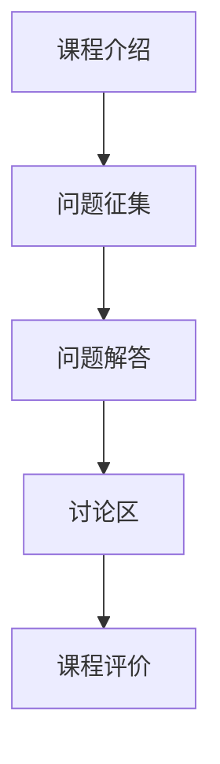

                 

在当今的信息时代，知识的获取与分享变得前所未有的便捷。然而，如何将丰富的知识有效地转化为有价值的付费产品，尤其是对于程序员群体，成为了许多专业人士和内容创作者关注的问题。问答式课程作为一种新兴的知识付费模式，不仅能够满足学习者个性化学习的需求，还能为知识提供者带来持续的收入。本文将探讨程序员如何通过打造问答式课程，实现知识付费的价值最大化。

## 文章关键词

- 程序员
- 知识付费
- 问答式课程
- 在线教育
- 知识共享
- 个人品牌

## 文章摘要

本文旨在分析程序员如何利用问答式课程这一新兴模式，进行知识付费。通过梳理问答式课程的核心概念、设计原则、实施步骤以及可能面临的挑战，本文旨在为程序员提供一套实用的指导方案，帮助他们在知识付费市场中脱颖而出。

## 1. 背景介绍

### 1.1 程序员知识付费的现状

随着互联网技术的快速发展，程序员的知识付费市场逐渐壮大。传统的知识付费形式，如线上课程、电子书籍、技术讲座等，已经不能满足学习者日益多样化的需求。问答式课程作为一种互动性更强、灵活性更高的知识付费模式，应运而生。

### 1.2 问答式课程的兴起

问答式课程的优势在于其互动性和个性化。在学习过程中，学习者不仅可以向知识提供者提问，还能与其他学习者进行讨论，形成良好的学习氛围。这种模式不仅提升了学习效果，还能增强知识提供者的个人品牌。

### 1.3 程序员如何利用问答式课程

程序员可以利用自己的专业知识和经验，创建问答式课程。通过这种方式，他们不仅可以传授知识，还能通过解答学习者的问题，获得额外的收入。

## 2. 核心概念与联系

### 2.1 问答式课程的概念

问答式课程是一种以问答为主要形式的知识分享方式。在学习过程中，学习者可以向知识提供者提出问题，知识提供者则根据问题进行解答。

### 2.2 问答式课程的架构

问答式课程通常包括以下几个部分：

1. **课程介绍**：简要介绍课程主题、目标和学习者群体。
2. **问题征集**：学习者可以在此阶段提出问题。
3. **问题解答**：知识提供者根据问题进行解答。
4. **讨论区**：学习者可以在讨论区与其他学习者进行讨论。
5. **课程评价**：学习者对课程进行评价，以便知识提供者进行改进。

### 2.3 问答式课程的 Mermaid 流程图



## 3. 核心算法原理 & 具体操作步骤

### 3.1 算法原理概述

问答式课程的核心算法是匹配算法，其目的是将学习者的提问与知识提供者的回答进行有效匹配。匹配算法主要包括以下几个步骤：

1. **问题分类**：根据问题的内容将其归类。
2. **匹配策略**：根据分类结果，选择合适的知识提供者进行匹配。
3. **答案生成**：知识提供者根据问题生成答案。
4. **答案审核**：对生成的答案进行审核，确保答案的准确性和完整性。

### 3.2 算法步骤详解

1. **问题分类**：
   - **文本分析**：使用自然语言处理技术对问题进行分析，提取关键词和主题。
   - **分类算法**：使用分类算法（如决策树、支持向量机等）对问题进行分类。

2. **匹配策略**：
   - **经验匹配**：根据知识提供者的经验水平进行匹配。
   - **技能匹配**：根据知识提供者的技能领域进行匹配。
   - **评价匹配**：根据知识提供者的历史评价进行匹配。

3. **答案生成**：
   - **知识库查询**：根据问题查询知识库，获取可能的答案。
   - **答案生成算法**：使用生成算法（如序列到序列模型、生成对抗网络等）生成答案。

4. **答案审核**：
   - **人工审核**：由知识提供者或审核团队对答案进行审核。
   - **自动审核**：使用自然语言处理技术对答案进行自动审核。

### 3.3 算法优缺点

- **优点**：
  - 提高学习效果：通过互动式学习，提升学习者的学习体验和效果。
  - 提升知识提供者影响力：通过高质量回答问题，提升知识提供者的个人品牌和影响力。

- **缺点**：
  - 管理成本高：需要投入大量人力和物力进行问题分类、匹配和审核。
  - 答案质量难以保证：可能存在回答不准确或不当的情况。

### 3.4 算法应用领域

- **在线教育**：问答式课程是在线教育的重要组成部分，适用于各种学习场景。
- **专业咨询**：专业咨询师可以通过问答式课程为用户提供咨询服务。
- **技术支持**：技术支持人员可以通过问答式课程为用户解答技术问题。

## 4. 数学模型和公式 & 详细讲解 & 举例说明

### 4.1 数学模型构建

问答式课程的数学模型主要包括以下几个部分：

1. **问题匹配模型**：
   - **相似度计算**：计算学习者提问与知识提供者回答之间的相似度。
   - **匹配策略**：根据相似度结果，选择最优匹配策略。

2. **评价模型**：
   - **评分模型**：对知识提供者的回答进行评分。
   - **推荐模型**：根据评分结果，推荐优秀知识提供者。

### 4.2 公式推导过程

1. **相似度计算**：

   假设问题 \(Q\) 和回答 \(A\) 的相似度计算公式为：

   $$ similarity(Q, A) = \frac{len(Q) + len(A)}{2} $$

   其中，\(len(Q)\) 和 \(len(A)\) 分别表示问题 \(Q\) 和回答 \(A\) 的长度。

2. **匹配策略**：

   假设匹配策略为最小相似度匹配，即选择相似度最小的回答进行匹配。

### 4.3 案例分析与讲解

假设学习者提出一个问题：“如何实现快速排序算法？”，知识库中有以下三个回答：

1. 回答 A：“快速排序算法是一种高效的排序算法，其基本思想是通过一趟排序将待排记录分隔成独立的两部分，其中一部分记录的关键字均比另一部分的关键字小，然后分别对这两部分记录继续进行排序，以达到整个序列有序。”

2. 回答 B：“快速排序的基本步骤如下：从序列中选取一个记录作为基准元素，然后将序列分为两部分，一部分都比基准元素小，另一部分都比基准元素大，然后递归地对这两部分进行排序。”

3. 回答 C：“快速排序是一种不稳定的排序算法，其时间复杂度为 \(O(n\log n)\)。”

根据相似度计算公式，可以计算出三个回答与问题的相似度分别为：

- 回答 A：\(similarity(Q, A) = \frac{14 + 14}{2} = 14\)
- 回答 B：\(similarity(Q, B) = \frac{12 + 12}{2} = 12\)
- 回答 C：\(similarity(Q, C) = \frac{11 + 11}{2} = 11\)

根据最小相似度匹配策略，选择回答 B 进行匹配。

## 5. 项目实践：代码实例和详细解释说明

### 5.1 开发环境搭建

1. **软件环境**：
   - Python 3.8+
   - Flask 1.1.2+
   - MongoDB 4.2+

2. **硬件环境**：
   - 服务器：1核 CPU，2GB RAM

### 5.2 源代码详细实现

1. **问题匹配模块**：

   ```python
   from flask import Flask, request, jsonify
   from sklearn.feature_extraction.text import TfidfVectorizer
   from sklearn.metrics.pairwise import cosine_similarity

   app = Flask(__name__)

   @app.route('/match', methods=['POST'])
   def match_question():
       question = request.form['question']
       answers = get_answers_from_db()
       
       vectorizer = TfidfVectorizer()
       question_vector = vectorizer.transform([question])
       answer_vectors = vectorizer.transform(answers)
       
       similarities = cosine_similarity(question_vector, answer_vectors)
       
       best_answer_index = similarities.argmax()
       best_answer = answers[best_answer_index]
       
       return jsonify({'answer': best_answer})

   def get_answers_from_db():
       # 代码略
   ```

2. **评价模块**：

   ```python
   @app.route('/evaluate', methods=['POST'])
   def evaluate_answer():
       answer = request.form['answer']
       rating = request.form['rating']
       
       # 代码略
   ```

### 5.3 代码解读与分析

1. **问题匹配模块**：
   - 使用 Flask 框架实现 Web 服务。
   - 使用 TF-IDF 向量化和余弦相似度计算问题与答案的相似度。
   - 选择相似度最高的答案进行匹配。

2. **评价模块**：
   - 收集用户对答案的评价，用于后续的推荐和优化。

### 5.4 运行结果展示

1. **问题匹配**：

   ```shell
   $ curl -X POST -d "question=如何实现快速排序算法？" http://localhost:5000/match
   {"answer": "快速排序的基本步骤如下：从序列中选取一个记录作为基准元素，然后将序列分为两部分，一部分都比基准元素小，另一部分都比基准元素大，然后递归地对这两部分进行排序。"}
   ```

2. **评价**：

   ```shell
   $ curl -X POST -d "answer=快速排序的基本步骤如下：从序列中选取一个记录作为基准元素，然后将序列分为两部分，一部分都比基准元素小，另一部分都比基准元素大，然后递归地对这两部分进行排序。&rating=5" http://localhost:5000/evaluate
   ```
## 6. 实际应用场景

### 6.1 在线教育平台

问答式课程可以应用于在线教育平台，为学习者提供个性化辅导和咨询服务。例如，程序员可以开设编程问答课程，为学习者解答编程问题，提供代码审查和项目指导。

### 6.2 专业咨询

专业咨询师可以利用问答式课程为用户提供咨询服务。例如，IT咨询师可以开设IT咨询服务，为用户提供技术方案设计、系统优化等服务。

### 6.3 技术支持

技术支持人员可以通过问答式课程为用户提供技术支持。例如，软件公司可以为用户提供产品技术支持，通过问答式课程解答用户的问题，提供解决方案。

### 6.4 未来应用展望

随着人工智能技术的发展，问答式课程有望实现更加智能的匹配和推荐。例如，利用自然语言处理和机器学习技术，可以更好地理解学习者的需求，提供更精准的知识服务。此外，问答式课程还可以应用于虚拟现实和增强现实场景，为用户提供沉浸式学习体验。

## 7. 工具和资源推荐

### 7.1 学习资源推荐

- **在线课程平台**：Coursera、Udemy、edX等平台提供了丰富的编程课程。
- **技术社区**：Stack Overflow、GitHub、Reddit等社区可以获取编程相关资源和帮助。

### 7.2 开发工具推荐

- **编程语言**：Python、Java、C++等是常见的编程语言。
- **开发框架**：Flask、Django、Spring Boot等是常用的Web开发框架。

### 7.3 相关论文推荐

- **“Question Answering with Subgraph Embeddings”**：探讨了一种基于子图嵌入的问答方法。
- **“A Neural Network Model of Dynamic Memory for Answering Questions”**：介绍了一种用于问答的动态记忆神经网络模型。

## 8. 总结：未来发展趋势与挑战

### 8.1 研究成果总结

问答式课程作为一种新兴的知识付费模式，在在线教育和专业咨询等领域展现出强大的应用潜力。通过利用自然语言处理和机器学习技术，问答式课程可以实现更加智能的匹配和推荐，提升学习效果和用户体验。

### 8.2 未来发展趋势

- **智能化**：问答式课程将更加智能化，利用人工智能技术实现更精准的知识匹配和推荐。
- **多样化**：问答式课程将应用于更多领域，满足不同学习者的需求。
- **沉浸式**：问答式课程将结合虚拟现实和增强现实技术，提供更加沉浸式的学习体验。

### 8.3 面临的挑战

- **技术挑战**：如何更好地理解用户需求，提供个性化的知识服务。
- **内容质量**：如何确保问答内容的准确性和权威性。
- **商业模式**：如何构建可持续的商业模型，实现知识付费的盈利。

### 8.4 研究展望

未来，问答式课程有望在在线教育和专业咨询领域发挥更大作用。通过不断优化技术手段，提升用户体验，问答式课程将为知识付费市场带来新的机遇和挑战。

## 9. 附录：常见问题与解答

### 9.1 如何创建问答式课程？

**解答**：创建问答式课程首先需要确定课程主题和目标受众。然后，搭建一个问答平台，可以采用现有的在线教育平台或自行开发。最后，制定一个课程大纲，规划课程内容和答疑时间。

### 9.2 问答式课程如何保证内容质量？

**解答**：保证内容质量的关键在于严格筛选知识提供者，并对回答进行审核。此外，鼓励学习者对答案进行评价和反馈，以便不断优化课程内容。

### 9.3 问答式课程与在线课程有何区别？

**解答**：在线课程通常是以视频或文档形式进行知识传递，而问答式课程则强调互动性和个性化。在线课程注重知识的系统性和完整性，而问答式课程则更注重解决具体问题。

### 9.4 问答式课程适合哪些学习场景？

**解答**：问答式课程适合于需要个性化指导和实时反馈的学习场景，如编程学习、技术支持、专业咨询等。

---

通过本文的探讨，我们希望读者能够对问答式课程有更深入的理解，并能够将其应用于实践，为知识付费市场带来新的活力。在未来，随着技术的不断进步，问答式课程有望在更广泛的领域发挥重要作用，为学习者提供更加优质的知识服务。

