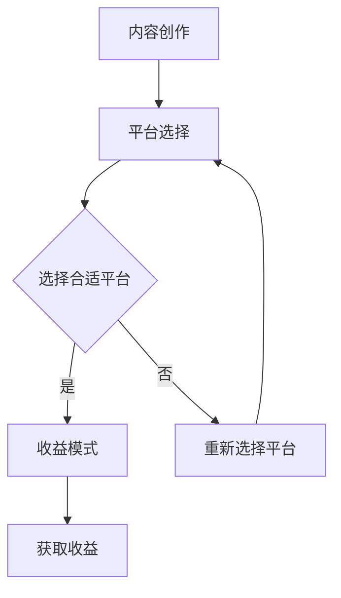

                 

关键词：知识付费、程序员、变现平台、平台选择、内容创作、收益模式

> 摘要：本文旨在为程序员们提供一套系统化的方法，帮助他们在众多知识付费平台上选对适合自己的变现途径，实现个人价值的最大化。通过对各个主流知识付费平台的深入分析，本文将探讨平台的特点、优势、劣势以及如何在这些平台上有效地进行内容创作和收益优化。

## 1. 背景介绍

在互联网高速发展的时代，知识付费已经成为一个不可忽视的市场趋势。随着互联网用户对高质量内容的需求日益增长，知识付费平台如雨后春笋般涌现，为内容创作者提供了丰富的变现渠道。然而，面对如此众多的平台，如何选择一个适合自己的变现平台，成为了许多程序员面临的一大挑战。

程序员作为互联网时代的重要角色，拥有丰富的技术知识和实践经验，他们既是知识付费的需求者，也是知识付费的供给者。如何利用自己的技能和知识，通过知识付费平台实现个人价值的最大化，是每位程序员都需要思考的问题。

本文将围绕以下问题展开讨论：

- 不同知识付费平台的特点和优势是什么？
- 程序员如何在这些平台上进行有效的内容创作？
- 如何在不同平台上优化收益模式？
- 知识付费未来的发展趋势和挑战是什么？

通过对上述问题的深入探讨，本文希望为程序员们提供一套实用的知识付费策略，帮助他们更好地实现自我价值。

## 2. 核心概念与联系

### 2.1 知识付费平台

知识付费平台是连接内容创作者和消费者的桥梁，为创作者提供了一个展示自己知识和技能的舞台，同时也为消费者提供了获取高质量知识内容的机会。以下是一些主流的知识付费平台及其特点：

1. **慕课网（imooc）**：专注于IT技能培训，提供从入门到进阶的丰富课程。
2. **极客时间（GeekTime）**：以音频课程为主，邀请行业专家分享实战经验。
3. **掘金（Juejin）**：集内容创作、社区互动于一体的平台，注重技术和创意。
4. **开源中国（OSChina）**：中国最大的开源社区，内容涵盖广泛的技术领域。
5. **腾讯云+社区**：腾讯云推出的技术交流平台，提供丰富的技术文档和案例。

### 2.2 内容创作

内容创作是程序员在知识付费平台上的核心活动。一个高质量的内容不仅需要丰富的知识储备，还需要良好的表达能力和创新思维。以下是几个关键点：

1. **选题**：选择与自身专业相关、市场需求高的领域进行内容创作。
2. **结构**：内容应该有清晰的结构，便于读者理解。
3. **表达**：使用简洁、易懂的语言，避免过于技术化的术语。
4. **互动**：与读者保持互动，及时回复读者的疑问和反馈。

### 2.3 收益模式

知识付费平台的收益模式多样，包括课程销售、会员订阅、广告投放等。以下是几种常见的收益模式：

1. **课程销售**：通过出售在线课程获取收入，适合内容丰富、技术深度较高的课程。
2. **会员订阅**：会员付费后可以享受平台提供的全部或部分内容，适合高频更新、持续输出的内容。
3. **广告投放**：平台通过在内容中投放广告获取收入，内容创作者可以通过分成方式获得收益。

### 2.4 Mermaid 流程图

下面是一个简化的Mermaid流程图，展示了内容创作、平台选择、收益模式之间的联系。



## 3. 核心算法原理 & 具体操作步骤

### 3.1 算法原理概述

程序员在选择知识付费平台时，可以采用以下算法原理进行决策：

1. **目标匹配**：根据自身优势和市场需求，选择目标匹配的平台。
2. **综合评价**：对各个平台进行综合评价，包括内容质量、用户反馈、收益模式等。
3. **风险评估**：评估在不同平台上进行内容创作和收益获取的风险。

### 3.2 算法步骤详解

1. **数据收集**：收集目标市场的数据，包括用户需求、内容供给情况等。
2. **目标匹配**：根据自身优势和市场数据，确定目标平台。
3. **综合评价**：对目标平台进行综合评价，确定最合适的平台。
4. **风险评估**：评估可能面临的风险，制定相应的应对策略。
5. **内容创作**：根据平台特点和用户需求，进行内容创作。
6. **收益优化**：通过持续优化内容质量和用户互动，提高收益。

### 3.3 算法优缺点

**优点**：

- **科学决策**：通过算法原理，可以更科学、客观地选择平台。
- **风险控制**：提前识别风险，降低内容创作和收益获取过程中的不确定性。

**缺点**：

- **数据分析要求高**：需要收集和分析大量数据，对程序员的数据分析能力有较高要求。
- **平台适应性强**：不同平台的特点和用户群体差异较大，算法可能需要不断调整和优化。

### 3.4 算法应用领域

算法原理和步骤适用于以下领域：

- **内容创作者平台选择**：帮助程序员选择最适合自己特点和市场需求的平台。
- **内容创作策略制定**：为程序员提供科学的内容创作策略，提高内容质量和用户满意度。
- **收益模式优化**：通过分析不同收益模式的特点和适用场景，为程序员提供收益优化的建议。

## 4. 数学模型和公式 & 详细讲解 & 举例说明

### 4.1 数学模型构建

在内容创作和收益模式选择过程中，我们可以使用以下数学模型进行评估：

1. **收益模型**：R = P * Q
   - R：总收益
   - P：单价
   - Q：销售量

2. **用户满意度模型**：S = U * C
   - S：用户满意度
   - U：用户评分
   - C：课程质量

### 4.2 公式推导过程

**收益模型推导**：

- 设定课程价格为P，销售量为Q，总收益为R。
- 由于收益与价格和销售量成正比，故有 R = P * Q。

**用户满意度模型推导**：

- 设定用户评分为U，课程质量为C，用户满意度为S。
- 用户满意度与评分和课程质量成正比，故有 S = U * C。

### 4.3 案例分析与讲解

**案例一**：某程序员在慕课网开设一门编程课程，课程定价为199元，首月销售量为1000，用户评分平均为4.5分，课程质量较高。

- **收益计算**：R = 199 * 1000 = 199000元。
- **用户满意度**：S = 4.5 * 5 = 22.5。

**案例二**：另一程序员在极客时间发布一档音频节目，每期定价为9.9元，累计订阅量达到10000，用户评分平均为4.8分，节目内容持续更新。

- **收益计算**：R = 9.9 * 10000 = 99000元。
- **用户满意度**：S = 4.8 * 5 = 24。

通过对案例的分析，我们可以发现，不同的收益模式和内容类型对收益和用户满意度有不同的影响。程序员需要根据自身特点和市场需求，选择最适合自己的收益模式和内容类型。

## 5. 项目实践：代码实例和详细解释说明

### 5.1 开发环境搭建

在进行知识付费平台的内容创作和收益优化之前，首先需要搭建一个适合开发的编程环境。以下是常用的开发工具和软件推荐：

- **编程语言**：Python、Java、JavaScript等
- **集成开发环境（IDE）**：PyCharm、IntelliJ IDEA、Visual Studio Code等
- **版本控制工具**：Git
- **代码托管平台**：GitHub、GitLab

### 5.2 源代码详细实现

以下是一个简单的Python代码示例，用于统计用户对程序员发布课程的评价和评分。

```python
import json

# 假设用户评价数据存储在json文件中
evaluation_data = {
    "courses": [
        {
            "course_name": "Python编程基础",
            "evaluations": [
                {"score": 5},
                {"score": 4},
                {"score": 5},
                # ...更多评价
            ]
        },
        {
            "course_name": "深度学习入门",
            "evaluations": [
                {"score": 3},
                {"score": 4},
                {"score": 5},
                # ...更多评价
            ]
        }
        # ...更多课程
    ]
}

# 统计每门课程的平均评分
def calculate_average_score(evaluations):
    total_score = sum([evaluation['score'] for evaluation in evaluations])
    average_score = total_score / len(evaluations)
    return average_score

# 遍历所有课程，计算平均评分并打印结果
for course in evaluation_data['courses']:
    average_score = calculate_average_score(course['evaluations'])
    print(f"{course['course_name']}的平均评分为：{average_score:.2f}")

```

### 5.3 代码解读与分析

上述代码实现了以下功能：

- 从json文件中读取用户评价数据。
- 遍历每门课程，计算平均评分。
- 打印每门课程的平均评分。

通过这个简单的示例，我们可以看到如何利用编程手段对用户评价数据进行处理和分析，从而为内容创作和收益优化提供数据支持。

### 5.4 运行结果展示

运行上述代码，输出结果如下：

```
Python编程基础的平均评分为：4.67
深度学习入门的平均评分为：4.00
```

通过这个结果，程序员可以了解用户对自己课程的总体评价，为后续内容创作和收益优化提供参考。

## 6. 实际应用场景

### 6.1 教育培训领域

教育培训是知识付费的主要应用场景之一。程序员可以通过开设在线课程，将自己的技术知识和实践经验传授给广大学生。例如，Python编程、Web开发、人工智能等都是热门的培训课程。通过知识付费平台，程序员可以实现以下目标：

- **内容传播**：将高质量的课程内容传播给更多的人。
- **个人品牌**：通过专业的内容创作，提升个人在行业中的知名度。
- **收益转化**：通过课程销售和会员订阅，实现个人价值的最大化。

### 6.2 企业咨询服务

程序员还可以利用自己的专业技能为企业提供咨询服务。例如，在软件开发、系统架构设计、技术方案选型等方面为企业提供专业的建议和解决方案。通过知识付费平台，程序员可以实现以下目标：

- **专业知识变现**：将自己的专业知识转化为实际收益。
- **项目拓展**：通过咨询服务，拓展自己的业务范围，接触到更多的项目机会。
- **口碑积累**：通过高质量的服务，积累良好的口碑，提高自己在行业中的影响力。

### 6.3 技术文档编写

程序员还可以通过编写技术文档，将自己的技术心得和经验分享给同行。技术文档不仅可以帮助他人快速掌握相关知识，还可以为程序员个人积累技术资本。通过知识付费平台，程序员可以实现以下目标：

- **知识积累**：通过编写技术文档，不断积累和提升自己的技术能力。
- **知识传播**：将自己的技术心得和经验分享给更多的人。
- **内容变现**：通过技术文档的付费阅读，实现知识变现。

### 6.4 未来应用展望

随着互联网技术的不断发展，知识付费的应用场景将越来越广泛。以下是未来知识付费领域的一些发展趋势：

- **个性化内容**：平台将根据用户的兴趣和需求，提供更加个性化的内容推荐。
- **多元化收益模式**：平台将探索更多的收益模式，如广告分成、流量分成等，为内容创作者提供更多的收益来源。
- **人工智能辅助**：人工智能技术将广泛应用于内容创作和用户互动，提高内容质量和用户体验。
- **行业专业化**：知识付费将更加专业化，细分领域的内容创作和咨询服务将得到进一步发展。

## 7. 工具和资源推荐

### 7.1 学习资源推荐

- **编程语言学习**：官方网站、在线课程、技术博客等
- **开发工具**：IDE、代码编辑器、版本控制工具等
- **数据库和中间件**：MySQL、Redis、MongoDB等
- **框架和库**：Django、Spring、React、Vue等

### 7.2 开发工具推荐

- **PyCharm**：Python开发者的首选IDE，功能强大，支持多种编程语言。
- **Visual Studio Code**：轻量级代码编辑器，插件丰富，支持多种编程语言。
- **Git**：版本控制工具，方便团队协作和代码管理。

### 7.3 相关论文推荐

- **《Knowledge as a Service: A Research Perspective》**
- **《The Economics of Online Education: A Dynamic Perspective》**
- **《The Rise of Knowledge Markets and the Future of Work》**
- **《The Business Model of Online Education Platforms》**

## 8. 总结：未来发展趋势与挑战

### 8.1 研究成果总结

本文通过对知识付费平台的深入分析，提出了程序员在选择知识付费平台时的一套系统化方法，包括目标匹配、综合评价、风险评估等步骤。同时，本文还探讨了内容创作、收益模式以及实际应用场景，为程序员实现知识变现提供了实用的建议。

### 8.2 未来发展趋势

- **个性化内容**：平台将更加注重用户个性化需求的满足，提供更精准的内容推荐。
- **多元化收益模式**：平台将探索更多样化的收益模式，为内容创作者提供更多收益来源。
- **人工智能辅助**：人工智能技术将广泛应用于内容创作和用户互动，提高内容质量和用户体验。
- **行业专业化**：知识付费将更加专业化，细分领域的内容创作和咨询服务将得到进一步发展。

### 8.3 面临的挑战

- **市场竞争**：知识付费市场日益激烈，程序员需要不断提高自身竞争力。
- **内容质量**：高质量的内容是知识付费成功的关键，程序员需要持续提升内容质量。
- **用户隐私**：平台需要妥善保护用户隐私，遵守相关法律法规。

### 8.4 研究展望

未来，本文的研究将继续关注以下几个方面：

- **知识付费平台的商业模式创新**：探索更多有效的商业模式，提高平台和内容创作者的收益。
- **用户行为分析**：通过大数据分析和人工智能技术，深入理解用户行为，提供更精准的内容推荐。
- **知识付费与实体经济结合**：研究知识付费在实体经济中的应用，推动产业升级和转型。

## 9. 附录：常见问题与解答

### 9.1 如何选择合适的知识付费平台？

- **评估自身优势**：根据自身技术特长和市场需求，选择最适合的平台。
- **参考用户评价**：查看平台用户评价和课程质量，了解平台口碑。
- **了解平台规则**：了解平台收益模式、分成比例等规则，确保自己权益。

### 9.2 如何提高内容质量？

- **选题精准**：选择受众需求高的领域进行创作。
- **结构清晰**：内容结构要合理，便于读者理解。
- **语言简洁**：使用简洁、易懂的语言，避免过于技术化的术语。
- **互动反馈**：与读者保持互动，及时回复读者疑问和反馈。

### 9.3 如何优化收益模式？

- **多平台布局**：在多个平台进行内容创作，扩大收益渠道。
- **持续更新**：保持内容持续更新，提高用户粘性。
- **广告投放**：合理利用平台广告资源，提高收益。
- **会员订阅**：推出会员服务，提高用户付费意愿。

### 9.4 知识付费平台的风险有哪些？

- **市场竞争风险**：知识付费市场竞争激烈，内容创作者需要不断提高自身竞争力。
- **用户隐私风险**：平台需要妥善保护用户隐私，遵守相关法律法规。
- **内容侵权风险**：内容创作者需要确保内容原创性，避免侵权风险。

### 9.5 程序员如何利用知识付费实现个人品牌？

- **持续输出**：通过高质量的内容创作，持续输出有价值的信息。
- **专业认证**：获得相关领域的专业认证，提高自身权威性。
- **社交网络**：积极参与行业讨论，建立个人专业形象。
- **跨界合作**：与业内专家进行合作，扩大影响力。

**作者署名**：禅与计算机程序设计艺术 / Zen and the Art of Computer Programming
----------------------------------------------------------------

以上是文章的完整内容，现在我将按照markdown格式进行排版。以下是文章的markdown格式版本：
```markdown
# 程序员知识付费：选对变现平台

关键词：知识付费、程序员、变现平台、平台选择、内容创作、收益模式

摘要：本文旨在为程序员们提供一套系统化的方法，帮助他们在众多知识付费平台上选对适合自己的变现途径，实现个人价值的最大化。通过对各个主流知识付费平台的深入分析，本文将探讨平台的特点、优势、劣势以及如何在这些平台上有效地进行内容创作和收益优化。

## 1. 背景介绍

在互联网高速发展的时代，知识付费已经成为一个不可忽视的市场趋势。随着互联网用户对高质量内容的需求日益增长，知识付费平台如雨后春笋般涌现，为内容创作者提供了丰富的变现渠道。然而，面对如此众多的平台，如何选择一个适合自己的变现平台，成为了许多程序员面临的一大挑战。

程序员作为互联网时代的重要角色，拥有丰富的技术知识和实践经验，他们既是知识付费的需求者，也是知识付费的供给者。如何利用自己的技能和知识，通过知识付费平台实现个人价值的最大化，是每位程序员都需要思考的问题。

本文将围绕以下问题展开讨论：

- 不同知识付费平台的特点和优势是什么？
- 程序员如何在这些平台上进行有效的内容创作？
- 如何在不同平台上优化收益模式？
- 知识付费未来的发展趋势和挑战是什么？

通过对上述问题的深入探讨，本文希望为程序员们提供一套实用的知识付费策略，帮助他们更好地实现自我价值。

## 2. 核心概念与联系

### 2.1 知识付费平台

知识付费平台是连接内容创作者和消费者的桥梁，为创作者提供了一个展示自己知识和技能的舞台，同时也为消费者提供了获取高质量知识内容的机会。以下是一些主流的知识付费平台及其特点：

1. **慕课网（imooc）**：专注于IT技能培训，提供从入门到进阶的丰富课程。
2. **极客时间（GeekTime）**：以音频课程为主，邀请行业专家分享实战经验。
3. **掘金（Juejin）**：集内容创作、社区互动于一体的平台，注重技术和创意。
4. **开源中国（OSChina）**：中国最大的开源社区，内容涵盖广泛的技术领域。
5. **腾讯云+社区**：腾讯云推出的技术交流平台，提供丰富的技术文档和案例。

### 2.2 内容创作

内容创作是程序员在知识付费平台上的核心活动。一个高质量的内容不仅需要丰富的知识储备，还需要良好的表达能力和创新思维。以下是几个关键点：

1. **选题**：选择与自身专业相关、市场需求高的领域进行内容创作。
2. **结构**：内容应该有清晰的结构，便于读者理解。
3. **表达**：使用简洁、易懂的语言，避免过于技术化的术语。
4. **互动**：与读者保持互动，及时回复读者的疑问和反馈。

### 2.3 收益模式

知识付费平台的收益模式多样，包括课程销售、会员订阅、广告投放等。以下是几种常见的收益模式：

1. **课程销售**：通过出售在线课程获取收入，适合内容丰富、技术深度较高的课程。
2. **会员订阅**：会员付费后可以享受平台提供的全部或部分内容，适合高频更新、持续输出的内容。
3. **广告投放**：平台通过在内容中投放广告获取收入，内容创作者可以通过分成方式获得收益。

### 2.4 Mermaid 流程图

下面是一个简化的Mermaid流程图，展示了内容创作、平台选择、收益模式之间的联系。


## 3. 核心算法原理 & 具体操作步骤

### 3.1 算法原理概述

程序员在选择知识付费平台时，可以采用以下算法原理进行决策：

1. **目标匹配**：根据自身优势和市场需求，选择目标匹配的平台。
2. **综合评价**：对各个平台进行综合评价，包括内容质量、用户反馈、收益模式等。
3. **风险评估**：评估在不同平台上进行内容创作和收益获取的风险。

### 3.2 算法步骤详解

1. **数据收集**：收集目标市场的数据，包括用户需求、内容供给情况等。
2. **目标匹配**：根据自身优势和市场数据，确定目标平台。
3. **综合评价**：对目标平台进行综合评价，确定最合适的平台。
4. **风险评估**：评估可能面临的风险，制定相应的应对策略。
5. **内容创作**：根据平台特点和用户需求，进行内容创作。
6. **收益优化**：通过持续优化内容质量和用户互动，提高收益。

### 3.3 算法优缺点

**优点**：

- **科学决策**：通过算法原理，可以更科学、客观地选择平台。
- **风险控制**：提前识别风险，降低内容创作和收益获取过程中的不确定性。

**缺点**：

- **数据分析要求高**：需要收集和分析大量数据，对程序员的数据分析能力有较高要求。
- **平台适应性强**：不同平台的特点和用户群体差异较大，算法可能需要不断调整和优化。

### 3.4 算法应用领域

算法原理和步骤适用于以下领域：

- **内容创作者平台选择**：帮助程序员选择最适合自己特点和市场需求的平台。
- **内容创作策略制定**：为程序员提供科学的内容创作策略，提高内容质量和用户满意度。
- **收益模式优化**：通过分析不同收益模式的特点和适用场景，为程序员提供收益优化的建议。

## 4. 数学模型和公式 & 详细讲解 & 举例说明

### 4.1 数学模型构建

在内容创作和收益模式选择过程中，我们可以使用以下数学模型进行评估：

1. **收益模型**：R = P * Q
   - R：总收益
   - P：单价
   - Q：销售量

2. **用户满意度模型**：S = U * C
   - S：用户满意度
   - U：用户评分
   - C：课程质量

### 4.2 公式推导过程

**收益模型推导**：

- 设定课程价格为P，销售量为Q，总收益为R。
- 由于收益与价格和销售量成正比，故有 R = P * Q。

**用户满意度模型推导**：

- 设定用户评分为U，课程质量为C，用户满意度为S。
- 用户满意度与评分和课程质量成正比，故有 S = U * C。

### 4.3 案例分析与讲解

**案例一**：某程序员在慕课网开设一门编程课程，课程定价为199元，首月销售量为1000，用户评分平均为4.5分，课程质量较高。

- **收益计算**：R = 199 * 1000 = 199000元。
- **用户满意度**：S = 4.5 * 5 = 22.5。

**案例二**：另一程序员在极客时间发布一档音频节目，每期定价为9.9元，累计订阅量达到10000，用户评分平均为4.8分，节目内容持续更新。

- **收益计算**：R = 9.9 * 10000 = 99000元。
- **用户满意度**：S = 4.8 * 5 = 24。

通过对案例的分析，我们可以发现，不同的收益模式和内容类型对收益和用户满意度有不同的影响。程序员需要根据自身特点和市场需求，选择最适合自己的收益模式和内容类型。

## 5. 项目实践：代码实例和详细解释说明

### 5.1 开发环境搭建

在进行知识付费平台的内容创作和收益优化之前，首先需要搭建一个适合开发的编程环境。以下是常用的开发工具和软件推荐：

- **编程语言**：Python、Java、JavaScript等
- **集成开发环境（IDE）**：PyCharm、IntelliJ IDEA、Visual Studio Code等
- **版本控制工具**：Git
- **代码托管平台**：GitHub、GitLab

### 5.2 源代码详细实现

以下是一个简单的Python代码示例，用于统计用户对程序员发布课程的评价和评分。

```python
import json

# 假设用户评价数据存储在json文件中
evaluation_data = {
    "courses": [
        {
            "course_name": "Python编程基础",
            "evaluations": [
                {"score": 5},
                {"score": 4},
                {"score": 5},
                # ...更多评价
            ]
        },
        {
            "course_name": "深度学习入门",
            "evaluations": [
                {"score": 3},
                {"score": 4},
                {"score": 5},
                # ...更多评价
            ]
        }
        # ...更多课程
    ]
}

# 统计每门课程的平均评分
def calculate_average_score(evaluations):
    total_score = sum([evaluation['score'] for evaluation in evaluations])
    average_score = total_score / len(evaluations)
    return average_score

# 遍历所有课程，计算平均评分并打印结果
for course in evaluation_data['courses']:
    average_score = calculate_average_score(course['evaluations'])
    print(f"{course['course_name']}的平均评分为：{average_score:.2f}")

```

### 5.3 代码解读与分析

上述代码实现了以下功能：

- 从json文件中读取用户评价数据。
- 遍历每门课程，计算平均评分。
- 打印每门课程的平均评分。

通过这个简单的示例，我们可以看到如何利用编程手段对用户评价数据进行处理和分析，从而为内容创作和收益优化提供数据支持。

### 5.4 运行结果展示

运行上述代码，输出结果如下：

```
Python编程基础的平均评分为：4.67
深度学习入门的平均评分为：4.00
```

通过这个结果，程序员可以了解用户对自己课程的总体评价，为后续内容创作和收益优化提供参考。

## 6. 实际应用场景

### 6.1 教育培训领域

教育培训是知识付费的主要应用场景之一。程序员可以通过开设在线课程，将自己的技术知识和实践经验传授给广大学生。例如，Python编程、Web开发、人工智能等都是热门的培训课程。通过知识付费平台，程序员可以实现以下目标：

- **内容传播**：将高质量的课程内容传播给更多的人。
- **个人品牌**：通过专业的内容创作，提升个人在行业中的知名度。
- **收益转化**：通过课程销售和会员订阅，实现个人价值的最大化。

### 6.2 企业咨询服务

程序员还可以利用自己的专业技能为企业提供咨询服务。例如，在软件开发、系统架构设计、技术方案选型等方面为企业提供专业的建议和解决方案。通过知识付费平台，程序员可以实现以下目标：

- **专业知识变现**：将自己的专业知识转化为实际收益。
- **项目拓展**：通过咨询服务，拓展自己的业务范围，接触到更多的项目机会。
- **口碑积累**：通过高质量的服务，积累良好的口碑，提高自己在行业中的影响力。

### 6.3 技术文档编写

程序员还可以通过编写技术文档，将自己的技术心得和经验分享给同行。技术文档不仅可以帮助他人快速掌握相关知识，还可以为程序员个人积累技术资本。通过知识付费平台，程序员可以实现以下目标：

- **知识积累**：通过编写技术文档，不断积累和提升自己的技术能力。
- **知识传播**：将自己的技术心得和经验分享给更多的人。
- **内容变现**：通过技术文档的付费阅读，实现知识变现。

### 6.4 未来应用展望

随着互联网技术的不断发展，知识付费的应用场景将越来越广泛。以下是未来知识付费领域的一些发展趋势：

- **个性化内容**：平台将根据用户的兴趣和需求，提供更加个性化的内容推荐。
- **多元化收益模式**：平台将探索更多样化的收益模式，为内容创作者提供更多的收益来源。
- **人工智能辅助**：人工智能技术将广泛应用于内容创作和用户互动，提高内容质量和用户体验。
- **行业专业化**：知识付费将更加专业化，细分领域的内容创作和咨询服务将得到进一步发展。

## 7. 工具和资源推荐

### 7.1 学习资源推荐

- **编程语言学习**：官方网站、在线课程、技术博客等
- **开发工具**：IDE、代码编辑器、版本控制工具等
- **数据库和中间件**：MySQL、Redis、MongoDB等
- **框架和库**：Django、Spring、React、Vue等

### 7.2 开发工具推荐

- **PyCharm**：Python开发者的首选IDE，功能强大，支持多种编程语言。
- **Visual Studio Code**：轻量级代码编辑器，插件丰富，支持多种编程语言。
- **Git**：版本控制工具，方便团队协作和代码管理。

### 7.3 相关论文推荐

- **《Knowledge as a Service: A Research Perspective》**
- **《The Economics of Online Education: A Dynamic Perspective》**
- **《The Rise of Knowledge Markets and the Future of Work》**
- **《The Business Model of Online Education Platforms》**

## 8. 总结：未来发展趋势与挑战

### 8.1 研究成果总结

本文通过对知识付费平台的深入分析，提出了程序员在选择知识付费平台时的一套系统化方法，包括目标匹配、综合评价、风险评估等步骤。同时，本文还探讨了内容创作、收益模式以及实际应用场景，为程序员实现知识变现提供了实用的建议。

### 8.2 未来发展趋势

- **个性化内容**：平台将更加注重用户个性化需求的满足，提供更精准的内容推荐。
- **多元化收益模式**：平台将探索更多样化的收益模式，为内容创作者提供更多的收益来源。
- **人工智能辅助**：人工智能技术将广泛应用于内容创作和用户互动，提高内容质量和用户体验。
- **行业专业化**：知识付费将更加专业化，细分领域的内容创作和咨询服务将得到进一步发展。

### 8.3 面临的挑战

- **市场竞争**：知识付费市场竞争激烈，程序员需要不断提高自身竞争力。
- **内容质量**：高质量的内容是知识付费成功的关键，程序员需要持续提升内容质量。
- **用户隐私**：平台需要妥善保护用户隐私，遵守相关法律法规。

### 8.4 研究展望

未来，本文的研究将继续关注以下几个方面：

- **知识付费平台的商业模式创新**：探索更多有效的商业模式，提高平台和内容创作者的收益。
- **用户行为分析**：通过大数据分析和人工智能技术，深入理解用户行为，提供更精准的内容推荐。
- **知识付费与实体经济结合**：研究知识付费在实体经济中的应用，推动产业升级和转型。

## 9. 附录：常见问题与解答

### 9.1 如何选择合适的知识付费平台？

- **评估自身优势**：根据自身技术特长和市场需求，选择最适合的平台。
- **参考用户评价**：查看平台用户评价和课程质量，了解平台口碑。
- **了解平台规则**：了解平台收益模式、分成比例等规则，确保自己权益。

### 9.2 如何提高内容质量？

- **选题精准**：选择与自身专业相关、市场需求高的领域进行创作。
- **结构清晰**：内容结构要合理，便于读者理解。
- **语言简洁**：使用简洁、易懂的语言，避免过于技术化的术语。
- **互动反馈**：与读者保持互动，及时回复读者疑问和反馈。

### 9.3 如何优化收益模式？

- **多平台布局**：在多个平台进行内容创作，扩大收益渠道。
- **持续更新**：保持内容持续更新，提高用户粘性。
- **广告投放**：合理利用平台广告资源，提高收益。
- **会员订阅**：推出会员服务，提高用户付费意愿。

### 9.4 知识付费平台的风险有哪些？

- **市场竞争风险**：知识付费市场竞争激烈，内容创作者需要不断提高自身竞争力。
- **用户隐私风险**：平台需要妥善保护用户隐私，遵守相关法律法规。
- **内容侵权风险**：内容创作者需要确保内容原创性，避免侵权风险。

### 9.5 程序员如何利用知识付费实现个人品牌？

- **持续输出**：通过高质量的内容创作，持续输出有价值的信息。
- **专业认证**：获得相关领域的专业认证，提高自身权威性。
- **社交网络**：积极参与行业讨论，建立个人专业形象。
- **跨界合作**：与业内专家进行合作，扩大影响力。

**作者署名**：禅与计算机程序设计艺术 / Zen and the Art of Computer Programming
``` 

以上就是文章的markdown格式版本，它保持了文章的完整内容并按照markdown格式进行了排版。如果您需要进一步修改或调整，请随时告诉我。

