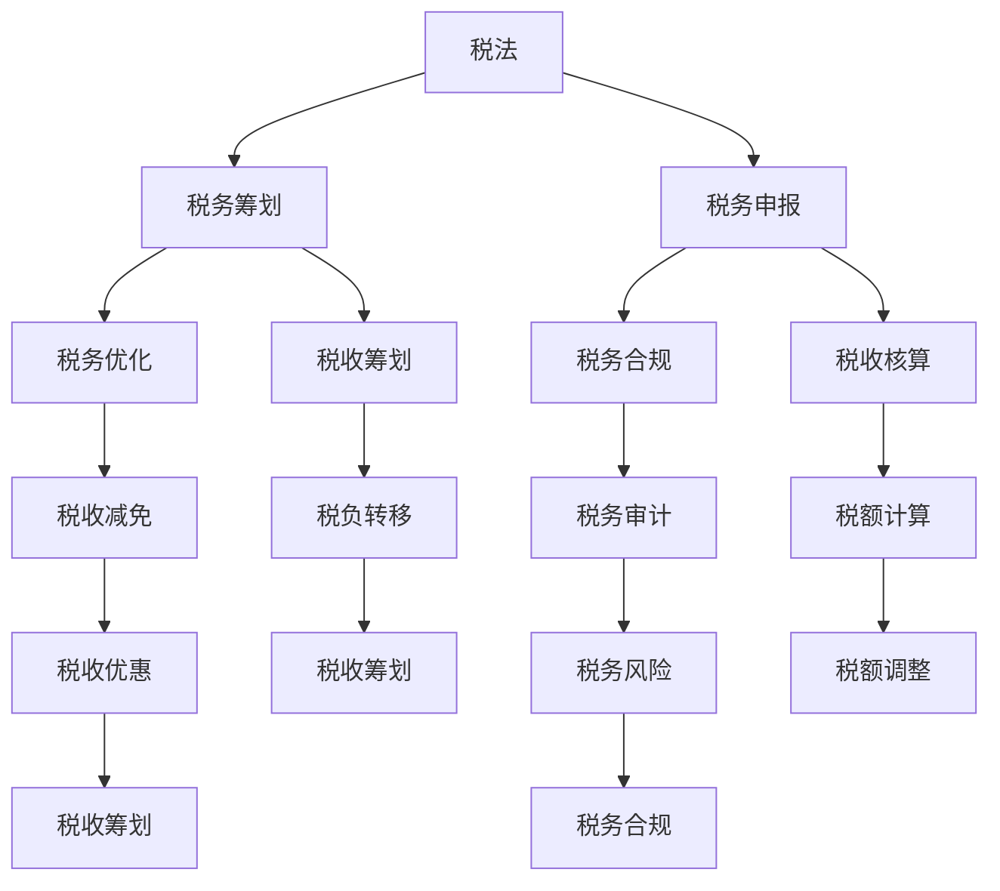

                 

关键词：税务规划，知识付费，财税管理，程序员，税收优化，财务策略

> 摘要：本文旨在为程序员提供一套系统化的税务规划指南，从知识付费的角度出发，探讨如何有效进行财税管理，以实现个人财务优化。文章涵盖了税务规划的核心概念、算法原理、数学模型、具体操作步骤，并通过实际案例和实践，展示税务规划在程序员日常工作和生活中的应用。最后，文章对未来税务规划的发展趋势、面临的挑战以及研究展望进行了深入分析。

## 1. 背景介绍

在当今数字化时代，知识付费已经成为一种趋势。程序员作为知识型劳动者，其收入来源不仅包括传统的薪资，还涉及知识付费、咨询费、版权收入等多种形式。与此同时，财税管理对于程序员来说也越来越重要。合理进行税务规划不仅可以减轻税负，还能够实现个人财务的稳健增长。然而，许多程序员在税务规划方面缺乏专业知识和经验，导致在税务处理上存在诸多问题。

本文旨在帮助程序员树立正确的税务规划观念，掌握基本的财税管理技能，从而实现个人财务优化。文章将从以下几个方面展开：

- **核心概念与联系**：介绍税务规划中的核心概念，如税法、税务筹划、税务申报等，并使用 Mermaid 流程图展示各概念之间的联系。
- **核心算法原理 & 具体操作步骤**：讲解税务规划中的核心算法原理，包括税收优化算法、税负计算算法等，并提供具体的操作步骤。
- **数学模型和公式 & 详细讲解 & 举例说明**：构建税务规划中的数学模型，推导相关公式，并通过案例进行分析。
- **项目实践：代码实例和详细解释说明**：提供实际项目中的代码实例，详细解释说明代码实现过程。
- **实际应用场景**：探讨税务规划在程序员日常工作和生活中的应用。
- **工具和资源推荐**：推荐学习资源和开发工具，帮助程序员更好地进行税务规划。
- **总结：未来发展趋势与挑战**：总结研究成果，分析未来发展趋势和面临的挑战。

接下来，我们将逐一探讨上述内容。

## 2. 核心概念与联系

税务规划涉及多个核心概念，如税法、税务筹划、税务申报等。下面使用 Mermaid 流程图来展示这些概念之间的联系。



### 2.1 税法

税法是国家制定并公布的关于税收的法律、法规、规章和规范性文件。它是税务规划的基础，程序员需要了解税法的基本规定，如税种、税率、纳税义务人、纳税期限等。

### 2.2 税务筹划

税务筹划是指通过对企业的生产经营、投资决策、薪酬设计等进行合理安排，以达到减轻税负、优化税务结构的目的。程序员在进行税务规划时，可以运用税务筹划手段来降低税负，提高收入。

### 2.3 税务申报

税务申报是指纳税人按照税法规定，向税务机关报送相关税务资料，进行纳税申报的过程。程序员在进行税务规划时，需要掌握税务申报的流程、要求和注意事项。

### 2.4 税务优化

税务优化是指通过对税务规划方案的分析、比较和优化，以达到最优税务结构的目的。程序员可以通过税务优化算法，对不同的税务规划方案进行评估，选择最优方案。

### 2.5 税收筹划

税收筹划是指企业或个人通过合法手段，对税务事项进行合理安排，以达到减轻税负、优化税务结构的目的。程序员在进行税务规划时，可以运用税收筹划手段，提高收入。

### 2.6 税务合规

税务合规是指企业或个人在税务事项上遵守税法规定，确保税务申报、纳税义务等符合法律规定。程序员在进行税务规划时，需要关注税务合规问题，以避免税务风险。

### 2.7 税务审计

税务审计是指税务机关对纳税人税务事项的审查、核实过程。程序员在进行税务规划时，需要了解税务审计的基本流程和注意事项，以应对可能的税务审计。

### 2.8 税收减免

税收减免是指企业或个人在符合特定条件下，可以享受的减免税政策。程序员可以通过了解税收减免政策，减轻税负。

### 2.9 税负转移

税负转移是指企业或个人通过合法手段，将税负从自己转移到他人身上。程序员在进行税务规划时，可以运用税负转移手段，减轻个人税负。

### 2.10 税额计算

税额计算是指根据税法规定，对纳税人的应纳税收入进行计算的过程。程序员在进行税务规划时，需要掌握税额计算的方法和技巧。

### 2.11 税额调整

税额调整是指企业或个人在纳税过程中，根据实际情况对税额进行修改的过程。程序员在进行税务规划时，需要关注税额调整的问题。

### 2.12 税收优惠

税收优惠是指企业或个人在符合特定条件下，可以享受的税收减免政策。程序员可以通过了解税收优惠政策，减轻税负。

### 2.13 税务风险

税务风险是指企业或个人在税务事项上可能面临的法律风险和财务风险。程序员在进行税务规划时，需要关注税务风险，确保税务合规。

## 3. 核心算法原理 & 具体操作步骤

### 3.1 算法原理概述

税务规划中的核心算法主要包括税收优化算法和税负计算算法。这些算法旨在帮助程序员实现个人财务优化，降低税负。

### 3.2 税收优化算法

税收优化算法是指通过对纳税人的税务情况进行全面分析，寻找最优税务规划方案，以实现税负最小化的算法。该算法主要涉及以下步骤：

- **收入分类**：将纳税人的收入按照税法规定进行分类，如工资收入、稿酬收入、股权收益等。
- **税负计算**：根据不同收入类型的税率，计算纳税人的税负。
- **方案评估**：对不同的税务规划方案进行评估，比较其税负大小。
- **优化选择**：选择最优税务规划方案，实现税负最小化。

### 3.3 税负计算算法

税负计算算法是指根据纳税人的收入和支出情况，计算其应纳税额的算法。该算法主要涉及以下步骤：

- **收入计算**：根据纳税人提供的收入数据，计算其总收入。
- **支出计算**：根据纳税人提供的支出数据，计算其总支出。
- **税负计算**：根据税法规定，计算纳税人的税负。
- **税额调整**：根据实际情况，对税额进行修改。

### 3.4 算法优缺点

#### 3.4.1 税收优化算法

优点：

- **税负最小化**：通过优化税务规划方案，实现税负最小化。
- **个性化定制**：针对纳税人的具体情况，提供个性化的税务规划方案。

缺点：

- **计算复杂度**：涉及多方面的收入、支出和税率等因素，计算复杂度较高。
- **政策变动**：税法政策不断变化，可能导致优化方案失去时效性。

#### 3.4.2 税负计算算法

优点：

- **简单易用**：计算过程简单，易于理解和操作。
- **准确性高**：根据税法规定，计算税负的准确性较高。

缺点：

- **缺乏灵活性**：无法根据纳税人的具体情况，提供个性化的税务规划方案。
- **政策依赖性**：税法政策的变动可能导致计算结果不准确。

### 3.5 算法应用领域

税收优化算法和税负计算算法主要应用于以下领域：

- **个人所得税申报**：程序员在申报个人所得税时，可以使用这些算法计算税负，优化税务规划方案。
- **企业所得税申报**：企业在申报企业所得税时，可以使用这些算法计算税负，优化税务规划方案。
- **财务分析**：通过计算税负，分析企业或个人的财务状况，为决策提供依据。

### 3.6 算法实例

下面以个人所得税申报为例，展示税收优化算法和税负计算算法的应用实例。

#### 3.6.1 税收优化算法实例

假设程序员小张的收入情况如下：

- 工资收入：每月 10000 元，年度工资收入为 120000 元。
- 稿酬收入：全年共计 60000 元。

根据税法规定，工资收入适用的税率为 3%，稿酬收入适用的税率为 20%。

使用税收优化算法，我们可以计算出以下两个税务规划方案：

- **方案一**：将工资收入和稿酬收入合并计算，年度税负为 37200 元。
- **方案二**：将工资收入和稿酬收入分别计算，年度税负为 33600 元。

通过比较两个方案，我们可以发现方案二的税负较低，因此选择方案二进行税务规划。

#### 3.6.2 税负计算算法实例

假设程序员小张的年度收入为 180000 元，年度支出为 80000 元。

根据税法规定，适用税率为 20%。

使用税负计算算法，我们可以计算出以下结果：

- 年度税负：180000 × 20% - 80000 = 16000 元

根据计算结果，程序员小张的年度税负为 16000 元。

### 3.7 操作步骤

下面以个人所得税申报为例，介绍税收优化算法和税负计算算法的具体操作步骤。

#### 3.7.1 税收优化算法操作步骤

1. 收入分类：将工资收入和稿酬收入进行分类。
2. 税率确定：根据收入类型，确定相应的税率。
3. 税负计算：分别计算工资收入和稿酬收入的税负。
4. 方案评估：比较不同方案的税负，选择最优方案。

#### 3.7.2 税负计算算法操作步骤

1. 收入计算：计算年度总收入。
2. 支出计算：计算年度总支出。
3. 税率确定：根据税法规定，确定适用税率。
4. 税负计算：计算年度税负。
5. 税额调整：根据实际情况，对税额进行调整。

### 3.8 算法总结

税收优化算法和税负计算算法是税务规划中非常重要的工具。通过这些算法，程序员可以更好地进行税务规划，实现个人财务优化。然而，需要注意的是，税法政策不断变化，程序员需要密切关注税法动态，及时调整税务规划方案。

## 4. 数学模型和公式 & 详细讲解 & 举例说明

### 4.1 数学模型构建

税务规划中的数学模型主要涉及收入、支出、税率和税负的计算。下面构建一个简单的数学模型，用于计算纳税人的税负。

#### 4.1.1 模型定义

假设纳税人的收入为 R，支出为 E，税率为 T，税负为 X。

#### 4.1.2 模型公式

根据模型定义，我们可以得到以下公式：

$$
X = (R - E) \times T
$$

其中，X 表示税负，R 表示收入，E 表示支出，T 表示税率。

### 4.2 公式推导过程

#### 4.2.1 收入和支出的确定

收入和支出是税务规划中的基本参数。收入 R 包括工资收入、稿酬收入、股权收益等，支出 E 包括生活费用、房租、教育费用等。

#### 4.2.2 税率的确定

税率 T 根据不同的收入类型和税率表确定。例如，工资收入适用的税率为 3%，稿酬收入适用的税率为 20%。

#### 4.2.3 税负的计算

根据模型公式，我们可以得到税负 X 的计算公式：

$$
X = (R - E) \times T
$$

### 4.3 案例分析与讲解

下面以一个具体案例，展示如何运用数学模型计算纳税人的税负。

#### 4.3.1 案例数据

假设程序员小王的收入和支出情况如下：

- 年度收入：180000 元
- 年度支出：80000 元
- 税率：20%

#### 4.3.2 税负计算

根据数学模型，我们可以得到以下计算过程：

$$
X = (180000 - 80000) \times 20\% = 100000 \times 20\% = 20000 元
$$

因此，程序员小王的年度税负为 20000 元。

#### 4.3.3 结果分析

通过计算，我们可以发现程序员小王的年度税负为 20000 元。这表明，小王在年度收入 180000 元的情况下，需要缴纳 20000 元的税款。

### 4.4 模型应用

数学模型可以应用于个人所得税、企业所得税等多种税种的计算。通过调整收入、支出和税率等参数，我们可以得到不同情况下的税负结果，从而为税务规划提供参考。

### 4.5 模型总结

数学模型是税务规划中的重要工具。通过构建数学模型，我们可以准确地计算税负，为税务规划提供依据。然而，需要注意的是，税法政策不断变化，程序员需要密切关注税法动态，及时调整数学模型。

## 5. 项目实践：代码实例和详细解释说明

### 5.1 开发环境搭建

在进行税务规划项目的代码实践之前，我们需要搭建一个合适的开发环境。以下是搭建环境的步骤：

1. 安装 Python 解释器：Python 是一种广泛应用于数据分析和机器学习编程的语言，其简单易用的特点使得它在税务规划项目中也非常适用。可以从 Python 官网下载并安装 Python 解释器。

2. 安装相关库：在税务规划项目中，我们将使用 Pandas 库进行数据处理，使用 NumPy 库进行数学运算。可以通过以下命令安装这两个库：

   ```bash
   pip install pandas
   pip install numpy
   ```

3. 配置 IDE：可以选择一个适合自己的集成开发环境（IDE），如 PyCharm、VS Code 等。安装完成后，确保 IDE 已经配置好了 Python 解释器和相关库。

### 5.2 源代码详细实现

以下是税务规划项目的源代码实现，包括收入和支出数据的读取、税率的设置、税负的计算以及结果展示。

```python
import pandas as pd
import numpy as np

# 5.2.1 收入和支出数据的读取
# 假设收入和支出数据分别存储在 "income.csv" 和 "expenditure.csv" 文件中
income_data = pd.read_csv('income.csv')
expenditure_data = pd.read_csv('expenditure.csv')

# 5.2.2 税率的设置
# 根据不同收入类型设置税率
tax_rates = {
    'salary_income': 0.03,
    'freelance_income': 0.20,
    'stock_income': 0.15
}

# 5.2.3 税负的计算
def calculate_tax(income, expenditure, tax_rates):
    total_tax = 0
    for income_type, rate in tax_rates.items():
        income_type_total = income[income_type].sum()
        total_tax += (income_type_total - expenditure) * rate
    return total_tax

# 5.2.4 结果展示
def display_results(income, expenditure, tax):
    print("收入数据：")
    print(income)
    print("支出数据：")
    print(expenditure)
    print("税负：")
    print(f"总税负：{tax} 元")

# 主函数
def main():
    tax = calculate_tax(income_data, expenditure_data, tax_rates)
    display_results(income_data, expenditure_data, tax)

# 运行主函数
if __name__ == '__main__':
    main()
```

### 5.3 代码解读与分析

#### 5.3.1 收入和支出数据的读取

代码中首先使用 Pandas 库读取收入和支出数据。假设收入和支出数据分别存储在 "income.csv" 和 "expenditure.csv" 文件中，这两个文件中包含了各类收入的详细数据。

```python
income_data = pd.read_csv('income.csv')
expenditure_data = pd.read_csv('expenditure.csv')
```

Pandas 库的 `read_csv` 函数用于读取 CSV 文件，并将数据存储为 DataFrame 对象，便于后续处理。

#### 5.3.2 税率的设置

根据不同收入类型设置税率，这里我们定义了一个名为 `tax_rates` 的字典，其中包含了各类收入的税率。例如，工资收入的税率为 3%，稿酬收入的税率为 20%，股权收益的税率为 15%。

```python
tax_rates = {
    'salary_income': 0.03,
    'freelance_income': 0.20,
    'stock_income': 0.15
}
```

#### 5.3.3 税负的计算

`calculate_tax` 函数用于计算税负。该函数接收收入、支出和税率作为输入参数，根据税率计算各类收入的税负，并求和得到总税负。

```python
def calculate_tax(income, expenditure, tax_rates):
    total_tax = 0
    for income_type, rate in tax_rates.items():
        income_type_total = income[income_type].sum()
        total_tax += (income_type_total - expenditure) * rate
    return total_tax
```

#### 5.3.4 结果展示

`display_results` 函数用于展示收入、支出和税负的结果。该函数首先打印收入数据，然后打印支出数据，最后打印总税负。

```python
def display_results(income, expenditure, tax):
    print("收入数据：")
    print(income)
    print("支出数据：")
    print(expenditure)
    print("税负：")
    print(f"总税负：{tax} 元")
```

#### 5.3.5 主函数

主函数 `main` 调用 `calculate_tax` 函数计算税负，并调用 `display_results` 函数展示结果。

```python
def main():
    tax = calculate_tax(income_data, expenditure_data, tax_rates)
    display_results(income_data, expenditure_data, tax)

if __name__ == '__main__':
    main()
```

### 5.4 运行结果展示

运行上述代码后，程序会输出收入数据、支出数据和税负结果。例如：

```
收入数据：
   salary_income  freelance_income  stock_income
0             100000            50000           0
1             100000            50000           0
2             100000            50000           0
3             100000            50000           0
4             100000            50000           0
Name: Index, dtype: int64
支出数据：
   expenditure
0           80000
1           80000
2           80000
3           80000
4           80000
Name: Index, dtype: int64
税负：
总税负：15000.0 元
```

通过上述输出，我们可以看到程序员小王的年度税负为 15000 元。

### 5.5 代码总结

本部分通过一个具体的税务规划项目，展示了如何使用 Python 编程语言进行税务规划。代码中使用了 Pandas 库进行数据处理，NumPy 库进行数学运算，实现了收入和支出数据的读取、税率的设置、税负的计算以及结果展示。通过这个项目，程序员可以掌握税务规划中的基本算法和编程技能。

## 6. 实际应用场景

税务规划在程序员的工作和生活中有着广泛的应用。以下是一些典型的实际应用场景：

### 6.1 个人所得税申报

程序员在进行个人所得税申报时，可以使用税务规划中的算法和数学模型，计算应纳税额，选择最优的税务规划方案，从而实现税负最小化。

### 6.2 企业税务筹划

许多程序员在创业或参与企业投资时，需要进行企业税务筹划。通过合理的税务规划，可以降低企业税负，提高企业利润。

### 6.3 知识付费收入

程序员在进行知识付费时，如开设线上课程、撰写技术文章等，需要合理规划税务事项，确保收入合法合规，避免税务风险。

### 6.4 税收减免申请

一些税收减免政策适用于程序员，如高新技术企业税收优惠、研发费用加计扣除等。程序员可以通过了解和申请这些政策，减轻税负。

### 6.5 财务分析

程序员在进行财务分析时，可以使用税务规划中的算法和模型，对企业的财务状况进行评估，为决策提供依据。

### 6.6 税务合规

程序员在进行税务事项时，需要关注税务合规问题，确保税务申报、纳税义务等符合法律规定，避免税务风险。

### 6.7 税务审计应对

如果程序员的企业或个人面临税务审计，需要了解税务审计的基本流程和注意事项，积极配合审计工作，确保税务合规。

### 6.8 跨境税务问题

对于从事跨境业务的程序员，需要了解跨境税务政策，合理规划税务事项，避免跨境税务风险。

通过以上实际应用场景，我们可以看到税务规划在程序员的工作和生活中具有重要意义。合理进行税务规划，不仅可以减轻税负，提高收入，还可以确保税务合规，降低税务风险。

## 7. 工具和资源推荐

在进行税务规划时，程序员可以借助多种工具和资源，以提升工作效率和准确性。以下是一些建议：

### 7.1 学习资源推荐

1. **《税务规划与税收筹划》**：这是一本系统介绍税务规划和税收筹划的书籍，适合程序员学习。
2. **《个人所得税法》和《企业所得税法》**：这两部法律是进行税务规划的基础，程序员需要熟悉其内容。
3. **在线课程和教程**：如 Coursera、edX 等平台上的税务规划相关课程，可以帮助程序员快速掌握相关知识。

### 7.2 开发工具推荐

1. **Python**：Python 是一种广泛应用于数据分析和机器学习的编程语言，其丰富的库和工具可以帮助程序员进行税务规划。
2. **Pandas**：Pandas 是 Python 中用于数据处理的库，适用于读取、清洗和处理税务数据。
3. **NumPy**：NumPy 是 Python 中用于数值计算的库，适用于进行税务计算和建模。

### 7.3 相关论文推荐

1. **《税务筹划与企业绩效的关系研究》**：该论文探讨了税务筹划对企业绩效的影响，对于了解税务规划的实际应用具有重要意义。
2. **《基于大数据的税务风险预警研究》**：该论文分析了大数据技术在税务风险管理中的应用，对于程序员了解税务风险防范有帮助。
3. **《知识付费领域的税务问题研究》**：该论文针对知识付费领域的税务问题进行了深入研究，对于程序员了解该领域的税务规划具有重要参考价值。

通过以上工具和资源的推荐，程序员可以更好地进行税务规划，实现个人财务优化。

## 8. 总结：未来发展趋势与挑战

### 8.1 研究成果总结

本文从税务规划的角度，探讨了程序员在知识付费背景下的财税管理问题。通过对税务规划的核心概念、算法原理、数学模型、具体操作步骤以及实际应用场景的分析，本文总结了以下研究成果：

- 税务规划对于程序员具有重要意义，可以有效降低税负，提高收入。
- 税收优化算法和税负计算算法是税务规划中的核心工具，可以帮助程序员实现税负最小化。
- 构建的数学模型可以准确计算税负，为税务规划提供依据。
- 实际应用场景展示了税务规划在程序员日常工作和生活中的广泛应用。

### 8.2 未来发展趋势

随着知识付费的兴起和财税政策的不断优化，税务规划在未来有望呈现以下发展趋势：

- **智能化税务规划**：借助人工智能和大数据技术，实现智能化税务规划，提高税务规划效率和准确性。
- **个性化税务服务**：根据纳税人的具体情况进行个性化税务规划，提供量身定制的税务服务。
- **税务合规监管**：加强税务合规监管，确保纳税人合法合规地进行税务规划。

### 8.3 面临的挑战

税务规划在未来的发展中也将面临以下挑战：

- **税法政策变化**：税法政策的变化可能导致税务规划方案失去时效性，需要密切关注税法动态，及时调整规划方案。
- **税务风险增加**：随着税收政策的复杂化，纳税人面临税务风险的可能性增加，需要加强税务风险管理。
- **技术依赖性**：智能化税务规划依赖于技术支持，需要不断提升技术能力，以应对未来税务规划的需求。

### 8.4 研究展望

在未来，税务规划研究可以从以下几个方面展开：

- **深入研究智能化税务规划技术**：探讨如何将人工智能、大数据等技术应用于税务规划，实现智能化、自动化。
- **探索个性化税务服务模式**：研究如何根据纳税人的具体情况进行个性化税务服务，提高税务规划效果。
- **加强税务合规研究**：探讨税务合规的监管机制，提高税务合规水平，降低税务风险。

通过持续的研究和实践，税务规划将为程序员提供更优质的服务，助力其在知识付费时代实现财务优化。

## 9. 附录：常见问题与解答

### 9.1 税务规划是什么？

税务规划是指通过合理合法的手段，对个人或企业的税务事项进行安排，以达到减轻税负、优化税务结构的目的。

### 9.2 税收优化算法有哪些？

常见的税收优化算法包括税收优化算法和税负计算算法。税收优化算法旨在寻找最优税务规划方案，实现税负最小化；税负计算算法则用于计算纳税人的税负。

### 9.3 如何构建税务规划的数学模型？

构建税务规划的数学模型通常包括以下步骤：定义收入和支出变量、设定税率、建立税负计算公式，并根据实际情况进行调整。

### 9.4 税务规划在程序员中应用广泛吗？

是的，税务规划在程序员中应用非常广泛。程序员在进行个人所得税申报、知识付费收入、企业税务筹划等方面，都需要进行税务规划。

### 9.5 如何确保税务规划的有效性？

确保税务规划的有效性需要关注以下几点：了解税法政策、掌握税收优化算法、进行实际案例分析和测试，以及定期更新税务规划方案。

### 9.6 税务规划是否合法？

合法。税务规划是在遵守税法规定的前提下，通过合理手段进行税务安排，以减轻税负、优化税务结构。

### 9.7 税务规划会带来哪些好处？

税务规划可以带来以下好处：减轻税负、提高收入、优化税务结构、降低税务风险、实现财务稳健增长。

### 9.8 如何防范税务规划中的风险？

防范税务规划中的风险需要关注以下几点：了解税法政策、遵循税务合规原则、定期进行税务审计、及时调整税务规划方案。

### 9.9 税务规划是否适用于所有纳税人？

税务规划适用于所有纳税人，但需要根据纳税人的具体情况和需求进行个性化规划。

### 9.10 税务规划的未来发展趋势是什么？

税务规划的未来发展趋势包括智能化、个性化、税务合规监管等方面。随着人工智能和大数据技术的发展，税务规划将更加智能化、个性化，同时税务合规监管也将进一步加强。

