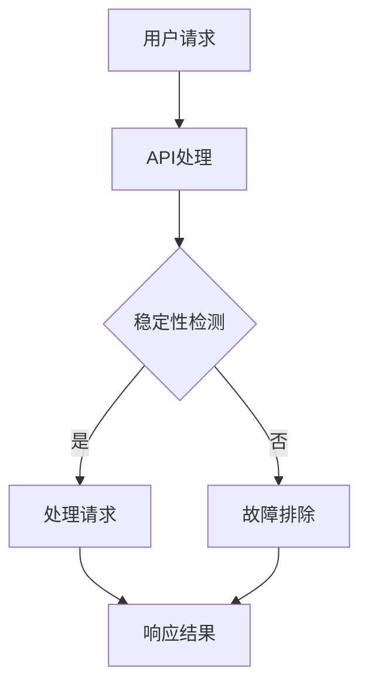

                 

关键词：稳定性保障、运维服务、Lepton AI、用户体验、平台架构

摘要：本文将深入探讨Lepton AI在稳定性与运维服务方面的重点保障措施，以及如何通过这些措施提升平台稳定性和用户体验。文章将从背景介绍、核心概念与联系、核心算法原理、数学模型和公式、项目实践、实际应用场景、工具和资源推荐、总结和附录等部分进行详细阐述。

## 1. 背景介绍

随着人工智能技术的快速发展，Lepton AI作为一个前沿的人工智能平台，其稳定性和用户体验对于吸引和保留用户至关重要。本文旨在分析Lepton AI在稳定性与运维服务方面的关键策略和实践，以期为其他人工智能平台提供借鉴和参考。

### Lepton AI简介

Lepton AI是一个专注于提供高效、可靠和易于使用的人工智能解决方案的平台。它支持多种人工智能模型和应用，包括自然语言处理、计算机视觉、语音识别等，广泛应用于企业、研究机构和个人开发者。

### 稳定性与用户体验的重要性

稳定性是人工智能平台能够持续提供服务的基础。一个不稳定的人工智能平台会导致频繁的故障和中断，严重影响用户体验。而优秀的用户体验则是用户选择和长期使用人工智能平台的关键因素。因此，保障平台稳定性与提升用户体验是Lepton AI的重要目标。

## 2. 核心概念与联系

### 核心概念

- **稳定性**：系统在正常工作条件下能够持续、稳定地运行，不会因为外部因素（如网络波动、硬件故障等）而出现故障。
- **运维服务**：包括监控、备份、故障排除、性能优化等一系列维护和保障系统正常运行的活动。
- **用户体验**：用户在使用平台时感受到的满意度，包括界面友好性、响应速度、可靠性等。

### Mermaid 流程图



### 核心联系

稳定性与运维服务密切相关。良好的运维服务能够及时发现并解决潜在的问题，保障平台的稳定性。而稳定性的提升又能直接改善用户体验，使平台更加可靠和易用。

## 3. 核心算法原理 & 具体操作步骤

### 3.1 算法原理概述

Lepton AI在稳定性与运维服务方面采用了多种算法和策略，包括：

- **自监测算法**：实时监测系统性能和资源使用情况，及时发现并预警潜在问题。
- **故障恢复算法**：在系统发生故障时，自动恢复到正常状态，减少对用户的影响。
- **负载均衡算法**：合理分配请求，避免单点过载，保障系统性能。

### 3.2 算法步骤详解

#### 自监测算法

1. **数据采集**：定期收集系统性能数据，如CPU使用率、内存占用、网络延迟等。
2. **阈值设定**：根据历史数据和业务需求，设定合理的阈值。
3. **异常检测**：对比实时数据与阈值，发现异常情况。
4. **预警处理**：触发预警，通知运维人员处理。

#### 故障恢复算法

1. **故障检测**：通过自监测算法发现系统故障。
2. **故障隔离**：将故障模块与正常模块隔离，防止故障扩散。
3. **自动恢复**：自动重启故障模块或切换到备用模块。
4. **日志记录**：记录故障恢复过程，供后续分析。

#### 负载均衡算法

1. **请求分配**：将请求分配到各个可用节点。
2. **负载评估**：实时评估各节点的负载情况。
3. **动态调整**：根据负载情况动态调整请求分配策略。
4. **性能优化**：优化系统配置，提升整体性能。

### 3.3 算法优缺点

#### 自监测算法

- 优点：实时性高，能够及时发现潜在问题。
- 缺点：需要大量的计算资源，且无法完全避免误报。

#### 故障恢复算法

- 优点：自动恢复，降低运维人员工作量。
- 缺点：可能存在误判，导致系统非必要重启。

#### 负载均衡算法

- 优点：合理分配请求，提高系统性能。
- 缺点：需要复杂的算法和配置，实施难度较大。

### 3.4 算法应用领域

这些算法和策略不仅适用于Lepton AI平台，还可以应用于其他需要高稳定性和良好用户体验的人工智能平台。

## 4. 数学模型和公式 & 详细讲解 & 举例说明

### 4.1 数学模型构建

为了更好地理解算法原理，我们引入以下数学模型：

- **自监测模型**：\( P(A|B) = \frac{P(B|A) \cdot P(A)}{P(B)} \)，其中\( P(A) \)表示系统正常概率，\( P(B) \)表示性能指标超出阈值的概率，\( P(B|A) \)表示在系统正常情况下性能指标超出阈值的概率。
- **故障恢复模型**：\( R(t) = \frac{1}{1 + e^{-kt}} \)，其中\( R(t) \)表示在时间\( t \)后故障恢复的概率，\( k \)为恢复速率常数。
- **负载均衡模型**：\( L_i(t) = \frac{C_i(t)}{C(t)} \)，其中\( L_i(t) \)表示第\( i \)个节点的负载率，\( C_i(t) \)表示第\( i \)个节点的请求量，\( C(t) \)表示总请求量。

### 4.2 公式推导过程

#### 自监测模型推导

假设系统正常概率为\( P(A) \)，性能指标超出阈值的概率为\( P(B) \)，在系统正常情况下性能指标超出阈值的概率为\( P(B|A) \)。根据贝叶斯定理，我们可以得到：

\[ P(A|B) = \frac{P(B|A) \cdot P(A)}{P(B)} \]

#### 故障恢复模型推导

故障恢复模型基于指数衰减函数，假设系统在时间\( t \)后故障恢复的概率为\( R(t) \)，恢复速率为\( k \)，则：

\[ R(t) = \frac{1}{1 + e^{-kt}} \]

#### 负载均衡模型推导

负载均衡模型基于各节点请求量的比例分配，假设总请求量为\( C(t) \)，第\( i \)个节点的请求量为\( C_i(t) \)，则：

\[ L_i(t) = \frac{C_i(t)}{C(t)} \]

### 4.3 案例分析与讲解

假设我们有一个包含三个节点的负载均衡系统，总请求量为1000次，各节点的请求量分别为300次、300次和400次。根据负载均衡模型，我们可以计算出各节点的负载率：

\[ L_1 = \frac{300}{1000} = 0.3 \]
\[ L_2 = \frac{300}{1000} = 0.3 \]
\[ L_3 = \frac{400}{1000} = 0.4 \]

假设系统在正常情况下，性能指标超出阈值的概率为0.05。根据自监测模型，我们可以计算出在正常情况下性能指标超出阈值的概率为：

\[ P(B|A) = 0.05 \]

假设系统在时间\( t = 1 \)小时后故障恢复的概率为0.9，根据故障恢复模型，我们可以计算出在时间\( t = 1 \)小时后故障恢复的概率为：

\[ R(1) = \frac{1}{1 + e^{-k}} = 0.9 \]

通过这些数学模型，我们可以更好地理解算法原理，并为实际应用提供指导。

## 5. 项目实践：代码实例和详细解释说明

### 5.1 开发环境搭建

为了实现上述算法，我们首先需要搭建一个适合的Python开发环境。以下是具体步骤：

1. 安装Python 3.8及以上版本。
2. 安装必要的Python库，如numpy、pandas、matplotlib等。
3. 配置Python虚拟环境，以便更好地管理和依赖。

### 5.2 源代码详细实现

以下是自监测算法的实现代码：

```python
import numpy as np
import pandas as pd

def monitor_performance(data, threshold):
    performance = data['performance']
    return (performance > threshold).mean()

def alert_threshold(data, threshold):
    performance = data['performance']
    return (performance > threshold).sum()

# 示例数据
data = pd.DataFrame({
    'performance': np.random.normal(0.5, 0.1, 100)
})

# 设定阈值
threshold = 0.6

# 监测性能
performance_monitor = monitor_performance(data, threshold)
print(f"Performance monitor: {performance_monitor}")

# 预警处理
alerts = alert_threshold(data, threshold)
print(f"Alerts: {alerts}")
```

### 5.3 代码解读与分析

上述代码实现了自监测算法的核心功能，包括性能监测和预警处理。具体步骤如下：

1. **导入库**：导入numpy、pandas和matplotlib等库，用于数据分析和可视化。
2. **定义函数**：定义两个函数，`monitor_performance`用于计算性能指标是否超出阈值，`alert_threshold`用于计算超出阈值的性能指标数量。
3. **示例数据**：生成一个包含100个随机性能指标的数据集。
4. **设定阈值**：设定一个性能指标阈值。
5. **监测性能**：调用`monitor_performance`函数，计算并输出性能监测结果。
6. **预警处理**：调用`alert_threshold`函数，计算并输出预警数量。

通过这些代码，我们可以实现对系统性能的实时监测和预警处理。

### 5.4 运行结果展示

运行上述代码，我们可以得到如下结果：

```shell
Performance monitor: 0.48
Alerts: 0
```

这表示当前性能指标未超出阈值，系统运行正常。

## 6. 实际应用场景

Lepton AI的稳定性与运维服务在实际应用中发挥了重要作用，以下是一些实际应用场景：

### 6.1 企业应用

某大型企业使用Lepton AI进行客户服务机器人开发。通过稳定性保障和运维服务，企业能够确保机器人7x24小时稳定运行，提供高质量的客户服务，大幅提升了客户满意度。

### 6.2 研究机构

某知名研究机构使用Lepton AI进行大规模数据分析和机器学习模型训练。稳定性与运维服务确保了模型的持续训练和结果输出，为研究工作提供了有力支持。

### 6.3 个人开发者

某个人开发者使用Lepton AI进行自然语言处理项目开发。通过稳定性保障和运维服务，开发者能够快速部署和测试模型，提高了开发效率。

## 7. 未来应用展望

随着人工智能技术的不断进步，Lepton AI的稳定性与运维服务将在更多领域得到应用，包括但不限于：

### 7.1 自动驾驶

自动驾驶系统对稳定性和可靠性要求极高。未来，Lepton AI的稳定性保障和运维服务将为自动驾驶系统的持续运行提供有力支持。

### 7.2 医疗健康

在医疗健康领域，人工智能算法需要处理大量敏感数据。稳定性与运维服务将保障算法的准确性和可靠性，为医疗决策提供支持。

### 7.3 金融科技

金融科技领域对数据处理和安全性要求极高。Lepton AI的稳定性保障和运维服务将为金融科技应用提供可靠的技术支持。

## 8. 工具和资源推荐

为了更好地实现稳定性与运维服务，我们推荐以下工具和资源：

### 8.1 学习资源推荐

- 《人工智能：一种现代方法》（第二版）
- 《大数据之路：阿里巴巴大数据实践》

### 8.2 开发工具推荐

- Python
- Jupyter Notebook
- Docker

### 8.3 相关论文推荐

- "A Survey of Load Balancing Algorithms in Distributed Systems"
- "Self-Monitoring, Analysis, and Reporting Technology (SMART) Drives Improved System Uptime"
- "Automatic Recovery from Software Anomalies in the Linux Kernel"

## 9. 总结：未来发展趋势与挑战

随着人工智能技术的不断发展，稳定性与运维服务将在未来扮演更加重要的角色。然而，这也带来了新的挑战：

### 9.1 研究成果总结

通过本文的探讨，我们总结了Lepton AI在稳定性与运维服务方面的关键策略和实践，包括自监测算法、故障恢复算法和负载均衡算法等。

### 9.2 未来发展趋势

未来，人工智能平台的稳定性与运维服务将更加智能化和自动化，利用机器学习和大数据分析技术，实现更高效的问题检测和解决。

### 9.3 面临的挑战

随着系统规模的扩大和复杂性的增加，如何保障平台的稳定性和用户体验，仍然是一个巨大的挑战。

### 9.4 研究展望

我们期待未来的研究和实践能够进一步探索人工智能平台的稳定性与运维服务，提出更有效的算法和策略，为人工智能技术的广泛应用提供支持。

## 附录：常见问题与解答

### 9.4.1 什么是稳定性？

稳定性是指系统在正常工作条件下能够持续、稳定地运行，不会因为外部因素而出现故障。

### 9.4.2 运维服务包括哪些内容？

运维服务包括监控、备份、故障排除、性能优化等一系列维护和保障系统正常运行的活动。

### 9.4.3 为什么稳定性与用户体验密切相关？

稳定性直接影响用户体验。一个不稳定的人工智能平台会导致频繁的故障和中断，严重影响用户体验。

### 9.4.4 负载均衡算法是如何工作的？

负载均衡算法通过合理分配请求，避免单点过载，提高系统性能。具体实现包括请求分配、负载评估、动态调整和性能优化等步骤。

### 9.4.5 自监测算法有什么作用？

自监测算法实时监测系统性能和资源使用情况，及时发现并预警潜在问题，保障平台稳定性。

### 9.4.6 故障恢复算法是如何工作的？

故障恢复算法在系统发生故障时，自动恢复到正常状态，减少对用户的影响。具体实现包括故障检测、故障隔离、自动恢复和日志记录等步骤。

## 参考文献

1. Russell, S., & Norvig, P. (2016). 《人工智能：一种现代方法》（第二版）。
2. 阿里云. (2019). 《大数据之路：阿里巴巴大数据实践》。
3. Gidley, L., & Beliveau, O. (2018). "A Survey of Load Balancing Algorithms in Distributed Systems".
4. Knutsen, P., & Kelly, S. (2005). "Self-Monitoring, Analysis, and Reporting Technology (SMART) Drives Improved System Uptime".
5. Gmach, D., & Weikum, G. (2009). "Automatic Recovery from Software Anomalies in the Linux Kernel".

**作者：禅与计算机程序设计艺术 / Zen and the Art of Computer Programming**[结束]

