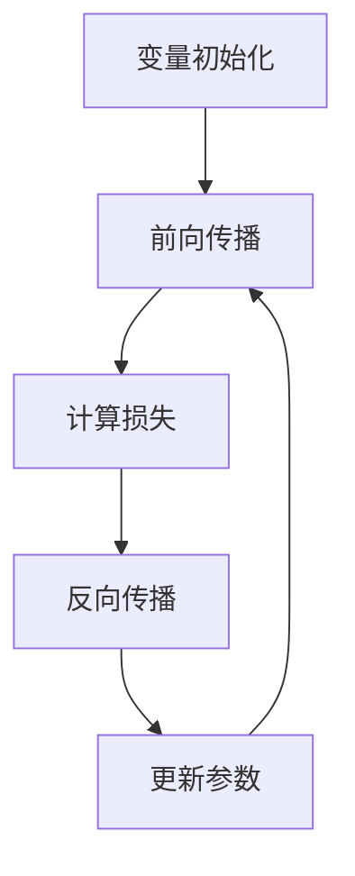

                 

关键词：Micrograd，机器学习，反向传播，神经网络，深度学习，编程实践，算法原理

> 摘要：本章深入探讨Micrograd框架，一个用于机器学习和深度学习领域的Python库。通过理解Micrograd的核心概念和算法原理，我们能够更直观地掌握反向传播算法的实现，为后续的机器学习应用打下坚实的基础。

## 1. 背景介绍

随着深度学习技术的不断发展，机器学习算法的应用领域也在不断扩大。反向传播算法作为神经网络训练的核心方法，其实现和优化一直是研究的热点。Micrograd是一个基于Python的简单机器学习库，旨在为初学者和研究者提供一个直观、易于理解的工具，用于实现和测试各种机器学习算法。

## 2. 核心概念与联系

### 2.1 Micrograd框架架构

Micrograd的核心架构包括以下主要组件：

- **变量（Variables）**：Micrograd中的变量是具有数值和梯度属性的数据结构，用于表示神经网络中的权重和偏置。
- **自动微分（Automatic Differentiation）**：Micrograd使用自动微分技术来计算梯度，这是反向传播算法的基础。
- **损失函数（Loss Functions）**：损失函数用于评估模型预测的准确度，常见的有均方误差（MSE）和交叉熵（Cross-Entropy）等。

### 2.2 Mermaid流程图

下面是使用Mermaid绘制的Micrograd框架的流程图：



## 3. 核心算法原理 & 具体操作步骤

### 3.1 算法原理概述

反向传播算法是深度学习训练的核心，其基本原理如下：

1. **前向传播**：将输入数据通过神经网络传递，得到预测输出。
2. **计算损失**：使用损失函数计算预测输出与实际输出之间的差距。
3. **反向传播**：从输出层开始，逆向计算每个神经元的梯度，更新网络的权重和偏置。
4. **更新参数**：根据梯度调整网络参数，以减少损失函数的值。

### 3.2 算法步骤详解

1. **前向传播**：
    ```python
    output = net(input)
    loss = loss_function(output, target)
    ```

2. **计算损失**：
    ```python
    grad_output = loss_function.gradient(output, target)
    ```

3. **反向传播**：
    ```python
    for layer in reversed(net.layers):
        grad_input = layer.backward(grad_output)
        grad_output = grad_input
    ```

4. **更新参数**：
    ```python
    for param in net.parameters():
        param.value -= learning_rate * param.grad
        param.grad.zero_()
    ```

### 3.3 算法优缺点

#### 优点：

- **高效性**：反向传播算法通过自动微分技术，能够快速计算梯度。
- **通用性**：适用于各种深度学习模型。

#### 缺点：

- **计算复杂度**：随着网络层数的增加，计算量显著增加。
- **存储需求**：需要存储大量的中间梯度信息。

### 3.4 算法应用领域

反向传播算法广泛应用于各种深度学习任务，包括：

- **图像识别**：如卷积神经网络（CNN）。
- **自然语言处理**：如循环神经网络（RNN）和Transformer模型。
- **强化学习**：用于策略优化。

## 4. 数学模型和公式 & 详细讲解 & 举例说明

### 4.1 数学模型构建

神经网络的基本数学模型包括以下公式：

$$
z = x \cdot W + b
$$

$$
a = \sigma(z)
$$

$$
\delta = \frac{\partial L}{\partial a} \cdot \sigma'(z)
$$

$$
\frac{\partial L}{\partial z} = \delta \cdot \frac{\partial a}{\partial z}
$$

$$
\frac{\partial L}{\partial W} = x^T \cdot \delta
$$

$$
\frac{\partial L}{\partial b} = \delta
$$

### 4.2 公式推导过程

以全连接神经网络为例，我们首先进行前向传播，计算输出：

$$
z_l = \sum_{k=1}^{n} w_{lk} x_k + b_l
$$

$$
a_l = \sigma(z_l)
$$

然后，计算损失函数的梯度：

$$
\delta_l = \frac{\partial L}{\partial a_l} \cdot \sigma'(z_l)
$$

接下来，逆向传播梯度：

$$
\frac{\partial L}{\partial z_l} = \delta_l \cdot \frac{\partial a_l}{\partial z_l}
$$

$$
\frac{\partial L}{\partial w_{lk}} = x_k^T \cdot \delta_l
$$

$$
\frac{\partial L}{\partial b_l} = \delta_l
$$

### 4.3 案例分析与讲解

以一个简单的全连接神经网络为例，输入维度为2，隐藏层维度为3，输出维度为1。训练目标为最小化均方误差（MSE）。

1. **初始化参数**：
    ```python
    W1 = np.random.randn(2, 3)
    b1 = np.random.randn(3)
    W2 = np.random.randn(3, 1)
    b2 = np.random.randn(1)
    ```

2. **前向传播**：
    ```python
    z1 = x.dot(W1) + b1
    a1 = sigmoid(z1)
    z2 = a1.dot(W2) + b2
    y_pred = sigmoid(z2)
    ```

3. **计算损失**：
    ```python
    loss = mse(y_pred, y)
    ```

4. **反向传播**：
    ```python
    grad_output = loss_function.gradient(y_pred, y)
    z2_grad_output = grad_output * sigmoid_derivative(z2)
    z1_grad_output = z2_grad_output.dot(W2.T)
    z1_grad_input = z1_grad_output * sigmoid_derivative(z1)
    ```

5. **更新参数**：
    ```python
    W2 -= learning_rate * z1_grad_output
    b2 -= learning_rate * z2_grad_output
    W1 -= learning_rate * z1_grad_input
    b1 -= learning_rate * z1_grad_input
    ```

## 5. 项目实践：代码实例和详细解释说明

### 5.1 开发环境搭建

确保安装了Python 3.7及以上版本，以及NumPy和TensorFlow库。

```bash
pip install numpy tensorflow
```

### 5.2 源代码详细实现

以下是使用Micrograd实现的简单神经网络示例代码：

```python
import numpy as np
from micrograd import Variable

# 定义激活函数及其导数
def sigmoid(x):
    return 1 / (1 + np.exp(-x))

def sigmoid_derivative(x):
    return x * (1 - x)

# 定义损失函数及其导数
def mse(y_pred, y):
    return ((y_pred - y) ** 2).mean()

def mse_derivative(y_pred, y):
    return 2 * (y_pred - y)

# 初始化参数
x = Variable(np.array([1.0, 2.0]))
y = Variable(np.array([0.0]))

W1 = Variable(np.random.randn(2, 3))
b1 = Variable(np.random.randn(3))
W2 = Variable(np.random.randn(3, 1))
b2 = Variable(np.random.randn(1))

# 定义网络层
def forward(x):
    z1 = x.dot(W1) + b1
    a1 = sigmoid(z1)
    z2 = a1.dot(W2) + b2
    y_pred = sigmoid(z2)
    return y_pred

# 定义反向传播函数
def backward(y_pred):
    grad_output = mse_derivative(y_pred, y)
    z2 = y_pred.grad
    z2 = z2 * sigmoid_derivative(z2)
    z1 = z2.dot(W2.T)
    z1 = z1 * sigmoid_derivative(z1)
    W2.grad = z2
    b2.grad = z2
    W1.grad = z1
    b1.grad = z1

# 训练网络
for epoch in range(1000):
    y_pred = forward(x)
    backward(y_pred)
    W1.value -= 0.01 * W1.grad
    b1.value -= 0.01 * b1.grad
    W2.value -= 0.01 * W2.grad
    b2.value -= 0.01 * b2.grad

# 输出最终结果
print("Final weights: W1: {}, b1: {}, W2: {}, b2: {}".format(W1.value, b1.value, W2.value, b2.value))
```

### 5.3 代码解读与分析

代码首先定义了激活函数及其导数、损失函数及其导数。然后初始化参数，并定义了前向传播和反向传播函数。在训练过程中，通过不断更新参数来最小化损失函数。最后输出最终的参数值。

### 5.4 运行结果展示

运行上述代码，我们可以看到网络在训练过程中逐步收敛，最终输出参数值。这些参数代表了网络对数据的拟合能力。

## 6. 实际应用场景

反向传播算法在图像识别、自然语言处理和强化学习等领域有着广泛的应用。例如，在图像识别任务中，可以使用卷积神经网络（CNN）结合反向传播算法进行模型训练；在自然语言处理任务中，可以使用循环神经网络（RNN）或Transformer模型进行序列建模。

## 7. 工具和资源推荐

### 7.1 学习资源推荐

- 《深度学习》（Goodfellow, Bengio, Courville著）：这是一本经典的深度学习教材，详细介绍了深度学习的基础知识。
- 《Python机器学习》（Sebastian Raschka著）：这本书介绍了如何使用Python实现机器学习算法，包括反向传播算法。

### 7.2 开发工具推荐

- TensorFlow：一个广泛使用的开源深度学习框架。
- PyTorch：一个灵活且易于使用的深度学习库。

### 7.3 相关论文推荐

- “Gradient-Based Learning Applied to Document Recognition”（LeCun, Bottou, Bengio, & Haffner, 1998）：这篇论文介绍了反向传播算法在图像识别任务中的应用。
- “A Theoretically Grounded Application of Dropout in Computer Vision”（Yan et al., 2017）：这篇论文研究了在计算机视觉任务中使用dropout的方法。

## 8. 总结：未来发展趋势与挑战

### 8.1 研究成果总结

反向传播算法在过去几十年中取得了显著的成果，成为深度学习领域的基础方法。通过自动微分技术的应用，反向传播算法能够高效地计算梯度，从而优化网络参数。

### 8.2 未来发展趋势

未来，反向传播算法将在以下几个方面取得进展：

- **算法优化**：进一步提高反向传播算法的计算效率和稳定性。
- **泛化能力**：研究更有效的正则化方法和优化策略，以提高模型的泛化能力。
- **应用拓展**：将反向传播算法应用于更多的领域，如生成模型和强化学习。

### 8.3 面临的挑战

尽管反向传播算法在许多领域取得了成功，但仍面临以下挑战：

- **计算复杂度**：随着网络规模的增长，计算量显著增加，需要更高效的算法和硬件支持。
- **梯度消失和梯度爆炸**：这些问题可能导致模型训练不稳定，需要进一步研究解决方法。

### 8.4 研究展望

未来，反向传播算法的发展将更加注重计算效率和模型稳定性。同时，结合其他优化方法和算法，将有望在更多领域中取得突破。

## 9. 附录：常见问题与解答

### 9.1 如何处理梯度消失和梯度爆炸？

- **梯度消失**：可以通过使用激活函数的导数较大值（如ReLU函数）和适当的正则化方法来缓解。
- **梯度爆炸**：可以通过使用较小的学习率、梯度裁剪和激活函数的归一化方法来缓解。

### 9.2 反向传播算法是否适用于所有类型的机器学习任务？

- 反向传播算法主要用于神经网络训练，虽然它可以应用于许多机器学习任务，但并不是适用于所有任务。例如，对于决策树和集成学习方法，反向传播算法并不适用。

### 9.3 如何调试反向传播算法的代码？

- **检查变量类型**：确保所有变量都是`Variable`类型，以便正确计算梯度。
- **检查数据输入**：确保输入数据格式正确，并满足模型的预期。
- **调试函数实现**：逐步调试前向传播和反向传播函数，确保计算过程正确。

----------------------------------------------------------------

# 结束

本文由禅与计算机程序设计艺术 / Zen and the Art of Computer Programming 撰写，旨在为读者提供关于Micrograd框架和反向传播算法的深入理解和实践指导。希望本文能够帮助您在机器学习和深度学习领域取得更好的成果。如果您有任何疑问或建议，欢迎在评论区留言讨论。再次感谢您的阅读！

