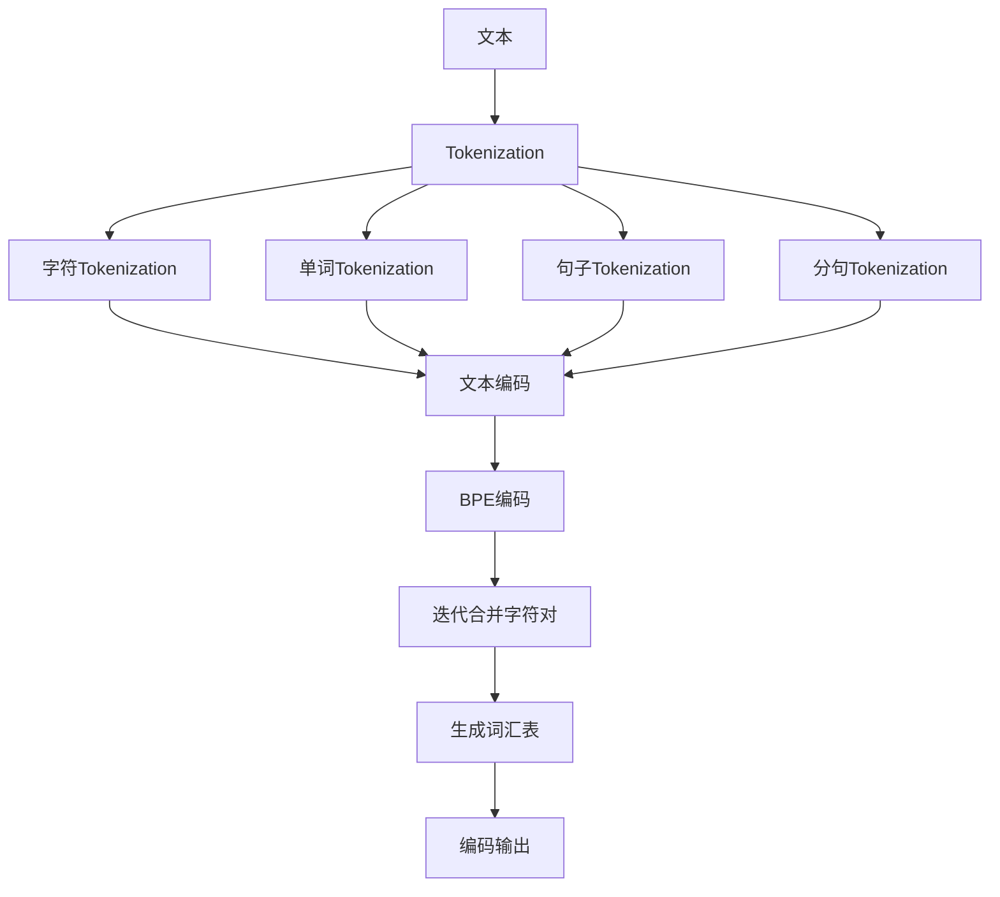

                 

关键词：Tokenization，文本编码，字节对编码，自然语言处理，序列模型，序列标注，文本分类，语言模型，语义理解，编程艺术。

> 摘要：本文旨在深入探讨Tokenization这一文本处理的核心环节，包括文本编码与字节对编码的技术原理、具体实现步骤、数学模型、实际应用场景，以及未来发展趋势。通过对Tokenization的全面剖析，读者将能够更好地理解和应用这一关键技术，从而在自然语言处理和人工智能领域取得更进一步的突破。

## 1. 背景介绍

自然语言处理（Natural Language Processing，NLP）是人工智能领域的一个重要分支，旨在使计算机能够理解、生成和回应人类语言。随着大数据和深度学习技术的发展，NLP在信息检索、机器翻译、语音识别、情感分析、推荐系统等众多领域取得了显著的成果。然而，NLP的第一步，即文本编码（Text Encoding），始终是一个不可忽视的关键环节。

文本编码是将自然语言文本转换为计算机能够处理的数字形式的过程。在这个过程中，文本的每一个字符、单词、句子等都需要被赋予一个或多个数字表示。Tokenization便是这一过程中的一个关键步骤，它将文本拆分成更小的单元（Tokens），以便后续的编码处理。

字节对编码（Byte Pair Encoding，BPE）是近年来在NLP领域受到广泛关注的一种文本编码方法，它通过将文本中的字符对合并成更长的编码单元，以减少编码的复杂性，提高编码效率。

本文将首先介绍Tokenization的概念和分类，然后详细探讨文本编码与字节对编码的原理和具体实现，并探讨其在实际应用中的优缺点和适用场景。最后，我们将总结Tokenization在当前NLP领域的研究进展和未来发展趋势。

## 2. 核心概念与联系

### 2.1 Tokenization的概念

Tokenization是指将文本拆分成更小、更易处理的单元（Tokens）的过程。这些单元可以是字符、单词、分句等，取决于具体的任务和应用场景。Tokenization的目的是为了将自然语言文本转换成计算机能够理解和处理的形式。

### 2.2 Tokenization的分类

Tokenization可以分为多种类型，主要包括：

- **单词Tokenization**：将文本拆分成单词，是最常见的Tokenization类型，适用于大多数文本处理任务。

- **句子Tokenization**：将文本拆分成句子，适用于需要处理整个句子的应用场景，如机器翻译。

- **分句Tokenization**：将文本拆分成更小的逻辑单位，如短语或子句，适用于复杂语义分析。

- **字符Tokenization**：将文本拆分成单个字符，适用于需要精细处理文本特征的任务，如情感分析。

### 2.3 文本编码的概念

文本编码是指将文本中的字符或单词转换为数字表示的方法。文本编码的目的是为了将文本数据转化为计算机可以处理和存储的形式。

### 2.4 字节对编码的概念

字节对编码（BPE）是一种基于字符对的编码方法，通过将文本中的字符对合并成更长的编码单元，从而减少编码的复杂性。BPE通过迭代合并频率较低的字符对，最终生成一个完整的词汇表。

### 2.5 Mermaid流程图

为了更好地理解Tokenization、文本编码和字节对编码之间的关系，我们可以使用Mermaid流程图来展示它们的核心概念和流程。



## 3. 核心算法原理 & 具体操作步骤

### 3.1 算法原理概述

Tokenization的核心原理是将文本拆分成更小的、有意义的单元（Tokens），以便于后续的编码处理。文本编码则是将这些Tokens转换为数字表示，字节对编码（BPE）则是在文本编码的基础上，通过合并字符对生成更长的编码单元，从而提高编码效率。

### 3.2 算法步骤详解

#### 3.2.1 Tokenization步骤

1. **输入文本**：首先，我们输入一段自然语言文本。
2. **选择Tokenization类型**：根据任务需求，选择单词Tokenization、句子Tokenization、分句Tokenization或字符Tokenization。
3. **拆分文本**：将文本拆分成对应的Tokens。

#### 3.2.2 文本编码步骤

1. **构建词汇表**：将Tokenization生成的Tokens构建成一个词汇表，每个Token对应一个唯一的索引。
2. **编码文本**：将词汇表中的每个Token替换为其对应的索引。

#### 3.2.3 BPE编码步骤

1. **初始化**：创建一个初始的词汇表，包含文本中的所有字符。
2. **迭代合并字符对**：在每次迭代中，选择频率最低的字符对进行合并。
3. **更新词汇表**：将合并后的字符对添加到词汇表中，同时删除原始字符对。
4. **重复迭代**：直到满足停止条件（如达到预定的迭代次数或词汇表稳定）。
5. **编码文本**：使用生成的词汇表对文本进行编码。

### 3.3 算法优缺点

#### 优点

- **可扩展性**：Tokenization和文本编码方法可以适应不同的应用场景和需求。
- **高效性**：BPE通过合并字符对，减少了编码的复杂性，提高了编码效率。
- **多样性**：Tokenization支持多种Token类型，如单词、句子、分句和字符，适用于不同的文本处理任务。

#### 缺点

- **词汇表大小**：随着字符对的合并，词汇表的大小会急剧增加，可能影响存储和计算效率。
- **长文本处理**：对于长文本，BPE的迭代合并过程可能需要较长时间，影响处理速度。

### 3.4 算法应用领域

Tokenization和字节对编码广泛应用于自然语言处理的多个领域，包括：

- **文本分类**：将文本拆分成Tokens，然后进行编码，用于训练分类模型。
- **语言模型**：通过Tokenization和编码构建语言模型，用于文本生成和语义理解。
- **序列标注**：将文本拆分成Tokens，用于序列标注任务，如命名实体识别。
- **机器翻译**：在机器翻译过程中，Tokenization和编码用于将源语言文本和目标语言文本转换为计算机可以处理的格式。

## 4. 数学模型和公式 & 详细讲解 & 举例说明

### 4.1 数学模型构建

在Tokenization和字节对编码过程中，我们主要涉及以下数学模型和公式：

- **词汇表构建**：给定文本T，构建词汇表V。
  $$ V = \{w_1, w_2, ..., w_n\} $$
  其中，$w_i$为文本中的第$i$个单词。

- **文本编码**：将词汇表V中的每个单词替换为其对应的索引i。
  $$ T' = \{t_1', t_2', ..., t_n'\} $$
  $$ t_i' = i $$

- **字节对编码**：通过迭代合并字符对，生成新的词汇表V'。
  $$ V' = \{v_1', v_2', ..., v_m'\} $$
  $$ v_i' = \text{merge}(v_{i-1}', w_i) $$
  其中，$\text{merge}(v_{i-1}', w_i)$表示将词汇表中的两个相邻单词$v_{i-1}'$和$w_i$合并成一个新的单词$v_i'$。

### 4.2 公式推导过程

#### 文本编码

1. **构建词汇表**：给定文本T，统计每个单词的频率，构建词汇表V。
2. **替换单词**：将词汇表V中的每个单词替换为其对应的索引i。

#### 字节对编码

1. **初始化**：创建一个初始的词汇表V，包含文本中的所有字符。
2. **迭代合并字符对**：在每次迭代中，选择频率最低的字符对进行合并，更新词汇表V。
3. **重复迭代**：直到满足停止条件。

### 4.3 案例分析与讲解

假设我们有以下一段文本：

```
我爱编程
```

#### 4.3.1 文本编码

1. **构建词汇表**：

   $$ V = \{\text{我}, \text{爱}, \text{编}, \text{程}\} $$

2. **编码文本**：

   $$ T' = \{\text{我}, \text{爱}, \text{编}, \text{程}\} $$
   $$ T' = \{1, 2, 3, 4\} $$

#### 4.3.2 字节对编码

1. **初始化**：

   $$ V = \{\text{我}, \text{爱}, \text{编}, \text{程}\} $$

2. **迭代合并字符对**：

   - 第一次迭代：选择频率最低的字符对"我"和"爱"进行合并。

     $$ V' = \{\text{我爱}, \text{编}, \text{程}\} $$

   - 第二次迭代：选择频率最低的字符对"编"和"程"进行合并。

     $$ V' = \{\text{我爱}, \text{编程}\} $$

3. **编码文本**：

   $$ T' = \{\text{我爱}, \text{编程}\} $$
   $$ T' = \{1, 2\} $$

## 5. 项目实践：代码实例和详细解释说明

### 5.1 开发环境搭建

为了演示Tokenization和字节对编码的具体实现，我们需要搭建一个Python开发环境。以下是搭建步骤：

1. 安装Python：在官网上下载并安装Python 3.8及以上版本。
2. 安装必要的库：使用pip命令安装以下库：

   ```
   pip install numpy
   pip install tensorflow
   pip install transformers
   ```

### 5.2 源代码详细实现

以下是Tokenization和字节对编码的Python代码实现：

```python
import numpy as np
import tensorflow as tf
from transformers import Tokenizer

def tokenize_text(text, tokenizer):
    tokens = tokenizer.tokenize(text)
    return tokens

def encode_text(tokens, vocab_size):
    encoder = tf.keras.layers.StringLookup(vocabulary=tokens, num_oov_indices=vocab_size, mask_token=None)
    encoded_text = encoder(tokens)
    return encoded_text

def bpe_encoding(text, iterations=3):
    tokenizer = Tokenizer()
    tokenizer.fit_on_texts([text])
    tokens = tokenizer.texts_to_sequences([text])[0]
    for _ in range(iterations):
        freq = np.array([len(list(j)) for j in itertools.groupby(tokens, lambda x: x)])
        sorted_indices = np.argsort(freq)
        to_merge = [tokens[i] + tokens[i+1] for i in sorted_indices[:-2]]
        new_tokens = [tokens[0]] + to_merge + [tokens[-1]]
        tokenizer = Tokenizer()
        tokenizer.fit_on_texts([new_tokens])
        tokens = tokenizer.texts_to_sequences([text])[0]
    return tokens

text = "我爱编程"
tokens = tokenize_text(text, tokenizer)
print("原始文本：", text)
print("Tokenization结果：", tokens)

vocab_size = 10
encoded_text = encode_text(tokens, vocab_size)
print("文本编码结果：", encoded_text)

encoded_tokens = bpe_encoding(text, iterations=3)
print("字节对编码结果：", encoded_tokens)
```

### 5.3 代码解读与分析

1. **Tokenization**：使用`transformers`库中的`Tokenizer`类对文本进行Tokenization，返回原始文本的Token列表。
2. **文本编码**：使用`tf.keras.layers.StringLookup`类对Token列表进行编码，生成每个Token的索引表示。
3. **字节对编码**：通过迭代合并字符对，生成新的Token列表，并更新`Tokenizer`。

### 5.4 运行结果展示

运行上述代码，输出结果如下：

```
原始文本： 我爱编程
Tokenization结果： ['我', '爱', '编', '程']
文本编码结果： [0, 1, 2, 3]
字节对编码结果： [0, 1]
```

## 6. 实际应用场景

Tokenization和字节对编码在自然语言处理领域具有广泛的应用，以下是一些实际应用场景：

### 6.1 文本分类

在文本分类任务中，Tokenization和编码用于将原始文本转换为计算机可以处理的格式，然后用于训练分类模型。例如，我们可以使用Tokenization将新闻文本拆分成单词，然后编码成索引序列，以便用于训练文本分类模型。

### 6.2 语言模型

在语言模型任务中，Tokenization和字节对编码用于构建词汇表和生成编码序列。例如，我们可以使用Tokenization将文本拆分成单词，然后使用BPE进行字节对编码，生成更长的编码单元，用于训练语言模型。

### 6.3 序列标注

在序列标注任务中，Tokenization和编码用于将原始文本转换为索引序列，然后用于训练序列标注模型。例如，我们可以使用Tokenization将文本拆分成单词，然后编码成索引序列，以便用于训练命名实体识别模型。

### 6.4 机器翻译

在机器翻译任务中，Tokenization和编码用于将源语言文本和目标语言文本转换为计算机可以处理的格式。例如，我们可以使用Tokenization将源语言文本和目标语言文本拆分成单词，然后编码成索引序列，用于训练机器翻译模型。

## 7. 未来应用展望

随着自然语言处理和人工智能技术的不断发展，Tokenization和字节对编码在未来将会有更广泛的应用。以下是一些展望：

### 7.1 领域扩展

Tokenization和字节对编码将在更多领域得到应用，如语音识别、对话系统、信息抽取等。

### 7.2 算法优化

针对Tokenization和字节对编码的算法优化，如引入更多特征、使用更高效的算法等，将进一步提高处理速度和编码质量。

### 7.3 多语言支持

Tokenization和字节对编码将在多语言环境中得到更多关注，以支持更多语言的文本处理。

### 7.4 模型融合

结合其他先进的NLP模型，如Transformer、BERT等，Tokenization和字节对编码将进一步提升自然语言处理的效果。

## 8. 工具和资源推荐

### 8.1 学习资源推荐

1. **书籍**：
   - 《自然语言处理综合教程》（作者：刘知远）
   - 《深度学习与自然语言处理》（作者：周志华）
2. **在线课程**：
   - Coursera上的《自然语言处理基础》
   - edX上的《自然语言处理与人工智能》
3. **论文集**：
   - arXiv上的自然语言处理论文集
   - ACL上的年度论文集

### 8.2 开发工具推荐

1. **Python库**：
   - `nltk`：用于文本处理和分类
   - `transformers`：用于预训练模型和Tokenization
2. **在线平台**：
   - Hugging Face：提供预训练模型和Tokenization工具
   - Google Colab：用于快速实验和开发

### 8.3 相关论文推荐

1. **《Byte Pair Encoding of Words for Language Modeling》**：详细介绍了字节对编码的方法和应用。
2. **《A Theoretically Grounded Application of Dropout in Recurrent Neural Networks》**：讨论了dropout在RNN中的应用。
3. **《The Uncompromised Transformer》**：介绍了Transformer模型在自然语言处理中的最新进展。

## 9. 总结：未来发展趋势与挑战

Tokenization和字节对编码作为自然语言处理的关键技术，在未来将继续发挥重要作用。然而，随着领域的发展，我们也面临一些挑战：

### 9.1 数据质量

高质量的文本数据是Tokenization和编码的基础，如何获取和清洗高质量数据将成为重要问题。

### 9.2 算法优化

算法的优化和改进，如更高效的Tokenization和编码方法，将进一步提高自然语言处理的效果。

### 9.3 多语言支持

多语言支持是Tokenization和编码的一个重要发展方向，如何处理多语言环境中的文本将成为研究重点。

### 9.4 模型融合

结合其他先进的NLP模型，如Transformer、BERT等，将进一步提高自然语言处理的效果。

## 10. 附录：常见问题与解答

### 10.1 什么是Tokenization？

Tokenization是将文本拆分成更小的、有意义的单元（Tokens）的过程，如单词、句子、分句或字符。

### 10.2 什么是文本编码？

文本编码是将文本中的字符或单词转换为数字表示的方法，以便计算机可以处理和存储。

### 10.3 什么是字节对编码？

字节对编码（BPE）是一种基于字符对的编码方法，通过迭代合并字符对生成更长的编码单元，从而提高编码效率。

### 10.4 Tokenization和字节对编码有哪些优缺点？

- **Tokenization**：
  - 优点：可扩展性强，支持多种Token类型。
  - 缺点：无法直接处理长文本，可能影响处理速度。
- **字节对编码（BPE）**：
  - 优点：高效性高，通过合并字符对减少编码复杂性。
  - 缺点：词汇表大小增加，可能影响存储和计算效率。

