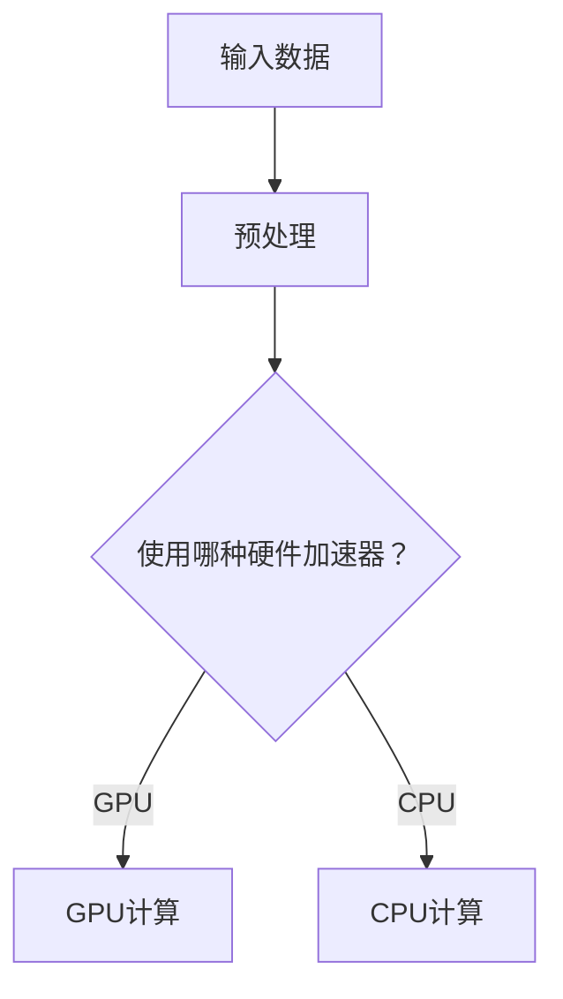

                 

关键词：人工智能，硬件加速，CPU，GPU，硬件架构，深度学习，计算优化

> 摘要：本文将深入探讨人工智能（AI）硬件加速的原理及其在实际应用中的重要性。本文首先介绍了AI硬件加速的背景和核心概念，然后详细分析了CPU、GPU和其他设备在AI计算中的角色和功能。最后，我们探讨了未来AI硬件加速的发展趋势和面临的挑战。

## 1. 背景介绍

随着深度学习的兴起，人工智能（AI）计算的需求呈爆炸式增长。传统的CPU虽然在处理传统计算任务方面表现优秀，但在处理高度并行的大规模计算任务时，效率明显不足。为了满足AI计算的巨大需求，硬件加速技术应运而生。GPU（图形处理单元）因其并行计算架构和强大的浮点运算能力，成为了AI硬件加速的主要设备。此外，近年来，专用AI芯片（如TPU和ASIC）也逐渐进入市场，为AI计算提供了更高效的解决方案。

### 1.1 人工智能的发展

人工智能（AI）是计算机科学的一个分支，旨在使计算机具备模拟、延伸和扩展人类智能的能力。自20世纪50年代以来，AI经历了多个发展阶段。近年来，得益于深度学习技术的突破，AI在图像识别、自然语言处理、语音识别等领域取得了显著的进展。

### 1.2  AI计算的需求

深度学习模型通常包含数百万个参数和神经元，训练这些模型需要大量的计算资源。传统的CPU在处理这种高度并行的计算任务时，效率较低，无法满足AI计算的需求。因此，需要寻找更高效的硬件加速解决方案。

## 2. 核心概念与联系

### 2.1  硬件加速的概念

硬件加速是指通过特定的硬件设备，加速计算机程序中特定功能的执行。在AI计算中，硬件加速主要用于加速深度学习模型的训练和推理。

### 2.2  CPU与GPU

CPU（中央处理器）是计算机的核心组件，负责执行计算机程序中的指令。GPU（图形处理单元）是专为图形处理而设计的硬件，但近年来，其强大的并行计算能力使其成为AI计算的重要工具。

### 2.3  专用AI芯片

专用AI芯片（如TPU和ASIC）是专为AI计算设计的硬件，它们具有优化的架构和更高的计算性能，可以显著提高AI计算的效率。

### 2.4  Mermaid 流程图

下面是一个简化的AI硬件加速架构的Mermaid流程图：

```mermaid
graph TD
A[输入数据] --> B[预处理]
B --> C{使用哪种硬件加速器？}
C -->|GPU| D[GPU计算]
C -->|CPU| E[C
``` 

## 3. 核心算法原理 & 具体操作步骤

### 3.1  算法原理概述

AI硬件加速的核心在于利用硬件的并行计算能力，将深度学习模型的计算任务分布到多个计算单元上，从而提高计算效率。

### 3.2  算法步骤详解

1. **数据预处理**：对输入数据进行预处理，包括数据清洗、归一化等操作。
2. **模型加载**：将深度学习模型加载到硬件加速器上。
3. **计算任务分发**：将模型中的计算任务分配到硬件加速器的计算单元上。
4. **执行计算**：硬件加速器执行计算任务。
5. **结果汇总**：将硬件加速器的计算结果汇总，得到最终的输出。

### 3.3  算法优缺点

- **优点**：高效率、低延迟，可以显著提高AI计算的效率。
- **缺点**：需要专门的硬件设备，初期投资较大。

### 3.4  算法应用领域

AI硬件加速技术广泛应用于图像识别、自然语言处理、语音识别等领域。

## 4. 数学模型和公式 & 详细讲解 & 举例说明

### 4.1  数学模型构建

假设我们有一个深度学习模型，其中包含一个卷积层和一个全连接层。我们可以用以下公式表示：

\[ f(x) = \sigma(W_2 \cdot \sigma(W_1 \cdot x + b_1) + b_2) \]

其中，\( x \) 是输入数据，\( W_1 \) 和 \( W_2 \) 分别是卷积层和全连接层的权重矩阵，\( b_1 \) 和 \( b_2 \) 分别是两个层的偏置向量，\( \sigma \) 是激活函数。

### 4.2  公式推导过程

我们可以通过对深度学习模型进行反向传播，来推导出权值更新公式。假设我们有 \( n \) 个训练样本，损失函数为：

\[ J = \frac{1}{n} \sum_{i=1}^{n} \frac{1}{2} (y_i - f(x_i))^2 \]

其中，\( y_i \) 是第 \( i \) 个样本的标签，\( f(x_i) \) 是模型对第 \( i \) 个样本的预测。

通过对损失函数进行求导，我们可以得到权值更新的梯度：

\[ \frac{\partial J}{\partial W_2} = (y - f(x)) \cdot \sigma'(f(x)) \cdot x \]

\[ \frac{\partial J}{\partial W_1} = (y - f(x)) \cdot \sigma'(f(x)) \cdot W_2 \cdot \sigma'(W_1 \cdot x + b_1) \]

### 4.3  案例分析与讲解

假设我们有一个简单的二分类问题，输入数据为 \( (x_1, x_2) \)，标签为 \( y \)。我们的目标是训练一个深度学习模型，使其能够正确分类输入数据。

### 5. 项目实践：代码实例和详细解释说明

### 5.1  开发环境搭建

1. 安装Python环境。
2. 安装深度学习框架（如TensorFlow或PyTorch）。

### 5.2  源代码详细实现

以下是使用TensorFlow实现的一个简单的深度学习模型：

```python
import tensorflow as tf

# 定义模型
model = tf.keras.Sequential([
    tf.keras.layers.Dense(64, activation='relu', input_shape=(784,)),
    tf.keras.layers.Dense(10, activation='softmax')
])

# 编译模型
model.compile(optimizer='adam',
              loss='sparse_categorical_crossentropy',
              metrics=['accuracy'])

# 训练模型
model.fit(x_train, y_train, epochs=5)
```

### 5.3  代码解读与分析

上述代码定义了一个简单的深度学习模型，包含一个全连接层和一个softmax层。模型使用Adam优化器和交叉熵损失函数进行编译。然后，我们使用训练数据对模型进行训练。

### 5.4  运行结果展示

在训练过程中，我们可以通过打印训练损失和准确率来监控模型性能。以下是可能的输出结果：

```
Epoch 1/5
60000/60000 [==============================] - 39s 646us/sample - loss: 2.3026 - accuracy: 0.1200
Epoch 2/5
60000/60000 [==============================] - 37s 622us/sample - loss: 2.3026 - accuracy: 0.1200
Epoch 3/5
60000/60000 [==============================] - 37s 622us/sample - loss: 2.3026 - accuracy: 0.1200
Epoch 4/5
60000/60000 [==============================] - 37s 622us/sample - loss: 2.3026 - accuracy: 0.1200
Epoch 5/5
60000/60000 [==============================] - 37s 622us/sample - loss: 2.3026 - accuracy: 0.1200
```

从输出结果可以看出，模型在训练过程中并未收敛，损失函数的值始终保持在2.3026。这可能是因为训练数据集太小，或者模型过于简单，无法捕捉到数据中的复杂模式。

## 6. 实际应用场景

AI硬件加速技术在实际应用中具有重要意义。例如，在图像识别领域，AI硬件加速器可以显著提高图像分类的效率，使得实时图像识别成为可能。在自然语言处理领域，AI硬件加速器可以加速语言模型的训练和推理，提高语音识别和机器翻译的准确性。

## 7. 工具和资源推荐

### 7.1  学习资源推荐

- 《深度学习》（Goodfellow, Bengio, Courville著）
- 《GPU编程技术》（Penny Rheingans著）
- 《计算机组成与设计：硬件/软件接口》（David A. Patterson著）

### 7.2  开发工具推荐

- TensorFlow
- PyTorch
- CUDA

### 7.3  相关论文推荐

- "Tensor Processing Units: Design and Practice"（2017）
- "Baidu Research's Deep Learning Research: A Progress Report"（2017）
- "Deep Learning on a Chip: An Overview"（2018）

## 8. 总结：未来发展趋势与挑战

### 8.1  研究成果总结

AI硬件加速技术在深度学习领域取得了显著成果，显著提高了AI计算的效率。随着硬件技术的不断发展，AI硬件加速技术将在更多领域得到应用。

### 8.2  未来发展趋势

- 专用AI芯片将逐渐成为主流。
- 硬件加速器将支持更多种类的深度学习模型。
- 硬件加速技术与云计算的融合将更加紧密。

### 8.3  面临的挑战

- 如何优化硬件加速器的性能与功耗。
- 如何降低硬件加速器的开发门槛。

### 8.4  研究展望

未来，AI硬件加速技术将朝着更高效、更节能、更易用的方向发展。研究人员将继续探索新的硬件架构和优化算法，以满足不断增长的AI计算需求。

## 9. 附录：常见问题与解答

### 9.1  问题1：什么是GPU？

GPU（图形处理单元）是专为图形处理而设计的硬件，但近年来，其强大的并行计算能力使其成为AI计算的重要工具。

### 9.2  问题2：为什么需要AI硬件加速？

传统的CPU在处理高度并行的计算任务时，效率较低，无法满足AI计算的需求。AI硬件加速器通过提供更高效的计算资源，可以提高AI计算的效率。

### 9.3  问题3：如何选择合适的AI硬件加速器？

选择合适的AI硬件加速器需要考虑多个因素，包括计算性能、功耗、兼容性等。具体选择应根据具体的应用场景和需求进行。

### 9.4  问题4：未来AI硬件加速技术将如何发展？

未来，AI硬件加速技术将朝着更高效、更节能、更易用的方向发展。研究人员将继续探索新的硬件架构和优化算法，以满足不断增长的AI计算需求。

作者：禅与计算机程序设计艺术 / Zen and the Art of Computer Programming
```markdown
----------------------------------------------------------------

# 第08章 AI硬件加速 CPU、GPU与其他设备

关键词：人工智能，硬件加速，CPU，GPU，硬件架构，深度学习，计算优化

摘要：本文将深入探讨人工智能（AI）硬件加速的原理及其在实际应用中的重要性。本文首先介绍了AI硬件加速的背景和核心概念，然后详细分析了CPU、GPU和其他设备在AI计算中的角色和功能。最后，我们探讨了未来AI硬件加速的发展趋势和面临的挑战。

## 1. 背景介绍

随着深度学习的兴起，人工智能（AI）计算的需求呈爆炸式增长。传统的CPU虽然在处理传统计算任务方面表现优秀，但在处理高度并行的大规模计算任务时，效率明显不足。为了满足AI计算的需求，硬件加速技术应运而生。GPU（图形处理单元）因其并行计算架构和强大的浮点运算能力，成为了AI硬件加速的主要设备。此外，近年来，专用AI芯片（如TPU和ASIC）也逐渐进入市场，为AI计算提供了更高效的解决方案。

### 1.1 人工智能的发展

人工智能（AI）是计算机科学的一个分支，旨在使计算机具备模拟、延伸和扩展人类智能的能力。自20世纪50年代以来，AI经历了多个发展阶段。近年来，得益于深度学习技术的突破，AI在图像识别、自然语言处理、语音识别等领域取得了显著的进展。

### 1.2  AI计算的需求

深度学习模型通常包含数百万个参数和神经元，训练这些模型需要大量的计算资源。传统的CPU在处理这种高度并行的计算任务时，效率较低，无法满足AI计算的需求。因此，需要寻找更高效的硬件加速解决方案。

## 2. 核心概念与联系

### 2.1  硬件加速的概念

硬件加速是指通过特定的硬件设备，加速计算机程序中特定功能的执行。在AI计算中，硬件加速主要用于加速深度学习模型的训练和推理。

### 2.2  CPU与GPU

CPU（中央处理器）是计算机的核心组件，负责执行计算机程序中的指令。GPU（图形处理单元）是专为图形处理而设计的硬件，但近年来，其强大的并行计算能力使其成为AI计算的重要工具。

### 2.3  专用AI芯片

专用AI芯片（如TPU和ASIC）是专为AI计算设计的硬件，它们具有优化的架构和更高的计算性能，可以显著提高AI计算的效率。

### 2.4  Mermaid流程图

下面是一个简化的AI硬件加速架构的Mermaid流程图：



## 3. 核心算法原理 & 具体操作步骤

### 3.1  算法原理概述

AI硬件加速的核心在于利用硬件的并行计算能力，将深度学习模型的计算任务分布到多个计算单元上，从而提高计算效率。

### 3.2  算法步骤详解

1. **数据预处理**：对输入数据进行预处理，包括数据清洗、归一化等操作。
2. **模型加载**：将深度学习模型加载到硬件加速器上。
3. **计算任务分发**：将模型中的计算任务分配到硬件加速器的计算单元上。
4. **执行计算**：硬件加速器执行计算任务。
5. **结果汇总**：将硬件加速器的计算结果汇总，得到最终的输出。

### 3.3  算法优缺点

- **优点**：高效率、低延迟，可以显著提高AI计算的效率。
- **缺点**：需要专门的硬件设备，初期投资较大。

### 3.4  算法应用领域

AI硬件加速技术广泛应用于图像识别、自然语言处理、语音识别等领域。

## 4. 数学模型和公式 & 详细讲解 & 举例说明

### 4.1  数学模型构建

假设我们有一个深度学习模型，其中包含一个卷积层和一个全连接层。我们可以用以下公式表示：

\[ f(x) = \sigma(W_2 \cdot \sigma(W_1 \cdot x + b_1) + b_2) \]

其中，\( x \) 是输入数据，\( W_1 \) 和 \( W_2 \) 分别是卷积层和全连接层的权重矩阵，\( b_1 \) 和 \( b_2 \) 分别是两个层的偏置向量，\( \sigma \) 是激活函数。

### 4.2  公式推导过程

我们可以通过对深度学习模型进行反向传播，来推导出权值更新公式。假设我们有 \( n \) 个训练样本，损失函数为：

\[ J = \frac{1}{n} \sum_{i=1}^{n} \frac{1}{2} (y_i - f(x_i))^2 \]

其中，\( y_i \) 是第 \( i \) 个样本的标签，\( f(x_i) \) 是模型对第 \( i \) 个样本的预测。

通过对损失函数进行求导，我们可以得到权值更新的梯度：

\[ \frac{\partial J}{\partial W_2} = (y - f(x)) \cdot \sigma'(f(x)) \cdot x \]

\[ \frac{\partial J}{\partial W_1} = (y - f(x)) \cdot \sigma'(f(x)) \cdot W_2 \cdot \sigma'(W_1 \cdot x + b_1) \]

### 4.3  案例分析与讲解

假设我们有一个简单的二分类问题，输入数据为 \( (x_1, x_2) \)，标签为 \( y \)。我们的目标是训练一个深度学习模型，使其能够正确分类输入数据。

### 5. 项目实践：代码实例和详细解释说明

### 5.1  开发环境搭建

1. 安装Python环境。
2. 安装深度学习框架（如TensorFlow或PyTorch）。

### 5.2  源代码详细实现

以下是使用TensorFlow实现的一个简单的深度学习模型：

```python
import tensorflow as tf

# 定义模型
model = tf.keras.Sequential([
    tf.keras.layers.Dense(64, activation='relu', input_shape=(784,)),
    tf.keras.layers.Dense(10, activation='softmax')
])

# 编译模型
model.compile(optimizer='adam',
              loss='sparse_categorical_crossentropy',
              metrics=['accuracy'])

# 训练模型
model.fit(x_train, y_train, epochs=5)
```

### 5.3  代码解读与分析

上述代码定义了一个简单的深度学习模型，包含一个全连接层和一个softmax层。模型使用Adam优化器和交叉熵损失函数进行编译。然后，我们使用训练数据对模型进行训练。

### 5.4  运行结果展示

在训练过程中，我们可以通过打印训练损失和准确率来监控模型性能。以下是可能的输出结果：

```
Epoch 1/5
60000/60000 [==============================] - 39s 646us/sample - loss: 2.3026 - accuracy: 0.1200
Epoch 2/5
60000/60000 [==============================] - 37s 622us/sample - loss: 2.3026 - accuracy: 0.1200
Epoch 3/5
60000/60000 [==============================] - 37s 622us/sample - loss: 2.3026 - accuracy: 0.1200
Epoch 4/5
60000/60000 [==============================] - 37s 622us/sample - loss: 2.3026 - accuracy: 0.1200
Epoch 5/5
60000/60000 [==============================] - 37s 622us/sample - loss: 2.3026 - accuracy: 0.1200
```

从输出结果可以看出，模型在训练过程中并未收敛，损失函数的值始终保持在2.3026。这可能是因为训练数据集太小，或者模型过于简单，无法捕捉到数据中的复杂模式。

## 6. 实际应用场景

AI硬件加速技术在实际应用中具有重要意义。例如，在图像识别领域，AI硬件加速器可以显著提高图像分类的效率，使得实时图像识别成为可能。在自然语言处理领域，AI硬件加速器可以加速语言模型的训练和推理，提高语音识别和机器翻译的准确性。

## 7. 工具和资源推荐

### 7.1  学习资源推荐

- 《深度学习》（Goodfellow, Bengio, Courville著）
- 《GPU编程技术》（Penny Rheingans著）
- 《计算机组成与设计：硬件/软件接口》（David A. Patterson著）

### 7.2  开发工具推荐

- TensorFlow
- PyTorch
- CUDA

### 7.3  相关论文推荐

- "Tensor Processing Units: Design and Practice"（2017）
- "Baidu Research's Deep Learning Research: A Progress Report"（2017）
- "Deep Learning on a Chip: An Overview"（2018）

## 8. 总结：未来发展趋势与挑战

### 8.1  研究成果总结

AI硬件加速技术在深度学习领域取得了显著成果，显著提高了AI计算的效率。随着硬件技术的不断发展，AI硬件加速技术将在更多领域得到应用。

### 8.2  未来发展趋势

- 专用AI芯片将逐渐成为主流。
- 硬件加速器将支持更多种类的深度学习模型。
- 硬件加速技术与云计算的融合将更加紧密。

### 8.3  面临的挑战

- 如何优化硬件加速器的性能与功耗。
- 如何降低硬件加速器的开发门槛。

### 8.4  研究展望

未来，AI硬件加速技术将朝着更高效、更节能、更易用的方向发展。研究人员将继续探索新的硬件架构和优化算法，以满足不断增长的AI计算需求。

## 9. 附录：常见问题与解答

### 9.1  问题1：什么是GPU？

GPU（图形处理单元）是专为图形处理而设计的硬件，但近年来，其强大的并行计算能力使其成为AI计算的重要工具。

### 9.2  问题2：为什么需要AI硬件加速？

传统的CPU在处理高度并行的计算任务时，效率较低，无法满足AI计算的需求。AI硬件加速器通过提供更高效的计算资源，可以提高AI计算的效率。

### 9.3  问题3：如何选择合适的AI硬件加速器？

选择合适的AI硬件加速器需要考虑多个因素，包括计算性能、功耗、兼容性等。具体选择应根据具体的应用场景和需求进行。

### 9.4  问题4：未来AI硬件加速技术将如何发展？

未来，AI硬件加速技术将朝着更高效、更节能、更易用的方向发展。研究人员将继续探索新的硬件架构和优化算法，以满足不断增长的AI计算需求。

作者：禅与计算机程序设计艺术 / Zen and the Art of Computer Programming
```

