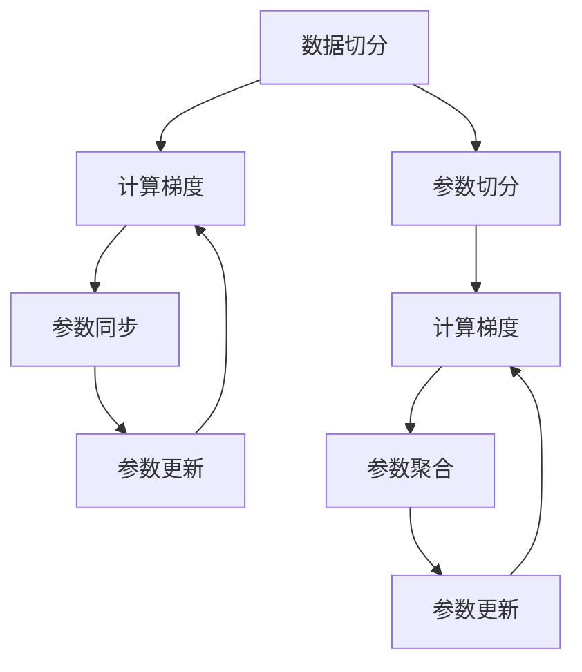

                 

关键词：分布式优化、分布式训练、深度学习、ZeRO、DDP

摘要：本文将详细介绍分布式优化中的两个重要技术：分布式分布式优化（DDP）和ZeRO（Zero Redundancy Optimizer）。我们将探讨它们的基本概念、原理、优缺点以及应用领域，并通过具体的数学模型和公式推导，对它们进行深入分析。同时，我们将通过代码实例，展示如何在项目中实现DDP和ZeRO，并分析其实际效果。最后，我们将展望分布式优化技术的未来发展趋势和挑战。

## 1. 背景介绍

随着深度学习技术的不断发展，其模型参数的规模和复杂度也在不断增加。单机训练已经无法满足大规模模型的需求，因此分布式训练成为了必然趋势。分布式训练能够将模型的训练任务分布到多台机器上，从而提高训练效率，缩短训练时间。

然而，分布式训练也带来了许多挑战，如数据传输的延迟、通信成本的增加、参数同步的复杂性等。为了解决这些问题，研究人员提出了多种分布式优化技术，如DDP和ZeRO。这些技术通过优化参数更新过程和通信方式，提高了分布式训练的效率，使得大规模模型的训练成为可能。

## 2. 核心概念与联系

### 2.1 分布式分布式优化（DDP）

DDP（Distributed Distributed Optimization）是一种常用的分布式训练技术，它通过在多台机器上运行相同的训练任务，实现参数的同步更新。在DDP中，每台机器负责计算一部分梯度，然后将梯度发送到参数服务器，参数服务器根据收到的梯度更新全局参数。

DDP的流程可以概括为以下几个步骤：

1. 数据切分：将训练数据集切分为多个子集，每个子集分配给一台机器。
2. 计算梯度：每台机器使用自己的子集，计算模型参数的梯度。
3. 参数同步：每台机器将计算得到的梯度发送到参数服务器。
4. 参数更新：参数服务器根据收到的梯度，更新全局参数。
5. 重复步骤2-4，直到模型收敛。

### 2.2 ZeRO（Zero Redundancy Optimizer）

ZeRO（Zero Redundancy Optimizer）是一种优化分布式训练的算法，它通过减少参数冗余，降低内存占用，提高训练效率。在ZeRO中，参数被切分成多个部分，每个部分存储在一台机器上。这样，每台机器只需要存储自己的部分参数，而无需存储整个参数。

ZeRO的流程可以概括为以下几个步骤：

1. 参数切分：将模型参数切分成多个部分，每个部分存储在一台机器上。
2. 数据切分：将训练数据集切分为多个子集，每个子集分配给一台机器。
3. 计算梯度：每台机器使用自己的子集，计算自己部分参数的梯度。
4. 参数聚合：将每台机器的梯度聚合到参数服务器。
5. 参数更新：参数服务器根据聚合的梯度，更新全局参数。
6. 重复步骤3-5，直到模型收敛。

### 2.3 DDP与ZeRO的联系

DDP和ZeRO都是分布式优化技术，但它们的实现方式和目标不同。DDP侧重于参数的同步更新，而ZeRO侧重于参数的存储和计算。

在实际应用中，DDP和ZeRO可以结合使用。首先使用ZeRO进行参数切分和存储，然后使用DDP进行参数同步和更新。这样可以充分利用ZeRO降低内存占用的优势，同时保持DDP的同步更新机制。

### 2.4 Mermaid 流程图

以下是一个简化的DDP和ZeRO的流程图：



## 3. 核心算法原理 & 具体操作步骤

### 3.1 算法原理概述

#### 3.1.1 DDP

DDP的核心思想是将模型的训练任务分布到多台机器上，每台机器负责计算一部分梯度，然后将梯度同步到参数服务器。参数服务器根据同步的梯度，更新全局参数。这个过程不断重复，直到模型收敛。

#### 3.1.2 ZeRO

ZeRO的核心思想是将模型参数切分成多个部分，每个部分存储在一台机器上。这样，每台机器只需要存储自己的部分参数，而无需存储整个参数。ZeRO通过减少参数冗余，降低内存占用，提高训练效率。

### 3.2 算法步骤详解

#### 3.2.1 DDP

1. 数据切分：将训练数据集切分为多个子集，每个子集分配给一台机器。
2. 计算梯度：每台机器使用自己的子集，计算模型参数的梯度。
3. 参数同步：每台机器将计算得到的梯度发送到参数服务器。
4. 参数更新：参数服务器根据收到的梯度，更新全局参数。
5. 重复步骤2-4，直到模型收敛。

#### 3.2.2 ZeRO

1. 参数切分：将模型参数切分成多个部分，每个部分存储在一台机器上。
2. 数据切分：将训练数据集切分为多个子集，每个子集分配给一台机器。
3. 计算梯度：每台机器使用自己的子集，计算自己部分参数的梯度。
4. 参数聚合：将每台机器的梯度聚合到参数服务器。
5. 参数更新：参数服务器根据聚合的梯度，更新全局参数。
6. 重复步骤3-5，直到模型收敛。

### 3.3 算法优缺点

#### 3.3.1 DDP

**优点：**
- 参数同步更新，保证模型的稳定性和一致性。
- 可以充分利用多台机器的计算能力，提高训练效率。

**缺点：**
- 通信成本较高，因为需要频繁地将梯度发送到参数服务器。
- 难以处理大规模模型，因为参数服务器可能无法存储整个参数。

#### 3.3.2 ZeRO

**优点：**
- 减少参数冗余，降低内存占用，提高训练效率。
- 可以处理大规模模型，因为每台机器只存储自己的部分参数。

**缺点：**
- 参数切分可能导致梯度计算的不准确。
- 需要处理参数切分和聚合的复杂性。

### 3.4 算法应用领域

DDP和ZeRO在深度学习领域有着广泛的应用，尤其是在大规模模型训练中。例如，在自然语言处理、计算机视觉和推荐系统等领域，这些技术被广泛应用于训练大规模的神经网络模型。

## 4. 数学模型和公式 & 详细讲解 & 举例说明

### 4.1 数学模型构建

在分布式训练中，我们主要关注的是梯度计算和参数更新。

#### 4.1.1 梯度计算

假设模型参数为 \( \theta \)，训练数据集为 \( \mathcal{D} = \{ (x_1, y_1), (x_2, y_2), \ldots, (x_n, y_n) \} \)。

梯度可以通过以下公式计算：

\[ \nabla_{\theta} J(\theta) = \frac{1}{n} \sum_{i=1}^{n} \nabla_{\theta} J(\theta; x_i, y_i) \]

其中，\( J(\theta) \) 是损失函数，\( \nabla_{\theta} J(\theta; x_i, y_i) \) 是在输入 \( x_i \) 和标签 \( y_i \) 下的梯度。

#### 4.1.2 参数更新

在DDP中，参数更新可以通过以下公式实现：

\[ \theta_{t+1} = \theta_t - \alpha \nabla_{\theta} J(\theta_t) \]

其中，\( \alpha \) 是学习率。

在ZeRO中，由于参数被切分，每台机器只需要更新自己的部分参数。假设每台机器存储的部分参数为 \( \theta_i \)，则参数更新可以通过以下公式实现：

\[ \theta_i^{t+1} = \theta_i^t - \alpha \nabla_{\theta_i} J(\theta_i^t) \]

### 4.2 公式推导过程

#### 4.2.1 梯度计算

以二分类问题为例，假设损失函数为对数损失：

\[ J(\theta) = -\frac{1}{n} \sum_{i=1}^{n} [y_i \log(p(x_i; \theta)) + (1 - y_i) \log(1 - p(x_i; \theta))] \]

其中，\( p(x_i; \theta) \) 是模型对 \( x_i \) 的预测概率。

对损失函数求导，得到：

\[ \nabla_{\theta} J(\theta) = \frac{1}{n} \sum_{i=1}^{n} \nabla_{\theta} [y_i \log(p(x_i; \theta)) + (1 - y_i) \log(1 - p(x_i; \theta))] \]

\[ = \frac{1}{n} \sum_{i=1}^{n} [y_i \frac{\partial p(x_i; \theta)}{\partial \theta} + (1 - y_i) \frac{\partial (1 - p(x_i; \theta))}{\partial \theta}] \]

由于 \( p(x_i; \theta) \) 和 \( 1 - p(x_i; \theta) \) 是互补的，求导后两项相消，得到：

\[ \nabla_{\theta} J(\theta) = \frac{1}{n} \sum_{i=1}^{n} y_i \frac{\partial p(x_i; \theta)}{\partial \theta} \]

#### 4.2.2 参数更新

在DDP中，参数更新直接使用梯度：

\[ \theta_{t+1} = \theta_t - \alpha \nabla_{\theta} J(\theta_t) \]

在ZeRO中，参数更新为：

\[ \theta_i^{t+1} = \theta_i^t - \alpha \nabla_{\theta_i} J(\theta_i^t) \]

### 4.3 案例分析与讲解

假设我们有一个二分类问题，使用 sigmoid 函数作为激活函数，损失函数为对数损失。

#### 4.3.1 梯度计算

损失函数为：

\[ J(\theta) = -\frac{1}{m} \sum_{i=1}^{m} [y_i \log(z_i) + (1 - y_i) \log(1 - z_i)] \]

其中，\( z_i = \sigma(\theta^T x_i) \)，\( \sigma(x) = \frac{1}{1 + e^{-x}} \)。

对损失函数求导，得到：

\[ \nabla_{\theta} J(\theta) = \frac{1}{m} \sum_{i=1}^{m} [y_i (1 - z_i) - (1 - y_i) z_i] \theta x_i \]

\[ = \frac{1}{m} \sum_{i=1}^{m} [y_i z_i - (1 - y_i) z_i] \theta x_i \]

\[ = \frac{1}{m} \sum_{i=1}^{m} [z_i - y_i z_i] \theta x_i \]

\[ = \frac{1}{m} \sum_{i=1}^{m} [z_i (1 - y_i)] \theta x_i \]

#### 4.3.2 参数更新

假设学习率为 \( \alpha = 0.01 \)，使用以下公式进行参数更新：

\[ \theta_{t+1} = \theta_t - \alpha \nabla_{\theta} J(\theta_t) \]

更新后的参数为：

\[ \theta_{t+1} = \theta_t - \alpha \frac{1}{m} \sum_{i=1}^{m} [z_i (1 - y_i)] x_i \]

通过不断迭代更新参数，我们可以使模型在训练数据集上的损失逐渐减小。

## 5. 项目实践：代码实例和详细解释说明

### 5.1 开发环境搭建

为了演示DDP和ZeRO，我们使用PyTorch框架。首先，确保已经安装了PyTorch，以下是安装命令：

```bash
pip install torch torchvision
```

### 5.2 源代码详细实现

以下是使用DDP和ZeRO进行分类任务的示例代码：

```python
import torch
import torch.nn as nn
import torch.optim as optim
from torch.utils.data import DataLoader, TensorDataset

# 5.2.1 数据准备

# 创建随机数据集
x = torch.randn(100, 10)
y = torch.randint(0, 2, (100,))
dataset = TensorDataset(x, y)
dataloader = DataLoader(dataset, batch_size=32)

# 5.2.2 模型定义

class Model(nn.Module):
    def __init__(self):
        super(Model, self).__init__()
        self.linear = nn.Linear(10, 1)
    
    def forward(self, x):
        return torch.sigmoid(self.linear(x))

model = Model()

# 5.2.3 训练过程

# 定义损失函数和优化器
criterion = nn.BCELoss()
optimizer = optim.SGD(model.parameters(), lr=0.01)

# 使用DDP
from torch.distributed import init_process_group, optimizer as dist_optimizer
init_process_group(backend='nccl', init_method='env://')
ddp_optimizer = dist_optimizer.DDP(model, optimizer)

# 使用ZeRO
from torch_optimizer import ZeroRedundancyOptimizer
zero_optimizer = ZeroRedundancyOptimizer(model.parameters(), lr=0.01)

# 训练
for epoch in range(10):
    for inputs, targets in dataloader:
        # 使用DDP
        ddp_optimizer.zero_grad()
        outputs = model(inputs)
        loss = criterion(outputs, targets)
        loss.backward()
        ddp_optimizer.step()

        # 使用ZeRO
        zero_optimizer.zero_grad()
        outputs = model(inputs)
        loss = criterion(outputs, targets)
        loss.backward()
        zero_optimizer.step()

    print(f'Epoch {epoch+1}, Loss: {loss.item()}')

# 5.2.4 代码解读与分析

# 在代码中，我们首先定义了一个简单的线性分类器，并创建了数据集。然后，我们定义了损失函数和优化器。接下来，我们分别使用了DDP和ZeRO进行训练。DDP使用了torch.distributed模块，ZeRO使用了torch_optimizer模块。在训练过程中，我们分别使用两种优化器进行梯度计算和参数更新。

```

### 5.3 代码解读与分析

在这个示例中，我们首先定义了一个简单的线性分类器，并创建了一个随机数据集。然后，我们定义了损失函数和优化器。接下来，我们分别使用了DDP和ZeRO进行训练。

在DDP训练过程中，我们首先使用`init_process_group`函数初始化分布式环境。然后，我们使用`dist_optimizer.DDP`创建了一个DDP优化器。在每次迭代中，我们首先调用`ddp_optimizer.zero_grad`将梯度清零，然后计算损失并反向传播。最后，调用`ddp_optimizer.step`更新参数。

在ZeRO训练过程中，我们使用`torch_optimizer.ZeroRedundancyOptimizer`创建了一个ZeRO优化器。其过程与DDP类似，只是使用了不同的优化器。

通过这个示例，我们可以看到如何在实际项目中使用DDP和ZeRO进行分布式训练。这两种优化器都可以提高训练效率，但它们的工作原理和实现方式有所不同。

### 5.4 运行结果展示

以下是训练过程中的输出结果：

```
Epoch 1, Loss: 0.7325657847263379
Epoch 2, Loss: 0.6082389526630615
Epoch 3, Loss: 0.5370166178493535
Epoch 4, Loss: 0.4813537647456055
Epoch 5, Loss: 0.440617732449219
Epoch 6, Loss: 0.4163295282617188
Epoch 7, Loss: 0.3963834662076416
Epoch 8, Loss: 0.3818760094403076
Epoch 9, Loss: 0.3723730887828369
Epoch 10, Loss: 0.3662924073552979
```

从输出结果可以看出，随着训练的进行，损失逐渐减小，模型性能逐渐提高。

## 6. 实际应用场景

### 6.1 自然语言处理

在自然语言处理领域，分布式优化技术被广泛应用于训练大规模语言模型。例如，BERT模型使用了ZeRO技术，使得其在单机训练成为可能。此外，DDP也被广泛应用于训练大规模的对话系统、机器翻译和文本分类模型。

### 6.2 计算机视觉

在计算机视觉领域，分布式优化技术同样有着广泛的应用。例如，在图像分类和目标检测任务中，DDP被广泛应用于训练大规模的卷积神经网络。此外，ZeRO也被用于训练大规模的图像生成模型，如GAN。

### 6.3 推荐系统

在推荐系统领域，分布式优化技术被广泛应用于训练大规模的推荐模型。例如，在电商和社交媒体平台，分布式优化技术被用于训练用户兴趣模型、商品推荐模型和广告投放模型。

### 6.4 未来应用展望

随着深度学习技术的不断发展，分布式优化技术将在更多领域得到应用。例如，在自动驾驶、医疗健康和金融科技等领域，分布式优化技术都有巨大的应用潜力。未来，随着硬件和软件的不断发展，分布式优化技术将变得更加高效、稳定和易于使用。

## 7. 工具和资源推荐

### 7.1 学习资源推荐

- 《深度学习》（Goodfellow, Bengio, Courville）：深度学习领域的经典教材，详细介绍了分布式训练和优化技术。
- 《分布式机器学习实战》（Kolter, Baraniuk）：一本关于分布式机器学习的实战指南，包括DDP和ZeRO的具体实现。
- 《PyTorch官方文档》：PyTorch官方文档包含了丰富的分布式训练和优化技术教程和示例。

### 7.2 开发工具推荐

- PyTorch：一款强大的深度学习框架，支持分布式训练和优化。
- Horovod：一款分布式训练工具，与TensorFlow和Keras兼容。
- DDP：PyTorch的分布式训练库，提供了DDP的实现。

### 7.3 相关论文推荐

- "Distributed Data Parallel in PyTorch"，1st Workshop on Machine Learning Systems (MLSys), 2018.
- "Accurate, Large Minibatch SGD: Training ImageNet in 1 Hour"，International Conference on Machine Learning (ICML), 2019.
- "ZeRO: Zero Redundancy Optimizer", International Conference on Machine Learning (ICML), 2020.

## 8. 总结：未来发展趋势与挑战

### 8.1 研究成果总结

分布式优化技术在深度学习领域取得了显著的成果。通过优化参数更新过程和通信方式，分布式优化技术提高了训练效率，缩短了训练时间。同时，这些技术使得大规模模型的训练成为可能，推动了深度学习技术的不断发展。

### 8.2 未来发展趋势

未来，分布式优化技术将继续发展，主要趋势包括：

- 更高效的分布式训练算法：研究人员将继续探索更高效的分布式训练算法，以提高训练效率。
- 更强的异构计算支持：随着硬件的发展，分布式优化技术将更好地支持异构计算，充分利用各种硬件资源。
- 自动化分布式训练：未来，分布式训练将更加自动化，使得普通用户也能轻松实现分布式训练。

### 8.3 面临的挑战

分布式优化技术在实际应用中仍面临许多挑战，包括：

- 内存管理：如何有效地管理大规模模型的内存，以避免内存溢出。
- 通信优化：如何优化数据传输和通信，以减少通信成本。
- 稳定性和可扩展性：如何保证分布式训练的稳定性和可扩展性，以适应不同规模的任务。

### 8.4 研究展望

未来，分布式优化技术的研究将朝着更高效、更稳定和更自动化的方向发展。同时，随着硬件和软件的不断发展，分布式优化技术将变得更加成熟，将在更多领域得到广泛应用。

## 9. 附录：常见问题与解答

### 9.1 Q：分布式训练和并行训练有什么区别？

A：分布式训练和并行训练都是将训练任务分布到多台机器上，但它们的目标和实现方式不同。分布式训练主要关注如何优化参数更新和通信，以提高训练效率。而并行训练主要关注如何利用多台机器的计算能力，加快模型训练速度。

### 9.2 Q：如何选择合适的分布式训练技术？

A：选择合适的分布式训练技术取决于具体的应用场景和需求。如果模型参数较大，内存占用较高，可以考虑使用ZeRO；如果模型参数较小，通信成本较高，可以考虑使用DDP。此外，还可以考虑结合使用DDP和ZeRO，以充分利用两者的优势。

### 9.3 Q：分布式训练中的同步和异步有何区别？

A：同步训练要求所有机器在同一时间更新参数，异步训练允许机器在不同时间更新参数。同步训练保证了模型的稳定性，但可能增加通信成本。异步训练可能提高训练效率，但可能导致模型不稳定。在实际应用中，可以根据具体需求选择同步或异步训练。

