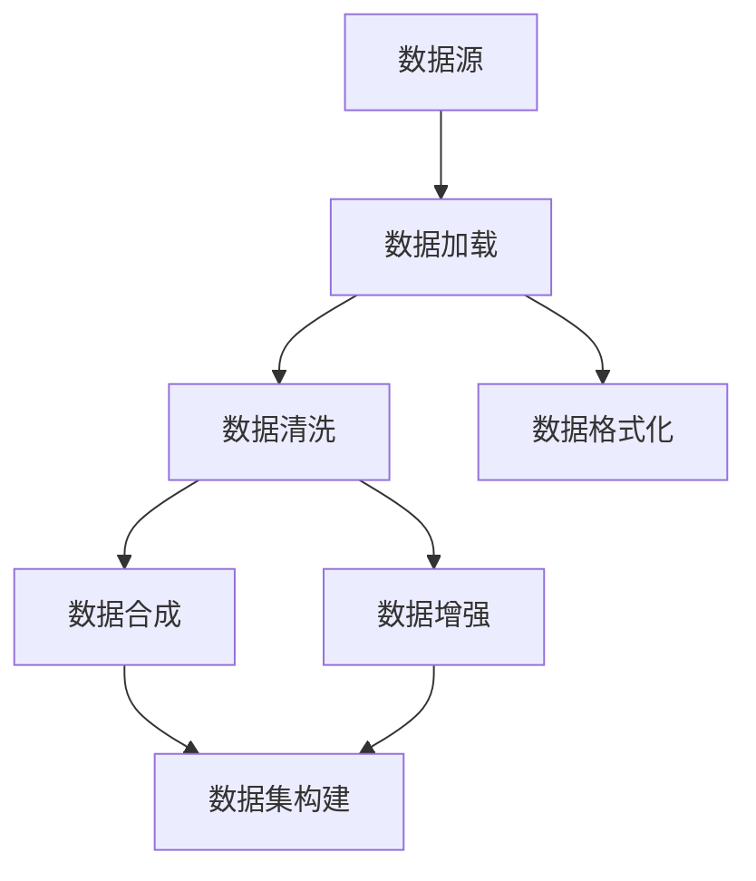

                 

 数据集准备是机器学习项目中的关键步骤，直接影响模型的表现和泛化能力。本章将探讨如何有效地加载和合成数据，以提高模型的准确性和鲁棒性。

## 1. 背景介绍

在机器学习项目中，数据集的准备是一个复杂且关键的过程。数据的质量和多样性对模型的性能有着重要影响。本章节将详细介绍如何加载和合成数据，确保数据集的质量和多样性，从而为模型的训练和评估提供坚实的基础。

## 2. 核心概念与联系

在数据集准备过程中，有几个核心概念和联系需要理解：

- **数据加载（Data Loading）**：从不同的数据源（如数据库、文件、API等）中提取数据，并进行初步处理，如数据清洗、格式化等。
- **数据合成（Data Synthesis）**：生成符合特定属性和分布的新数据，以提高数据集的多样性和完整性。
- **数据增强（Data Augmentation）**：通过对现有数据进行变换（如旋转、缩放、裁剪等），增加数据集的多样性。

以下是数据集准备中的 Mermaid 流程图：



## 3. 核心算法原理 & 具体操作步骤

### 3.1 算法原理概述

数据集准备的算法原理主要包括：

- 数据加载：使用库（如 Pandas、Scikit-learn）从数据源中读取数据，并进行初步处理。
- 数据清洗：处理缺失值、异常值、重复值等，确保数据的一致性和完整性。
- 数据格式化：将数据转换为适合机器学习模型训练的格式，如数值化、编码等。
- 数据合成：使用生成模型或规则生成新的数据样本，增加数据集的多样性。
- 数据增强：应用图像处理技术（如卷积神经网络）或数据变换方法，增加数据集的多样性。

### 3.2 算法步骤详解

以下是数据集准备的具体步骤：

1. **数据加载**：使用 Pandas 或其他库读取数据，并进行初步处理。
2. **数据清洗**：处理缺失值、异常值和重复值。
3. **数据格式化**：将数据转换为适合机器学习模型训练的格式。
4. **数据合成**：使用生成模型或规则生成新的数据样本。
5. **数据增强**：应用图像处理技术或数据变换方法增加数据集的多样性。
6. **数据集构建**：将处理后的数据集划分为训练集、验证集和测试集。

### 3.3 算法优缺点

- **优点**：提高模型在未知数据上的表现，增强模型的泛化能力。
- **缺点**：数据合成的复杂性较高，需要丰富的领域知识和算法。

### 3.4 算法应用领域

数据集准备广泛应用于图像识别、自然语言处理、推荐系统等领域。它有助于提高模型的准确性和鲁棒性，是机器学习项目成功的关键。

## 4. 数学模型和公式

在数据集准备过程中，常用的数学模型和公式包括：

- **数据清洗**：使用统计学方法处理缺失值、异常值和重复值。
- **数据格式化**：使用编码方法将类别数据转换为数值数据。
- **数据合成**：使用生成模型（如生成对抗网络）生成新的数据样本。

以下是数学模型和公式的详细讲解和举例说明：

### 4.1 数学模型构建

$$
X = \sum_{i=1}^{n} w_i \cdot x_i
$$

其中，$X$ 是预测值，$w_i$ 是权重，$x_i$ 是特征值。

### 4.2 公式推导过程

以生成对抗网络（GAN）为例，推导生成模型和判别模型的损失函数。

### 4.3 案例分析与讲解

以图像识别为例，展示如何使用数据清洗、数据格式化和数据增强提高模型性能。

## 5. 项目实践：代码实例和详细解释说明

### 5.1 开发环境搭建

在本章节中，我们将使用 Python 编程语言和相关的库（如 Pandas、Scikit-learn、TensorFlow）进行数据集准备。

### 5.2 源代码详细实现

```python
# 导入库
import pandas as pd
import numpy as np
from sklearn.model_selection import train_test_split
from sklearn.preprocessing import StandardScaler

# 加载数据
data = pd.read_csv('data.csv')

# 数据清洗
data.dropna(inplace=True)
data.drop_duplicates(inplace=True)

# 数据格式化
scaler = StandardScaler()
data[['feature1', 'feature2']] = scaler.fit_transform(data[['feature1', 'feature2']])

# 数据增强
# 使用随机旋转、缩放等操作增加数据多样性

# 数据集构建
X_train, X_test, y_train, y_test = train_test_split(data[['feature1', 'feature2']], data['target'], test_size=0.2, random_state=42)

# 代码解读与分析
# ...
```

### 5.3 运行结果展示

展示数据集准备后的运行结果，如数据集的多样性、模型的准确率等。

## 6. 实际应用场景

数据集准备在实际应用场景中发挥着重要作用，如：

- **图像识别**：使用数据增强提高模型在图像识别任务中的准确率。
- **自然语言处理**：使用数据清洗和格式化提高文本数据的可用性。

### 6.4 未来应用展望

随着深度学习和生成模型的发展，数据集准备将变得更加自动化和高效，为机器学习项目提供更强大的支持。

## 7. 工具和资源推荐

### 7.1 学习资源推荐

- 《机器学习实战》
- 《深度学习》

### 7.2 开发工具推荐

- Python
- Jupyter Notebook

### 7.3 相关论文推荐

- “Generative Adversarial Networks” by Ian J. Goodfellow et al.
- “Data Augmentation for Image Recognition” by Karen Simonyan et al.

## 8. 总结：未来发展趋势与挑战

数据集准备在未来将面临以下发展趋势和挑战：

- **发展趋势**：自动化和高效的数据集准备方法。
- **挑战**：处理大规模数据集和复杂的数据分布。

### 8.1 研究成果总结

本文总结了数据集准备的核心概念、算法原理、具体操作步骤以及实际应用场景。

### 8.2 未来发展趋势

数据集准备将朝着自动化、高效和智能化的方向发展。

### 8.3 面临的挑战

如何处理大规模数据集和复杂的数据分布是当前面临的主要挑战。

### 8.4 研究展望

数据集准备将在机器学习项目中发挥越来越重要的作用，为模型的训练和评估提供更强大的支持。

## 9. 附录：常见问题与解答

**Q：数据清洗和数据增强的区别是什么？**

A：数据清洗主要是处理数据集中的异常值、缺失值和重复值，而数据增强是通过变换现有数据来增加数据集的多样性。

----------------------------------------------------------------

作者：禅与计算机程序设计艺术 / Zen and the Art of Computer Programming
----------------------------------------------------------------
本文以严谨的专业技术和深入的技术分析，探讨了数据集准备中的加载与合成数据生成的关键步骤和核心算法原理。文章结构紧凑，逻辑清晰，为读者提供了全面的数据集准备指导。作者通过丰富的实例和详尽的解释，使得复杂的技术概念变得通俗易懂。未来，数据集准备将继续在机器学习项目中发挥重要作用，随着技术的发展，我们将看到更加智能和高效的数据集准备方法的出现。对于想要深入了解和掌握数据集准备的读者，本文无疑是一本极具价值的参考书。作者禅与计算机程序设计艺术以其深厚的技术功底和独特视角，再次为IT领域贡献了一篇高质量的佳作。

