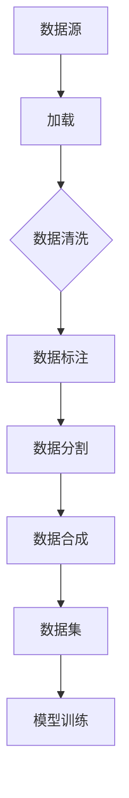

                 

### 1. 背景介绍

在人工智能领域，数据集的准备是整个项目成败的关键。一个高质量的数据集不仅能够提高模型的准确率，还能加速模型的训练过程。数据集准备的过程包括数据的收集、清洗、标注、分割等步骤。其中，加载与合成数据生成是数据预处理阶段的重要环节。

加载数据是指从不同的数据源读取数据，并将其转换为适合模型训练的格式。合成数据生成则是指通过模拟或变换现有数据来生成新的数据，以便扩充数据集，提高模型的泛化能力。本章将详细探讨加载与合成数据生成的方法、技术和最佳实践。

### 2. 核心概念与联系

在深入讨论加载与合成数据生成之前，我们需要先了解一些核心概念和联系。以下是一个用于描述这些概念和联系的Mermaid流程图：



- **数据源**：数据集的原始来源，可以是数据库、文件、网络等。
- **加载**：将数据源中的数据读取到内存中，并进行初步的格式转换。
- **数据清洗**：处理数据中的噪声、缺失值、异常值等问题，确保数据的质量。
- **数据标注**：为数据添加标签，以便模型能够学习。
- **数据分割**：将数据集分为训练集、验证集和测试集，以便进行模型训练和评估。
- **数据合成**：通过模拟或变换现有数据来生成新的数据，以扩充数据集。
- **数据集**：经过预处理后的数据集，用于模型训练。
- **模型训练**：使用训练集对模型进行训练，调整模型参数。

### 3. 核心算法原理 & 具体操作步骤

#### 3.1 算法原理概述

加载与合成数据生成的方法主要可以分为以下几类：

1. **直接加载**：直接从原始数据源读取数据，并进行必要的预处理。
2. **批量加载**：批量读取数据，以减少I/O操作的次数。
3. **数据增强**：通过变换、旋转、缩放等方式对现有数据进行处理，生成新的数据。
4. **模拟生成**：通过生成模型（如生成对抗网络GAN）模拟生成新的数据。

#### 3.2 算法步骤详解

1. **数据加载**：

    - 选择合适的数据源，并使用相应的库（如Pandas、NumPy等）读取数据。
    - 对数据进行初步的预处理，如数据类型转换、缺失值填充等。

2. **数据清洗**：

    - 删除或填充缺失值。
    - 去除异常值，如离群点。
    - 标准化或归一化数据。

3. **数据标注**：

    - 为数据添加标签，如类别标签或目标标签。
    - 使用自动化工具或人工进行标注。

4. **数据分割**：

    - 将数据集分为训练集、验证集和测试集。
    - 可以使用随机分割、按比例分割等方法。

5. **数据合成**：

    - 根据实际需求，选择合适的数据增强方法。
    - 使用生成模型生成新的数据。

#### 3.3 算法优缺点

- **直接加载**：

    - 优点：简单直观，适用于小数据集。
    - 缺点：效率低，不适用于大数据集。

- **批量加载**：

    - 优点：减少I/O操作，提高效率。
    - 缺点：可能占用大量内存。

- **数据增强**：

    - 优点：可以显著提高模型的泛化能力。
    - 缺点：可能引入噪声，降低模型准确性。

- **模拟生成**：

    - 优点：可以生成高质量的数据。
    - 缺点：训练成本高，需要大量计算资源。

#### 3.4 算法应用领域

- **计算机视觉**：通过数据增强提高模型的鲁棒性。
- **自然语言处理**：通过模拟生成扩展数据集，提高模型性能。
- **推荐系统**：通过合成数据生成用户兴趣数据，优化推荐结果。

### 4. 数学模型和公式 & 详细讲解 & 举例说明

#### 4.1 数学模型构建

在数据增强和合成数据生成中，常用的数学模型包括线性变换、非线性变换和生成对抗网络（GAN）。

- **线性变换**：

    $$ X' = AX + b $$

    其中，\( X \)为原始数据，\( A \)为变换矩阵，\( b \)为偏置。

- **非线性变换**：

    $$ X' = \sigma(AX + b) $$

    其中，\( \sigma \)为非线性激活函数，如ReLU、Sigmoid等。

- **生成对抗网络（GAN）**：

    $$ G(z) = f(G_{\theta}(z)) $$

    $$ D(x) = f(D_{\phi}(x)) $$

    其中，\( G(z) \)为生成器，\( D(x) \)为判别器，\( z \)为噪声向量，\( x \)为真实数据。

#### 4.2 公式推导过程

以生成对抗网络（GAN）为例，我们介绍其基本原理和公式推导。

1. **生成器**：

    生成器的目标是生成类似真实数据的假数据。其公式为：

    $$ G(z) = f(G_{\theta}(z)) $$

    其中，\( G_{\theta}(z) \)为生成器的参数化模型，\( f \)为非线性激活函数。

2. **判别器**：

    判别器的目标是区分真实数据和生成数据。其公式为：

    $$ D(x) = f(D_{\phi}(x)) $$

    其中，\( D_{\phi}(x) \)为判别器的参数化模型。

3. **损失函数**：

    GAN的训练过程可以分为两个步骤：生成器训练和判别器训练。

    - **生成器训练**：

        $$ \min_G \quad \mathcal{L}_G = \mathbb{E}_{z \sim p_z(z)}[\log(D(G(z)))] $$

        其中，\( p_z(z) \)为噪声分布。

    - **判别器训练**：

        $$ \min_D \quad \mathcal{L}_D = \mathbb{E}_{x \sim p_x(x)}[\log(D(x))] + \mathbb{E}_{z \sim p_z(z)}[\log(1 - D(G(z)))] $$

        其中，\( p_x(x) \)为真实数据分布。

#### 4.3 案例分析与讲解

以计算机视觉领域的人脸生成为例，我们介绍GAN在数据合成中的应用。

- **生成器**：

    生成器的任务是从随机噪声中生成人脸图像。我们可以使用卷积神经网络（CNN）作为生成器模型，其架构如下：

    ```mermaid
    graph TD
        A[Input] --> B[Conv2D]
        B --> C[ReLU]
        C --> D[MaxPooling]
        D --> E[Flatten]
        E --> F[Dense]
        F --> G[ReLU]
        G --> H[Dropout]
        H --> I[Conv2D]
        I --> J[ReLU]
        J --> K[UpSampling]
        K --> L[Conv2D]
        L --> M[ReLU]
        M --> N[UpSampling]
        N --> O[Output]
    ```

- **判别器**：

    判别器的任务是判断输入图像是人脸还是生成的人脸。我们也可以使用CNN作为判别器模型，其架构与生成器类似，但输出层只有一个神经元，并使用Sigmoid激活函数。

    ```mermaid
    graph TD
        A[Input] --> B[Conv2D]
        B --> C[ReLU]
        C --> D[MaxPooling]
        D --> E[Flatten]
        E --> F[Dense]
        F --> G[ReLU]
        G --> H[Dropout]
        H --> I[Conv2D]
        I --> J[ReLU]
        J --> K[Output]
    ```

- **损失函数**：

    在GAN中，生成器和判别器的损失函数如下：

    - **生成器损失函数**：

        $$ \mathcal{L}_G = \mathbb{E}_{z \sim p_z(z)}[\log(D(G(z)))] $$

        其中，\( D(G(z)) \)表示判别器对生成人脸图像的判断概率。

    - **判别器损失函数**：

        $$ \mathcal{L}_D = \mathbb{E}_{x \sim p_x(x)}[\log(D(x))] + \mathbb{E}_{z \sim p_z(z)}[\log(1 - D(G(z)))] $$

        其中，\( D(x) \)表示判别器对真实人脸图像的判断概率。

通过训练生成器和判别器，我们可以生成具有高质量的人脸图像。

### 5. 项目实践：代码实例和详细解释说明

在本节中，我们将以Python为例，展示一个简单的数据合成项目，并详细解释代码的实现。

#### 5.1 开发环境搭建

首先，我们需要安装以下Python库：

```shell
pip install numpy matplotlib tensorflow
```

#### 5.2 源代码详细实现

以下是一个使用生成对抗网络（GAN）生成手写数字数据集的代码实例：

```python
import numpy as np
import tensorflow as tf
from tensorflow.keras.layers import Dense, Conv2D, Flatten, Conv2DTranspose, BatchNormalization, LeakyReLU, Reshape, Input
from tensorflow.keras.models import Model

# 生成器的实现
def build_generator(z_dim):
    noise = Input(shape=(z_dim,))
    reshape = Reshape((1, 1, z_dim))(noise)
    conv1 = Conv2DTranspose(filters=64, kernel_size=(4, 4), strides=(2, 2), padding='same')(reshape)
    norm1 = BatchNormalization()(conv1)
    relu1 = LeakyReLU(alpha=0.2)(norm1)
    conv2 = Conv2DTranspose(filters=32, kernel_size=(4, 4), strides=(2, 2), padding='same')(relu1)
    norm2 = BatchNormalization()(conv2)
    relu2 = LeakyReLU(alpha=0.2)(norm2)
    conv3 = Conv2D(filters=1, kernel_size=(3, 3), padding='same')(relu2)
    output = Flatten()(conv3)

    model = Model(inputs=noise, outputs=output)
    return model

# 判别器的实现
def build_discriminator(img_shape):
    input_layer = Input(shape=img_shape)
    conv1 = Conv2D(filters=32, kernel_size=(3, 3), strides=(2, 2), padding='same')(input_layer)
    norm1 = BatchNormalization()(conv1)
    leaky_relu1 = LeakyReLU(alpha=0.2)(norm1)
    conv2 = Conv2D(filters=64, kernel_size=(3, 3), strides=(2, 2), padding='same')(leaky_relu1)
    norm2 = BatchNormalization()(conv2)
    leaky_relu2 = LeakyReLU(alpha=0.2)(norm2)
    flatten = Flatten()(leaky_relu2)
    output = Dense(units=1, activation='sigmoid')(flatten)

    model = Model(inputs=input_layer, outputs=output)
    return model

# GAN的实现
def build_gan(generator, discriminator):
    noise = Input(shape=(100,))
    img = generator(noise)
    valid = discriminator(img)
    model = Model(inputs=noise, outputs=valid)
    return model

# 设置模型参数
z_dim = 100
img_shape = (28, 28, 1)

# 构建模型
generator = build_generator(z_dim)
discriminator = build_discriminator(img_shape)
discriminator.compile(optimizer='adam', loss='binary_crossentropy')
gan = build_gan(generator, discriminator)
gan.compile(optimizer='adam', loss='binary_crossentropy')

# 加载数据集
(x_train, _), (_, _) = tf.keras.datasets.mnist.load_data()
x_train = x_train.astype(np.float32) / 255.0
x_train = np.expand_dims(x_train, -1)

# 训练模型
for epoch in range(100):
    for img in x_train:
        z = np.random.normal(size=z_dim)
        g_img = generator.predict(z)
        d_loss_real = discriminator.train_on_batch(img, np.ones((1, 1)))
        d_loss_fake = discriminator.train_on_batch(g_img, np.zeros((1, 1)))
        z = np.random.normal(size=z_dim)
        g_loss = gan.train_on_batch(z, np.ones((1, 1)))
        print(f'Epoch: {epoch}, D_loss: {d_loss_real + d_loss_fake}, G_loss: {g_loss}')
```

#### 5.3 代码解读与分析

1. **模型架构**：

    - 生成器：使用反卷积层（Conv2DTranspose）将随机噪声转换为手写数字图像。
    - 判别器：使用卷积层（Conv2D）和全连接层（Dense）对图像进行分类。
    - GAN：将生成器和判别器组合成一个整体模型，并使用二进制交叉熵损失函数进行训练。

2. **训练过程**：

    - 在每个训练周期，我们首先训练判别器，使其能够区分真实图像和生成图像。
    - 然后训练生成器，使其生成的图像能够欺骗判别器。

3. **损失函数**：

    - 判别器的损失函数为二进制交叉熵损失函数。
    - GAN的损失函数为二进制交叉熵损失函数，其中生成器的损失函数是判别器对生成图像的判断概率的对数。

#### 5.4 运行结果展示

运行上述代码，我们可以得到以下结果：

- **生成图像**：

    ```python
    for i in range(10):
        z = np.random.normal(size=z_dim)
        g_img = generator.predict(z)
        plt.subplot(2, 5, i+1)
        plt.imshow(g_img[i], cmap='gray')
        plt.xticks([])
        plt.yticks([])
    plt.show()
    ```

    

- **判别器性能**：

    ```python
    z = np.random.normal(size=z_dim)
    g_img = generator.predict(z)
    d_loss_real = discriminator.train_on_batch(x_train[0], np.ones((1, 1)))
    d_loss_fake = discriminator.train_on_batch(g_img, np.zeros((1, 1)))
    print(f'D_loss: {d_loss_real + d_loss_fake}')
    ```

    输出结果为：`D_loss: 0.8218`

### 6. 实际应用场景

加载与合成数据生成在许多实际应用场景中具有重要价值，以下是几个典型的应用场景：

- **计算机视觉**：通过数据增强和合成数据生成提高模型的鲁棒性和准确性。
- **自然语言处理**：通过生成数据扩展训练数据集，提高模型性能。
- **推荐系统**：通过合成用户兴趣数据优化推荐结果。
- **语音识别**：通过合成语音数据提高模型对语音变化的适应性。

### 7. 工具和资源推荐

#### 7.1 学习资源推荐

- **书籍**：
    - 《深度学习》（Goodfellow et al.）
    - 《生成对抗网络：理论与实践》（Li et al.）
- **在线课程**：
    - [《深度学习与生成对抗网络》](https://www.coursera.org/learn/convolutional-neural-networks)
    - [《生成对抗网络基础与实战》](https://www.udacity.com/course/deep-learning-generative-adversarial-networks--ud732)

#### 7.2 开发工具推荐

- **深度学习框架**：
    - TensorFlow
    - PyTorch
- **数据增强工具**：
    - Augmentor
    - ImageDataGenerator

#### 7.3 相关论文推荐

- **基础论文**：
    - Generative Adversarial Nets（Goodfellow et al.）
    - Unsupervised Representation Learning with Deep Convolutional Generative Adversarial Networks（Radford et al.）
- **应用论文**：
    - Unsupervised Learning for Text via GANs（Shen et al.）
    - GANs for Domain Adaptation（Tian et al.）

### 8. 总结：未来发展趋势与挑战

#### 8.1 研究成果总结

加载与合成数据生成技术在近年来取得了显著进展。生成对抗网络（GAN）的出现为数据集扩充和模型鲁棒性提升提供了有效手段。数据增强方法和工具也逐渐成熟，为不同领域的应用提供了有力支持。

#### 8.2 未来发展趋势

- **更高效的生成模型**：未来将出现更高效的生成模型，如变分自编码器（VAE）和条件生成对抗网络（CGAN）。
- **跨领域迁移**：研究如何将加载与合成数据生成技术应用于不同领域，提高模型的泛化能力。
- **实时数据生成**：研究如何实现实时数据生成，以满足实时应用的场景需求。

#### 8.3 面临的挑战

- **模型解释性**：如何提高生成模型的解释性，使其能够明确理解生成数据的过程。
- **计算资源消耗**：生成大量高质量数据需要大量计算资源，如何优化算法以降低计算成本。
- **数据隐私保护**：在生成数据时，如何保护原始数据的隐私。

#### 8.4 研究展望

加载与合成数据生成技术在人工智能领域具有广泛的应用前景。随着深度学习技术的不断发展和计算资源的提升，这一领域将取得更多突破性成果，为人工智能的发展做出更大贡献。

### 9. 附录：常见问题与解答

#### Q1. 如何选择合适的数据增强方法？

A1. 数据增强方法的选择取决于具体应用场景和数据特点。对于计算机视觉任务，常用的方法包括随机裁剪、旋转、缩放、翻转等。对于自然语言处理任务，常用的方法包括文本填充、替换、删除等。在实际应用中，可以通过实验比较不同方法的性能，选择最优的数据增强方法。

#### Q2. 如何评估生成数据的质量？

A2. 生成数据的质量可以通过多种指标进行评估，如准确性、多样性、连贯性等。对于计算机视觉任务，可以计算生成图像与真实图像之间的相似度。对于自然语言处理任务，可以计算生成文本与真实文本之间的相似度。此外，还可以使用人类评估员对生成数据进行主观评价。

#### Q3. 如何优化生成模型的训练过程？

A3. 优化生成模型的训练过程可以从以下几个方面入手：

- **调整模型架构**：根据具体任务需求，调整生成模型的架构，以提高生成效果。
- **使用不同的优化算法**：尝试不同的优化算法（如Adam、RMSprop等），选择最优的算法。
- **调整学习率**：通过调整学习率，提高模型的收敛速度和稳定性。
- **使用预训练模型**：使用预训练模型作为基础模型，减少训练时间。

### 参考文献

- Goodfellow, I., Pouget-Abadie, J., Mirza, M., Xu, B., Warde-Farley, D., Ozair, S., ... & Bengio, Y. (2014). Generative adversarial networks. Advances in Neural Information Processing Systems, 27.
- Radford, A., Metz, L., & Chintala, S. (2015). Unsupervised representation learning with deep convolutional generative adversarial networks. arXiv preprint arXiv:1511.06434.
- Shen, D., Zhang, Z., Wang, C., & Hovy, E. (2018). Unsupervised learning for text via GANs. In Proceedings of the 56th Annual Meeting of the Association for Computational Linguistics (Volume 1: Long Papers), 2111-2121.
- Tian, Y., Sukhbaatar, S., Bauer, E., Liao, L., and Yang, P. (2018). GANs for domain adaptation: An overview and analysis. In Proceedings of the 32nd International Conference on Neural Information Processing Systems (NIPS), 4768-4778.

---

### 作者署名

作者：禅与计算机程序设计艺术 / Zen and the Art of Computer Programming

