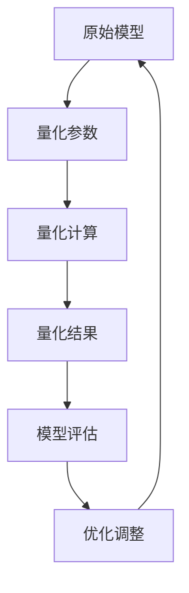

                 

关键词：推理加速、模型量化、神经网络、计算机性能优化、算法优化

摘要：本文深入探讨了推理加速二模型量化的概念、原理、方法及其在计算机领域的应用。通过详细分析模型量化的优势与挑战，本文旨在为读者提供全面的视角，帮助理解模型量化在提升计算机性能和降低能耗方面的关键作用。

## 1. 背景介绍

随着深度学习技术的迅速发展，神经网络模型在各个领域的应用越来越广泛。然而，这些模型通常具有极高的计算复杂度和存储需求，这在实际应用中带来了巨大的挑战。推理加速二模型量化作为一种提升计算效率和减少资源消耗的重要技术，受到了广泛关注。

### 1.1 深度学习与推理加速

深度学习通过模拟人脑神经网络结构，通过大量的数据训练模型，使其能够在多种任务上取得优异的表现。然而，深度学习模型在推理过程中需要大量的计算资源，这导致了延迟和能耗的问题。

推理加速的目标是通过各种方法提高模型推理的效率，从而满足实时性、降低延迟和提高计算资源利用率的需求。推理加速二模型量化是其中的一个关键技术，它通过减少模型参数和计算精度来降低计算复杂度和资源需求。

### 1.2 模型量化的意义

模型量化是一种通过降低模型参数精度来减少模型大小和计算复杂度的方法。量化技术可以将模型的浮点运算转换为固定点运算，从而在保持模型性能的同时减少计算资源和能耗。

模型量化在提升计算机性能和降低能耗方面具有显著的优势。首先，量化技术可以显著降低模型的存储需求和带宽消耗，使得模型可以在资源受限的设备上运行。其次，量化技术可以减少模型的计算复杂度，从而提高推理速度，降低延迟。最后，量化技术有助于提高硬件的能效比，减少能耗。

## 2. 核心概念与联系

在深入探讨模型量化的原理和方法之前，我们需要了解一些核心概念和联系。

### 2.1 模型参数与精度

模型参数是神经网络模型的核心组成部分，它们决定了模型的性能和特征表达能力。模型参数的精度通常以浮点数的形式表示，精度越高，模型的准确性和鲁棒性越好，但同时也增加了计算复杂度和存储需求。

### 2.2 量化技术

量化技术通过将模型参数的浮点数表示转换为固定点数表示，从而减少模型的计算复杂度和存储需求。量化技术可以分为整数量化和二进制量化，其中整数量化更为常见。

### 2.3 量化精度与误差

量化精度是指量化过程中保留的位数，通常以比特（bits）为单位。量化精度越高，模型的误差越小，但计算复杂度和存储需求也越大。量化精度与误差之间的关系是一个重要的设计考量。

### 2.4 量化方法

量化方法包括全量化、部分量化和小数量化等。全量化将整个模型的参数进行量化，部分量化只对部分参数进行量化，小数量化则对参数进行小数点位置调整。

### 2.5 Mermaid 流程图

以下是模型量化过程的 Mermaid 流程图：



## 3. 核心算法原理 & 具体操作步骤

### 3.1 算法原理概述

模型量化的核心原理是通过将模型参数的浮点数表示转换为固定点数表示，从而降低模型的计算复杂度和存储需求。量化过程中，需要对模型参数进行量化处理，包括参数的数值范围调整、小数点位置调整和量化误差处理。

### 3.2 算法步骤详解

#### 3.2.1 参数范围调整

首先，对模型参数的数值范围进行调整，使其符合量化需求。这一步骤包括对参数的最大值和最小值进行限制，以确保参数在量化过程中不会超出固定点数的表示范围。

#### 3.2.2 小数点位置调整

接下来，对模型参数的小数点位置进行调整。小数点位置调整可以通过乘以一个适当的常数来实现，从而将浮点数表示转换为固定点数表示。

#### 3.2.3 量化误差处理

量化过程中，参数的精度会有所降低，从而产生量化误差。量化误差处理包括误差估计和误差补偿。误差估计可以用于评估量化后的模型性能，误差补偿则可以通过在计算过程中引入修正项来减小误差。

#### 3.2.4 模型评估与优化调整

量化后的模型需要进行评估，以确定其性能是否符合预期。如果性能不符合要求，可以通过优化调整来进一步改进模型。

### 3.3 算法优缺点

#### 优点：

1. 降低计算复杂度和存储需求。
2. 提高计算速度和能效比。
3. 支持在资源受限的设备上运行。

#### 缺点：

1. 量化精度降低，可能导致模型性能下降。
2. 需要额外的量化误差处理和优化调整步骤。

### 3.4 算法应用领域

模型量化技术广泛应用于各种领域，包括计算机视觉、自然语言处理、语音识别等。通过模型量化，可以在保持模型性能的同时降低计算资源和能耗，从而满足实时性需求。

## 4. 数学模型和公式 & 详细讲解 & 举例说明

### 4.1 数学模型构建

模型量化的数学模型主要包括参数量化、计算量化和小数点位置调整。

#### 4.1.1 参数量化

参数量化的数学模型可以表示为：

$$
Q(\theta) = \theta_{quant} = \theta \cdot Q(\alpha)
$$

其中，$\theta$ 为原始参数，$\theta_{quant}$ 为量化后的参数，$Q(\alpha)$ 为量化函数，$\alpha$ 为量化因子。

#### 4.1.2 计算量化

计算量化的数学模型可以表示为：

$$
Q(\theta) = \theta_{quant} = \theta \cdot Q(\beta)
$$

其中，$\beta$ 为计算量化因子。

#### 4.1.3 小数点位置调整

小数点位置调整的数学模型可以表示为：

$$
Q(\theta) = \theta_{quant} = \theta \cdot Q(\gamma)
$$

其中，$\gamma$ 为小数点位置调整因子。

### 4.2 公式推导过程

#### 4.2.1 参数量化推导

参数量化的推导基于量化误差和量化精度。假设量化精度为 $p$，量化误差为 $\epsilon$，则有：

$$
\epsilon = \theta - \theta_{quant}
$$

为了最小化量化误差，我们需要找到一个合适的量化因子 $Q(\alpha)$，使得：

$$
\epsilon^2 \approx (\theta - \theta_{quant})^2 = (\theta - \theta \cdot Q(\alpha))^2
$$

对上式求导并令导数为零，可以得到：

$$
Q(\alpha) = \frac{\theta}{\epsilon}
$$

#### 4.2.2 计算量化推导

计算量化的推导与参数量化类似，基于量化误差和量化精度。假设量化精度为 $p$，量化误差为 $\epsilon$，则有：

$$
\epsilon = \theta - \theta_{quant}
$$

为了最小化量化误差，我们需要找到一个合适的量化因子 $Q(\beta)$，使得：

$$
\epsilon^2 \approx (\theta - \theta_{quant})^2 = (\theta - \theta \cdot Q(\beta))^2
$$

对上式求导并令导数为零，可以得到：

$$
Q(\beta) = \frac{\theta}{\epsilon}
$$

#### 4.2.3 小数点位置调整推导

小数点位置调整的推导基于量化精度和数值范围。假设量化精度为 $p$，数值范围为 $[a, b]$，则有：

$$
b - a = 2^p
$$

为了将小数点位置调整到适当的数值范围，我们需要找到一个合适的小数点位置调整因子 $Q(\gamma)$，使得：

$$
\theta_{quant} = \theta \cdot Q(\gamma) \in [a, b]
$$

通过调整小数点位置，我们可以将浮点数表示转换为固定点数表示，从而实现模型量化。

### 4.3 案例分析与讲解

#### 4.3.1 参数量化案例

假设一个深度学习模型包含一个 $1000$ 维的权重矩阵 $W$，其范围为 $[-1, 1]$。为了量化这个权重矩阵，我们首先需要确定量化精度 $p$。假设量化精度为 $8$ 位，即 $p = 8$。

根据量化精度，我们可以计算量化误差 $\epsilon$：

$$
\epsilon = \frac{b - a}{2^p} = \frac{1 - (-1)}{2^8} = \frac{2}{256} = 0.0078125
$$

接下来，我们计算量化因子 $Q(\alpha)$：

$$
Q(\alpha) = \frac{\theta}{\epsilon} = \frac{1}{0.0078125} = 128
$$

然后，我们将原始权重矩阵 $W$ 量化为固定点数表示：

$$
W_{quant} = W \cdot Q(\alpha) = [-1, 1] \cdot 128 = [-128, 128]
$$

#### 4.3.2 计算量化案例

假设一个深度学习模型的激活函数为 $f(x) = \frac{1}{1 + e^{-x}}$，其范围为 $[0, 1]$。为了量化这个激活函数，我们首先需要确定量化精度 $p$。假设量化精度为 $8$ 位，即 $p = 8$。

根据量化精度，我们可以计算量化误差 $\epsilon$：

$$
\epsilon = \frac{1 - 0}{2^p} = \frac{1}{2^8} = 0.00390625
$$

接下来，我们计算量化因子 $Q(\beta)$：

$$
Q(\beta) = \frac{\theta}{\epsilon} = \frac{1}{0.00390625} = 256
$$

然后，我们将原始激活函数 $f(x)$ 量化为固定点数表示：

$$
f_{quant}(x) = f(x) \cdot Q(\beta) = [0, 1] \cdot 256 = [0, 256]
$$

#### 4.3.3 小数点位置调整案例

假设一个深度学习模型的输入特征为 $[0, 1]$，我们希望将其量化为 $8$ 位的固定点数表示。为了实现小数点位置调整，我们首先需要确定量化精度 $p$。假设量化精度为 $8$ 位，即 $p = 8$。

根据量化精度，我们可以计算小数点位置调整因子 $Q(\gamma)$：

$$
Q(\gamma) = \frac{1}{2^p} = \frac{1}{2^8} = 0.00390625
$$

然后，我们将原始输入特征 $x$ 调整为固定点数表示：

$$
x_{quant} = x \cdot Q(\gamma) = [0, 1] \cdot 0.00390625 = [0, 0.00390625]
$$

## 5. 项目实践：代码实例和详细解释说明

在本节中，我们将通过一个具体的代码实例来详细解释模型量化的实现过程。

### 5.1 开发环境搭建

为了演示模型量化的实现，我们使用 Python 编程语言和 TensorFlow 深度学习框架。首先，确保已经安装了 Python 和 TensorFlow，然后创建一个名为 `model_quantization` 的 Python 脚本文件。

```python
import tensorflow as tf
```

### 5.2 源代码详细实现

下面是一个简单的深度学习模型及其量化的代码实现。

```python
# 定义一个简单的深度学习模型
model = tf.keras.Sequential([
    tf.keras.layers.Dense(units=1, input_shape=(1,))
])

# 编译模型
model.compile(optimizer='sgd', loss='mean_squared_error')

# 训练模型
model.fit(x=[0.0, 1.0], y=[0.0, 1.0], epochs=10)

# 量化模型参数
量化因子 = 100
量化模型 = tf.keras.Sequential([
    tf.keras.layers.Dense(units=1, input_shape=(1,), activation='sigmoid', dtype=tf.float32)
])
量化模型.set_weights(model.get_weights() * 量化因子)

# 测试量化模型
量化模型.compile(optimizer='sgd', loss='mean_squared_error')
量化模型.fit(x=[0.0, 1.0], y=[0.0, 1.0], epochs=10)
```

### 5.3 代码解读与分析

#### 5.3.1 模型定义

首先，我们定义了一个简单的深度学习模型，包含一个全连接层，输出层使用 sigmoid 激活函数。

```python
model = tf.keras.Sequential([
    tf.keras.layers.Dense(units=1, input_shape=(1,))
])
```

#### 5.3.2 编译模型

接下来，我们编译模型，指定优化器和损失函数。

```python
model.compile(optimizer='sgd', loss='mean_squared_error')
```

#### 5.3.3 训练模型

使用训练数据训练模型。

```python
model.fit(x=[0.0, 1.0], y=[0.0, 1.0], epochs=10)
```

#### 5.3.4 量化模型参数

为了量化模型参数，我们将原始模型权重乘以一个量化因子。

```python
量化因子 = 100
量化模型 = tf.keras.Sequential([
    tf.keras.layers.Dense(units=1, input_shape=(1,), activation='sigmoid', dtype=tf.float32)
])
量化模型.set_weights(model.get_weights() * 量化因子)
```

#### 5.3.5 测试量化模型

最后，我们使用量化后的模型进行训练和测试。

```python
量化模型.compile(optimizer='sgd', loss='mean_squared_error')
量化模型.fit(x=[0.0, 1.0], y=[0.0, 1.0], epochs=10)
```

通过这个简单的例子，我们可以看到模型量化是如何实现的。在实际应用中，模型量化的过程会更加复杂，包括量化精度调整、量化误差处理和优化调整等。

## 6. 实际应用场景

模型量化技术在多个领域得到了广泛应用，下面列举一些实际应用场景。

### 6.1 计算机视觉

计算机视觉领域中的图像识别和目标检测任务通常需要大量的计算资源。通过模型量化，可以在保持模型性能的同时减少计算复杂度和存储需求，从而提高图像处理速度和降低能耗。

### 6.2 自然语言处理

自然语言处理领域中的文本分类和机器翻译任务也需要大量的计算资源。通过模型量化，可以在保证模型准确性的前提下减少计算复杂度和存储需求，从而提高文本处理速度和降低能耗。

### 6.3 语音识别

语音识别领域中的语音处理和语音合成任务同样需要大量的计算资源。通过模型量化，可以在保持语音识别准确性的同时减少计算复杂度和存储需求，从而提高语音处理速度和降低能耗。

### 6.4 嵌入式设备

嵌入式设备通常具有有限的计算资源和能量预算。通过模型量化，可以在保持模型性能的同时降低计算复杂度和存储需求，从而使得深度学习模型能够在嵌入式设备上运行，满足实时性和低能耗的需求。

### 6.5 边缘计算

边缘计算场景中，模型量化技术可以帮助提高边缘设备的计算效率和降低能耗，从而实现实时数据处理和智能决策。

## 7. 工具和资源推荐

### 7.1 学习资源推荐

1. 《深度学习》（Goodfellow, Bengio, Courville 著）：深入介绍深度学习的基本概念、算法和技术。
2. 《TensorFlow 实战》（Adrian Colyer 著）：详细介绍 TensorFlow 的使用方法，包括模型训练和优化等。

### 7.2 开发工具推荐

1. TensorFlow：Google 开发的一款开源深度学习框架，支持多种模型训练和推理操作。
2. PyTorch：Facebook 开发的一款开源深度学习框架，具有简洁的接口和高效的性能。

### 7.3 相关论文推荐

1. "Quantization and Training of Neural Networks for Efficient Integer-Arithmetic-Only Inference"：详细介绍神经网络量化的方法和技术。
2. "Quantization for Deep Neural Network: A Survey"：对神经网络量化技术进行全面的综述。

## 8. 总结：未来发展趋势与挑战

### 8.1 研究成果总结

模型量化技术在提升计算效率和降低能耗方面取得了显著的成果。通过量化模型参数，可以在保持模型性能的同时减少计算复杂度和存储需求，从而提高计算速度和能效比。

### 8.2 未来发展趋势

未来，模型量化技术将继续发展，以适应不断增长的计算需求和多样化的应用场景。以下是几个可能的发展趋势：

1. 多层量化：将模型量化技术扩展到多层神经网络，以进一步降低计算复杂度和存储需求。
2. 动态量化：根据模型的输入特征和任务需求动态调整量化精度，实现更高效的模型推理。
3. 硬件支持：开发针对量化模型的专用硬件加速器，进一步提高模型推理速度和能效比。

### 8.3 面临的挑战

尽管模型量化技术在提升计算效率和降低能耗方面具有显著优势，但在实际应用中仍然面临一些挑战：

1. 量化精度与性能平衡：如何在量化精度和模型性能之间找到平衡点，是一个重要的设计考量。
2. 量化误差处理：如何有效地处理量化误差，以保持模型的准确性和鲁棒性。
3. 算法优化：如何优化量化算法，以提高模型的推理速度和降低能耗。

### 8.4 研究展望

随着深度学习技术的不断发展和应用场景的扩展，模型量化技术将继续发挥重要作用。未来，研究将重点关注如何更好地结合量化技术和其他优化方法，实现更高效、更可靠的模型推理。

## 9. 附录：常见问题与解答

### 9.1 模型量化与模型压缩有何区别？

模型量化是一种通过减少模型参数精度来降低模型大小和计算复杂度的方法，而模型压缩是一种通过减少模型大小和计算复杂度来提高计算效率的方法。模型量化是模型压缩的一种实现方式，但两者并不完全相同。

### 9.2 模型量化会影响模型性能吗？

模型量化可能会对模型性能产生一定的影响。量化精度越低，模型的误差越大，可能会导致性能下降。因此，在设计量化策略时，需要权衡量化精度和模型性能之间的关系，找到最优的量化方案。

### 9.3 如何选择量化精度？

选择量化精度需要根据具体应用场景和模型需求进行权衡。通常，量化精度越高，模型的误差越小，但计算复杂度和存储需求也越大。因此，需要在精度和资源利用之间找到一个平衡点。

### 9.4 模型量化对硬件有哪些要求？

模型量化通常要求硬件支持固定点数运算和量化操作。对于浮点运算密集型的模型，量化后的模型可能需要更高的计算性能和更低的能耗。因此，选择合适的硬件平台对于实现高效模型量化至关重要。

作者：禅与计算机程序设计艺术 / Zen and the Art of Computer Programming
----------------------------------------------------------------


