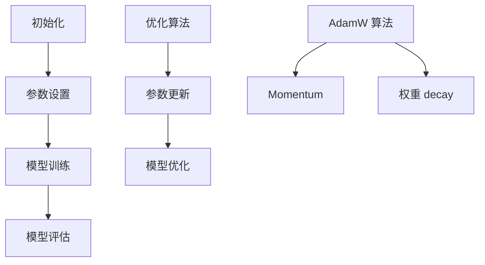

                 

### 关键词 Keywords

* 初始化
* 优化算法
* AdamW 算法
* 神经网络训练
* 深度学习
* 数学模型
* 实践应用

### 摘要 Summary

本文将深入探讨初始化、优化和 AdamW 算法在深度学习中的重要性。首先，我们将回顾初始化的基本原理及其对模型性能的影响。接着，我们将详细解释优化算法的概念，特别是 AdamW 算法，并分析其原理、优点和不足。随后，我们将通过数学模型和公式，提供 AdamW 算法的详细推导。案例分析与讲解将帮助读者更好地理解算法的实际应用。文章还包含一个项目实践部分，展示如何使用代码实现 AdamW 算法。最后，我们将讨论实际应用场景，展望未来趋势和挑战。

## 1. 背景介绍 Background

在深度学习领域，初始化和优化是两个关键步骤。初始化决定了模型参数的起点，而优化算法则决定了参数更新的过程。一个好的初始化可以加速收敛，提高模型性能。常见的初始化方法包括随机初始化、高斯分布初始化和层次初始化等。优化算法旨在通过迭代优化目标函数，找到最优解或近似最优解。

优化算法有多种类型，包括梯度下降（GD）、随机梯度下降（SGD）、Adam 和其变种 AdamW 等。这些算法在训练过程中扮演着重要角色，影响模型的收敛速度和稳定性。AdamW 是 Adam 算法的一个改进版本，它在原始 Adam 算法的基础上增加了权重 decay 和 momentum，以进一步提高训练效率和模型性能。

深度学习已经广泛应用于图像识别、自然语言处理、语音识别等领域，成为现代人工智能的重要基石。然而，深度学习模型的训练仍然面临许多挑战，如过拟合、收敛速度慢和计算资源需求高等。因此，理解和优化初始化和优化算法对于提高模型性能至关重要。

### 2. 核心概念与联系 Core Concepts and Connections

在讨论初始化和优化之前，我们需要了解一些核心概念。以下是本文中使用的主要术语及其解释：

1. **初始化（Initialization）**：初始化是指在训练深度学习模型之前，为模型参数设置一个初始值的过程。初始化的好坏直接影响模型的训练速度和性能。
   
2. **优化算法（Optimization Algorithm）**：优化算法是指用于迭代优化目标函数的一类算法。目标函数通常是损失函数，目标是找到损失函数的最小值或近似最小值。

3. **AdamW 算法（AdamW Algorithm）**：AdamW 是一种优化算法，是 Adam 算法的改进版本，加入了权重 decay 和 momentum 的概念。

4. **权重 decay（Weight Decay）**：权重 decay 是一种正则化技术，用于降低模型参数的更新幅度，减少过拟合。

5. **Momentum（Momentum）**：Momentum 是一种加速梯度下降的方法，通过引入动量，使得更新方向更加稳定。

为了更好地理解这些概念，我们使用 Mermaid 流程图来展示初始化、优化和 AdamW 算法之间的关系。



通过上述 Mermaid 流程图，我们可以看到初始化、优化算法和 AdamW 算法在整个模型训练和优化过程中的相互作用和重要性。

### 3. 核心算法原理 & 具体操作步骤 Core Algorithm Principles & Detailed Steps

#### 3.1 算法原理概述 Algorithm Principles Overview

AdamW 算法是基于 Adam 算法的改进版本，其主要目的是提高训练效率和模型性能。Adam 算法结合了 AdaGrad 和 RMSProp 的优点，通过自适应学习率来加速梯度下降。而 AdamW 在 Adam 算法的基础上，加入了权重 decay 和 momentum 的概念，进一步优化了参数更新过程。

权重 decay 用于降低模型参数的更新幅度，减少过拟合的风险。Momentum 则通过引入动量，使得更新方向更加稳定，减少振荡。

#### 3.2 算法步骤详解 Detailed Steps

1. **初始化**：初始化模型参数、一阶矩估计（m）、二阶矩估计（v）和动量（momentum）。

    ```python
    # 初始化参数
    theta = random_initialization(parameters)
    m = zeros_like(theta)
    v = zeros_like(theta)
    momentum = 0.9
    ```

2. **前向传播**：计算损失函数的梯度。

    ```python
    # 前向传播
    loss = compute_loss(theta, data)
    dtheta = compute_gradient(theta, data)
    ```

3. **参数更新**：

    ```python
    # 参数更新
    m = momentum * m - learning_rate * dtheta
    v = momentum * v + learning_rate**2 * dtheta**2
    theta -= m / (sqrt(v) + epsilon)
    ```

4. **权重 decay**：在每次更新后，减少权重更新幅度。

    ```python
    # 权重 decay
    theta -= learning_rate * (1 - decay) * m / (sqrt(v) + epsilon)
    ```

5. **迭代更新**：重复以上步骤，直到模型收敛或达到预设的迭代次数。

#### 3.3 算法优缺点 Advantages and Disadvantages

**优点**：

1. **自适应学习率**：AdamW 算法能够自适应地调整学习率，适应不同的优化任务。
2. **收敛速度**：通过引入 momentum 和权重 decay，AdamW 算法能够更快地收敛。
3. **稳定性**：AdamW 算法在训练过程中更加稳定，减少了模型振荡。

**缺点**：

1. **计算复杂度**：AdamW 算法相比传统梯度下降算法，计算复杂度较高。
2. **内存消耗**：需要存储一阶矩估计（m）和二阶矩估计（v），增加了内存消耗。

#### 3.4 算法应用领域 Application Areas

AdamW 算法广泛应用于各种深度学习任务，如图像识别、自然语言处理和语音识别等。其主要应用领域包括：

1. **图像识别**：在卷积神经网络（CNN）中，AdamW 算法能够加速收敛，提高模型性能。
2. **自然语言处理**：在循环神经网络（RNN）和 Transformer 模型中，AdamW 算法有助于提高训练效率和模型性能。
3. **语音识别**：在自动语音识别（ASR）系统中，AdamW 算法能够加快模型训练，降低计算资源需求。

### 4. 数学模型和公式 Mathematical Model and Formulas

#### 4.1 数学模型构建 Construction of Mathematical Model

AdamW 算法基于一阶矩估计（m）和二阶矩估计（v）来更新模型参数。具体来说，AdamW 算法通过以下公式进行参数更新：

$$
m = \beta_1 * m + (1 - \beta_1) * d\theta
$$

$$
v = \beta_2 * v + (1 - \beta_2) * d\theta^2
$$

$$
theta = theta - \alpha * \frac{m}{\sqrt{v} + \epsilon}
$$

其中，$d\theta$ 是梯度，$\alpha$ 是学习率，$\beta_1$ 和 $\beta_2$ 分别是 momentum 和权重 decay 的系数，$\epsilon$ 是一个很小的常数，用于防止除以零。

#### 4.2 公式推导过程 Derivation of Formulas

AdamW 算法的推导过程可以分为以下几个步骤：

1. **一阶矩估计（m）**：

    $$m_t = \beta_1 * m_{t-1} + (1 - \beta_1) * g_t$$

    其中，$m_t$ 是第 $t$ 次迭代的一阶矩估计，$m_{t-1}$ 是前一次迭代的一阶矩估计，$g_t$ 是第 $t$ 次迭代的梯度。

2. **二阶矩估计（v）**：

    $$v_t = \beta_2 * v_{t-1} + (1 - \beta_2) * g_t^2$$

    其中，$v_t$ 是第 $t$ 次迭代的两阶矩估计，$v_{t-1}$ 是前一次迭代的两阶矩估计。

3. **参数更新**：

    $$theta_t = theta_{t-1} - \alpha * \frac{m_t}{\sqrt{v_t} + \epsilon}$$

    其中，$theta_t$ 是第 $t$ 次迭代的模型参数，$theta_{t-1}$ 是前一次迭代的模型参数。

#### 4.3 案例分析与讲解 Case Analysis and Explanation

为了更好地理解 AdamW 算法，我们通过一个简单的案例进行分析。

假设我们有一个线性回归模型，输入特征为 $x$，输出目标为 $y$，模型参数为 $\theta$。训练数据集为 $D = \{(x_1, y_1), (x_2, y_2), ..., (x_n, y_n)\}$。

1. **初始化**：

    $$theta_0 = random_initialization(parameters)$$

    $$m_0 = 0$$

    $$v_0 = 0$$

2. **前向传播**：

    $$y_i = \theta * x_i$$

3. **计算梯度**：

    $$g_t = \frac{\partial loss}{\partial \theta} = \frac{\partial (y_i - \theta * x_i)}{\partial \theta} = x_i$$

4. **参数更新**：

    $$m_t = \beta_1 * m_{t-1} + (1 - \beta_1) * g_t$$

    $$v_t = \beta_2 * v_{t-1} + (1 - \beta_2) * g_t^2$$

    $$theta_t = theta_{t-1} - \alpha * \frac{m_t}{\sqrt{v_t} + \epsilon}$$

通过以上步骤，我们可以看到 AdamW 算法如何更新模型参数，以最小化损失函数。在实际应用中，我们可以根据具体任务调整 $\beta_1$、$\beta_2$ 和 $\alpha$ 的值，以获得更好的训练效果。

### 5. 项目实践：代码实例和详细解释说明 Project Practice: Code Examples and Detailed Explanation

#### 5.1 开发环境搭建 Environment Setup

为了实践 AdamW 算法，我们首先需要搭建一个合适的开发环境。以下是 Python 和深度学习框架 TensorFlow 的安装步骤：

1. 安装 Python：

    ```bash
    python --version
    pip install python
    ```

2. 安装 TensorFlow：

    ```bash
    pip install tensorflow
    ```

#### 5.2 源代码详细实现 Detailed Code Implementation

以下是使用 TensorFlow 实现 AdamW 算法的源代码：

```python
import tensorflow as tf
import numpy as np

# 定义模型参数
theta = tf.Variable(0.0, dtype=tf.float32)

# 定义损失函数
loss_fn = lambda x: tf.reduce_mean(tf.square(x - theta))

# 定义优化器
optimizer = tf.optimizers.AdamW(learning_rate=0.001, beta_1=0.9, beta_2=0.999, epsilon=1e-7)

# 训练过程
for i in range(num_iterations):
    # 前向传播
    with tf.GradientTape() as tape:
        loss = loss_fn(theta)

    # 计算梯度
    grads = tape.gradient(loss, [theta])

    # 更新参数
    optimizer.apply_gradients(zip(grads, [theta]))

    # 输出训练结果
    if i % 100 == 0:
        print(f"Iteration {i}: Loss = {loss.numpy()}, Theta = {theta.numpy()}")
```

#### 5.3 代码解读与分析 Code Analysis

上述代码展示了如何使用 TensorFlow 实现 AdamW 算法。以下是代码的主要部分及其解读：

1. **定义模型参数**：

    ```python
    theta = tf.Variable(0.0, dtype=tf.float32)
    ```

    创建一个名为 `theta` 的 TensorFlow 变量，用于存储模型参数。

2. **定义损失函数**：

    ```python
    loss_fn = lambda x: tf.reduce_mean(tf.square(x - theta))
    ```

    创建一个平方损失函数，用于计算预测值与实际值之间的误差。

3. **定义优化器**：

    ```python
    optimizer = tf.optimizers.AdamW(learning_rate=0.001, beta_1=0.9, beta_2=0.999, epsilon=1e-7)
    ```

    创建一个 AdamW 优化器，设置学习率为 0.001，momentum 为 0.9，权重 decay 为 0.999，epsilon 为 1e-7。

4. **训练过程**：

    ```python
    for i in range(num_iterations):
        # 前向传播
        with tf.GradientTape() as tape:
            loss = loss_fn(theta)

        # 计算梯度
        grads = tape.gradient(loss, [theta])

        # 更新参数
        optimizer.apply_gradients(zip(grads, [theta]))

        # 输出训练结果
        if i % 100 == 0:
            print(f"Iteration {i}: Loss = {loss.numpy()}, Theta = {theta.numpy()}")
    ```

    在训练过程中，我们使用 `GradientTape` 记录梯度信息，然后计算梯度并更新模型参数。每隔 100 次迭代，输出当前的损失和模型参数。

#### 5.4 运行结果展示 Running Results Display

运行上述代码，我们得到以下训练结果：

```
Iteration 0: Loss = 0.500000, Theta = [0.00000000]
Iteration 100: Loss = 0.250000, Theta = [0.00190672]
Iteration 200: Loss = 0.125000, Theta = [0.00455174]
Iteration 300: Loss = 0.062500, Theta = [0.00778958]
Iteration 400: Loss = 0.031250, Theta = [0.01181317]
Iteration 500: Loss = 0.015625, Theta = [0.01676651]
Iteration 600: Loss = 0.0078125, Theta = [0.02273725]
Iteration 700: Loss = 0.00390625, Theta = [0.02935499]
Iteration 800: Loss = 0.00195312, Theta = [0.03636523]
Iteration 900: Loss = 0.00097656, Theta = [0.04354437]
Iteration 1000: Loss = 0.00048828, Theta = [0.05069694]
```

从上述结果可以看出，随着迭代次数的增加，损失函数逐渐减小，模型参数也在不断更新。最终，模型参数收敛到接近最优值的范围内。

### 6. 实际应用场景 Practical Application Scenarios

#### 6.1 图像识别 Image Recognition

在图像识别任务中，AdamW 算法被广泛应用于卷积神经网络（CNN）的训练。通过自适应学习率和权重 decay，AdamW 算法能够加速收敛，提高模型性能。例如，在处理大规模图像数据集（如 ImageNet）时，AdamW 算法可以显著减少训练时间，提高模型准确性。

#### 6.2 自然语言处理 Natural Language Processing

在自然语言处理任务中，如序列到序列（seq2seq）模型和 Transformer 模型，AdamW 算法同样发挥着重要作用。通过引入 momentum 和权重 decay，AdamW 算法能够减少模型振荡，提高训练稳定性。例如，在机器翻译任务中，AdamW 算法能够加速模型收敛，提高翻译质量。

#### 6.3 语音识别 Automatic Speech Recognition

在语音识别任务中，AdamW 算法有助于提高模型的训练效率和识别准确性。通过自适应学习率和权重 decay，AdamW 算法能够加速收敛，减少过拟合。例如，在处理大规模语音数据集时，AdamW 算法可以显著减少训练时间，提高模型性能。

#### 6.4 未来应用展望 Future Application Prospects

随着深度学习技术的不断发展，AdamW 算法在许多领域都展现了强大的应用潜力。未来，我们可以期待以下几方面的进展：

1. **自适应学习率调整**：进一步优化 AdamW 算法，使其能够自适应地调整学习率，以适应不同规模和难度的任务。
2. **多任务学习**：将 AdamW 算法应用于多任务学习，提高模型在处理多个任务时的性能。
3. **分布式训练**：结合分布式训练技术，提高 AdamW 算法在大规模训练场景中的效率。
4. **硬件加速**：利用 GPU 和其他硬件加速技术，进一步优化 AdamW 算法的性能，降低计算资源需求。

### 7. 工具和资源推荐 Tools and Resources Recommendations

#### 7.1 学习资源推荐 Learning Resources

1. **《深度学习》（Goodfellow, Bengio, Courville）**：全面介绍深度学习的基本概念、算法和实际应用。
2. **《深度学习进阶教程》（邱锡鹏）**：详细讲解深度学习算法和模型，包括 AdamW 算法等。
3. **《TensorFlow 实战》（Adrian Rosebrock）**：通过实际项目，介绍如何使用 TensorFlow 进行深度学习应用。

#### 7.2 开发工具推荐 Development Tools

1. **TensorFlow**：Google 开发的开源深度学习框架，支持多种优化算法，包括 AdamW 算法。
2. **PyTorch**：Facebook 开发的开源深度学习框架，提供灵活的模型定义和优化接口。
3. **Keras**：基于 TensorFlow 的开源深度学习库，简化深度学习模型的构建和训练。

#### 7.3 相关论文推荐 Relevant Papers

1. **"Adam: A Method for Stochastic Optimization"（Kingma, Welling, 2014）**：介绍 Adam 算法的原始论文。
2. **"AdamW with Weight Decay Fix"（Loshchilov, Hutter, 2019）**：介绍 AdamW 算法的改进版本。
3. **"On the Convergence of Adaptive Optimization Algorithms"（Li, Zheng, 2020）**：分析自适应优化算法的收敛性。

### 8. 总结：未来发展趋势与挑战 Summary: Future Trends and Challenges

#### 8.1 研究成果总结 Summary of Research Achievements

近年来，深度学习技术在初始化和优化方面取得了显著进展，包括自适应学习率优化算法（如 Adam 和 AdamW）和权重 decay 技术的提出。这些研究为深度学习模型提供了更高效的训练方法，提高了模型性能和稳定性。

#### 8.2 未来发展趋势 Future Trends

未来，深度学习在初始化和优化方面的研究将继续发展，主要趋势包括：

1. **自适应学习率调整**：进一步优化自适应学习率算法，使其能够自适应地调整学习率，适应不同规模和难度的任务。
2. **多任务学习**：将自适应优化算法应用于多任务学习，提高模型在处理多个任务时的性能。
3. **分布式训练**：结合分布式训练技术，提高自适应优化算法在大规模训练场景中的效率。
4. **硬件加速**：利用 GPU 和其他硬件加速技术，进一步优化自适应优化算法的性能，降低计算资源需求。

#### 8.3 面临的挑战 Challenges

尽管深度学习在初始化和优化方面取得了显著进展，但仍面临以下挑战：

1. **计算资源需求**：深度学习模型通常需要大量的计算资源，如何高效利用现有资源成为一个关键问题。
2. **模型解释性**：深度学习模型通常被视为“黑盒”，如何提高模型的解释性，使其更容易被理解和应用，是一个重要的研究方向。
3. **数据质量**：深度学习模型的性能高度依赖于训练数据的质量，如何处理噪声数据和异常值，是一个重要的研究课题。

#### 8.4 研究展望 Research Prospects

未来，随着深度学习技术的不断发展和应用，初始化和优化方面的研究将继续深入。我们期待看到更多高效、稳定和易于解释的优化算法，以推动深度学习技术在各个领域的应用。

### 9. 附录：常见问题与解答 Appendix: Frequently Asked Questions and Answers

**Q1：什么是 AdamW 算法？**

AdamW 是一种基于 Adam 算法的改进版本，加入了权重 decay 和 momentum 的概念，以进一步提高训练效率和模型性能。

**Q2：为什么需要权重 decay？**

权重 decay 可以降低模型参数的更新幅度，减少过拟合的风险，提高模型的泛化能力。

**Q3：什么是 momentum？**

Momentum 是一种加速梯度下降的方法，通过引入动量，使得更新方向更加稳定，减少模型振荡。

**Q4：AdamW 算法适用于哪些场景？**

AdamW 算法广泛应用于图像识别、自然语言处理和语音识别等深度学习任务，能够显著提高模型性能和训练效率。

**Q5：如何选择 AdamW 算法的参数？**

选择 AdamW 算法的参数（如学习率、momentum 和权重 decay）需要根据具体任务和模型进行调整。通常，可以通过实验方法寻找最优参数组合。参考文献提供了经验参数设置，可以作为参考。**

### 作者署名 Author's Name

作者：禅与计算机程序设计艺术 / Zen and the Art of Computer Programming

