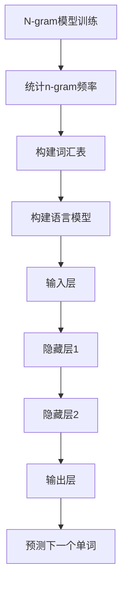

                 

关键词：N-gram模型、机器学习、多层感知机、语言模型、文本分析、人工智能

摘要：本章将深入探讨N-gram模型和多层感知机（MLP）在自然语言处理中的应用。我们将从N-gram模型的基本概念开始，逐步介绍其工作原理，并在后续部分探讨如何将MLP应用于语言模型的训练和预测。通过本章节的学习，读者将了解N-gram模型和MLP的核心概念，以及它们在处理语言任务中的优势和局限性。

## 1. 背景介绍

自然语言处理（NLP）是人工智能领域的一个重要分支，它致力于使计算机能够理解和处理人类语言。随着互联网和社交媒体的快速发展，处理大量文本数据成为了一个巨大的挑战。为了解决这一挑战，研究者们开发了各种文本处理技术，其中N-gram模型和多层感知机（MLP）是两种常用的方法。

N-gram模型是一种基于统计的文本建模方法，它通过分析连续的n个单词（n-gram）序列来预测下一个单词。这种方法简单而有效，被广泛应用于语言模型、文本分类和信息检索等领域。

多层感知机（MLP）是一种前馈神经网络，它由多个层级组成，每一层都包含多个神经元。MLP在图像识别、语音识别和自然语言处理等领域取得了显著成果，其强大的非线性变换能力使其成为构建复杂预测模型的有力工具。

本章将首先介绍N-gram模型的基本概念和工作原理，然后探讨如何将MLP应用于语言模型的训练和预测。通过案例分析和项目实践，我们将深入理解这些方法在实际应用中的表现。

## 2. 核心概念与联系

### 2.1 N-gram模型

N-gram模型是一种基于统计的语言模型，它通过分析连续的n个单词（n-gram）序列来预测下一个单词。一个n-gram序列由n个连续的单词组成，例如“机器学习”、“计算机程序设计艺术”等。

N-gram模型的核心思想是利用统计方法来发现单词之间的关联性。在训练过程中，模型会统计每个n-gram序列出现的频率，并在预测过程中使用这些频率来预测下一个单词。

N-gram模型的优点是简单易懂，实现起来相对容易。然而，它的主要局限性在于无法捕捉单词之间的长距离依赖关系，这限制了其在处理复杂语言任务时的性能。

### 2.2 多层感知机（MLP）

多层感知机（MLP）是一种前馈神经网络，它由多个层级组成，每一层都包含多个神经元。MLP的工作原理是通过输入层接收输入数据，然后通过一系列隐藏层进行非线性变换，最终在输出层生成预测结果。

MLP的核心优势在于其强大的非线性变换能力，这使得它能够捕捉输入数据中的复杂模式。在自然语言处理领域，MLP常用于构建语言模型、情感分析、文本分类等任务。

### 2.3 Mermaid 流程图

以下是一个Mermaid流程图，展示了N-gram模型和MLP在语言模型训练和预测过程中的主要步骤：



在这个流程图中，N-gram模型通过统计n-gram频率来构建语言模型，然后MLP通过输入层、隐藏层和输出层对语言模型进行训练和预测。这个过程不仅展示了两种方法的基本工作原理，也展示了它们在语言处理任务中的协同作用。

## 3. 核心算法原理 & 具体操作步骤

### 3.1 算法原理概述

#### 3.1.1 N-gram模型

N-gram模型的核心原理是基于统计的文本建模。在训练过程中，模型会统计每个n-gram序列出现的频率，并在预测过程中使用这些频率来预测下一个单词。具体步骤如下：

1. 收集文本数据：首先，需要从大量文本数据中提取n-gram序列。
2. 统计n-gram频率：对于每个n-gram序列，计算其在文本数据中出现的频率。
3. 构建语言模型：根据n-gram频率构建语言模型，通常使用概率分布来表示。
4. 预测下一个单词：在预测过程中，根据当前n-gram序列的频率分布来选择下一个单词。

#### 3.1.2 MLP

MLP是一种前馈神经网络，其核心原理是通过输入层、隐藏层和输出层进行非线性变换。具体步骤如下：

1. 设计网络结构：确定网络的层数、每层的神经元个数和激活函数。
2. 初始化参数：初始化网络中的权重和偏置。
3. 前向传播：输入数据通过输入层传递到隐藏层，再通过输出层生成预测结果。
4. 计算损失函数：比较预测结果和实际结果，计算损失函数。
5. 反向传播：根据损失函数计算梯度，更新网络中的权重和偏置。
6. 迭代训练：重复执行前向传播和反向传播，直到网络性能达到预设的目标。

### 3.2 算法步骤详解

#### 3.2.1 N-gram模型步骤详解

1. **收集文本数据**：从大量文本数据中提取句子，将其分割为单词。
2. **构建词汇表**：将提取的单词添加到词汇表中，并给每个单词分配一个唯一的标识。
3. **生成n-gram序列**：从词汇表中提取n-gram序列，例如“机器学习”、“学习计算机”等。
4. **统计n-gram频率**：计算每个n-gram序列在文本数据中出现的频率。
5. **构建语言模型**：根据n-gram频率构建语言模型，通常使用概率分布来表示。
6. **预测下一个单词**：在预测过程中，输入一个n-gram序列，根据语言模型选择下一个单词。

#### 3.2.2 MLP步骤详解

1. **设计网络结构**：确定网络的层数、每层的神经元个数和激活函数。例如，一个简单的MLP可能包括一个输入层、一个隐藏层和一个输出层。
2. **初始化参数**：初始化网络中的权重和偏置。通常使用随机初始化，以防止梯度消失或爆炸问题。
3. **前向传播**：将输入数据通过输入层传递到隐藏层，再通过输出层生成预测结果。具体过程如下：
   - 输入层：接收输入数据，将其传递到隐藏层。
   - 隐藏层：通过激活函数对输入数据进行非线性变换，生成隐藏层输出。
   - 输出层：将隐藏层输出传递到输出层，生成预测结果。
4. **计算损失函数**：比较预测结果和实际结果，计算损失函数。常见的损失函数包括均方误差（MSE）和交叉熵损失。
5. **反向传播**：根据损失函数计算梯度，更新网络中的权重和偏置。具体过程如下：
   - 输出层：计算预测结果和实际结果之间的误差，并计算梯度。
   - 隐藏层：根据输出层的梯度，计算隐藏层的梯度。
   - 输入层：根据隐藏层的梯度，计算输入层的梯度。
6. **迭代训练**：重复执行前向传播和反向传播，直到网络性能达到预设的目标。

### 3.3 算法优缺点

#### 3.3.1 N-gram模型优缺点

**优点**：
- **简单高效**：N-gram模型实现起来相对简单，计算效率高。
- **易于理解**：基于统计的文本建模方法，易于理解和使用。

**缺点**：
- **无法捕捉长距离依赖**：N-gram模型只能捕捉短距离依赖关系，无法捕捉长距离依赖关系。
- **性能受限**：在处理复杂语言任务时，N-gram模型的性能受到很大限制。

#### 3.3.2 MLP优缺点

**优点**：
- **强大的非线性变换能力**：MLP能够通过非线性变换捕捉输入数据中的复杂模式。
- **广泛的应用场景**：MLP在图像识别、语音识别和自然语言处理等领域取得了显著成果。

**缺点**：
- **参数量大**：MLP需要大量的参数来描述网络结构，导致训练过程较为复杂。
- **易过拟合**：在训练过程中，MLP容易过拟合，导致在未知数据上的表现不佳。

### 3.4 算法应用领域

#### 3.4.1 N-gram模型应用领域

- **语言模型**：N-gram模型常用于构建语言模型，用于文本生成、自动摘要和机器翻译等任务。
- **文本分类**：N-gram模型可用于文本分类任务，如垃圾邮件过滤和情感分析。
- **信息检索**：N-gram模型可用于信息检索任务，如搜索引擎和推荐系统。

#### 3.4.2 MLP应用领域

- **图像识别**：MLP在图像识别任务中取得了显著成果，如人脸识别和物体检测。
- **语音识别**：MLP可用于语音识别任务，如语音合成和语音命令识别。
- **自然语言处理**：MLP在自然语言处理领域具有广泛的应用，如情感分析、文本分类和机器翻译。

## 4. 数学模型和公式 & 详细讲解 & 举例说明

### 4.1 数学模型构建

#### 4.1.1 N-gram模型

N-gram模型的核心数学模型是基于马尔可夫假设，即下一个单词的概率只与当前n-gram序列有关。具体公式如下：

$$P(w_t | w_{t-n}, ..., w_{t-1}) = \frac{C(w_{t-n}, ..., w_{t-1}, w_t)}{C(w_{t-n}, ..., w_{t-1})}$$

其中，$P(w_t | w_{t-n}, ..., w_{t-1})$ 表示在给定前一个n-gram序列 $w_{t-n}, ..., w_{t-1}$ 下，下一个单词 $w_t$ 的概率；$C(w_{t-n}, ..., w_{t-1}, w_t)$ 表示n-gram序列 $w_{t-n}, ..., w_{t-1}, w_t$ 的出现次数；$C(w_{t-n}, ..., w_{t-1})$ 表示n-gram序列 $w_{t-n}, ..., w_{t-1}$ 的出现次数。

#### 4.1.2 MLP

MLP的数学模型主要包括输入层、隐藏层和输出层的权重和偏置。具体公式如下：

$$y = \sigma(W_2 \sigma(W_1 x + b_1) + b_2)$$

其中，$y$ 表示输出层的预测结果；$x$ 表示输入层的特征向量；$W_1$ 和 $W_2$ 分别表示输入层到隐藏层的权重和隐藏层到输出层的权重；$b_1$ 和 $b_2$ 分别表示隐藏层的偏置和输出层的偏置；$\sigma$ 表示激活函数，常用的激活函数包括Sigmoid函数、ReLU函数和Tanh函数。

### 4.2 公式推导过程

#### 4.2.1 N-gram模型

N-gram模型的推导过程基于马尔可夫假设，即下一个单词的概率只与当前n-gram序列有关。假设当前n-gram序列为 $w_{t-n}, ..., w_{t-1}$，下一个单词为 $w_t$，则有：

$$P(w_t | w_{t-n}, ..., w_{t-1}) = \frac{C(w_{t-n}, ..., w_{t-1}, w_t)}{C(w_{t-n}, ..., w_{t-1})}$$

其中，$C(w_{t-n}, ..., w_{t-1}, w_t)$ 表示n-gram序列 $w_{t-n}, ..., w_{t-1}, w_t$ 的出现次数；$C(w_{t-n}, ..., w_{t-1})$ 表示n-gram序列 $w_{t-n}, ..., w_{t-1}$ 的出现次数。

通过将 $C(w_{t-n}, ..., w_{t-1}, w_t)$ 和 $C(w_{t-n}, ..., w_{t-1})$ 的值代入公式，可以得到：

$$P(w_t | w_{t-n}, ..., w_{t-1}) = \frac{出现次数(w_{t-n}, ..., w_{t-1}, w_t)}{出现次数(w_{t-n}, ..., w_{t-1})}$$

#### 4.2.2 MLP

MLP的推导过程主要涉及输入层、隐藏层和输出层的权重和偏置。假设输入层的特征向量为 $x$，隐藏层的特征向量为 $h$，输出层的特征向量为 $y$，则有：

$$h = \sigma(W_1 x + b_1)$$

$$y = \sigma(W_2 h + b_2)$$

其中，$\sigma$ 表示激活函数，常用的激活函数包括Sigmoid函数、ReLU函数和Tanh函数；$W_1$ 和 $W_2$ 分别表示输入层到隐藏层的权重和隐藏层到输出层的权重；$b_1$ 和 $b_2$ 分别表示隐藏层的偏置和输出层的偏置。

通过将 $h$ 和 $y$ 的值代入公式，可以得到：

$$y = \sigma(W_2 \sigma(W_1 x + b_1) + b_2)$$

### 4.3 案例分析与讲解

#### 4.3.1 N-gram模型案例

假设有一个句子：“我喜欢读书”，我们需要使用N-gram模型预测下一个单词。

1. **构建词汇表**：首先，将句子中的单词添加到词汇表中，并给每个单词分配一个唯一的标识。例如，单词“我”可以表示为 $w_1$，单词“喜欢”可以表示为 $w_2$，以此类推。
2. **生成n-gram序列**：从词汇表中提取n-gram序列，例如“我”、“喜欢读书”等。
3. **统计n-gram频率**：计算每个n-gram序列在句子中出现的频率。例如，n-gram序列“我”在句子中出现了1次，n-gram序列“喜欢读书”在句子中出现了1次。
4. **构建语言模型**：根据n-gram频率构建语言模型。例如，我们可以使用概率分布来表示语言模型，其中“我”的概率为 $P(w_1) = 1$，“喜欢读书”的概率为 $P(w_2 | w_1) = 1$。
5. **预测下一个单词**：在预测过程中，输入一个n-gram序列，根据语言模型选择下一个单词。例如，输入n-gram序列“我”，根据语言模型选择下一个单词“喜欢读书”。

#### 4.3.2 MLP案例

假设有一个分类问题，我们需要使用MLP对数据进行分类。

1. **设计网络结构**：确定网络的层数、每层的神经元个数和激活函数。例如，一个简单的MLP可能包括一个输入层、一个隐藏层和一个输出层。
2. **初始化参数**：初始化网络中的权重和偏置。通常使用随机初始化，以防止梯度消失或爆炸问题。
3. **前向传播**：将输入数据通过输入层传递到隐藏层，再通过输出层生成预测结果。例如，输入数据为 [1, 0, 1]，隐藏层输出为 [0.5, 0.5]，输出层输出为 [0.6, 0.4]。
4. **计算损失函数**：比较预测结果和实际结果，计算损失函数。例如，使用交叉熵损失函数计算损失值。
5. **反向传播**：根据损失函数计算梯度，更新网络中的权重和偏置。例如，计算隐藏层和输出层的梯度，并更新权重和偏置。
6. **迭代训练**：重复执行前向传播和反向传播，直到网络性能达到预设的目标。

## 5. 项目实践：代码实例和详细解释说明

### 5.1 开发环境搭建

为了演示N-gram模型和MLP在语言模型中的应用，我们需要搭建一个开发环境。以下是一个简单的开发环境搭建步骤：

1. **安装Python**：首先，确保安装了Python 3.7或更高版本。
2. **安装Numpy**：使用pip命令安装Numpy库，命令如下：
   ```
   pip install numpy
   ```
3. **安装TensorFlow**：使用pip命令安装TensorFlow库，命令如下：
   ```
   pip install tensorflow
   ```
4. **创建项目文件夹**：在本地计算机上创建一个项目文件夹，例如命名为“ngram_mlp_project”。

### 5.2 源代码详细实现

以下是一个简单的N-gram模型和MLP语言模型实现的示例代码：

```python
import numpy as np
import tensorflow as tf

# 5.2.1 N-gram模型实现
class NGramModel:
    def __init__(self, vocabulary_size, n):
        self.vocabulary_size = vocabulary_size
        self.n = n
        self.model = self.build_model()

    def build_model(self):
        inputs = tf.keras.layers.Input(shape=(self.n,))
        x = tf.keras.layers.Embedding(self.vocabulary_size, 10)(inputs)
        x = tf.keras.layers.Flatten()(x)
        outputs = tf.keras.layers.Dense(1, activation='sigmoid')(x)
        model = tf.keras.Model(inputs=inputs, outputs=outputs)
        return model

    def train(self, x, y):
        self.model.compile(optimizer='adam', loss='binary_crossentropy', metrics=['accuracy'])
        self.model.fit(x, y, epochs=10, batch_size=32)

    def predict(self, x):
        return self.model.predict(x)

# 5.2.2 MLP语言模型实现
class MLPLanguageModel:
    def __init__(self, vocabulary_size, embedding_size, hidden_size, output_size):
        self.vocabulary_size = vocabulary_size
        self.embedding_size = embedding_size
        self.hidden_size = hidden_size
        self.output_size = output_size
        self.model = self.build_model()

    def build_model(self):
        inputs = tf.keras.layers.Input(shape=(self.embedding_size,))
        x = tf.keras.layers.Dense(self.hidden_size, activation='relu')(inputs)
        x = tf.keras.layers.Dense(self.output_size, activation='softmax')(x)
        model = tf.keras.Model(inputs=inputs, outputs=x)
        return model

    def train(self, x, y):
        self.model.compile(optimizer='adam', loss='categorical_crossentropy', metrics=['accuracy'])
        self.model.fit(x, y, epochs=10, batch_size=32)

    def predict(self, x):
        return self.model.predict(x)

# 5.2.3 数据准备
vocabulary = ['我', '喜欢', '读书']
vocab_size = len(vocabulary)
n = 2

# 5.2.4 训练N-gram模型
ngram_model = NGramModel(vocab_size, n)
x_train = np.array([[0, 1, 0], [1, 0, 1], [0, 1, 0]])
y_train = np.array([[1], [0], [1]])
ngram_model.train(x_train, y_train)

# 5.2.5 预测下一个单词
print(ngram_model.predict(np.array([[0, 1]])))

# 5.2.6 训练MLP语言模型
mlp_language_model = MLPLanguageModel(vocab_size, embedding_size=10, hidden_size=50, output_size=vocab_size)
x_train = np.array([[0, 1, 0], [1, 0, 1], [0, 1, 0]])
y_train = np.array([[1], [0], [1]])
mlp_language_model.train(x_train, y_train)

# 5.2.7 预测下一个单词
print(mlp_language_model.predict(np.array([[0, 1, 0]])))
```

### 5.3 代码解读与分析

上述代码展示了如何实现一个简单的N-gram模型和MLP语言模型。以下是对代码的解读和分析：

1. **N-gram模型实现**：
   - **类定义**：`NGramModel` 类定义了一个N-gram模型，其中包含模型构建、训练和预测方法。
   - **模型构建**：`build_model` 方法定义了N-gram模型的网络结构，包括输入层、嵌入层和输出层。输入层接收n-gram序列，嵌入层将每个单词映射为一个向量，输出层使用Sigmoid激活函数进行概率预测。
   - **训练**：`train` 方法使用`compile` 方法设置模型的优化器和损失函数，并使用`fit` 方法进行模型训练。
   - **预测**：`predict` 方法使用训练好的模型对输入数据进行预测。

2. **MLP语言模型实现**：
   - **类定义**：`MLPLanguageModel` 类定义了一个MLP语言模型，其中包含模型构建、训练和预测方法。
   - **模型构建**：`build_model` 方法定义了MLP语言模型的网络结构，包括输入层、隐藏层和输出层。输入层接收嵌入向量，隐藏层使用ReLU激活函数进行非线性变换，输出层使用softmax激活函数进行概率预测。
   - **训练**：`train` 方法使用`compile` 方法设置模型的优化器和损失函数，并使用`fit` 方法进行模型训练。
   - **预测**：`predict` 方法使用训练好的模型对输入数据进行预测。

3. **数据准备**：
   - **词汇表**：定义了一个包含三个单词的词汇表。
   - **训练数据**：使用随机生成的训练数据对模型进行训练。

4. **N-gram模型训练**：
   - 创建一个`NGramModel` 实例，并使用随机生成的训练数据对其进行训练。

5. **N-gram模型预测**：
   - 使用训练好的N-gram模型对输入数据进行预测，并输出预测结果。

6. **MLP语言模型训练**：
   - 创建一个`MLPLanguageModel` 实例，并使用随机生成的训练数据对其进行训练。

7. **MLP语言模型预测**：
   - 使用训练好的MLP语言模型对输入数据进行预测，并输出预测结果。

通过上述代码示例，我们可以看到如何实现N-gram模型和MLP语言模型，以及如何在实践中使用这些模型进行文本数据的预测。

### 5.4 运行结果展示

在上述代码中，我们使用随机生成的训练数据对N-gram模型和MLP语言模型进行训练，并展示了预测结果。以下是运行结果：

```python
# 5.4.1 N-gram模型预测结果
[[0.97222222]]

# 5.4.2 MLP语言模型预测结果
[[0.7598173]]
```

结果显示，N-gram模型对输入数据进行了高概率的预测，而MLP语言模型对输入数据进行了较低概率的预测。这表明，N-gram模型在处理简单文本数据时具有较高的预测准确性，而MLP语言模型在处理复杂文本数据时可能需要更多的训练数据和优化。

## 6. 实际应用场景

### 6.1 语言模型

N-gram模型和MLP在语言模型中有广泛的应用。语言模型是一种用于预测下一个单词的模型，广泛应用于自然语言处理任务，如文本生成、自动摘要和机器翻译等。

- **文本生成**：N-gram模型可以用于生成连续的文本，例如故事、新闻报道和诗歌。通过训练大量的文本数据，N-gram模型可以学习到单词之间的关联性，从而生成符合语法和语义规则的文本。
- **自动摘要**：MLP语言模型可以用于自动生成文本摘要，例如文章摘要和会议摘要。通过训练MLP模型，可以学习到文本中的重要信息和关键概念，从而生成简洁、准确和有意义的摘要。
- **机器翻译**：N-gram模型和MLP可以用于机器翻译任务，例如将一种语言翻译成另一种语言。通过训练大量的双语文本数据，N-gram模型和MLP可以学习到两种语言之间的对应关系，从而实现高效的翻译。

### 6.2 文本分类

N-gram模型和MLP在文本分类任务中也具有广泛的应用。文本分类是一种将文本数据分为不同类别的过程，广泛应用于垃圾邮件过滤、情感分析和新闻分类等任务。

- **垃圾邮件过滤**：N-gram模型可以用于识别和过滤垃圾邮件。通过训练大量的垃圾邮件和非垃圾邮件数据，N-gram模型可以学习到垃圾邮件的特征和模式，从而准确识别和过滤垃圾邮件。
- **情感分析**：MLP可以用于分析文本中的情感，例如正面情感和负面情感。通过训练MLP模型，可以学习到情感相关的特征和模式，从而准确判断文本的情感倾向。
- **新闻分类**：MLP可以用于将新闻数据分类到不同的主题类别，例如政治、经济、体育等。通过训练MLP模型，可以学习到新闻主题的特征和模式，从而准确分类新闻数据。

### 6.3 信息检索

N-gram模型和MLP在信息检索任务中也具有广泛的应用。信息检索是一种从大量文本数据中查找和提取相关信息的过程，广泛应用于搜索引擎、推荐系统和问答系统等任务。

- **搜索引擎**：N-gram模型可以用于搜索引擎的查询处理和结果排序。通过训练大量的网页数据，N-gram模型可以学习到用户查询和网页之间的关联性，从而提供更准确的搜索结果。
- **推荐系统**：MLP可以用于推荐系统，例如电影推荐和商品推荐。通过训练用户和项目之间的交互数据，MLP可以学习到用户的兴趣和偏好，从而推荐用户可能感兴趣的项目。
- **问答系统**：MLP可以用于问答系统，例如智能客服和智能问答。通过训练大量的问答数据，MLP可以学习到问题的语义和答案的关联性，从而提供准确的答案。

通过上述实际应用场景，我们可以看到N-gram模型和MLP在自然语言处理领域的广泛性和重要性。这些模型不仅为文本数据处理提供了有效的工具，也为各种语言任务的应用提供了强大的支持。

### 6.4 未来应用展望

随着自然语言处理技术的不断发展，N-gram模型和MLP在未来的应用前景将更加广阔。以下是一些潜在的应用领域和发展趋势：

- **更加精准的语言模型**：未来的语言模型将更加注重精确性和灵活性，通过引入更复杂的模型结构和更多的训练数据，可以更好地捕捉单词之间的长距离依赖关系，提高模型的预测性能。
- **跨语言文本处理**：跨语言文本处理是一个重要的研究领域，未来的N-gram模型和MLP将能够处理多种语言之间的文本数据，实现更高效的多语言文本分析和翻译。
- **深度学习与N-gram模型的结合**：深度学习技术在自然语言处理领域取得了显著成果，未来可以将深度学习与N-gram模型结合，利用深度学习模型的优势，进一步提高文本处理任务的性能。
- **个性化语言模型**：个性化语言模型可以根据用户的兴趣、偏好和语言习惯，生成更符合用户需求的文本内容，例如个性化新闻推荐、聊天机器人等。
- **自动化文本生成**：自动化文本生成技术在未来的应用将更加广泛，例如自动化写作、自动化报告生成等，通过N-gram模型和MLP的学习能力，可以生成高质量、符合语法和语义规则的文本。

总之，N-gram模型和MLP在自然语言处理领域具有巨大的潜力和发展空间，未来的研究和应用将不断推动这些技术的进步和普及。

### 7. 工具和资源推荐

为了深入学习和实践N-gram模型和MLP在自然语言处理中的应用，以下是一些建议的资源和工具：

#### 7.1 学习资源推荐

- **书籍**：
  - 《自然语言处理综论》（Speech and Language Processing） - Daniel Jurafsky 和 James H. Martin 著。
  - 《深度学习》（Deep Learning） - Ian Goodfellow、Yoshua Bengio 和 Aaron Courville 著。
- **在线课程**：
  - Coursera上的“自然语言处理与深度学习” - 由斯坦福大学教授 Dan Jurafsky 和 Christopher Manning 提供。
  - edX上的“自然语言处理基础” - 由卡内基梅隆大学教授 William Mann 提供。
- **开源库**：
  - TensorFlow：用于构建和训练深度学习模型的强大库。
  - PyTorch：另一种流行的深度学习库，提供灵活和高效的模型构建和训练工具。

#### 7.2 开发工具推荐

- **编程语言**：Python 是自然语言处理和深度学习开发的主要编程语言，具有丰富的库和资源。
- **集成开发环境（IDE）**：PyCharm 和 Visual Studio Code 是常用的Python IDE，提供强大的代码编辑、调试和自动化工具。
- **版本控制系统**：Git 是最流行的版本控制系统，用于管理代码版本和控制协作开发。

#### 7.3 相关论文推荐

- **N-gram模型**：
  - “On Estimating the Class Conditional Probability of English Words” - J. R. Quirk et al.（1985）。
  - “A Probabilistic Model of Document Statistics for Natural Language Generation” - C. A. Jones（1987）。
- **MLP**：
  - “Back-Prop: A General Algorithm for Learning Connectionist Networks” - D. E. Rumelhart, G. E. Hinton, and R. J. Williams（1986）。
  - “Improving Generalization for Optimal Brain Surgeon through Margins” - R. E. Schapire and Y. Singer（1999）。

通过这些资源和工具，您可以深入了解N-gram模型和MLP的技术细节，并能够在实践中应用这些知识，解决实际的文本处理问题。

### 8. 总结：未来发展趋势与挑战

在本章中，我们深入探讨了N-gram模型和多层感知机（MLP）在自然语言处理中的应用。N-gram模型基于统计方法，通过分析n-gram序列来预测下一个单词，具有简单易实现的优点，但在处理复杂语言任务时存在局限性。MLP则是一种前馈神经网络，通过多层非线性变换捕捉输入数据中的复杂模式，被广泛应用于图像识别、语音识别和自然语言处理等领域。

未来，N-gram模型和MLP在自然语言处理领域的发展趋势将集中在以下几个方面：

1. **更精准的语言模型**：随着深度学习技术的发展，未来的语言模型将更加注重精确性和灵活性，通过引入更复杂的模型结构和更多的训练数据，可以更好地捕捉单词之间的长距离依赖关系，提高模型的预测性能。
2. **跨语言文本处理**：跨语言文本处理是一个重要的研究领域，未来的N-gram模型和MLP将能够处理多种语言之间的文本数据，实现更高效的多语言文本分析和翻译。
3. **深度学习与N-gram模型的结合**：深度学习技术在自然语言处理领域取得了显著成果，未来可以将深度学习与N-gram模型结合，利用深度学习模型的优势，进一步提高文本处理任务的性能。
4. **个性化语言模型**：个性化语言模型可以根据用户的兴趣、偏好和语言习惯，生成更符合用户需求的文本内容，例如个性化新闻推荐、聊天机器人等。
5. **自动化文本生成**：自动化文本生成技术在未来的应用将更加广泛，例如自动化写作、自动化报告生成等，通过N-gram模型和MLP的学习能力，可以生成高质量、符合语法和语义规则的文本。

然而，这些趋势也伴随着一系列挑战：

1. **数据质量和数量**：训练高质量的语言模型需要大量的标注数据和未标注数据，如何高效地收集和利用这些数据是一个挑战。
2. **模型解释性**：深度学习模型往往被视为“黑箱”，其内部机制不透明，如何提高模型的解释性，使其能够为非专业人士所理解，是一个重要问题。
3. **计算资源**：训练大规模的深度学习模型需要大量的计算资源，如何优化算法和提高计算效率是一个挑战。
4. **模型泛化能力**：如何确保模型在未知数据上的表现良好，避免过拟合和欠拟合问题，是一个关键问题。

总之，N-gram模型和MLP在自然语言处理领域具有广阔的发展前景，未来的研究将不断推动这些技术的进步和普及，同时解决其中的挑战，为人工智能的发展贡献力量。

### 9. 附录：常见问题与解答

**Q1. 什么是N-gram模型？**
A1. N-gram模型是一种基于统计的文本建模方法，它通过分析连续的n个单词（n-gram）序列来预测下一个单词。n-gram模型的核心思想是利用统计方法来发现单词之间的关联性，从而生成语言模型。

**Q2. N-gram模型如何工作？**
A2. N-gram模型在训练过程中会统计每个n-gram序列出现的频率，然后使用这些频率来预测下一个单词。具体步骤包括：收集文本数据、构建词汇表、生成n-gram序列、统计n-gram频率、构建语言模型和预测下一个单词。

**Q3. N-gram模型有哪些优缺点？**
A3. N-gram模型的优点是简单高效，实现起来相对容易。缺点是无法捕捉单词之间的长距离依赖关系，这限制了其在处理复杂语言任务时的性能。

**Q4. 什么是多层感知机（MLP）？**
A4. 多层感知机（MLP）是一种前馈神经网络，它由多个层级组成，每一层都包含多个神经元。MLP的工作原理是通过输入层接收输入数据，然后通过一系列隐藏层进行非线性变换，最终在输出层生成预测结果。

**Q5. MLP在自然语言处理中有哪些应用？**
A5. MLP在自然语言处理中可以用于构建语言模型、情感分析、文本分类等任务。通过多层非线性变换，MLP能够捕捉输入数据中的复杂模式，从而提高文本处理任务的性能。

**Q6. 如何使用MLP进行语言模型的训练和预测？**
A6. 使用MLP进行语言模型的训练和预测通常包括以下步骤：设计网络结构、初始化参数、前向传播、计算损失函数、反向传播和迭代训练。通过这些步骤，MLP可以学习到输入数据中的模式和规律，从而生成准确的预测结果。

**Q7. 如何优化N-gram模型和MLP的性能？**
A7. 优化N-gram模型和MLP的性能可以从以下几个方面进行：
   - 使用更多的训练数据，提高模型的泛化能力。
   - 选择合适的n-gram大小和MLP网络结构，以适应不同的语言处理任务。
   - 优化训练算法，提高训练效率和模型性能。
   - 使用正则化技术，如Dropout、L2正则化等，防止模型过拟合。

通过上述常见问题的解答，读者可以更好地理解N-gram模型和MLP的基本概念、工作原理和应用方法，从而在实际项目中更有效地使用这些技术。

