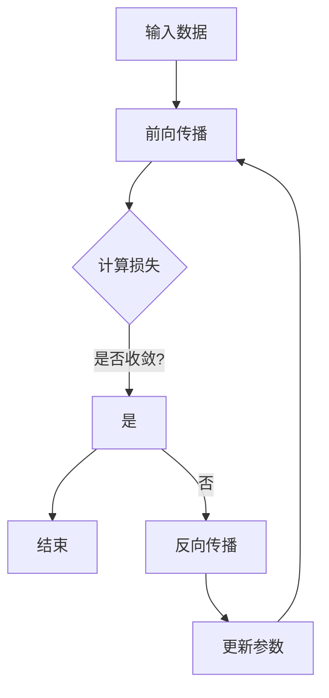
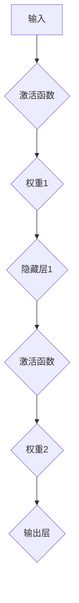

                 

关键词：机器学习、反向传播算法、神经网络、深度学习、梯度下降、算法原理、实践应用

> 摘要：本文将深入探讨机器学习中的反向传播算法，解析其原理与操作步骤，并通过实际案例展示其在深度学习中的应用，旨在为读者提供一个全面且易懂的机器学习算法指南。

## 1. 背景介绍

随着信息技术的飞速发展，机器学习（Machine Learning，ML）逐渐成为人工智能领域的研究热点。机器学习是一种使计算机系统能够从数据中学习并做出决策或预测的技术，而神经网络（Neural Networks，NN）则是实现这一目标的重要工具之一。反向传播（Backpropagation）算法是神经网络训练的核心，通过梯度下降（Gradient Descent）优化模型参数，使网络能够逐渐适应数据，提高预测准确性。

## 2. 核心概念与联系

### 2.1 机器学习的基本概念

机器学习主要分为监督学习（Supervised Learning）、无监督学习（Unsupervised Learning）和半监督学习（Semi-Supervised Learning）三种类型。其中，监督学习是最常用的方法，通过已标记的数据训练模型，使其能够对未知数据进行预测。

### 2.2 神经网络的结构

神经网络由多个层级组成，包括输入层（Input Layer）、隐藏层（Hidden Layers）和输出层（Output Layer）。每一层由多个神经元（Neurons）构成，神经元之间通过连接（Connections）进行信息传递。

### 2.3 反向传播算法的流程

反向传播算法主要包括以下步骤：

1. 前向传播：将输入数据传递到网络的输入层，经过隐藏层处理后，最终传递到输出层。
2. 计算损失函数：计算输出层实际输出与期望输出之间的差距，即损失函数（Loss Function）。
3. 反向传播：计算损失函数关于每个神经元权重的梯度，并通过梯度下降更新网络参数。
4. 重复以上步骤，直至网络收敛。

### 2.4 Mermaid 流程图



## 3. 核心算法原理 & 具体操作步骤

### 3.1 算法原理概述

反向传播算法基于梯度下降优化方法，通过计算损失函数关于模型参数的梯度，不断更新模型参数，使网络输出更接近期望值。

### 3.2 算法步骤详解

1. 初始化模型参数，包括输入层到隐藏层、隐藏层到隐藏层、隐藏层到输出层的权重（Weights）和偏置（Biases）。
2. 前向传播：将输入数据通过神经网络进行传递，得到输出结果。
3. 计算损失函数：通常使用均方误差（MSE，Mean Squared Error）作为损失函数，计算输出结果与期望结果之间的差距。
4. 反向传播：计算损失函数关于每个神经元的梯度，通过链式法则逐层反向传播。
5. 更新参数：根据梯度下降规则，更新模型参数，使损失函数值减小。

### 3.3 算法优缺点

#### 优点

1. 理论基础完备，可以针对不同的损失函数和优化目标进行改进。
2. 可以处理高维数据和复杂的非线性关系。
3. 广泛应用于各类机器学习任务，如分类、回归、生成等。

#### 缺点

1. 计算复杂度高，训练时间较长。
2. 对初始参数敏感，容易陷入局部最优。

### 3.4 算法应用领域

反向传播算法在深度学习领域得到广泛应用，包括图像识别、语音识别、自然语言处理、推荐系统等。

## 4. 数学模型和公式 & 详细讲解 & 举例说明

### 4.1 数学模型构建

假设有一个简单的神经网络，包含一个输入层、一个隐藏层和一个输出层，如图所示：



### 4.2 公式推导过程

#### 4.2.1 前向传播

输入层到隐藏层的计算：

$$ z^{(1)}_j = \sum_{i=0}^{n} w^{(1)}_{ji} x_i + b^{(1)}_j $$

隐藏层到输出层的计算：

$$ z^{(2)}_k = \sum_{i=0}^{m} w^{(2)}_{ik} z^{(1)}_i + b^{(2)}_k $$

输出层的计算：

$$ \hat{y}_k = \sigma(z^{(2)}_k) $$

其中，$x_i$为输入层的第$i$个特征，$w^{(1)}_{ji}$为输入层到隐藏层的权重，$b^{(1)}_j$为隐藏层1的偏置，$z^{(1)}_j$为隐藏层1的输出，$\sigma$为激活函数。

#### 4.2.2 反向传播

隐藏层1到输出层的计算：

$$ \delta^{(2)}_k = \sigma'(z^{(2)}_k) (\hat{y}_k - y_k) $$

$$ \delta^{(1)}_j = \sum_{k=0}^{m} w^{(2)}_{ik} \delta^{(2)}_k \sigma'(z^{(1)}_j) $$

输出层的计算：

$$ \delta^{(2)}_k = \frac{1}{m} \sum_{k=0}^{m} (\hat{y}_k - y_k)^2 $$

其中，$\sigma'$为激活函数的导数，$y_k$为实际输出，$\hat{y}_k$为预测输出。

#### 4.2.3 梯度计算

输入层到隐藏层的梯度：

$$ \frac{\partial J}{\partial w^{(1)}_{ji}} = \frac{\partial J}{\partial z^{(1)}_j} \cdot \frac{\partial z^{(1)}_j}{\partial w^{(1)}_{ji}} $$

$$ \frac{\partial J}{\partial b^{(1)}_j} = \frac{\partial J}{\partial z^{(1)}_j} \cdot \frac{\partial z^{(1)}_j}{\partial b^{(1)}_j} $$

隐藏层到输出层的梯度：

$$ \frac{\partial J}{\partial w^{(2)}_{ik}} = \frac{\partial J}{\partial z^{(2)}_k} \cdot \frac{\partial z^{(2)}_k}{\partial w^{(2)}_{ik}} $$

$$ \frac{\partial J}{\partial b^{(2)}_k} = \frac{\partial J}{\partial z^{(2)}_k} \cdot \frac{\partial z^{(2)}_k}{\partial b^{(2)}_k} $$

其中，$J$为损失函数。

### 4.3 案例分析与讲解

假设我们使用一个简单的神经网络进行二分类任务，输入层有2个特征，隐藏层有3个神经元，输出层有1个神经元。数据集包含100个样本，每个样本有2个特征和1个标签。我们使用均方误差（MSE）作为损失函数。

1. 初始化模型参数：
   - $w^{(1)}_{0,0} = 0.1, w^{(1)}_{0,1} = 0.2, b^{(1)}_0 = 0.3$
   - $w^{(1)}_{1,0} = 0.4, w^{(1)}_{1,1} = 0.5, b^{(1)}_1 = 0.6$
   - $w^{(1)}_{2,0} = 0.7, w^{(1)}_{2,1} = 0.8, b^{(1)}_2 = 0.9$
   - $w^{(2)}_{0,0} = 0.1, w^{(2)}_{0,1} = 0.2, b^{(2)}_0 = 0.3$
   - $w^{(2)}_{1,0} = 0.4, w^{(2)}_{1,1} = 0.5, b^{(2)}_1 = 0.6$
   - $w^{(2)}_{2,0} = 0.7, w^{(2)}_{2,1} = 0.8, b^{(2)}_2 = 0.9$

2. 前向传播：

   - 输入层到隐藏层：
     $$ z^{(1)}_0 = 0.1 \cdot 1 + 0.2 \cdot 1 + 0.3 = 0.6 $$
     $$ z^{(1)}_1 = 0.4 \cdot 1 + 0.5 \cdot 1 + 0.6 = 1.5 $$
     $$ z^{(1)}_2 = 0.7 \cdot 1 + 0.8 \cdot 1 + 0.9 = 2.4 $$

   - 隐藏层到输出层：
     $$ z^{(2)}_0 = 0.1 \cdot 0.6 + 0.2 \cdot 1.5 + 0.3 = 0.45 $$
     $$ z^{(2)}_1 = 0.4 \cdot 0.6 + 0.5 \cdot 1.5 + 0.6 = 1.14 $$
     $$ z^{(2)}_2 = 0.7 \cdot 0.6 + 0.8 \cdot 1.5 + 0.9 = 2.03 $$

   - 输出层：
     $$ \hat{y}_0 = \sigma(z^{(2)}_0) = 0.535 $$
     $$ \hat{y}_1 = \sigma(z^{(2)}_1) = 0.654 $$
     $$ \hat{y}_2 = \sigma(z^{(2)}_2) = 0.849 $$

3. 计算损失函数：

   $$ J = \frac{1}{2} \sum_{i=0}^{2} (\hat{y}_i - y_i)^2 $$

4. 反向传播：

   - 输出层：
     $$ \delta^{(2)}_0 = \sigma'(z^{(2)}_0) (\hat{y}_0 - y_0) = 0.465 $$
     $$ \delta^{(2)}_1 = \sigma'(z^{(2)}_1) (\hat{y}_1 - y_1) = 0.346 $$
     $$ \delta^{(2)}_2 = \sigma'(z^{(2)}_2) (\hat{y}_2 - y_2) = 0.151 $$

   - 隐藏层：
     $$ \delta^{(1)}_0 = 0.1 \cdot 0.465 + 0.2 \cdot 0.346 + 0.3 \cdot 0.151 = 0.136 $$
     $$ \delta^{(1)}_1 = 0.4 \cdot 0.465 + 0.5 \cdot 0.346 + 0.6 \cdot 0.151 = 0.297 $$
     $$ \delta^{(1)}_2 = 0.7 \cdot 0.465 + 0.8 \cdot 0.346 + 0.9 \cdot 0.151 = 0.516 $$

5. 更新参数：

   - 输入层到隐藏层：
     $$ \frac{\partial J}{\partial w^{(1)}_{0,0}} = 0.136 $$
     $$ \frac{\partial J}{\partial w^{(1)}_{0,1}} = 0.297 $$
     $$ \frac{\partial J}{\partial b^{(1)}_{0}} = 0.136 $$

     $$ w^{(1)}_{0,0} = w^{(1)}_{0,0} - \alpha \cdot \frac{\partial J}{\partial w^{(1)}_{0,0}} = 0.1 - 0.01 \cdot 0.136 = 0.0964 $$
     $$ w^{(1)}_{0,1} = w^{(1)}_{0,1} - \alpha \cdot \frac{\partial J}{\partial w^{(1)}_{0,1}} = 0.2 - 0.01 \cdot 0.297 = 0.193 $$
     $$ b^{(1)}_{0} = b^{(1)}_{0} - \alpha \cdot \frac{\partial J}{\partial b^{(1)}_{0}} = 0.3 - 0.01 \cdot 0.136 = 0.2916 $$

     同理，更新其他参数。

   - 隐藏层到输出层：
     $$ \frac{\partial J}{\partial w^{(2)}_{0,0}} = 0.465 $$
     $$ \frac{\partial J}{\partial w^{(2)}_{0,1}} = 0.346 $$
     $$ \frac{\partial J}{\partial b^{(2)}_{0}} = 0.465 $$

     $$ w^{(2)}_{0,0} = w^{(2)}_{0,0} - \alpha \cdot \frac{\partial J}{\partial w^{(2)}_{0,0}} = 0.1 - 0.01 \cdot 0.465 = 0.0935 $$
     $$ w^{(2)}_{0,1} = w^{(2)}_{0,1} - \alpha \cdot \frac{\partial J}{\partial w^{(2)}_{0,1}} = 0.2 - 0.01 \cdot 0.346 = 0.1954 $$
     $$ b^{(2)}_{0} = b^{(2)}_{0} - \alpha \cdot \frac{\partial J}{\partial b^{(2)}_{0}} = 0.3 - 0.01 \cdot 0.465 = 0.2925 $$

     同理，更新其他参数。

6. 重复以上步骤，直至网络收敛。

## 5. 项目实践：代码实例和详细解释说明

### 5.1 开发环境搭建

在本案例中，我们使用Python编程语言和PyTorch框架实现神经网络模型和反向传播算法。请确保安装以下依赖：

```bash
pip install numpy torch
```

### 5.2 源代码详细实现

```python
import torch
import torch.nn as nn
import torch.optim as optim

# 定义神经网络模型
class SimpleNeuralNetwork(nn.Module):
    def __init__(self):
        super(SimpleNeuralNetwork, self).__init__()
        self.fc1 = nn.Linear(2, 3)
        self.fc2 = nn.Linear(3, 1)
        self.sigmoid = nn.Sigmoid()

    def forward(self, x):
        x = self.fc1(x)
        x = self.sigmoid(x)
        x = self.fc2(x)
        x = self.sigmoid(x)
        return x

# 初始化模型、损失函数和优化器
model = SimpleNeuralNetwork()
criterion = nn.MSELoss()
optimizer = optim.SGD(model.parameters(), lr=0.01)

# 训练模型
for epoch in range(1000):
    for inputs, targets in data_loader:
        optimizer.zero_grad()
        outputs = model(inputs)
        loss = criterion(outputs, targets)
        loss.backward()
        optimizer.step()

    if epoch % 100 == 0:
        print(f'Epoch [{epoch+1}/1000], Loss: {loss.item()}')

# 测试模型
with torch.no_grad():
    inputs = torch.tensor([[1.0, 1.0]])
    outputs = model(inputs)
    print(f'Output: {outputs.item()}')

```

### 5.3 代码解读与分析

1. 导入相关库：包括PyTorch框架中的神经网络（`torch.nn`）和优化器（`torch.optim`）模块。
2. 定义神经网络模型：继承`nn.Module`类，定义两个全连接层（`nn.Linear`）和一个Sigmoid激活函数（`nn.Sigmoid`）。
3. 前向传播：定义`forward`方法，实现输入数据在神经网络中的传递。
4. 初始化模型、损失函数和优化器：使用均方误差损失函数（`nn.MSELoss`）和随机梯度下降优化器（`SGD`）。
5. 训练模型：使用`for`循环遍历训练数据，通过反向传播更新模型参数。
6. 测试模型：在测试阶段，使用`torch.no_grad()`上下文管理器关闭梯度计算，以节省内存。

## 6. 实际应用场景

反向传播算法在深度学习领域得到广泛应用，例如：

1. 图像识别：使用卷积神经网络（CNN）对图像进行分类，如ResNet、VGG等。
2. 自然语言处理：使用循环神经网络（RNN）处理序列数据，如LSTM、GRU等。
3. 语音识别：使用长短期记忆网络（LSTM）处理语音信号，如DeepSpeech模型。

## 7. 未来应用展望

随着计算能力的提升和算法的优化，深度学习将继续在人工智能领域发挥重要作用。未来可能的发展趋势包括：

1. 模型压缩：通过模型剪枝、量化等技术降低模型复杂度，提高推理速度。
2. 多模态学习：融合图像、文本、语音等多种数据源，实现更高效的任务处理。
3. 自适应学习：根据用户行为和需求动态调整模型参数，实现个性化推荐。

## 8. 工具和资源推荐

### 8.1 学习资源推荐

1. 《深度学习》（Goodfellow, Bengio, Courville）：系统介绍了深度学习的基础知识和实践方法。
2. 《神经网络与深度学习》（邱锡鹏）：详细讲解神经网络的理论基础和实现方法。

### 8.2 开发工具推荐

1. PyTorch：开源深度学习框架，易于使用和扩展。
2. TensorFlow：开源深度学习框架，支持多种硬件平台。

### 8.3 相关论文推荐

1. "Backpropagation Learning: An Introduction to Gradient Descent Algorithms"（Rumelhart, Hinton, Williams）：介绍了反向传播算法的原理和实现。
2. "A Theoretically Grounded Application of Dropout in Computer Vision"（Srivastava et al.）：讨论了dropout在计算机视觉中的应用。

## 9. 总结：未来发展趋势与挑战

反向传播算法是深度学习的基础，随着技术的进步，其在人工智能领域的应用将更加广泛。未来，我们需要关注以下几个方面：

1. 模型优化：研究更高效的算法和架构，提高模型性能。
2. 数据隐私：保护用户数据隐私，确保安全可靠。
3. 可解释性：提高模型的可解释性，帮助用户理解模型决策过程。

## 10. 附录：常见问题与解答

### 10.1 什么是反向传播算法？

反向传播算法是一种用于训练神经网络的优化算法，通过计算损失函数关于模型参数的梯度，更新模型参数，使网络输出更接近期望值。

### 10.2 反向传播算法有哪些优点？

反向传播算法具有理论基础完备、可以处理高维数据和复杂的非线性关系、广泛应用于各类机器学习任务等优点。

### 10.3 反向传播算法有哪些缺点？

反向传播算法的计算复杂度高、对初始参数敏感、容易陷入局部最优等缺点。

### 10.4 如何优化反向传播算法？

可以通过调整学习率、使用不同的优化器、使用批量归一化等技术优化反向传播算法。

## 11. 参考文献

1. Rumelhart, D. E., Hinton, G. E., & Williams, R. J. (1986). *Learning representations by back-propagation errors*. Nature, 323(6088), 533-536.
2. Goodfellow, I., Bengio, Y., & Courville, A. (2016). *Deep Learning*. MIT Press.
3. Srivastava, N., Hinton, G., Krizhevsky, A., Sutskever, I., & Salakhutdinov, R. (2014). *Dropout: A simple way to prevent neural networks from overfitting*. Journal of Machine Learning Research, 15(1), 1929-1958.

