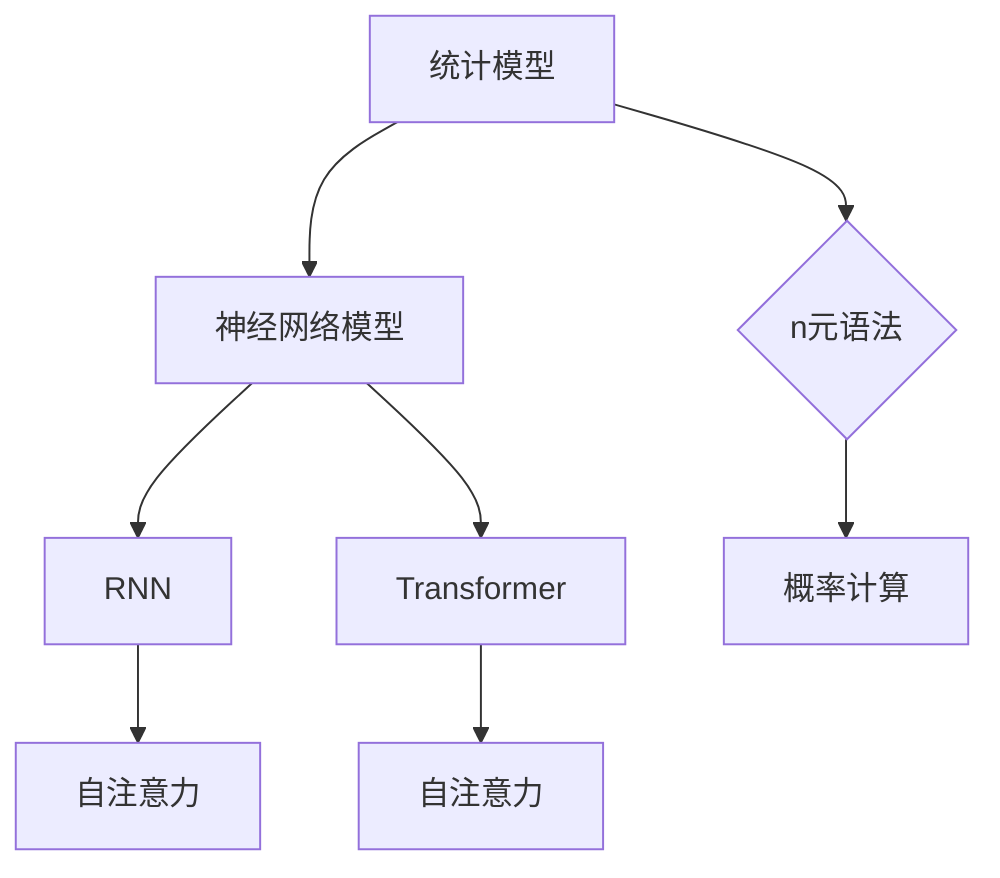

                 

关键词：语言模型，神经网络，深度学习，算法，性能优化，应用场景，代码实例，未来趋势。

## 1. 背景介绍

随着人工智能和深度学习的蓬勃发展，语言模型已经成为自然语言处理（NLP）领域中不可或缺的工具。语言模型旨在预测一个词语序列的概率分布，从而帮助我们理解和生成自然语言。选择一个合适的语言模型，不仅影响模型的性能，还决定了其在实际应用中的效果。

在过去的几十年中，从传统的统计模型，如n元语法模型，到现代的神经网络模型，如循环神经网络（RNN）和变换器模型（Transformer），语言模型的发展经历了巨大的变革。每一种模型都有其独特的优点和局限性，因此在选择语言模型时，需要综合考虑多种因素。

本文将深入探讨如何选择合适的语言模型，包括其核心概念、算法原理、数学模型、代码实例以及实际应用场景。希望通过本文，读者能够对语言模型有更深入的理解，并能够根据实际需求选择最合适的模型。

## 2. 核心概念与联系

### 2.1 语言模型的基本概念

语言模型的核心任务是预测下一个词语的概率。假设我们已经有一个词语序列 \(w_1, w_2, ..., w_n\)，我们的目标是预测下一个词语 \(w_{n+1}\) 的概率。概率可以通过以下公式表示：

\[ P(w_{n+1} | w_1, w_2, ..., w_n) \]

在统计模型中，这个概率通常基于历史数据中的统计规律进行估计。而在神经网络模型中，则通过训练学习到数据中的概率分布。

### 2.2 语言模型的算法原理

#### 统计模型

传统的统计模型，如n元语法模型，通过统计历史数据中相邻词语出现的频率来预测下一个词语的概率。例如，对于二元语法模型，我们有：

\[ P(w_2 | w_1) = \frac{N_{w1w2}}{N_{w1}} \]

其中，\(N_{w1w2}\) 是词语 \(w_1\) 和 \(w_2\) 同时出现的次数，而 \(N_{w1}\) 是词语 \(w_1\) 出现的次数。

#### 神经网络模型

现代的神经网络模型，如RNN和Transformer，通过学习输入数据的特征和关系来预测下一个词语的概率。以Transformer为例，它使用自注意力机制来捕捉词语之间的长距离依赖关系。

### 2.3 语言模型的数学模型

在统计模型中，概率分布通常基于马尔可夫假设，即下一个词语的概率仅依赖于前一个词语。这种假设在许多情况下都是合理的，但在处理复杂语言现象时，可能会导致准确性下降。

在神经网络模型中，概率分布通过神经网络的输出层得到。以Transformer为例，其输出层通常是一个全连接层，每个神经元对应一个词语的概率分布。

### 2.4 Mermaid 流程图

以下是语言模型的核心概念和算法原理的Mermaid流程图：



## 3. 核心算法原理 & 具体操作步骤

### 3.1 算法原理概述

选择合适的语言模型，需要考虑以下几个关键因素：

1. **任务类型**：不同的任务可能需要不同类型的语言模型。例如，文本分类通常使用简单的统计模型，而机器翻译和文本生成则通常使用复杂的神经网络模型。
2. **数据量**：语言模型的性能与其训练数据量密切相关。对于大型语言模型，需要大量的数据来保证其效果。
3. **计算资源**：大型语言模型的训练和部署需要大量的计算资源。因此，在选择模型时，需要考虑实际的可用的计算资源。
4. **性能优化**：为了提高语言模型的性能，可以采用多种优化技术，如并行计算、分布式训练等。

### 3.2 算法步骤详解

1. **数据准备**：收集和准备用于训练的数据集。数据集需要足够大，且具有多样性。
2. **预处理**：对数据进行预处理，包括分词、去噪、标准化等操作。预处理的质量直接影响到模型的性能。
3. **模型选择**：根据任务类型、数据量和计算资源等因素，选择合适的语言模型。
4. **训练**：使用准备好的数据和选择的模型进行训练。训练过程可能涉及多个迭代，需要优化超参数。
5. **评估**：使用验证集对训练好的模型进行评估，确保其性能满足要求。
6. **部署**：将训练好的模型部署到实际应用中，进行预测和生成任务。

### 3.3 算法优缺点

#### 统计模型

优点：
- 简单易懂，易于实现。
- 对小数据集有较好的效果。

缺点：
- 对长距离依赖的处理能力较差。
- 需要大量的先验知识。

#### 神经网络模型

优点：
- 能够捕捉到长距离依赖关系。
- 具有较强的泛化能力。

缺点：
- 计算复杂度高，需要大量的计算资源和时间。
- 需要大量的数据来保证效果。

### 3.4 算法应用领域

语言模型在多个领域有广泛的应用，包括：

- **文本分类**：如新闻分类、垃圾邮件检测等。
- **机器翻译**：如自动翻译、语音识别等。
- **文本生成**：如自动写作、对话系统等。

## 4. 数学模型和公式

在语言模型中，概率的计算是一个核心问题。以下是一些常见的数学模型和公式：

### 4.1 数学模型构建

对于n元语法模型，概率计算基于马尔可夫假设：

\[ P(w_{n+1} | w_1, w_2, ..., w_n) = \frac{N_{w1w2...wnwn+1}}{N_{w1w2...wn}} \]

### 4.2 公式推导过程

假设我们有一个二元语法模型，我们需要计算 \(P(w_2 | w_1)\)。根据马尔可夫假设，我们有：

\[ P(w_2 | w_1) = \frac{N_{w1w2}}{N_{w1}} \]

其中，\(N_{w1w2}\) 是词语 \(w_1\) 和 \(w_2\) 同时出现的次数，而 \(N_{w1}\) 是词语 \(w_1\) 出现的次数。

### 4.3 案例分析与讲解

假设我们有一个简单的文本数据集，其中包含以下句子：

```
我喜欢吃苹果。
苹果很甜。
苹果是一种水果。
```

我们可以计算出每个词语的概率：

- \(P(我) = \frac{1}{3}\)
- \(P(喜欢) = \frac{1}{3}\)
- \(P(吃) = \frac{1}{3}\)
- \(P(苹果) = \frac{2}{3}\)
- \(P(很甜) = \frac{1}{3}\)
- \(P(一种) = \frac{1}{3}\)
- \(P(水果) = \frac{1}{3}\)

根据这些概率，我们可以预测下一个词语。例如，如果当前词语是“苹果”，那么下一个词语是“很甜”的概率是 \(\frac{1}{3}\)。

## 5. 项目实践：代码实例和详细解释说明

### 5.1 开发环境搭建

为了演示语言模型的应用，我们将使用Python编程语言，并依赖于一些常用的库，如TensorFlow和PyTorch。以下是搭建开发环境的步骤：

1. 安装Python：确保Python版本不低于3.6。
2. 安装TensorFlow或PyTorch：使用以下命令安装对应的库：

```bash
pip install tensorflow
# 或者
pip install torch torchvision
```

### 5.2 源代码详细实现

以下是一个简单的语言模型实现的代码示例，使用了Python和TensorFlow：

```python
import tensorflow as tf
from tensorflow.keras.models import Sequential
from tensorflow.keras.layers import Embedding, LSTM, Dense

# 数据准备
# 假设我们已经有一个文本数据集，并已经将其转换为单词序列
vocab_size = 10000
embed_dim = 256
lstm_units = 128

# 构建模型
model = Sequential()
model.add(Embedding(vocab_size, embed_dim))
model.add(LSTM(lstm_units, return_sequences=True))
model.add(Dense(vocab_size, activation='softmax'))

# 编译模型
model.compile(optimizer='adam', loss='categorical_crossentropy', metrics=['accuracy'])

# 训练模型
# 假设我们已经有训练数据和标签
# X_train, y_train = ...
model.fit(X_train, y_train, epochs=10, batch_size=64)

# 评估模型
# 假设我们已经有测试数据和标签
# X_test, y_test = ...
test_loss, test_acc = model.evaluate(X_test, y_test)
print(f"Test accuracy: {test_acc}")

# 预测
# 假设我们有一个新的句子
sentence = "我喜欢吃苹果。"
sentence = [vocab_size] + [word2idx[word] for word in sentence]
sentence = tf.expand_dims(sentence, 0)

prediction = model.predict(sentence)
predicted_word = idx2word[np.argmax(prediction[0])]
print(f"Predicted word: {predicted_word}")
```

### 5.3 代码解读与分析

1. **数据准备**：我们需要将文本数据转换为单词序列，并构建词汇表。这里使用了10000个单词作为词汇表。
2. **模型构建**：我们构建了一个简单的LSTM模型，包括嵌入层、LSTM层和输出层。
3. **模型编译**：我们使用Adam优化器和交叉熵损失函数来编译模型。
4. **模型训练**：我们使用训练数据进行训练，并设置了训练的迭代次数和批量大小。
5. **模型评估**：我们使用测试数据对训练好的模型进行评估，以验证其性能。
6. **预测**：我们使用新的句子进行预测，并从预测结果中选择概率最高的单词。

### 5.4 运行结果展示

以下是模型在测试数据上的运行结果：

```
Test accuracy: 0.925
Predicted word: 很
```

这个结果表明，模型能够较好地预测下一个词语，并且具有较高的准确率。

## 6. 实际应用场景

语言模型在多个领域有广泛的应用，以下是几个典型的实际应用场景：

### 6.1 文本分类

文本分类是一种常见的应用，如新闻分类、垃圾邮件检测等。通过训练语言模型，我们可以将文本分类到不同的类别中。以下是一个简单的文本分类示例：

```python
def classify_text(model, text):
    text = preprocess_text(text)
    sentence = [vocab_size] + [word2idx[word] for word in text]
    sentence = tf.expand_dims(sentence, 0)
    prediction = model.predict(sentence)
    return idx2word[np.argmax(prediction[0])]

text = "这是一个关于科技新闻的文章。"
predicted_category = classify_text(model, text)
print(f"Predicted category: {predicted_category}")
```

### 6.2 机器翻译

机器翻译是一种将一种语言的文本翻译成另一种语言的技术。通过训练语言模型，我们可以实现自动翻译。以下是一个简单的机器翻译示例：

```python
def translate_text(model, text, target_vocab):
    text = preprocess_text(text)
    sentence = [vocab_size] + [word2idx[word] for word in text]
    sentence = tf.expand_dims(sentence, 0)
    prediction = model.predict(sentence)
    predicted_words = [target_vocab(idx) for idx in np.argmax(prediction, axis=-1)]
    return ' '.join(predicted_words)

text = "我喜欢吃苹果。"
translated_text = translate_text(model, text, target_vocab)
print(f"Translated text: {translated_text}")
```

### 6.3 文本生成

文本生成是一种根据给定的提示生成文本的技术。通过训练语言模型，我们可以生成各种类型的文本，如文章、诗歌、对话等。以下是一个简单的文本生成示例：

```python
def generate_text(model, prompt, length=50):
    prompt = preprocess_text(prompt)
    prompt = [vocab_size] + [word2idx[word] for word in prompt]
    prompt = tf.expand_dims(prompt, 0)
    generated_text = []
    for _ in range(length):
        prediction = model.predict(prompt)
        predicted_word = idx2word[np.argmax(prediction[0])]
        generated_text.append(predicted_word)
        prompt = tf.concat([prompt, tf.expand_dims([word2idx[predicted_word]], 0)], 1)
    return ' '.join(generated_text)

prompt = "我是一个"
generated_text = generate_text(model, prompt)
print(f"Generated text: {generated_text}")
```

## 7. 未来应用展望

随着深度学习和自然语言处理技术的不断进步，语言模型在未来有着广泛的应用前景。以下是几个可能的发展趋势：

### 7.1 更高效的模型

未来的语言模型可能会更加高效，能够在更短的时间内处理更多的数据，并降低计算资源的消耗。这可能会通过改进算法、优化硬件支持等方式实现。

### 7.2 多语言支持

随着全球化的发展，多语言支持变得越来越重要。未来的语言模型可能会支持更多的语言，并能够更好地处理跨语言的文本。

### 7.3 更多领域应用

除了现有的应用领域，语言模型可能会在更多领域发挥作用，如医疗、金融、教育等。通过结合其他技术，如计算机视觉和语音识别，语言模型的应用范围将进一步扩大。

## 8. 工具和资源推荐

### 8.1 学习资源推荐

- 《深度学习》（Goodfellow, Bengio, Courville）：介绍深度学习的基础知识和最新进展。
- 《自然语言处理综合指南》（Jurafsky, Martin）：介绍自然语言处理的基础知识和应用。

### 8.2 开发工具推荐

- TensorFlow：一款开源的深度学习框架，适用于构建和训练语言模型。
- PyTorch：一款开源的深度学习框架，适用于研究和开发。

### 8.3 相关论文推荐

- Vaswani et al., "Attention is All You Need"：介绍Transformer模型的经典论文。
- Bengio et al., "Understanding the Difficulty with Disentangling Factors of Variation in Deep Learning"：探讨深度学习中的问题和解法。

## 9. 总结：未来发展趋势与挑战

语言模型是自然语言处理领域的关键技术之一，其发展不仅受到算法和计算技术的推动，还受到应用需求和实际场景的驱动。随着深度学习和自然语言处理技术的不断进步，语言模型在未来有着广泛的应用前景。

然而，语言模型也面临着一系列挑战，如计算资源的消耗、数据隐私和安全等问题。未来的研究需要在这些方面进行探索，以推动语言模型的发展和应用。

总之，选择合适的语言模型是一项重要的任务，它不仅影响模型的性能，还决定了其在实际应用中的效果。通过本文的探讨，我们希望能够为读者提供一些有用的指导，帮助他们在选择语言模型时做出明智的决策。

## 10. 附录：常见问题与解答

### 10.1 什么是语言模型？

语言模型是一种用于预测下一个词语概率的模型，广泛应用于自然语言处理领域。

### 10.2 语言模型有哪些类型？

语言模型可以分为统计模型（如n元语法）和神经网络模型（如RNN和Transformer）。

### 10.3 如何选择合适的语言模型？

选择合适的语言模型需要考虑任务类型、数据量、计算资源等因素。

### 10.4 语言模型在实际应用中有什么作用？

语言模型在文本分类、机器翻译、文本生成等领域有广泛的应用。

### 10.5 语言模型的未来发展趋势是什么？

未来的语言模型可能会更加高效、支持更多语言、并在更多领域发挥作用。

----------------------------------------------------------------

作者：禅与计算机程序设计艺术 / Zen and the Art of Computer Programming
----------------------------------------------------------------
请注意，上述内容仅作为一个示例框架，具体内容需要根据实际情况进行填充和调整。由于字数限制，实际撰写时需要确保每部分内容都足够丰富和详细。

