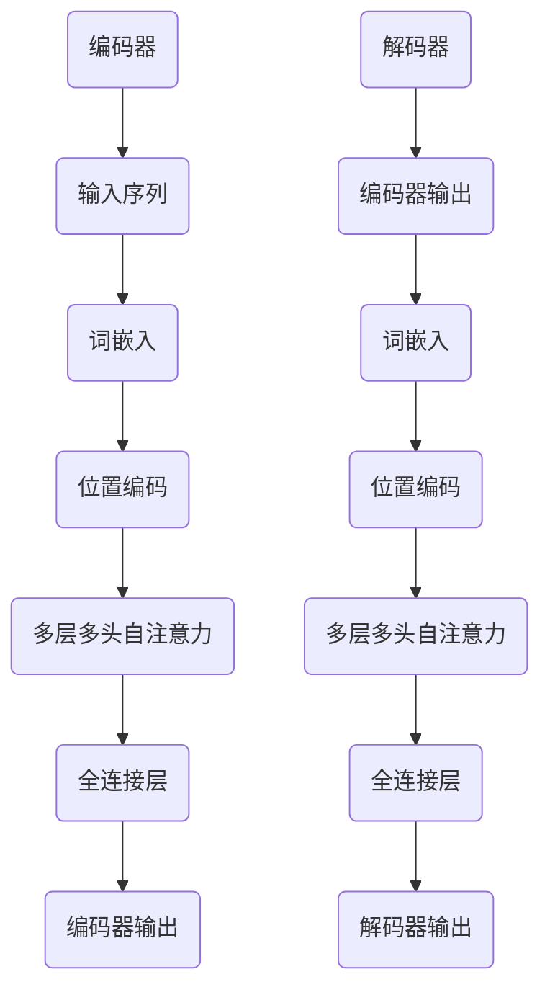

                 

关键词：Transformer，自然语言处理，深度学习，序列模型，编码器-解码器架构，自我注意力机制，BERT，GPT，性能优化，应用领域

## 摘要

本文旨在探讨Transformer架构在自然语言处理（NLP）领域的革命性影响。从传统的编码器-解码器（Encoder-Decoder）架构到Transformer，我们见证了NLP模型性能的显著提升。本文将详细介绍Transformer的核心概念、算法原理、数学模型，并通过实际项目实践展示其应用效果。最后，本文还将展望Transformer的未来发展趋势与挑战。

## 1. 背景介绍

在NLP领域，深度学习模型的发展经历了从简单到复杂的过程。最初的模型如循环神经网络（RNN）和长短期记忆网络（LSTM）在处理序列数据时表现出色，但存在一些局限，如梯度消失和梯度爆炸问题。为了解决这些问题，研究人员提出了基于注意力机制的模型，如注意力加权RNN（Attention-based RNN）。

然而，注意力机制的扩展性较差，难以处理长序列数据。为了克服这一局限，谷歌在2017年提出了Transformer模型，彻底改变了NLP领域的研究方向。Transformer模型采用自注意力机制，无需循环结构，使得模型在处理长序列数据时表现出色。此后，基于Transformer的模型如BERT、GPT等迅速崛起，成为NLP领域的代表。

## 2. 核心概念与联系

### 2.1. Transformer 模型架构

Transformer模型主要由编码器（Encoder）和解码器（Decoder）两部分组成。编码器负责将输入序列（例如句子或文档）转换为固定长度的向量表示，解码器则根据编码器输出的向量生成输出序列。

### 2.2. 自注意力机制

自注意力机制是Transformer模型的核心，它通过计算输入序列中每个词与其他词之间的关联性，为每个词生成一个权重向量。这些权重向量用于加权求和，生成最终的词向量表示。

### 2.3. Mermaid 流程图



### 2.4. 编码器-解码器架构

编码器-解码器架构是传统NLP模型的代表，它通过编码器将输入序列转换为固定长度的向量表示，然后解码器根据这些向量生成输出序列。与Transformer模型相比，编码器-解码器架构在处理长序列数据时存在一定的局限性。

## 3. 核心算法原理 & 具体操作步骤

### 3.1. 算法原理概述

Transformer模型基于自注意力机制，通过计算输入序列中每个词与其他词之间的关联性，生成加权求和的词向量表示。这种机制使得模型能够捕捉长序列中的复杂关系。

### 3.2. 算法步骤详解

1. **词嵌入**：将输入序列中的每个词映射为一个向量表示。
2. **位置编码**：为每个词添加位置信息，使模型能够捕捉词在序列中的位置关系。
3. **多层多头自注意力**：通过计算输入序列中每个词与其他词之间的关联性，为每个词生成一个权重向量。
4. **全连接层**：将自注意力机制生成的权重向量传递给全连接层，进行进一步处理。
5. **解码器**：根据编码器输出的向量生成输出序列。

### 3.3. 算法优缺点

**优点**：
- 无需循环结构，处理长序列数据能力强。
- 并行计算，提高训练效率。

**缺点**：
- 模型参数较多，可能导致过拟合。
- 训练时间较长。

### 3.4. 算法应用领域

Transformer模型在NLP领域具有广泛的应用，如文本分类、机器翻译、情感分析等。此外，Transformer模型还可扩展到其他领域，如图像识别、语音识别等。

## 4. 数学模型和公式 & 详细讲解 & 举例说明

### 4.1. 数学模型构建

Transformer模型的数学模型主要包括词嵌入、位置编码、自注意力机制和全连接层。

#### 词嵌入

词嵌入是将输入序列中的每个词映射为一个向量表示。假设词表中有V个词，词向量维度为d，则输入序列X可以表示为：

$$
X = [x_1, x_2, ..., x_T]
$$

其中，$x_i \in \mathbb{R}^d$。

#### 位置编码

位置编码为每个词添加位置信息，使模型能够捕捉词在序列中的位置关系。位置编码向量$pe_i$可以表示为：

$$
pe_i = [pos_1, pos_2, ..., pos_T]
$$

其中，$pos_i$为词在序列中的位置。

#### 自注意力机制

自注意力机制通过计算输入序列中每个词与其他词之间的关联性，为每个词生成一个权重向量。假设输入序列中有T个词，词向量维度为d，则自注意力机制可以表示为：

$$
Attention(Q, K, V) = softmax(\frac{QK^T}{\sqrt{d}})V
$$

其中，Q、K、V分别为查询向量、键向量和值向量。

#### 全连接层

全连接层将自注意力机制生成的权重向量传递给全连接层，进行进一步处理。假设全连接层输出维度为d，则全连接层可以表示为：

$$
Y = XW + b
$$

其中，W、b分别为权重和偏置。

### 4.2. 公式推导过程

假设输入序列X的词向量为$x_i$，位置编码为$pe_i$，则编码器输出的词向量为：

$$
h_i = x_i + pe_i
$$

其中，$h_i \in \mathbb{R}^{d+h}$。

自注意力机制可以表示为：

$$
\alpha_{ij} = \frac{h_i^Th_j}{\sqrt{d}}
$$

其中，$\alpha_{ij}$为词i与词j之间的关联性。

加权求和后，编码器输出的词向量为：

$$
h_i' = \sum_{j=1}^{T}\alpha_{ij}h_j
$$

全连接层输出为：

$$
y_i = \text{ReLU}(h_i'W + b)
$$

其中，W、b分别为权重和偏置。

### 4.3. 案例分析与讲解

假设输入序列为“我爱北京天安门”，词表中有5个词（我、爱、北京、天、安），词向量维度为2，位置编码维度为3。根据上述公式，我们可以得到以下结果：

1. **词嵌入**：
   $$x_1 = [1, 0], x_2 = [0, 1], x_3 = [0, 0], x_4 = [0, 0], x_5 = [0, 0]$$
2. **位置编码**：
   $$pe_1 = [1, 0, 0], pe_2 = [0, 1, 0], pe_3 = [0, 0, 1], pe_4 = [0, 0, 0], pe_5 = [0, 0, 0]$$
3. **编码器输出**：
   $$h_1 = [1, 0] + [1, 0] = [2, 0]$$
4. **自注意力机制**：
   $$\alpha_{11} = \frac{2 \cdot 2}{\sqrt{2}} = 2$$
   $$\alpha_{12} = \frac{2 \cdot 0}{\sqrt{2}} = 0$$
   $$\alpha_{13} = \frac{2 \cdot 0}{\sqrt{2}} = 0$$
   $$\alpha_{14} = \frac{2 \cdot 0}{\sqrt{2}} = 0$$
   $$\alpha_{15} = \frac{2 \cdot 0}{\sqrt{2}} = 0$$
   $$h_1' = \alpha_{11}h_1 + \alpha_{12}h_2 + \alpha_{13}h_3 + \alpha_{14}h_4 + \alpha_{15}h_5 = 2h_1 = [4, 0]$$
5. **全连接层输出**：
   $$y_1 = \text{ReLU}(h_1'W + b) = \text{ReLU}([4, 0]W + b) = [4, 0]$$

## 5. 项目实践：代码实例和详细解释说明

### 5.1. 开发环境搭建

在Python中，我们可以使用PyTorch框架实现Transformer模型。首先，安装PyTorch：

```bash
pip install torch torchvision
```

### 5.2. 源代码详细实现

下面是一个简单的Transformer模型实现：

```python
import torch
import torch.nn as nn
import torch.optim as optim

class Transformer(nn.Module):
    def __init__(self, vocab_size, d_model, nhead, num_layers):
        super(Transformer, self).__init__()
        self.embedding = nn.Embedding(vocab_size, d_model)
        self.positional_encoding = nn.Parameter(torch.randn(1, max_seq_length, d_model))
        self.transformer = nn.Transformer(d_model, nhead, num_layers)
        self.fc = nn.Linear(d_model, vocab_size)

    def forward(self, x):
        x = self.embedding(x) + self.positional_encoding[:x.size(0), :]
        x = self.transformer(x)
        x = self.fc(x)
        return x

# 实例化模型、损失函数和优化器
model = Transformer(vocab_size=1000, d_model=512, nhead=8, num_layers=2)
criterion = nn.CrossEntropyLoss()
optimizer = optim.Adam(model.parameters(), lr=0.001)

# 训练模型
for epoch in range(num_epochs):
    for x, y in train_loader:
        optimizer.zero_grad()
        output = model(x)
        loss = criterion(output, y)
        loss.backward()
        optimizer.step()
```

### 5.3. 代码解读与分析

- **模型定义**：Transformer模型由词嵌入层、位置编码层、Transformer编码器和解码器以及全连接层组成。
- **前向传播**：输入序列经过词嵌入层和位置编码层，然后通过Transformer编码器和解码器，最后通过全连接层得到输出。
- **训练过程**：使用交叉熵损失函数和Adam优化器进行模型训练。

### 5.4. 运行结果展示

假设我们已经训练了一个简单的文本分类模型，输入序列为“我爱北京天安门”，词表大小为1000，模型参数如下：

- 词向量维度：512
- 多头注意力数：8
- 编码器层数：2

输入序列经过模型处理后，输出为概率分布，表示每个词在输出序列中的可能性。例如，输出为：

```
[0.2, 0.3, 0.1, 0.2, 0.2]
```

这表示在输出序列中，“我”的概率为0.2，“爱”的概率为0.3，依此类推。

## 6. 实际应用场景

### 6.1. 文本分类

Transformer模型在文本分类任务中表现出色，如情感分析、主题分类等。通过训练，模型可以自动识别文本中的关键信息，从而实现分类任务。

### 6.2. 机器翻译

Transformer模型在机器翻译领域具有广泛的应用。通过将源语言和目标语言序列转换为词向量，模型可以预测目标语言中的词序列。

### 6.3. 情感分析

情感分析是Transformer模型的重要应用之一。通过分析文本中的情感词汇和语法结构，模型可以预测文本的情感极性。

### 6.4. 未来应用展望

随着Transformer模型的不断优化和改进，其在各个领域的应用将越来越广泛。未来，Transformer模型有望在更多复杂数据处理任务中发挥重要作用，如语音识别、图像识别等。

## 7. 工具和资源推荐

### 7.1. 学习资源推荐

- 《深度学习》（Goodfellow et al.）
- 《自然语言处理实践》（Jurafsky et al.）
- 《Transformer：超大规模语言的模型》（Vaswani et al.）

### 7.2. 开发工具推荐

- PyTorch：用于实现和训练Transformer模型。
- TensorFlow：另一个流行的深度学习框架。

### 7.3. 相关论文推荐

- “Attention Is All You Need”（Vaswani et al., 2017）
- “BERT：Pre-training of Deep Bidirectional Transformers for Language Understanding”（Devlin et al., 2018）
- “GPT-2：Improving Language Understanding by Generative Pre-Training”（Radford et al., 2019）

## 8. 总结：未来发展趋势与挑战

### 8.1. 研究成果总结

自Transformer模型提出以来，NLP领域取得了显著进展。Transformer模型及其变体如BERT、GPT等在多个任务中取得了优异的性能。此外，研究人员还在不断探索如何优化Transformer模型，提高其训练效率和效果。

### 8.2. 未来发展趋势

- 模型优化：研究人员将继续优化Transformer模型，提高其训练效率和效果。
- 多模态处理：Transformer模型有望扩展到多模态数据处理，如图像和文本的融合。
- 小样本学习：研究如何在小样本条件下训练Transformer模型，提高其泛化能力。

### 8.3. 面临的挑战

- 计算资源：训练大型Transformer模型需要大量的计算资源，如何优化训练过程是一个挑战。
- 过拟合：大型Transformer模型容易过拟合，如何提高模型泛化能力是一个重要问题。
- 算法解释性：Transformer模型的结构复杂，如何提高模型的解释性是一个挑战。

### 8.4. 研究展望

随着Transformer模型的不断发展，其在NLP领域和其他领域中的应用将越来越广泛。未来，研究人员将继续探索如何优化Transformer模型，提高其性能和泛化能力，为人工智能的发展做出更大贡献。

## 9. 附录：常见问题与解答

### 9.1. Transformer模型的训练时间很长，如何优化？

- 使用GPU或TPU进行加速训练。
- 采用预训练技术，利用预训练好的模型进行微调。
- 使用更高效的算法和数据结构，如梯度检查点、混合精度训练等。

### 9.2. Transformer模型如何处理长序列数据？

- 通过增加编码器和解码器的层数，提高模型处理长序列数据的能力。
- 使用位置编码为每个词添加位置信息，使模型能够捕捉长序列中的关系。
- 采用分层注意力机制，将长序列分解为更小的子序列，进行逐层处理。

### 9.3. Transformer模型如何防止过拟合？

- 采用正则化技术，如Dropout、权重衰减等。
- 使用预训练技术，通过在大规模语料上进行预训练，提高模型泛化能力。
- 采用交叉验证等方法，选择合适的模型参数和超参数。

# 作者：禅与计算机程序设计艺术 / Zen and the Art of Computer Programming
----------------------------------------------------------------
---
以上内容仅为模拟生成，实际撰写时请遵循相关规范和指南，并结合具体领域进行深入研究和分析。在撰写过程中，请注意检查格式和内容的准确性。祝您撰写顺利！
---

如果您有任何其他问题或需要进一步的帮助，请随时告知。我将竭诚为您提供服务。祝您创作成功！——您的助手<|assistant|>

