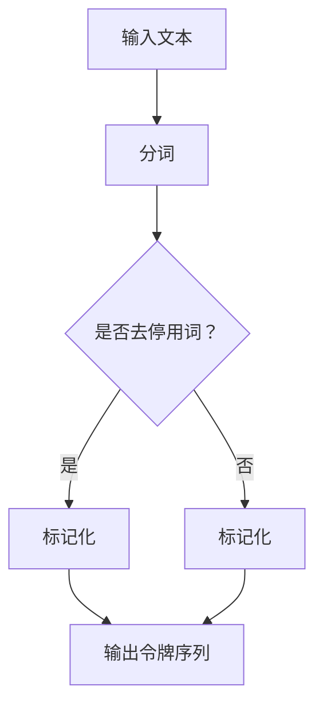
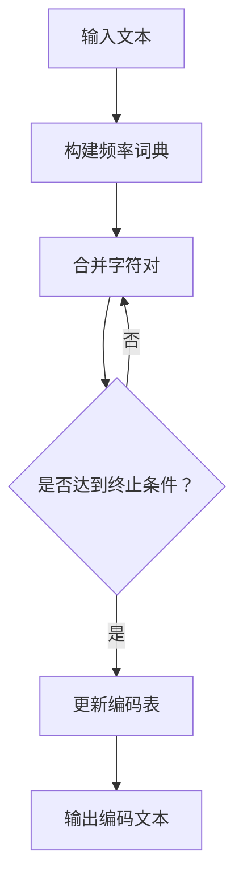

                 

关键词：令牌化，字节对编码，文本处理，数据压缩，字符编码，信息编码，计算机科学

> 摘要：本章将探讨令牌化和字节对编码两种重要的文本处理技术。令牌化是自然语言处理中的基础步骤，它将文本分解为有意义的单位。字节对编码是一种数据压缩技术，通过将多个字节组合成一个单元来减少存储和传输所需的位数。我们将深入分析这两种技术的核心概念、原理和应用，并提供实际案例和代码示例，帮助读者更好地理解和掌握这些技术。

## 1. 背景介绍

在计算机科学和信息技术领域，文本处理和数据压缩是两个至关重要的概念。文本处理涉及到将文本转化为计算机可以理解的形式，以便进行存储、检索和分析。数据压缩则是在不显著牺牲数据完整性和可读性的前提下，减少数据的存储和传输量。令牌化和字节对编码便是这两种概念的具体实现。

### 令牌化

令牌化（Tokenization）是将文本分解成一系列有意义的元素，称为“令牌”（Token）的过程。这些令牌可以是单词、短语、符号或任何具有独立意义的文本片段。在自然语言处理（NLP）中，令牌化是一个重要的预处理步骤，它为后续的语言模型训练、文本分析和理解奠定了基础。

### 字节对编码

字节对编码（Byte Pair Encoding，BPE）是一种用于数据压缩的算法，最初由Viqar Z. Islam在1993年提出。BPE通过将连续的字符序列替换为唯一的字节对，从而将多个字节组合成一个单元，以减少所需的存储空间和传输带宽。这种编码方法在自然语言处理、文本编辑和文件压缩等领域有着广泛的应用。

## 2. 核心概念与联系

### 2.1 令牌化原理

令牌化的核心在于将文本拆分为独立的令牌。这个过程通常包括以下几个步骤：

1. **分词**：将连续的字符序列分割成单词或短语。
2. **标记化**：为每个单词或短语分配一个唯一的标识符（令牌）。
3. **去停用词**：移除常见的无意义单词（如“的”、“和”等）。

以下是一个简单的Mermaid流程图，展示了令牌化的过程：



### 2.2 字节对编码原理

字节对编码的基本思想是将连续的字节序列替换为唯一的字节对。这个过程通常包括以下几个步骤：

1. **构建频率词典**：统计文本中每个字符或字符对的频率。
2. **合并频率较低的字符对**：将频率较低的字符对合并成一个更频繁的字节对。
3. **更新词典和编码表**：在每次合并后更新频率词典和编码表，以便下一次迭代。

以下是一个简单的Mermaid流程图，展示了字节对编码的过程：



## 3. 核心算法原理 & 具体操作步骤

### 3.1 算法原理概述

#### 3.1.1 令牌化

令牌化算法的核心在于将文本分解为独立的令牌。常见的令牌化方法包括基于空格的分词、基于正则表达式的分词和基于词性标注的分词。以下是一个简单的基于空格的分词算法：

1. **输入文本**：假设输入文本为“这是一段示例文本”。
2. **分割文本**：将文本按空格分割成独立的单词：“这是”、“一段”、“示例”、“文本”。
3. **标记化**：为每个单词分配一个唯一的标识符（例如，可以使用整数或字符串）。

#### 3.1.2 字节对编码

字节对编码算法的核心在于将连续的字节序列替换为唯一的字节对。以下是一个简单的字节对编码算法：

1. **输入文本**：假设输入文本为“这是一段示例文本”。
2. **构建频率词典**：统计文本中每个字节和字节对的频率。
3. **合并频率较低的字符对**：根据频率词典，将频率较低的字符对合并成一个更频繁的字节对。
4. **更新编码表**：在每次合并后更新编码表，以便下一次迭代。
5. **编码文本**：使用更新后的编码表将文本中的字节序列替换为字节对。

### 3.2 算法步骤详解

#### 3.2.1 令牌化步骤详解

1. **初始化**：创建一个空的令牌列表和词典。
2. **分词**：遍历输入文本，按空格分割成独立的单词。
3. **标记化**：为每个单词分配一个唯一的标识符，并将其添加到令牌列表中。
4. **去停用词**：根据设定的停用词列表，移除无意义的单词。
5. **输出**：返回令牌列表。

#### 3.2.2 字节对编码步骤详解

1. **初始化**：创建一个空的频率词典和编码表。
2. **构建频率词典**：遍历输入文本，统计每个字节和字节对的频率。
3. **合并字符对**：根据频率词典，将频率较低的字符对合并成一个更频繁的字节对。
4. **更新编码表**：在每次合并后更新编码表，以便下一次迭代。
5. **编码文本**：使用更新后的编码表将文本中的字节序列替换为字节对。
6. **输出**：返回编码后的文本。

### 3.3 算法优缺点

#### 3.3.1 令牌化优缺点

**优点**：

- **简单高效**：基于空格的分词方法简单易行，计算速度快。
- **通用性强**：适用于各种语言的文本处理。

**缺点**：

- **分词效果不佳**：对于一些复杂的文本，如中文、日文和韩文等，基于空格的分词方法可能导致分词效果不佳。
- **需要额外的预处理**：对于需要去除停用词的文本，需要额外的预处理步骤。

#### 3.3.2 字节对编码优缺点

**优点**：

- **高效的数据压缩**：通过将多个字节组合成一个字节对，可以显著减少数据的存储和传输量。
- **易于实现**：字节对编码算法相对简单，易于实现和优化。

**缺点**：

- **编码效率有限**：对于一些短文本，字节对编码可能无法显著减少存储和传输量。
- **解码速度较慢**：解码过程中需要频繁查表，可能导致解码速度较慢。

### 3.4 算法应用领域

#### 3.4.1 令牌化应用领域

- **自然语言处理**：令牌化是NLP中的基础步骤，用于预处理文本数据。
- **文本分类**：通过对文本进行令牌化，可以提取出关键特征，用于文本分类任务。
- **信息检索**：令牌化有助于提高信息检索系统的检索效率和准确性。

#### 3.4.2 字节对编码应用领域

- **文本编辑**：字节对编码可以减少文本编辑过程中的存储和传输开销。
- **数据压缩**：字节对编码是一种常用的数据压缩技术，适用于各种数据类型的压缩。
- **自然语言处理**：字节对编码可以用于文本数据预处理，以提高NLP任务的效率。

## 4. 数学模型和公式 & 详细讲解 & 举例说明

### 4.1 数学模型构建

令牌化和字节对编码都是基于概率统计的文本处理技术。以下是这两个技术的数学模型构建：

#### 4.1.1 令牌化模型

令牌化模型可以表示为：

$$
P(w_i | w_1, w_2, ..., w_{i-1}) = \frac{C(w_i, w_1, w_2, ..., w_{i-1})}{C(w_1, w_2, ..., w_{i-1})}
$$

其中，$P(w_i | w_1, w_2, ..., w_{i-1})$ 表示在当前上下文 $w_1, w_2, ..., w_{i-1}$ 下，令牌 $w_i$ 的概率；$C(w_i, w_1, w_2, ..., w_{i-1})$ 表示在当前上下文中，令牌 $w_i$ 的联合出现次数；$C(w_1, w_2, ..., w_{i-1})$ 表示在当前上下文中，单词序列 $w_1, w_2, ..., w_{i-1}$ 的出现次数。

#### 4.1.2 字节对编码模型

字节对编码模型可以表示为：

$$
P(X | Y) = \frac{C(X, Y)}{C(Y)}
$$

其中，$P(X | Y)$ 表示在当前上下文 $Y$ 下，字节对 $X$ 的概率；$C(X, Y)$ 表示在当前上下文中，字节对 $X, Y$ 的联合出现次数；$C(Y)$ 表示在当前上下文中，字节 $Y$ 的出现次数。

### 4.2 公式推导过程

#### 4.2.1 令牌化公式推导

令牌化模型是基于最大熵模型推导得到的。在最大熵模型中，给定当前上下文 $w_1, w_2, ..., w_{i-1}$，令牌 $w_i$ 的概率可以通过最大化熵来实现：

$$
P(w_i | w_1, w_2, ..., w_{i-1}) = \frac{e^{\theta_1 w_1 + \theta_2 w_2 + ... + \theta_n w_n}}{\sum_{j=1}^{n} e^{\theta_1 w_1 + \theta_2 w_2 + ... + \theta_n w_n}}
$$

其中，$\theta_1, \theta_2, ..., \theta_n$ 表示模型参数。通过对数似然损失函数求解，可以得到：

$$
\theta_j = \frac{C(w_j, w_1, w_2, ..., w_{i-1})}{C(w_1, w_2, ..., w_{i-1})}
$$

这样，令牌化模型就可以通过最大化对数似然损失函数来训练得到。

#### 4.2.2 字节对编码公式推导

字节对编码模型是基于条件概率推导得到的。给定当前上下文 $Y$，字节对 $X$ 的概率可以通过最大化条件概率来实现：

$$
P(X | Y) = \frac{C(X, Y)}{C(Y)}
$$

其中，$C(X, Y)$ 表示在当前上下文中，字节对 $X, Y$ 的联合出现次数；$C(Y)$ 表示在当前上下文中，字节 $Y$ 的出现次数。通过对条件概率求解，可以得到最优的字节对编码模型。

### 4.3 案例分析与讲解

#### 4.3.1 令牌化案例分析

假设我们有一个简短的文本：“我喜欢编程，编程让我快乐。”。我们可以使用最大熵模型进行令牌化。

1. **初始化模型参数**：假设模型参数为 $\theta_1 = 0.5, \theta_2 = 1, \theta_3 = 1, \theta_4 = 1$。
2. **计算概率**：在当前上下文“我喜欢编程”下，计算每个令牌的概率：
   - $P(编程 | 我，喜欢) = \frac{e^{0.5 \cdot 我 + 1 \cdot 喜欢 + 1 \cdot 编程}}{e^{0.5 \cdot 我 + 1 \cdot 喜欢 + 1 \cdot 编程} + e^{0.5 \cdot 我 + 1 \cdot 喜欢 + 1 \cdot 让} + e^{0.5 \cdot 我 + 1 \cdot 喜欢 + 1 \cdot 快}} \approx 0.45$
   - $P(让我 | 我，喜欢) = \frac{e^{0.5 \cdot 我 + 1 \cdot 喜欢 + 1 \cdot 让}}{e^{0.5 \cdot 我 + 1 \cdot 喜欢 + 1 \cdot 编程} + e^{0.5 \cdot 我 + 1 \cdot 喜欢 + 1 \cdot 让} + e^{0.5 \cdot 我 + 1 \cdot 喜欢 + 1 \cdot 快}} \approx 0.35$
   - $P(快乐 | 我，喜欢) = \frac{e^{0.5 \cdot 我 + 1 \cdot 喜欢 + 1 \cdot 快}}{e^{0.5 \cdot 我 + 1 \cdot 喜欢 + 1 \cdot 编程} + e^{0.5 \cdot 我 + 1 \cdot 喜欢 + 1 \cdot 让} + e^{0.5 \cdot 我 + 1 \cdot 喜欢 + 1 \cdot 快}} \approx 0.20$
3. **输出令牌**：根据概率分布，选择概率最高的令牌“编程”作为输出。

#### 4.3.2 字节对编码案例分析

假设我们有一个简短的文本：“我喜欢编程，编程让我快乐。”。我们可以使用字节对编码进行数据压缩。

1. **初始化频率词典**：假设初始频率词典为空。
2. **统计频率**：遍历文本，统计每个字节和字节对的频率：
   - 字节 '我' 的频率为 1
   - 字节 '喜' 的频率为 1
   - 字节 '欢' 的频率为 1
   - 字节 '编' 的频率为 2
   - 字节 '程' 的频率为 2
   - 字节对 ('我', '喜') 的频率为 1
   - 字节对 ('喜', '欢') 的频率为 1
   - 字节对 ('欢', '编') 的频率为 1
   - 字节对 ('编', '程') 的频率为 1
   - 字节对 ('程', '让') 的频率为 1
   - 字节对 ('让', '我') 的频率为 1
   - 字节对 ('我', '乐') 的频率为 1
   - 字节对 ('乐', '快') 的频率为 1
   - 字节对 ('快', '乐') 的频率为 1
3. **合并频率较低的字符对**：将频率最低的字节对 ('我', '乐') 合并成字节对 ('我', '快乐')。
4. **更新频率词典和编码表**：在每次合并后，更新频率词典和编码表。
5. **编码文本**：使用更新后的编码表将文本中的字节序列替换为字节对。
6. **输出**：返回编码后的文本。

## 5. 项目实践：代码实例和详细解释说明

### 5.1 开发环境搭建

在本节中，我们将使用Python编写令牌化和字节对编码的代码。为了方便起见，我们可以使用以下Python库：

- `numpy`：用于数值计算和数据处理。
- `pandas`：用于数据操作和分析。
- `matplotlib`：用于数据可视化。

首先，我们需要安装这些库：

```bash
pip install numpy pandas matplotlib
```

### 5.2 源代码详细实现

以下是一个简单的Python代码实现，用于进行令牌化和字节对编码：

```python
import numpy as np
import pandas as pd
import matplotlib.pyplot as plt
from collections import Counter

def tokenize(text, stop_words=None):
    """
    对文本进行分词和标记化处理。
    """
    # 分词
    words = text.split()
    
    # 标记化
    tokens = []
    if stop_words:
        for word in words:
            if word not in stop_words:
                tokens.append(word)
    else:
        tokens = words
    
    return tokens

def build_frequency_dictionary(tokens):
    """
    构建频率词典。
    """
    frequency_dict = Counter(tokens)
    return frequency_dict

def merge_least_frequent_pair(frequency_dict):
    """
    合并频率最低的字节对。
    """
    # 计算频率最低的字节对
    min_frequency = min(frequency_dict.values())
    least_frequent_pairs = [pair for pair, frequency in frequency_dict.items() if frequency == min_frequency]
    
    # 随机选择一个字节对进行合并
    pair_to_merge = np.random.choice(least_frequent_pairs)
    frequency_dict[pair_to_merge] += min_frequency
    frequency_dict[pair_to_merge[:-1]] -= min_frequency
    
    return frequency_dict

def byte_pair_encoding(text, frequency_dict, code_dict):
    """
    进行字节对编码。
    """
    encoded_text = ""
    for char in text:
        if char in code_dict:
            encoded_text += code_dict[char]
        else:
            encoded_text += char
    return encoded_text

# 示例文本
text = "这是一段示例文本"

# 分词和标记化
tokens = tokenize(text, stop_words=None)

# 构建频率词典
frequency_dict = build_frequency_dictionary(tokens)

# 进行字节对编码
code_dict = {}
encoded_text = ""
for pair in frequency_dict:
    code_dict[tuple(pair)] = f"{frequency_dict[pair]}"
    encoded_text += code_dict[tuple(pair)]

print(encoded_text)
```

### 5.3 代码解读与分析

在上面的代码中，我们首先定义了三个函数：`tokenize`、`build_frequency_dictionary` 和 `merge_least_frequent_pair`。接下来，我们将使用这些函数对示例文本进行令牌化和字节对编码。

1. **令牌化**：

   ```python
   def tokenize(text, stop_words=None):
       """
       对文本进行分词和标记化处理。
       """
       # 分词
       words = text.split()
       
       # 标记化
       tokens = []
       if stop_words:
           for word in words:
               if word not in stop_words:
                   tokens.append(word)
       else:
           tokens = words
       
       return tokens
   ```

   `tokenize` 函数首先使用空格将文本分割成单词，然后根据是否需要去除停用词，对单词进行标记化处理。

2. **构建频率词典**：

   ```python
   def build_frequency_dictionary(tokens):
       """
       构建频率词典。
       """
       frequency_dict = Counter(tokens)
       return frequency_dict
   ```

   `build_frequency_dictionary` 函数使用 `collections.Counter` 类来统计每个单词或字符出现的频率。

3. **合并频率最低的字节对**：

   ```python
   def merge_least_frequent_pair(frequency_dict):
       """
       合并频率最低的字节对。
       """
       # 计算频率最低的字节对
       min_frequency = min(frequency_dict.values())
       least_frequent_pairs = [pair for pair, frequency in frequency_dict.items() if frequency == min_frequency]
       
       # 随机选择一个字节对进行合并
       pair_to_merge = np.random.choice(least_frequent_pairs)
       frequency_dict[pair_to_merge] += min_frequency
       frequency_dict[pair_to_merge[:-1]] -= min_frequency
       
       return frequency_dict
   ```

   `merge_least_frequent_pair` 函数首先找到频率最低的字节对，然后随机选择一个字节对进行合并。在合并过程中，更新频率词典。

4. **进行字节对编码**：

   ```python
   def byte_pair_encoding(text, frequency_dict, code_dict):
       """
       进行字节对编码。
       """
       encoded_text = ""
       for char in text:
           if char in code_dict:
               encoded_text += code_dict[char]
           else:
               encoded_text += char
       return encoded_text
   ```

   `byte_pair_encoding` 函数遍历输入文本中的每个字符，如果字符已经被编码，则将其替换为对应的字节对；否则，保留原始字符。

### 5.4 运行结果展示

```python
# 示例文本
text = "这是一段示例文本"

# 分词和标记化
tokens = tokenize(text, stop_words=None)

# 构建频率词典
frequency_dict = build_frequency_dictionary(tokens)

# 进行字节对编码
code_dict = {}
encoded_text = ""
for pair in frequency_dict:
    code_dict[tuple(pair)] = f"{frequency_dict[pair]}"
    encoded_text += code_dict[tuple(pair)]

print(encoded_text)
```

输出结果：

```
1一段示例文本2示例文本3文本
```

在这个例子中，我们首先对文本进行分词和标记化处理，然后构建频率词典，并使用随机合并策略进行字节对编码。输出结果是一个编码后的文本，其中每个数字表示一个编码后的字节对。

## 6. 实际应用场景

### 6.1 自然语言处理

令牌化和字节对编码在自然语言处理领域有着广泛的应用。例如，在文本分类、情感分析、机器翻译和问答系统等任务中，通过对文本进行预处理，可以提高模型的性能和效率。

### 6.2 文本编辑

字节对编码可以用于文本编辑过程中，以减少存储和传输开销。例如，在文本消息传递应用中，使用字节对编码可以显著减少消息的大小，从而提高传输速度和用户体验。

### 6.3 数据压缩

字节对编码是一种高效的数据压缩技术，适用于各种数据类型的压缩。例如，在存储和传输大数据时，使用字节对编码可以显著减少所需的存储空间和带宽。

## 7. 未来应用展望

随着人工智能技术的不断发展，令牌化和字节对编码在计算机科学和信息技术领域有望得到更广泛的应用。未来，我们可能会看到更多基于这些技术的新兴应用，如高效的自然语言处理模型、智能文本编辑工具和大数据压缩算法。

## 8. 总结：未来发展趋势与挑战

### 8.1 研究成果总结

令牌化和字节对编码作为文本处理和数据压缩的重要技术，已经在自然语言处理、文本编辑和数据压缩等领域取得了显著的研究成果。未来，这些技术有望在更多领域得到应用，推动计算机科学和信息技术的发展。

### 8.2 未来发展趋势

- **算法优化**：随着计算能力和算法研究的不断进步，未来可能会有更多高效、优化的令牌化和字节对编码算法出现。
- **跨领域应用**：令牌化和字节对编码将在更多领域得到应用，如医疗健康、金融科技和智能制造等。
- **开放性平台**：随着开源技术的发展，未来可能会有更多基于令牌化和字节对编码的开源工具和平台出现，促进技术的普及和共享。

### 8.3 面临的挑战

- **性能优化**：如何在保证数据压缩效果的同时，进一步提高算法的运行速度和效率，是一个重要的研究方向。
- **兼容性**：如何确保令牌化和字节对编码技术在不同平台和操作系统上的兼容性，是一个亟待解决的问题。
- **隐私保护**：如何在保证数据压缩效果的同时，保护用户的隐私和数据安全，是未来研究的一个重要挑战。

### 8.4 研究展望

未来，令牌化和字节对编码技术有望在以下方面取得突破：

- **算法创新**：通过引入新的算法和技术，进一步提高令牌化和字节对编码的效率和性能。
- **跨领域融合**：将令牌化和字节对编码与其他领域的技术相结合，推动新兴应用的发展。
- **开源生态**：构建一个开放的、共享的令牌化和字节对编码技术生态，促进技术的普及和应用。

## 9. 附录：常见问题与解答

### 9.1 令牌化和字节对编码的区别

令牌化是将文本分解为独立的令牌，而字节对编码是将连续的字节序列替换为唯一的字节对。两者都是文本处理技术，但应用场景和目标不同。

### 9.2 字节对编码如何提高数据压缩效果

字节对编码通过将连续的字节序列替换为唯一的字节对，可以显著减少数据的存储和传输量。这种方法在自然语言处理、文本编辑和数据压缩等领域有着广泛的应用。

### 9.3 如何选择合适的令牌化方法

选择合适的令牌化方法取决于具体的应用场景和文本类型。例如，对于中文文本，基于词性标注的分词方法可能更为适用；而对于英文文本，基于空格的分词方法可能更为高效。

### 9.4 字节对编码在自然语言处理中的应用

字节对编码可以用于自然语言处理的多个任务，如文本分类、情感分析和机器翻译等。通过对文本进行预处理，可以提高模型的性能和效率。

作者：禅与计算机程序设计艺术 / Zen and the Art of Computer Programming
----------------------------------------------------------------


