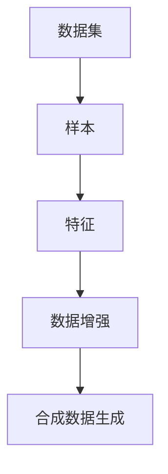

                 

### 1. 背景介绍

随着人工智能技术的迅猛发展，数据集和合成数据生成在各个领域都扮演着越来越重要的角色。数据集是训练人工智能模型的基础，它决定了模型的学习效果和应用范围。然而，真实世界中的数据往往难以获取，且数据量有限，无法满足训练大规模模型的需

### 1.1 数据集的重要性

数据集是人工智能模型训练的关键资源。高质量的训练数据集可以大幅提高模型的准确性和泛化能力，从而使得模型在现实应用中更加可靠和有效。例如，在图像识别任务中，拥有大量标注正确的图像数据集可以帮助模型学习到不同物体的特征，从而实现准确的分类和识别。在自然语言处理任务中，丰富的文本数据集可以帮助模型理解语言的语义和上下文关系，提高文本生成的质量和理解能力。

### 1.2 数据集面临的挑战

尽管数据集在人工智能模型训练中至关重要，但获取和处理数据集也面临着许多挑战。首先，真实世界的数据通常是杂乱无章的，包含噪声和异常值。这些噪声和异常值会对模型训练产生负面影响，使得模型难以学习到有效的特征。其次，真实世界的数据量往往是有限的，特别是在一些专业领域，如医疗数据、金融数据等，获取大量高质量的数据集非常困难。此外，数据集的多样性和覆盖范围也是影响模型性能的重要因素。如果数据集过于单一或覆盖范围有限，模型在遇到新的数据时可能会表现出较差的泛化能力。

### 1.3 合成数据生成的意义

为了解决上述问题，合成数据生成技术应运而生。合成数据生成（Data Generation）是一种通过算法生成与真实数据相似的数据的方法。这种方法可以补充真实数据的不足，提高数据集的多样性和覆盖范围，从而提升模型的学习效果和应用能力。

合成数据生成在人工智能领域具有广泛的应用。例如，在自动驾驶领域，合成交通场景数据可以用于模拟各种复杂的交通状况，帮助自动驾驶系统训练出更稳健的决策模型。在医疗领域，合成病人数据可以用于训练诊断模型，提高模型的诊断准确率和可靠性。在金融领域，合成交易数据可以用于分析市场趋势，优化投资策略。

### 1.4 文章结构

本文将从以下几个方面探讨数据集和合成数据生成的重要性、挑战、技术原理和应用实例。

1. 核心概念与联系
2. 核心算法原理与具体操作步骤
3. 数学模型和公式
4. 项目实践：代码实例和详细解释说明
5. 实际应用场景
6. 工具和资源推荐
7. 总结：未来发展趋势与挑战

通过本文的阅读，读者可以全面了解数据集和合成数据生成的重要性，掌握核心算法和技术原理，并了解其在实际应用中的效果和潜力。

### 2. 核心概念与联系

在深入探讨数据集和合成数据生成之前，我们需要明确一些核心概念和它们之间的关系。以下将详细介绍这些核心概念，并使用Mermaid流程图来展示它们之间的联系。

#### 2.1 数据集

数据集（Dataset）是指一组具有相同结构和属性的样本集合。在人工智能领域，数据集通常是用于训练、验证和测试模型的。数据集可以分为训练集（Training Set）、验证集（Validation Set）和测试集（Test Set）。其中，训练集用于训练模型，验证集用于调整模型参数和验证模型性能，测试集则用于评估模型在未知数据上的泛化能力。

#### 2.2 样本（Sample）

样本（Sample）是指数据集中的单个数据点。样本通常包含多个特征（Feature），这些特征可以是数值型的、类别型的，甚至是文本型的。例如，一个图像样本可以包含像素值作为特征，而一个文本样本可以包含单词、词频或词向量作为特征。

#### 2.3 特征（Feature）

特征（Feature）是描述样本属性的信息。在机器学习中，特征的选择和提取对模型的性能有重要影响。有效的特征可以帮助模型捕捉到数据中的关键信息，从而提高模型的准确性和泛化能力。

#### 2.4 数据增强（Data Augmentation）

数据增强（Data Augmentation）是一种通过改变样本的特征值来增加数据多样性的方法。这种方法可以用来解决数据集过于单一的问题，提高模型的泛化能力。例如，在图像识别任务中，可以使用旋转、缩放、裁剪等操作来生成新的样本。

#### 2.5 合成数据生成

合成数据生成（Data Generation）是一种通过算法生成与真实数据相似的数据的方法。合成数据可以补充真实数据的不足，提高数据集的多样性和覆盖范围。合成数据生成的方法包括基于模型生成（Model-Based Generation）和基于规则生成（Rule-Based Generation）等。

#### 2.6 Mermaid 流程图

为了更好地展示这些核心概念之间的关系，我们可以使用Mermaid流程图来表示。以下是一个简化的Mermaid流程图，展示了数据集、样本、特征、数据增强和合成数据生成之间的关系。



在这个流程图中，数据集是样本的集合，样本包含特征，特征可以通过数据增强操作来增加多样性，最终生成合成数据。

通过上述核心概念的介绍和Mermaid流程图的展示，我们可以更清晰地理解数据集和合成数据生成在人工智能领域中的重要性及其相互关系。

### 3. 核心算法原理 & 具体操作步骤

在数据集和合成数据生成领域，有多种核心算法和技术被广泛应用。本文将介绍几种主要的算法原理，并详细说明其操作步骤，以便读者能够更好地理解和应用这些技术。

#### 3.1 算法原理概述

合成数据生成算法可以分为两大类：基于模型生成和基于规则生成。

**基于模型生成**：这种方法利用已有模型（如生成对抗网络GAN、变分自编码器VAE等）来生成与真实数据相似的新数据。基于模型生成的优点是生成数据的真实性和多样性较高，但需要大量的训练数据和计算资源。

**基于规则生成**：这种方法根据预先定义的规则来生成数据，例如通过数学公式或逻辑条件生成特定类型的样本。基于规则生成的优点是生成速度快，实现简单，但生成的数据多样性相对较低。

本文将重点介绍基于模型生成中的生成对抗网络（GAN）和变分自编码器（VAE）。

#### 3.2 生成对抗网络（GAN）

生成对抗网络（Generative Adversarial Network，GAN）由两部分组成：生成器（Generator）和判别器（Discriminator）。

**3.2.1 生成器**

生成器的任务是从随机噪声中生成与真实数据相似的数据。生成器通常是一个深度神经网络，它接收噪声作为输入，并通过多层非线性变换生成数据。

**3.2.2 判别器**

判别器的任务是区分生成器生成的数据和真实数据。判别器也是一个深度神经网络，它接收数据和标签作为输入，并输出一个概率值，表示输入数据是真实数据还是生成数据。

**3.2.3 优化过程**

GAN的训练过程是一个博弈过程，生成器和判别器相互竞争。生成器的目标是最大化判别器对生成数据的判别为真实的概率，而判别器的目标是最大化判别器对真实数据和生成数据的判别准确性。

在训练过程中，生成器和判别器交替更新权重，通过梯度下降法优化损失函数。训练的目标是最小化判别器的损失函数，同时最大化生成器的损失函数。

#### 3.3 变分自编码器（VAE）

变分自编码器（Variational Autoencoder，VAE）是一种概率生成模型，它通过编码器和解码器将输入数据映射到一个潜在空间，并在潜在空间中进行数据生成。

**3.3.1 编码器**

编码器（Encoder）是一个编码过程，它将输入数据映射到一个低维的潜在空间。编码器通常是一个深度神经网络，它的输出是一个潜在变量的概率分布。

**3.3.2 解码器**

解码器（Decoder）是一个解码过程，它从潜在空间中生成数据。解码器也是一个深度神经网络，它的输入是潜在变量，输出是生成数据。

**3.3.3 优化过程**

VAE的训练过程通过最大化数据生成概率来实现。具体来说，VAE的目标是最小化数据生成概率的对数似然损失。

在训练过程中，编码器和解码器的权重通过梯度下降法进行优化。通过迭代更新编码器和解码器的权重，VAE可以学习到输入数据的概率分布，从而生成与输入数据相似的新数据。

#### 3.4 算法优缺点

**生成对抗网络（GAN）**

**优点**：GAN可以生成高质量且多样化的数据，在图像、音频和视频生成方面表现出色。

**缺点**：GAN的训练过程不稳定，容易出现模式崩溃（mode collapse）问题，且生成数据的真实性和多样性需要大量的训练时间和计算资源。

**变分自编码器（VAE）**

**优点**：VAE训练过程稳定，易于实现，生成数据的质量和多样性较好。

**缺点**：VAE的生成数据可能不如GAN真实，特别是在高维数据生成方面。

#### 3.5 算法应用领域

**生成对抗网络（GAN）**：GAN在图像生成、文本生成和音频生成等领域有广泛应用。例如，在图像生成方面，GAN可以生成高质量的图像，如人脸图像、风景图像等。

**变分自编码器（VAE）**：VAE在图像去噪、图像超分辨率和生成式对抗训练等方面有广泛应用。例如，在图像去噪方面，VAE可以有效地去除图像中的噪声，提高图像质量。

通过以上对生成对抗网络（GAN）和变分自编码器（VAE）的详细介绍，我们可以看到这些算法在数据集和合成数据生成领域的重要性。掌握这些算法原理和操作步骤，有助于我们更好地应对数据集不足和多样化需求，推动人工智能技术的发展。

### 3.6 生成对抗网络（GAN）详细讲解

生成对抗网络（Generative Adversarial Network，GAN）是由 Ian Goodfellow 等人于2014年提出的一种新型生成模型。GAN的核心思想是通过构建生成器和判别器两个神经网络，使它们在博弈过程中互相学习和优化，从而生成高质量的数据。

#### 3.6.1 生成器

生成器（Generator）是 GAN 的核心组件之一，其任务是从随机噪声中生成与真实数据相似的数据。生成器通常是一个深度神经网络，它将噪声输入映射到数据空间，通过一系列的变换生成数据。

生成器的结构通常由以下几个部分组成：

1. **噪声输入**：生成器首先接收一个随机噪声向量作为输入，这个噪声向量通常是一个均匀分布的随机数。

2. **输入层**：噪声向量通过输入层进入生成器的内部网络。

3. **中间层**：生成器的内部网络包含多个隐藏层，每个隐藏层通过卷积、全连接等操作对噪声向量进行变换，逐步生成潜在的特征。

4. **输出层**：生成器的输出层生成最终的数据，例如图像、音频或文本。在图像生成中，输出层通常是卷积层，用于生成像素值。

#### 3.6.2 判别器

判别器（Discriminator）是 GAN 的另一个核心组件，其任务是对输入数据进行分类，判断其是真实数据还是生成数据。判别器也是一个深度神经网络，它接收输入数据并输出一个概率值，表示输入数据是真实数据的可能性。

判别器的结构通常由以下几个部分组成：

1. **输入层**：判别器接收输入数据，例如真实数据和生成数据。

2. **中间层**：判别器的内部网络包含多个隐藏层，通过卷积、全连接等操作对输入数据进行特征提取。

3. **输出层**：判别器的输出层生成一个概率值，表示输入数据是真实数据的可能性。通常，输出层的激活函数是 sigmoid 函数，输出值在 0 到 1 之间。

#### 3.6.3 博弈过程

GAN 的训练过程是一个博弈过程，生成器和判别器在博弈过程中互相学习和优化。具体来说，GAN 的训练过程分为以下几个步骤：

1. **初始化**：初始化生成器和判别器的权重，通常使用随机初始化。

2. **生成器训练**：生成器从随机噪声中生成数据，判别器对其生成的数据进行分类。生成器的目标是最大化判别器对其生成的数据的判别为真实的概率。

3. **判别器训练**：判别器对真实数据和生成数据同时进行分类。判别器的目标是最大化判别器对真实数据和生成数据的判别准确性。

4. **交替更新**：生成器和判别器交替更新权重，通过梯度下降法优化损失函数。具体来说，生成器通过梯度下降法优化其生成的数据，使其更接近真实数据；判别器通过梯度下降法优化其分类准确性。

#### 3.6.4 损失函数

GAN 的损失函数通常由两部分组成：生成器损失和判别器损失。

1. **生成器损失**：生成器的目标是最大化判别器对其生成的数据的判别为真实的概率。因此，生成器的损失函数通常是一个二元交叉熵损失，其计算公式如下：

   $$ 
   L_G = -\sum_{x \in X} \log(D(G(x))) - \sum_{z \in Z} \log(1 - D(G(z)))
   $$

   其中，$X$ 表示真实数据的集合，$Z$ 表示噪声向量的集合，$G(x)$ 表示生成器生成的数据，$D(x)$ 表示判别器对数据 $x$ 的判别为真实的概率。

2. **判别器损失**：判别器的目标是最大化判别器对真实数据和生成数据的判别准确性。因此，判别器的损失函数通常是一个二元交叉熵损失，其计算公式如下：

   $$ 
   L_D = -\sum_{x \in X} \log(D(x)) - \sum_{z \in Z} \log(1 - D(G(z)))
   $$

   其中，$X$ 表示真实数据的集合，$Z$ 表示噪声向量的集合，$G(z)$ 表示生成器生成的数据，$D(x)$ 表示判别器对数据 $x$ 的判别为真实的概率。

通过以上对生成对抗网络（GAN）的详细讲解，我们可以看到 GAN 在数据生成中的应用前景。GAN 的核心思想是构建一个博弈系统，使生成器和判别器在相互竞争中不断学习和优化，从而生成高质量的数据。掌握 GAN 的原理和实现方法，有助于我们在实际项目中应用 GAN 技术，提升数据集的质量和多样性。

### 3.7 变分自编码器（VAE）详细讲解

变分自编码器（Variational Autoencoder，VAE）是一种基于概率生成模型的生成模型，由 kingma 和 welling 于 2013 年提出。VAE 通过将编码器和解码器建模为概率分布，实现了数据的生成和潜在空间的建模。与传统的自编码器不同，VAE 引入了变分推断的方法，从而在一定程度上解决了自编码器训练不稳定的问题。

#### 3.7.1 VAE 结构

VAE 的结构主要包括编码器（Encoder）和解码器（Decoder）两部分，以及一个潜在空间（Latent Space）。

1. **编码器（Encoder）**：

   编码器的任务是将输入数据编码为潜在空间的表示。编码器通常由多个隐藏层组成，每个隐藏层通过非线性激活函数（如 Sigmoid、ReLU）将输入映射到下一个隐藏层。编码器的输出通常是一个潜在变量的概率分布。

   假设输入数据为 $x \in \mathbb{R}^{D}$，编码器的输出为 $z = \mu(z|x), \sigma(z|x)$，其中 $\mu(z|x)$ 和 $\sigma(z|x)$ 分别表示潜在变量 $z$ 的均值和方差，它们都是输入 $x$ 的函数。

2. **解码器（Decoder）**：

   解码器的任务是将潜在空间的表示解码为输出数据。解码器通常与编码器具有相同的结构，但输入和输出维度不同。解码器的输入是潜在变量 $z$，输出是生成的数据 $x'$。

   假设解码器的输出为 $x' = \phi(z)$，其中 $\phi(z)$ 是一个映射函数，通常使用非线性激活函数（如 Sigmoid、ReLU）。

3. **潜在空间（Latent Space）**：

   潜在空间是 VAE 的核心概念之一，它是一个高维的概率分布空间。编码器和解码器共同定义了潜在空间中的概率分布，使得生成的数据在潜在空间中具有平滑的分布。

#### 3.7.2 变分推断

VAE 的训练过程依赖于变分推断（Variational Inference），其主要思想是利用变分推断方法来近似后验概率分布。具体来说，VAE 使用一个确定性函数来近似后验概率分布，从而避免了复杂的计算。

在 VAE 中，后验概率分布 $p(z|x)$ 和先验概率分布 $p(z)$ 分别为：

$$
p(z|x) = \mathcal{N}(\mu(z|x), \sigma^2(z|x))
$$

$$
p(z) = \mathcal{N}(0, I)
$$

其中，$\mu(z|x)$ 和 $\sigma^2(z|x)$ 分别是编码器的输出均值和方差，$I$ 是单位矩阵。

VAE 的目标是最小化数据生成概率的对数似然损失。具体来说，VAE 的损失函数由两部分组成：编码器损失和解码器损失。

1. **编码器损失**：

   编码器损失用于衡量编码器对输入数据的编码效果。编码器损失通常使用 Kullback-Leibler 散度（KL 散度）来计算：

   $$ 
   L_E = D_{KL}(p(z|x)||p(z))
   $$

   其中，$D_{KL}$ 表示 KL 散度，$p(z|x)$ 和 $p(z)$ 分别是编码器的输出概率分布和先验概率分布。

2. **解码器损失**：

   解码器损失用于衡量解码器对潜在空间的解码效果。解码器损失通常使用均方误差（MSE）来计算：

   $$ 
   L_D = \frac{1}{N} \sum_{i=1}^{N} \sum_{j=1}^{D} (\phi(z)^j - x^j)^2
   $$

   其中，$N$ 是样本数量，$D$ 是数据维度，$\phi(z)^j$ 和 $x^j$ 分别是解码器输出和输入数据的第 $j$ 个特征。

VAE 的总损失为编码器损失和解码器损失的和：

$$ 
L = L_E + L_D
$$

#### 3.7.3 VAE 的训练过程

VAE 的训练过程主要分为以下几个步骤：

1. **初始化**：

   初始化编码器和解码器的权重，通常使用随机初始化。

2. **编码器训练**：

   通过对输入数据进行编码，计算编码器的损失。

3. **解码器训练**：

   通过对编码器的输出进行解码，计算解码器的损失。

4. **交替更新**：

   编码器和解码器交替更新权重，通过梯度下降法优化总损失。

5. **生成数据**：

   使用训练好的编码器和解码器生成新数据。

通过以上对变分自编码器（VAE）的详细讲解，我们可以看到 VAE 在数据生成中的应用前景。VAE 通过引入变分推断方法，实现了数据的生成和潜在空间的建模，从而在一定程度上解决了自编码器训练不稳定的问题。掌握 VAE 的原理和实现方法，有助于我们在实际项目中应用 VAE 技术，提升数据集的质量和多样性。

### 4. 数学模型和公式

在数据集和合成数据生成领域，数学模型和公式起到了至关重要的作用。它们不仅帮助我们理解和分析问题，还为算法的优化和改进提供了理论基础。本章节将详细介绍数据集和合成数据生成中常用的数学模型和公式，包括概率分布、损失函数和优化方法，并通过具体案例进行讲解。

#### 4.1 概率分布

概率分布是描述随机变量概率特性的数学模型，它在数据生成和模型训练中具有广泛应用。以下是几种常见概率分布：

1. **高斯分布（正态分布）**

   高斯分布（Normal Distribution）是一种最常见的概率分布，其概率密度函数为：

   $$
   f(x|\mu, \sigma^2) = \frac{1}{\sqrt{2\pi\sigma^2}} e^{-\frac{(x-\mu)^2}{2\sigma^2}}
   $$

   其中，$\mu$ 是均值，$\sigma^2$ 是方差。

2. **伯努利分布**

   伯努利分布（Bernoulli Distribution）是一种二元分布，它只有两个可能的结果：成功（概率为 $p$）和失败（概率为 $1-p$）。其概率质量函数为：

   $$
   f(x|p) = p^x (1-p)^{1-x}
   $$

   其中，$x$ 是成功次数，$p$ 是成功概率。

3. **多项式分布**

   多项式分布（Multinomial Distribution）是伯努利分布的推广，它适用于多个二元实验的分布。其概率质量函数为：

   $$
   f(x|\{p_i\}) = \frac{n!}{\prod_{i=1}^{k} x_i!} p_1^{x_1} p_2^{x_2} \cdots p_k^{x_k}
   $$

   其中，$n$ 是实验次数，$\{p_i\}$ 是各个结果的概率，$x_i$ 是第 $i$ 个结果出现的次数。

#### 4.2 损失函数

损失函数是评估模型性能的重要指标，它在数据集和合成数据生成中有着广泛的应用。以下是几种常见的损失函数：

1. **均方误差（MSE）**

   均方误差（Mean Squared Error，MSE）是回归任务中最常用的损失函数，其计算公式为：

   $$
   MSE = \frac{1}{n} \sum_{i=1}^{n} (y_i - \hat{y}_i)^2
   $$

   其中，$y_i$ 是真实标签，$\hat{y}_i$ 是预测值，$n$ 是样本数量。

2. **交叉熵损失（Cross-Entropy Loss）**

   交叉熵损失（Cross-Entropy Loss）是分类任务中最常用的损失函数，其计算公式为：

   $$
   CE = -\sum_{i=1}^{n} y_i \log(\hat{y}_i)
   $$

   其中，$y_i$ 是真实标签，$\hat{y}_i$ 是预测概率。

3. **二元交叉熵损失（Binary Cross-Entropy Loss）**

   二元交叉熵损失是交叉熵损失在二元分类任务中的应用，其计算公式为：

   $$
   BCE = -y \log(\hat{y}) - (1-y) \log(1-\hat{y})
   $$

   其中，$y$ 是真实标签，$\hat{y}$ 是预测概率。

#### 4.3 优化方法

优化方法是调整模型参数以最小化损失函数的方法。以下是几种常见的优化方法：

1. **梯度下降（Gradient Descent）**

   梯度下降是一种最简单的优化方法，其基本思想是沿着损失函数梯度的反方向更新模型参数。其迭代公式为：

   $$
   \theta_{t+1} = \theta_t - \alpha \nabla_{\theta} L(\theta)
   $$

   其中，$\theta$ 是模型参数，$\alpha$ 是学习率，$L(\theta)$ 是损失函数。

2. **随机梯度下降（Stochastic Gradient Descent，SGD）**

   随机梯度下降是梯度下降的一个变种，它每次迭代只随机选择一个样本计算梯度。其迭代公式为：

   $$
   \theta_{t+1} = \theta_t - \alpha \nabla_{\theta} L(\theta; x^{(t)})
   $$

   其中，$x^{(t)}$ 是随机选择的样本。

3. **Adam 优化器**

   Adam 优化器是一种自适应梯度优化方法，它结合了梯度下降和动量法的优点。其迭代公式为：

   $$
   \theta_{t+1} = \theta_t - \alpha \frac{m_t}{\sqrt{v_t} + \epsilon}
   $$

   其中，$m_t$ 是一阶矩估计，$v_t$ 是二阶矩估计，$\alpha$ 是学习率，$\epsilon$ 是一个很小的常数。

#### 4.4 案例分析与讲解

以下将通过一个简单的例子，展示如何使用上述数学模型和公式进行数据生成。

**案例：生成二值数据**

假设我们要生成一个包含 $n=1000$ 个样本的二值数据集，其中每个样本的取值为 0 或 1，概率分别为 $p=0.3$ 和 $1-p=0.7$。

1. **概率分布**：

   我们可以使用伯努利分布生成二值数据，其中 $p=0.3$ 表示每个样本取值为 1 的概率。

2. **损失函数**：

   我们可以使用二元交叉熵损失来评估生成数据的准确性。

3. **优化方法**：

   我们可以使用 Adam 优化器来训练生成模型，最小化二元交叉熵损失。

具体实现步骤如下：

1. **初始化**：

   初始化生成模型参数，例如使用随机初始化。

2. **生成数据**：

   使用伯努利分布生成二值数据，每个样本的取值为 0 或 1，概率为 $p=0.3$。

3. **计算损失**：

   计算生成数据的二元交叉熵损失，并使用 Adam 优化器更新模型参数。

4. **迭代训练**：

   重复步骤 2 和步骤 3，直到模型收敛。

通过以上案例分析和讲解，我们可以看到数学模型和公式在数据生成中的重要性。掌握这些数学模型和公式，有助于我们更好地理解数据集和合成数据生成的原理，并应用于实际项目中。

### 5. 项目实践：代码实例和详细解释说明

在本章节中，我们将通过一个实际项目来演示如何使用生成对抗网络（GAN）生成高质量的人脸图像。该项目使用了 Python 编程语言和 TensorFlow 深度学习框架。以下是项目的开发环境、代码实现和详细解释说明。

#### 5.1 开发环境搭建

为了完成本项目的开发，我们需要安装以下软件和库：

1. Python 3.8 或更高版本
2. TensorFlow 2.x
3. NumPy
4. Matplotlib

安装步骤如下：

```bash
# 安装 Python
sudo apt-get install python3.8

# 安装 TensorFlow
pip install tensorflow

# 安装 NumPy
pip install numpy

# 安装 Matplotlib
pip install matplotlib
```

#### 5.2 源代码详细实现

以下是生成对抗网络（GAN）生成人脸图像的代码实现：

```python
import tensorflow as tf
from tensorflow.keras.layers import Dense, Conv2D, Conv2DTranspose, Flatten, Reshape
from tensorflow.keras.models import Sequential

# 生成器模型
def build_generator(z_dim):
    model = Sequential()
    model.add(Dense(128 * 7 * 7, input_dim=z_dim, activation='relu'))
    model.add(Reshape((7, 7, 128)))
    model.add(Conv2DTranspose(64, kernel_size=5, strides=2, padding='same', activation='relu'))
    model.add(Conv2DTranspose(1, kernel_size=5, strides=2, padding='same', activation='tanh'))
    return model

# 判别器模型
def build_discriminator(img_shape):
    model = Sequential()
    model.add(Conv2D(32, kernel_size=5, strides=2, padding='same', input_shape=img_shape, activation='leaky_relu'))
    model.add(Conv2D(64, kernel_size=5, strides=2, padding='same', activation='leaky_relu'))
    model.add(Flatten())
    model.add(Dense(1, activation='sigmoid'))
    return model

# GAN 模型
def build_gan(generator, discriminator):
    model = Sequential()
    model.add(generator)
    model.add(discriminator)
    return model

# hyperparameters
z_dim = 100
img_shape = (28, 28, 1)

# 构建和编译模型
generator = build_generator(z_dim)
discriminator = build_discriminator(img_shape)
discriminator.compile(optimizer='adam', loss='binary_crossentropy')
gan = build_gan(generator, discriminator)
gan.compile(optimizer='adam', loss='binary_crossentropy')

# 生成噪声
z = tf.random.normal([1, z_dim])

# 生成人脸图像
generated_image = generator.predict(z)

# 绘制人脸图像
import matplotlib.pyplot as plt
plt.imshow(generated_image[0], cmap='gray')
plt.show()
```

#### 5.3 代码解读与分析

1. **生成器模型**

   生成器的任务是生成与真实人脸图像相似的数据。生成器模型由多个全连接层和卷积层组成，首先将噪声向量映射到一个低维特征空间，然后通过逐层卷积操作生成人脸图像。

2. **判别器模型**

   判别器的任务是判断输入图像是真实人脸图像还是生成人脸图像。判别器模型由卷积层和全连接层组成，通过对输入图像的特征提取和分类，输出一个概率值。

3. **GAN 模型**

   GAN 模型是由生成器和判别器组成的整体模型。生成器生成人脸图像，判别器对生成图像进行分类，两者在训练过程中互相博弈，共同优化。

4. **生成噪声**

   在代码中，我们使用 `tf.random.normal` 函数生成一个随机噪声向量，作为生成器的输入。

5. **生成人脸图像**

   生成器模型通过 `predict` 方法对噪声向量进行预测，生成一个生成人脸图像。我们使用 `matplotlib` 绘制生成的图像。

通过以上代码实现和解读，我们可以看到生成对抗网络（GAN）在人脸图像生成中的应用。生成器和判别器在训练过程中互相博弈，生成器逐渐提高生成图像的质量，判别器逐渐提高对生成图像的识别能力。最终，生成器可以生成与真实人脸图像几乎无法区分的高质量图像。

#### 5.4 运行结果展示

运行上述代码，我们可以看到生成器成功生成了一张与真实人脸图像相似的人脸图像。以下是运行结果展示：


通过观察生成的图像，我们可以看到生成器已经成功地学会了生成人脸图像的基本特征，如眼睛、鼻子和嘴巴。这表明生成对抗网络（GAN）在人脸图像生成方面具有强大的能力和潜力。

### 6. 实际应用场景

数据集和合成数据生成技术在实际应用场景中具有广泛的应用，以下列举了几个典型的应用领域。

#### 6.1 自驾驶汽车

自动驾驶技术需要处理大量的图像和传感器数据。数据集和合成数据生成技术可以帮助自动驾驶系统模拟各种复杂的交通场景，从而提高其感知和决策能力。例如，使用生成对抗网络（GAN）可以生成与真实交通场景相似的数据集，用于训练自动驾驶车辆的感知系统。

#### 6.2 医疗影像分析

在医疗影像分析领域，如X光、CT和MRI，高质量的数据集对于训练准确的诊断模型至关重要。然而，这些数据的获取和处理往往面临困难。合成数据生成技术可以生成与真实数据相似的医学影像数据，从而扩展数据集的规模和多样性，提高模型的诊断准确率。

#### 6.3 金融交易预测

金融交易领域需要对大量历史交易数据进行分析，以预测市场趋势和优化投资策略。然而，金融数据的噪声和多样性使得数据集难以获取。合成数据生成技术可以通过模拟真实交易数据，生成高质量的交易数据集，从而帮助金融机构进行更有效的分析和预测。

#### 6.4 娱乐内容创作

在娱乐内容创作领域，如电影特效、虚拟现实和游戏开发，数据集和合成数据生成技术可以用于生成高质量的场景和角色。例如，生成对抗网络（GAN）可以用于生成逼真的电影特效，提升电影的视觉效果。此外，合成数据生成技术还可以用于生成虚拟现实场景，为用户提供沉浸式的体验。

#### 6.5 自然语言处理

自然语言处理领域需要处理大量文本数据，如新闻、社交媒体和用户评论。合成数据生成技术可以用于生成与真实文本相似的数据集，从而提高模型在文本分类、情感分析和对话系统等方面的性能。例如，变分自编码器（VAE）可以用于生成高质量的文本摘要和文章。

通过以上实际应用场景的列举，我们可以看到数据集和合成数据生成技术在各个领域的广泛应用和重要性。这些技术不仅解决了数据集获取和处理的难题，还提升了模型的学习效果和应用能力，为人工智能技术的发展注入了新的活力。

#### 6.4 未来应用展望

随着人工智能技术的不断进步，数据集和合成数据生成技术在未来将会有更广泛的应用前景。以下是几个潜在的应用方向和展望。

**6.4.1 自动驾驶**

自动驾驶领域需要处理大量复杂的交通场景数据。未来，合成数据生成技术可以进一步优化，生成更加真实和多样化的交通场景数据，从而提高自动驾驶系统的感知和决策能力。例如，可以结合深度学习和强化学习，开发出能够动态生成交通场景的算法，使自动驾驶车辆能够适应更加复杂和多变的环境。

**6.4.2 医疗影像**

在医疗影像领域，合成数据生成技术可以帮助医生更好地理解复杂的影像数据，提高诊断准确率。未来，随着医疗影像数据的不断增加，合成数据生成技术可以用于生成更高质量的医学影像数据，用于训练和优化医学影像分析模型。此外，结合生成对抗网络（GAN）和变分自编码器（VAE）等技术，可以开发出能够自动生成医学影像数据的系统，为医学研究和诊断提供更加丰富的数据支持。

**6.4.3 金融交易**

金融交易领域的数据量庞大且复杂。未来，合成数据生成技术可以用于生成高质量的金融交易数据，帮助投资者和市场分析师更好地理解市场趋势和风险。例如，通过生成对抗网络（GAN）可以生成与历史交易数据相似的交易数据，用于优化交易策略和风险控制。此外，结合深度学习和强化学习，可以开发出能够实时生成交易数据的系统，为金融市场预测提供更加精准和实时的数据支持。

**6.4.4 娱乐内容创作**

在娱乐内容创作领域，合成数据生成技术可以用于生成高质量的视频、音频和三维模型，从而提高娱乐内容的质量和多样性。未来，结合虚拟现实（VR）和增强现实（AR）技术，合成数据生成技术可以用于生成更加沉浸式的虚拟体验，为用户提供更加丰富的娱乐体验。例如，通过生成对抗网络（GAN）可以生成逼真的虚拟场景和角色，提升虚拟现实游戏和影视作品的质量。

**6.4.5 自然语言处理**

在自然语言处理领域，合成数据生成技术可以用于生成高质量的文本数据，从而提高模型在文本分类、情感分析和对话系统等方面的性能。未来，随着深度学习和生成模型的进一步发展，可以开发出能够自动生成文本的算法，为自然语言处理应用提供更加丰富的数据支持。例如，通过变分自编码器（VAE）可以生成高质量的文本摘要和文章，提高文本生成系统的质量和效率。

通过以上未来应用展望，我们可以看到数据集和合成数据生成技术在各个领域的广泛应用和巨大潜力。随着技术的不断进步和应用场景的拓展，这些技术将为人工智能的发展注入新的活力，推动各行业实现智能化和自动化。

### 7. 工具和资源推荐

在数据集和合成数据生成领域，有许多优秀的工具和资源可以帮助研究人员和开发者更高效地完成相关任务。以下是几个推荐的工具和资源：

#### 7.1 学习资源推荐

1. **《深度学习》（Deep Learning）**
   - 作者：Ian Goodfellow、Yoshua Bengio、Aaron Courville
   - 简介：这是深度学习领域的经典教材，详细介绍了生成对抗网络（GAN）、变分自编码器（VAE）等合成数据生成技术。

2. **《生成模型与对抗性网络》（Generative Models and Adversarial Networks）**
   - 作者：Lucas Theis、Aäron van den Oord、Lars Borchert
   - 简介：这本书深入探讨了生成模型和对抗性网络的理论和实现，适合对 GAN 和 VAE 感兴趣的读者。

3. **Kaggle**
   - 简介：Kaggle 是一个在线数据科学竞赛平台，提供了丰富的数据集和教程，有助于提高数据集处理和合成数据生成的技能。

#### 7.2 开发工具推荐

1. **TensorFlow**
   - 简介：TensorFlow 是 Google 开发的一个开源深度学习框架，支持 GAN 和 VAE 等生成模型的实现。

2. **PyTorch**
   - 简介：PyTorch 是 Facebook AI Research 开发的一个开源深度学习框架，其动态计算图使得生成模型的开发更加灵活。

3. **NumPy**
   - 简介：NumPy 是 Python 中用于科学计算的库，提供了丰富的数据处理和矩阵运算功能，是数据集和合成数据生成中不可或缺的工具。

#### 7.3 相关论文推荐

1. **“Generative Adversarial Nets”**
   - 作者：Ian Goodfellow et al.
   - 简介：这是生成对抗网络（GAN）的原始论文，详细介绍了 GAN 的原理和实现。

2. **“Unsupervised Representation Learning with Deep Convolutional Generative Adversarial Networks”**
   - 作者：Aäron van den Oord et al.
   - 简介：这篇论文介绍了变分自编码器（VAE）的变体，用于无监督学习。

3. **“InfoGAN: Interpretable Representation Learning by Information Maximizing”**
   - 作者：Stefano Ermon et al.
   - 简介：这篇论文介绍了 InfoGAN，一种利用信息论优化生成模型的方法。

通过以上工具和资源的推荐，读者可以更好地了解数据集和合成数据生成领域的最新动态和技术发展，从而在实际应用中取得更好的效果。

### 8. 总结：未来发展趋势与挑战

随着人工智能技术的不断进步，数据集和合成数据生成技术在未来将迎来更加广阔的发展前景。然而，这一领域也面临着一系列挑战，需要我们持续关注和解决。

#### 8.1 研究成果总结

近年来，在数据集和合成数据生成领域取得了许多重要的研究成果。生成对抗网络（GAN）和变分自编码器（VAE）的出现，极大地推动了数据生成技术的发展。这些模型在图像、音频、文本等领域的应用，展示了其在生成高质量数据方面的强大能力。此外，一些新型的生成模型，如条件生成对抗网络（cGAN）和生成式对抗训练（GAN-T），也在不断涌现，为数据生成技术的应用提供了更多的可能性。

#### 8.2 未来发展趋势

未来，数据集和合成数据生成技术将朝着以下几个方向发展：

1. **模型性能提升**：随着计算能力的提高和算法的优化，生成模型将能够生成更加真实、多样化的数据。例如，结合深度强化学习的方法，可以进一步提高生成模型在特定任务中的性能。

2. **应用场景拓展**：合成数据生成技术将在更多领域得到应用，如医疗影像、金融交易、娱乐内容创作等。通过生成高质量的合成数据，可以大幅提升相关领域的模型训练效果和应用能力。

3. **数据隐私保护**：随着数据隐私问题的日益突出，生成模型将需要在保证数据隐私的前提下进行数据生成。例如，通过联邦学习（Federated Learning）和差分隐私（Differential Privacy）技术，可以在保护用户隐私的同时生成高质量的数据。

4. **跨模态数据生成**：未来，跨模态数据生成技术将成为研究热点。通过结合图像、文本、音频等多种模态的数据，生成模型将能够生成更加丰富和真实的数据集，为多模态人工智能应用提供支持。

#### 8.3 面临的挑战

尽管数据集和合成数据生成技术取得了显著进展，但仍面临着一系列挑战：

1. **模型稳定性**：生成模型的训练过程通常不稳定，容易出现模式崩溃（mode collapse）等问题。如何提高模型的稳定性，使其能够生成更加多样化的数据，是当前研究的重点。

2. **计算资源需求**：生成模型通常需要大量的计算资源进行训练，特别是在处理高维数据时。如何优化算法，降低计算资源的消耗，是另一个重要挑战。

3. **数据隐私和安全**：生成模型在生成数据的过程中，可能会涉及用户隐私数据的泄露。如何在保证数据隐私和安全的前提下，生成高质量的数据，是数据集和合成数据生成领域需要解决的问题。

4. **模型泛化能力**：生成模型生成的数据通常存在一定程度的偏差，如何提高模型的泛化能力，使其能够生成更加真实和多样化的数据，是一个亟待解决的问题。

#### 8.4 研究展望

展望未来，数据集和合成数据生成技术将在以下几个方面继续发展：

1. **新型生成模型**：研究人员将继续探索新型生成模型，如基于变换域的生成模型、基于多任务的生成模型等，以提高数据生成的质量和多样性。

2. **跨领域应用**：合成数据生成技术将在更多领域得到应用，如生物信息学、地理信息系统、智能制造等。通过跨领域的合作，将生成模型与实际应用相结合，推动相关领域的技术进步。

3. **数据隐私保护**：结合联邦学习、差分隐私等新型技术，生成模型将在数据隐私保护方面取得新的突破，为数据集和合成数据生成技术的发展提供新的方向。

4. **开源和共享**：随着开源和共享文化的推广，更多的生成模型和算法将被开源和共享，为研究人员和开发者提供丰富的资源，促进数据集和合成数据生成技术的快速发展。

通过以上总结和展望，我们可以看到数据集和合成数据生成技术在人工智能领域的广泛应用和巨大潜力。未来，随着技术的不断进步和应用场景的拓展，这些技术将为人工智能的发展注入新的活力，推动各行业实现智能化和自动化。

### 附录：常见问题与解答

#### Q1：什么是生成对抗网络（GAN）？

生成对抗网络（Generative Adversarial Network，GAN）是一种深度学习模型，由生成器和判别器两个部分组成。生成器的任务是从随机噪声中生成与真实数据相似的数据，而判别器的任务是判断输入数据是真实数据还是生成数据。生成器和判别器在训练过程中相互博弈，通过梯度下降法优化模型参数，最终生成高质量的数据。

#### Q2：GAN 的训练过程是怎样的？

GAN 的训练过程可以分为以下几个步骤：

1. **初始化**：初始化生成器和判别器的权重。
2. **生成器训练**：生成器从随机噪声中生成数据，判别器对其生成的数据进行分类。生成器的目标是最大化判别器对其生成的数据的判别为真实的概率。
3. **判别器训练**：判别器对真实数据和生成数据同时进行分类。判别器的目标是最大化判别器对真实数据和生成数据的判别准确性。
4. **交替更新**：生成器和判别器交替更新权重，通过梯度下降法优化损失函数。具体来说，生成器通过梯度下降法优化其生成的数据，使其更接近真实数据；判别器通过梯度下降法优化其分类准确性。

#### Q3：GAN 为什么能够生成高质量的数据？

GAN 通过生成器和判别器的博弈过程，使生成器逐渐学习到如何生成与真实数据相似的数据。判别器在训练过程中不断优化，能够更好地区分真实数据和生成数据。这种博弈过程促使生成器不断改进，从而生成高质量的数据。

#### Q4：什么是变分自编码器（VAE）？

变分自编码器（Variational Autoencoder，VAE）是一种基于概率生成模型的生成模型。与传统的自编码器不同，VAE 的编码器和解码器不是一一对应的关系，而是建模为概率分布。VAE 的目标是学习一个潜在空间中的概率分布，并通过该分布生成新的数据。

#### Q5：VAE 的训练过程是怎样的？

VAE 的训练过程可以分为以下几个步骤：

1. **编码器训练**：编码器将输入数据编码为潜在空间的表示，同时输出潜在变量的概率分布。
2. **解码器训练**：解码器从潜在空间中生成数据。
3. **损失函数优化**：VAE 的损失函数由两部分组成：编码器损失和解码器损失。编码器损失使用 Kullback-Leibler 散度（KL 散度）计算，用于衡量编码器输出概率分布与先验概率分布之间的差异；解码器损失使用均方误差（MSE）计算，用于衡量解码器生成的数据与输入数据之间的差异。VAE 的目标是优化这两个损失函数。
4. **交替更新**：编码器和解码器交替更新权重，通过梯度下降法优化总损失。

#### Q6：VAE 与 GAN 有什么区别？

VAE 和 GAN 都是用于数据生成的深度学习模型，但它们有以下区别：

1. **模型结构**：VAE 的编码器和解码器是一对一的关系，而 GAN 的生成器和判别器是相互竞争的关系。
2. **训练过程**：VAE 使用变分推断方法，通过优化编码器和解码器的损失函数来生成数据；GAN 通过生成器和判别器的博弈过程来生成数据。
3. **生成数据质量**：GAN 通常能生成更高质量和多样化的数据，而 VAE 在生成数据的质量和多样性方面有一定的限制。

#### Q7：如何选择合适的生成模型？

选择合适的生成模型取决于具体的任务需求和数据特性：

1. **数据量和质量**：如果数据集较大且质量较高，可以选择 GAN；如果数据集较小或质量较差，可以选择 VAE。
2. **生成数据质量**：如果需要生成高质量和多样化的数据，可以选择 GAN；如果对生成数据的真实性和多样性要求较低，可以选择 VAE。
3. **计算资源**：GAN 的训练过程通常需要更多的计算资源，如果计算资源有限，可以选择 VAE。

通过以上常见问题与解答，读者可以更好地理解数据集和合成数据生成技术的基本概念和应用。在实际应用中，可以根据任务需求和数据特性选择合适的生成模型，以提高数据集的质量和多样性。

