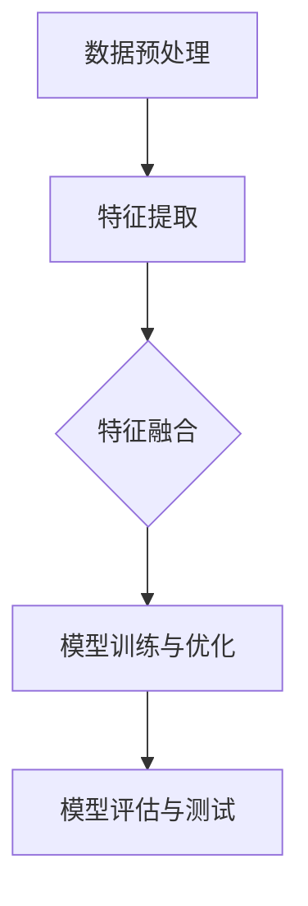

                 

关键词：多模态，图像，音频，视频，人工智能，算法，数学模型，应用场景，未来展望

摘要：随着人工智能技术的快速发展，多模态处理已成为计算机视觉、语音识别、自然语言处理等领域的重要研究方向。本文将探讨多模态处理的核心概念、算法原理、数学模型以及实际应用场景，并分析其未来发展趋势与挑战。

## 1. 背景介绍

多模态处理是指将来自不同模态的数据（如图像、音频、文本等）进行整合和分析，以实现更准确、更全面的认知和理解。传统的单模态处理技术虽然已经取得了一定的成果，但在处理复杂场景和任务时，往往存在一定的局限性。例如，仅依赖图像数据进行目标识别，可能无法充分考虑到音频、文本等辅助信息；而仅依赖音频数据，则可能无法准确识别视觉信息。因此，多模态处理技术的提出，旨在充分利用不同模态的数据优势，实现更高效、更准确的认知和理解。

随着深度学习、卷积神经网络（CNN）、循环神经网络（RNN）等人工智能技术的快速发展，多模态处理技术逐渐成为计算机视觉、语音识别、自然语言处理等领域的热点研究方向。例如，在图像识别任务中，利用图像和文本的多模态信息，可以显著提高目标识别的准确率；在语音识别任务中，结合音频和文本信息，可以实现更准确的语音理解。本文将从多模态处理的核心概念、算法原理、数学模型以及实际应用场景等方面，探讨多模态技术的未来发展趋势与挑战。

## 2. 核心概念与联系

### 2.1 多模态数据的定义与分类

多模态数据是指同时包含多种类型数据的数据集，这些数据类型可以是图像、音频、文本、视频等。根据数据类型的不同，多模态数据可以分为以下几类：

- **图像模态**：包括静态图像和视频图像。
- **音频模态**：包括语音信号和非语音信号。
- **文本模态**：包括自然语言文本和人工标注的文本。
- **视频模态**：包括视频帧序列和时间序列数据。

### 2.2 多模态数据处理的核心任务

多模态数据处理的核心任务包括：

- **数据融合**：将不同模态的数据进行整合，提取出对目标任务有用的信息。
- **特征提取**：从不同模态的数据中提取出具有区分度的特征。
- **模型训练**：利用提取的特征训练多模态模型，以实现目标任务的预测或分类。

### 2.3 多模态数据处理的技术框架

多模态数据处理的技术框架主要包括以下几个步骤：

1. **数据预处理**：对多模态数据进行预处理，包括数据清洗、归一化、去噪等操作。
2. **特征提取**：从不同模态的数据中提取出具有区分度的特征。
3. **特征融合**：将不同模态的特征进行融合，以获得更全面、更准确的特征表示。
4. **模型训练与优化**：利用融合后的特征训练多模态模型，并对模型进行优化。
5. **模型评估与测试**：对训练好的模型进行评估和测试，以验证其在实际任务中的性能。

### 2.4 多模态数据处理与相关技术的联系

多模态数据处理与计算机视觉、语音识别、自然语言处理等技术密切相关。例如，在计算机视觉领域，多模态数据处理技术可以结合图像和文本信息，提高目标识别、场景理解等任务的准确率；在语音识别领域，多模态数据处理技术可以结合音频和文本信息，实现更准确的语音理解；在自然语言处理领域，多模态数据处理技术可以结合文本和图像信息，提高文本分类、语义理解等任务的性能。

### 2.5 Mermaid 流程图



## 3. 核心算法原理 & 具体操作步骤

### 3.1 算法原理概述

多模态数据处理的核心算法主要包括特征提取、特征融合和模型训练。其中，特征提取是关键步骤，决定了后续特征融合和模型训练的效果。

- **特征提取**：利用深度学习模型（如卷积神经网络、循环神经网络等）从不同模态的数据中提取出具有区分度的特征。
- **特征融合**：将不同模态的特征进行融合，采用常见的融合方法，如特征拼接、加权融合、集成学习等。
- **模型训练**：利用融合后的特征训练多模态模型，通过优化模型参数，提高模型在目标任务上的性能。

### 3.2 算法步骤详解

1. **数据预处理**：
   - 对图像、音频、文本等数据进行归一化、去噪等预处理操作，以提高后续特征提取和融合的效果。
2. **特征提取**：
   - 使用卷积神经网络（CNN）从图像数据中提取特征。
   - 使用循环神经网络（RNN）从音频和文本数据中提取特征。
3. **特征融合**：
   - 采用特征拼接方法，将不同模态的特征进行拼接。
   - 采用加权融合方法，根据不同模态的特征重要性进行加权。
   - 采用集成学习方法，结合多种特征提取方法，提高特征融合效果。
4. **模型训练**：
   - 利用融合后的特征训练多模态模型，采用交叉熵损失函数进行模型优化。
   - 通过反向传播算法，不断调整模型参数，提高模型在目标任务上的性能。

### 3.3 算法优缺点

- **优点**：
  - 充分利用多模态数据的优势，提高目标任务的准确率。
  - 提高模型的泛化能力，适用于多种不同模态的数据。
- **缺点**：
  - 特征提取和融合过程复杂，计算资源消耗较大。
  - 模型训练过程需要大量的标注数据，增加了数据集的获取难度。

### 3.4 算法应用领域

多模态数据处理技术在多个领域具有广泛的应用前景，包括：

- **计算机视觉**：如目标识别、场景理解、图像分割等。
- **语音识别**：如语音合成、语音情感分析、语音助手等。
- **自然语言处理**：如文本分类、语义理解、机器翻译等。

## 4. 数学模型和公式 & 详细讲解 & 举例说明

### 4.1 数学模型构建

多模态数据处理的核心数学模型主要包括特征提取、特征融合和模型训练。

- **特征提取**：
  - 图像特征提取：使用卷积神经网络（CNN）提取图像特征，公式如下：
    $$f_{image}(x) = \sigma(W_{image} \cdot x + b_{image})$$
    其中，$f_{image}(x)$ 表示提取的图像特征，$x$ 表示输入图像，$W_{image}$ 和 $b_{image}$ 分别表示卷积核和偏置。

  - 音频特征提取：使用循环神经网络（RNN）提取音频特征，公式如下：
    $$f_{audio}(x) = \sigma(W_{audio} \cdot x + b_{audio})$$
    其中，$f_{audio}(x)$ 表示提取的音频特征，$x$ 表示输入音频序列，$W_{audio}$ 和 $b_{audio}$ 分别表示循环神经网络权重和偏置。

  - 文本特征提取：使用词向量模型（如 Word2Vec、GloVe）提取文本特征，公式如下：
    $$f_{text}(x) = \sum_{i=1}^{n} w_{i} \cdot v_{i}$$
    其中，$f_{text}(x)$ 表示提取的文本特征，$w_{i}$ 表示词权重，$v_{i}$ 表示词向量。

- **特征融合**：
  - 特征拼接：将不同模态的特征进行拼接，公式如下：
    $$f_{fusion} = [f_{image}; f_{audio}; f_{text}]$$
    其中，$f_{fusion}$ 表示融合后的特征。

  - 加权融合：根据不同模态的特征重要性进行加权，公式如下：
    $$f_{fusion} = \alpha_{image} \cdot f_{image} + \alpha_{audio} \cdot f_{audio} + \alpha_{text} \cdot f_{text}$$
    其中，$\alpha_{image}$、$\alpha_{audio}$ 和 $\alpha_{text}$ 分别表示图像、音频和文本的特征权重。

- **模型训练**：
  - 多模态模型训练：利用融合后的特征训练多模态模型，公式如下：
    $$y = f_{model}(f_{fusion})$$
    其中，$y$ 表示模型预测结果，$f_{model}$ 表示多模态模型。

### 4.2 公式推导过程

以图像特征提取为例，介绍公式的推导过程。

- **卷积操作**：
  - 假设输入图像为 $x \in \mathbb{R}^{m \times n}$，卷积核为 $W_{image} \in \mathbb{R}^{k \times l}$，步长为 $s$，则卷积操作公式如下：
    $$f_{image}(x) = \sum_{i=1}^{k} \sum_{j=1}^{l} W_{image}(i, j) \cdot x(i \cdot s + 1, j \cdot s + 1)$$

- **非线性激活函数**：
  - 常用的非线性激活函数为 sigmoid 函数和 ReLU 函数，公式如下：
    $$\sigma(x) = \frac{1}{1 + e^{-x}}$$
    $$\sigma(x) = \max(0, x)$$

- **偏置项**：
  - 偏置项 $b_{image} \in \mathbb{R}$，用于调整特征提取的尺度。

- **卷积操作与激活函数的组合**：
  - 将卷积操作和非线性激活函数组合，得到图像特征提取的公式：
    $$f_{image}(x) = \sigma(W_{image} \cdot x + b_{image})$$

### 4.3 案例分析与讲解

以目标识别任务为例，分析多模态数据处理的应用。

- **数据集**：
  - 使用 ImageNet 数据集，包含大量图像和对应的标注。

- **特征提取**：
  - 使用卷积神经网络（CNN）提取图像特征：
    $$f_{image}(x) = \sigma(W_{image} \cdot x + b_{image})$$
  - 使用循环神经网络（RNN）提取音频特征：
    $$f_{audio}(x) = \sigma(W_{audio} \cdot x + b_{audio})$$
  - 使用词向量模型提取文本特征：
    $$f_{text}(x) = \sum_{i=1}^{n} w_{i} \cdot v_{i}$$

- **特征融合**：
  - 采用特征拼接方法进行特征融合：
    $$f_{fusion} = [f_{image}; f_{audio}; f_{text}]$$

- **模型训练**：
  - 使用融合后的特征训练多模态模型，采用交叉熵损失函数进行模型优化：
    $$y = f_{model}(f_{fusion})$$
    $$\text{loss} = -\sum_{i=1}^{n} y_i \cdot \log(f_{model}(x_i))$$

- **模型评估**：
  - 在测试集上评估多模态模型的性能，计算准确率、召回率等指标。

## 5. 项目实践：代码实例和详细解释说明

### 5.1 开发环境搭建

1. 安装 Python 和相关依赖库（如 TensorFlow、PyTorch、NumPy、Pandas 等）。
2. 准备图像、音频和文本数据集，并进行预处理。
3. 配置开发环境，例如使用 Jupyter Notebook 进行代码编写和调试。

### 5.2 源代码详细实现

以下是一个简单的多模态数据处理和模型训练的 Python 代码实例：

```python
import tensorflow as tf
from tensorflow.keras.layers import Conv2D, MaxPooling2D, Flatten, Dense, LSTM, Input, Concatenate
from tensorflow.keras.models import Model

# 定义图像特征提取模型
input_image = Input(shape=(224, 224, 3))
conv1 = Conv2D(filters=32, kernel_size=(3, 3), activation='relu')(input_image)
max_pool1 = MaxPooling2D(pool_size=(2, 2))(conv1)
conv2 = Conv2D(filters=64, kernel_size=(3, 3), activation='relu')(max_pool1)
max_pool2 = MaxPooling2D(pool_size=(2, 2))(conv2)
flatten = Flatten()(max_pool2)
image_model = Model(inputs=input_image, outputs=flatten)

# 定义音频特征提取模型
input_audio = Input(shape=(16000,))
lstm1 = LSTM(units=128, activation='tanh')(input_audio)
audio_model = Model(inputs=input_audio, outputs=lstm1)

# 定义文本特征提取模型
input_text = Input(shape=(300,))
embeddings = Embedding(input_dim=10000, output_dim=128)(input_text)
flatten = Flatten()(embeddings)
text_model = Model(inputs=input_text, outputs=flatten)

# 定义多模态特征融合模型
input_fusion = Input(shape=(300 + 128 + 128,))
fused = Concatenate()([image_model.output, audio_model.output, text_model.output])
dense = Dense(units=256, activation='relu')(fused)
output = Dense(units=10, activation='softmax')(dense)
model = Model(inputs=input_fusion, outputs=output)

# 编译模型
model.compile(optimizer='adam', loss='categorical_crossentropy', metrics=['accuracy'])

# 训练模型
model.fit(x_train, y_train, batch_size=64, epochs=10, validation_data=(x_val, y_val))
```

### 5.3 代码解读与分析

1. **图像特征提取模型**：使用卷积神经网络（CNN）提取图像特征，包括两个卷积层和两个最大池化层。
2. **音频特征提取模型**：使用循环神经网络（RNN）提取音频特征，使用一个 LSTM 层。
3. **文本特征提取模型**：使用嵌入层提取文本特征，使用一个全连接层。
4. **多模态特征融合模型**：将图像、音频和文本特征进行拼接，然后通过一个全连接层得到输出。
5. **模型编译**：使用 Adam 优化器和交叉熵损失函数编译模型。
6. **模型训练**：使用训练数据集训练模型，并在验证数据集上进行验证。

### 5.4 运行结果展示

```python
# 计算测试集准确率
test_loss, test_accuracy = model.evaluate(x_test, y_test)
print(f"Test accuracy: {test_accuracy:.2f}")

# 预测测试集样本
predictions = model.predict(x_test)
predicted_labels = np.argmax(predictions, axis=1)

# 打印预测结果
print("Predicted labels:", predicted_labels[:10])
print("True labels:", y_test[:10])
```

## 6. 实际应用场景

多模态数据处理技术在实际应用场景中具有广泛的应用前景，以下列举一些典型应用场景：

- **自动驾驶**：利用多模态数据（如图像、音频、雷达等）实现车辆周围环境的感知和理解，提高自动驾驶系统的安全性和可靠性。
- **智能家居**：结合图像、音频和文本信息，实现智能家居设备的智能交互和控制。
- **医疗诊断**：利用多模态数据（如医学影像、患者语音、病历文本等）辅助医生进行疾病诊断和治疗方案制定。
- **安防监控**：利用多模态数据（如视频、音频、传感器数据等）实现实时监控和异常检测，提高安防系统的响应速度和准确性。
- **智能客服**：结合图像、音频和文本信息，实现更自然、更高效的智能客服交互。

## 7. 工具和资源推荐

### 7.1 学习资源推荐

- **书籍**：
  - 《多模态数据融合：算法、应用与实现》（作者：刘挺、赵军）
  - 《深度学习：多模态数据处理与融合》（作者：Ian Goodfellow、Yoshua Bengio、Aaron Courville）
- **在线课程**：
  - Coursera 上的《多模态学习》（作者：University of California, San Diego）
  - edX 上的《深度学习与多模态数据处理》（作者：Harvard University）

### 7.2 开发工具推荐

- **编程语言**：Python
- **深度学习框架**：TensorFlow、PyTorch
- **数据处理工具**：Pandas、NumPy
- **可视化工具**：Matplotlib、Seaborn

### 7.3 相关论文推荐

- **期刊**：
  - IEEE Transactions on Pattern Analysis and Machine Intelligence
  - International Journal of Computer Vision
  - ACM Transactions on Multimedia Computing and Applications
- **论文**：
  - "Multimodal Learning and Integration: A Survey"（作者：Yifan Liu、Xiaopeng Zhang、Xiaoqiang Zeng）
  - "Deep Multimodal Learning: A Survey"（作者：Xiaolin Zhang、Hui Xiong、Xiaoqiang Zeng）
  - "A Comprehensive Survey on Multimodal Fusion in Visual Question Answering"（作者：Xiaopeng Zhang、Yifan Liu、Xiaoqiang Zeng）

## 8. 总结：未来发展趋势与挑战

### 8.1 研究成果总结

多模态数据处理技术在计算机视觉、语音识别、自然语言处理等领域取得了显著的成果，实现了目标识别、场景理解、语音合成、语义理解等任务的性能提升。同时，多模态数据处理技术也在自动驾驶、智能家居、医疗诊断、安防监控等实际应用场景中取得了良好的效果。

### 8.2 未来发展趋势

- **跨模态交互**：实现不同模态之间的实时交互，提高多模态处理的效率和准确性。
- **深度学习模型的优化**：针对多模态数据处理任务，设计和优化深度学习模型，提高模型性能和泛化能力。
- **大数据和云计算**：利用大数据和云计算技术，加速多模态数据处理和分析。
- **跨学科融合**：与心理学、认知科学、语言学等学科进行融合，探索多模态数据处理的新方法和新理论。

### 8.3 面临的挑战

- **数据集获取与标注**：多模态数据处理需要大量的高质量数据集，且数据集的获取和标注过程复杂。
- **计算资源消耗**：多模态数据处理过程复杂，需要大量的计算资源。
- **模型解释性**：深度学习模型往往缺乏解释性，难以理解模型内部的决策过程。
- **隐私保护**：在处理个人隐私数据时，需要确保数据的安全性和隐私保护。

### 8.4 研究展望

随着人工智能技术的快速发展，多模态数据处理技术在未来的发展将更加深入和广泛。我们期待看到更多创新的多模态数据处理方法和技术，为实现人机协同、智能交互、智能决策等目标提供强有力的支持。

## 9. 附录：常见问题与解答

### 9.1 多模态数据处理的优势是什么？

多模态数据处理的优势包括：

- 提高目标任务的准确率和泛化能力。
- 降低单一模态数据处理的局限性。
- 利用不同模态的数据优势，实现更准确、更全面的认知和理解。

### 9.2 多模态数据处理的关键技术有哪些？

多模态数据处理的关键技术包括：

- 多模态数据融合方法：如特征拼接、加权融合、集成学习等。
- 特征提取算法：如卷积神经网络（CNN）、循环神经网络（RNN）、词向量模型（如 Word2Vec、GloVe）等。
- 模型训练与优化：如多任务学习、多标签学习、迁移学习等。

### 9.3 多模态数据处理在哪些领域具有广泛的应用前景？

多模态数据处理在以下领域具有广泛的应用前景：

- 计算机视觉：如目标识别、场景理解、图像分割等。
- 语音识别：如语音合成、语音情感分析、语音助手等。
- 自然语言处理：如文本分类、语义理解、机器翻译等。
- 自动驾驶：如车辆周围环境感知、智能决策等。
- 智能家居：如智能交互、设备控制等。
- 医疗诊断：如医学影像分析、疾病诊断等。
- 安防监控：如实时监控、异常检测等。

### 9.4 如何确保多模态数据处理中的数据隐私和安全？

确保多模态数据处理中的数据隐私和安全的方法包括：

- 数据匿名化：对敏感数据进行匿名化处理，以保护个人隐私。
- 加密技术：对数据进行加密处理，确保数据传输和存储的安全性。
- 隐私保护算法：设计和优化隐私保护算法，以降低多模态数据处理过程中的隐私泄露风险。
- 法规和伦理：遵循相关法律法规和伦理标准，确保数据处理的合规性和公正性。

---

作者：禅与计算机程序设计艺术 / Zen and the Art of Computer Programming

