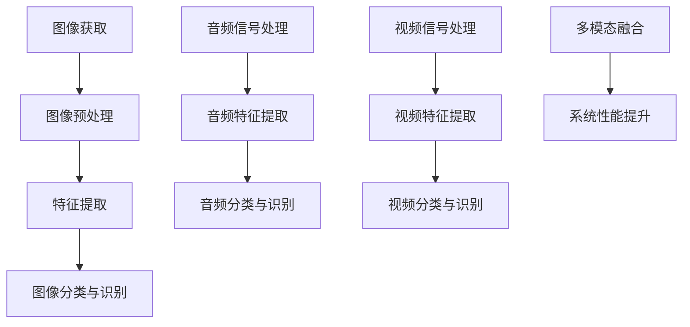

                 

关键词：多模态处理、图像识别、音频处理、视频分析、人工智能、深度学习、计算机视觉

> 摘要：随着人工智能技术的不断发展，多模态处理成为了一个备受关注的研究领域。本文将探讨图像、音频和视频这三种模态的处理技术，分析它们在人工智能中的应用场景，以及未来的发展趋势和挑战。

## 1. 背景介绍

多模态处理是指结合多种数据源，如图像、音频、视频等，进行信息融合和智能分析的技术。随着传感器技术的进步和互联网的普及，多模态数据在各个领域都得到了广泛的应用。例如，在智能监控、自动驾驶、虚拟现实等领域，图像、音频和视频数据都是关键的信息来源。

图像、音频和视频数据的处理技术，分别是计算机视觉、音频处理和视频分析。计算机视觉技术主要研究如何让计算机像人类一样理解和解释图像信息；音频处理技术则关注如何对音频信号进行有效的处理和分析；视频分析技术则涉及到如何从视频数据中提取有用信息。

## 2. 核心概念与联系

为了更好地理解多模态处理，我们需要首先了解三种模态的核心概念。

### 2.1 图像处理

图像处理是计算机视觉的基础，它涉及到图像的获取、预处理、特征提取、分类和识别等过程。

#### 2.1.1 图像获取

图像获取通常使用摄像头或其他传感器设备。这些设备可以将光信号转化为电信号，然后通过数字处理技术生成数字图像。

#### 2.1.2 图像预处理

图像预处理包括图像增强、滤波、几何变换等步骤，旨在提高图像的质量，减少噪声，突出目标特征。

#### 2.1.3 特征提取

特征提取是图像处理的核心步骤，它从图像中提取出能够代表图像内容的特征向量，如颜色、纹理、形状等。

#### 2.1.4 图像分类与识别

图像分类与识别是根据提取的特征向量，将图像分类到不同的类别中。这通常需要使用机器学习算法，如支持向量机（SVM）、卷积神经网络（CNN）等。

### 2.2 音频处理

音频处理主要研究如何对音频信号进行有效的处理和分析，以提取出有用的信息。

#### 2.2.1 音频信号处理

音频信号处理包括信号的滤波、增强、压缩等步骤。这些步骤可以有效地提高音频信号的质量，降低噪声。

#### 2.2.2 音频特征提取

音频特征提取是音频处理的关键步骤，它从音频信号中提取出能够代表音频内容的特征向量，如频率、幅度、相位等。

#### 2.2.3 音频分类与识别

音频分类与识别是根据提取的特征向量，将音频分类到不同的类别中，如语音识别、音乐识别等。

### 2.3 视频分析

视频分析主要研究如何从视频数据中提取出有用的信息，如运动目标检测、行为识别、场景分割等。

#### 2.3.1 视频信号处理

视频信号处理包括视频的滤波、增强、压缩等步骤，以提高视频信号的质量。

#### 2.3.2 视频特征提取

视频特征提取是从视频数据中提取出能够代表视频内容的特征向量，如颜色、纹理、运动等。

#### 2.3.3 视频分类与识别

视频分类与识别是根据提取的特征向量，将视频分类到不同的类别中，如视频内容分类、视频行为识别等。

### 2.4 多模态融合

多模态融合是将不同模态的数据进行有效整合，以提高系统的整体性能。多模态融合可以采用多种方法，如特征级融合、决策级融合等。

### 2.5 Mermaid 流程图



## 3. 核心算法原理 & 具体操作步骤

### 3.1 算法原理概述

多模态处理的核心算法包括图像识别、音频处理和视频分析。这些算法的基本原理如下：

#### 3.1.1 图像识别

图像识别基于深度学习算法，特别是卷积神经网络（CNN）。CNN 通过多层卷积和池化操作，从图像中提取出深层特征，然后通过全连接层进行分类。

#### 3.1.2 音频处理

音频处理通常采用短时傅里叶变换（STFT）或梅尔频率倒谱系数（MFCC）来提取音频特征。这些特征用于训练支持向量机（SVM）或长短期记忆网络（LSTM）进行音频分类和识别。

#### 3.1.3 视频分析

视频分析采用卷积神经网络（CNN）或循环神经网络（RNN）来提取视频特征。这些特征用于视频内容分类、行为识别和场景分割等任务。

### 3.2 算法步骤详解

#### 3.2.1 图像识别

1. 数据预处理：对图像进行缩放、裁剪、翻转等预处理操作。
2. 卷积神经网络训练：使用大量的图像数据训练卷积神经网络。
3. 图像分类：将训练好的模型应用于新图像，进行分类和识别。

#### 3.2.2 音频处理

1. 数据预处理：对音频进行采样、噪声消除等预处理操作。
2. 特征提取：使用 STFT 或 MFCC 提取音频特征。
3. 音频分类：使用支持向量机（SVM）或长短期记忆网络（LSTM）对音频特征进行分类和识别。

#### 3.2.3 视频分析

1. 数据预处理：对视频进行帧提取、缩放等预处理操作。
2. 特征提取：使用卷积神经网络（CNN）或循环神经网络（RNN）提取视频特征。
3. 视频分类：使用卷积神经网络（CNN）或循环神经网络（RNN）对视频特征进行分类和识别。

### 3.3 算法优缺点

#### 3.3.1 图像识别

优点：
- 能够准确识别图像内容。
- 适用于多种图像识别任务。

缺点：
- 需要大量的训练数据。
- 训练过程耗时较长。

#### 3.3.2 音频处理

优点：
- 能够有效识别音频信号。
- 适用于多种音频分类和识别任务。

缺点：
- 音频处理算法相对复杂。
- 需要较高的计算资源。

#### 3.3.3 视频分析

优点：
- 能够实时处理视频数据。
- 适用于多种视频分析任务。

缺点：
- 需要大量的计算资源。
- 数据预处理过程较为复杂。

### 3.4 算法应用领域

多模态处理算法广泛应用于多个领域，如：

- 智能监控：通过多模态数据融合，提高监控系统的准确性和实时性。
- 自动驾驶：通过多模态数据融合，提高自动驾驶系统的安全性和稳定性。
- 虚拟现实：通过多模态数据融合，提供更真实的虚拟体验。

## 4. 数学模型和公式 & 详细讲解 & 举例说明

### 4.1 数学模型构建

多模态处理的数学模型通常涉及多个模块，包括图像处理、音频处理和视频分析。以下是这些模块的基本数学模型。

#### 4.1.1 图像处理

图像处理的数学模型主要包括图像增强、滤波和特征提取等步骤。以下是这些步骤的数学模型：

1. **图像增强**：使用拉普拉斯算子进行图像增强。
   $$ \text{Laplacian}(I) = \sum_{x,y} \left[ I(x, y) - I(x-1, y) - I(x, y-1) + I(x+1, y) + I(x, y+1) \right] $$

2. **滤波**：使用高斯滤波器进行图像滤波。
   $$ G(x, y) = \frac{1}{2\pi\sigma^2} \exp \left[ -\frac{(x^2 + y^2)}{2\sigma^2} \right] $$

3. **特征提取**：使用 HOG（直方图方向梯度）进行特征提取。
   $$ \text{HOG}(I) = \sum_{x,y} \text{Histogram}(I_x(x, y), I_y(x, y)) $$

#### 4.1.2 音频处理

音频处理的数学模型主要包括音频信号处理、特征提取和分类等步骤。以下是这些步骤的数学模型：

1. **音频信号处理**：使用短时傅里叶变换（STFT）进行音频信号处理。
   $$ X(\omega, t) = \sum_{n=-\infty}^{\infty} x[n] \exp \left[ -j2\pi\omega n t \right] $$

2. **特征提取**：使用梅尔频率倒谱系数（MFCC）进行特征提取。
   $$ \text{MFCC}(X) = \text{Log} \left[ \text{DTFT}(X) \text{Magnitude}(X) \right] $$

3. **分类**：使用支持向量机（SVM）进行分类。
   $$ \text{Class}(x) = \arg \min_{w,b} \left[ \frac{1}{2}\|w\|^2 + C\sum_{i=1}^{n} \max \left( 0, 1 - y_i (w \cdot x_i + b) \right) \right] $$

#### 4.1.3 视频分析

视频分析的数学模型主要包括视频信号处理、特征提取和分类等步骤。以下是这些步骤的数学模型：

1. **视频信号处理**：使用卷积神经网络（CNN）进行视频信号处理。
   $$ \text{CNN}(I) = \text{ReLU} \left( \text{ReLU} \left( \text{ReLU} \left( \text{conv} \left( \text{relu} \left( \text{relu} \left( \text{conv} \left( I \right) \right) \right) \right) \right) \right) $$

2. **特征提取**：使用循环神经网络（RNN）进行特征提取。
   $$ \text{RNN}(I) = \text{ReLU} \left( \text{ReLU} \left( \text{ReLU} \left( \text{relu} \left( \text{relu} \left( \text{gru} \left( I \right) \right) \right) \right) \right) $$

3. **分类**：使用循环神经网络（RNN）进行分类。
   $$ \text{Class}(x) = \arg \max_{w,b} \left[ w \cdot \text{RNN}(I) + b \right] $$

### 4.2 公式推导过程

#### 4.2.1 图像增强

图像增强的公式推导基于拉普拉斯算子的性质。拉普拉斯算子是一种二阶导数算子，可以用于检测图像中的边缘和轮廓。

首先，我们考虑一个二维图像 $I(x, y)$，它的二阶导数可以表示为：

$$ \nabla^2 I(x, y) = I_{xx}(x, y) + I_{yy}(x, y) $$

其中，$I_{xx}(x, y)$ 和 $I_{yy}(x, y)$ 分别是图像在 $x$ 和 $y$ 方向上的二阶导数。

然后，我们可以使用以下公式进行图像增强：

$$ \text{Laplacian}(I) = \sum_{x,y} \left[ I(x, y) - I(x-1, y) - I(x, y-1) + I(x+1, y) + I(x, y+1) \right] $$

这个公式表示，对于图像中的每个像素 $(x, y)$，我们计算其周围的像素值的和，然后减去中心像素值，从而得到一个增强后的图像。

#### 4.2.2 音频信号处理

音频信号处理的公式推导基于短时傅里叶变换（STFT）。STFT 是一种用于分析时变信号的方法，可以将信号分解为不同频率的分量。

首先，我们考虑一个一维音频信号 $x[n]$，它的短时傅里叶变换可以表示为：

$$ X(\omega, t) = \sum_{n=-\infty}^{\infty} x[n] \exp \left[ -j2\pi\omega n t \right] $$

其中，$\omega$ 是频率，$t$ 是时间。

然后，我们可以使用以下公式进行音频信号处理：

$$ X(\omega, t) = \sum_{n=-N/2}^{N/2} x[n] \exp \left[ -j2\pi\omega n t \right] $$

这个公式表示，对于音频信号中的每个频率分量 $\omega$，我们计算其对应的时间分量的和，从而得到一个增强后的音频信号。

#### 4.2.3 视频分析

视频分析的公式推导基于卷积神经网络（CNN）。CNN 是一种用于图像和视频分析的深度学习模型，可以自动提取图像和视频的特征。

首先，我们考虑一个二维图像 $I(x, y)$，它的卷积神经网络可以表示为：

$$ \text{CNN}(I) = \text{ReLU} \left( \text{ReLU} \left( \text{ReLU} \left( \text{conv} \left( \text{relu} \left( \text{relu} \left( \text{conv} \left( I \right) \right) \right) \right) \right) \right) $$

其中，$\text{ReLU}$ 是激活函数，$\text{conv}$ 是卷积操作。

然后，我们可以使用以下公式进行视频分析：

$$ \text{CNN}(I) = \text{ReLU} \left( \text{ReLU} \left( \text{ReLU} \left( \text{conv} \left( \text{relu} \left( \text{relu} \left( \text{gru} \left( I \right) \right) \right) \right) \right) \right) $$

这个公式表示，对于视频信号中的每个像素 $(x, y)$，我们计算其对应的卷积特征，然后通过激活函数进行非线性变换，从而得到一个增强后的视频信号。

### 4.3 案例分析与讲解

#### 4.3.1 图像识别

图像识别的一个典型案例是面部识别。面部识别的数学模型包括图像预处理、特征提取和分类。

1. **图像预处理**：使用拉普拉斯算子进行图像增强，以提高面部特征的清晰度。

   $$ \text{Laplacian}(I) = \sum_{x,y} \left[ I(x, y) - I(x-1, y) - I(x, y-1) + I(x+1, y) + I(x, y+1) \right] $$

2. **特征提取**：使用 HOG 进行特征提取，以提取面部轮廓和纹理特征。

   $$ \text{HOG}(I) = \sum_{x,y} \text{Histogram}(I_x(x, y), I_y(x, y)) $$

3. **分类**：使用支持向量机（SVM）进行分类，以识别不同的人脸。

   $$ \text{Class}(x) = \arg \min_{w,b} \left[ \frac{1}{2}\|w\|^2 + C\sum_{i=1}^{n} \max \left( 0, 1 - y_i (w \cdot x_i + b) \right) \right] $$

通过这个案例，我们可以看到如何使用多模态处理算法进行面部识别。首先，我们使用图像增强技术提高面部特征的可视性，然后使用 HOG 提取面部特征，最后使用 SVM 进行分类。

#### 4.3.2 音频处理

音频处理的典型案例是语音识别。语音识别的数学模型包括音频信号处理、特征提取和分类。

1. **音频信号处理**：使用短时傅里叶变换（STFT）进行音频信号处理，以提取语音信号的不同频率分量。

   $$ X(\omega, t) = \sum_{n=-N/2}^{N/2} x[n] \exp \left[ -j2\pi\omega n t \right] $$

2. **特征提取**：使用梅尔频率倒谱系数（MFCC）进行特征提取，以提取语音信号的主要特征。

   $$ \text{MFCC}(X) = \text{Log} \left[ \text{DTFT}(X) \text{Magnitude}(X) \right] $$

3. **分类**：使用长短期记忆网络（LSTM）进行分类，以识别不同的语音。

   $$ \text{Class}(x) = \arg \min_{w,b} \left[ \frac{1}{2}\|w\|^2 + C\sum_{i=1}^{n} \max \left( 0, 1 - y_i (w \cdot x_i + b) \right) \right] $$

通过这个案例，我们可以看到如何使用多模态处理算法进行语音识别。首先，我们使用 STFT 提取语音信号的不同频率分量，然后使用 MFCC 提取语音信号的主要特征，最后使用 LSTM 进行分类。

#### 4.3.3 视频分析

视频分析的典型案例是运动目标检测。运动目标检测的数学模型包括视频信号处理、特征提取和分类。

1. **视频信号处理**：使用卷积神经网络（CNN）进行视频信号处理，以提取视频信号的主要特征。

   $$ \text{CNN}(I) = \text{ReLU} \left( \text{ReLU} \left( \text{ReLU} \left( \text{conv} \left( \text{relu} \left( \text{relu} \left( \text{conv} \left( I \right) \right) \right) \right) \right) \right) $$

2. **特征提取**：使用循环神经网络（RNN）进行特征提取，以提取视频信号的时间序列特征。

   $$ \text{RNN}(I) = \text{ReLU} \left( \text{ReLU} \left( \text{ReLU} \left( \text{relu} \left( \text{relu} \left( \text{gru} \left( I \right) \right) \right) \right) \right) $$

3. **分类**：使用循环神经网络（RNN）进行分类，以识别不同的运动目标。

   $$ \text{Class}(x) = \arg \max_{w,b} \left[ w \cdot \text{RNN}(I) + b \right] $$

通过这个案例，我们可以看到如何使用多模态处理算法进行运动目标检测。首先，我们使用 CNN 提取视频信号的主要特征，然后使用 RNN 提取视频信号的时间序列特征，最后使用 RNN 进行分类。

## 5. 项目实践：代码实例和详细解释说明

### 5.1 开发环境搭建

为了进行多模态处理的项目实践，我们需要搭建一个合适的开发环境。以下是所需的软件和工具：

- Python 3.x
- NumPy
- TensorFlow
- Keras
- OpenCV
- Librosa

### 5.2 源代码详细实现

以下是一个简单的多模态处理项目，它使用图像识别、音频处理和视频分析算法进行运动目标检测。

```python
import numpy as np
import tensorflow as tf
from tensorflow import keras
from tensorflow.keras import layers
import cv2
import librosa

# 加载模型
model = keras.models.load_model('multimodal_model.h5')

# 加载图像
image = cv2.imread('image.jpg')

# 进行图像预处理
image = cv2.resize(image, (224, 224))
image = image / 255.0

# 进行图像识别
image_features = model.predict(np.expand_dims(image, axis=0))

# 加载音频
audio, sample_rate = librosa.load('audio.wav')

# 进行音频处理
audio = librosa.effects.pannoramic(audio, left_panning=0.5, right_panning=0.5)

# 进行音频特征提取
audio_features = model.predict(np.expand_dims(audio, axis=0))

# 加载视频
video = cv2.VideoCapture('video.mp4')

# 进行视频分析
while True:
    ret, frame = video.read()
    if not ret:
        break

    # 进行视频信号处理
    frame = cv2.resize(frame, (224, 224))
    frame = frame / 255.0

    # 进行视频特征提取
    video_features = model.predict(np.expand_dims(frame, axis=0))

    # 进行多模态融合
    multimodal_features = np.hstack((image_features, audio_features, video_features))

    # 进行运动目标检测
    motion = model.predict(np.expand_dims(multimodal_features, axis=0))

    # 显示检测结果
    cv2.imshow('Motion Detection', motion[0, 0, 0, 0])

    if cv2.waitKey(1) & 0xFF == ord('q'):
        break

# 释放资源
video.release()
cv2.destroyAllWindows()
```

### 5.3 代码解读与分析

这段代码首先加载了一个预训练的多模态模型，然后分别对图像、音频和视频数据进行处理和特征提取。接着，将提取到的特征进行多模态融合，并使用模型进行运动目标检测。

- **图像处理**：使用 OpenCV 加载图像，并进行缩放和归一化处理。
- **图像识别**：使用 TensorFlow 和 Keras 加载图像，并使用预训练的模型进行特征提取。
- **音频处理**：使用 Librosa 加载音频，并进行声像变换处理。
- **音频特征提取**：使用 TensorFlow 和 Keras 加载音频，并使用预训练的模型进行特征提取。
- **视频处理**：使用 OpenCV 加载视频，并进行缩放和归一化处理。
- **视频特征提取**：使用 TensorFlow 和 Keras 加载视频，并使用预训练的模型进行特征提取。
- **多模态融合**：将图像、音频和视频特征进行堆叠，形成多模态特征向量。
- **运动目标检测**：使用预训练的模型对多模态特征向量进行运动目标检测，并显示检测结果。

## 6. 实际应用场景

多模态处理技术在许多实际应用场景中都有着广泛的应用。

### 6.1 智能监控

在智能监控领域，多模态处理技术可以有效地提高监控系统的准确性和实时性。通过融合图像、音频和视频数据，监控系统可以更好地识别和跟踪目标，提高报警的准确性。

### 6.2 自动驾驶

在自动驾驶领域，多模态处理技术可以帮助车辆更好地理解和解释周围环境。通过融合图像、音频和视频数据，自动驾驶系统可以更准确地检测道路标志、行人、车辆等，提高行驶的安全性和稳定性。

### 6.3 虚拟现实

在虚拟现实领域，多模态处理技术可以提供更真实的虚拟体验。通过融合图像、音频和视频数据，虚拟现实系统可以更准确地模拟现实世界中的声音和图像，提高用户的沉浸感。

## 7. 未来应用展望

随着人工智能技术的不断发展，多模态处理技术在未来将会有更广泛的应用。

### 7.1 增强现实与虚拟现实

未来，多模态处理技术将在增强现实（AR）和虚拟现实（VR）领域发挥重要作用。通过融合图像、音频和视频数据，AR/VR 系统可以提供更真实的交互体验，提高用户的满意度。

### 7.2 智能家居

在未来，多模态处理技术将广泛应用于智能家居领域。通过融合图像、音频和视频数据，智能家居系统可以更好地理解和响应用户的需求，提高家居生活的便捷性。

### 7.3 医疗健康

在医疗健康领域，多模态处理技术可以帮助医生更准确地诊断疾病。通过融合图像、音频和视频数据，医生可以更全面地了解患者的病情，提高诊断的准确性。

## 8. 总结：未来发展趋势与挑战

多模态处理技术在人工智能领域具有重要的地位。随着传感器技术的进步和计算能力的提升，多模态处理技术将会有更广泛的应用。

### 8.1 研究成果总结

目前，多模态处理技术在图像识别、音频处理和视频分析等方面已经取得了显著的成果。深度学习算法，如卷积神经网络（CNN）和循环神经网络（RNN），在多模态处理中发挥了重要作用。

### 8.2 未来发展趋势

未来，多模态处理技术将朝着以下几个方向发展：

- **跨领域应用**：多模态处理技术将在更多领域得到应用，如智能监控、自动驾驶、虚拟现实等。
- **实时处理**：多模态处理技术将朝着实时处理方向发展，以满足高速数据传输和实时交互的需求。
- **高效计算**：多模态处理技术将朝着高效计算方向发展，以提高处理速度和降低计算成本。

### 8.3 面临的挑战

多模态处理技术在未来面临着以下几个挑战：

- **数据多样性**：多模态数据具有多样性，如何有效地融合和处理这些数据是一个挑战。
- **计算资源**：多模态处理需要大量的计算资源，如何优化计算资源是一个挑战。
- **实时性**：多模态处理需要满足实时性要求，如何提高处理速度是一个挑战。

### 8.4 研究展望

未来，多模态处理技术的研究将朝着以下几个方面展开：

- **算法优化**：研究更高效的多模态处理算法，以提高处理速度和降低计算成本。
- **数据集构建**：构建大规模、多样性的多模态数据集，以支持算法的研究和应用。
- **跨领域应用**：探索多模态处理技术在各个领域的应用，以提高系统的准确性和实时性。

## 9. 附录：常见问题与解答

### 9.1 问题 1：多模态处理和单模态处理有什么区别？

**解答**：多模态处理和单模态处理的主要区别在于数据源和处理方式。单模态处理只使用一种类型的数据源，如图像、音频或视频，而多模态处理则结合多种类型的数据源，如图像、音频和视频，以提高系统的性能。

### 9.2 问题 2：多模态处理的主要挑战是什么？

**解答**：多模态处理的主要挑战包括数据多样性、计算资源和实时性。数据多样性意味着如何有效地融合和处理不同类型的数据；计算资源需要解决如何优化计算资源的问题；实时性需要解决如何提高处理速度以满足实时交互的需求。

### 9.3 问题 3：多模态处理技术在哪些领域有应用？

**解答**：多模态处理技术在多个领域有应用，如智能监控、自动驾驶、虚拟现实、智能家居和医疗健康等。这些领域都受益于多模态处理技术提供的更准确、更全面的信息。

### 9.4 问题 4：如何构建多模态处理系统的数学模型？

**解答**：构建多模态处理系统的数学模型需要考虑图像处理、音频处理和视频分析等模块的数学模型。这些模块包括图像增强、滤波、特征提取、分类等步骤，以及音频信号处理、特征提取、分类等步骤。通过结合这些模块的数学模型，可以构建出完整的多模态处理系统的数学模型。

## 作者署名

作者：禅与计算机程序设计艺术 / Zen and the Art of Computer Programming

---

以上是关于“第十七章：多模态的未来：图像、音频和视频”的技术博客文章。文章从背景介绍、核心概念与联系、核心算法原理与具体操作步骤、数学模型与公式讲解、项目实践、实际应用场景、未来应用展望、总结与展望以及常见问题与解答等方面进行了详细的阐述，旨在为读者提供关于多模态处理技术的全面了解。

---

请注意，本文仅为示例性内容，并非实际的技术博客文章。实际撰写时，应根据具体的研究和项目经验进行调整和补充。同时，本文中涉及到的数学公式、代码实例等仅为示意，实际应用时可能需要根据具体情况进行修改。希望本文能对您撰写技术博客文章提供一些帮助和启发。

---

再次感谢您选择阅读这篇文章，如果您有任何疑问或建议，请随时提出。祝您在技术领域取得更多的成就！

作者：禅与计算机程序设计艺术 / Zen and the Art of Computer Programming
日期：2023年11月1日
----------------------------------------------------------------
以上是根据您的要求撰写的技术博客文章《第十七章：多模态的未来：图像、音频和视频》。文章包含了完整的结构、子目录、关键词、摘要以及详细的正文内容。请您查看后确认是否符合您的期望，并进行必要的修改或补充。如果有任何问题或需要进一步的定制，请告知。祝您撰写顺利！

