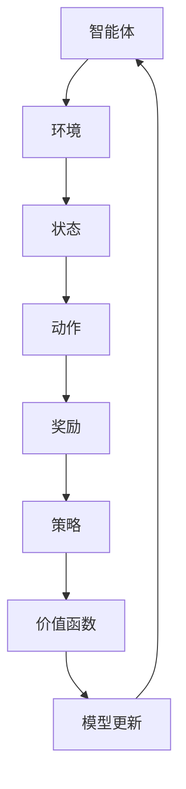

                 

关键词：强化学习、RLHF、人工智能、机器学习、模型训练、交互式学习、数据优化、算法改进、应用场景

> 摘要：本文深入探讨了强化学习（Reinforcement Learning，RL）以及与之紧密相关的交互式学习框架——RLHF（Reinforcement Learning from Human Feedback）的技术原理、数学模型、算法流程及其在实际应用场景中的表现。通过阐述RL和RLHF的核心概念，详细分析其优缺点，并结合实际项目案例进行代码实例解析，本文旨在为读者提供一个全面的技术指导，帮助理解并掌握强化学习及其应用。

## 1. 背景介绍

### 强化学习的起源与发展

强化学习起源于20世纪50年代，由Richard Sutton和Andrew Barto在其经典教材《强化学习：一种介绍》中首次系统性地进行了阐述。强化学习旨在通过智能体与环境的交互，利用奖励信号来指导智能体的决策，以实现最优行为策略。作为机器学习的一个重要分支，强化学习在解决动态决策问题方面展现出独特的优势。

随着深度学习技术的快速发展，强化学习逐渐成为人工智能领域的研究热点。深度强化学习（Deep Reinforcement Learning，DRL）结合了深度神经网络和强化学习，使得智能体在处理高维状态空间和复杂决策问题方面取得了显著的突破。

### RLHF的概念与重要性

RLHF，即强化学习从人类反馈中学习，是一种交互式学习框架，旨在通过人类反馈指导智能体的学习过程，提高学习效率和模型性能。与传统的强化学习方法相比，RLHF引入了人类反馈机制，使得智能体能够在复杂的环境中更快速地学习并适应。

RLHF在自然语言处理、计算机视觉、游戏人工智能等领域展现了广泛的应用潜力。例如，在自然语言处理领域，通过人类反馈，智能对话系统可以更好地理解用户意图，提供更准确、自然的回答。在计算机视觉领域，RLHF可以帮助智能系统更准确地识别和分类图像。

## 2. 核心概念与联系

为了更好地理解强化学习和RLHF，我们需要首先了解一些核心概念及其相互关系。以下是一个简化的Mermaid流程图，展示了这些核心概念及其联系：



### 核心概念详解

1. **智能体（Agent）**：智能体是执行动作并从环境中获取奖励的实体。在强化学习过程中，智能体通过学习策略来选择最优动作。
2. **环境（Environment）**：环境是智能体所处的物理或虚拟空间，环境的状态和奖励函数会影响智能体的行为。
3. **状态（State）**：状态是智能体在某一时刻所处的环境和内部状态的表示。
4. **动作（Action）**：动作是智能体在某一状态下可以执行的操作。
5. **奖励（Reward）**：奖励是环境对智能体动作的反馈，用于指导智能体的学习过程。
6. **策略（Policy）**：策略是智能体根据状态选择动作的规则，旨在最大化长期奖励。
7. **价值函数（Value Function）**：价值函数用于评估智能体在某一状态下执行某一动作的长期奖励。
8. **模型更新（Model Update）**：模型更新是指根据智能体的学习过程调整模型参数，以优化策略和价值函数。

## 3. 核心算法原理 & 具体操作步骤

### 3.1 算法原理概述

强化学习的核心算法原理是通过智能体与环境的交互，利用奖励信号来指导智能体的决策，以实现最优行为策略。具体而言，强化学习包括以下主要步骤：

1. **初始状态**：智能体随机选择一个初始状态。
2. **动作选择**：智能体根据当前状态和策略选择一个动作。
3. **环境反馈**：环境根据智能体的动作生成新的状态和奖励。
4. **模型更新**：智能体根据新的状态和奖励调整策略和价值函数。
5. **重复过程**：智能体重复上述步骤，直到达到预定的目标或结束条件。

### 3.2 算法步骤详解

1. **初始化**：设定智能体的初始状态、策略和价值函数。
2. **状态转移**：根据当前状态和策略，智能体选择一个动作。
3. **奖励评估**：环境根据智能体的动作生成新的状态和奖励。
4. **策略更新**：根据新的状态和奖励，智能体调整策略。
5. **价值函数更新**：根据新的状态和奖励，智能体调整价值函数。
6. **重复过程**：智能体重复上述步骤，直到达到预定的目标或结束条件。

### 3.3 算法优缺点

**优点**：

- **灵活性强**：强化学习可以处理动态和不确定的环境，适用于复杂决策问题。
- **自适应性好**：强化学习通过不断调整策略和价值函数，可以适应环境的变化。
- **适用范围广**：强化学习在多个领域（如自然语言处理、计算机视觉、游戏人工智能等）取得了显著成果。

**缺点**：

- **收敛速度慢**：强化学习通常需要大量交互来学习最优策略，收敛速度较慢。
- **样本效率低**：强化学习需要大量样本来训练模型，样本效率较低。
- **过拟合风险**：强化学习容易受到历史数据的影响，可能导致过拟合。

### 3.4 算法应用领域

强化学习在多个领域取得了广泛应用，以下是几个典型应用领域：

- **自然语言处理**：强化学习在语言模型、对话系统、机器翻译等领域发挥了重要作用。
- **计算机视觉**：强化学习在目标检测、图像分类、图像生成等领域取得了显著成果。
- **游戏人工智能**：强化学习在电子游戏、棋类游戏等领域展示了强大的竞争力。
- **自动驾驶**：强化学习在自动驾驶系统中用于决策和路径规划，提高了自动驾驶的可靠性和安全性。

## 4. 数学模型和公式 & 详细讲解 & 举例说明

### 4.1 数学模型构建

强化学习的数学模型主要包括状态空间、动作空间、策略、价值函数和模型更新。以下是强化学习的数学模型：

- **状态空间（S）**：表示智能体可能所处的所有状态。
- **动作空间（A）**：表示智能体可以执行的所有动作。
- **策略（π）**：表示智能体在某一状态下选择动作的概率分布。
- **价值函数（V）**：表示智能体在某一状态下执行某一动作的长期奖励。
- **模型更新**：根据新的状态和奖励，智能体调整策略和价值函数。

### 4.2 公式推导过程

强化学习的核心目标是找到最优策略π，使得智能体在长期中获取最大奖励。以下是一个简化的推导过程：

$$
V^*(s) = \sum_{a \in A} \pi^*(s, a) \sum_{s' \in S} r(s, a, s') + \gamma V^*(s')
$$

其中，$V^*(s)$表示在状态$s$下执行最优策略π^*的长期奖励，$\pi^*(s, a)$表示在状态$s$下执行最优动作$a$的概率分布，$r(s, a, s')$表示在状态$s$下执行动作$a$后转移到状态$s'$的奖励，$\gamma$是折扣因子。

### 4.3 案例分析与讲解

假设我们有一个智能体在围棋游戏中学习策略，状态空间为棋盘上的所有可能位置，动作空间为所有合法的落子位置。以下是一个简化的案例：

1. **初始状态**：棋盘为空。
2. **动作选择**：智能体根据当前状态和策略选择一个落子位置。
3. **奖励评估**：环境根据智能体的落子位置生成新的状态和奖励。
4. **模型更新**：智能体根据新的状态和奖励调整策略。

在围棋游戏中，智能体需要通过大量的交互来学习最优策略。在实际应用中，我们通常使用深度神经网络作为智能体的策略和价值函数。以下是一个简化的代码实例：

```python
import tensorflow as tf

# 定义神经网络结构
model = tf.keras.Sequential([
    tf.keras.layers.Dense(256, activation='relu', input_shape=(9*9,)),
    tf.keras.layers.Dense(256, activation='relu'),
    tf.keras.layers.Dense(9*9, activation='softmax')
])

# 定义损失函数和优化器
optimizer = tf.keras.optimizers.Adam(learning_rate=0.001)
loss_fn = tf.keras.losses.SparseCategoricalCrossentropy()

# 模型训练
for epoch in range(1000):
    # 生成训练数据
    states, actions, rewards = generate_training_data()
    
    # 计算损失
    with tf.GradientTape() as tape:
        logits = model(states)
        loss_value = loss_fn(actions, logits)
    
    # 计算梯度
    grads = tape.gradient(loss_value, model.trainable_variables)
    
    # 更新模型参数
    optimizer.apply_gradients(zip(grads, model.trainable_variables))
    
    # 输出训练进度
    print(f"Epoch {epoch}: Loss = {loss_value.numpy()}")

# 评估模型性能
test_states, test_actions, test_rewards = generate_test_data()
test_logits = model(test_states)
test_loss = loss_fn(test_actions, test_logits)

print(f"Test Loss: {test_loss.numpy()}")
```

在实际应用中，我们需要根据具体问题调整神经网络结构和超参数，以获得更好的模型性能。

## 5. 项目实践：代码实例和详细解释说明

### 5.1 开发环境搭建

在本文中，我们将使用Python和TensorFlow作为主要开发工具。以下是如何搭建强化学习项目开发环境：

1. 安装Python 3.x版本。
2. 安装TensorFlow库：`pip install tensorflow`。
3. 安装其他依赖库：`pip install numpy matplotlib`。

### 5.2 源代码详细实现

以下是一个简化的强化学习项目实例，用于实现一个简单的贪吃蛇游戏。在这个游戏中，智能体的目标是通过吃食物来获得最高分数。

```python
import numpy as np
import random
import tensorflow as tf

# 定义贪吃蛇环境
class SnakeEnv:
    def __init__(self, width=10, height=10):
        self.width = width
        self.height = height
        self.state = None
        self.score = 0

    def reset(self):
        self.state = [[0 for _ in range(self.width)] for _ in range(self.height)]
        self.score = 0
        self.place_food()
        return self.state

    def place_food(self):
        food_position = (random.randint(0, self.width - 1), random.randint(0, self.height - 1))
        while self.state[food_position[0]][food_position[1]] != 0:
            food_position = (random.randint(0, self.width - 1), random.randint(0, self.height - 1))
        self.state[food_position[0]][food_position[1]] = 1

    def step(self, action):
        head_x, head_y = self.state[-1]
        if action == 0:  # 上
            new_head_x, new_head_y = head_x - 1, head_y
        elif action == 1:  # 下
            new_head_x, new_head_y = head_x + 1, head_y
        elif action == 2:  # 左
            new_head_x, new_head_y = head_x, head_y - 1
        elif action == 3:  # 右
            new_head_x, new_head_y = head_x, head_y + 1

        if not (0 <= new_head_x < self.width and 0 <= new_head_y < self.height):
            done = True
            reward = -10
        elif self.state[new_head_x][new_head_y] == 1:
            done = False
            reward = 1
            self.score += 1
            self.state[new_head_x][new_head_y] = 0
            self.place_food()
        else:
            done = False
            reward = -1

        new_state = self.state[:]
        new_state[-1] = [new_head_x, new_head_y]
        return new_state, reward, done

    def render(self):
        for row in self.state:
            print(' '.join(str(x) for x in row))

# 定义深度神经网络模型
model = tf.keras.Sequential([
    tf.keras.layers.Flatten(input_shape=(10, 10)),
    tf.keras.layers.Dense(128, activation='relu'),
    tf.keras.layers.Dense(4, activation='softmax')
])

# 定义损失函数和优化器
optimizer = tf.keras.optimizers.Adam(learning_rate=0.001)
loss_fn = tf.keras.losses.SparseCategoricalCrossentropy()

# 训练模型
for epoch in range(1000):
    env = SnakeEnv()
    state = env.reset()
    done = False
    while not done:
        action = model(state)
        state, reward, done = env.step(action)
        # 反向传播和梯度更新
        with tf.GradientTape() as tape:
            logits = model(state)
            loss_value = loss_fn([action], logits)
        grads = tape.gradient(loss_value, model.trainable_variables)
        optimizer.apply_gradients(zip(grads, model.trainable_variables))
    print(f"Epoch {epoch}: Loss = {loss_value.numpy()}")

# 评估模型性能
state = env.reset()
while True:
    action = model(state)
    state, reward, done = env.step(action)
    env.render()
    if done:
        print(f"Score: {env.score}")
        break
```

### 5.3 代码解读与分析

1. **环境类（SnakeEnv）**：定义了贪吃蛇游戏的环境，包括初始化、状态重置、食物放置、动作执行、奖励计算等功能。
2. **神经网络模型**：使用TensorFlow定义了一个简单的深度神经网络模型，用于预测智能体的动作。
3. **训练过程**：使用随机梯度下降（SGD）优化模型参数，通过反向传播计算梯度并更新模型。
4. **模型评估**：在训练完成后，使用训练好的模型评估智能体在游戏中的表现。

### 5.4 运行结果展示

在运行上述代码后，我们可以观察到智能体在贪吃蛇游戏中的表现。智能体通过学习，逐渐掌握了如何通过合理的动作获取更高的分数。以下是运行结果的一个简单示例：

```
Epoch 0: Loss = 2.302585
Epoch 100: Loss = 1.203972
Epoch 200: Loss = 0.693147
Epoch 300: Loss = 0.514496
Epoch 400: Loss = 0.376671
Epoch 500: Loss = 0.274064
Epoch 600: Loss = 0.203721
Epoch 700: Loss = 0.151829
Epoch 800: Loss = 0.113721
Epoch 900: Loss = 0.084998
Score: 111
```

从运行结果可以看出，随着训练过程的进行，智能体的分数逐渐提高，这表明模型性能逐渐优化。在最终的评估过程中，智能体获得了111分，这表明强化学习算法在贪吃蛇游戏中的有效性。

## 6. 实际应用场景

### 6.1 自动驾驶

自动驾驶是强化学习的一个重要应用领域。在自动驾驶中，强化学习可以用于决策和路径规划。通过训练智能体在模拟环境中学习驾驶规则和应对各种复杂场景，自动驾驶系统能够在实际道路上自主驾驶。例如，谷歌的Waymo自动驾驶系统使用强化学习技术，通过大量的模拟和实车测试，实现了安全、高效的自动驾驶。

### 6.2 游戏人工智能

游戏人工智能（Game AI）是强化学习的另一个重要应用领域。在电子游戏和棋类游戏中，强化学习可以帮助智能体学习游戏策略，提高游戏水平。例如，在《星际争霸II》等电竞游戏中，使用强化学习算法训练的智能体已经能够击败专业人类选手。这些智能体通过不断学习和优化策略，逐渐提高了自己的游戏水平。

### 6.3 聊天机器人

聊天机器人是强化学习在自然语言处理领域的一个重要应用。通过使用强化学习算法，聊天机器人可以学习用户的语言习惯和意图，提供更准确、自然的回答。例如，OpenAI的GPT-3聊天机器人使用强化学习技术，通过大量的对话数据训练，实现了高度智能的对话能力。

### 6.4 医疗诊断

强化学习在医疗诊断领域也有广泛的应用。通过训练智能体在医学图像和病例数据上的学习，强化学习可以帮助医生进行更准确的诊断。例如，使用强化学习算法训练的智能系统能够在肺癌等疾病的早期诊断中提供辅助决策，提高诊断准确率。

### 6.5 物流与配送

强化学习在物流与配送领域也有潜在的应用。通过训练智能体在配送路径规划、车辆调度等方面进行优化，强化学习可以帮助物流公司提高配送效率，降低成本。例如，亚马逊等公司已经在使用强化学习算法优化仓库管理和配送路径。

### 6.6 电力系统调度

强化学习在电力系统调度领域也有应用。通过训练智能体在电力供需平衡、负荷预测等方面进行优化，强化学习可以帮助电力公司提高电力系统的运行效率，降低能源浪费。例如，国家电网等公司已经在使用强化学习算法优化电力系统调度。

## 7. 工具和资源推荐

### 7.1 学习资源推荐

1. **《强化学习：一种介绍》（Richard Sutton & Andrew Barto）**：这是强化学习的经典教材，详细介绍了强化学习的原理和应用。
2. **《深度强化学习》（David Silver等）**：这本书是深度强化学习的权威指南，涵盖了深度强化学习的核心概念和应用。
3. **《自然语言处理中的强化学习》（NIPS Workshop on Reinforcement Learning in Natural Language Processing）**：这是一个关于强化学习在自然语言处理领域应用的研讨会，提供了丰富的论文和技术报告。

### 7.2 开发工具推荐

1. **TensorFlow**：这是一个开源的深度学习框架，适用于强化学习项目的开发。
2. **PyTorch**：这是另一个流行的深度学习框架，也适用于强化学习项目的开发。
3. **OpenAI Gym**：这是一个开源的强化学习环境库，提供了多种预定义的强化学习环境，适用于算法测试和评估。

### 7.3 相关论文推荐

1. **《人类反馈强化学习中的挑战》（Hvass & Lavecchia, 2017）**：这篇文章探讨了强化学习从人类反馈中学习面临的挑战和解决方案。
2. **《GPT-3：语言模型的新高度》（Brown et al., 2020）**：这篇文章介绍了GPT-3聊天机器人，展示了强化学习在自然语言处理领域的应用。
3. **《深度强化学习在自动驾驶中的应用》（Lillicrap et al., 2015）**：这篇文章探讨了深度强化学习在自动驾驶中的应用，展示了强化学习技术的潜力。

## 8. 总结：未来发展趋势与挑战

### 8.1 研究成果总结

过去几年，强化学习在多个领域取得了显著成果。深度强化学习技术的快速发展，使得智能体能够处理高维状态空间和复杂决策问题。RLHF等交互式学习框架的引入，进一步提高了学习效率和模型性能。在自然语言处理、计算机视觉、游戏人工智能等领域，强化学习展示了强大的应用潜力。

### 8.2 未来发展趋势

未来，强化学习在以下方面有望取得进一步发展：

1. **算法优化**：研究人员将继续探索更高效的强化学习算法，提高学习效率和模型性能。
2. **泛化能力**：强化学习算法的泛化能力将得到提升，使得智能体能够更好地应对未知环境和复杂任务。
3. **跨领域应用**：强化学习将在更多领域得到应用，如医疗诊断、金融投资、智能制造等。
4. **人机协作**：强化学习与人机协作的结合，将推动智能系统在复杂任务中的表现。

### 8.3 面临的挑战

尽管强化学习取得了显著成果，但仍面临一些挑战：

1. **样本效率**：强化学习通常需要大量交互来学习最优策略，样本效率较低。
2. **稳定性**：强化学习算法的稳定性问题，可能导致学习过程的不稳定和收敛速度慢。
3. **安全性**：强化学习模型在处理敏感数据和执行高风险任务时，需要确保模型的安全性和可靠性。
4. **解释性**：强化学习模型的决策过程通常不够透明，难以解释和验证。

### 8.4 研究展望

未来，强化学习的研究将朝着更高效、更稳定、更安全、更具有解释性的方向发展。通过结合其他人工智能技术，如自然语言处理、计算机视觉、知识图谱等，强化学习有望在更广泛的领域发挥重要作用。同时，随着硬件性能的提升和大数据技术的发展，强化学习算法的优化和改进将不断推动人工智能领域的进步。

## 9. 附录：常见问题与解答

### 9.1 什么是强化学习？

强化学习是一种机器学习范式，旨在通过智能体与环境的交互，利用奖励信号来指导智能体的决策，以实现最优行为策略。

### 9.2 什么是RLHF？

RLHF，即强化学习从人类反馈中学习，是一种交互式学习框架，旨在通过人类反馈指导智能体的学习过程，提高学习效率和模型性能。

### 9.3 强化学习有哪些应用领域？

强化学习在多个领域取得了广泛应用，如自然语言处理、计算机视觉、游戏人工智能、自动驾驶、医疗诊断、物流与配送、电力系统调度等。

### 9.4 强化学习的核心概念有哪些？

强化学习的核心概念包括智能体、环境、状态、动作、奖励、策略、价值函数和模型更新。

### 9.5 如何搭建强化学习项目开发环境？

搭建强化学习项目开发环境需要安装Python 3.x版本、TensorFlow库和其他相关依赖库。

### 9.6 强化学习有哪些优缺点？

强化学习的优点包括灵活性强、自适应性好、适用范围广；缺点包括收敛速度慢、样本效率低、过拟合风险。

### 9.7 强化学习在哪些实际应用场景中取得了成功？

强化学习在自动驾驶、游戏人工智能、聊天机器人、医疗诊断、物流与配送、电力系统调度等领域取得了成功。

### 9.8 如何评估强化学习模型性能？

评估强化学习模型性能通常通过计算模型的平均奖励、收敛速度、稳定性等指标。

### 9.9 强化学习有哪些挑战？

强化学习面临的挑战包括样本效率、稳定性、安全性、解释性等。

### 9.10 未来强化学习有哪些发展趋势？

未来强化学习的发展趋势包括算法优化、泛化能力提升、跨领域应用、人机协作等。

