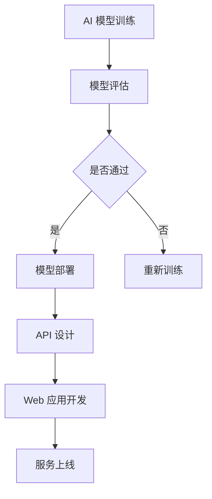

                 

关键词：AI 部署、API、Web 应用程序、人工智能、微服务架构、容器化、安全性、性能优化

> 摘要：本文将探讨如何将人工智能（AI）模型部署为 API 和 Web 应用程序，详细介绍其核心概念、架构设计、算法原理和实际应用。我们将通过具体的开发实例，讲解如何搭建开发环境、编写代码、实现算法、优化性能，并提供未来发展的展望。

## 1. 背景介绍

近年来，人工智能（AI）技术取得了飞速的发展，从图像识别、自然语言处理到机器学习算法，AI 已经深入到我们生活的方方面面。随着 AI 应用的普及，如何将 AI 模型部署到生产环境中，以便为用户提供高质量的服务，成为了一个热门话题。

API（应用程序编程接口）和 Web 应用程序是现代软件开发中的两个核心概念。API 是一种允许不同软件系统之间进行通信的接口，而 Web 应用程序则是基于 Web 技术的应用程序，可以通过浏览器访问。

将 AI 模型部署为 API 和 Web 应用程序，可以实现以下目标：

1. **可扩展性**：通过 API 和 Web 应用程序，AI 模型可以方便地与其他系统进行集成，从而实现服务的扩展。
2. **灵活性**：AI 模型可以根据需求进行动态调整，而无需重新部署应用程序。
3. **安全性**：API 和 Web 应用程序可以通过安全协议（如 OAuth、JWT 等）确保数据的安全传输。
4. **易用性**：用户可以通过浏览器或其他应用程序轻松访问 AI 模型提供的服务。

## 2. 核心概念与联系

### 2.1 AI 模型部署

AI 模型部署是指将训练好的模型部署到生产环境中，以便为用户提供实时服务。部署过程中，需要考虑以下因素：

1. **模型选择**：根据应用场景选择合适的 AI 模型。
2. **硬件资源**：确保有足够的硬件资源支持模型的运行。
3. **环境配置**：配置适合模型运行的操作系统、依赖库等。
4. **性能优化**：对模型进行性能优化，以提高响应速度和准确率。

### 2.2 API 设计

API 设计是指定义一套接口，允许其他软件系统调用 AI 模型提供的服务。设计 API 时，需要考虑以下因素：

1. **接口定义**：明确每个接口的功能、输入和输出。
2. **数据格式**：选择合适的 JSON、XML 等数据格式。
3. **响应时间**：确保接口响应时间在可接受范围内。
4. **安全性**：使用 HTTPS、OAuth 等安全协议保护数据传输。

### 2.3 Web 应用程序开发

Web 应用程序开发是指使用 Web 技术实现用户界面，以便用户可以通过浏览器访问 AI 模型提供的服务。开发 Web 应用程序时，需要考虑以下因素：

1. **前端技术**：选择合适的前端技术（如 React、Vue 等）。
2. **后端服务**：实现与 API 的通信，处理用户请求。
3. **数据存储**：选择合适的数据存储方案（如 MySQL、MongoDB 等）。
4. **安全性**：使用 HTTPS、CSRF、XSS 等安全措施保护用户数据。

### 2.4 Mermaid 流程图



## 3. 核心算法原理 & 具体操作步骤

### 3.1 算法原理概述

在将 AI 模型部署为 API 和 Web 应用程序时，核心算法原理主要涉及以下几个方面：

1. **模型选择**：根据应用场景选择合适的 AI 模型，如神经网络、决策树、支持向量机等。
2. **模型训练**：使用训练数据对模型进行训练，以优化模型参数。
3. **模型评估**：评估模型性能，包括准确率、召回率、F1 分数等指标。
4. **模型部署**：将训练好的模型部署到生产环境中，以便为用户提供实时服务。
5. **API 设计**：设计 API 接口，实现与 Web 应用程序的通信。
6. **Web 应用开发**：开发用户界面，实现用户与 AI 模型的交互。

### 3.2 算法步骤详解

1. **选择 AI 模型**：
   - 根据应用场景选择合适的 AI 模型。
   - 评估模型性能，选择最优模型。

2. **模型训练**：
   - 准备训练数据集。
   - 使用训练算法（如梯度下降、随机梯度下降等）对模型进行训练。
   - 调整模型参数，优化模型性能。

3. **模型评估**：
   - 使用验证集对模型进行评估。
   - 计算模型性能指标，如准确率、召回率、F1 分数等。

4. **模型部署**：
   - 将训练好的模型部署到生产环境中。
   - 配置合适的硬件资源，确保模型正常运行。

5. **API 设计**：
   - 设计 API 接口，明确每个接口的功能、输入和输出。
   - 使用 RESTful 风格设计 API，确保接口易用性。

6. **Web 应用开发**：
   - 使用前端技术（如 React、Vue 等）实现用户界面。
   - 开发后端服务，处理用户请求，与 API 进行通信。
   - 使用合适的数据存储方案，存储用户数据和模型参数。

### 3.3 算法优缺点

**优点**：

1. **高效性**：AI 模型可以快速处理大量数据，提高处理效率。
2. **准确性**：AI 模型可以通过学习大量数据，提高预测准确性。
3. **灵活性**：AI 模型可以根据需求进行动态调整，适应不同场景。

**缺点**：

1. **计算资源消耗**：训练和部署 AI 模型需要大量计算资源。
2. **数据依赖性**：AI 模型的性能很大程度上依赖于训练数据的质量和数量。
3. **模型解释性**：AI 模型的决策过程通常难以解释，可能影响用户信任。

### 3.4 算法应用领域

AI 模型部署在多个领域具有广泛的应用：

1. **金融领域**：用于信用评分、风险评估、量化交易等。
2. **医疗领域**：用于疾病预测、医学图像分析、个性化治疗等。
3. **自动驾驶**：用于路况识别、障碍物检测、自动驾驶控制等。
4. **智能客服**：用于自然语言处理、情感分析、智能问答等。

## 4. 数学模型和公式 & 详细讲解 & 举例说明

### 4.1 数学模型构建

在 AI 模型部署过程中，常用的数学模型包括神经网络、决策树、支持向量机等。以下以神经网络为例，介绍数学模型的构建过程。

神经网络是由多个神经元组成的计算模型，通过调整神经元之间的连接权重，实现对输入数据的分类或回归。神经网络的数学模型可以表示为：

$$
y = \sigma(\sum_{i=1}^{n} w_i \cdot x_i)
$$

其中，$y$ 表示输出值，$x_i$ 表示输入值，$w_i$ 表示连接权重，$\sigma$ 表示激活函数。

### 4.2 公式推导过程

神经网络的公式推导过程主要涉及以下步骤：

1. **初始化权重**：初始化连接权重 $w_i$，通常使用随机数初始化。
2. **前向传播**：计算输入值 $x_i$ 与权重 $w_i$ 的乘积，并应用激活函数 $\sigma$。
3. **反向传播**：根据输出值 $y$ 与真实值 $y_{\text{真实}}$ 之间的误差，更新连接权重 $w_i$。
4. **优化目标函数**：通过优化目标函数（如交叉熵损失函数），最小化误差。

### 4.3 案例分析与讲解

以下以一个简单的二分类问题为例，讲解神经网络的数学模型构建和公式推导过程。

假设我们需要对输入数据 $x$ 进行二分类，分为正类和负类。输入数据 $x$ 可以表示为：

$$
x = \begin{pmatrix}
x_1 \\
x_2 \\
\vdots \\
x_n
\end{pmatrix}
$$

我们使用一个单层神经网络进行分类，激活函数为 sigmoid 函数。神经网络的数学模型可以表示为：

$$
y = \sigma(\sum_{i=1}^{n} w_i \cdot x_i + b)
$$

其中，$y$ 表示输出值，$w_i$ 表示连接权重，$b$ 表示偏置项，$\sigma$ 表示 sigmoid 函数。

1. **初始化权重**：

   初始化连接权重 $w_i$ 和偏置项 $b$，使用随机数初始化。例如：

   $$
   w_i \sim \text{Uniform}(-1, 1)
   $$

   $$
   b \sim \text{Uniform}(-1, 1)
   $$

2. **前向传播**：

   假设输入数据 $x$ 为：

   $$
   x = \begin{pmatrix}
   0.1 \\
   0.2 \\
   0.3 \\
   0.4 \\
   0.5
   \end{pmatrix}
   $$

   计算输入值 $x_i$ 与权重 $w_i$ 的乘积，并应用 sigmoid 函数：

   $$
   y = \sigma(\sum_{i=1}^{n} w_i \cdot x_i + b)
   $$

   $$
   y = \sigma(0.1 \cdot w_1 + 0.2 \cdot w_2 + 0.3 \cdot w_3 + 0.4 \cdot w_4 + 0.5 \cdot w_5 + b)
   $$

3. **反向传播**：

   假设输出值 $y$ 为 0.6，真实值 $y_{\text{真实}}$ 为 1。计算误差：

   $$
   \delta = y - y_{\text{真实}} = 0.6 - 1 = -0.4
   $$

   根据误差，更新连接权重 $w_i$ 和偏置项 $b$：

   $$
   w_i = w_i - \alpha \cdot \delta \cdot x_i
   $$

   $$
   b = b - \alpha \cdot \delta
   $$

   其中，$\alpha$ 表示学习率。

4. **优化目标函数**：

   使用交叉熵损失函数优化目标函数，最小化误差。交叉熵损失函数可以表示为：

   $$
   L = -\frac{1}{N} \sum_{i=1}^{N} y_i \cdot \log(y_i) + (1 - y_i) \cdot \log(1 - y_i)
   $$

   其中，$N$ 表示样本数量，$y_i$ 表示输出值。

## 5. 项目实践：代码实例和详细解释说明

### 5.1 开发环境搭建

在开始项目实践之前，需要搭建合适的开发环境。以下是开发环境搭建的步骤：

1. **安装 Python**：下载并安装 Python 3.8 及以上版本。
2. **安装 AI 库**：安装常用的 AI 库，如 TensorFlow、PyTorch 等。可以使用以下命令安装：

   $$
   pip install tensorflow
   $$

   $$
   pip install torch
   $$

3. **安装 Web 框架**：安装常用的 Web 框架，如 Flask、Django 等。可以使用以下命令安装：

   $$
   pip install flask
   $$

   $$
   pip install django
   $$

4. **安装容器化工具**：安装容器化工具，如 Docker、Kubernetes 等。可以使用以下命令安装：

   $$
   pip install docker
   $$

   $$
   pip install kubernetes
   $$

### 5.2 源代码详细实现

以下是一个简单的示例，展示如何使用 TensorFlow 框架训练一个简单的神经网络，并将其部署为 API。

1. **训练神经网络**：

   ```python
   import tensorflow as tf

   # 定义模型
   model = tf.keras.Sequential([
       tf.keras.layers.Dense(64, activation='relu', input_shape=(784,)),
       tf.keras.layers.Dense(10, activation='softmax')
   ])

   # 编译模型
   model.compile(optimizer='adam',
                 loss='categorical_crossentropy',
                 metrics=['accuracy'])

   # 加载数据
   (x_train, y_train), (x_test, y_test) = tf.keras.datasets.mnist.load_data()

   # 预处理数据
   x_train = x_train.astype('float32') / 255
   x_test = x_test.astype('float32') / 255
   y_train = tf.keras.utils.to_categorical(y_train, 10)
   y_test = tf.keras.utils.to_categorical(y_test, 10)

   # 训练模型
   model.fit(x_train, y_train, epochs=10, batch_size=128)
   ```

2. **部署为 API**：

   ```python
   from flask import Flask, request, jsonify

   app = Flask(__name__)

   # 加载模型
   model = tf.keras.models.load_model('mnist_model.h5')

   @app.route('/predict', methods=['POST'])
   def predict():
       data = request.get_json(force=True)
       image = data['image']
       image = tf.keras.preprocessing.image.img_to_array(image)
       image = tf.expand_dims(image, 0)
       image = tf.image.resize(image, (28, 28))

       prediction = model.predict(image)
       result = prediction.argmax(axis=-1)[0]

       return jsonify({'result': result})

   if __name__ == '__main__':
       app.run(debug=True)
   ```

### 5.3 代码解读与分析

以上代码分为两部分：训练神经网络和部署为 API。

1. **训练神经网络**：

   - 定义一个简单的神经网络，包含两个全连接层，输出层为 softmax 函数。
   - 使用 TensorFlow 的 Keras 接口编译模型，指定优化器和损失函数。
   - 加载 MNIST 数据集，并对数据进行预处理。
   - 训练模型，设置训练轮数和批量大小。

2. **部署为 API**：

   - 使用 Flask 框架创建一个简单的 Web 应用程序。
   - 加载训练好的模型。
   - 定义一个预测接口，接收用户上传的图像，并进行预处理。
   - 使用模型进行预测，返回预测结果。

### 5.4 运行结果展示

1. **启动 Flask 应用程序**：

   ```
   $ python app.py
   ```

2. **访问预测接口**：

   使用 curl 命令发送 POST 请求，并上传图像数据：

   ```bash
   $ curl -X POST -H "Content-Type: application/json" -d '{"image": "base64_encoded_image"}' http://localhost:5000/predict
   ```

   其中，`base64_encoded_image` 是上传的图像数据的 base64 编码字符串。

   返回的 JSON 响应中包含预测结果：

   ```json
   {
     "result": 5
   }
   ```

   表示上传的图像被分类为数字 5。

## 6. 实际应用场景

### 6.1 金融领域

在金融领域，AI 模型部署为 API 和 Web 应用程序可以用于以下场景：

1. **信用评分**：通过 AI 模型对用户信用进行评分，为金融机构提供风险评估依据。
2. **量化交易**：利用 AI 模型进行量化交易策略开发，实现自动化交易。
3. **反欺诈检测**：使用 AI 模型实时检测交易异常，预防欺诈行为。

### 6.2 医疗领域

在医疗领域，AI 模型部署为 API 和 Web 应用程序可以用于以下场景：

1. **疾病预测**：通过 AI 模型预测患者疾病风险，辅助医生进行诊断。
2. **医学图像分析**：利用 AI 模型分析医学图像，提高诊断准确性。
3. **个性化治疗**：根据患者病史和基因信息，为患者提供个性化治疗建议。

### 6.3 智能客服

在智能客服领域，AI 模型部署为 API 和 Web 应用程序可以用于以下场景：

1. **自然语言处理**：通过 AI 模型实现智能问答，提高客服响应速度。
2. **情感分析**：分析用户情感，为用户提供更贴近需求的解决方案。
3. **自动化回复**：根据用户提问，自动生成回复，减轻客服人员负担。

## 7. 工具和资源推荐

### 7.1 学习资源推荐

1. **《深度学习》**：由 Goodfellow、Bengio 和 Courville 合著的深度学习经典教材。
2. **《Python 深度学习》**：由樊丽明等人编写的 Python 深度学习实战教程。
3. **《Flask Web 开发实战》**：由米克·帕克编写的 Flask Web 开发入门教程。

### 7.2 开发工具推荐

1. **Jupyter Notebook**：用于数据分析和实验的交互式计算环境。
2. **TensorFlow**：用于构建和训练深度学习模型的框架。
3. **Flask**：用于构建 Web 应用程序的轻量级框架。

### 7.3 相关论文推荐

1. **《Deep Learning》**：Goodfellow、Bengio 和 Courville 等人撰写的深度学习综述论文。
2. **《Distributed Representations of Words and Phrases and Their Compositionality》**：Mikolov 等人提出的词向量模型。
3. **《Convolutional Neural Networks for Speech Recognition》**：Hinton 等人提出的卷积神经网络在语音识别中的应用。

## 8. 总结：未来发展趋势与挑战

### 8.1 研究成果总结

近年来，AI 部署技术取得了显著进展，包括模型压缩、量化、迁移学习等。这些技术提高了 AI 模型的可部署性、可扩展性和性能。

### 8.2 未来发展趋势

1. **模型压缩与优化**：进一步压缩和优化 AI 模型，降低计算资源和存储需求。
2. **联邦学习**：实现分布式 AI 模型训练，提高数据隐私性。
3. **边缘计算**：将 AI 模型部署到边缘设备，提高实时响应能力。

### 8.3 面临的挑战

1. **计算资源限制**：在资源有限的设备上部署高性能 AI 模型仍然具有挑战性。
2. **数据隐私**：在分布式环境中保护用户数据隐私是一个重要问题。
3. **模型解释性**：提高 AI 模型的可解释性，增强用户信任。

### 8.4 研究展望

未来，AI 部署技术将继续发展，以适应日益复杂的应用场景。通过模型压缩、优化和分布式学习等技术，实现更高效、更安全、更可解释的 AI 部署。

## 9. 附录：常见问题与解答

### 9.1 如何选择合适的 AI 模型？

- 根据应用场景和数据类型选择合适的模型。例如，对于图像识别任务，可以选用卷积神经网络（CNN）；对于自然语言处理任务，可以选用循环神经网络（RNN）或 Transformer 模型。
- 考虑模型复杂度和计算资源限制，选择适合的模型。

### 9.2 如何优化 AI 模型的性能？

- 调整模型参数，如学习率、批量大小等。
- 使用数据增强、正则化等技术提高模型泛化能力。
- 选择合适的优化器和损失函数。

### 9.3 如何保证 API 和 Web 应用程序的安全性？

- 使用 HTTPS 协议确保数据传输安全。
- 实现身份验证和授权机制，如 OAuth、JWT 等。
- 防范常见 Web 攻击，如 XSS、CSRF 等。

----------------------------------------------------------------

## 作者署名

作者：禅与计算机程序设计艺术 / Zen and the Art of Computer Programming

