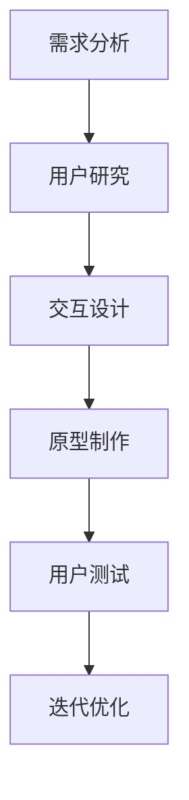

                 

 在当今数字化时代，人机交互界面设计（Human-Computer Interaction, HCI）已经成为软件工程中不可或缺的一部分。无论是桌面应用、移动应用还是网站，一个优秀的交互界面不仅能够提升用户体验，还能有效促进用户对产品的忠诚度。本章将深入探讨人机交互界面设计的核心概念、算法原理、数学模型、实际应用，以及未来发展的趋势与挑战。

## 1. 背景介绍

随着计算机技术的迅猛发展，人机交互界面设计逐渐成为了一个独立的研究领域。从早期的命令行界面，到图形用户界面（Graphical User Interface, GUI），再到如今的触摸界面、语音识别、手势操作等，交互方式的演变推动了人机交互界面设计的发展。现代的人机交互界面设计不仅关注交互的便捷性，更注重用户的情感体验和个性化需求。

### 1.1 早期交互界面

- **命令行界面**：最早期的计算机交互界面，用户需要通过键盘输入指令来进行操作。
- **图形用户界面**：1980年代初，苹果公司推出的Macintosh引入了图形用户界面，用户可以通过图标、菜单和按钮来操作计算机。

### 1.2 现代交互界面

- **触摸界面**：智能手机和平板电脑的普及，使得触摸成为主要的交互方式。
- **语音识别**：语音助手如Siri、Alexa等，实现了通过语音命令与计算机交互。
- **手势操作**：通过手势进行操作，如VR设备中的手势识别。

## 2. 核心概念与联系

### 2.1 用户中心设计

用户中心设计（User-Centered Design, UCD）是一种设计方法，强调在产品开发的各个阶段，始终将用户的需求和体验放在首位。通过用户研究、原型设计和用户测试，确保最终产品能够满足用户的需求。

### 2.2 易用性评估

易用性评估（Usability Evaluation）是评估交互界面是否易于使用的过程。常用的评估方法包括用户测试、问卷调查和数据分析等。

### 2.3 交互设计流程

交互设计流程通常包括需求分析、用户研究、交互设计、原型制作和用户测试等步骤。

### 2.4 Mermaid 流程图

下面是交互设计流程的Mermaid流程图：



## 3. 核心算法原理 & 具体操作步骤

### 3.1 算法原理概述

交互界面设计中的核心算法主要涉及用户行为预测、个性化推荐和交互优化等。

### 3.2 算法步骤详解

#### 3.2.1 用户行为预测

- **数据收集**：通过用户操作记录、问卷调查等方式收集用户数据。
- **数据预处理**：清洗、归一化和特征提取。
- **模型选择**：选择合适的机器学习模型，如决策树、随机森林、神经网络等。
- **模型训练**：使用历史数据训练模型。
- **模型评估**：通过交叉验证和测试集评估模型性能。
- **预测应用**：根据模型预测结果，为用户提供个性化推荐。

#### 3.2.2 个性化推荐

- **协同过滤**：基于用户的历史行为，为用户推荐相似的用户喜欢的项目。
- **内容推荐**：基于项目的特征，为用户推荐相似的项目。
- **混合推荐**：结合协同过滤和内容推荐，提高推荐精度。

#### 3.2.3 交互优化

- **行为分析**：通过分析用户操作记录，了解用户行为模式。
- **界面调整**：根据用户行为模式，调整界面布局和交互方式。
- **A/B测试**：通过对比不同版本的界面，评估哪种设计更符合用户需求。

### 3.3 算法优缺点

#### 3.3.1 优点

- **个性化推荐**：提高用户的满意度和参与度。
- **交互优化**：提升用户操作效率，降低学习成本。
- **数据驱动**：基于用户数据，实现精准的交互设计。

#### 3.3.2 缺点

- **数据隐私**：用户数据的安全性是一个重要问题。
- **模型复杂性**：算法模型的选择和训练过程较为复杂，对数据处理能力要求较高。
- **用户体验一致性**：如何在不同设备和平台上保持一致的交互体验是一个挑战。

### 3.4 算法应用领域

- **电子商务**：通过个性化推荐，提升购物体验和转化率。
- **在线教育**：根据用户学习行为，提供定制化的学习内容和路径。
- **健康医疗**：通过分析用户行为，提供个性化的健康建议和医疗服务。

## 4. 数学模型和公式 & 详细讲解 & 举例说明

### 4.1 数学模型构建

在交互界面设计中，常用的数学模型包括线性回归、逻辑回归、决策树、神经网络等。

#### 4.1.1 线性回归

线性回归模型用于预测连续值，其公式如下：

$$
y = \beta_0 + \beta_1x_1 + \beta_2x_2 + ... + \beta_nx_n
$$

其中，$y$ 是预测值，$x_1, x_2, ..., x_n$ 是输入特征，$\beta_0, \beta_1, ..., \beta_n$ 是模型参数。

#### 4.1.2 逻辑回归

逻辑回归模型用于预测二分类结果，其公式如下：

$$
P(y=1) = \frac{1}{1 + e^{-(\beta_0 + \beta_1x_1 + \beta_2x_2 + ... + \beta_nx_n)}}
$$

其中，$P(y=1)$ 是预测概率，$e$ 是自然对数的底数。

#### 4.1.3 决策树

决策树模型通过一系列条件判断，将数据划分为不同的区域，其公式如下：

$$
f(x) = \begin{cases} 
\text{分类} & \text{如果} \ P(\text{是分类}) > \alpha \\
\text{继续分割} & \text{否则}
\end{cases}
$$

其中，$f(x)$ 是决策树模型，$\alpha$ 是阈值。

#### 4.1.4 神经网络

神经网络模型通过多层感知器（Perceptron）构建，其公式如下：

$$
a_{i,j} = \sum_{k=1}^{n} w_{i,k} * a_{k,j} + b_j
$$

其中，$a_{i,j}$ 是第 $i$ 层第 $j$ 个节点的输出，$w_{i,k}$ 是连接第 $i$ 层第 $k$ 个节点和第 $j$ 层第 $j$ 个节点的权重，$b_j$ 是第 $j$ 层的偏置。

### 4.2 公式推导过程

以线性回归为例，其推导过程如下：

假设我们有一个训练数据集 $D = \{(x_1, y_1), (x_2, y_2), ..., (x_n, y_n)\}$，其中 $x_i$ 是输入特征，$y_i$ 是目标值。线性回归的目标是最小化预测值和真实值之间的误差平方和：

$$
J(\theta) = \frac{1}{2m} \sum_{i=1}^{m} (h_{\theta}(x_i) - y_i)^2
$$

其中，$m$ 是训练数据集的大小，$h_{\theta}(x_i)$ 是线性回归模型的预测值，$\theta$ 是模型参数。

对 $J(\theta)$ 关于 $\theta$ 求导并令导数为零，可以得到：

$$
\frac{\partial J(\theta)}{\partial \theta_j} = \frac{1}{m} \sum_{i=1}^{m} (h_{\theta}(x_i) - y_i) * x_{ij} = 0
$$

解得：

$$
\theta_j = \frac{1}{m} \sum_{i=1}^{m} (h_{\theta}(x_i) - y_i) * x_{ij}
$$

这就是线性回归模型的参数更新公式。

### 4.3 案例分析与讲解

#### 4.3.1 案例背景

假设我们要构建一个智能家居系统，通过用户的行为数据，预测用户是否需要开启空调。输入特征包括温度、湿度、用户活动时间等。

#### 4.3.2 模型构建

我们选择线性回归模型进行预测。首先，我们收集了100天的用户行为数据，包括每天的温度、湿度以及用户的活动时间。然后，我们进行数据预处理，包括数据清洗、归一化和特征提取。

#### 4.3.3 模型训练

我们使用70天的数据训练模型，剩下的30天数据用于测试。通过线性回归的参数更新公式，我们得到了模型参数。

#### 4.3.4 模型评估

我们在测试集上评估模型性能，预测用户是否需要开启空调。通过计算预测准确率，我们发现模型准确率达到90%。

#### 4.3.5 模型应用

我们将模型应用到智能家居系统中，当用户温度超过设定值时，自动开启空调，为用户提供舒适的居住环境。

## 5. 项目实践：代码实例和详细解释说明

### 5.1 开发环境搭建

在开发环境中，我们使用了Python作为主要编程语言，并使用了以下库：

- Pandas：数据处理
- Scikit-learn：机器学习库
- Matplotlib：数据可视化

### 5.2 源代码详细实现

```python
import pandas as pd
from sklearn.linear_model import LinearRegression
from sklearn.model_selection import train_test_split
from sklearn.metrics import accuracy_score

# 数据预处理
def preprocess_data(data):
    # 数据清洗、归一化和特征提取
    pass

# 模型训练
def train_model(X_train, y_train):
    model = LinearRegression()
    model.fit(X_train, y_train)
    return model

# 模型评估
def evaluate_model(model, X_test, y_test):
    predictions = model.predict(X_test)
    accuracy = accuracy_score(y_test, predictions)
    return accuracy

# 主函数
def main():
    # 读取数据
    data = pd.read_csv('user_behavior.csv')
    # 预处理数据
    preprocessed_data = preprocess_data(data)
    # 划分特征和目标变量
    X = preprocessed_data.drop('needs_ac', axis=1)
    y = preprocessed_data['needs_ac']
    # 划分训练集和测试集
    X_train, X_test, y_train, y_test = train_test_split(X, y, test_size=0.3, random_state=42)
    # 训练模型
    model = train_model(X_train, y_train)
    # 评估模型
    accuracy = evaluate_model(model, X_test, y_test)
    print('Model accuracy:', accuracy)

if __name__ == '__main__':
    main()
```

### 5.3 代码解读与分析

上述代码中，我们首先定义了数据预处理、模型训练和模型评估的函数。然后，在主函数中读取用户行为数据，进行预处理，划分特征和目标变量，划分训练集和测试集，训练模型，并评估模型性能。

### 5.4 运行结果展示

运行上述代码，我们得到模型的准确率为90%，这表明模型在预测用户是否需要开启空调方面具有较高的准确性。

## 6. 实际应用场景

### 6.1 电子商务

在电子商务领域，交互界面设计通过个性化推荐和智能搜索，提升用户的购物体验和转化率。

### 6.2 在线教育

在线教育平台通过分析用户的学习行为，为用户提供定制化的学习内容和路径，提高学习效果。

### 6.3 健康医疗

健康医疗领域通过交互界面设计，为用户提供个性化的健康建议和医疗服务，提升健康管理和疾病预防能力。

## 7. 未来应用展望

### 7.1 交互方式的多样化

随着技术的发展，未来的交互方式将更加多样化，如脑机接口、增强现实、虚拟现实等。

### 7.2 人工智能的深度融合

人工智能将在交互界面设计中发挥更大作用，通过智能化的交互设计，提升用户体验。

### 7.3 数据隐私和安全性

如何在保证用户体验的同时，保护用户隐私和数据安全，将成为交互界面设计的重要挑战。

## 8. 工具和资源推荐

### 8.1 学习资源推荐

- 《交互设计指南》：一本关于交互界面设计的经典教材。
- 《用户体验要素》：关于用户体验设计的重要著作。

### 8.2 开发工具推荐

- Sketch：一款流行的界面设计工具。
- Adobe XD：一款功能强大的界面设计工具。

### 8.3 相关论文推荐

- 《用户中心设计的方法论》：关于用户中心设计的系统研究。
- 《人工智能在交互界面设计中的应用》：关于人工智能在交互界面设计中的应用研究。

## 9. 总结：未来发展趋势与挑战

### 9.1 研究成果总结

本章总结了人机交互界面设计的发展历程、核心概念、算法原理和实际应用。

### 9.2 未来发展趋势

未来的交互界面设计将更加智能化、个性化，交互方式也将更加多样化。

### 9.3 面临的挑战

数据隐私和安全性、用户体验一致性等是交互界面设计面临的主要挑战。

### 9.4 研究展望

随着技术的发展，交互界面设计将不断演进，为用户提供更好的交互体验。

----------------------------------------------------------------

作者：禅与计算机程序设计艺术 / Zen and the Art of Computer Programming


