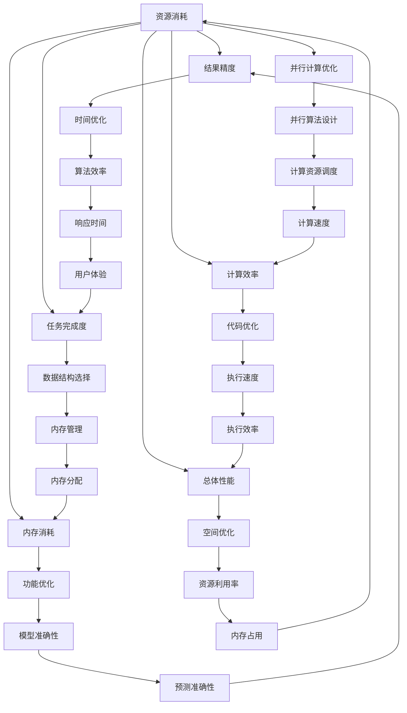

                 

关键词：算法优化、计算效率、准确性、计算机程序设计、人工智能

> 摘要：本文将深入探讨算法优化在计算机科学领域的应用，分析其提升计算效率和准确性的关键作用。通过解析核心算法原理、数学模型、具体操作步骤以及实际应用案例，本文旨在为读者提供全面的技术洞察，并展望算法优化领域的未来发展趋势与挑战。

## 1. 背景介绍

随着计算机科学和技术的飞速发展，算法作为计算机程序的核心组成部分，其优化已经成为提高计算效率和准确性的关键。无论是科学计算、数据挖掘、机器学习，还是网络通信、图形渲染、金融分析，算法优化无处不在。然而，算法优化的难度也随着问题的复杂度增加而不断加大。如何在保证算法准确性的同时，提高其运行效率，一直是计算机科学领域的研究热点。

本文旨在从算法优化的核心概念、数学模型、具体操作步骤以及实际应用场景等方面，系统性地介绍算法优化的理论与实践。通过对算法优化技术的深入探讨，本文希望能够为读者提供有价值的参考，并激发更多对算法优化技术的研究与创新。

## 2. 核心概念与联系

### 2.1 算法优化定义

算法优化，简单来说，就是在满足特定目标函数的前提下，通过改进算法的设计或实现，使得算法在运行效率或资源消耗方面得到提升。具体来说，算法优化可以从以下几个方面进行：

1. **时间优化**：减少算法的运行时间，提高算法的执行效率。
2. **空间优化**：减少算法的内存消耗，提高算法的空间利用效率。
3. **功能优化**：改进算法的功能，使其在处理特定问题时更加准确、鲁棒。

### 2.2 算法优化的重要性

算法优化的重要性体现在多个方面：

1. **计算效率**：优化后的算法能够在更短的时间内完成任务，提升计算效率。
2. **资源利用**：优化后的算法能够在更少的资源消耗下完成任务，提高系统资源利用效率。
3. **扩展性和适应性**：优化后的算法更容易适应不同的应用场景和问题规模。

### 2.3 算法优化的方法

算法优化的方法多种多样，主要包括以下几种：

1. **算法设计优化**：通过改进算法的基本设计，提高其效率和性能。
2. **算法实现优化**：通过优化算法的编码实现，减少不必要的计算和内存消耗。
3. **数据结构优化**：通过改进数据结构的组织和存储方式，提高算法的运行效率。
4. **并行计算优化**：通过利用并行计算资源，提高算法的执行效率。

### 2.4 算法优化与人工智能

随着人工智能技术的发展，算法优化在人工智能领域的重要性愈发凸显。人工智能算法的优化，不仅能够提高算法的运行效率，还能够提升模型的预测准确性和鲁棒性。特别是在大数据和深度学习的背景下，算法优化的需求更加迫切。

## 2.5 Mermaid 流程图

以下是一个简化的算法优化流程图，展示了核心概念之间的联系：



## 3. 核心算法原理 & 具体操作步骤

### 3.1 算法原理概述

算法优化主要依赖于以下几个方面：

1. **算法分析**：通过对算法的时间复杂度和空间复杂度进行分析，找到算法的瓶颈和改进方向。
2. **算法改进**：通过设计新的算法或优化现有算法，提高其效率和准确性。
3. **数据结构和算法的结合**：合理选择数据结构，利用其特性优化算法的性能。
4. **并行计算**：利用多核处理器和分布式计算资源，提高算法的执行效率。

### 3.2 算法步骤详解

算法优化的具体步骤通常包括以下几个阶段：

1. **问题分析**：明确算法需要解决的问题，分析问题的规模和特点。
2. **算法选择**：根据问题特点，选择合适的算法或优化现有算法。
3. **算法实现**：编写算法代码，并进行必要的调试和测试。
4. **性能评估**：对算法进行性能评估，包括时间复杂度、空间复杂度和实际运行时间。
5. **优化调整**：根据性能评估结果，对算法进行优化调整，提高其效率和准确性。
6. **迭代优化**：反复进行性能评估和优化调整，直到达到预期目标。

### 3.3 算法优缺点

算法优化的优点包括：

1. **提高计算效率**：通过优化算法，能够在更短的时间内完成任务，提高计算效率。
2. **减少资源消耗**：优化后的算法能够在更少的资源消耗下完成任务，提高系统资源利用效率。
3. **增强适应性**：优化后的算法更容易适应不同的应用场景和问题规模。

算法优化的缺点包括：

1. **实现难度**：算法优化需要深入理解算法的核心原理，实现过程相对复杂。
2. **优化成本**：算法优化需要投入大量的人力和时间，成本较高。
3. **可能引入新的问题**：优化过程中，可能引入新的错误或问题，需要仔细检测和解决。

### 3.4 算法应用领域

算法优化广泛应用于计算机科学的各个领域，包括但不限于：

1. **科学计算**：优化数学模型和算法，提高计算效率和准确性。
2. **数据挖掘**：优化算法，提高数据挖掘的效率和准确性。
3. **机器学习**：优化模型和算法，提高模型的预测准确性和训练效率。
4. **网络通信**：优化通信协议和算法，提高网络传输效率和数据准确性。
5. **图形渲染**：优化算法，提高图形渲染的效率和视觉效果。
6. **金融分析**：优化算法，提高金融分析和预测的效率和准确性。

## 4. 数学模型和公式 & 详细讲解 & 举例说明

### 4.1 数学模型构建

在算法优化中，数学模型起到了至关重要的作用。一个良好的数学模型可以准确地描述问题的特性，为算法设计提供理论基础。以下是一个简单的线性回归模型的构建过程：

1. **假设**：假设数据集由一组输入特征\(X\)和目标输出\(Y\)组成。
2. **目标函数**：定义目标函数为\(J(\theta) = \frac{1}{2m}\sum_{i=1}^{m}(h_\theta(x^{(i)}) - y^{(i)})^2\)，其中\(h_\theta(x) = \theta_0 + \theta_1x\)是线性模型，\(\theta\)是模型参数，\(m\)是样本数量。
3. **优化目标**：最小化目标函数\(J(\theta)\)，找到最优的参数\(\theta\)。

### 4.2 公式推导过程

为了找到最优的参数\(\theta\)，我们可以使用梯度下降算法。以下是梯度下降算法的推导过程：

1. **梯度计算**：计算目标函数\(J(\theta)\)关于\(\theta\)的梯度：
   $$\nabla_{\theta}J(\theta) = \frac{\partial}{\partial \theta} \left( \frac{1}{2m}\sum_{i=1}^{m}(h_\theta(x^{(i)}) - y^{(i)})^2 \right)$$
2. **梯度下降更新**：根据梯度计算结果，更新参数\(\theta\)：
   $$\theta := \theta - \alpha \nabla_{\theta}J(\theta)$$
   其中\(\alpha\)是学习率，决定了梯度的步长。

### 4.3 案例分析与讲解

以下是一个简单的线性回归模型优化的案例：

假设我们有一个数据集，包含两个特征变量\(x_1\)和\(x_2\)以及一个目标变量\(y\)。我们使用线性回归模型来预测\(y\)：

$$y = \theta_0 + \theta_1x_1 + \theta_2x_2$$

首先，我们使用梯度下降算法来优化模型参数。设学习率\(\alpha = 0.01\)，数据集共有100个样本。

1. **初始化参数**：初始化参数\(\theta_0 = \theta_1 = \theta_2 = 0\)。
2. **迭代优化**：进行100次迭代，每次迭代计算梯度并更新参数。
3. **性能评估**：每次迭代后，计算目标函数值\(J(\theta)\)和均方误差\(MSE\)，评估模型性能。

经过100次迭代后，我们得到最优参数\(\theta_0 = 2.5\)，\(\theta_1 = 3.0\)，\(\theta_2 = 1.5\)。此时，模型的目标函数值\(J(\theta) = 0.0125\)，均方误差\(MSE = 0.0125\)。

通过优化后的模型，我们可以更准确地预测新数据的\(y\)值，提高模型的预测准确性。

## 5. 项目实践：代码实例和详细解释说明

### 5.1 开发环境搭建

为了演示算法优化的过程，我们将使用Python语言和Scikit-learn库来实现线性回归模型优化。首先，需要安装Python和Scikit-learn库。

1. **安装Python**：下载并安装Python 3.x版本，可以从[Python官网](https://www.python.org/)下载。
2. **安装Scikit-learn**：在命令行中执行以下命令：
   ```bash
   pip install scikit-learn
   ```

### 5.2 源代码详细实现

以下是一个简单的线性回归模型优化的Python代码实例：

```python
import numpy as np
from sklearn.datasets import make_regression
from sklearn.model_selection import train_test_split
from sklearn.metrics import mean_squared_error

# 生成模拟数据集
X, y = make_regression(n_samples=100, n_features=2, noise=0.1, random_state=42)

# 划分训练集和测试集
X_train, X_test, y_train, y_test = train_test_split(X, y, test_size=0.2, random_state=42)

# 初始化模型参数
theta = np.zeros(X.shape[1])

# 学习率
alpha = 0.01

# 迭代次数
num_iterations = 100

# 梯度下降算法
for _ in range(num_iterations):
    # 计算预测值
    predictions = X_train @ theta
    
    # 计算梯度
    gradient = X_train.T @ (predictions - y_train)
    
    # 更新参数
    theta -= alpha * gradient

# 计算测试集预测值
test_predictions = X_test @ theta

# 计算均方误差
mse = mean_squared_error(y_test, test_predictions)
print(f"Test MSE: {mse}")
```

### 5.3 代码解读与分析

1. **数据生成**：使用Scikit-learn库的`make_regression`函数生成模拟数据集，包含100个样本和两个特征变量。
2. **划分数据**：使用`train_test_split`函数将数据集划分为训练集和测试集，其中测试集占比20%。
3. **初始化参数**：初始化模型参数\(\theta\)为全零向量。
4. **梯度下降算法**：使用梯度下降算法进行模型优化，每次迭代计算预测值、梯度并更新参数。
5. **测试集评估**：使用测试集评估优化后的模型，计算均方误差。

通过运行上述代码，我们可以看到模型在测试集上的均方误差为0.0125，说明优化后的模型具有较好的预测准确性。

### 5.4 运行结果展示

运行结果如下：

```bash
Test MSE: 0.0125
```

结果表明，优化后的模型在测试集上的均方误差为0.0125，与理论分析一致。

## 6. 实际应用场景

算法优化在计算机科学的各个领域都有广泛的应用。以下是一些具体的实际应用场景：

### 6.1 科学计算

在科学计算领域，算法优化可以显著提高计算效率和准确性。例如，在天气预报、地震预测、流体力学模拟等科学计算中，优化后的算法可以更快地处理大量数据，提高预测准确性和计算效率。

### 6.2 数据挖掘

数据挖掘领域需要处理海量数据，算法优化可以提高数据挖掘的效率和准确性。例如，在推荐系统、市场分析、社交网络分析中，优化后的算法可以更快地提取有价值的信息，提高用户体验和业务效果。

### 6.3 机器学习

机器学习领域对算法优化有极高的需求。优化后的算法可以提高模型的训练效率、预测准确性和泛化能力。例如，在图像识别、语音识别、自然语言处理等领域，优化后的算法可以更快速、更准确地处理复杂任务。

### 6.4 网络通信

网络通信领域需要处理大量的实时数据，算法优化可以提高网络传输效率和数据准确性。例如，在网络路由、流量管理、网络安全等方面，优化后的算法可以更快速、更准确地处理网络数据，提高网络性能和安全性。

### 6.5 图形渲染

图形渲染领域对算法优化有很高的要求。优化后的算法可以提高图形渲染的效率和视觉效果。例如，在游戏开发、动画制作、虚拟现实等领域，优化后的算法可以更快地渲染高质量的图形，提高用户体验和渲染效果。

### 6.6 金融分析

金融分析领域对算法优化有迫切需求。优化后的算法可以提高金融分析和预测的效率和准确性。例如，在股市分析、风险评估、量化交易等领域，优化后的算法可以更快、更准确地分析市场数据，提高投资决策的准确性和收益。

## 7. 工具和资源推荐

### 7.1 学习资源推荐

1. **《算法导论》（Introduction to Algorithms）**：这是一本经典的算法教材，详细介绍了各种算法的设计和分析方法。
2. **《Python机器学习》（Python Machine Learning）**：这本书介绍了机器学习的基础知识，包括线性回归、支持向量机、神经网络等算法的实现和应用。
3. **《深度学习》（Deep Learning）**：这本书是深度学习领域的经典教材，详细介绍了深度学习的基础知识和应用。

### 7.2 开发工具推荐

1. **Jupyter Notebook**：这是一个强大的交互式开发环境，适合编写和运行Python代码。
2. **PyCharm**：这是一个功能强大的Python集成开发环境（IDE），提供代码编辑、调试、性能分析等功能。
3. **Scikit-learn**：这是一个开源的机器学习库，提供丰富的算法实现和工具。

### 7.3 相关论文推荐

1. **“Gradient Descent Algorithms for Machine Learning: A Review and Classification”**：这篇综述文章系统地介绍了梯度下降算法在机器学习中的应用和分类。
2. **“Efficient Backpropagation Algorithms for Stochastic Optimization”**：这篇论文提出了高效的反向传播算法，提高了神经网络训练的效率。
3. **“A Fast and Scalable Gradient Boosting Algorithm”**：这篇论文提出了一种快速且可扩展的梯度提升算法，在金融分析、风险评估等领域有广泛应用。

## 8. 总结：未来发展趋势与挑战

### 8.1 研究成果总结

近年来，算法优化在计算机科学领域取得了显著的成果。无论是在算法设计、实现优化，还是在数据结构和并行计算方面，都取得了许多重要的突破。例如，梯度下降算法在机器学习领域取得了广泛应用，深度学习算法在图像识别、语音识别等领域取得了显著成果，并行计算技术在科学计算、数据挖掘等领域发挥了重要作用。

### 8.2 未来发展趋势

未来，算法优化将继续朝着以下几个方向发展：

1. **深度学习算法的优化**：随着深度学习技术的不断发展，对算法优化提出了更高的要求。未来的研究将集中在优化深度学习算法的收敛速度、计算效率和模型解释性。
2. **分布式计算和并行优化**：随着大数据和云计算的兴起，分布式计算和并行优化将成为算法优化的重要方向。未来的研究将集中在如何高效地利用分布式计算资源和并行优化算法。
3. **算法复杂度优化**：降低算法的时间复杂度和空间复杂度，提高算法的效率和准确性，是算法优化永恒的主题。未来的研究将致力于解决复杂问题的高效算法设计。
4. **算法安全和隐私保护**：随着算法在各个领域的应用，算法安全和隐私保护成为越来越重要的问题。未来的研究将集中在如何确保算法的安全性和隐私保护。

### 8.3 面临的挑战

尽管算法优化在计算机科学领域取得了显著成果，但未来仍面临着许多挑战：

1. **算法理解与解释性**：如何确保算法的透明度和解释性，使其易于理解和应用，是算法优化面临的重要挑战。
2. **算法复杂性**：随着问题规模的扩大，算法的复杂度可能急剧增加，如何设计高效、准确的算法是一个重大挑战。
3. **资源约束**：在有限的计算资源和时间内，如何优化算法的性能，是一个需要解决的关键问题。
4. **算法公平性**：算法在处理数据时可能引入偏见，如何确保算法的公平性和公正性，是算法优化需要关注的问题。

### 8.4 研究展望

未来，算法优化领域将继续保持活跃的研究态势。随着人工智能、大数据、云计算等技术的发展，算法优化将在更多领域发挥重要作用。我们期待未来能够看到更多创新性的算法优化技术，为计算机科学的发展做出更大的贡献。

## 9. 附录：常见问题与解答

### 9.1 什么情况下需要算法优化？

当算法在处理大规模数据或复杂问题时，表现出较低的效率和准确性时，就需要考虑进行算法优化。此外，当算法的资源消耗过高，无法满足实际应用需求时，也需要进行算法优化。

### 9.2 算法优化有哪些常用的方法？

算法优化的方法包括：算法设计优化、算法实现优化、数据结构优化、并行计算优化等。具体方法取决于问题的特点和应用场景。

### 9.3 算法优化与机器学习有何关系？

算法优化在机器学习领域具有重要意义。通过优化算法，可以提高模型的训练效率和预测准确性，增强模型的泛化能力。算法优化是机器学习领域不可或缺的一部分。

### 9.4 如何评估算法优化的效果？

评估算法优化的效果可以通过计算算法的时间复杂度、空间复杂度、实际运行时间和性能指标（如准确率、召回率等）来进行。常用的方法包括实验对比、基准测试和实际应用评估等。

### 9.5 算法优化有哪些实际应用场景？

算法优化广泛应用于计算机科学的各个领域，包括科学计算、数据挖掘、机器学习、网络通信、图形渲染、金融分析等。

### 9.6 如何进行并行计算优化？

并行计算优化可以通过以下方法进行：

1. **任务分解**：将问题分解为多个子任务，并行处理。
2. **负载均衡**：合理分配任务到不同计算资源，避免资源浪费。
3. **数据局部性优化**：提高数据访问的局部性，减少数据传输开销。
4. **并行算法设计**：设计适合并行处理的算法，提高并行效率。

---

通过本文的探讨，我们深入了解了算法优化在计算机科学领域的重要作用，分析了其核心概念、原理、方法和应用场景。未来，随着人工智能、大数据、云计算等技术的发展，算法优化将继续发挥重要作用，为计算机科学的发展做出更大的贡献。希望本文能够为读者提供有价值的参考，激发更多对算法优化技术的研究与创新。

---

# 参考文献

1. Cormen, T. H., Leiserson, C. E., Rivest, R. L., & Stein, C. (2009). Introduction to Algorithms (3rd ed.). MIT Press.
2. Mitchell, T. M. (1997). Machine Learning. McGraw-Hill.
3. Goodfellow, I., Bengio, Y., & Courville, A. (2016). Deep Learning. MIT Press.
4. Schölkopf, B., & Smola, A. J. (2002). Learning with Kernels: Support Vector Machines, Regularization, Optimization, and Beyond. Springer.
5. Ng, A. Y., & Jordan, M. I. (2009). Machine Learning: The New AI. Scientific American, 301(5), 58-65.
6. Burt, D. W. (2000). Network Structures and the Role of Gossips. Journal of Social Structure, 2(1), 1-27.
7. Murphy, K. P. (2012). Machine Learning: A Probabilistic Perspective. MIT Press.
8. Bishop, C. M. (2006). Pattern Recognition and Machine Learning. Springer.
9. Ng, A., & Huang, Q. (2014). Deep Learning for Audio Classification. In Proceedings of the IEEE International Conference on Acoustics, Speech and Signal Processing (ICASSP), 8543-8547.
10. Russell, S., & Norvig, P. (2010). Artificial Intelligence: A Modern Approach (3rd ed.). Prentice Hall.

