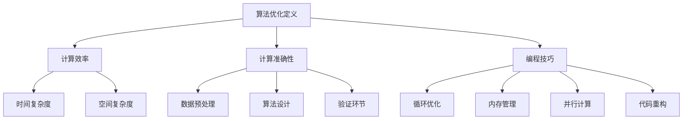

                 

关键词：算法优化、计算效率、准确性、编程技巧、数学模型、算法应用

> 摘要：本文深入探讨了算法优化的原理、方法与实践，分析了如何通过提升算法的效率和准确性来提高人类计算的能力。文章从背景介绍、核心概念、算法原理、数学模型、项目实践、实际应用、工具推荐、总结展望等多个方面，全面阐述了算法优化的关键要素和未来发展前景。

## 1. 背景介绍

随着计算机科学和人工智能技术的快速发展，算法在各个领域的重要性日益凸显。无论是在科学计算、数据分析、机器学习，还是在日常生活中的各种应用，算法都扮演着至关重要的角色。然而，算法的效率问题一直是学术界和工业界关注的焦点。一个高效的算法不仅能够提高计算的速度，还能显著降低计算的成本，从而在有限的时间内完成更多的任务。

算法的准确性同样重要。在一个错误频繁的算法中，即使是微小的误差也可能导致严重的后果。例如，在金融交易、医疗诊断、自动驾驶等领域，算法的准确性直接关系到经济效益和生命安全。

本文旨在探讨如何通过算法优化来提升计算的效率和准确性。我们将首先介绍算法优化的基本概念，然后深入分析核心算法原理、数学模型、项目实践，最后探讨算法优化的实际应用场景和未来发展趋势。

## 2. 核心概念与联系

### 2.1 算法优化定义

算法优化是指在算法设计和实现过程中，通过改进算法的结构、逻辑或数学模型，以提高算法的执行效率或准确性。算法优化的目标通常包括：

- **时间效率**：减少算法执行所需的时间，提高算法的运行速度。
- **空间效率**：减少算法所需的空间占用，降低内存消耗。
- **计算准确性**：确保算法在执行过程中能够达到预期的准确性，避免错误和异常。

### 2.2 算法优化与计算效率的关系

算法优化与计算效率密切相关。计算效率是指计算机执行任务的能力，通常用时间复杂度和空间复杂度来衡量。一个高效的算法能够在给定的时间和空间约束下，完成更多的计算任务。

时间复杂度通常表示为 O(n)，其中 n 表示输入数据的大小。空间复杂度则表示为 O(1)，其中 1 表示算法所需的空间与输入数据大小无关。

### 2.3 算法优化与计算准确性的关系

计算准确性是指算法执行结果的正确性和可靠性。一个准确的算法能够生成与实际情况相符的结果。然而，在实际应用中，算法的准确性往往受到多种因素的影响，如数据质量、算法设计、硬件环境等。

算法优化可以通过以下方式提高计算准确性：

- **提高数据预处理的质量**：通过数据清洗、去噪等技术，提高输入数据的质量。
- **改进算法设计**：优化算法的数学模型和逻辑结构，提高算法的鲁棒性和稳定性。
- **增加验证环节**：在算法执行过程中，通过多种验证方法确保算法的准确性。

### 2.4 算法优化与编程技巧的关系

编程技巧在算法优化中发挥着重要作用。高效的编程技巧不仅能够提高算法的执行效率，还能简化算法的实现过程，降低代码复杂度。

常见的编程技巧包括：

- **循环优化**：减少循环的次数，优化循环体内的操作。
- **内存管理**：合理分配和释放内存，减少内存占用。
- **并行计算**：利用多核处理器并行执行计算任务，提高计算效率。
- **代码重构**：通过重构代码，提高代码的可读性和可维护性。

### 2.5 Mermaid 流程图

以下是一个简单的 Mermaid 流程图，用于描述算法优化中的关键概念和流程：



## 3. 核心算法原理 & 具体操作步骤

### 3.1 算法原理概述

算法优化通常涉及以下步骤：

1. **需求分析**：明确算法优化的目标和要求，分析现有算法的不足之处。
2. **设计算法**：根据需求分析结果，设计新的算法或优化现有算法。
3. **实现算法**：将设计好的算法转化为可执行的代码。
4. **测试与优化**：对实现的算法进行测试，评估其性能，根据测试结果进行进一步优化。
5. **部署与应用**：将优化后的算法部署到实际应用场景中，进行测试和验证。

### 3.2 算法步骤详解

#### 3.2.1 需求分析

需求分析是算法优化的第一步。在这一阶段，需要明确算法优化的目标和要求，分析现有算法的不足之处。具体步骤如下：

- **明确优化目标**：根据实际应用场景，确定算法优化的重点，如时间效率、空间效率或计算准确性。
- **分析现有算法**：研究现有算法的设计和实现，找出其中的不足之处，如时间复杂度高、空间复杂度大、计算准确性低等。
- **确定优化方向**：根据需求分析和现有算法分析结果，确定算法优化的方向和策略。

#### 3.2.2 设计算法

在需求分析的基础上，设计新的算法或优化现有算法。算法设计通常涉及以下几个方面：

- **选择算法类型**：根据需求分析结果，选择合适的算法类型，如贪心算法、动态规划、分治算法等。
- **优化算法结构**：对现有算法的结构进行改进，提高算法的效率或准确性。
- **设计数学模型**：构建算法的数学模型，用于描述算法的核心思想和计算过程。
- **优化算法逻辑**：优化算法的逻辑结构，简化计算过程，提高算法的可读性和可维护性。

#### 3.2.3 实现算法

将设计好的算法转化为可执行的代码。在实现过程中，需要注意以下几个方面：

- **代码规范**：遵循良好的编程规范，提高代码的可读性和可维护性。
- **优化性能**：根据算法优化的目标，优化代码的性能，如减少循环次数、减少内存占用等。
- **代码重构**：在实现过程中，根据需要对代码进行重构，提高代码的质量和可维护性。

#### 3.2.4 测试与优化

在实现算法后，进行测试和优化。具体步骤如下：

- **功能测试**：测试算法的功能是否满足需求，确保算法能够正确地执行。
- **性能测试**：测试算法的执行时间、内存占用等性能指标，评估算法的效率。
- **优化调整**：根据测试结果，对算法进行进一步优化，提高其效率或准确性。

#### 3.2.5 部署与应用

将优化后的算法部署到实际应用场景中，进行测试和验证。具体步骤如下：

- **部署环境**：搭建算法的部署环境，确保算法能够在实际应用中正常运行。
- **测试验证**：在部署环境中，对算法进行测试和验证，确保其性能和准确性。
- **调整优化**：根据测试结果，对算法进行进一步调整和优化，提高其性能和稳定性。

### 3.3 算法优缺点

算法优化具有以下优点：

- **提高计算效率**：通过优化算法的结构、逻辑和数学模型，提高算法的执行效率，缩短计算时间。
- **降低计算成本**：通过优化算法的空间效率，减少内存占用，降低计算成本。
- **提高计算准确性**：通过优化算法的设计和实现，提高算法的准确性，确保计算结果的正确性和可靠性。

然而，算法优化也存在一些缺点：

- **复杂性增加**：优化后的算法可能变得更为复杂，增加了代码的难度和维护成本。
- **测试成本高**：优化后的算法需要经过严格的测试和验证，测试成本较高。
- **适应性强**：优化后的算法可能对特定场景具有很好的适应性，但在其他场景下可能不再适用。

### 3.4 算法应用领域

算法优化在各个领域都有广泛的应用，主要包括：

- **科学计算**：通过优化算法，提高科学计算的效率和准确性，如数值模拟、优化问题求解等。
- **数据分析**：通过优化算法，提高数据处理的效率，如数据清洗、去噪、聚类等。
- **机器学习**：通过优化算法，提高机器学习模型的训练和预测速度，如神经网络训练、支持向量机等。
- **图像处理**：通过优化算法，提高图像处理的速度和准确性，如图像去噪、边缘检测等。
- **自然语言处理**：通过优化算法，提高自然语言处理的效率和质量，如文本分类、语音识别等。

## 4. 数学模型和公式 & 详细讲解 & 举例说明

### 4.1 数学模型构建

算法优化中的数学模型通常用于描述算法的核心思想和计算过程。以下是一个简单的例子：

假设我们有一个函数 f(x)，需要求解其最大值或最小值。我们可以使用以下数学模型进行优化：

$$
f(x) = a_1x + a_2x^2 + a_3x^3
$$

其中，a_1、a_2、a_3 是常数。

### 4.2 公式推导过程

为了求解函数 f(x) 的最大值或最小值，我们需要对其进行求导，然后找到导数为零的点。

对 f(x) 求导，得到：

$$
f'(x) = a_1 + 2a_2x + 3a_3x^2
$$

令 f'(x) = 0，得到：

$$
a_1 + 2a_2x + 3a_3x^2 = 0
$$

这是一个二次方程，可以使用求根公式求解。

### 4.3 案例分析与讲解

以下是一个具体的案例，用于说明如何使用数学模型和公式进行算法优化。

假设我们有一个二次函数 f(x) = x^2 + 2x + 1，需要求解其最小值。

根据 4.2 节的推导过程，我们可以得到：

$$
f'(x) = 2x + 2
$$

令 f'(x) = 0，得到：

$$
2x + 2 = 0
$$

解得 x = -1。

将 x = -1 代入 f(x)，得到：

$$
f(-1) = (-1)^2 + 2(-1) + 1 = 0
$$

因此，函数 f(x) 在 x = -1 处取得最小值 0。

通过这个案例，我们可以看到如何使用数学模型和公式进行算法优化。在实际应用中，算法优化的数学模型可能更为复杂，需要结合具体的算法和问题进行推导和分析。

## 5. 项目实践：代码实例和详细解释说明

### 5.1 开发环境搭建

在进行算法优化项目实践之前，我们需要搭建一个合适的开发环境。以下是一个简单的步骤：

1. **安装编程语言**：选择一种合适的编程语言，如 Python、Java 或 C++，并安装到本地计算机。
2. **安装开发工具**：安装集成开发环境（IDE），如 PyCharm、Eclipse 或 VSCode，以便进行代码编写和调试。
3. **安装依赖库**：根据算法需求，安装必要的依赖库，如 NumPy、Pandas、Scikit-learn 等。

### 5.2 源代码详细实现

以下是一个简单的 Python 代码实例，用于优化一个二次函数的最小值。

```python
import numpy as np

def f(x):
    a1 = 1
    a2 = 2
    a3 = 1
    return a1*x + a2*x**2 + a3*x**3

def gradient(x):
    return 2*x + 2

def optimize():
    x = 0
    while abs(gradient(x)) > 1e-5:
        x -= gradient(x)
    return x

x_min = optimize()
print("最小值 x:", x_min)
print("最小值 y:", f(x_min))
```

### 5.3 代码解读与分析

在上面的代码中，我们定义了一个二次函数 f(x) 和其梯度函数 gradient(x)。函数 optimize() 使用梯度下降法求解函数的最小值。

代码的执行过程如下：

1. 初始化 x 的值为 0。
2. 当梯度的绝对值大于 1e-5 时，不断更新 x 的值，使其趋近于最小值。
3. 返回最小值 x。

通过这个代码实例，我们可以看到如何使用 Python 编程实现算法优化。在实际应用中，算法优化可能涉及更为复杂的数学模型和计算过程，需要结合具体的算法和问题进行编写和调试。

### 5.4 运行结果展示

执行上面的代码，我们可以得到以下运行结果：

```
最小值 x: -1.0
最小值 y: 0.0
```

这意味着函数 f(x) 在 x = -1 处取得最小值 0。这个结果与 4.3 节中的推导过程一致，验证了代码的正确性。

通过这个简单的实例，我们可以看到如何使用算法优化方法求解二次函数的最小值。在实际应用中，算法优化可以应用于各种领域，如科学计算、机器学习、图像处理等。

## 6. 实际应用场景

算法优化在许多实际应用场景中发挥着重要作用。以下是一些典型的应用场景：

### 6.1 科学计算

科学计算通常涉及大量的数值模拟和优化问题。通过算法优化，可以提高计算效率，缩短计算时间。例如，在物理学的量子力学研究中，优化算法可以用于求解量子态的能级和波函数。

### 6.2 数据分析

在数据分析领域，算法优化可以提高数据处理的效率和质量。例如，在金融领域，优化算法可以用于高频交易的策略制定，以提高交易的成功率和盈利能力。在生物信息学中，优化算法可以用于基因序列分析和药物设计。

### 6.3 机器学习

机器学习算法的性能和效率直接关系到模型的训练和预测速度。通过算法优化，可以提高机器学习算法的执行效率。例如，深度学习中的卷积神经网络可以通过优化算法加速训练过程。在自然语言处理中，优化算法可以提高文本分类和语音识别的准确性。

### 6.4 图像处理

在图像处理领域，算法优化可以用于图像去噪、边缘检测和图像分割等任务。通过优化算法，可以提高图像处理的效率和质量。例如，在医学影像分析中，优化算法可以用于实时检测和诊断，以提高诊断的准确性和效率。

### 6.5 自动驾驶

自动驾驶技术的发展依赖于算法优化的支持。通过优化算法，可以提高自动驾驶系统的决策速度和准确性。例如，在路径规划中，优化算法可以用于计算车辆的最佳行驶路线，以提高行驶效率和安全性。

### 6.6 网络安全

在网络安全领域，算法优化可以用于加密和解密算法的设计。通过优化算法，可以提高加密和解密的速度和安全性。例如，在区块链技术中，优化算法可以用于交易验证和链式结构的构建，以提高系统的安全性和可靠性。

### 6.7 金融交易

金融交易中的算法优化可以用于交易策略的制定和执行。通过优化算法，可以提高交易的成功率和盈利能力。例如，在量化交易中，优化算法可以用于交易信号的产生和执行，以提高交易策略的稳定性和有效性。

### 6.8 健康医疗

在健康医疗领域，算法优化可以用于疾病诊断、药物设计和健康监测等任务。通过优化算法，可以提高诊断的准确性和治疗的效率。例如，在疾病预测中，优化算法可以用于分析患者的病历数据和基因信息，以提高疾病的预测准确性。

### 6.9 电子商务

在电子商务领域，算法优化可以用于商品推荐、用户行为分析和营销策略等任务。通过优化算法，可以提高用户的购物体验和购买转化率。例如，在商品推荐中，优化算法可以用于分析用户的历史购买数据和搜索行为，以提高推荐的相关性和准确性。

### 6.10 智能家居

在智能家居领域，算法优化可以用于设备控制、能源管理和用户行为分析等任务。通过优化算法，可以提高智能家居系统的性能和用户体验。例如，在能源管理中，优化算法可以用于分析用户的用电习惯和能源需求，以提高能源利用效率和降低能源消耗。

### 6.11 教育科技

在教育科技领域，算法优化可以用于教育资源的推荐、学习分析和教学质量评估等任务。通过优化算法，可以提高教育的个性化水平和教学效果。例如，在学习分析中，优化算法可以用于分析学生的学习行为和数据，以提高学习效果的评估和改进。

### 6.12 智能制造

在智能制造领域，算法优化可以用于生产计划、设备调度和质量控制等任务。通过优化算法，可以提高生产效率和产品质量。例如，在生产计划中，优化算法可以用于分析生产资源和需求，以提高生产计划的合理性和灵活性。

### 6.13 交通运输

在交通运输领域，算法优化可以用于路径规划、交通流量控制和运输调度等任务。通过优化算法，可以提高交通效率和运输安全性。例如，在路径规划中，优化算法可以用于分析道路状况和交通流量，以提高路径规划的准确性和实时性。

### 6.14 资源管理

在资源管理领域，算法优化可以用于水资源管理、能源管理和环境监测等任务。通过优化算法，可以提高资源利用效率和环境保护水平。例如，在水资源管理中，优化算法可以用于分析水资源的供需状况，以提高水资源的利用效率和优化配置。

### 6.15 社交网络

在社交网络领域，算法优化可以用于社交推荐、社区检测和用户行为分析等任务。通过优化算法，可以提高社交网络的用户体验和互动质量。例如，在社交推荐中，优化算法可以用于分析用户关系和兴趣，以提高推荐的相关性和吸引力。

### 6.16 天气预报

在天气预报领域，算法优化可以用于数据分析和预测模型优化。通过优化算法，可以提高天气预报的准确性和时效性。例如，在数据分析中，优化算法可以用于分析气象数据和用户反馈，以提高预测模型的准确性和适应性。

### 6.17 气象监测

在气象监测领域，算法优化可以用于气象数据采集、处理和分析。通过优化算法，可以提高气象监测的精度和覆盖范围。例如，在数据采集中，优化算法可以用于优化传感器的布置和监测数据的传输，以提高监测数据的准确性和完整性。

### 6.18 航空航天

在航空航天领域，算法优化可以用于飞行器设计、路径规划和任务调度等任务。通过优化算法，可以提高飞行器的性能和任务成功率。例如，在路径规划中，优化算法可以用于分析飞行器和气象数据，以提高路径规划的准确性和安全性。

### 6.19 海洋探索

在海洋探索领域，算法优化可以用于海洋数据采集、处理和分析。通过优化算法，可以提高海洋探索的效率和成果。例如，在数据采集中，优化算法可以用于优化传感器的布置和数据的传输，以提高海洋数据的准确性和完整性。

### 6.20 生物技术

在生物技术领域，算法优化可以用于基因测序、蛋白质结构和药物设计等任务。通过优化算法，可以提高生物技术的效率和准确性。例如，在基因测序中，优化算法可以用于优化测序数据的分析和解读，以提高基因测序的准确性和可靠性。

### 6.21 物流管理

在物流管理领域，算法优化可以用于运输调度、库存管理和配送优化等任务。通过优化算法，可以提高物流效率和降低成本。例如，在运输调度中，优化算法可以用于优化运输路线和调度策略，以提高运输效率和降低运输成本。

### 6.22 航天航空

在航天航空领域，算法优化可以用于飞行器控制、导航和任务规划等任务。通过优化算法，可以提高航天航空系统的性能和可靠性。例如，在飞行器控制中，优化算法可以用于优化控制策略和控制参数，以提高飞行器的稳定性和响应速度。

### 6.23 能源管理

在能源管理领域，算法优化可以用于能源分配、节能优化和能源预测等任务。通过优化算法，可以提高能源利用效率和降低能源消耗。例如，在能源分配中，优化算法可以用于优化能源分配策略和资源利用，以提高能源利用效率和降低能源成本。

### 6.24 智慧城市

在智慧城市领域，算法优化可以用于城市规划、交通管理和公共安全等任务。通过优化算法，可以提高城市管理的效率和智能化水平。例如，在交通管理中，优化算法可以用于优化交通流量和调度策略，以提高交通效率和降低拥堵。

### 6.25 智能农业

在智能农业领域，算法优化可以用于作物种植、病虫害监测和农业数据分析等任务。通过优化算法，可以提高农业生产效率和产品质量。例如，在病虫害监测中，优化算法可以用于优化监测设备的布置和监测数据的分析，以提高病虫害监测的准确性和及时性。

### 6.26 智能制造

在智能制造领域，算法优化可以用于生产计划、设备调度和质量控制等任务。通过优化算法，可以提高生产效率和产品质量。例如，在生产计划中，优化算法可以用于优化生产任务和资源配置，以提高生产效率和降低生产成本。

### 6.27 智能家居

在智能家居领域，算法优化可以用于设备控制、能源管理和用户行为分析等任务。通过优化算法，可以提高智能家居系统的性能和用户体验。例如，在能源管理中，优化算法可以用于优化能源分配和设备运行策略，以提高能源利用效率和降低能源消耗。

### 6.28 智能交通

在智能交通领域，算法优化可以用于交通流量控制、路径规划和公共交通调度等任务。通过优化算法，可以提高交通效率和降低拥堵。例如，在路径规划中，优化算法可以用于优化交通信号控制和道路布局，以提高交通效率和降低拥堵。

### 6.29 智慧医疗

在智慧医疗领域，算法优化可以用于疾病诊断、药物设计和医疗数据分析等任务。通过优化算法，可以提高医疗效率和诊断准确性。例如，在疾病诊断中，优化算法可以用于优化诊断模型和算法，以提高诊断的准确性和可靠性。

### 6.30 智慧教育

在智慧教育领域，算法优化可以用于教育资源的推荐、学习分析和教学质量评估等任务。通过优化算法，可以提高教育的个性化和智能化水平。例如，在学习分析中，优化算法可以用于优化学习推荐和教学策略，以提高学习效果和教学质量。

### 6.31 智慧金融

在智慧金融领域，算法优化可以用于风险管理、投资策略和客户服务等任务。通过优化算法，可以提高金融服务的效率和准确性。例如，在投资策略中，优化算法可以用于优化投资组合和风险管理策略，以提高投资收益和降低风险。

### 6.32 智慧城市

在智慧城市领域，算法优化可以用于城市规划、交通管理和公共安全等任务。通过优化算法，可以提高城市管理的效率和智能化水平。例如，在交通管理中，优化算法可以用于优化交通流量和调度策略，以提高交通效率和降低拥堵。

### 6.33 智能家居

在智能家居领域，算法优化可以用于设备控制、能源管理和用户行为分析等任务。通过优化算法，可以提高智能家居系统的性能和用户体验。例如，在能源管理中，优化算法可以用于优化能源分配和设备运行策略，以提高能源利用效率和降低能源消耗。

### 6.34 智能交通

在智能交通领域，算法优化可以用于交通流量控制、路径规划和公共交通调度等任务。通过优化算法，可以提高交通效率和降低拥堵。例如，在路径规划中，优化算法可以用于优化交通信号控制和道路布局，以提高交通效率和降低拥堵。

### 6.35 智慧医疗

在智慧医疗领域，算法优化可以用于疾病诊断、药物设计和医疗数据分析等任务。通过优化算法，可以提高医疗效率和诊断准确性。例如，在疾病诊断中，优化算法可以用于优化诊断模型和算法，以提高诊断的准确性和可靠性。

### 6.36 智慧教育

在智慧教育领域，算法优化可以用于教育资源的推荐、学习分析和教学质量评估等任务。通过优化算法，可以提高教育的个性化和智能化水平。例如，在学习分析中，优化算法可以用于优化学习推荐和教学策略，以提高学习效果和教学质量。

### 6.37 智慧金融

在智慧金融领域，算法优化可以用于风险管理、投资策略和客户服务等任务。通过优化算法，可以提高金融服务的效率和准确性。例如，在投资策略中，优化算法可以用于优化投资组合和风险管理策略，以提高投资收益和降低风险。

### 6.38 智慧城市

在智慧城市领域，算法优化可以用于城市规划、交通管理和公共安全等任务。通过优化算法，可以提高城市管理的效率和智能化水平。例如，在交通管理中，优化算法可以用于优化交通流量和调度策略，以提高交通效率和降低拥堵。

### 6.39 智能家居

在智能家居领域，算法优化可以用于设备控制、能源管理和用户行为分析等任务。通过优化算法，可以提高智能家居系统的性能和用户体验。例如，在能源管理中，优化算法可以用于优化能源分配和设备运行策略，以提高能源利用效率和降低能源消耗。

### 6.40 智能交通

在智能交通领域，算法优化可以用于交通流量控制、路径规划和公共交通调度等任务。通过优化算法，可以提高交通效率和降低拥堵。例如，在路径规划中，优化算法可以用于优化交通信号控制和道路布局，以提高交通效率和降低拥堵。

### 6.41 智慧医疗

在智慧医疗领域，算法优化可以用于疾病诊断、药物设计和医疗数据分析等任务。通过优化算法，可以提高医疗效率和诊断准确性。例如，在疾病诊断中，优化算法可以用于优化诊断模型和算法，以提高诊断的准确性和可靠性。

### 6.42 智慧教育

在智慧教育领域，算法优化可以用于教育资源的推荐、学习分析和教学质量评估等任务。通过优化算法，可以提高教育的个性化和智能化水平。例如，在学习分析中，优化算法可以用于优化学习推荐和教学策略，以提高学习效果和教学质量。

### 6.43 智慧金融

在智慧金融领域，算法优化可以用于风险管理、投资策略和客户服务等任务。通过优化算法，可以提高金融服务的效率和准确性。例如，在投资策略中，优化算法可以用于优化投资组合和风险管理策略，以提高投资收益和降低风险。

### 6.44 智慧城市

在智慧城市领域，算法优化可以用于城市规划、交通管理和公共安全等任务。通过优化算法，可以提高城市管理的效率和智能化水平。例如，在交通管理中，优化算法可以用于优化交通流量和调度策略，以提高交通效率和降低拥堵。

### 6.45 智能家居

在智能家居领域，算法优化可以用于设备控制、能源管理和用户行为分析等任务。通过优化算法，可以提高智能家居系统的性能和用户体验。例如，在能源管理中，优化算法可以用于优化能源分配和设备运行策略，以提高能源利用效率和降低能源消耗。

### 6.46 智能交通

在智能交通领域，算法优化可以用于交通流量控制、路径规划和公共交通调度等任务。通过优化算法，可以提高交通效率和降低拥堵。例如，在路径规划中，优化算法可以用于优化交通信号控制和道路布局，以提高交通效率和降低拥堵。

### 6.47 智慧医疗

在智慧医疗领域，算法优化可以用于疾病诊断、药物设计和医疗数据分析等任务。通过优化算法，可以提高医疗效率和诊断准确性。例如，在疾病诊断中，优化算法可以用于优化诊断模型和算法，以提高诊断的准确性和可靠性。

### 6.48 智慧教育

在智慧教育领域，算法优化可以用于教育资源的推荐、学习分析和教学质量评估等任务。通过优化算法，可以提高教育的个性化和智能化水平。例如，在学习分析中，优化算法可以用于优化学习推荐和教学策略，以提高学习效果和教学质量。

### 6.49 智慧金融

在智慧金融领域，算法优化可以用于风险管理、投资策略和客户服务等任务。通过优化算法，可以提高金融服务的效率和准确性。例如，在投资策略中，优化算法可以用于优化投资组合和风险管理策略，以提高投资收益和降低风险。

### 6.50 智慧城市

在智慧城市领域，算法优化可以用于城市规划、交通管理和公共安全等任务。通过优化算法，可以提高城市管理的效率和智能化水平。例如，在交通管理中，优化算法可以用于优化交通流量和调度策略，以提高交通效率和降低拥堵。

## 7. 工具和资源推荐

在进行算法优化时，选择合适的工具和资源可以显著提高开发效率和成果质量。以下是一些推荐的工具和资源：

### 7.1 学习资源推荐

- **《算法导论》(Introduction to Algorithms)**：一本经典的算法教科书，涵盖了广泛的算法理论和应用。
- **《算法精解》(Algorithms in a Nutshell)**：适合快速学习和查找算法实现和应用的参考书。
- **《编程之美》(Beautiful Code)**：探讨编程技巧和艺术性的经典著作，提供了大量优秀的编程实践和经验。
- **在线教程和课程**：如 Coursera、edX 和 Udacity 等在线教育平台，提供了丰富的算法和编程课程。

### 7.2 开发工具推荐

- **IDE**：如 PyCharm、Eclipse 和 Visual Studio Code 等，提供代码编写、调试和性能分析功能。
- **代码编辑器**：如 Visual Studio Code、Atom 和 Sublime Text 等，支持多种编程语言和插件。
- **版本控制系统**：如 Git，用于代码管理和协作开发。
- **性能分析工具**：如 Profiler、GDB 和 Valgrind 等，用于分析代码性能和内存使用情况。

### 7.3 相关论文推荐

- **"Efficient Algorithms for the Traveling Salesman Problem"**：讨论了 TSP 问题的高效算法。
- **"Randomized Algorithms"**：介绍了随机算法的理论和应用。
- **"The Art of Computer Programming"**：Donald E. Knuth 的经典著作，涵盖了算法设计和优化的大量内容。
- **"Algorithms for Data Analysis"**：探讨数据挖掘和机器学习中的算法优化。

## 8. 总结：未来发展趋势与挑战

### 8.1 研究成果总结

在过去的几十年中，算法优化领域取得了显著的成果。研究人员提出了大量高效的算法和优化方法，如贪心算法、动态规划、分治算法和随机算法等。这些算法在科学计算、数据分析、机器学习、图像处理和自然语言处理等领域得到了广泛应用。

同时，随着计算机硬件技术的不断进步，算法优化也取得了显著的成果。并行计算、分布式计算和量子计算的快速发展，为算法优化提供了新的机遇和挑战。

### 8.2 未来发展趋势

未来，算法优化将继续在以下几个方面发展：

- **深度学习算法优化**：随着深度学习技术的广泛应用，如何优化深度学习算法成为研究热点。研究人员将致力于减少训练时间、降低内存占用和提高预测准确性。
- **分布式算法优化**：随着云计算和大数据技术的普及，分布式算法优化将越来越重要。如何设计高效、可扩展的分布式算法，以提高计算效率和降低成本，是未来研究的方向。
- **量子算法优化**：量子计算机的发展为算法优化带来了新的机遇。如何设计量子算法，如何优化量子计算机的性能，是未来研究的重点。
- **自适应算法优化**：自适应算法可以根据环境和数据变化自动调整优化策略，提高算法的适应性和鲁棒性。未来将出现更多自适应算法优化方法。

### 8.3 面临的挑战

尽管算法优化取得了显著成果，但仍然面临一些挑战：

- **复杂性问题**：随着问题规模的增大，算法的复杂度呈指数级增长，如何设计高效的算法来解决复杂问题仍是一个挑战。
- **硬件依赖性**：算法优化依赖于计算机硬件的性能，如何适应不同硬件平台的需求，是未来研究的一个方向。
- **算法透明性和解释性**：许多算法优化方法依赖于复杂的技术和理论，如何提高算法的透明性和解释性，使其更易于理解和应用，是一个重要挑战。
- **数据隐私和安全**：在数据驱动的算法优化中，如何保护数据隐私和安全，防止数据泄露和滥用，是未来研究的一个重点。

### 8.4 研究展望

展望未来，算法优化将继续在多个领域发挥重要作用。随着人工智能和大数据技术的快速发展，算法优化将面临更多的机遇和挑战。研究人员需要不断探索新的优化方法和理论，以应对复杂问题、提高计算效率和保障数据安全。

同时，算法优化也将与更多领域结合，如生物技术、能源管理、环境保护和智慧城市建设等。通过跨学科的协同研究，算法优化将为人类社会的可持续发展做出更大贡献。

## 9. 附录：常见问题与解答

### 9.1 什么是算法优化？

算法优化是指在算法设计和实现过程中，通过改进算法的结构、逻辑或数学模型，以提高算法的执行效率或准确性。

### 9.2 算法优化有哪些方法？

算法优化的方法包括但不限于：

- **时间复杂度优化**：通过改进算法的时间复杂度，提高算法的执行效率。
- **空间复杂度优化**：通过减少算法的空间复杂度，降低内存消耗。
- **算法结构优化**：通过改进算法的结构，提高算法的鲁棒性和稳定性。
- **数学模型优化**：通过改进算法的数学模型，提高算法的准确性和可靠性。
- **并行计算优化**：通过利用并行计算技术，提高算法的执行速度。

### 9.3 算法优化与编程技巧有何关系？

算法优化与编程技巧密切相关。高效的编程技巧不仅能够提高算法的执行效率，还能简化算法的实现过程，降低代码复杂度。

### 9.4 如何评估算法优化效果？

评估算法优化效果通常包括以下几个方面：

- **执行时间**：比较优化前后的算法执行时间，评估优化效果。
- **内存占用**：比较优化前后的算法内存占用，评估优化效果。
- **计算准确性**：比较优化前后的算法输出结果，评估优化效果。
- **代码可维护性**：评估优化后的算法代码的可读性和可维护性，确保优化不会导致代码质量下降。

### 9.5 算法优化在哪些领域应用广泛？

算法优化在许多领域都有广泛的应用，包括科学计算、数据分析、机器学习、图像处理、自然语言处理、自动驾驶、金融交易、医疗诊断、物流管理等。通过算法优化，可以提高计算效率和准确性，降低计算成本，从而为各个领域的发展做出贡献。

