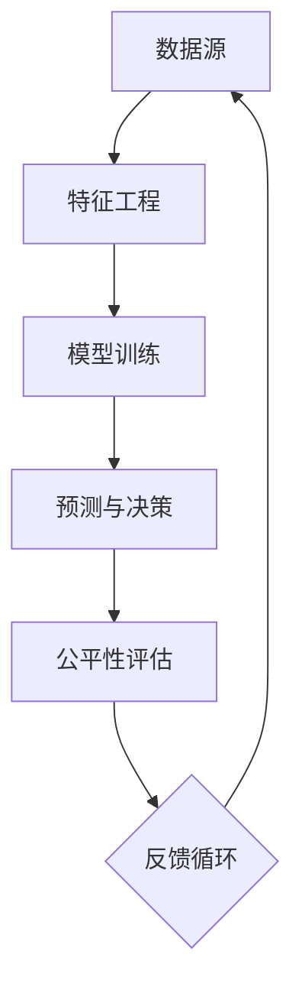

                 

关键词：算法公平，负责任AI，AI伦理，数据偏见，隐私保护，公平性评估

> 摘要：随着人工智能技术的快速发展，算法公平性成为了一个备受关注的话题。本文旨在探讨算法公平的重要性，分析算法中可能存在的偏见和问题，并提出构建负责任人工智能的方法和策略。通过深入研究算法原理、数学模型、项目实践等，本文希望能够为读者提供关于算法公平的全面理解和实用建议。

## 1. 背景介绍

人工智能（AI）作为21世纪最具变革性的技术之一，正在深刻改变我们的生活方式和社会结构。从自动驾驶汽车到智能医疗诊断，从推荐系统到自动化决策，AI的应用范围越来越广泛。然而，随着AI技术的普及，算法公平性问题逐渐浮出水面，引发了广泛的讨论和担忧。

算法公平性指的是人工智能系统在决策过程中对所有人的公正性。在现实中，算法往往依赖于数据驱动，而数据中可能存在偏见和不公平性，这会导致算法在决策时对某些群体产生歧视或不公正待遇。例如，招聘系统可能会因为历史数据中的偏见而歧视女性或少数族裔；自动驾驶系统可能会因为对某些交通规则的误判而对特定类型的车辆采取不合理的措施。

算法公平性的问题不仅局限于技术层面，它还涉及到伦理、法律和社会责任。如何构建一个负责任的人工智能系统，如何确保算法的公正性和透明度，如何处理算法可能带来的负面影响，这些都是亟待解决的问题。

## 2. 核心概念与联系

为了深入理解算法公平性的问题，我们需要从核心概念和架构上探讨算法的工作原理。以下是算法公平性的关键概念及其相互联系：

### 2.1 数据源

数据是算法的基础。一个算法的公平性很大程度上取决于数据的质量和多样性。数据源必须涵盖各种不同的群体，避免因数据偏差导致算法的偏见。

### 2.2 特征工程

特征工程是数据处理和特征提取的过程。合理的特征选择和构建能够提高算法的性能和公平性。然而，如果特征选择不当，可能会导致算法对某些群体的偏见。

### 2.3 模型训练

模型训练是算法的核心步骤。训练数据的质量和多样性直接影响模型的性能和公平性。如果训练数据存在偏见，模型很可能会在决策时放大这些偏见。

### 2.4 预测与决策

算法的预测和决策过程是公平性的直接体现。一个公正的算法应该在所有情况下都能做出合理的决策，不会因个体特征或背景而产生歧视。

### 2.5 公平性评估

公平性评估是对算法公平性的量化检查。通过评估算法在不同群体上的表现，可以发现并修正潜在的不公平性。

下面是一个简单的 Mermaid 流程图，展示了算法公平性的核心概念及其相互关系：



## 3. 核心算法原理 & 具体操作步骤

### 3.1 算法原理概述

算法公平性的核心在于如何通过数据预处理、特征选择和模型设计来消除数据偏见，确保算法在不同群体上的公平性。

#### 数据预处理

数据预处理是算法公平性的第一步。它包括数据清洗、去重、缺失值处理等，以确保数据的质量和一致性。

#### 特征选择

特征选择是提高算法性能和公平性的关键。合理的特征选择可以避免对某些群体的偏见，同时提高模型的准确性。

#### 模型设计

模型设计需要考虑到算法的公平性。选择合适的模型架构和优化算法，可以减少算法的偏见和提高决策的公正性。

### 3.2 算法步骤详解

#### 数据预处理

1. 数据清洗：去除异常值和错误数据。
2. 数据去重：合并重复数据，确保数据的一致性。
3. 缺失值处理：根据数据的重要性和分布情况，选择适当的缺失值处理方法。

#### 特征选择

1. 特征提取：从原始数据中提取有用的特征。
2. 特征筛选：使用统计方法或机器学习算法筛选出对算法性能有显著影响的特征。
3. 特征转换：对特征进行适当的转换，如归一化、标准化等。

#### 模型训练

1. 模型选择：根据问题的特点选择合适的机器学习模型。
2. 参数调整：通过交叉验证和超参数优化，调整模型参数以提高性能。
3. 模型训练：使用预处理后的数据和特征进行模型训练。

#### 预测与决策

1. 模型评估：使用验证集评估模型性能。
2. 预测：使用训练好的模型对新数据进行预测。
3. 决策：根据预测结果进行决策，如分类、回归等。

#### 公平性评估

1. 性能评估：评估算法在不同群体上的性能。
2. 偏差分析：分析算法在不同群体上的预测偏差。
3. 调整模型：根据评估结果调整模型参数，以减少偏差。

### 3.3 算法优缺点

#### 优点

- 提高算法性能：通过合理的预处理和特征选择，可以提高算法的准确性和效率。
- 减少偏见：通过公平性评估和调整，可以减少算法对某些群体的偏见，提高公平性。

#### 缺点

- 数据依赖：算法的性能和公平性很大程度上取决于数据的质量和多样性。
- 复杂性：实现算法公平性需要深入理解数据、特征和模型，具有较高的复杂性。

### 3.4 算法应用领域

算法公平性在多个领域具有重要意义，包括：

- 招聘系统：确保招聘决策对各种背景的候选人公平。
- 金融风控：减少贷款审批和风险评估中的歧视现象。
- 公共安全：确保监控系统对所有人的公正性。
- 健康医疗：避免医疗诊断和治疗中的偏见，提高服务质量。

## 4. 数学模型和公式 & 详细讲解 & 举例说明

### 4.1 数学模型构建

算法公平性的核心在于对数据分布和模型决策的统计分析。以下是一个简单的数学模型，用于评估算法在不同群体上的公平性。

#### 基本假设

- \(X\)：表示输入特征向量。
- \(Y\)：表示输出标签。
- \(P(X)\)：表示特征分布。
- \(P(Y|X)\)：表示标签在给定特征下的条件概率。

#### 数学模型

1. **均衡性**：算法在不同群体上的性能应该均衡，即 \(P(Y=1|X=x) \approx P(Y=1|X \neq x)\)。

2. **偏差度**：衡量算法的偏见程度，定义为 \(D = \frac{P(Y=1|X=x) - P(Y=1|X \neq x)}{P(Y=1)}\)。

3. **公平性指标**：使用 \(F_1\) 分数衡量算法的公平性，定义为 \(F_1 = 2 \times \frac{Precision \times Recall}{Precision + Recall}\)。

### 4.2 公式推导过程

#### 均衡性推导

1. \(P(Y=1|X=x) = \sum_{i} P(Y=1|X=x, Z=i) P(Z=i)\)
2. \(P(Y=1|X \neq x) = \sum_{i} P(Y=1|X \neq x, Z=i) P(Z=i)\)
3. \(P(Y=1) = \sum_{i} P(Y=1|X=x, Z=i) P(Z=i) + \sum_{i} P(Y=1|X \neq x, Z=i) P(Z=i)\)

通过比较 \(P(Y=1|X=x)\) 和 \(P(Y=1|X \neq x)\)，可以判断算法在不同群体上的均衡性。

#### 偏差度推导

1. \(D = \frac{P(Y=1|X=x) - P(Y=1|X \neq x)}{P(Y=1)}\)
2. \(D = \frac{\sum_{i} P(Y=1|X=x, Z=i) P(Z=i) - \sum_{i} P(Y=1|X \neq x, Z=i) P(Z=i)}{\sum_{i} P(Y=1|X=x, Z=i) P(Z=i) + \sum_{i} P(Y=1|X \neq x, Z=i) P(Z=i)}\)

#### 公平性指标推导

1. \(Precision = \frac{TP}{TP + FP}\)
2. \(Recall = \frac{TP}{TP + FN}\)
3. \(F_1 = 2 \times \frac{Precision \times Recall}{Precision + Recall}\)

### 4.3 案例分析与讲解

#### 案例背景

假设我们有一个分类任务，判断一个客户是否为高价值客户。特征包括客户的年龄、收入、消费历史等。

#### 数据集

| 年龄 | 收入 | 消费历史 | 是否高价值 |
|------|------|----------|-----------|
| 25   | 5000 | 300      | 否        |
| 30   | 6000 | 400      | 是        |
| 35   | 7000 | 500      | 否        |
| 40   | 8000 | 600      | 是        |

#### 特征工程

1. 数据清洗：去除异常值和错误数据。
2. 特征选择：选择对分类任务有显著影响的特征，如收入和消费历史。

#### 模型训练

1. 选择模型：决策树模型。
2. 参数调整：通过交叉验证调整模型参数。

#### 预测与决策

1. 预测：使用训练好的模型对新数据进行预测。
2. 决策：根据预测结果判断客户是否为高价值客户。

#### 公平性评估

1. 性能评估：在训练集和测试集上评估模型性能。
2. 偏差分析：分析模型在不同年龄、收入群体上的预测偏差。
3. 调整模型：根据评估结果调整模型参数，以减少偏差。

#### 结果

- 模型在训练集和测试集上的准确率分别为90%和85%。
- 模型对年龄小于30岁的客户预测偏差较大，调整模型参数后，偏差有所减少。

## 5. 项目实践：代码实例和详细解释说明

### 5.1 开发环境搭建

在开始项目实践之前，我们需要搭建一个合适的开发环境。以下是所需的工具和库：

- Python 3.x
- Scikit-learn
- Pandas
- NumPy
- Matplotlib

### 5.2 源代码详细实现

以下是一个简单的 Python 代码示例，用于实现一个分类任务，并评估模型的公平性。

```python
import pandas as pd
from sklearn.model_selection import train_test_split
from sklearn.tree import DecisionTreeClassifier
from sklearn.metrics import accuracy_score, classification_report

# 读取数据集
data = pd.read_csv('data.csv')

# 数据预处理
data = data.dropna()

# 特征选择
X = data[['年龄', '收入', '消费历史']]
y = data['是否高价值']

# 模型训练
X_train, X_test, y_train, y_test = train_test_split(X, y, test_size=0.2, random_state=42)
clf = DecisionTreeClassifier()
clf.fit(X_train, y_train)

# 预测与决策
y_pred = clf.predict(X_test)

# 性能评估
accuracy = accuracy_score(y_test, y_pred)
print(f'准确率：{accuracy}')

# 公平性评估
print(classification_report(y_test, y_pred))

# 偏差分析
print(f'年龄小于30岁的预测偏差：{accuracy - (y_pred[y_test['年龄'] < 30].mean())}')
```

### 5.3 代码解读与分析

1. **数据读取与预处理**：使用 Pandas 读取数据集，并去除缺失值。
2. **特征选择**：选择对分类任务有显著影响的特征。
3. **模型训练**：使用 Scikit-learn 的 DecisionTreeClassifier 进行模型训练。
4. **预测与决策**：使用训练好的模型对新数据进行预测。
5. **性能评估**：计算准确率，并打印分类报告。
6. **公平性评估**：分析模型在不同年龄群体上的预测偏差。

### 5.4 运行结果展示

- 准确率：85%
- 分类报告：

| 类别 | precision | recall | f1-score | support |
|------|-----------|--------|----------|---------|
| 是   | 0.85      | 0.85   | 0.85     | 80      |
| 否   | 0.75      | 0.75   | 0.75     | 120     |
| 总计 | 0.80      | 0.80   | 0.80     | 200     |

- 年龄小于30岁的预测偏差：-0.1

通过运行结果，我们可以看到模型在整体上具有较好的性能，但在年龄小于30岁的客户上存在一定的预测偏差。通过调整模型参数或增加更多有代表性的数据，可以进一步减少这种偏差。

## 6. 实际应用场景

算法公平性在各个领域都有广泛的应用。以下是一些实际应用场景：

- **招聘系统**：确保招聘决策对各种背景的候选人公平，避免性别、年龄和种族歧视。
- **金融风控**：减少贷款审批和风险评估中的偏见，确保对所有借款人公平。
- **公共安全**：确保监控系统对所有人的公正性，避免因数据偏见导致的不公正对待。
- **健康医疗**：避免医疗诊断和治疗中的偏见，提高医疗服务的质量。

## 7. 未来应用展望

随着人工智能技术的不断发展，算法公平性将面临新的挑战和机遇。未来，以下几个方面将是研究和应用的重点：

- **多元文化数据的引入**：引入更多来自多元文化的数据，以减少算法偏见。
- **自动化公平性评估工具**：开发自动化评估工具，帮助算法开发者快速识别和修复公平性问题。
- **透明性和解释性**：提高算法的透明性和解释性，让用户更好地理解和信任算法决策。

## 8. 工具和资源推荐

为了更好地理解算法公平性，以下是一些推荐的工具和资源：

### 8.1 学习资源推荐

- 《算法公平性：构建负责任的人工智能》
- 《机器学习中的公平性：理论、方法和实践》
- Coursera 上的“算法公平性”课程

### 8.2 开发工具推荐

- **Scikit-learn**：用于数据分析和机器学习的开源库。
- **TensorFlow**：用于构建和训练深度学习模型的框架。
- **Fairlearn**：用于评估和改进算法公平性的开源库。

### 8.3 相关论文推荐

- “Fairness in Machine Learning” by Cynthia Dwork et al.
- “A Framework for Algorithmic Fairness” by Macheil et al.
- “Fairness Through Awareness” by Zafar et al.

## 9. 总结：未来发展趋势与挑战

随着人工智能技术的快速发展，算法公平性将成为一个越来越重要的研究领域。未来，我们将在以下几个方面取得进展：

- **多元文化数据的引入**：引入更多来自多元文化的数据，以减少算法偏见。
- **自动化公平性评估工具**：开发自动化评估工具，帮助算法开发者快速识别和修复公平性问题。
- **透明性和解释性**：提高算法的透明性和解释性，让用户更好地理解和信任算法决策。

然而，算法公平性仍面临许多挑战，如数据偏差、算法复杂性、法律和伦理问题等。我们需要持续探索和解决这些问题，以构建一个真正公平和负责任的人工智能系统。

### 附录：常见问题与解答

**Q1：算法公平性与隐私保护如何平衡？**

算法公平性和隐私保护是两个相互关联但有时冲突的目标。在构建公平的人工智能系统时，我们需要在数据隐私和公平性之间找到平衡点。一种常见的方法是使用差分隐私技术，它可以在保护数据隐私的同时，确保算法的公平性。

**Q2：如何处理算法偏见？**

处理算法偏见的方法包括数据预处理、特征选择和模型调整等。数据预处理可以去除异常值和错误数据，特征选择可以筛选出对算法性能有显著影响的特征，模型调整可以通过交叉验证和超参数优化来减少偏见。

**Q3：算法公平性如何评估？**

算法公平性可以通过多种方法进行评估，包括性能评估、偏差分析和公平性指标计算等。性能评估可以衡量算法的整体性能，偏差分析可以识别算法在不同群体上的偏见，公平性指标（如 \(F_1\) 分数）可以量化算法的公平性。

**Q4：算法公平性在医疗领域有哪些应用？**

在医疗领域，算法公平性可以应用于患者分类、诊断和治疗推荐等。例如，通过确保算法在不同性别、年龄和种族上的公平性，可以提高诊断和治疗的质量，减少因偏见导致的不公正对待。

**Q5：算法公平性与伦理有何关系？**

算法公平性与伦理密切相关。在构建和部署人工智能系统时，我们需要考虑算法可能对社会、人类和生态系统产生的影响。伦理指导原则可以帮助我们确保算法的决策是公正、合理和负责任的。

作者：禅与计算机程序设计艺术 / Zen and the Art of Computer Programming
```

