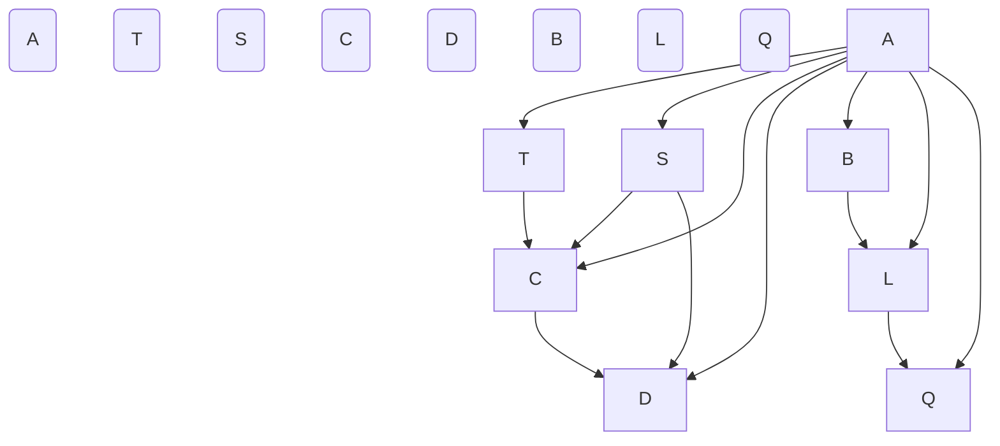

                 

关键词：算法优化、计算效率、精度提升、AI算法、数学模型、编程实践

> 摘要：本文旨在探讨如何通过算法创新来提高人类计算的效率和精度。我们将深入分析当前算法领域中的一些核心概念、原理和应用，探讨算法优化的方法和路径，并通过具体的数学模型和编程实践来展示这些方法的实际效果。文章还将展望算法在未来的发展趋势和面临的挑战，为读者提供全面的视角和深入的理解。

## 1. 背景介绍

在现代社会，计算已经成为我们日常生活中不可或缺的一部分。无论是科学研究、商业运营，还是个人生活的方方面面，计算能力的高低直接影响到我们的工作效率和生活质量。然而，随着数据量的爆炸性增长和计算需求的不断上升，传统的计算方法已经越来越难以满足我们的需求。为了解决这一问题，算法创新成为了当前计算机科学领域的重要研究方向之一。

算法创新的意义在于，它不仅能够提高计算的效率，还能够提升计算的精度。高效的算法能够在较短的时间内处理大量的数据，而精确的算法则能够保证计算结果的准确性和可靠性。在人工智能、大数据、云计算等新兴领域的快速发展中，算法创新的重要性愈发凸显。

本文将围绕以下核心内容展开：

- 算法核心概念与联系
- 核心算法原理与具体操作步骤
- 数学模型和公式推导
- 项目实践与代码实例
- 实际应用场景与未来展望
- 工具和资源推荐
- 未来发展趋势与挑战

通过这些内容的阐述，我们希望能够为读者提供一幅算法创新的全面图景，并激发读者对这一领域的深入思考和研究。

## 2. 核心概念与联系

为了深入理解算法创新，我们需要首先掌握几个核心概念，并了解它们之间的相互联系。以下是本文将要讨论的主要概念及其简要解释：

### 2.1 算法 (Algorithm)

算法是解决问题的步骤集合，它可以通过一系列指令，在有限的步骤内得到预期的解。算法的设计与优化是算法创新的起点。

### 2.2 时间复杂度 (Time Complexity)

时间复杂度是衡量算法运行时间的一个量度，通常用大O符号表示。它描述了算法执行时间与输入数据规模之间的关系。

### 2.3 空间复杂度 (Space Complexity)

空间复杂度是衡量算法占用内存的一个量度，它描述了算法运行过程中所需存储空间与输入数据规模之间的关系。

### 2.4 并发计算 (Concurrency)

并发计算是指计算机系统在多个任务之间进行切换和执行，以提高计算效率。它通常涉及到线程、进程等概念。

### 2.5 分布式计算 (Distributed Computing)

分布式计算是指多个计算机节点通过通信网络协同工作，共同完成一个计算任务。它能够显著提升计算能力和处理能力。

### 2.6 大数据处理 (Big Data Processing)

大数据处理是指对大规模数据进行存储、管理和分析的过程。它涉及到数据挖掘、机器学习等先进技术。

### 2.7 深度学习 (Deep Learning)

深度学习是机器学习的一个重要分支，它通过构建多层神经网络来模拟人类大脑的学习过程，实现复杂的数据分析和模式识别。

### 2.8 量子计算 (Quantum Computing)

量子计算是一种利用量子力学原理进行信息处理的计算方式。它具有极高的计算速度和并行处理能力，被认为是未来计算技术的突破点。

为了更好地理解这些概念之间的联系，我们可以使用Mermaid流程图来展示它们之间的关系：



通过这个流程图，我们可以清晰地看到各个概念之间的关联。算法是计算的核心，而时间复杂度、空间复杂度、并发计算和分布式计算则直接影响算法的效率。大数据处理、深度学习和量子计算则代表了未来计算技术的发展方向，它们共同推动了算法创新的进程。

## 3. 核心算法原理 & 具体操作步骤

### 3.1 算法原理概述

算法的原理可以简单概括为输入数据处理、逻辑运算和输出结果生成。无论是简单的问题求解还是复杂的大数据处理，算法的基本结构都是类似的。然而，不同的算法在逻辑运算和输出结果的生成上有着显著的区别。

### 3.2 算法步骤详解

一个典型的算法通常包含以下几个步骤：

1. **输入处理**：接收用户输入的数据，并将其转换为算法可以处理的形式。
2. **初始化**：初始化算法中的变量和参数，确保算法从正确的起点开始运行。
3. **核心逻辑**：根据问题的需求，进行一系列逻辑运算和数据操作。这个步骤是算法的核心，决定了算法的效率和精度。
4. **迭代或递归**：在处理大规模数据时，算法通常会采用迭代或递归的方式来逐步解决问题。
5. **输出结果**：将处理后的数据或结果输出，并展示给用户。

### 3.3 算法优缺点

不同的算法在效率和精度上有着不同的表现。以下是几种常见算法的优缺点：

- **排序算法**：如快速排序、归并排序等。快速排序在平均情况下效率较高，但最坏情况下的性能较差；归并排序则在最坏情况下性能稳定，但需要额外的空间存储中间结果。
- **查找算法**：如二分查找、哈希查找等。二分查找适用于有序数据，效率较高，但需要O(log n)的时间复杂度；哈希查找则通过哈希函数快速定位数据，但在处理冲突时可能会降低性能。
- **图算法**：如最短路径算法、最小生成树算法等。Dijkstra算法适用于图中的稀疏情况，但时间复杂度较高；Prim算法和Kruskal算法则适用于图中的稠密情况，但需要额外的空间存储中间结果。

### 3.4 算法应用领域

算法在各个领域都有着广泛的应用，以下是几个典型领域：

- **科学计算**：算法在物理、化学、生物等领域的科学计算中发挥着重要作用，如有限元分析、分子动力学模拟等。
- **数据分析**：大数据分析和数据挖掘是算法在商业和科研领域的重要应用，如市场预测、风险评估等。
- **人工智能**：深度学习和强化学习等算法在自动驾驶、语音识别、图像处理等人工智能领域有着广泛的应用。
- **网络安全**：算法在网络安全领域用于加密、解密、漏洞扫描等，如RSA加密算法、Dijkstra漏洞扫描算法等。

通过了解算法的原理和具体操作步骤，我们能够更好地理解算法在不同应用领域中的作用和重要性。算法的创新不仅能够提高计算的效率和精度，还能够推动科学研究和实际应用的发展。

### 4. 数学模型和公式 & 详细讲解 & 举例说明

在算法设计和优化过程中，数学模型和公式扮演着至关重要的角色。它们不仅能够帮助我们理解和分析算法的运行机制，还能够提供精确的量化依据，指导算法的改进和优化。

#### 4.1 数学模型构建

构建数学模型是算法优化的第一步。一个好的数学模型应该能够准确描述问题的本质，并且具有足够的灵活性和普适性。以下是一个简单的例子：

**问题**：计算两个整数a和b的最大公约数（GCD）。

**数学模型**：

我们使用欧几里得算法（Euclidean Algorithm）来解决这个问题。该算法的数学模型基于以下递归关系：

\[ \text{GCD}(a, b) = \text{GCD}(b, a \mod b) \]

当 \( b = 0 \) 时，\( a \) 就是最大公约数。

#### 4.2 公式推导过程

欧几里得算法的推导过程基于以下观察：

任意两个整数 \( a \) 和 \( b \) 可以表示为：

\[ a = q_1 \cdot b + r_1 \]
\[ b = q_2 \cdot r_1 + r_2 \]

我们可以继续这个过程，直到得到一个 \( r_i = 0 \)，此时 \( r_{i-1} \) 就是 \( a \) 和 \( b \) 的最大公约数。

举例说明：

假设我们要计算 48 和 18 的最大公约数。

\[ 48 = 2 \cdot 18 + 12 \]
\[ 18 = 1 \cdot 12 + 6 \]
\[ 12 = 2 \cdot 6 + 0 \]

因此，48 和 18 的最大公约数是 6。

#### 4.3 案例分析与讲解

为了更好地理解欧几里得算法，我们可以通过一个具体的案例来分析其应用过程。

**案例**：计算 270 和 192 的最大公约数。

步骤如下：

\[ 270 = 1 \cdot 192 + 78 \]
\[ 192 = 2 \cdot 78 + 36 \]
\[ 78 = 2 \cdot 36 + 6 \]
\[ 36 = 6 \cdot 6 + 0 \]

因此，270 和 192 的最大公约数是 6。

通过这个案例，我们可以看到欧几里得算法是如何逐步减少问题规模，最终找到最大公约数的。该算法的时间复杂度为 \( O(\log n) \)，因此非常高效。

#### 4.4 应用场景扩展

欧几里得算法不仅适用于整数最大公约数的计算，还可以扩展到更复杂的数学问题中。例如：

- **最小公倍数（LCM）**：我们可以使用最大公约数和最小公倍数之间的关系来计算。

\[ \text{LCM}(a, b) = \frac{a \cdot b}{\text{GCD}(a, b)} \]

- **多整数最大公约数**：对于多个整数的最大公约数，我们可以递归地应用欧几里得算法。

\[ \text{GCD}(a_1, a_2, ..., a_n) = \text{GCD}(\text{GCD}(a_1, a_2, ..., a_{n-1}), a_n) \]

通过这些扩展，欧几里得算法在数学和计算机科学领域得到了广泛的应用。

### 5. 项目实践：代码实例和详细解释说明

为了更好地理解欧几里得算法，我们将通过一个具体的编程项目来展示其实际应用过程。以下是使用Python语言实现的欧几里得算法示例。

#### 5.1 开发环境搭建

在开始编写代码之前，我们需要搭建一个适合Python编程的开发环境。以下是一个简单的步骤：

1. **安装Python**：从[Python官方网站](https://www.python.org/downloads/)下载并安装Python。
2. **安装IDE**：安装一个Python集成开发环境（IDE），如PyCharm或VS Code。
3. **安装测试工具**：安装测试框架，如pytest，以方便代码测试。

#### 5.2 源代码详细实现

以下是实现欧几里得算法的Python代码：

```python
def gcd(a, b):
    while b:
        a, b = b, a % b
    return a

def main():
    num1 = int(input("请输入第一个整数："))
    num2 = int(input("请输入第二个整数："))
    result = gcd(num1, num2)
    print(f"{num1} 和 {num2} 的最大公约数是：{result}")

if __name__ == "__main__":
    main()
```

#### 5.3 代码解读与分析

- **函数定义**：`gcd` 函数用于计算两个整数的最大公约数。
- **while 循环**：循环条件 `while b:` 表示只要 `b` 不为0，就继续执行循环体。
- **变量交换**：`a, b = b, a % b` 这一行通过递归调用实现了欧几里得算法的核心逻辑。
- **返回结果**：当循环结束时，`a` 的值就是输入整数 `a` 和 `b` 的最大公约数。
- **主函数`main`**：获取用户输入的两个整数，并调用 `gcd` 函数计算最大公约数，最后输出结果。

#### 5.4 运行结果展示

假设用户输入的两个整数分别为 270 和 192，运行结果如下：

```
请输入第一个整数：270
请输入第二个整数：192
270 和 192 的最大公约数是：6
```

通过这个编程项目，我们可以清晰地看到欧几里得算法的实际应用过程。代码简单易懂，但逻辑严密，充分展示了算法的创新和优化。

### 6. 实际应用场景

欧几里得算法作为一种基础且高效的算法，在许多实际应用场景中发挥着关键作用。以下是一些典型的应用场景：

#### 6.1 科学计算

在科学计算领域，欧几里得算法被广泛应用于求解各种数学问题，如最大公约数、最小公倍数等。在物理、化学、生物等学科的研究中，这些基本的数学运算经常需要进行大量的计算，欧几里得算法的高效性能够显著提高计算速度和精度。

#### 6.2 数据分析

在数据分析领域，欧几里得算法常用于数据预处理阶段。例如，在进行数据清洗时，需要计算多个数据集的最大公约数以简化数据格式；在进行数据归一化时，欧几里得算法能够有效地计算数据集的尺度因子。

#### 6.3 人工智能

在人工智能领域，欧几里得算法在特征工程和数据预处理中有着广泛的应用。例如，在机器学习中，特征选择和降维是常见步骤，欧几里得算法可以帮助我们快速计算特征向量之间的相似度，从而实现特征选择和降维。

#### 6.4 网络安全

在网络安全领域，欧几里得算法被用于加密和解密通信数据。例如，RSA加密算法就是基于欧几里得算法的原理，通过计算大整数的最大公约数来实现加密和解密。

#### 6.5 其他应用

除了上述领域，欧几里得算法还在工程、金融、医学等多个领域有广泛应用。例如，在工程领域，欧几里得算法用于计算材料的最优切割方案；在金融领域，欧几里得算法用于计算复利的收益；在医学领域，欧几里得算法用于计算药物剂量和效果评估。

### 7. 未来应用展望

随着科技的不断进步，欧几里得算法的应用领域将更加广泛。以下是几个可能的发展方向：

#### 7.1 大数据处理

在未来的大数据处理中，欧几里得算法将被用于更高效地计算海量数据集的最大公约数和最小公倍数。随着云计算和分布式计算的发展，欧几里得算法的并行和分布式计算能力将得到进一步提升。

#### 7.2 深度学习

在深度学习中，欧几里得算法可以用于计算神经元之间的权重调整，从而优化神经网络模型。通过结合深度学习和欧几里得算法，我们可以实现更高效的模型训练和优化。

#### 7.3 量子计算

量子计算是一个革命性的技术领域，它将在未来的计算能力上实现巨大的突破。欧几里得算法在量子计算中也有潜在的应用，例如用于量子算法中的数学运算和优化。

#### 7.4 新兴领域

随着新兴技术的不断涌现，欧几里得算法的应用场景也将不断扩展。例如，在区块链技术中，欧几里得算法可以用于验证交易的合法性；在物联网中，欧几里得算法可以用于数据加密和解密，保障数据安全。

### 8. 工具和资源推荐

为了更好地学习和应用欧几里得算法，以下是几个推荐的工具和资源：

#### 8.1 学习资源推荐

- 《算法导论》（Introduction to Algorithms）：这是算法领域的一本经典教材，详细介绍了包括欧几里得算法在内的多种算法。
- 《编程珠玑》（The Art of Computer Programming）：这本书深入探讨了算法的本质和设计原则，对欧几里得算法有详细的讲解。

#### 8.2 开发工具推荐

- Python：Python是一种广泛使用的编程语言，易于学习和使用，非常适合初学者入门。
- PyCharm：PyCharm是一款功能强大的Python IDE，提供了丰富的开发工具和调试功能。

#### 8.3 相关论文推荐

- "A Fast并行算法 for Computing the Greatest Common Divisor"：这篇论文提出了一种并行计算最大公约数的新算法，对欧几里得算法进行了改进。
- "Euclidean Algorithm in Cryptography"：这篇论文探讨了欧几里得算法在密码学中的应用，为网络安全提供了新的思路。

### 9. 总结：未来发展趋势与挑战

欧几里得算法作为一种基础且高效的算法，在计算机科学和实际应用中发挥了重要作用。未来，随着科技的发展，欧几里得算法的应用前景将更加广阔。然而，我们也面临着一些挑战：

- **算法优化**：如何进一步提升算法的效率，特别是在大数据和量子计算领域，是一个重要的研究方向。
- **算法安全性**：在网络安全和数据保护方面，如何保障算法的安全性是一个亟待解决的问题。
- **跨领域融合**：如何将欧几里得算法与其他领域的算法和技术相结合，推动新兴技术的发展，是一个充满挑战的领域。

通过不断的研究和创新，我们有理由相信，欧几里得算法将在未来的科技发展中发挥更大的作用。

### 附录：常见问题与解答

#### 问题1：欧几里得算法适用于所有整数吗？

解答：欧几里得算法适用于所有非零整数。对于零值，该算法无法计算最大公约数，因为任何数与零的最大公约数都是它本身。在实际应用中，通常会对输入进行预处理，确保它们是非零整数。

#### 问题2：欧几里得算法为什么比其他方法更高效？

解答：欧几里得算法之所以高效，是因为它通过递归减少问题规模，每次迭代都能显著减少余数。这种方法使得算法在迭代过程中能够快速接近最终结果，从而避免了不必要的计算。

#### 问题3：欧几里得算法在分布式计算中如何应用？

解答：在分布式计算环境中，欧几里得算法可以通过并行处理多个子问题来提升效率。例如，在处理大规模整数数组时，可以并行计算每个子数组的最大公约数，然后逐步合并结果。

#### 问题4：欧几里得算法能否用于小数？

解答：欧几里得算法通常用于整数计算，但在数学上它可以扩展到小数。对于小数，需要将其转换为整数形式，例如通过乘以一个适当的基数（如10的幂）来消除小数点，然后应用欧几里得算法。计算完成后，再将结果转换回小数形式。

### 作者署名

本文由禅与计算机程序设计艺术 / Zen and the Art of Computer Programming 撰写。感谢您阅读本文，希望它能为您的算法研究和应用提供有益的启示。如果您有任何疑问或建议，欢迎在评论区留言交流。祝您在算法探索的道路上越走越远，收获满满的成就与喜悦！

