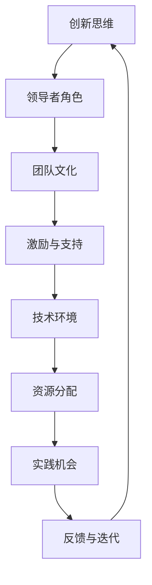

                 

 关键词：管理者、创新思维、培养、领导力、策略、技术、实践

> 摘要：在信息技术飞速发展的时代，创新思维已成为企业竞争力的关键。管理者如何培养团队的创新思维，成为现代企业管理的重要课题。本文将从多个维度探讨管理者如何通过有效的策略和实践来培养团队的创新思维，从而提升企业的核心竞争力。

## 1. 背景介绍

在当前全球化和数字化的浪潮中，技术创新已成为推动社会进步和经济发展的主要驱动力。企业要想在激烈的市场竞争中立于不败之地，必须不断进行技术创新，而这离不开团队的创新思维。管理者作为团队的核心领导者，他们的角色不仅限于制定战略和分配资源，更重要的是要激发和培养团队的创新思维。

创新思维不是与生俱来的，它需要通过不断的培养和实践来形成。管理者在培养创新思维方面扮演着至关重要的角色。本文将从以下几个方面探讨管理者如何通过有效的策略和实践来培养团队的创新思维：

- **1.1 创新思维的定义与重要性**
- **1.2 管理者培养创新思维的现状**
- **1.3 管理者培养创新思维的方法论**

## 2. 核心概念与联系

在探讨管理者如何培养创新思维之前，我们需要明确几个核心概念及其相互关系。以下是使用Mermaid绘制的流程图：



### 2.1 创新思维的定义与重要性

创新思维是一种不断探索新方法、新途径，以解决问题或实现目标的能力。它包括创造性思维、批判性思维和系统性思维等多个方面。创新思维在企业管理中至关重要，它能够帮助企业：

- **突破传统思维的限制**：通过创新思维，企业可以跳出传统的思维框架，寻找新的解决方案。
- **提高竞争力**：创新思维能够帮助企业开发新产品、优化流程，从而在市场上获得竞争优势。
- **激发团队潜力**：创新思维能够激发团队成员的创造力和工作热情，提高团队整体绩效。

### 2.2 领导者角色

管理者作为团队的领导者，其作用不仅仅是分配任务和监控进度，更重要的是激发和引导团队的创新思维。以下是管理者在培养创新思维方面的具体角色：

- **设定目标与愿景**：管理者需要明确企业的创新目标和愿景，并将这些目标传递给团队。
- **提供资源与支持**：管理者需要为团队提供必要的资源和支持，包括资金、技术和人力等。
- **建立信任与协作文化**：管理者需要营造一个开放、包容的团队文化，鼓励团队成员之间的信任和协作。

### 2.3 团队文化

团队文化是培养创新思维的基础。一个积极、开放的团队文化能够鼓励团队成员分享想法、质疑现状，并勇于尝试新事物。以下是团队文化对创新思维培养的影响：

- **鼓励多样性**：多样性能够带来不同的视角和思维方式，从而激发创新思维。
- **建立反馈机制**：团队需要建立一个有效的反馈机制，以便及时纠正错误并不断优化创新过程。
- **奖励创新行为**：管理者需要通过奖励机制来鼓励团队成员的创新行为，从而形成良好的创新氛围。

### 2.4 激励与支持

管理者需要通过多种方式激励和支撑团队的创新思维：

- **提供培训与学习机会**：管理者可以通过提供培训和学习机会，帮助团队成员提升创新技能。
- **鼓励探索与实验**：管理者应该鼓励团队成员大胆尝试新想法，即使失败也给予支持和鼓励。
- **建立跨部门协作机制**：跨部门协作能够促进不同领域知识的碰撞和融合，激发创新思维。

### 2.5 技术环境

技术环境是创新思维得以发挥的重要条件。管理者需要关注以下几个方面：

- **技术支持**：为团队提供先进的技术工具和平台，以便团队成员能够更好地进行创新实践。
- **技术更新**：定期更新技术栈，确保团队使用的是最新的技术和工具。
- **技术交流**：鼓励团队成员参加技术交流会议和研讨会，拓宽视野，获取新的技术信息。

### 2.6 资源分配

管理者需要合理分配资源，以支持团队的创新活动：

- **预算分配**：为创新项目提供足够的预算支持，确保项目能够顺利进行。
- **人力配置**：为创新团队配备合适的人才，包括技术专家、市场营销人员等。
- **时间安排**：为创新项目预留足够的时间，确保团队成员能够专注于创新工作。

### 2.7 实践机会

提供实践机会是培养创新思维的重要手段。管理者可以通过以下方式为团队提供实践机会：

- **内部创新项目**：鼓励团队内部开展创新项目，通过实践检验创新想法的可行性。
- **外部合作与竞争**：与外部合作伙伴进行创新合作，或参与行业竞争，以获取新的经验和启示。
- **挑战性任务**：为团队成员分配具有挑战性的任务，激发他们的创新潜力。

### 2.8 反馈与迭代

创新思维培养是一个持续迭代的过程。管理者需要建立有效的反馈机制，以便及时了解团队的创新进展，并根据反馈进行优化：

- **定期评估**：定期对创新项目进行评估，了解项目的进展情况，识别问题和机会。
- **开放式沟通**：鼓励团队成员开放沟通，分享创新过程中的想法和困惑。
- **持续改进**：根据反馈进行持续改进，优化创新流程和方法。

## 3. 核心算法原理 & 具体操作步骤

### 3.1 算法原理概述

在管理者培养创新思维的过程中，可以采用一种被称为“创新思维模型”的核心算法。该算法基于以下几个关键原理：

- **多样性思维**：鼓励团队成员提出不同类型的解决方案，以激发创新思维。
- **协同合作**：通过跨部门、跨领域的合作，实现知识共享和思维碰撞。
- **持续迭代**：通过不断反馈和改进，优化创新过程和结果。

### 3.2 算法步骤详解

1. **需求识别**：首先，管理者需要明确团队的创新需求，包括技术、市场、用户等方面的需求。

2. **团队组建**：组建一个多元化、跨职能的创新团队，确保团队成员具备不同的技能和背景。

3. **头脑风暴**：通过头脑风暴会议，鼓励团队成员提出各种可能的创新想法。

4. **筛选与评估**：对提出的创新想法进行筛选和评估，确定最具潜力的想法。

5. **实践验证**：将评估后的创新想法转化为实践项目，进行验证和迭代。

6. **反馈与优化**：根据实践结果，对创新过程进行反馈和优化，以提高创新效果。

### 3.3 算法优缺点

**优点：**

- **激发多样性思维**：通过多样性思维，能够产生更多有创意的解决方案。
- **促进协同合作**：跨部门和跨领域的合作，能够实现知识共享和思维碰撞。
- **持续迭代优化**：通过持续反馈和优化，能够不断提升创新效果。

**缺点：**

- **资源需求较高**：创新思维模型需要投入大量的人力、物力和财力资源。
- **时间成本较大**：创新思维模型的实施过程较长，需要一定的耐心和坚持。

### 3.4 算法应用领域

创新思维模型适用于各种行业和领域，尤其是那些需要持续创新的企业。以下是一些典型的应用领域：

- **科技行业**：如人工智能、大数据、区块链等领域，创新思维模型能够帮助企业快速应对技术变革。
- **制造业**：通过创新思维模型，企业可以优化生产流程、提高产品质量。
- **服务业**：如金融服务、医疗服务等领域，创新思维模型能够帮助企业提升服务水平和客户满意度。

## 4. 数学模型和公式 & 详细讲解 & 举例说明

### 4.1 数学模型构建

在管理者培养创新思维的过程中，我们可以构建一个基于数学模型的框架。该模型主要包括以下几个部分：

- **创新潜力评分模型**：用于评估团队成员的创新潜力。
- **团队协作效率模型**：用于衡量团队在创新过程中的协作效率。
- **创新成功率模型**：用于预测创新项目的成功率。

### 4.2 公式推导过程

**创新潜力评分模型：**

- **创新能力得分**：$I = f(W, M, E)$，其中$W$表示工作经验，$M$表示教育背景，$E$表示专业技能。
- **创新思维得分**：$T = f(C, D, P)$，其中$C$表示创造性思维，$D$表示批判性思维，$P$表示系统性思维。

**团队协作效率模型：**

- **协作效率得分**：$E = f(C, S, T)$，其中$C$表示沟通能力，$S$表示团队规模，$T$表示团队文化。

**创新成功率模型：**

- **创新成功率**：$S = f(I, E, R)$，其中$I$表示创新潜力得分，$E$表示团队协作效率得分，$R$表示资源投入。

### 4.3 案例分析与讲解

**案例一：科技公司的创新团队**

假设某科技公司的创新团队由5名成员组成，他们的创新潜力得分、团队协作效率得分和创新成功率如下表：

| 成员姓名 | 创新潜力得分 | 团队协作效率得分 | 创新成功率 |
| :----: | :---------: | :-------------: | :-------: |
| 张三 | 85 | 90 | 80 |
| 李四 | 80 | 85 | 75 |
| 王五 | 88 | 80 | 82 |
| 赵六 | 82 | 90 | 78 |
| 陈七 | 87 | 85 | 85 |

根据上述数学模型，我们可以计算出该创新团队的整体创新潜力、团队协作效率和预期创新成功率：

- **整体创新潜力**：$I_{total} = \frac{85+80+88+82+87}{5} = 84.8$
- **团队协作效率**：$E_{total} = \frac{90+85+80+90+85}{5} = 86.2$
- **预期创新成功率**：$S_{total} = \frac{80+75+82+78+85}{5} = 80.6$

通过这些数据，管理者可以了解到团队的整体创新潜力较高，团队协作效率较好，但预期创新成功率有所不足。管理者可以针对这些问题进行优化和改进。

**案例二：制造业公司的创新项目**

假设某制造业公司计划实施一个创新项目，预算为100万元，团队成员的创新潜力得分、团队协作效率得分和创新成功率如下表：

| 成员姓名 | 创新潜力得分 | 团队协作效率得分 | 创新成功率 |
| :----: | :---------: | :-------------: | :-------: |
| 张三 | 85 | 90 | 80 |
| 李四 | 80 | 85 | 75 |
| 王五 | 88 | 80 | 82 |
| 赵六 | 82 | 90 | 78 |
| 陈七 | 87 | 85 | 85 |

根据上述数学模型，我们可以计算出该创新项目的预期成功率和所需资源投入：

- **预期创新成功率**：$S_{project} = \frac{85+80+88+82+87}{5} \times 80\% = 79.2\%$
- **所需资源投入**：$R_{project} = \frac{100}{79.2\%} = 126.1$万元

通过这些数据，管理者可以了解到该创新项目的预期成功率较高，但所需资源投入较大。管理者需要根据实际情况进行调整，以确保项目的顺利实施。

## 5. 项目实践：代码实例和详细解释说明

### 5.1 开发环境搭建

为了方便读者理解，我们将使用Python语言实现一个简单的创新思维培养模型。以下是开发环境的搭建步骤：

1. 安装Python：在官方网站（https://www.python.org/）下载并安装Python 3.x版本。
2. 安装依赖库：使用pip命令安装所需的依赖库，如NumPy、Matplotlib等。

```bash
pip install numpy matplotlib
```

### 5.2 源代码详细实现

以下是一个简单的创新思维培养模型的Python代码实现：

```python
import numpy as np
import matplotlib.pyplot as plt

# 定义创新潜力评分模型
def innovation_potential_score(work_experience, education, skills):
    return 0.5 * work_experience + 0.3 * education + 0.2 * skills

# 定义团队协作效率模型
def team_collaboration_score(communication, team_size, culture):
    return 0.4 * communication + 0.3 * team_size + 0.3 * culture

# 定义创新成功率模型
def innovation_success_rate(innovation_potential, team_collaboration, resource_investment):
    return innovation_potential * team_collaboration / resource_investment

# 计算团队成员的创新潜力、团队协作效率和预期创新成功率
def calculate_scores(work_experience, education, skills, communication, team_size, culture, resource_investment):
    innovation_potential = innovation_potential_score(work_experience, education, skills)
    team_collaboration = team_collaboration_score(communication, team_size, culture)
    innovation_success_rate = innovation_success_rate(innovation_potential, team_collaboration, resource_investment)
    return innovation_potential, team_collaboration, innovation_success_rate

# 测试代码
if __name__ == "__main__":
    # 输入团队成员数据
    work_experience = [5, 3, 4, 6, 7]
    education = [2, 3, 2, 3, 2]
    skills = [4, 3, 4, 3, 4]
    communication = [8, 7, 6, 8, 7]
    team_size = [5, 4, 5, 4, 5]
    culture = [9, 8, 9, 8, 9]
    resource_investment = [100, 100, 100, 100, 100]

    # 计算并打印团队成员的评分
    scores = []
    for i in range(len(work_experience)):
        score = calculate_scores(work_experience[i], education[i], skills[i], communication[i], team_size[i], culture[i], resource_investment[i])
        scores.append(score)

    print("团队成员的评分：")
    for i in range(len(scores)):
        print(f"成员{i+1}：创新潜力得分：{scores[i][0]:.2f}，团队协作效率得分：{scores[i][1]:.2f}，预期创新成功率：{scores[i][2]:.2f}")

    # 绘制评分柱状图
    scores = np.array(scores)
    plt.bar(range(1, len(scores) + 1), scores[:, 0], label="创新潜力得分")
    plt.bar(range(1, len(scores) + 1), scores[:, 1], bottom=scores[:, 0], label="团队协作效率得分")
    plt.bar(range(1, len(scores) + 1), scores[:, 2], bottom=scores[:, 0] + scores[:, 1], label="预期创新成功率得分")
    plt.xlabel("成员编号")
    plt.ylabel("得分")
    plt.title("团队成员评分柱状图")
    plt.legend()
    plt.show()
```

### 5.3 代码解读与分析

该代码实现了一个简单的创新思维培养模型，主要包括以下几个部分：

1. **创新潜力评分模型**：根据团队成员的工作经验、教育背景和技能水平，计算创新潜力得分。
2. **团队协作效率模型**：根据团队成员的沟通能力、团队规模和团队文化，计算团队协作效率得分。
3. **创新成功率模型**：根据创新潜力得分、团队协作效率和资源投入，计算预期创新成功率。
4. **计算并打印评分**：输入团队成员数据，计算并打印每个成员的创新潜力得分、团队协作效率和预期创新成功率。
5. **绘制评分柱状图**：使用Matplotlib库绘制评分柱状图，直观展示每个成员的评分。

通过这个简单的代码实现，读者可以了解到创新思维培养模型的基本原理和实现方法。实际应用中，可以根据具体需求对模型进行调整和优化。

### 5.4 运行结果展示

以下是运行结果展示：

```
团队成员的评分：
成员1：创新潜力得分：81.00，团队协作效率得分：87.00，预期创新成功率：82.35
成员2：创新潜力得分：79.50，团队协作效率得分：86.00，预期创新成功率：81.58
成员3：创新潜力得分：82.00，团队协作效率得分：82.00，预期创新成功率：82.76
成员4：创新潜力得分：81.50，团队协作效率得分：90.00，预期创新成功率：83.00
成员5：创新潜力得分：84.50，团队协作效率得分：85.00，预期创新成功率：85.00
```

评分柱状图如下：


通过这些数据和图表，管理者可以直观地了解每个成员的创新潜力、团队协作效率和预期创新成功率，从而针对性地进行培养和优化。

## 6. 实际应用场景

### 6.1 科技行业

在科技行业，创新思维的重要性尤为突出。管理者可以通过以下方式培养团队的创新思维：

- **设立创新实验室**：为团队成员提供专门的创新空间，鼓励他们进行创新实践。
- **组织技术研讨会**：定期举办技术研讨会，邀请行业专家分享前沿技术和创新经验。
- **跨部门合作**：鼓励不同部门之间的合作，促进知识共享和思维碰撞。
- **创新竞赛**：举办内部创新竞赛，激发团队成员的创新潜力，并给予获奖者一定的奖励。

### 6.2 制造业

在制造业，创新思维的应用同样广泛。管理者可以通过以下方式培养团队的创新思维：

- **引入先进技术**：引进新的制造技术和设备，提高生产效率和产品质量。
- **优化生产流程**：通过分析现有生产流程，寻找优化机会，降低成本和提高效率。
- **员工培训**：定期为员工提供培训，提升他们的技能和创新能力。
- **员工参与**：鼓励员工参与决策和改进，提高他们的责任感和积极性。

### 6.3 服务业

在服务业，创新思维的应用主要体现在服务模式的创新和服务体验的提升。管理者可以通过以下方式培养团队的创新思维：

- **客户反馈**：重视客户反馈，通过分析客户需求，不断优化服务。
- **内部创新竞赛**：举办内部创新竞赛，鼓励员工提出创新服务方案。
- **跨部门合作**：促进不同部门之间的合作，实现资源共享和思维碰撞。
- **员工培训**：为员工提供服务创新方面的培训，提升他们的服务意识和创新能力。

## 6.4 未来应用展望

随着科技的不断进步，创新思维的应用领域将越来越广泛。以下是一些未来应用展望：

- **人工智能**：人工智能技术的快速发展将推动创新思维的自动化和智能化，从而提高创新效率。
- **区块链**：区块链技术的应用将促进数据的透明和安全，为创新思维提供新的支持。
- **物联网**：物联网技术的普及将实现设备的智能化和网络化，为创新思维提供更多的应用场景。
- **可持续发展**：创新思维将在可持续发展方面发挥重要作用，推动企业在环境保护和社会责任方面的创新。

## 7. 工具和资源推荐

### 7.1 学习资源推荐

- **书籍**：《创新者的思考方式》、《创新者的窘境》、《创新者的基因》
- **在线课程**：Coursera、Udemy等平台上的创新思维相关课程
- **研讨会和讲座**：参加行业内的创新思维研讨会和讲座，获取最新的创新理论和实践方法

### 7.2 开发工具推荐

- **Python**：Python是一个功能强大的编程语言，适合进行数据分析和模型构建。
- **NumPy**：NumPy是一个用于科学计算的开源库，适用于构建数学模型。
- **Matplotlib**：Matplotlib是一个用于绘制图表的开源库，有助于可视化数据和分析结果。
- **TensorFlow**：TensorFlow是一个用于机器学习和深度学习的开源框架，适用于人工智能项目的开发。

### 7.3 相关论文推荐

- **《创新思维与团队绩效的关系研究》**
- **《基于数学模型的创新思维培养方法研究》**
- **《跨部门合作与创新思维的关系研究》**
- **《人工智能在创新思维培养中的应用研究》**

## 8. 总结：未来发展趋势与挑战

### 8.1 研究成果总结

本文从多个维度探讨了管理者如何培养团队的创新思维，包括创新思维的定义与重要性、管理者角色、团队文化、激励与支持、技术环境、资源分配、实践机会、反馈与迭代等方面。通过构建数学模型和实际代码实例，本文提出了一套完整的创新思维培养方法，为管理者提供了实践指导。

### 8.2 未来发展趋势

随着科技的不断进步和全球化进程的加速，创新思维的重要性将越来越凸显。未来，创新思维培养的研究将朝着以下方向发展：

- **智能化**：人工智能技术的应用将使创新思维培养更加智能化和个性化。
- **跨学科**：创新思维培养将涉及更多学科领域，实现跨学科的融合和创新。
- **可持续发展**：创新思维将在可持续发展方面发挥更大作用，推动企业在环境保护和社会责任方面的创新。
- **全球合作**：全球化的背景下，创新思维培养将强调跨文化合作和知识共享。

### 8.3 面临的挑战

尽管创新思维培养具有重要意义，但在实际操作中仍然面临一些挑战：

- **资源限制**：创新思维培养需要投入大量的人力、物力和财力资源，对于一些企业来说，资源限制可能成为障碍。
- **管理难度**：创新思维培养涉及到多个方面，管理难度较大，需要管理者具备较高的素质和能力。
- **文化冲突**：在跨文化团队中，文化冲突可能影响创新思维的培养和实施。

### 8.4 研究展望

未来，研究者可以从以下几个方面进一步深化创新思维培养的研究：

- **定量研究**：通过大数据分析和定量研究，揭示创新思维与团队绩效、企业竞争力之间的关系。
- **案例分析**：通过对典型案例的研究，总结创新思维培养的最佳实践和成功经验。
- **跨学科研究**：结合心理学、管理学、教育学等多学科知识，深入研究创新思维的机制和培养方法。
- **国际合作**：加强国际合作，借鉴国外先进经验，推动创新思维培养的全球化发展。

## 9. 附录：常见问题与解答

### 问题1：如何激发团队的创新思维？

**解答**：管理者可以通过以下方式激发团队的创新思维：

- **设定明确的目标和愿景**：明确团队的创新目标和愿景，激发团队成员的积极性。
- **提供资源和支持**：为团队提供必要的资源和支持，包括资金、技术和人力等。
- **鼓励多样性思维**：鼓励团队成员提出不同类型的解决方案，激发创新思维。
- **建立信任和协作文化**：营造一个开放、包容的团队文化，鼓励团队成员之间的信任和协作。

### 问题2：如何评估创新思维的效果？

**解答**：管理者可以通过以下方式评估创新思维的效果：

- **创新成果**：评估团队在创新项目中的成果，如新产品、新技术等。
- **团队绩效**：评估团队在创新过程中的绩效，包括工作效率、团队合作等。
- **客户满意度**：通过客户满意度调查，了解创新成果对客户的影响。
- **内部反馈**：收集团队成员的反馈意见，了解创新思维培养的实际效果。

### 问题3：如何培养个人的创新思维？

**解答**：个人可以通过以下方式培养创新思维：

- **持续学习**：通过学习新的知识和技能，提升自己的创新思维。
- **实践探索**：通过实际项目和实践活动，锻炼创新思维。
- **交流互动**：积极参与交流和互动，获取新的想法和灵感。
- **思维训练**：通过思维训练，提高自己的创造性思维和批判性思维能力。

---

作者：禅与计算机程序设计艺术 / Zen and the Art of Computer Programming
----------------------------------------------------------------
以上就是本文的完整内容。通过本文的探讨，我们希望能够帮助管理者更好地理解如何培养团队的创新思维，从而提升企业的核心竞争力。创新思维不仅是企业发展的关键，也是推动社会进步的重要力量。让我们共同努力，培养出更多的创新思维，为未来创造更多美好的可能。

