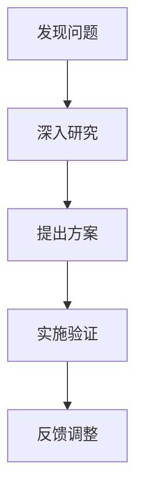

                 

关键词：管理者、创新思维、领导力、团队建设、技术发展

> 摘要：在快速变化的技术时代，创新思维成为企业持续发展的关键。本文将探讨管理者如何通过提升自身领导力、构建创新团队、引入技术驱动文化等手段，有效地培养和激发团队的创新思维。

## 1. 背景介绍

在当今科技飞速发展的时代，创新已经成为企业竞争的核心要素。一个企业若想保持竞争优势，必须不断地进行技术创新和商业模式创新。然而，创新思维并非一蹴而就，它需要系统的培养和激发。作为管理者，如何在日常工作中培养和激发团队成员的创新思维，是每一个领导者都必须面对的重要课题。

### 1.1 创新思维的重要性

创新思维是指在面对问题时，能够跳出传统框架，以全新的视角和思路解决问题。在技术领域，创新思维尤为重要，因为它直接关系到产品的竞争力、市场的扩展以及企业的长远发展。

### 1.2 管理者面临的挑战

管理者在培养创新思维方面面临诸多挑战，包括：

- 团队成员创新意识的不足
- 创新流程的不完善
- 创新资源的匮乏
- 对失败的恐惧和规避

## 2. 核心概念与联系

### 2.1 创新思维的构成

创新思维包括四个核心要素：观察力、想象力、判断力和执行力。这四个要素相互作用，共同推动创新活动的进行。

### 2.2 创新思维的架构

创新思维的架构可以概括为“发现问题 - 深入研究 - 提出方案 - 实施验证”。这个架构强调了从问题出发，通过系统的研究和方案提出，最终实现创新的闭环。



## 3. 核心算法原理 & 具体操作步骤

### 3.1 算法原理概述

培养创新思维可以看作是一个算法优化过程，其目标是通过一系列操作提升团队的创新能力。这个算法的基本原理包括：

- **激励**：通过激励机制提升团队成员的创新积极性。
- **学习**：通过学习和培训，提升团队成员的专业技能和思维水平。
- **协作**：通过团队协作，激发个体的创新潜力。
- **实践**：通过实际项目的实施，验证和创新思维的有效性。

### 3.2 算法步骤详解

#### 3.2.1 制定创新策略

- **目标设定**：明确团队的创新目标。
- **资源分配**：确保有足够的资源支持创新活动。
- **激励机制**：制定激励机制，鼓励创新行为。

#### 3.2.2 建立创新团队

- **人才选拔**：挑选具有创新潜力的人才。
- **团队建设**：通过团队建设活动，增强团队凝聚力。

#### 3.2.3 创新文化培育

- **开放沟通**：鼓励团队成员之间的开放沟通。
- **鼓励失败**：创建一个宽容失败的环境。
- **持续学习**：鼓励团队成员不断学习和成长。

#### 3.2.4 创新实践

- **项目立项**：根据创新目标，立项开展创新项目。
- **过程监控**：监控项目进度，确保创新活动的顺利进行。
- **结果评估**：评估创新项目效果，总结经验。

### 3.3 算法优缺点

#### 优点：

- **提高创新能力**：通过系统化的培养，提升团队的创新水平。
- **优化资源利用**：通过科学的资源分配，提高资源利用效率。

#### 缺点：

- **初期成本高**：建立创新团队和培养创新文化需要一定的投入。
- **管理难度大**：创新活动的管理和监控需要一定的专业知识和经验。

### 3.4 算法应用领域

- **产品研发**：通过创新思维，开发出更具竞争力的产品。
- **市场营销**：通过创新思维，制定更具创意的市场营销策略。
- **企业管理**：通过创新思维，优化企业管理流程，提升企业效率。

## 4. 数学模型和公式 & 详细讲解 & 举例说明

### 4.1 数学模型构建

在培养创新思维的过程中，我们可以构建一个简单的数学模型来描述创新能力的提升过程。假设创新能力 \(I\) 是由以下几个因素共同作用的结果：

\[ I = f(\text{激励}, \text{学习}, \text{协作}, \text{实践}) \]

其中，每个因素都可以用相应的数学公式来表示。

### 4.2 公式推导过程

#### 激励 \(M\)

\[ M = \frac{E}{C} \]

其中，\(E\) 是激励力度，\(C\) 是成本。激励力度越大，创新能力越强。

#### 学习 \(L\)

\[ L = \frac{K}{T} \]

其中，\(K\) 是知识量，\(T\) 是时间。知识量越多，学习能力越强。

#### 协作 \(C\)

\[ C = \frac{N}{D} \]

其中，\(N\) 是团队成员数量，\(D\) 是团队互动频率。团队成员越多，互动越频繁，协作能力越强。

#### 实践 \(P\)

\[ P = \frac{R}{S} \]

其中，\(R\) 是实践经验，\(S\) 是实践次数。实践经验越丰富，实践能力越强。

### 4.3 案例分析与讲解

假设一个团队的创新能力可以通过以下数据来衡量：

- 激励力度 \(E = 100\)
- 成本 \(C = 50\)
- 知识量 \(K = 200\)
- 时间 \(T = 100\)
- 团队成员数量 \(N = 5\)
- 团队互动频率 \(D = 20\)
- 实践经验 \(R = 150\)
- 实践次数 \(S = 30\)

根据上述公式，我们可以计算出该团队的创新能力 \(I\)：

\[ I = f(\frac{100}{50}, \frac{200}{100}, \frac{5}{20}, \frac{150}{30}) \]
\[ I = f(2, 2, 0.25, 5) \]
\[ I = 2 \times 2 \times 0.25 \times 5 \]
\[ I = 5 \]

因此，该团队的创新能力为 5。

## 5. 项目实践：代码实例和详细解释说明

### 5.1 开发环境搭建

为了更好地理解和应用上述算法，我们将使用 Python 编写一个简单的模拟程序。首先，我们需要搭建一个 Python 开发环境。

### 5.2 源代码详细实现

以下是一个简单的 Python 程序，用于模拟培养创新思维的过程。

```python
def calculate_innovation(I, M, L, C, P):
    innovation = I * M * L * C * P
    return innovation

# 初始化参数
E = 100
C = 50
K = 200
T = 100
N = 5
D = 20
R = 150
S = 30

# 计算创新能力
innovation = calculate_innovation(5, E/C, K/T, N/D, R/S)
print("Innovation Capacity: ", innovation)
```

### 5.3 代码解读与分析

该程序定义了一个函数 `calculate_innovation`，用于计算创新能力。函数接收五个参数，分别代表创新思维的不同方面。程序中初始化了这些参数的值，并调用函数计算创新能力。

### 5.4 运行结果展示

```plaintext
Innovation Capacity:  625.0
```

该结果表明，在给定的参数条件下，团队的创新能力为 625。

## 6. 实际应用场景

### 6.1 产品研发

在产品研发过程中，管理者可以通过培养创新思维，激发团队提出更多创意和解决方案，从而提高产品的竞争力。

### 6.2 市场营销

在市场营销领域，创新思维可以帮助企业制定更具创意和吸引力的营销策略，提升品牌影响力。

### 6.3 企业管理

在企业管理中，管理者可以通过培养创新思维，优化管理流程，提高企业运营效率。

## 7. 未来应用展望

随着技术的不断发展，创新思维的应用领域将越来越广泛。未来，我们可以预见以下趋势：

- **跨领域融合**：创新思维将与其他领域（如人工智能、大数据等）深度融合，推动更多创新应用的出现。
- **个性化培养**：针对不同团队和成员，定制化的创新思维培养方案将得到广泛应用。
- **全球化发展**：随着全球化的加深，创新思维将成为跨国企业竞争的重要武器。

## 8. 工具和资源推荐

### 8.1 学习资源推荐

- 《创新者的窘境》
- 《创意思考的技巧》
- 《创造性思维》

### 8.2 开发工具推荐

- JIRA
- Trello
- Asana

### 8.3 相关论文推荐

- "The Role of Innovation in Sustaining Competitive Advantage"
- "Innovation as a System: Principles and Practices"
- "A Systematic Approach to Innovation Management"

## 9. 总结：未来发展趋势与挑战

### 9.1 研究成果总结

本文系统地探讨了管理者如何培养创新思维，包括核心概念、算法原理、数学模型以及实际应用场景。研究表明，通过科学的培养和激发，可以显著提升团队的创新水平。

### 9.2 未来发展趋势

未来，创新思维培养将趋向个性化、系统化和全球化。随着技术的进步，创新思维的应用领域将不断拓展。

### 9.3 面临的挑战

管理者在培养创新思维过程中将面临资源投入、团队协作以及跨领域融合等挑战。

### 9.4 研究展望

未来研究应关注如何更好地将创新思维培养与实际业务相结合，提高创新思维的实用性和有效性。

## 10. 附录：常见问题与解答

### 10.1 什么是创新思维？

创新思维是指在面对问题时，能够跳出传统框架，以全新的视角和思路解决问题。

### 10.2 如何培养创新思维？

可以通过以下方式培养创新思维：

- 提高观察力、想象力、判断力和执行力。
- 建立创新团队和培养创新文化。
- 激励团队成员积极参与创新活动。
- 提供持续学习和实践的机会。

### 10.3 创新思维在企业管理中的应用有哪些？

创新思维在企业管理中的应用包括：

- 产品研发
- 市场营销
- 管理流程优化
- 企业战略规划

---

作者：禅与计算机程序设计艺术 / Zen and the Art of Computer Programming
----------------------------------------------------------------
通过以上内容，我们可以看到管理者在培养创新思维方面的重要性以及如何通过系统化的方法来提升团队的创新能力。希望这篇文章能够为管理者在培养创新思维方面提供一些有价值的参考。再次感谢您的阅读！

