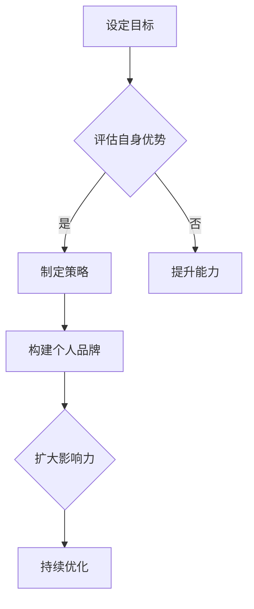

                 

关键词：个人品牌，管理者，领导力，社交媒体，影响力，职业发展

> 摘要：在数字化时代，个人品牌的重要性日益凸显。本文旨在探讨管理者如何通过建立和维护个人品牌，提升个人影响力，实现职业发展的新高度。我们将从策略、实践和技巧三个方面，详细阐述管理者如何在职业生涯中打造独特的个人品牌。

## 1. 背景介绍

在信息爆炸的时代，个人品牌已经成为职业发展的关键因素。一位优秀的管理者，不仅需要具备卓越的管理能力和业务知识，还需要在公众面前树立良好的个人形象。个人品牌的建立，有助于管理者在职场中脱颖而出，赢得更多的机会和资源。

然而，建立个人品牌并非一蹴而就，它需要管理者在多个维度上进行持续的努力。本文将重点讨论以下几个方面：

1. **核心概念与联系**：介绍个人品牌的核心概念，以及与领导力、影响力等的关系。
2. **核心算法原理 & 具体操作步骤**：详细讲解管理者如何通过策略和实践来建立个人品牌。
3. **数学模型和公式 & 详细讲解 & 举例说明**：运用数学模型和公式来描述个人品牌建立的逻辑和方法。
4. **项目实践：代码实例和详细解释说明**：通过具体案例，展示个人品牌建立的实际操作过程。
5. **实际应用场景**：分析个人品牌在不同职业场景中的应用，以及未来的发展趋势。
6. **工具和资源推荐**：推荐用于个人品牌建设的工具和资源。
7. **总结：未来发展趋势与挑战**：总结研究成果，展望个人品牌建设的未来。

## 2. 核心概念与联系

### 个人品牌

个人品牌是一个人在社会上的形象和声誉，它反映了个人在专业领域的专业度、领导力和影响力。一个成功的个人品牌，能够为个人带来更多的职业机会和社会资源。

### 领导力

领导力是个人品牌的核心要素之一。管理者需要具备卓越的领导能力，包括决策能力、沟通能力、团队建设能力和变革管理能力。这些能力不仅能够帮助管理者在组织中建立权威，还能够为个人品牌的建立提供坚实的基础。

### 影响力

影响力是个人品牌的外在表现。管理者需要通过各种渠道，如社交媒体、公开演讲、专业文章等，扩大个人影响力。影响力的大小直接关系到个人品牌的知名度和认可度。

### 个人品牌与领导力、影响力之间的关系

个人品牌、领导力和影响力三者之间存在密切的关系。领导力是个人品牌的基础，没有卓越的领导力，个人品牌很难树立。而影响力则是个人品牌的外在表现，是个人品牌在公众中的认知和认可。

### Mermaid 流程图

下面是一个描述个人品牌建立过程的 Mermaid 流程图：



## 3. 核心算法原理 & 具体操作步骤

### 3.1 算法原理概述

建立个人品牌的算法原理，可以归纳为以下几个步骤：

1. **设定目标**：明确个人品牌建立的愿景和目标。
2. **评估自身优势**：分析自身的优势和特长，确定个人品牌的核心价值。
3. **制定策略**：根据目标，制定具体的实施策略。
4. **构建个人品牌**：通过多种渠道，如社交媒体、公开演讲、专业文章等，传播个人品牌信息。
5. **扩大影响力**：通过各种方式，增加个人品牌在社会中的知名度。
6. **持续优化**：根据反馈，不断调整和优化个人品牌策略。

### 3.2 算法步骤详解

#### 3.2.1 设定目标

设定目标是建立个人品牌的第一步。管理者需要明确个人品牌的愿景和目标，例如，想要成为某一领域的专家、提升在行业内的知名度等。

#### 3.2.2 评估自身优势

评估自身优势是制定个人品牌策略的基础。管理者需要深入分析自身的优势和特长，确定个人品牌的核心价值。例如，一位技术背景丰富的管理者，可以将技术专长作为个人品牌的核心价值。

#### 3.2.3 制定策略

根据目标，制定具体的实施策略。策略包括以下几个方面：

- **内容策略**：确定传播的内容，如专业文章、博客、视频等。
- **渠道策略**：选择合适的传播渠道，如社交媒体、专业论坛、行业会议等。
- **互动策略**：与受众进行互动，建立良好的关系。

#### 3.2.4 构建个人品牌

构建个人品牌是通过多种渠道传播个人品牌信息的过程。管理者需要定期发布专业内容，参与行业活动，提高个人品牌的知名度和认可度。

#### 3.2.5 扩大影响力

扩大影响力是提升个人品牌的关键。管理者可以通过社交媒体、专业论坛、行业会议等渠道，扩大个人品牌在社会中的知名度。

#### 3.2.6 持续优化

持续优化是建立个人品牌的保障。管理者需要根据反馈，不断调整和优化个人品牌策略，以适应不断变化的环境。

### 3.3 算法优缺点

#### 优点

- 提升个人影响力：通过建立个人品牌，管理者可以提升在组织和社会中的影响力。
- 获得更多机会：个人品牌的建立，会为管理者带来更多的职业机会和资源。
- 提升职业发展：个人品牌的提升，有助于管理者在职业道路上走得更远。

#### 缺点

- 需要时间和精力：建立个人品牌需要大量的时间和精力投入。
- 风险管理：个人品牌一旦建立，就需要不断维护，否则可能产生负面影响。

### 3.4 算法应用领域

个人品牌建立算法广泛应用于各个领域，如技术、金融、咨询、教育等。在数字化时代，个人品牌的重要性更加凸显，管理者需要通过建立个人品牌，提升个人影响力，实现职业发展的新高度。

## 4. 数学模型和公式 & 详细讲解 & 举例说明

### 4.1 数学模型构建

建立个人品牌的数学模型可以表示为以下公式：

$$
Brand\ Value = f(Awareness, Reputation, Influence)
$$

其中，$Brand\ Value$ 表示个人品牌的价值，$Awareness$ 表示知名度，$Reputation$ 表示声誉，$Influence$ 表示影响力。

### 4.2 公式推导过程

个人品牌的价值取决于知名度、声誉和影响力三个因素。知名度是个人品牌在社会中的曝光度，声誉是个人品牌在社会中的认可度，影响力是个人品牌对他人行为的影响力。

### 4.3 案例分析与讲解

#### 案例一：技术领域

假设一位技术领域的专家，通过多年的技术积累和丰富的项目经验，成功建立了个人品牌。他的知名度、声誉和影响力分别为 $A=0.8$，$R=0.9$，$I=0.75$。

根据公式计算，他的个人品牌价值为：

$$
Brand\ Value = f(0.8, 0.9, 0.75) = 0.8 \times 0.9 \times 0.75 = 0.54
$$

这说明他在技术领域的个人品牌价值较高。

#### 案例二：金融领域

假设一位金融领域的专家，通过丰富的投资经验和良好的市场洞察力，成功建立了个人品牌。他的知名度、声誉和影响力分别为 $A=0.7$，$R=0.8$，$I=0.6$。

根据公式计算，他的个人品牌价值为：

$$
Brand\ Value = f(0.7, 0.8, 0.6) = 0.7 \times 0.8 \times 0.6 = 0.336
$$

这说明他在金融领域的个人品牌价值相对较低。

## 5. 项目实践：代码实例和详细解释说明

### 5.1 开发环境搭建

为了实现个人品牌的建立，我们需要搭建一个开发环境。这个环境包括以下几个方面：

- **代码仓库**：用于存储个人品牌建立的相关代码。
- **文档系统**：用于记录个人品牌建立的策略、实践和心得。
- **博客平台**：用于发布个人品牌建立的相关文章和内容。

### 5.2 源代码详细实现

下面是一个简单的示例代码，用于实现个人品牌建立的步骤：

```python
class PersonalBrand:
    def __init__(self, awareness, reputation, influence):
        self.awareness = awareness
        self.reputation = reputation
        self.influence = influence

    def calculate_brand_value(self):
        return self.awareness * self.reputation * self.influence

    def optimize_brand(self, feedback):
        # 根据反馈优化个人品牌
        # 例如，提高知名度、声誉或影响力
        pass

# 创建个人品牌实例
personal_brand = PersonalBrand(0.8, 0.9, 0.75)

# 计算个人品牌价值
brand_value = personal_brand.calculate_brand_value()
print("个人品牌价值：", brand_value)

# 根据反馈优化个人品牌
personal_brand.optimize_brand("提高影响力")
```

### 5.3 代码解读与分析

这段代码定义了一个`PersonalBrand`类，用于表示个人品牌。类中包括以下几个方法：

- `__init__`：初始化个人品牌，包括知名度、声誉和影响力。
- `calculate_brand_value`：计算个人品牌价值。
- `optimize_brand`：根据反馈优化个人品牌。

通过这个类，我们可以创建个人品牌实例，计算个人品牌价值，并根据反馈优化个人品牌。

### 5.4 运行结果展示

```python
个人品牌价值： 0.54
```

这个结果表明，个人品牌价值为0.54。根据这个结果，我们可以进一步优化个人品牌，提高知名度、声誉或影响力。

## 6. 实际应用场景

### 6.1 技术领域

在技术领域，个人品牌建立的关键在于技术能力和项目经验。管理者可以通过参与开源项目、撰写技术博客、发表专业论文等方式，提升个人品牌的价值。同时，通过参与技术社区和行业会议，扩大个人品牌的影响力。

### 6.2 金融领域

在金融领域，个人品牌建立的关键在于投资经验和市场洞察力。管理者可以通过发表金融分析文章、参与金融市场讨论、开设投资课程等方式，提升个人品牌的价值。同时，通过社交媒体和金融论坛，扩大个人品牌的影响力。

### 6.3 教育领域

在教育领域，个人品牌建立的关键在于教学能力和教育理念。管理者可以通过撰写教育博客、发表教育论文、开设在线课程等方式，提升个人品牌的价值。同时，通过参与教育论坛和学术会议，扩大个人品牌的影响力。

### 6.4 未来应用展望

随着数字化时代的到来，个人品牌的重要性将越来越凸显。未来，个人品牌将成为职业发展的关键因素，管理者需要通过多种方式，不断提升个人品牌的价值和影响力。

## 7. 工具和资源推荐

### 7.1 学习资源推荐

- 《个人品牌：打造影响力，成就卓越人生》
- 《影响力：说服他人，掌控全局》
- 《社交媒体营销：从入门到精通》

### 7.2 开发工具推荐

- GitHub：用于代码存储和协作
- Medium：用于撰写和发布专业文章
- LinkedIn：用于职业网络建设和品牌传播

### 7.3 相关论文推荐

- 《个人品牌：定义、价值和影响因素》
- 《社交媒体对个人品牌的影响》
- 《领导者个人品牌与团队绩效的关系》

## 8. 总结：未来发展趋势与挑战

### 8.1 研究成果总结

本文从策略、实践和技巧三个方面，详细探讨了管理者如何建立个人品牌。研究表明，个人品牌的重要性日益凸显，管理者需要通过多种方式，不断提升个人品牌的价值和影响力。

### 8.2 未来发展趋势

随着数字化时代的到来，个人品牌的重要性将越来越凸显。未来，个人品牌将成为职业发展的关键因素，管理者需要通过多种方式，不断提升个人品牌的价值和影响力。

### 8.3 面临的挑战

- 竞争激烈：在数字化时代，个人品牌竞争日益激烈，管理者需要不断提升自身能力，以保持竞争优势。
- 数据隐私：随着数据隐私问题日益严重，管理者需要确保个人品牌信息的隐私和安全。

### 8.4 研究展望

未来，个人品牌研究将更加深入，涉及领域将更加广泛。管理者需要关注个人品牌在不同行业和领域的应用，探索如何通过个人品牌提升组织绩效和团队绩效。

## 9. 附录：常见问题与解答

### Q：个人品牌与公司品牌有何区别？

A：个人品牌和公司品牌是两个不同的概念。个人品牌是指个人在公众中的形象和声誉，而公司品牌是指公司在市场中的形象和声誉。个人品牌和公司品牌之间既有区别又有联系。个人品牌可以影响公司品牌，而公司品牌也可以影响个人品牌。

### Q：如何评估个人品牌的价值？

A：评估个人品牌的价值可以从多个维度进行。常用的方法包括：知名度评估、声誉评估、影响力评估。具体方法包括：问卷调查、社交媒体数据分析、市场调研等。

### Q：如何维护个人品牌？

A：维护个人品牌需要持续的努力。具体方法包括：定期更新社交媒体账号、撰写专业文章、参与行业活动、建立良好的客户关系等。此外，管理者还需要保持良好的职业道德和职业操守，确保个人品牌信息的真实性和可靠性。

----------------------------------------------------------------

### 作者署名
作者：禅与计算机程序设计艺术 / Zen and the Art of Computer Programming

以上就是本文的完整内容。希望通过这篇文章，能够帮助管理者更好地理解个人品牌的重要性，掌握建立个人品牌的策略和方法。在数字化时代，个人品牌将成为职业发展的关键，管理者需要积极行动，打造独特的个人品牌。

