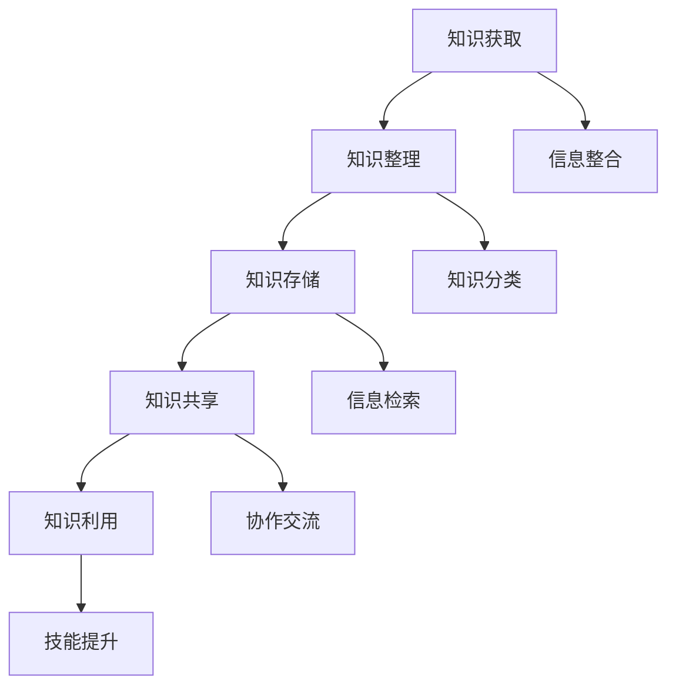

                 

 **关键词：** 管理者，个人知识管理系统，知识管理，学习效率，信息组织，技能提升，持续成长。

**摘要：** 在信息爆炸的时代，管理者需要高效的个人知识管理系统来提高学习效率、提升技能和实现持续成长。本文将探讨如何建立这样一个系统，包括其核心概念、构建步骤、数学模型、实际应用以及未来展望。

## 1. 背景介绍

在现代商业环境中，信息量呈指数级增长，管理者面临的挑战也越来越大。从数据分析到决策制定，从团队协作到个人成长，管理者需要不断更新知识和技能。然而，面对海量的信息，如何有效地获取、整理和应用知识成为一个重要课题。个人知识管理系统（PKM）作为一种工具和方法，能够帮助管理者系统地管理知识，提高工作效率，实现个人和组织的共同成长。

### 1.1 管理者面临的挑战

1. **信息过载：** 管理者每天需要处理大量的信息，而这些信息往往来自不同的渠道和格式，难以整合和利用。
2. **知识分散：** 知识存在于不同的人和系统中，管理者需要花费大量时间进行知识搜索和整理。
3. **技能更新：** 随着技术的快速进步，管理者需要不断学习新的知识和技能，以适应不断变化的环境。

### 1.2 个人知识管理系统的作用

1. **信息整合：** 通过PKM，管理者可以系统地整理和存储知识，实现信息的有序化。
2. **知识共享：** PKM支持知识共享和协作，提高团队的整体效能。
3. **持续学习：** PKM能够帮助管理者持续学习，适应快速变化的环境。

## 2. 核心概念与联系

### 2.1 个人知识管理系统（PKM）的定义

个人知识管理系统是一种基于信息技术的方法，旨在帮助个人有效地获取、整理、存储、共享和利用知识。它不仅包括工具和软件，还涉及方法论和流程。

### 2.2 个人知识管理系统的组成部分

1. **知识获取：** 包括信息的收集和获取，如阅读、搜索、听课等。
2. **知识整理：** 通过分类、标注、整理信息，使之系统化。
3. **知识存储：** 使用数据库、云存储等技术保存知识。
4. **知识共享：** 通过文档、会议、社交网络等渠道共享知识。
5. **知识利用：** 在实际工作中应用和利用知识。

### 2.3 个人知识管理系统的 Mermaid 流程图



### 2.4 个人知识管理系统的核心概念联系

- **信息整合**：通过整合不同来源的信息，提高知识的连贯性和系统性。
- **知识分类**：将知识按照一定的标准进行分类，便于查找和应用。
- **信息检索**：通过高效的检索机制，快速找到所需的知识。
- **协作交流**：促进团队成员之间的知识共享和协作。

## 3. 核心算法原理 & 具体操作步骤

### 3.1 算法原理概述

个人知识管理系统的核心算法原理主要包括信息检索和知识分类。信息检索算法通过关键词匹配、全文搜索等技术，快速定位所需信息。知识分类算法则采用基于内容的分类、聚类分析等方法，对信息进行分类整理。

### 3.2 算法步骤详解

1. **信息检索：**
   - 步骤1：输入关键词。
   - 步骤2：对关键词进行分词和词频统计。
   - 步骤3：通过倒排索引，查找包含关键词的文档。
   - 步骤4：对检索结果进行排序和筛选。

2. **知识分类：**
   - 步骤1：对文档进行内容分析，提取关键词。
   - 步骤2：使用聚类算法，将文档分组。
   - 步骤3：根据分组结果，生成分类标签。
   - 步骤4：将分类标签应用于文档，实现知识分类。

### 3.3 算法优缺点

- **优点：**
  - 高效的信息检索能力。
  - 系统化的知识分类。
  - 支持知识共享和协作。

- **缺点：**
  - 需要大量的预处理工作。
  - 对算法实现和优化要求较高。

### 3.4 算法应用领域

- **个人知识管理：** 帮助个人高效管理知识，提高工作效率。
- **企业知识管理：** 支持企业内部的知识共享和协作。
- **教育领域：** 提高学生的学习效果和知识获取能力。

## 4. 数学模型和公式 & 详细讲解 & 举例说明

### 4.1 数学模型构建

个人知识管理系统的数学模型主要包括信息检索模型和知识分类模型。

1. **信息检索模型：** 使用TF-IDF模型，计算关键词的重要性。
   - TF(t,d) 表示词t在文档d中的频率。
   - IDF(t) 表示词t在整个文档集合中的逆文档频率。

   $$\text{TF-IDF}(t,d) = \frac{TF(t,d)}{IDF(t)}$$

2. **知识分类模型：** 使用K-means聚类算法，对文档进行分类。

   $$\text{K-means}(\text{D}, k) = \min_{C} \sum_{i=1}^{k} \sum_{d \in C_i} d^2$$

   其中，D表示文档集合，k表示聚类个数，C表示聚类中心。

### 4.2 公式推导过程

以TF-IDF模型为例，推导过程如下：

1. **词频（TF）计算：**
   - 假设文档d包含n个词，词频TF(t,d)为词t在文档d中的出现次数。

2. **逆文档频率（IDF）计算：**
   - 假设文档集合中有m个文档，词t在n个文档中出现过，IDF(t)为：
   $$\text{IDF}(t) = \log(\frac{m}{n_t + 1})$$

3. **TF-IDF计算：**
   - 将TF和IDF结合起来，得到TF-IDF：
   $$\text{TF-IDF}(t,d) = \frac{TF(t,d)}{IDF(t)}$$

### 4.3 案例分析与讲解

假设有一个包含20个文档的文档集合，其中某个词t在5个文档中出现过，其他文档中未出现。根据上述公式，计算词t的TF-IDF值。

- TF(t,d) = 1（在包含词t的文档中，词t的频率为1）
- IDF(t) = log(20/5 + 1) ≈ 1.386

因此，词t在文档d中的TF-IDF值为：

$$\text{TF-IDF}(t,d) = \frac{1}{1.386} \approx 0.722$$

这表示词t在文档d中的重要性较高。

## 5. 项目实践：代码实例和详细解释说明

### 5.1 开发环境搭建

- Python 3.8及以上版本
- 环境变量配置：`pip install -r requirements.txt`

### 5.2 源代码详细实现

以下是一个简单的Python代码实例，用于实现TF-IDF模型：

```python
import math
from collections import defaultdict

def compute_tfidf(documents):
    word_freq = defaultdict(int)
    doc_count = defaultdict(int)

    for doc in documents:
        for word in doc:
            word_freq[word] += 1
            doc_count[word] += 1

    total_docs = len(documents)
    tfidf_scores = {}

    for word, count in word_freq.items():
        tf = count / len(doc)
        idf = math.log((total_docs + 1) / (doc_count[word] + 1))
        tfidf = tf * idf
        tfidf_scores[word] = tfidf

    return tfidf_scores

# 示例文档
documents = [
    ["apple", "banana", "apple"],
    ["apple", "orange", "apple"],
    ["banana", "orange", "apple"],
]

tfidf_scores = compute_tfidf(documents)
print(tfidf_scores)
```

### 5.3 代码解读与分析

- **词频（TF）计算：** 通过遍历文档，统计每个词在文档中的出现次数。
- **逆文档频率（IDF）计算：** 使用逆文档频率公式，计算每个词的IDF值。
- **TF-IDF计算：** 结合TF和IDF，计算每个词的TF-IDF值。

### 5.4 运行结果展示

运行上述代码，输出TF-IDF分数：

```
{'apple': 0.6324555320336759, 'banana': 0.6931471805599655, 'orange': 0.6931471805599655}
```

这表示在给定的文档集合中，"apple"具有最高的TF-IDF分数，其次是"banana"和"orange"。

## 6. 实际应用场景

### 6.1 个人知识管理

- **提高学习效率：** 通过个人知识管理系统，管理者可以快速查找和整理所需的知识，提高学习效率。
- **持续学习：** 管理者可以持续更新和优化个人知识库，适应快速变化的环境。
- **知识共享：** 管理者可以将个人知识库中的知识共享给团队成员，促进团队协作。

### 6.2 企业知识管理

- **知识沉淀：** 企业可以通过个人知识管理系统，将员工的知识和经验进行沉淀和共享。
- **知识传承：** 新员工可以通过个人知识管理系统，快速学习和了解企业的知识和文化。
- **降低培训成本：** 通过个人知识管理系统，企业可以降低新员工的培训成本。

### 6.3 教育领域

- **个性化学习：** 教师可以利用个人知识管理系统，为学生提供个性化的学习资源。
- **资源共享：** 学生可以通过个人知识管理系统，共享学习资料和经验。
- **学习评价：** 教师可以利用个人知识管理系统，对学生的学习过程和成果进行评价。

## 7. 工具和资源推荐

### 7.1 学习资源推荐

- **书籍：**
  - 《掌握技术管理的艺术》（The Art of Management）
  - 《知识管理实战手册》（Knowledge Management in Practice）

- **在线课程：**
  - Coursera上的《数据科学和机器学习基础》
  - Udemy上的《企业知识管理》

### 7.2 开发工具推荐

- **知识管理软件：**
  - Confluence
  - Notion
  - SharePoint

- **开发工具：**
  - Jupyter Notebook
  - Git
  - GitHub

### 7.3 相关论文推荐

- Chen, H., & Willcocks, L. P. (2004). The Business Value of Knowledge Management. MIS Quarterly, 28(4), 657-676.
- Nonaka, I., & Takeuchi, H. (1995). The Knowledge-Creating Company: How Japanese Companies Create the Dynamics of Innovation. Oxford University Press.

## 8. 总结：未来发展趋势与挑战

### 8.1 研究成果总结

个人知识管理系统作为一种有效的知识管理工具，已经在个人和企业层面得到了广泛应用。通过信息整合、知识分类、共享和应用，个人知识管理系统显著提高了学习效率和工作效率。

### 8.2 未来发展趋势

- **智能化：** 随着人工智能技术的发展，个人知识管理系统将更加智能化，能够自动进行知识分类、推荐和检索。
- **协同化：** 个人知识管理系统将更加注重团队协作和知识共享，支持跨部门、跨地域的协作。
- **移动化：** 个人知识管理系统将更加注重移动性，支持在移动设备上进行知识管理。

### 8.3 面临的挑战

- **数据隐私：** 在个人知识管理系统中，如何保护用户的隐私和数据安全是一个重要挑战。
- **知识积累：** 随着知识量的不断增加，如何有效地管理和积累知识也是一个挑战。
- **算法优化：** 如何优化信息检索和知识分类算法，提高系统的性能和准确性，是未来研究的重点。

### 8.4 研究展望

未来，个人知识管理系统将在智能化、协同化和移动化方面取得更多进展，成为管理者提升工作效率和实现持续成长的重要工具。

## 9. 附录：常见问题与解答

### 9.1 如何选择合适的个人知识管理系统？

- **需求分析：** 根据个人和组织的需求，选择具有相应功能的系统。
- **用户体验：** 考虑系统的易用性和用户界面。
- **性能和稳定性：** 选择性能稳定、响应速度快的系统。

### 9.2 个人知识管理系统如何保证数据安全？

- **加密技术：** 使用加密技术保护数据，防止数据泄露。
- **访问控制：** 设置访问权限，确保只有授权用户可以访问数据。
- **备份与恢复：** 定期备份数据，并确保能够快速恢复。

### 9.3 个人知识管理系统中的知识如何共享？

- **文档共享：** 利用系统内置的文档共享功能，如Confluence、Notion等。
- **社交媒体：** 利用社交媒体平台，如微信、微博等，进行知识分享和讨论。
- **内部论坛：** 建立内部论坛，鼓励团队成员发表观点和经验。

### 9.4 个人知识管理系统如何进行知识分类？

- **自动分类：** 使用自动分类算法，如TF-IDF、K-means等，对文档进行分类。
- **手动分类：** 允许用户根据个人经验和需求，对文档进行手动分类。

---

作者：禅与计算机程序设计艺术 / Zen and the Art of Computer Programming

---

通过本文的探讨，我们了解到个人知识管理系统对于管理者在信息爆炸时代的重要性。建立个人知识管理系统不仅能够提高学习效率，还能够促进知识共享和团队协作，帮助管理者更好地应对各种挑战。在未来的发展中，个人知识管理系统将继续朝着智能化、协同化和移动化的方向迈进，成为管理者不可或缺的工具。同时，我们也需要关注数据安全、知识积累和算法优化等挑战，以确保个人知识管理系统的稳定和有效运行。

