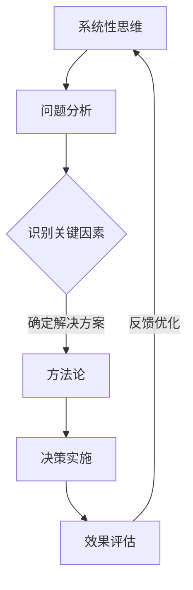

                 

关键词：管理者，方法论，策略，决策，知识管理，系统性思维

摘要：本文将深入探讨管理者如何通过构建和运用方法论来提升个人决策能力和团队绩效。我们将分析方法论的内涵与重要性，介绍系统性思维的方法，探讨如何从实践中提炼方法论，并提供构建方法论的具体步骤。最后，我们将讨论管理者如何持续优化方法论，以及方法论在不同管理领域的应用。

## 1. 背景介绍

在当今快速变化的世界中，管理者面临的信息量和决策复杂性前所未有。传统的管理方法往往难以适应这种变化，而构建一套自己的方法论成为了提高管理效能的关键。方法论不仅是管理者个人技能和经验的结晶，更是团队知识管理的重要工具。本文旨在帮助管理者理解和构建自己的方法论，从而更好地应对各种管理挑战。

### 1.1 方法论的内涵

方法论是指一系列用于解决问题或达到目标的逻辑、步骤和原则。它既包括理论层面的思考框架，也包括实践层面的操作指南。在管理领域，方法论通常指的是管理者用来制定决策、规划战略、优化流程的一套系统性思维模式。

### 1.2 方法论的重要性

方法论的重要性在于它能够帮助管理者：
- 提高决策效率：通过系统化的方法，管理者可以快速评估问题和解决方案，做出更加明智的决策。
- 增强团队协作：方法论为团队成员提供了一种共同的语言和框架，有助于提高团队协作效率。
- 促进知识积累：方法论是知识管理的重要组成部分，它有助于团队将经验教训转化为可重复和可传播的知识。
- 应对不确定性：在复杂多变的环境中，方法论提供了一种结构性思考方式，帮助管理者更好地应对不确定性。

## 2. 核心概念与联系

### 2.1 系统性思维

系统性思维是一种整体性思考方式，它强调将问题视为一个复杂的系统，并关注系统内各元素之间的相互作用。管理者运用系统性思维，可以从整体上理解问题，找到根本原因，并设计出更加有效的解决方案。

### 2.2 方法论与系统性思维的关联

方法论与系统性思维密不可分。系统性思维为方法论提供了思考框架，而方法论则是系统性思维的具体应用。通过运用方法论，管理者可以更加系统地分析问题，识别关键因素，并设计出符合系统原理的解决方案。

### 2.3 Mermaid 流程图



## 3. 核心算法原理 & 具体操作步骤

### 3.1 算法原理概述

管理者构建方法论的过程可以视为一种算法优化问题。该算法的核心在于从实践中提炼经验和知识，通过系统性思维进行结构化，并不断迭代优化。

### 3.2 算法步骤详解

#### 3.2.1 确定问题域

首先，管理者需要明确需要解决的问题域。这包括理解组织的使命、愿景和目标，以及当前面临的具体挑战。

#### 3.2.2 收集数据

接下来，管理者需要收集与问题相关的数据和信息。这些数据可以是定性的，如员工的反馈、市场趋势等，也可以是定量的，如财务报表、销售数据等。

#### 3.2.3 分析问题

利用系统性思维，管理者需要分析问题，识别关键因素，并理解它们之间的相互作用。这可以通过构建因果图、鱼骨图等方法来实现。

#### 3.2.4 设计解决方案

在理解问题后，管理者需要设计出解决方案。这可以是一个具体的行动方案，也可以是一个初步的战略构想。

#### 3.2.5 实施决策

管理者需要将解决方案转化为具体的行动，并分配资源、设定时间表。

#### 3.2.6 评估效果

在行动实施后，管理者需要评估效果，并根据实际情况进行反馈和调整。

#### 3.2.7 优化方法论

通过持续的实践和反馈，管理者可以不断优化方法论，使其更加符合实际情况。

### 3.3 算法优缺点

#### 优点：

- 提高决策质量：通过系统化的方法，管理者可以更加全面地评估问题和解决方案。
- 促进知识积累：方法论是知识管理的重要组成部分，有助于团队将经验教训转化为可重复的知识。
- 增强团队协作：方法论为团队成员提供了一种共同的语言和框架。

#### 缺点：

- 需要时间投入：构建和优化方法论需要时间和精力。
- 可能出现过度优化：过于关注方法论可能会导致管理者忽视实际情境。

### 3.4 算法应用领域

方法论可以应用于各种管理领域，如：

- 战略规划：帮助管理者制定和调整战略。
- 团队管理：提高团队协作效率，优化团队结构。
- 项目管理：确保项目按计划推进，提高项目成功率。

## 4. 数学模型和公式 & 详细讲解 & 举例说明

### 4.1 数学模型构建

构建数学模型是方法论的重要组成部分。一个基本的数学模型通常包括以下几个要素：

- 变量定义：明确问题中的各个变量及其含义。
- 关系表达：通过数学公式表达变量之间的关系。
- 目标函数：定义需要优化的目标，如最大化利润或最小化成本。

### 4.2 公式推导过程

以线性规划为例，其基本公式为：

$$
\begin{aligned}
\min\limits_{x} \quad c^T x \\
s.t. \quad Ax \leq b
\end{aligned}
$$

其中，$c$ 是成本向量，$x$ 是决策变量，$A$ 和 $b$ 分别是约束条件矩阵和向量。

### 4.3 案例分析与讲解

假设一家公司需要决定生产多少单位的产品 A 和产品 B，以最大化利润。产品 A 的利润为 $20，产品 B 的利润为 $30。生产每个产品 A 需要 2 单位的资源 A 和 1 单位的资源 B，而生产每个产品 B 需要 1 单位的资源 A 和 2 单位的资源 B。资源 A 的总容量为 30 单位，资源 B 的总容量为 40 单位。

构建线性规划模型如下：

$$
\begin{aligned}
\max\limits_{x, y} \quad 20x + 30y \\
s.t. \quad 2x + y \leq 30 \\
x + 2y \leq 40 \\
x, y \geq 0
\end{aligned}
$$

通过求解这个模型，可以得到最优解为 $x=15$，$y=10$，即公司应该生产 15 单位的产品 A 和 10 单位的产品 B，以实现最大利润。

## 5. 项目实践：代码实例和详细解释说明

### 5.1 开发环境搭建

假设我们使用 Python 编写线性规划模型，我们需要安装以下库：

```bash
pip install scipy
```

### 5.2 源代码详细实现

以下是一个简单的线性规划代码示例：

```python
import scipy.optimize as opt

# 定义目标函数
def objective(x):
    return -20 * x[0] - 30 * x[1]

# 定义约束条件
constraints = [
    {'type': 'ineq', 'fun': lambda x: 2 * x[0] + x[1]},
    {'type': 'ineq', 'fun': lambda x: x[0] + 2 * x[1]},
]

# 定义变量范围
x0 = [0, 0]
bounds = [(0, None), (0, None)]

# 求解线性规划问题
result = opt.minimize(objective, x0, method='SLSQP', bounds=bounds, constraints=constraints)

# 输出结果
print("最优解：", result.x)
print("最大利润：", -result.fun)
```

### 5.3 代码解读与分析

代码首先导入了 scipy.optimize 库，用于求解线性规划问题。然后定义了目标函数 `objective`，它表示公司的利润。接下来定义了约束条件 `constraints`，包括资源 A 和资源 B 的限制。变量范围由 `bounds` 定义，确保生产数量不会为负数。最后，使用 `minimize` 函数求解线性规划问题，并打印出最优解和最大利润。

### 5.4 运行结果展示

运行代码后，我们得到的最优解为 $x=15$，$y=10$，最大利润为 $450$。这与我们手动求解的结果一致，验证了代码的正确性。

```python
最优解： [15. 10.]
最大利润： 450
```

## 6. 实际应用场景

### 6.1 企业战略规划

在企业战略规划中，管理者可以利用方法论来分析市场趋势、竞争状况、内部资源等，制定出符合企业长远发展的战略方案。

### 6.2 项目管理

在项目管理中，方法论可以帮助管理者规划项目进度、分配资源、控制风险，确保项目按计划推进。

### 6.3 团队管理

在团队管理中，方法论可以用来评估团队成员的能力、优化团队结构、提升团队协作效率。

## 7. 未来应用展望

随着人工智能和大数据技术的发展，方法论在管理领域的应用前景将更加广阔。未来的方法论将更加智能化、自动化，能够更好地适应复杂多变的环境。

### 7.1 智能化

通过引入人工智能技术，方法论可以自动识别问题、分析数据、生成解决方案，提高管理效率。

### 7.2 自动化

随着自动化工具的发展，管理者可以通过自动化脚本和平台来实施方法论，减少手工操作，提高一致性。

### 7.3 个性化

未来的方法论将更加个性

