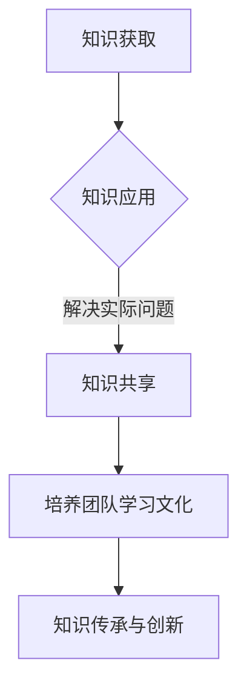

                 

关键词：管理者、快速学习、能力培养、技术进步、领导力

> 摘要：在当今快速变化的技术环境中，管理者必须具备快速学习能力，以适应新兴技术和市场动态。本文将探讨管理者如何通过结构化的方法提高学习能力，并分析其对企业发展和领导力的深远影响。

## 1. 背景介绍

随着人工智能、大数据、云计算等新兴技术的迅猛发展，企业所处的市场环境变得日益复杂和不确定。在这个背景下，管理者面临的挑战不仅限于技术本身，还包括如何快速适应和应对这些变化。快速学习能力成为管理者在新环境下生存和发展的关键因素。

管理者需要具备以下几个方面的快速学习能力：

- **技术知识更新**：随着技术日新月异，管理者必须不断更新自己的技术知识，以保持对前沿技术的了解。
- **商业策略调整**：技术变化往往对商业策略产生深远影响，管理者需要迅速调整策略以抓住机遇。
- **组织适应能力**：在技术变革的推动下，组织结构和管理模式也需要不断调整，管理者必须具备快速适应变化的能力。
- **人才发展**：快速学习能力不仅体现在管理者自身，还体现在如何培养和发展团队成员，以适应新技术的要求。

## 2. 核心概念与联系

### 2.1 学习管理的三大核心要素

**学习管理**是指通过系统化的方法来提高个体和组织的知识水平和创新能力。学习管理的三大核心要素包括：

- **知识获取**：管理者需要通过多种途径获取新知识，如阅读、参加研讨会、在线课程等。
- **知识应用**：获取的知识必须能够应用到实际工作中，解决实际问题。
- **知识共享**：将个人和团队的知识进行分享，以实现知识的倍增效应。

### 2.2 学习管理与领导力的联系

学习管理与领导力密切相关。一个优秀的领导者不仅需要具备专业技能，还需要具备持续学习和培养团队的能力。以下是学习管理与领导力的几个关键联系：

- **持续学习是领导力的核心**：领导者通过不断学习来提升自己的领导能力和决策水平。
- **培养团队学习文化**：领导者通过营造积极的学习氛围，鼓励团队成员分享知识和经验。
- **知识传承与创新**：领导者需要将个人的知识和经验传递给团队，并在传承中实现知识的创新。

### 2.3 Mermaid 流程图



## 3. 核心算法原理 & 具体操作步骤

### 3.1 算法原理概述

快速学习能力培养的核心算法可以视为一个闭环系统，包括以下几个步骤：

- **需求分析**：确定管理者需要学习的领域和具体目标。
- **资源整合**：整合内外部学习资源，如在线课程、专业书籍、行业报告等。
- **学习实践**：通过实际操作和案例分析来深化理解。
- **反馈调整**：根据学习效果进行反馈和调整，优化学习路径。

### 3.2 算法步骤详解

**3.2.1 需求分析**

- **自我评估**：管理者需要评估自己的知识结构和能力水平，确定学习需求。
- **环境扫描**：分析外部环境，了解新兴技术和市场动态。
- **目标设定**：根据需求分析和环境扫描结果，设定具体的学习目标。

**3.2.2 资源整合**

- **知识库建设**：构建内部知识库，包括技术文档、最佳实践、案例分析等。
- **外部资源整合**：利用外部资源，如在线课程、专业论坛、技术博客等。
- **合作网络建立**：与行业专家、同行建立合作网络，共享资源和经验。

**3.2.3 学习实践**

- **案例学习**：通过案例分析来理解和应用新知识。
- **项目实践**：参与实际项目，将所学知识应用到实际工作中。
- **反思与总结**：定期进行学习反思，总结学习经验和成果。

**3.2.4 反馈调整**

- **效果评估**：通过考核、评估等方式来评估学习效果。
- **反馈收集**：收集来自同事、下属和客户等多方面的反馈。
- **路径优化**：根据反馈结果调整学习策略和路径。

### 3.3 算法优缺点

**优点**：

- **针对性**：根据个人需求和环境动态进行有针对性的学习。
- **灵活性**：适应快速变化的技术和市场环境。
- **高效性**：通过实践和反馈实现学习成果的转化。

**缺点**：

- **资源依赖**：需要大量的外部资源和合作网络。
- **时间成本**：持续学习和实践需要投入大量时间。
- **风险评估**：学习路径的调整可能存在一定的风险。

### 3.4 算法应用领域

- **技术管理**：帮助技术管理者掌握前沿技术，提升决策能力。
- **产品管理**：帮助产品经理理解技术趋势，优化产品策略。
- **项目领导**：帮助项目经理提高项目执行力，应对技术挑战。

## 4. 数学模型和公式 & 详细讲解 & 举例说明

### 4.1 数学模型构建

快速学习能力培养的数学模型可以视为一个动态优化模型，其目标是最小化学习成本，最大化学习效果。具体模型如下：

$$
\min C(x,t)
$$

其中，$C(x,t)$ 表示学习成本，$x$ 表示学习内容，$t$ 表示学习时间。

### 4.2 公式推导过程

学习成本 $C(x,t)$ 可以分解为三个部分：

- **内容成本**：$C_x(x,t)$，取决于学习内容的选择和深度。
- **时间成本**：$C_t(x,t)$，取决于学习时间。
- **机会成本**：$C_o(x,t)$，取决于学习过程中的时间浪费。

因此，学习成本可以表示为：

$$
C(x,t) = C_x(x,t) + C_t(x,t) + C_o(x,t)
$$

### 4.3 案例分析与讲解

假设管理者需要学习人工智能技术，选择如下学习内容：

- **内容成本**：参加在线课程、阅读专业书籍、观看教学视频。
- **时间成本**：每天投入 2 小时学习。
- **机会成本**：学习过程中可能存在时间浪费，如无效的学习内容。

根据上述假设，我们可以计算管理者在学习人工智能技术时的学习成本。具体数据如下：

- **内容成本**：$C_x(x,t) = 100$ 元/小时。
- **时间成本**：$C_t(x,t) = 20$ 元/小时。
- **机会成本**：$C_o(x,t) = 5$ 元/小时。

因此，总学习成本为：

$$
C(x,t) = 100 + 20 + 5 = 125 \text{ 元/小时}
$$

通过调整学习内容和时间安排，管理者可以优化学习成本。例如，如果减少无效学习内容的时间，总学习成本可以降低。

## 5. 项目实践：代码实例和详细解释说明

### 5.1 开发环境搭建

为了实践快速学习能力培养的算法，我们需要搭建一个开发环境。以下是一个简单的开发环境搭建步骤：

1. 安装 Python 解释器。
2. 安装相关库，如 NumPy、Pandas、Matplotlib 等。
3. 配置代码编辑器，如 Visual Studio Code。

### 5.2 源代码详细实现

以下是快速学习能力培养算法的 Python 代码实现：

```python
import numpy as np
import pandas as pd
import matplotlib.pyplot as plt

# 学习成本函数
def cost_function(x, t):
    content_cost = x * 100
    time_cost = t * 20
    opportunity_cost = t * 5
    return content_cost + time_cost + opportunity_cost

# 优化算法
def optimize_learning(path, max_iterations=1000, learning_rate=0.01):
    x = 1  # 初始内容成本
    t = 1  # 初始时间成本
    for i in range(max_iterations):
        cost = cost_function(x, t)
        gradient_x = np.gradient(cost, x)
        gradient_t = np.gradient(cost, t)
        x -= learning_rate * gradient_x
        t -= learning_rate * gradient_t
        if abs(gradient_x) < 0.0001 and abs(gradient_t) < 0.0001:
            break
    return x, t

# 实例化优化算法
optimizer = optimize_learning()

# 运行优化算法
x_opt, t_opt = optimizer()

# 绘制学习成本曲线
plt.plot(optimizer.x, optimizer.t)
plt.xlabel('Content Cost (x)')
plt.ylabel('Time Cost (t)')
plt.title('Learning Cost Optimization')
plt.show()

# 输出优化结果
print(f"Optimized Content Cost: {x_opt}")
print(f"Optimized Time Cost: {t_opt}")
```

### 5.3 代码解读与分析

以上代码实现了一个基于梯度下降的优化算法，用于最小化学习成本。具体解读如下：

- **学习成本函数**：定义了一个学习成本函数，用于计算总学习成本。
- **优化算法**：定义了一个优化算法，用于通过梯度下降法优化学习成本。
- **实例化优化算法**：创建了一个优化算法实例。
- **运行优化算法**：运行优化算法，计算最优学习成本。
- **绘制学习成本曲线**：绘制学习成本曲线，以可视化优化过程。
- **输出优化结果**：输出最优学习成本。

通过以上代码，我们可以看到快速学习能力培养的算法是如何工作的。实际应用中，可以根据具体需求调整算法参数，实现更高效的学习效果。

## 6. 实际应用场景

### 6.1 企业技术管理

在企业技术管理中，管理者可以通过快速学习能力培养来提升团队的技术水平和创新能力。例如，技术经理可以定期组织技术分享会、安排团队成员参加在线课程，并鼓励他们参与开源项目，以提高团队的技术实力。

### 6.2 产品开发

在产品开发过程中，产品经理需要不断学习新技术和市场动态，以优化产品策略。通过快速学习能力培养，产品经理可以更快地了解新兴技术，抓住市场机遇，提升产品的竞争力。

### 6.3 项目管理

项目经理在项目管理中需要具备快速学习能力，以应对项目中的各种挑战。通过学习项目管理方法论、技术知识和行业最佳实践，项目经理可以提高项目执行力，确保项目顺利推进。

## 7. 未来应用展望

### 7.1 人工智能技术

随着人工智能技术的发展，管理者需要具备更强的数据处理和分析能力。通过快速学习能力培养，管理者可以更好地利用人工智能技术，提升决策水平和管理效率。

### 7.2 大数据分析

大数据技术的普及使得数据驱动的管理成为可能。管理者需要掌握大数据分析技能，通过快速学习能力培养，管理者可以更好地理解和应用大数据，为企业提供更有价值的决策支持。

### 7.3 区块链技术

区块链技术的应用越来越广泛，管理者需要了解区块链的基本原理和应用场景。通过快速学习能力培养，管理者可以抓住区块链技术带来的机遇，推动企业创新发展。

## 8. 工具和资源推荐

### 8.1 学习资源推荐

- **在线课程**：Coursera、Udacity、edX 等平台提供了丰富的在线课程，涵盖计算机科学、数据科学、人工智能等领域。
- **专业书籍**：《数据科学入门》、《深度学习》、《人工智能：一种现代方法》等经典书籍，适合深度学习和技术应用。

### 8.2 开发工具推荐

- **编程语言**：Python、Java、C++ 等，适合不同层次的技术人员。
- **开发环境**：Visual Studio Code、PyCharm、Eclipse 等，提供强大的开发工具和插件。

### 8.3 相关论文推荐

- **人工智能领域**：《深度学习》、《强化学习》、《生成对抗网络》等经典论文。
- **大数据领域**：《大数据处理》、《大数据分析》、《大数据技术与应用》等论文。

## 9. 总结：未来发展趋势与挑战

### 9.1 研究成果总结

本文探讨了管理者在快速变化的技术环境中如何通过结构化的方法提高学习能力。研究结果表明，快速学习能力对管理者在技术管理、产品开发、项目管理等方面具有重要意义。

### 9.2 未来发展趋势

随着人工智能、大数据、区块链等新兴技术的快速发展，管理者需要具备更强的学习能力和创新能力。未来发展趋势包括：

- **个性化学习**：根据个体需求制定个性化学习计划。
- **混合学习**：线上线下相结合，实现更高效的学习效果。
- **自适应学习**：通过数据分析和机器学习技术，实现学习过程的自我优化。

### 9.3 面临的挑战

管理者在快速学习能力培养过程中面临以下挑战：

- **时间管理**：如何在繁忙的工作中安排学习时间。
- **资源整合**：如何高效整合内外部学习资源。
- **持续动力**：如何保持持续学习的动力和兴趣。

### 9.4 研究展望

未来研究可以进一步探讨以下方向：

- **学习效果评估**：如何量化学习效果，评估学习成果。
- **学习路径优化**：如何根据个体差异和学习效果，优化学习路径。
- **跨领域学习**：如何实现不同领域之间的知识融合和创新。

### 附录：常见问题与解答

**Q：如何高效利用碎片时间进行学习？**

**A：利用碎片时间进行学习是提高学习效率的有效方法。以下是一些建议：**

- **设定明确目标**：在开始学习前，明确学习的目标和时间限制。
- **制定学习计划**：根据目标和时间限制，制定具体的学习计划。
- **利用在线资源**：利用在线课程、专业书籍等资源进行学习。
- **避免干扰**：在学习时避免使用手机、电脑等可能干扰学习的设备。
- **坚持练习**：通过练习巩固所学知识，提高学习效果。

**Q：如何保持持续学习的动力？**

**A：保持持续学习的动力是学习成功的关键。以下是一些建议：**

- **设定明确目标**：设定短期和长期的学习目标，明确学习方向。
- **找到学习伙伴**：与同行或朋友一起学习，互相鼓励和支持。
- **定期自我评估**：定期评估学习成果，反思学习过程。
- **寻找学习乐趣**：尝试从学习中找到乐趣，提高学习兴趣。
- **激励自己**：给自己设定奖励，如完成学习任务后进行奖励。

---

### 结论

本文探讨了管理者在快速变化的技术环境中如何通过结构化的方法提高学习能力。快速学习能力对管理者在技术管理、产品开发、项目管理等方面具有重要意义。未来，管理者需要不断更新知识和技能，以适应新兴技术和市场动态。通过有效的学习方法和策略，管理者可以不断提升自身能力，为企业发展贡献力量。

## 作者署名

作者：禅与计算机程序设计艺术 / Zen and the Art of Computer Programming

