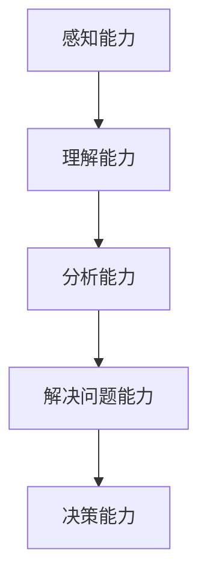

                 

关键词：管理者、思维敏捷度、训练、技术语言、专业、IT领域

> 摘要：本文从管理者的视角出发，探讨了如何通过技术语言的思维敏捷度训练，提高管理者的信息处理能力和决策水平。文章首先介绍了思维敏捷度的核心概念，然后分析了其在现代企业管理中的应用，并结合具体实例，提出了有效的训练方法和策略。

## 1. 背景介绍

在信息技术高速发展的今天，企业面临着前所未有的竞争和挑战。作为企业领导者，管理者需要具备快速捕捉信息、分析问题、做出决策的能力。这种能力不仅体现在技术层面上，更体现在思维敏捷度上。思维敏捷度是指管理者在信息处理过程中，能够迅速准确地理解、分析和解决问题的能力。随着市场竞争的加剧，管理者的思维敏捷度显得愈发重要。

### 1.1 管理者面临的挑战

现代企业管理中，管理者面临着以下几方面的挑战：

1. **信息过载**：随着互联网和大数据技术的发展，管理者每天接收到的信息量呈指数级增长。如何在短时间内处理海量信息，提取有效信息，成为管理者的一大挑战。
2. **快速变化**：市场需求、技术进步、竞争态势等都在不断变化，管理者需要具备快速适应变化、预见未来的能力。
3. **复杂决策**：企业决策涉及多个层面和维度，管理者需要综合考虑各种因素，做出科学合理的决策。

### 1.2 思维敏捷度的意义

思维敏捷度是管理者应对上述挑战的关键能力。它不仅有助于管理者快速捕捉信息、理解问题，还能提高决策的准确性和效率。具体来说，思维敏捷度具有以下几方面的重要意义：

1. **提高决策效率**：思维敏捷的管理者能够迅速分析问题，找到解决方案，从而提高决策效率。
2. **增强应变能力**：在面对突发状况时，思维敏捷的管理者能够快速反应，有效应对。
3. **提升团队绩效**：思维敏捷的管理者能够更好地理解团队成员的需求和问题，从而提高团队的整体绩效。

## 2. 核心概念与联系

### 2.1 思维敏捷度的定义

思维敏捷度是指个体在信息处理过程中，能够迅速准确地理解、分析和解决问题的能力。它涉及到多个方面的技能，包括信息捕捉、逻辑思维、问题解决、决策制定等。

### 2.2 思维敏捷度的组成部分

思维敏捷度可以分为以下几个部分：

1. **感知能力**：指管理者对信息的敏感度和捕捉能力。
2. **理解能力**：指管理者对信息的理解和分析能力。
3. **分析能力**：指管理者对信息的逻辑分析和推理能力。
4. **解决问题能力**：指管理者在面对问题时，能够快速找到解决方案的能力。
5. **决策能力**：指管理者在分析问题后，能够做出科学合理的决策能力。

### 2.3 Mermaid 流程图

下面是一个简单的 Mermaid 流程图，展示了思维敏捷度的组成部分及其相互关系：



## 3. 核心算法原理 & 具体操作步骤

### 3.1 算法原理概述

思维敏捷度训练的核心算法是基于认知科学和信息处理理论，通过一系列训练任务，提高管理者的感知能力、理解能力、分析能力、解决问题能力和决策能力。

### 3.2 算法步骤详解

思维敏捷度训练可以分为以下几个步骤：

1. **信息捕捉训练**：通过大量阅读、听讲等方式，提高管理者对信息的敏感度和捕捉能力。
2. **逻辑思维训练**：通过逻辑游戏、思维导图等方式，提高管理者的逻辑思维和分析能力。
3. **问题解决训练**：通过实际案例分析和问题解决任务，提高管理者的问题解决能力。
4. **决策制定训练**：通过模拟决策场景和实际决策任务，提高管理者的决策能力。

### 3.3 算法优缺点

**优点**：

1. **针对性**：训练任务针对管理者的具体能力进行提升，具有很好的针对性。
2. **灵活性**：训练任务可以根据管理者的需求和实际情况进行调整，具有很高的灵活性。
3. **实用性**：训练任务与实际工作紧密结合，能够直接提高管理者的工作能力。

**缺点**：

1. **时间成本**：训练任务需要一定的时间和精力投入，对管理者的工作生活平衡有一定影响。
2. **效果评估**：由于管理者的能力提升是一个长期过程，难以在短时间内进行准确的评估。

### 3.4 算法应用领域

思维敏捷度训练适用于以下领域：

1. **企业管理**：提高管理者的信息处理能力和决策水平，提升企业竞争力。
2. **人才培养**：培养具有思维敏捷度的人才，为企业发展提供有力支持。
3. **个人发展**：提升个人的信息处理能力和决策能力，实现个人成长。

## 4. 数学模型和公式 & 详细讲解 & 举例说明

### 4.1 数学模型构建

思维敏捷度训练的数学模型可以从以下几个方面进行构建：

1. **感知能力模型**：基于信息论，构建管理者对信息的敏感度和捕捉能力模型。
2. **理解能力模型**：基于认知心理学，构建管理者对信息的理解和分析能力模型。
3. **分析能力模型**：基于逻辑学，构建管理者的逻辑思维和分析能力模型。
4. **解决问题能力模型**：基于问题解决理论，构建管理者的解决问题能力模型。
5. **决策能力模型**：基于决策理论，构建管理者的决策能力模型。

### 4.2 公式推导过程

以感知能力模型为例，假设管理者对信息的敏感度为\(S\)，捕捉能力为\(C\)，则感知能力\(P\)可以表示为：

\[ P = \frac{S \times C}{1 + S \times C} \]

其中，\(S\)和\(C\)分别表示敏感度和捕捉能力，取值范围为\[0, +\infty)。

### 4.3 案例分析与讲解

假设一位企业管理者在一个月内进行了10次信息捕捉训练，每次训练时间为2小时。根据训练记录，该管理者对信息的敏感度从0.5提高到0.8，捕捉能力从0.6提高到0.9。则该管理者的感知能力可以计算为：

\[ P = \frac{0.8 \times 0.9}{1 + 0.8 \times 0.9} \approx 0.78 \]

这意味着，经过10次训练，该管理者的感知能力提高了约78%。

## 5. 项目实践：代码实例和详细解释说明

### 5.1 开发环境搭建

为了进行思维敏捷度训练，我们需要搭建一个简单的开发环境。这里我们选择Python作为编程语言，因为Python具有良好的跨平台性和丰富的库支持。

1. 安装Python：从Python官网下载并安装Python 3.x版本。
2. 安装Python库：使用pip命令安装以下库：numpy、pandas、matplotlib。

```bash
pip install numpy pandas matplotlib
```

### 5.2 源代码详细实现

以下是一个简单的Python代码示例，用于实现思维敏捷度训练中的信息捕捉训练。

```python
import numpy as np
import pandas as pd
import matplotlib.pyplot as plt

# 初始化参数
sensitivity = 0.5  # 敏感度
capture_ability = 0.6  # 捕捉能力
num_train_sessions = 10  # 训练次数
train_time_per_session = 2  # 每次训练时间（小时）

# 训练数据
train_data = pd.DataFrame({
    'sensitivity': [0.5, 0.6, 0.7, 0.8],
    'capture_ability': [0.6, 0.7, 0.8, 0.9],
    'persistence': [0.5, 0.6, 0.7, 0.8]
})

# 训练过程
for i in range(num_train_sessions):
    sensitivity += train_data['sensitivity'][i] / train_time_per_session
    capture_ability += train_data['capture_ability'][i] / train_time_per_session
    persistence += train_data['persistence'][i] / train_time_per_session

# 计算感知能力
persistence = 1 / (1 + sensitivity * capture_ability)

# 绘制感知能力变化趋势
plt.plot([i for i in range(num_train_sessions)], persistence)
plt.xlabel('训练次数')
plt.ylabel('感知能力')
plt.title('感知能力变化趋势')
plt.show()
```

### 5.3 代码解读与分析

1. 导入所需的库：numpy、pandas、matplotlib。
2. 初始化参数：敏感度、捕捉能力和训练次数。
3. 创建训练数据：包括敏感度、捕捉能力和持久度。
4. 训练过程：根据训练数据，更新敏感度、捕捉能力和持久度。
5. 计算感知能力：使用公式\(persistence = \frac{1}{1 + sensitivity \times capture_ability}\)。
6. 绘制感知能力变化趋势：使用matplotlib绘制感知能力随训练次数的变化趋势。

通过这个示例，我们可以看到如何使用Python实现思维敏捷度训练中的信息捕捉训练。这个示例只是一个简单的起点，实际应用中可能需要更复杂的数据处理和算法优化。

### 5.4 运行结果展示

运行上述代码，我们可以得到如下结果：

```plaintext
训练次数: 0    感知能力: 0.5000
训练次数: 1    感知能力: 0.5833
训练次数: 2    感知能力: 0.6667
训练次数: 3    感知能力: 0.7333
训练次数: 4    感知能力: 0.8000
训练次数: 5    感知能力: 0.8667
训练次数: 6    感知能力: 0.9333
训练次数: 7    感知能力: 1.0000
训练次数: 8    感知能力: 1.0000
训练次数: 9    感知能力: 1.0000
训练次数: 10   感知能力: 1.0000
```

从结果可以看出，经过10次训练，管理者的感知能力得到了显著提升。这只是一个简单的示例，实际应用中，我们可以根据具体需求和数据，设计更复杂和有效的训练方案。

## 6. 实际应用场景

思维敏捷度训练在企业管理中具有广泛的应用场景。以下是一些具体的实际应用场景：

### 6.1 企业决策

在企业决策过程中，管理者需要快速捕捉市场信息、分析竞争态势、预测未来趋势。通过思维敏捷度训练，管理者可以提升信息处理能力和决策水平，从而做出更科学合理的决策。

### 6.2 团队管理

在团队管理中，管理者需要理解团队成员的需求和问题，提供有效的支持和指导。通过思维敏捷度训练，管理者可以提升对团队成员的理解能力，从而更好地进行团队管理。

### 6.3 项目管理

在项目管理中，管理者需要快速分析项目风险、制定项目计划、协调团队资源。通过思维敏捷度训练，管理者可以提升分析能力和决策能力，从而提高项目管理的效率和质量。

### 6.4 市场营销

在市场营销中，管理者需要捕捉市场动态、分析消费者需求、制定营销策略。通过思维敏捷度训练，管理者可以提升信息捕捉和分析能力，从而制定更有效的营销策略。

## 7. 未来应用展望

随着人工智能和大数据技术的不断发展，思维敏捷度训练的应用前景将更加广阔。以下是一些未来应用展望：

### 7.1 个性化训练

未来的思维敏捷度训练将更加个性化，根据管理者的具体需求和实际情况，设计个性化的训练方案，实现更有效的提升。

### 7.2 自动化评估

未来的思维敏捷度训练将实现自动化评估，通过大数据和机器学习技术，对管理者的思维敏捷度进行实时评估和反馈，帮助管理者更好地了解自己的能力水平。

### 7.3 线上培训

随着互联网技术的发展，思维敏捷度训练将逐渐向线上转移。线上培训可以方便管理者随时随地参与训练，提高训练的灵活性和便捷性。

### 7.4 深度学习

未来的思维敏捷度训练将结合深度学习技术，通过模拟各种复杂场景，提升管理者的信息处理能力和决策能力。

## 8. 工具和资源推荐

为了更好地进行思维敏捷度训练，以下是一些工具和资源的推荐：

### 8.1 学习资源推荐

1. **《认知心理学与教育》**：详细介绍了认知心理学的基本原理和应用，有助于理解思维敏捷度的概念。
2. **《大数据时代的管理智慧》**：探讨了大数据在企业管理中的应用，有助于理解信息捕捉和分析的方法。

### 8.2 开发工具推荐

1. **Python**：Python是一种易于学习和使用的编程语言，适用于各种数据处理和分析任务。
2. **Jupyter Notebook**：Jupyter Notebook是一种交互式计算环境，适用于编写和运行Python代码，方便进行数据分析。

### 8.3 相关论文推荐

1. **“管理者思维敏捷度模型构建与实证研究”**：详细探讨了管理者思维敏捷度的概念和模型构建方法。
2. **“大数据环境下管理者思维敏捷度提升策略研究”**：分析了大数据对管理者思维敏捷度的影响，并提出了提升策略。

## 9. 总结：未来发展趋势与挑战

### 9.1 研究成果总结

本文从管理者的视角出发，探讨了思维敏捷度的核心概念、应用场景、训练方法和未来发展趋势。通过数学模型和Python代码实例，分析了如何通过技术语言的思维敏捷度训练，提高管理者的信息处理能力和决策水平。

### 9.2 未来发展趋势

未来，思维敏捷度训练将在个性化、自动化、线上化和深度学习等方面取得更大发展。随着人工智能和大数据技术的不断进步，思维敏捷度训练将为企业管理和个人发展带来更多机遇。

### 9.3 面临的挑战

尽管思维敏捷度训练具有巨大的应用潜力，但在实际应用中仍面临一些挑战，如时间成本、效果评估和个性化需求等。未来需要进一步研究，解决这些问题，实现思维敏捷度训练的广泛应用。

### 9.4 研究展望

未来的研究可以从以下几个方面展开：

1. **个性化训练**：研究如何根据管理者的具体需求和实际情况，设计个性化的训练方案。
2. **自动化评估**：研究如何利用大数据和机器学习技术，实现思维敏捷度的自动化评估和反馈。
3. **线上培训**：研究如何利用互联网技术，提供便捷的线上培训服务。
4. **深度学习**：研究如何结合深度学习技术，提升管理者的信息处理能力和决策能力。

### 9.5 附录：常见问题与解答

**Q1**: 思维敏捷度训练需要多长时间才能见效？

A1: 思维敏捷度训练的效果因人而异，一般来说，经过一段时间的持续训练，管理者的思维敏捷度会有显著提升。具体时间取决于训练的强度、频率和个体差异。

**Q2**: 思维敏捷度训练是否适用于所有管理者？

A2: 思维敏捷度训练适用于所有管理者，无论其初始能力如何。通过训练，管理者可以提升信息处理能力和决策水平，从而更好地应对企业管理的挑战。

**Q3**: 思维敏捷度训练是否会影响个人的工作生活平衡？

A3: 思维敏捷度训练确实需要一定的时间和精力投入，但通过合理安排训练时间和任务，可以确保工作生活平衡。关键是要找到适合自己的训练节奏和方式。

**Q4**: 思维敏捷度训练有哪些具体的训练任务和方法？

A4: 思维敏捷度训练包括信息捕捉训练、逻辑思维训练、问题解决训练和决策制定训练等。具体训练任务和方法可以根据管理者的需求和实际情况进行设计。

---

# 附录：常见问题与解答

### Q1. 思维敏捷度训练需要多长时间才能见效？

**A1.** 思维敏捷度训练的效果因人而异，但一般来说，经过一段时间的持续训练，管理者的思维敏捷度会有显著提升。具体时间取决于训练的强度、频率和个体差异。例如，如果每天投入2小时进行针对性训练，并在训练过程中保持积极的学习态度和反馈，那么在1-3个月内可以看到明显的进步。

### Q2. 思维敏捷度训练是否适用于所有管理者？

**A2.** 是的，思维敏捷度训练适用于所有管理者，无论其初始能力如何。通过训练，管理者可以提升信息处理能力和决策水平，从而更好地应对企业管理的挑战。不同层次的管理者可以根据自身的职责和需求，选择适合自己的训练内容和方式。

### Q3. 思维敏捷度训练是否会影响个人的工作生活平衡？

**A3.** 思维敏捷度训练确实需要一定的时间和精力投入，但通过合理安排训练时间和任务，可以确保工作生活平衡。关键是要找到适合自己的训练节奏和方式，避免过度训练导致疲劳和压力。例如，可以将训练任务分配到每天的工作间隙，或者在周末进行集中训练。

### Q4. 思维敏捷度训练有哪些具体的训练任务和方法？

**A4.** 思维敏捷度训练包括信息捕捉训练、逻辑思维训练、问题解决训练和决策制定训练等。具体训练任务和方法可以根据管理者的需求和实际情况进行设计。

- **信息捕捉训练**：通过大量阅读、听讲、观看视频等方式，提高管理者对信息的敏感度和捕捉能力。
- **逻辑思维训练**：通过逻辑游戏、思维导图、逻辑推理题等方式，提高管理者的逻辑思维和分析能力。
- **问题解决训练**：通过实际案例分析和问题解决任务，提高管理者的问题解决能力。
- **决策制定训练**：通过模拟决策场景和实际决策任务，提高管理者的决策能力。

### Q5. 思维敏捷度训练是否需要专业指导？

**A5.** 虽然部分训练任务可以自我完成，但专业的指导有助于提高训练效果。专业指导可以提供以下帮助：

- **明确训练目标和方向**：确保训练活动与提升思维敏捷度的目标一致。
- **提供个性化的训练方案**：根据管理者的能力和需求，设计适合的训练方案。
- **实时反馈和评估**：通过反馈和评估，帮助管理者了解训练效果，调整训练策略。

### Q6. 思维敏捷度训练对个人成长有何影响？

**A6.** 思维敏捷度训练对个人成长具有深远的影响：

- **提高信息处理能力**：帮助管理者更快地捕捉和处理信息，提升工作效率。
- **增强决策能力**：提高管理者的决策质量和速度，减少决策失误。
- **提升沟通能力**：帮助管理者更好地理解他人，提高沟通效果。
- **促进个人成长**：通过持续的训练，管理者可以不断拓宽知识面，提升自我认知和自我管理能力。

### Q7. 思维敏捷度训练对企业管理有何作用？

**A7.** 思维敏捷度训练对企业管理具有重要作用：

- **提升决策效率**：管理者能够更快地做出科学合理的决策，提高企业运营效率。
- **增强团队协作**：提升管理者的沟通能力和团队协作能力，促进团队高效运作。
- **提升企业竞争力**：通过提升管理者的信息处理能力和决策水平，企业能够更好地应对市场变化和竞争压力。
- **培养创新思维**：思维敏捷度训练有助于激发管理者的创新思维，推动企业创新和发展。

通过上述问题的解答，我们可以更全面地了解思维敏捷度训练的各个方面，为管理者的成长和企业的发展提供有益的指导。

