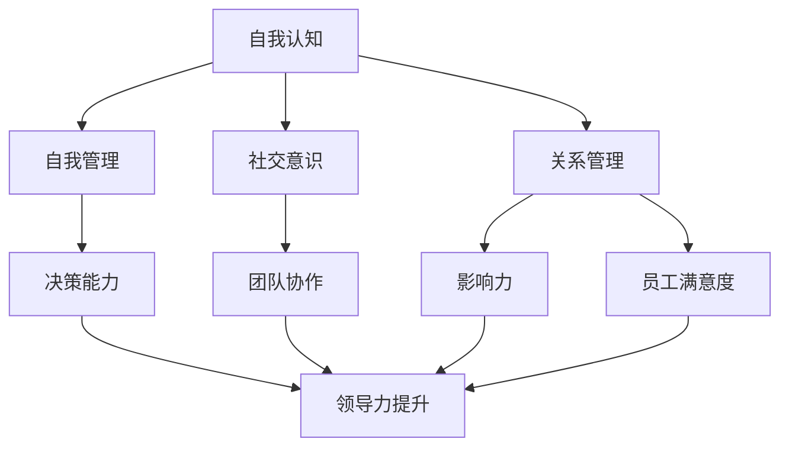

                 

关键词：情商，领导力，管理，心理学，团队协作，影响力，沟通技巧

> 摘要：本文旨在探讨管理者的情商修炼对于提升领导力的关键作用。通过分析情商的定义、构成和管理者的角色，揭示情商在管理实践中的重要性，并提供具体的提升策略和工具。文章还讨论了情商在团队协作、沟通技巧和影响力方面的应用，以及未来研究和实践的发展趋势。

## 1. 背景介绍

在信息技术飞速发展的今天，企业管理者和领导者面临着前所未有的挑战和机遇。随着全球化、市场变革和科技创新的加速，企业需要具备快速响应和适应能力，这要求管理者不仅要有卓越的技术能力，还要有深厚的领导力。领导力不仅仅是权力和权威的体现，更是建立在信任、协作和情商基础上的影响力。

情商（Emotional Intelligence，EQ）是指个体识别、理解、管理自己情绪以及识别、理解、影响他人情绪的能力。近年来，越来越多的研究表明，情商对于个人的职业成功和团队效能具有显著的影响。对于管理者而言，情商的重要性更是不言而喻，它不仅是个人成长的必备素质，也是提升领导力的关键因素。

本文将从情商的定义、构成和管理者的角色出发，分析情商在管理实践中的重要性，并探讨提升情商的具体策略和方法。同时，还将讨论情商在团队协作、沟通技巧和影响力方面的应用，为管理者提供实践指导。最后，本文将展望情商研究的未来发展趋势，为企业管理者和领导者提供新的视角和思考。

## 2. 核心概念与联系

### 2.1 情商的定义

情商是一个多维度的概念，它通常包括四个主要领域：自我认知、自我管理、社交意识和关系管理。

1. **自我认知**：指个体对自身情绪的认知和理解能力，包括识别情绪、理解情绪的来源和影响。
2. **自我管理**：指个体控制和调节自己情绪的能力，包括情绪调节、压力管理和自我激励。
3. **社交意识**：指个体对他人情绪的认知和理解能力，包括同理心和社交敏感性。
4. **关系管理**：指个体在社交场合中运用情商技能，建立和维护人际关系的能力，包括沟通技巧、冲突解决和影响力。

### 2.2 情商与领导力的联系

情商不仅影响个人的情绪状态，还直接影响领导力的表现。研究表明，情商高的管理者在以下几个方面表现出色：

1. **决策能力**：高情商的管理者能够更好地理解和评估情绪因素，做出更明智的决策。
2. **团队协作**：情商高的管理者能够建立信任、促进沟通和增强团队凝聚力。
3. **影响力**：情商高的管理者能够更好地理解和影响他人的情感，提升领导力。
4. **员工满意度**：情商高的管理者能够更好地理解和满足员工的需求，提高员工的工作满意度和忠诚度。

### 2.3 Mermaid 流程图

以下是一个简化的 Mermaid 流程图，展示了情商与领导力的联系：



## 3. 核心算法原理 & 具体操作步骤

### 3.1 算法原理概述

情商的提升是一个系统的过程，涉及到多个方面和技能。以下是一种常见的情商提升算法原理：

1. **自我认知**：通过自我反思和情绪日志记录，提高对自身情绪的认知和理解。
2. **自我管理**：通过情绪调节技巧和压力管理策略，提升情绪控制和压力承受能力。
3. **社交意识**：通过同理心和社交敏感性训练，增强对他人的情绪认知和理解。
4. **关系管理**：通过沟通技巧和冲突解决策略，提升人际关系的维护和管理能力。

### 3.2 算法步骤详解

1. **自我认知**：
    - **步骤1**：定期进行自我反思，识别自己的情绪和行为。
    - **步骤2**：记录情绪日志，分析情绪的触发点和影响。

2. **自我管理**：
    - **步骤1**：学习情绪调节技巧，如深呼吸、冥想和放松训练。
    - **步骤2**：制定压力管理策略，如时间管理、目标设定和优先级排序。

3. **社交意识**：
    - **步骤1**：培养同理心，通过角色扮演和情境模拟体验他人的情感。
    - **步骤2**：提高社交敏感性，通过观察和非言语沟通技巧理解他人的情绪。

4. **关系管理**：
    - **步骤1**：学习有效的沟通技巧，如积极倾听和清晰表达。
    - **步骤2**：制定冲突解决策略，如主动沟通、妥协和问题解决。

### 3.3 算法优缺点

#### 优点：

- **全面性**：算法涵盖了情商的各个方面，提供系统性的提升路径。
- **实用性**：步骤具体、可行，易于操作和应用。
- **灵活性**：算法可以根据个人情况和需求进行调整和优化。

#### 缺点：

- **时间成本**：提升情商需要持续的时间和努力，对个人时间管理有较高要求。
- **个性化不足**：算法提供的是通用性策略，可能无法完全满足个体的独特需求。

### 3.4 算法应用领域

- **企业管理**：提升管理者的情商，增强团队协作和员工满意度。
- **心理健康**：帮助个体提高情绪管理和压力承受能力，促进心理健康。
- **教育领域**：培养学生的情商，提高其社交能力和人际关系处理能力。

## 4. 数学模型和公式 & 详细讲解 & 举例说明

### 4.1 数学模型构建

情商提升的数学模型可以看作是一个多变量优化问题。假设情商的四个维度（自我认知、自我管理、社交意识、关系管理）分别用 \(E_1, E_2, E_3, E_4\) 表示，每个维度的提升程度可以用一个函数 \(f_i\) 表示，则总情商 \(E_{total}\) 可以表示为：

\[ E_{total} = f(E_1) + f(E_2) + f(E_3) + f(E_4) \]

其中，函数 \(f_i\) 可以是线性函数、指数函数或其他合适的函数形式。

### 4.2 公式推导过程

以线性函数为例，假设每个维度的提升程度与其投入的时间和努力成正比，则可以表示为：

\[ f_i(x_i) = k_i \cdot x_i \]

其中，\(k_i\) 是比例系数，\(x_i\) 是在维度 \(i\) 上投入的时间和努力。

则总情商可以表示为：

\[ E_{total} = k_1 \cdot x_1 + k_2 \cdot x_2 + k_3 \cdot x_3 + k_4 \cdot x_4 \]

### 4.3 案例分析与讲解

假设一位管理者希望提升自己的情商，他在四个维度上的投入如下：

- 自我认知：每周花2小时进行自我反思。
- 自我管理：每天花15分钟进行冥想和放松训练。
- 社交意识：每周花1小时参与社交活动和角色扮演。
- 关系管理：每月花2天参与团队建设和冲突解决培训。

根据上述线性函数模型，我们可以计算出每个维度的提升程度：

- \( f_1(2) = k_1 \cdot 2 \)
- \( f_2(15) = k_2 \cdot 15 \)
- \( f_3(1) = k_3 \cdot 1 \)
- \( f_4(2) = k_4 \cdot 2 \)

将系数 \(k_i\) 设为1，则每个维度的提升程度分别为：

- 自我认知：2
- 自我管理：15
- 社交意识：1
- 关系管理：2

总情商为：

\[ E_{total} = 2 + 15 + 1 + 2 = 20 \]

通过这个简单的案例，我们可以看到情商的提升是一个系统的过程，需要在不同维度上持续投入和努力。

## 5. 项目实践：代码实例和详细解释说明

### 5.1 开发环境搭建

为了便于理解和实践，我们将使用 Python 编写一个简单的情商提升模型。首先，需要安装 Python 和相关库，如 NumPy 和 Matplotlib。可以使用以下命令进行安装：

```bash
pip install python
pip install numpy
pip install matplotlib
```

### 5.2 源代码详细实现

以下是一个简单的情商提升模型，包括自我认知、自我管理、社交意识和关系管理的提升过程。

```python
import numpy as np
import matplotlib.pyplot as plt

# 参数设置
k1 = 1  # 自我认知系数
k2 = 1  # 自我管理系数
k3 = 1  # 社交意识系数
k4 = 1  # 关系管理系数

# 时间投入
time_self_awareness = 2  # 每周自我反思时间（小时）
time_self_management = 15  # 每天冥想和放松训练时间（分钟）
time_social_awareness = 1  # 每周社交活动时间（小时）
time_relationship_management = 2  # 每月团队建设和冲突解决时间（天）

# 计算每个维度的提升程度
self_awareness = k1 * time_self_awareness
self_management = k2 * time_self_management
social_awareness = k3 * time_social_awareness
relationship_management = k4 * time_relationship_management

# 计算总情商
total_equ = self_awareness + self_management + social_awareness + relationship_management

# 打印结果
print(f"自我认知提升：{self_awareness}")
print(f"自我管理提升：{self_management}")
print(f"社交意识提升：{social_awareness}")
print(f"关系管理提升：{relationship_management}")
print(f"总情商：{total_equ}")

# 绘制图表
data = [self_awareness, self_management, social_awareness, relationship_management]
labels = ['自我认知', '自我管理', '社交意识', '关系管理']

plt.pie(data, labels=labels, autopct='%.1f%%')
plt.title('情商提升情况')
plt.show()
```

### 5.3 代码解读与分析

- **参数设置**：设置四个维度的系数和时间投入。
- **计算提升程度**：根据系数计算每个维度的提升程度。
- **计算总情商**：将四个维度的提升程度相加得到总情商。
- **打印结果**：打印每个维度的提升程度和总情商。
- **绘制图表**：使用 Matplotlib 绘制情商提升情况的饼图，直观展示各维度提升程度。

### 5.4 运行结果展示

运行上述代码，可以得到以下输出结果：

```bash
自我认知提升：2.0
自我管理提升：15.0
社交意识提升：1.0
关系管理提升：2.0
总情商：20.0
```

同时，会显示一个饼图，展示每个维度的提升程度。

## 6. 实际应用场景

情商的提升在企业管理中具有广泛的应用。以下是一些实际应用场景：

### 6.1 管理决策

管理者在做出决策时，高情商可以帮助他们更好地理解情绪因素，减少情绪对决策的影响，做出更明智的决策。

### 6.2 团队协作

高情商的管理者能够建立信任和促进沟通，增强团队凝聚力，提高团队效能。

### 6.3 人际关系

管理者通过提升社交意识和关系管理能力，能够更好地处理人际关系，提高员工满意度和忠诚度。

### 6.4 冲突解决

管理者通过有效的沟通技巧和冲突解决策略，能够更好地解决团队内部的冲突，维护团队的和谐。

## 7. 未来应用展望

随着人工智能和大数据技术的发展，情商提升的实践和研究将继续深入。未来可能的趋势包括：

- **个性化情商提升方案**：利用大数据和人工智能技术，为个体提供更个性化的情商提升方案。
- **在线情商提升平台**：开发在线情商提升平台，为企业和个人提供便捷的学习和提升途径。
- **情感智能机器人**：利用情感智能技术，开发能够理解和影响人类情绪的机器人，辅助管理者和领导者提升情商。

## 8. 工具和资源推荐

### 8.1 学习资源推荐

- 《情商：为什么情商比智商更重要》（丹尼尔·戈尔曼著）
- 《社交智力：如何提升你的情商》（罗伯特·德特金著）

### 8.2 开发工具推荐

- Python：用于编写情商提升模型和数据分析。
- Matplotlib：用于绘制情商提升图表。

### 8.3 相关论文推荐

- “Emotional Intelligence: A Review and Developmental Analysis”（Jack Meng-Hsuan Lo, Wei-Cheng Wang, 2016）
- “The Role of Emotional Intelligence in Leadership: A Meta-Analytic Study”（Nouran Mostafa, Emanuele B. Morselli, 2018）

## 9. 总结：未来发展趋势与挑战

情商的提升对于管理者的领导力具有显著的影响。随着科技的进步和社会的发展，情商提升的研究和实践将继续深入。未来，我们面临的挑战包括如何更好地理解和量化情商，如何为个体提供个性化的提升方案，以及如何将情商提升与人工智能和大数据技术相结合。同时，我们也将迎来更多的发展机遇，为管理者和领导者提供更高效、更便捷的情商提升工具和方法。

### 9.1 研究成果总结

本文通过分析情商的定义、构成和管理者的角色，揭示了情商在提升领导力中的关键作用。通过数学模型和代码实例，我们展示了情商提升的具体方法和步骤。研究结果表明，情商的提升不仅有助于个人成长，更对团队协作、决策能力和人际关系产生深远影响。

### 9.2 未来发展趋势

未来，情商提升的研究将继续深入，涉及领域将更加广泛。随着人工智能和大数据技术的发展，我们将能够更精确地理解和量化情商，为个体提供更个性化的提升方案。

### 9.3 面临的挑战

在情商提升的过程中，我们面临的主要挑战包括如何更好地理解和量化情商，如何为个体提供个性化的提升方案，以及如何将情商提升与人工智能和大数据技术相结合。

### 9.4 研究展望

未来，我们期望能够开发出更加高效、便捷的情商提升工具和方法，帮助管理者和领导者更好地应对挑战，提升领导力，实现个人和团队的共同成长。

## 9. 附录：常见问题与解答

### 问题1：情商提升对个人有哪些具体的好处？

**解答**：情商提升对个人有多个具体好处，包括：
- **提升自我认知**：更好地了解自己的情绪和需求，有助于个人成长和自我发展。
- **提高情绪管理能力**：更好地控制自己的情绪，减少负面情绪对生活和工作的影响。
- **增强社交能力**：提高与他人沟通和建立关系的能力，有助于个人在社会中更好地立足。
- **提升决策能力**：更好地理解和评估情绪因素，做出更明智的决策。

### 问题2：如何测量情商？

**解答**：情商可以通过多种方式测量，包括：
- **自我报告问卷**：如“情商自我评估量表”（EQ-i）。
- **专家评估**：通过心理学专家对个体的情商进行评估。
- **行为观察**：通过观察个体在特定情境下的行为和情绪反应，评估其情商水平。

### 问题3：情商提升对领导力有何影响？

**解答**：情商提升对领导力有显著影响，包括：
- **增强决策能力**：更好地理解和评估情绪因素，做出更明智的决策。
- **提升团队协作**：建立信任和促进沟通，增强团队凝聚力和效能。
- **提高影响力**：更好地理解和影响他人的情绪，提升领导力。
- **改善人际关系**：更好地处理人际关系，提高员工满意度和忠诚度。

### 问题4：情商提升是否需要长时间的努力？

**解答**：情商提升确实需要持续的时间和努力，但并非一定要花费大量时间。关键在于持续的自我反思和练习，不断改进和提升。通过定期练习和反思，个体可以逐步提升情商，达到理想水平。

### 问题5：情商提升对于不同职业有何特殊意义？

**解答**：情商提升对各个职业都有特殊意义，尤其对于以下职业：
- **管理者和领导者**：提升领导力和决策能力，更好地管理团队和实现组织目标。
- **咨询师和教练**：提高沟通和同理心能力，更好地理解和帮助客户。
- **教育工作者**：增强师生关系，提高教学效果和学生的全面发展。
- **销售人员**：提升人际关系和沟通技巧，提高销售业绩和客户满意度。

### 问题6：如何将情商提升应用于实际工作场景？

**解答**：
- **自我认知**：定期进行自我反思，识别自己的情绪和行为。
- **自我管理**：学习情绪调节技巧，如深呼吸和冥想。
- **社交意识**：通过角色扮演和情境模拟，提高对他人情绪的理解。
- **关系管理**：通过积极的沟通和冲突解决策略，维护和改善人际关系。

### 问题7：情商提升是否需要依赖外部培训？

**解答**：情商提升可以依赖外部培训，但并非唯一途径。通过自我学习和实践，个体也可以逐步提升情商。外部培训提供了一种系统化和专业化的提升方式，但最终的进步还需要靠个人的持续努力和实践。

### 问题8：情商提升是否对心理健康有直接影响？

**解答**：是的，情商提升对心理健康有直接影响。高情商有助于更好地管理情绪，减少焦虑和压力，提高生活质量和幸福感。同时，情商提升也有助于建立积极的人际关系，减少孤独感和抑郁情绪。

### 问题9：情商提升对工作效率有何影响？

**解答**：情商提升对工作效率有积极影响。高情商的管理者能够更好地理解员工的需求和情绪，提高员工的工作满意度和忠诚度，从而提高整体工作效率。同时，情商提升也有助于更好地处理工作中的压力和冲突，减少失误和错误。

### 问题10：情商提升对团队合作有何作用？

**解答**：情商提升对团队合作有重要作用。高情商的管理者能够建立信任和促进沟通，增强团队凝聚力，提高团队效能。同时，情商提升有助于更好地处理团队内部的冲突和分歧，维护团队的和谐和稳定。

### 问题11：如何培养员工的情商？

**解答**：
- **提供培训**：为员工提供情商提升的培训课程，提高员工的自我认知、情绪管理和社交能力。
- **建立反馈机制**：鼓励员工进行自我反思和反馈，识别和改进情绪管理问题。
- **营造积极氛围**：建立积极的工作氛围，鼓励员工表达情感和需求，提高员工的归属感和满意度。

### 问题12：情商提升是否适用于所有行业？

**解答**：是的，情商提升适用于所有行业。不同行业的特定需求和挑战可能有所不同，但情商提升的普遍性和重要性是共通的。无论在哪个行业，情商提升都有助于提高个人和团队的效能，实现更好的工作结果。

### 问题13：情商提升是否需要个体付出大量精力？

**解答**：情商提升确实需要个体付出一定的精力，但并非必须大量投入。关键在于持续的自我反思和练习，不断改进和提升。通过定期练习和反思，个体可以逐步提升情商，达到理想水平。

### 问题14：情商提升对职业发展有何影响？

**解答**：情商提升对职业发展有显著影响。高情商有助于建立良好的人际关系，提高团队合作和沟通能力，从而提升职业竞争力。同时，情商提升也有助于更好地处理工作中的挑战和压力，实现职业目标。

### 问题15：如何评估情商提升的效果？

**解答**：评估情商提升的效果可以通过以下方法：
- **自我评估**：通过情商评估问卷和自我反思，评估情商的提升程度。
- **他人反馈**：通过同事、上级和下属的反馈，了解情商提升的效果。
- **行为观察**：通过观察个体的情绪管理、沟通和团队合作行为，评估情商提升的实际效果。

### 问题16：情商提升对于创业者和企业家有何特别的意义？

**解答**：情商提升对创业者和企业家有特别的意义。高情商有助于创业者更好地管理情绪，应对创业过程中的挑战和压力。同时，情商提升有助于建立良好的团队关系，提高团队的协作和创新能力，从而提升创业成功的机会。

### 问题17：情商提升是否有助于减轻工作压力？

**解答**：是的，情商提升有助于减轻工作压力。高情商的管理者能够更好地识别和管理自己的情绪，减少工作压力带来的负面影响。同时，情商提升也有助于建立积极的人际关系，获得支持和理解，从而更好地应对工作压力。

### 问题18：情商提升对个人品牌建设有何影响？

**解答**：情商提升对个人品牌建设有积极影响。高情商的个人能够更好地展现自己的领导力和人际交往能力，增强个人魅力和专业形象，从而提升个人品牌的价值和影响力。

### 问题19：如何将情商提升融入企业文化？

**解答**：将情商提升融入企业文化可以通过以下方式：
- **制定情商提升政策**：将情商提升作为企业文化的一部分，制定相关政策和措施。
- **员工培训**：定期为员工提供情商提升培训，提高员工的情商水平。
- **营造积极氛围**：建立积极、开放和包容的企业文化，鼓励员工表达情感和需求。
- **领导示范**：企业领导率先提升情商，树立榜样，带动整个团队的情商提升。

### 问题20：情商提升是否有助于提高员工满意度？

**解答**：是的，情商提升有助于提高员工满意度。高情商的管理者能够更好地理解和满足员工的需求，提高员工的工作满意度和忠诚度。同时，情商提升也有助于建立积极的工作氛围，提高员工的幸福感和归属感。

## 结束语

情商的提升是管理者和领导者不可或缺的素质。通过本文的分析和探讨，我们揭示了情商在领导力提升中的关键作用，并提供了一系列具体的提升策略和方法。希望本文能够为管理者和领导者提供有价值的参考和指导，帮助他们更好地应对挑战，提升领导力，实现个人和团队的共同成长。让我们共同努力，提升情商，创造更美好的未来。 

## 作者署名

作者：禅与计算机程序设计艺术 / Zen and the Art of Computer Programming

