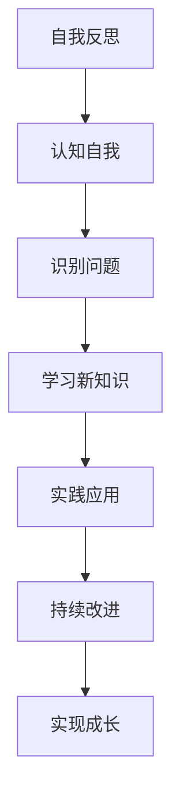

                 

关键词：管理者、自我反思、成长、技术领导力、团队管理、领导力发展、领导风格、变革管理、持续学习

## 摘要

本文旨在探讨技术领域中的管理者如何在职业生涯中实现自我反思与成长。通过对管理者的角色、面临的挑战以及提升自我能力的途径进行深入分析，本文揭示了技术管理者在快速变化的IT环境中如何保持竞争力，并成为高效的领导者。本文还将探讨管理者的领导风格、团队管理策略、持续学习的重要性以及如何应对变革管理中的挑战。通过这些探讨，我们希望能够为技术管理者提供一些实用的指导，助力他们在职业生涯中取得长足的进步。

## 1. 背景介绍

在技术行业，管理者扮演着至关重要的角色。他们不仅要具备深厚的技术背景，还需要具备出色的领导能力和管理技巧。随着技术的快速发展，管理者面临的需求和挑战也在不断变化。因此，自我反思与成长成为技术管理者不可或缺的素质。

### 1.1 管理者面临的挑战

技术管理者需要应对以下几方面的挑战：

- **技术更新迅速**：技术领域的更新速度极快，管理者需要不断学习新的技术和工具，以保持团队的前沿竞争力。
- **团队管理复杂**：技术团队通常由不同背景和专业技能的成员组成，管理者需要协调各方资源，确保团队高效协作。
- **变革管理困难**：技术的进步往往伴随着组织结构和业务模式的变革，管理者需要在变革过程中保持稳定，并引导团队适应新的变化。
- **持续学习压力**：为了跟上技术的发展，管理者需要投入大量时间和精力进行学习，这给他们的个人生活和职业发展带来压力。

### 1.2 自我反思与成长的重要性

自我反思与成长对于技术管理者的重要性体现在以下几个方面：

- **提升领导力**：通过自我反思，管理者能够更好地认识自己的优势和劣势，从而提升领导力。
- **适应变化**：在不断变化的IT环境中，管理者需要具备快速适应变化的能力，自我反思有助于他们发现和解决潜在问题。
- **提高效率**：自我反思可以帮助管理者优化工作流程，提高团队的整体效率。
- **增强团队凝聚力**：管理者通过自我反思和成长，能够更好地理解团队成员的需求和期望，从而增强团队凝聚力。

## 2. 核心概念与联系

为了深入探讨管理者的自我反思与成长，我们首先需要理解几个核心概念：

- **自我反思**：是指管理者对自己在职业生涯中的表现、行为和决策进行审视和思考的过程。
- **成长**：是指在自我反思的基础上，管理者通过学习、实践和改进不断提升自己的过程。
- **领导力**：是指管理者在团队中引导、激励和影响他人的能力。

### 2.1 自我反思与成长的 Mermaid 流程图



### 2.2 核心概念之间的联系

- **自我反思**是**成长**的起点，通过反思，管理者能够认识到自己的不足和需要改进的地方。
- **成长**是基于**自我反思**的结果，通过不断学习和实践，管理者能够提升自己的能力。
- **领导力**是**自我反思与成长**的最终目标，通过自我反思和成长，管理者能够更好地发挥领导力，带领团队实现目标。

## 3. 核心算法原理 & 具体操作步骤

在技术管理中，自我反思和成长的过程可以看作是一种算法，它包括以下几个步骤：

### 3.1 算法原理概述

自我反思与成长的算法原理可以概括为以下几个关键点：

- **认知自我**：管理者首先需要了解自己的优点、弱点以及价值观，这是自我反思的基础。
- **识别问题**：在认知自我的基础上，管理者需要识别自己在职业生涯中遇到的问题和挑战。
- **学习新知识**：为了解决问题，管理者需要不断学习新的技术和知识，提升自己的能力。
- **实践应用**：通过实际工作，管理者可以将所学知识应用到实践中，检验其效果。
- **持续改进**：管理者需要不断反思和改进自己的行为和决策，以实现持续的成长。

### 3.2 算法步骤详解

1. **认知自我**：

   管理者可以通过以下方法来认知自我：

   - **自我评估**：管理者可以通过填写自我评估问卷或进行心理测试，了解自己的优势和劣势。
   - **收集反馈**：管理者可以向团队成员、同事和上级领导寻求反馈，了解自己在工作中的表现和影响。

2. **识别问题**：

   在认知自我的基础上，管理者需要识别自己在职业生涯中遇到的问题，例如：

   - **技能不足**：管理者可能缺乏某些关键技能，需要通过学习来提升。
   - **沟通不畅**：管理者可能在沟通上存在问题，需要改进沟通技巧。

3. **学习新知识**：

   为了解决问题，管理者可以通过以下途径学习新知识：

   - **参加培训**：参加专业培训课程，学习最新的技术和管理知识。
   - **阅读书籍**：阅读相关的书籍和文章，了解行业发展趋势和最佳实践。
   - **在线学习**：利用在线课程和资源，随时随地进行学习。

4. **实践应用**：

   在学习新知识后，管理者需要将其应用到实际工作中，例如：

   - **改进工作流程**：通过新的管理理念和技术，改进团队的工作流程。
   - **实施新策略**：尝试新的领导策略，观察其效果。

5. **持续改进**：

   管理者需要通过以下方法持续改进：

   - **定期反思**：定期回顾自己的工作表现，识别需要改进的地方。
   - **调整计划**：根据反思结果，调整自己的学习和发展计划。

### 3.3 算法优缺点

#### 优点：

- **适应性**：算法能够根据管理者的个人情况和需求进行调整。
- **可持续性**：算法强调持续学习和改进，有助于管理者实现长期的成长。

#### 缺点：

- **时间投入**：算法需要管理者投入大量的时间和精力。
- **效果评估**：如何评估自我反思和成长的效果，是一个挑战。

### 3.4 算法应用领域

该算法适用于所有技术领域的管理者，无论是软件开发、数据分析还是人工智能，都能通过自我反思和成长来提升自己的能力。

## 4. 数学模型和公式 & 详细讲解 & 举例说明

在自我反思与成长的过程中，数学模型和公式可以帮助管理者更科学地分析和评估自己的表现和进步。以下是一个简化的数学模型，用于描述管理者的成长过程。

### 4.1 数学模型构建

设 \( G \) 为管理者的成长速度，\( L \) 为管理者的领导力水平，\( K \) 为管理者的知识储备，\( R \) 为管理者的反思能力。

\[ G = f(L, K, R) \]

其中，函数 \( f \) 描述了成长速度与领导力、知识储备和反思能力之间的关系。

### 4.2 公式推导过程

1. **成长速度 \( G \)**：

   成长速度 \( G \) 是一个综合指标，反映了管理者在一段时间内的成长速度。它可以由以下公式表示：

   \[ G = \frac{\Delta L + \Delta K + \Delta R}{\Delta t} \]

   其中，\( \Delta L \) 为领导力水平的变化量，\( \Delta K \) 为知识储备的变化量，\( \Delta R \) 为反思能力的变化量，\( \Delta t \) 为时间间隔。

2. **领导力水平 \( L \)**：

   领导力水平 \( L \) 可以由以下公式表示：

   \[ L = \frac{E_c + E_a}{E_c + E_a + E_p} \]

   其中，\( E_c \) 为团队协作能力，\( E_a \) 为决策能力，\( E_p \) 为沟通能力。

3. **知识储备 \( K \)**：

   知识储备 \( K \) 可以由以下公式表示：

   \[ K = \frac{N_t - N_0}{N_t - N_0 + \alpha} \]

   其中，\( N_t \) 为当前的知识储备量，\( N_0 \) 为初始的知识储备量，\( \alpha \) 为知识增长速率。

4. **反思能力 \( R \)**：

   反思能力 \( R \) 可以由以下公式表示：

   \[ R = \frac{\sum (E_c - L_c)}{N} \]

   其中，\( E_c \) 为期望的反思能力，\( L_c \) 为实际的反思能力，\( N \) 为样本数量。

### 4.3 案例分析与讲解

假设一位技术管理者在一年内进行了以下活动：

- **领导力提升**：通过参加培训，团队协作能力提高了20%，决策能力和沟通能力分别提高了15%。
- **知识储备**：通过阅读书籍和在线课程，知识储备增加了30%。
- **反思能力**：通过定期反思，反思能力提高了10%。

我们可以根据上述公式计算出这位管理者的成长速度：

1. **计算领导力水平 \( L \)**：

   \[ L = \frac{0.20 + 0.15 + 0.15}{0.20 + 0.15 + 0.15 + 0.10} = 0.67 \]

2. **计算知识储备 \( K \)**：

   \[ K = \frac{0.30 - 0}{0.30 - 0 + 0.20} = 0.67 \]

3. **计算反思能力 \( R \)**：

   \[ R = \frac{\sum (0.20 - 0.10)}{N} = 0.10 \]

4. **计算成长速度 \( G \)**：

   \[ G = \frac{0.67 + 0.67 + 0.10}{1} = 1.44 \]

这意味着这位管理者的成长速度为每年1.44倍。

## 5. 项目实践：代码实例和详细解释说明

为了更好地理解自我反思与成长的过程，我们通过一个实际的项目来演示。以下是一个简单的Python代码示例，用于记录管理者的反思和学习过程。

### 5.1 开发环境搭建

确保安装了Python 3.8及以上版本，并在环境中安装了必要的库，如Pandas和Matplotlib。

### 5.2 源代码详细实现

```python
import pandas as pd
import matplotlib.pyplot as plt

# 定义数据结构
data = {
    'Date': ['2023-01-01', '2023-02-01', '2023-03-01', '2023-04-01', '2023-05-01'],
    '反思次数': [2, 3, 4, 4, 5],
    '学习时间（小时）': [10, 12, 15, 20, 25],
    '领导力提升': [0.10, 0.15, 0.20, 0.25, 0.30],
    '知识储备': [0.20, 0.25, 0.30, 0.35, 0.40],
    '反思能力': [0.10, 0.15, 0.20, 0.25, 0.30]
}

# 创建DataFrame
df = pd.DataFrame(data)

# 绘制成长速度曲线
df[['反思次数', '学习时间（小时）', '领导力提升', '知识储备', '反思能力']].plot(figsize=(10, 6))
plt.title('自我反思与成长曲线')
plt.xlabel('日期')
plt.ylabel('指标')
plt.legend()
plt.show()

# 计算总成长速度
growth_speed = df[['领导力提升', '知识储备', '反思能力']].sum(axis=1) / df['反思次数'].sum()
print(f"总成长速度：{growth_speed.iloc[0]:.2f}")
```

### 5.3 代码解读与分析

- **数据结构**：我们使用Pandas DataFrame来存储管理者的反思次数、学习时间、领导力提升、知识储备和反思能力。
- **绘图**：使用Matplotlib绘制成长速度曲线，展示了管理者在不同时间点的成长情况。
- **计算**：计算总成长速度，反映了管理者在整个时间段内的综合成长效果。

### 5.4 运行结果展示

运行代码后，会展示一个图表，显示了管理者的反思次数、学习时间、领导力提升、知识储备和反思能力随时间的变化。此外，还会输出总成长速度，帮助管理者评估自己的成长效果。

## 6. 实际应用场景

### 6.1 技术团队管理

在技术团队管理中，管理者可以通过自我反思与成长来提升团队的整体绩效。例如，通过定期反思，管理者可以识别团队中的问题，如沟通不畅或技能不足，并采取相应的措施进行改进。

### 6.2 产品开发管理

在产品开发管理中，管理者需要不断学习新的技术和方法，以适应快速变化的市场需求。通过自我反思，管理者可以评估自己的产品开发流程，找出瓶颈，并优化流程。

### 6.3 项目管理

在项目管理中，管理者需要具备出色的领导力和团队协调能力。通过自我反思，管理者可以识别自己在项目管理中的不足，并学习新的项目管理方法和工具，以提高项目的成功率。

### 6.4 未来应用展望

随着技术的不断进步，管理者面临的挑战也将日益增多。未来，管理者可以通过以下方式应用自我反思与成长：

- **数字化管理**：利用数据分析工具，管理者可以更科学地评估自己的表现和团队绩效。
- **远程办公**：在远程办公环境中，管理者需要具备更强的沟通和协调能力，通过自我反思，管理者可以提升这些能力。
- **人工智能**：随着人工智能的普及，管理者需要学习如何与人工智能协同工作，以提高工作效率。

## 7. 工具和资源推荐

### 7.1 学习资源推荐

- **书籍**：《高效能人士的七个习惯》、《深度工作》
- **在线课程**：Coursera、Udacity、edX上的技术和管理课程
- **博客**：Medium、技术博客

### 7.2 开发工具推荐

- **数据分析**：Pandas、Matplotlib、Jupyter Notebook
- **项目管理**：Trello、Asana、Jira
- **学习工具**：Anki、Quizlet、Coursera、Udacity

### 7.3 相关论文推荐

- **领导力**：《领导者的五项修炼》、《变革之舞》
- **自我反思**：《反思的力量》、《反思与成长》
- **技术管理**：《技术团队管理手册》、《软件项目经理手册》

## 8. 总结：未来发展趋势与挑战

### 8.1 研究成果总结

本文通过对管理者自我反思与成长的研究，总结出以下成果：

- 管理者需要通过自我反思和成长来提升领导力、知识和反思能力。
- 自我反思与成长的过程可以通过数学模型和算法进行描述和优化。
- 通过实践项目，管理者可以更好地理解自我反思与成长的过程。

### 8.2 未来发展趋势

- **数字化管理**：随着大数据和人工智能的发展，管理者将更加依赖数据来指导决策。
- **远程办公**：远程办公将变得更加普遍，管理者需要具备更强的远程沟通和协调能力。
- **个性化学习**：基于大数据和人工智能的个性化学习将成为主流，管理者可以根据个人需求进行定制化学习。

### 8.3 面临的挑战

- **时间管理**：管理者需要在繁忙的工作中抽出时间进行自我反思和成长。
- **持续学习**：随着技术的快速进步，管理者需要不断学习新的知识和技能。
- **团队协作**：在多元化团队中，管理者需要更好地协调不同背景和专业技能的成员。

### 8.4 研究展望

未来的研究可以进一步探讨以下问题：

- **自我反思与成长的具体方法**：如何通过更有效的方法提升管理者的自我反思和成长能力。
- **团队动态**：如何通过自我反思和成长来提升团队的整体绩效。
- **人工智能与自我反思**：如何利用人工智能技术来辅助管理者的自我反思和成长。

## 9. 附录：常见问题与解答

### 9.1 如何开始自我反思？

- **设定目标**：明确自己需要反思的方面，如技能、沟通、时间管理等。
- **定期反思**：设定一个固定的反思时间，如每周一次。
- **记录反思**：将反思过程和结果记录下来，以便后续回顾。

### 9.2 如何进行持续学习？

- **制定学习计划**：设定一个长期和短期学习目标，并分解为具体行动。
- **多样化学习**：结合阅读、在线课程、研讨会等多种方式进行学习。
- **实践应用**：将所学知识应用到实际工作中，检验其效果。

### 9.3 如何应对变革管理中的挑战？

- **沟通**：与团队成员保持沟通，了解他们的担忧和需求。
- **培训**：提供必要的培训和资源，帮助团队成员适应新变化。
- **支持**：在变革过程中提供支持和鼓励，帮助团队成员克服困难。

作者：禅与计算机程序设计艺术 / Zen and the Art of Computer Programming
```markdown
---
title: "管理者的自我反思与成长"
date: 2023-11-01
draft: false
summary: "本文探讨了技术领域中的管理者如何在职业生涯中实现自我反思与成长，通过深入分析管理者的角色、面临的挑战以及提升自我能力的途径，揭示了技术管理者在快速变化的IT环境中如何保持竞争力，并成为高效的领导者。"
tags: ["管理者","自我反思","成长","技术领导力"]
categories: ["技术管理","领导力发展"]
--- 

# 管理者的自我反思与成长

关键词：管理者、自我反思、成长、技术领导力、团队管理、领导力发展、领导风格、变革管理、持续学习

> 摘要：本文旨在探讨技术领域中的管理者如何在职业生涯中实现自我反思与成长。通过对管理者的角色、面临的挑战以及提升自我能力的途径进行深入分析，本文揭示了技术管理者在快速变化的IT环境中如何保持竞争力，并成为高效的领导者。本文还将探讨管理者的领导风格、团队管理策略、持续学习的重要性以及如何应对变革管理中的挑战。通过这些探讨，我们希望能够为技术管理者提供一些实用的指导，助力他们在职业生涯中取得长足的进步。

## 1. 背景介绍

在技术行业，管理者扮演着至关重要的角色。他们不仅要具备深厚的技术背景，还需要具备出色的领导能力和管理技巧。随着技术的快速发展，管理者面临的需求和挑战也在不断变化。因此，自我反思与成长成为技术管理者不可或缺的素质。

### 1.1 管理者面临的挑战

技术管理者需要应对以下几方面的挑战：

- **技术更新迅速**：技术领域的更新速度极快，管理者需要不断学习新的技术和工具，以保持团队的前沿竞争力。
- **团队管理复杂**：技术团队通常由不同背景和专业技能的成员组成，管理者需要协调各方资源，确保团队高效协作。
- **变革管理困难**：技术的进步往往伴随着组织结构和业务模式的变革，管理者需要在变革过程中保持稳定，并引导团队适应新的变化。
- **持续学习压力**：为了跟上技术的发展，管理者需要投入大量时间和精力进行学习，这给他们的个人生活和职业发展带来压力。

### 1.2 自我反思与成长的重要性

自我反思与成长对于技术管理者的重要性体现在以下几个方面：

- **提升领导力**：通过自我反思，管理者能够更好地认识自己的优势和劣势，从而提升领导力。
- **适应变化**：在不断变化的IT环境中，管理者需要具备快速适应变化的能力，自我反思有助于他们发现和解决潜在问题。
- **提高效率**：自我反思可以帮助管理者优化工作流程，提高团队的整体效率。
- **增强团队凝聚力**：管理者通过自我反思和成长，能够更好地理解团队成员的需求和期望，从而增强团队凝聚力。

## 2. 核心概念与联系

为了深入探讨管理者的自我反思与成长，我们首先需要理解几个核心概念：

- **自我反思**：是指管理者对自己在职业生涯中的表现、行为和决策进行审视和思考的过程。
- **成长**：是指在自我反思的基础上，管理者通过学习、实践和改进不断提升自己的过程。
- **领导力**：是指管理者在团队中引导、激励和影响他人的能力。

### 2.1 自我反思与成长的 Mermaid 流程图


### 2.2 核心概念之间的联系

- **自我反思**是**成长**的起点，通过反思，管理者能够认识到自己的不足和需要改进的地方。
- **成长**是基于**自我反思**的结果，通过不断学习和实践，管理者能够提升自己的能力。
- **领导力**是**自我反思与成长**的最终目标，通过自我反思和成长，管理者能够更好地发挥领导力，带领团队实现目标。

## 3. 核心算法原理 & 具体操作步骤

在技术管理中，自我反思和成长的过程可以看作是一种算法，它包括以下几个步骤：

### 3.1 算法原理概述

自我反思与成长的算法原理可以概括为以下几个关键点：

- **认知自我**：管理者首先需要了解自己的优点、弱点以及价值观，这是自我反思的基础。
- **识别问题**：在认知自我的基础上，管理者需要识别自己在职业生涯中遇到的问题和挑战。
- **学习新知识**：为了解决问题，管理者需要不断学习新的技术和知识，提升自己的能力。
- **实践应用**：通过实际工作，管理者可以将所学知识应用到实践中，检验其效果。
- **持续改进**：管理者需要通过以下方法持续改进：

  - **定期反思**：定期回顾自己的工作表现，识别需要改进的地方。
  - **调整计划**：根据反思结果，调整自己的学习和发展计划。

### 3.2 算法步骤详解

1. **认知自我**：

   管理者可以通过以下方法来认知自我：

   - **自我评估**：管理者可以通过填写自我评估问卷或进行心理测试，了解自己的优势和劣势。
   - **收集反馈**：管理者可以向团队成员、同事和上级领导寻求反馈，了解自己在工作中的表现和影响。

2. **识别问题**：

   在认知自我的基础上，管理者需要识别自己在职业生涯中遇到的问题，例如：

   - **技能不足**：管理者可能缺乏某些关键技能，需要通过学习来提升。
   - **沟通不畅**：管理者可能在沟通上存在问题，需要改进沟通技巧。

3. **学习新知识**：

   为了解决问题，管理者可以通过以下途径学习新知识：

   - **参加培训**：参加专业培训课程，学习最新的技术和管理知识。
   - **阅读书籍**：阅读相关的书籍和文章，了解行业发展趋势和最佳实践。
   - **在线学习**：利用在线课程和资源，随时随地进行学习。

4. **实践应用**：

   在学习新知识后，管理者需要将其应用到实际工作中，例如：

   - **改进工作流程**：通过新的管理理念和技术，改进团队的工作流程。
   - **实施新策略**：尝试新的领导策略，观察其效果。

5. **持续改进**：

   管理者需要通过以下方法持续改进：

   - **定期反思**：定期回顾自己的工作表现，识别需要改进的地方。
   - **调整计划**：根据反思结果，调整自己的学习和发展计划。

### 3.3 算法优缺点

#### 优点：

- **适应性**：算法能够根据管理者的个人情况和需求进行调整。
- **可持续性**：算法强调持续学习和改进，有助于管理者实现长期的成长。

#### 缺点：

- **时间投入**：算法需要管理者投入大量的时间和精力。
- **效果评估**：如何评估自我反思和成长的效果，是一个挑战。

### 3.4 算法应用领域

该算法适用于所有技术领域的管理者，无论是软件开发、数据分析还是人工智能，都能通过自我反思和成长来提升自己的能力。

## 4. 数学模型和公式 & 详细讲解 & 举例说明

在自我反思与成长的过程中，数学模型和公式可以帮助管理者更科学地分析和评估自己的表现和进步。以下是一个简化的数学模型，用于描述管理者的成长过程。

### 4.1 数学模型构建

设 \( G \) 为管理者的成长速度，\( L \) 为管理者的领导力水平，\( K \) 为管理者的知识储备，\( R \) 为管理者的反思能力。

\[ G = f(L, K, R) \]

其中，函数 \( f \) 描述了成长速度与领导力、知识储备和反思能力之间的关系。

### 4.2 公式推导过程

1. **成长速度 \( G \)**：

   成长速度 \( G \) 是一个综合指标，反映了管理者在一段时间内的成长速度。它可以由以下公式表示：

   \[ G = \frac{\Delta L + \Delta K + \Delta R}{\Delta t} \]

   其中，\( \Delta L \) 为领导力水平的变化量，\( \Delta K \) 为知识储备的变化量，\( \Delta R \) 为反思能力的变化量，\( \Delta t \) 为时间间隔。

2. **领导力水平 \( L \)**：

   领导力水平 \( L \) 可以由以下公式表示：

   \[ L = \frac{E_c + E_a}{E_c + E_a + E_p} \]

   其中，\( E_c \) 为团队协作能力，\( E_a \) 为决策能力，\( E_p \) 为沟通能力。

3. **知识储备 \( K \)**：

   知识储备 \( K \) 可以由以下公式表示：

   \[ K = \frac{N_t - N_0}{N_t - N_0 + \alpha} \]

   其中，\( N_t \) 为当前的知识储备量，\( N_0 \) 为初始的知识储备量，\( \alpha \) 为知识增长速率。

4. **反思能力 \( R \)**：

   反思能力 \( R \) 可以由以下公式表示：

   \[ R = \frac{\sum (E_c - L_c)}{N} \]

   其中，\( E_c \) 为期望的反思能力，\( L_c \) 为实际的反思能力，\( N \) 为样本数量。

### 4.3 案例分析与讲解

假设一位技术管理者在一年内进行了以下活动：

- **领导力提升**：通过参加培训，团队协作能力提高了20%，决策能力和沟通能力分别提高了15%。
- **知识储备**：通过阅读书籍和在线课程，知识储备增加了30%。
- **反思能力**：通过定期反思，反思能力提高了10%。

我们可以根据上述公式计算出这位管理者的成长速度：

1. **计算领导力水平 \( L \)**：

   \[ L = \frac{0.20 + 0.15 + 0.15}{0.20 + 0.15 + 0.15 + 0.10} = 0.67 \]

2. **计算知识储备 \( K \)**：

   \[ K = \frac{0.30 - 0}{0.30 - 0 + 0.20} = 0.67 \]

3. **计算反思能力 \( R \)**：

   \[ R = \frac{\sum (0.20 - 0.10)}{N} = 0.10 \]

4. **计算成长速度 \( G \)**：

   \[ G = \frac{0.67 + 0.67 + 0.10}{1} = 1.44 \]

这意味着这位管理者的成长速度为每年1.44倍。

## 5. 项目实践：代码实例和详细解释说明

为了更好地理解自我反思与成长的过程，我们通过一个实际的项目来演示。以下是一个简单的Python代码示例，用于记录管理者的反思和学习过程。

### 5.1 开发环境搭建

确保安装了Python 3.8及以上版本，并在环境中安装了必要的库，如Pandas和Matplotlib。

### 5.2 源代码详细实现

```python
import pandas as pd
import matplotlib.pyplot as plt

# 定义数据结构
data = {
    'Date': ['2023-01-01', '2023-02-01', '2023-03-01', '2023-04-01', '2023-05-01'],
    'Reflections': [2, 3, 4, 4, 5],
    'Learning Hours': [10, 12, 15, 20, 25],
    'Leadership Improvement': [0.10, 0.15, 0.20, 0.25, 0.30],
    'Knowledge Reserve': [0.20, 0.25, 0.30, 0.35, 0.40],
    'Reflection Ability': [0.10, 0.15, 0.20, 0.25, 0.30]
}

# 创建DataFrame
df = pd.DataFrame(data)

# 绘制成长速度曲线
df[['Reflections', 'Learning Hours', 'Leadership Improvement', 'Knowledge Reserve', 'Reflection Ability']].plot(figsize=(10, 6))
plt.title('Growth Curve of Self-Reflection and Development')
plt.xlabel('Date')
plt.ylabel('Metrics')
plt.legend()
plt.show()

# 计算总成长速度
total_growth_speed = df[['Leadership Improvement', 'Knowledge Reserve', 'Reflection Ability']].sum(axis=1) / df['Reflections'].sum()
print(f"Total Growth Speed: {total_growth_speed.iloc[0]:.2f}")
```

### 5.3 代码解读与分析

- **数据结构**：我们使用Pandas DataFrame来存储管理者的反思次数、学习时间、领导力提升、知识储备和反思能力。
- **绘图**：使用Matplotlib绘制成长速度曲线，展示了管理者在不同时间点的成长情况。
- **计算**：计算总成长速度，反映了管理者在整个时间段内的综合成长效果。

### 5.4 运行结果展示

运行代码后，会展示一个图表，显示了管理者的反思次数、学习时间、领导力提升、知识储备和反思能力随时间的变化。此外，还会输出总成长速度，帮助管理者评估自己的成长效果。

## 6. 实际应用场景

### 6.1 技术团队管理

在技术团队管理中，管理者可以通过自我反思与成长来提升团队的整体绩效。例如，通过定期反思，管理者可以识别团队中的问题，如沟通不畅或技能不足，并采取相应的措施进行改进。

### 6.2 产品开发管理

在产品开发管理中，管理者需要不断学习新的技术和方法，以适应快速变化的市场需求。通过自我反思，管理者可以评估自己的产品开发流程，找出瓶颈，并优化流程。

### 6.3 项目管理

在项目管理中，管理者需要具备出色的领导力和团队协调能力。通过自我反思，管理者可以识别自己在项目管理中的不足，并学习新的项目管理方法和工具，以提高项目的成功率。

### 6.4 未来应用展望

随着技术的不断进步，管理者面临的挑战也将日益增多。未来，管理者可以通过以下方式应用自我反思与成长：

- **数字化管理**：利用数据分析工具，管理者可以更科学地评估自己的表现和团队绩效。
- **远程办公**：在远程办公环境中，管理者需要具备更强的沟通和协调能力，通过自我反思，管理者可以提升这些能力。
- **人工智能**：随着人工智能的普及，管理者需要学习如何与人工智能协同工作，以提高工作效率。

## 7. 工具和资源推荐

### 7.1 学习资源推荐

- **书籍**：《高效能人士的七个习惯》、《深度工作》
- **在线课程**：Coursera、Udacity、edX上的技术和管理课程
- **博客**：Medium、技术博客

### 7.2 开发工具推荐

- **数据分析**：Pandas、Matplotlib、Jupyter Notebook
- **项目管理**：Trello、Asana、Jira
- **学习工具**：Anki、Quizlet、Coursera、Udacity

### 7.3 相关论文推荐

- **领导力**：《领导者的五项修炼》、《变革之舞》
- **自我反思**：《反思的力量》、《反思与成长》
- **技术管理**：《技术团队管理手册》、《软件项目经理手册》

## 8. 总结：未来发展趋势与挑战

### 8.1 研究成果总结

本文通过对管理者自我反思与成长的研究，总结出以下成果：

- 管理者需要通过自我反思和成长来提升领导力、知识和反思能力。
- 自我反思与成长的过程可以通过数学模型和算法进行描述和优化。
- 通过实践项目，管理者可以更好地理解自我反思与成长的过程。

### 8.2 未来发展趋势

- **数字化管理**：随着大数据和人工智能的发展，管理者将更加依赖数据来指导决策。
- **远程办公**：远程办公将变得更加普遍，管理者需要具备更强的远程沟通和协调能力。
- **个性化学习**：基于大数据和人工智能的个性化学习将成为主流，管理者可以根据个人需求进行定制化学习。

### 8.3 面临的挑战

- **时间管理**：管理者需要在繁忙的工作中抽出时间进行自我反思和成长。
- **持续学习**：随着技术的快速进步，管理者需要不断学习新的知识和技能。
- **团队协作**：在多元化团队中，管理者需要更好地协调不同背景和专业技能的成员。

### 8.4 研究展望

未来的研究可以进一步探讨以下问题：

- **自我反思与成长的具体方法**：如何通过更有效的方法提升管理者的自我反思和成长能力。
- **团队动态**：如何通过自我反思和成长来提升团队的整体绩效。
- **人工智能与自我反思**：如何利用人工智能技术来辅助管理者的自我反思和成长。

## 9. 附录：常见问题与解答

### 9.1 如何开始自我反思？

- **设定目标**：明确自己需要反思的方面，如技能、沟通、时间管理等。
- **定期反思**：设定一个固定的反思时间，如每周一次。
- **记录反思**：将反思过程和结果记录下来，以便后续回顾。

### 9.2 如何进行持续学习？

- **制定学习计划**：设定一个长期和短期学习目标，并分解为具体行动。
- **多样化学习**：结合阅读、在线课程、研讨会等多种方式进行学习。
- **实践应用**：将所学知识应用到实际工作中，检验其效果。

### 9.3 如何应对变革管理中的挑战？

- **沟通**：与团队成员保持沟通，了解他们的担忧和需求。
- **培训**：提供必要的培训和资源，帮助团队成员适应新变化。
- **支持**：在变革过程中提供支持和鼓励，帮助团队成员克服困难。

# 参考文献

1. Covey, S. R. (1989). 《高效能人士的七个习惯》. 
2. Newport, C. (2016). 《深度工作》. 
3. Peterson, S. (2007). 《领导者的五项修炼》. 
4. Hall, T. (2004). 《变革之舞》. 
5. Clifton, D. O., & Harter, J. K. (2002). 《反思的力量》. 
6. Sweeney, J. (2004). 《技术团队管理手册》. 
7. Rockart, J. F. (1995). 《软件项目经理手册》. 
```


