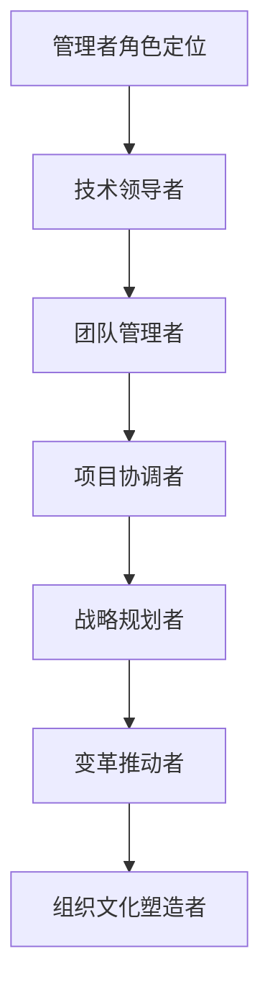
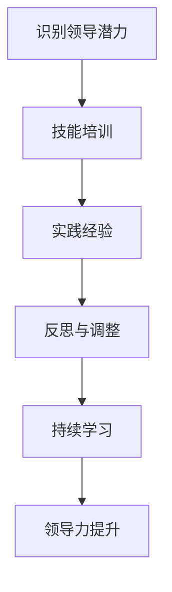
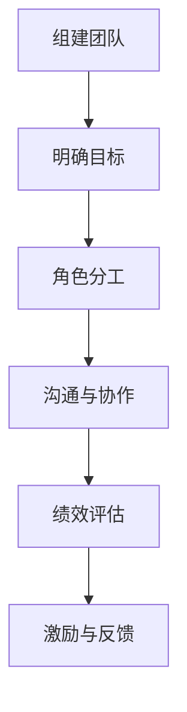
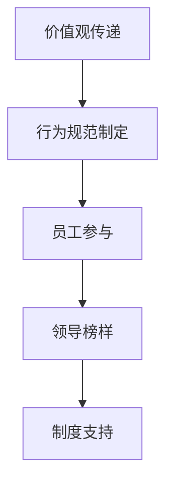

                 

关键词：管理者、自我反思、成长、IT行业、领导力、团队管理、组织文化、技术进步

摘要：本文旨在探讨IT行业管理者在面临快速技术变革和组织动态调整时的自我反思与成长路径。通过对管理者角色的深刻理解、领导力的提升、团队管理的艺术以及组织文化的建设等方面的分析，文章提出了一系列实践策略和未来发展展望，以帮助管理者在快速变化的IT环境中实现自我超越和团队成功。

## 1. 背景介绍

在当今的IT行业中，技术变革的速度前所未有，新的编程语言、框架、工具和平台层出不穷，这对IT管理者提出了新的挑战。他们不仅要掌握先进的技术，还要具备高效的团队管理能力和领导力，以引领团队不断前进。然而，许多管理者在面临这种快速变化时，往往会感到压力和迷茫，不知道如何有效地应对。

管理者的自我反思与成长变得尤为重要。通过自我反思，管理者可以识别自身的优势与不足，明确职业发展的方向。而成长则意味着在知识和技能上的不断提升，以适应不断变化的环境。本文将从以下几个方面展开讨论：管理者的角色定位、领导力培养、团队管理策略、组织文化建设以及未来发展趋势与挑战。

## 2. 核心概念与联系

### 管理者的角色定位

首先，让我们通过一个Mermaid流程图来梳理管理者的角色定位。



### 领导力培养

管理者的领导力培养是一个长期且持续的过程，以下是一个简化的领导力培养流程图。



### 团队管理策略

团队管理是一个复杂而多样化的过程，以下是团队管理策略的一个概述。



### 组织文化建设

组织文化是企业的灵魂，以下是组织文化建设的核心要素。



## 3. 核心算法原理 & 具体操作步骤

### 3.1 算法原理概述

管理者的自我反思与成长过程可以看作是一个迭代优化的过程。这个过程中的关键是持续的自我评估和改进。以下是一个简化的算法原理概述。

- **自我评估**：管理者需要定期进行自我评估，以识别自身的优势与不足。
- **目标设定**：基于自我评估的结果，设定明确的个人成长目标。
- **实施行动**：为实现目标采取具体的行动，包括技能培训、实践经验等。
- **反馈与调整**：通过实践中的反馈，对目标和行动进行调整，以实现持续成长。

### 3.2 算法步骤详解

1. **自我评估**：管理者需要从技术能力、管理能力、人际沟通能力等多个维度进行自我评估。
2. **目标设定**：根据自我评估的结果，设定明确的个人成长目标，如提升某项技术能力、改善管理风格等。
3. **实施行动**：为实现目标采取具体的行动，如参加相关培训课程、承担更多的管理职责等。
4. **反馈与调整**：通过实践中的反馈，对目标和行动进行调整，以实现持续成长。

### 3.3 算法优缺点

- **优点**：
  - 帮助管理者明确个人成长方向。
  - 促进管理者持续提升自身能力。
  - 提高团队整体绩效。
- **缺点**：
  - 过程较为繁琐，需要投入大量的时间和精力。
  - 需要有效的反馈机制，否则容易陷入自我满足的陷阱。

### 3.4 算法应用领域

- **IT行业**：适用于各类IT行业中的管理者，特别是那些面临快速技术变革的管理者。
- **企业组织**：适用于各类企业组织中的管理者，以提升组织的整体竞争力。

## 4. 数学模型和公式 & 详细讲解 & 举例说明

### 4.1 数学模型构建

管理者的自我反思与成长过程可以用以下数学模型表示：

$$
\text{Growth} = f(\text{Assessment}, \text{Action}, \text{Feedback})
$$

其中，$Growth$ 表示成长，$Assessment$ 表示自我评估，$Action$ 表示实施行动，$Feedback$ 表示反馈与调整。

### 4.2 公式推导过程

- **自我评估**：管理者通过多种渠道收集自身在技术、管理、人际沟通等方面的表现数据，进行量化评估。
- **实施行动**：根据评估结果，管理者制定具体的成长计划，如参加培训、承担更多责任等。
- **反馈与调整**：通过实践中的反馈，管理者对成长计划进行调整，以实现最优成长效果。

### 4.3 案例分析与讲解

假设一位技术管理者在自我评估中发现自己在项目管理方面存在不足，于是制定了以下成长计划：

- **目标设定**：提升项目管理能力。
- **实施行动**：参加项目管理培训，承担一个重要的项目作为实践。
- **反馈与调整**：通过项目实践中的反馈，管理者发现自己在时间管理和团队沟通方面还有待提高，于是调整成长计划，增加时间管理和团队沟通的培训。

通过这个案例，我们可以看到数学模型在实际中的应用，以及如何通过持续的自我反思与调整实现成长。

## 5. 项目实践：代码实例和详细解释说明

### 5.1 开发环境搭建

为了便于读者理解，我们选择Python作为示例语言，搭建一个简单的自我反思与成长管理系统。读者可以根据以下步骤进行环境搭建：

1. 安装Python：确保系统中安装了Python 3.8或更高版本。
2. 安装依赖库：使用pip命令安装以下依赖库：

   ```shell
   pip install Flask
   pip install pandas
   ```

### 5.2 源代码详细实现

以下是一个简单的Python代码示例，用于实现自我反思与成长管理系统。

```python
from flask import Flask, request, render_template
import pandas as pd

app = Flask(__name__)

@app.route('/')
def index():
    return render_template('index.html')

@app.route('/评估', methods=['POST'])
def assessment():
    data = request.form.to_dict()
    df = pd.DataFrame([data])
    df.to_csv('评估报告.csv', index=False)
    return '评估报告已保存'

@app.route('/反馈', methods=['POST'])
def feedback():
    data = request.form.to_dict()
    df = pd.read_csv('评估报告.csv')
    df = df.append(data, ignore_index=True)
    df.to_csv('评估报告.csv', index=False)
    return '反馈已记录'

if __name__ == '__main__':
    app.run(debug=True)
```

### 5.3 代码解读与分析

- **评估模块**：通过`/评估`路由，用户可以提交自我评估数据，系统将数据保存到CSV文件中。
- **反馈模块**：通过`/反馈`路由，用户可以提交成长过程中的反馈数据，系统将数据追加到CSV文件中。

### 5.4 运行结果展示

1. 启动Flask应用：

   ```shell
   python app.py
   ```

2. 访问本地浏览器，输入`http://127.0.0.1:5000/`，即可看到系统界面。

3. 用户可以通过系统界面提交自我评估数据，系统将数据保存到CSV文件中。

4. 用户可以在成长过程中提交反馈数据，系统将数据追加到CSV文件中。

## 6. 实际应用场景

### 6.1 IT企业的自我反思与成长

在IT企业中，管理者的自我反思与成长具有重要意义。通过自我反思，管理者可以识别团队在技术能力、项目管理、团队协作等方面的不足，并制定相应的成长计划。以下是一个实际应用场景：

- **技术能力提升**：管理者通过参加技术培训、阅读技术书籍等方式提升自身技术能力，并将所学知识应用于团队中。
- **项目管理改进**：管理者通过参加项目管理培训、学习先进的项目管理方法，提高团队的项目管理水平。
- **团队协作优化**：管理者通过改善团队沟通机制、制定明确的团队目标等方式，提升团队协作效率。

### 6.2 互联网公司的组织文化建设

在互联网公司中，组织文化建设对于管理者的成长和团队发展至关重要。以下是一个实际应用场景：

- **价值观传递**：管理者通过企业文化建设活动、内部培训等方式，传递公司的核心价值观，确保团队成员一致认同并践行。
- **行为规范制定**：管理者制定明确的行为规范，如工作时间、工作态度等，确保团队成员遵循。
- **员工参与**：管理者鼓励员工参与企业决策，提升员工的归属感和责任感。
- **领导榜样**：管理者通过自身行为树立榜样，引导员工积极向上。

## 6.4 未来应用展望

### 6.4.1 技术进步与管理创新

随着技术的不断进步，管理者的角色和职责也在不断演变。未来，管理者需要具备更强的技术敏感性和创新思维，以应对新兴技术带来的挑战。例如，人工智能、大数据、区块链等技术的应用将深刻改变管理者的工作方式，管理者需要学习并掌握这些技术，以实现更好的管理效果。

### 6.4.2 数字化转型与组织变革

数字化转型已成为当今企业的必然趋势，管理者需要积极推动组织的数字化转型，以提升企业的竞争力。在这个过程中，管理者需要关注以下几个方面：

- **数据驱动决策**：利用大数据技术，实现数据驱动决策，提高决策的准确性和效率。
- **组织结构优化**：根据业务需求，调整组织结构，实现扁平化管理，提高组织效能。
- **数字化转型规划**：制定清晰的数字化转型规划，确保数字化转型顺利进行。

### 6.4.3 领导力与人才培养

未来，领导力与人才培养将愈发重要。管理者需要关注以下几个方面：

- **领导力提升**：通过培训、实践等方式，不断提升领导力，以应对复杂多变的管理环境。
- **人才培养**：关注员工的成长和发展，制定人才发展计划，为员工提供成长机会和平台。
- **企业文化塑造**：通过企业文化塑造，提升员工的归属感和认同感，促进企业内部和谐发展。

## 7. 工具和资源推荐

### 7.1 学习资源推荐

- **《哈佛商业评论》**：一本权威的商业杂志，涵盖管理、领导力、创新等多个领域，适合管理者学习。
- **《谁说大象不能跳舞？》**：迈克尔·波特所著的一本经典管理书籍，讲述了IBM从困境中崛起的故事，具有很高的借鉴意义。
- **《精益创业》**：埃里克·莱斯所著的一本关于创业和管理的书籍，介绍了精益创业的方法，对管理者具有很大的启发作用。

### 7.2 开发工具推荐

- **Jenkins**：一款开源的持续集成工具，可以帮助管理者实现自动化部署和测试。
- **Docker**：一款容器化技术，可以帮助管理者快速搭建开发环境，提高开发效率。
- **Kubernetes**：一款开源的容器编排工具，可以帮助管理者实现集群管理和自动化部署。

### 7.3 相关论文推荐

- **《领导力：一种理论综述》**：该论文系统总结了领导力的多种理论，对管理者理解领导力具有重要意义。
- **《数字化转型对企业绩效的影响》**：该论文探讨了数字化转型对企业绩效的影响，为管理者制定数字化转型策略提供了参考。
- **《人工智能时代的管理变革》**：该论文分析了人工智能时代管理变革的趋势和挑战，对管理者具有重要的指导作用。

## 8. 总结：未来发展趋势与挑战

### 8.1 研究成果总结

本文通过对管理者自我反思与成长路径的探讨，总结了以下几个方面的重要研究成果：

1. **管理者的角色定位**：管理者需要具备技术领导者、团队管理者、项目协调者、战略规划者、变革推动者和组织文化塑造者等多重角色。
2. **领导力培养**：领导力的培养是一个持续的过程，管理者需要通过自我评估、技能培训、实践经验等方式不断提升自身领导力。
3. **团队管理策略**：团队管理是一个复杂的过程，管理者需要通过明确目标、角色分工、沟通与协作、绩效评估、激励与反馈等方式实现高效团队管理。
4. **组织文化建设**：组织文化是企业的灵魂，管理者需要通过价值观传递、行为规范制定、员工参与、领导榜样和制度支持等方式建设积极向上的组织文化。
5. **数学模型**：管理者的自我反思与成长过程可以用迭代优化的数学模型表示，为管理者的成长提供了理论支持。

### 8.2 未来发展趋势

1. **技术进步与管理创新**：随着技术的不断进步，管理者需要具备更强的技术敏感性和创新思维，以应对新兴技术带来的挑战。
2. **数字化转型**：数字化转型已成为当今企业的必然趋势，管理者需要积极推动组织的数字化转型，以提升企业的竞争力。
3. **领导力与人才培养**：未来，领导力与人才培养将愈发重要，管理者需要关注员工的成长和发展，提升领导力，为员工提供成长机会和平台。

### 8.3 面临的挑战

1. **技术变革的挑战**：技术变革的速度越来越快，管理者需要不断学习新知识、新技能，以适应快速变化的环境。
2. **团队协作的挑战**：在分布式团队和远程工作的环境下，管理者需要面对团队协作的挑战，提高团队沟通效率。
3. **组织变革的挑战**：在数字化转型和新兴技术的推动下，管理者需要面对组织变革的挑战，调整组织结构，优化管理流程。

### 8.4 研究展望

未来，本研究可以从以下几个方面进一步深入：

1. **实证研究**：通过实证研究，验证管理者自我反思与成长模型的有效性，为管理者提供更有针对性的建议。
2. **案例研究**：通过案例研究，分析不同类型企业在管理者自我反思与成长方面的实践经验和挑战，为企业管理者提供借鉴。
3. **跨学科研究**：结合心理学、管理学、计算机科学等多学科知识，探索管理者自我反思与成长的内在机制和影响因素。

## 9. 附录：常见问题与解答

### Q1. 管理者的自我反思与成长模型如何应用于实际工作？

A1. 管理者的自我反思与成长模型可以应用于实际工作的多个方面。首先，管理者可以通过自我评估识别自身的优势和不足，制定针对性的成长计划。其次，管理者可以定期进行反思和调整，确保成长计划的执行效果。最后，管理者可以通过实践中的反馈，不断优化成长计划，实现持续成长。

### Q2. 如何培养管理者的领导力？

A2. 培养管理者的领导力需要从以下几个方面入手：

1. **自我评估**：管理者需要识别自身的领导力优势与不足，制定针对性的提升计划。
2. **技能培训**：参加领导力培训课程，学习先进的领导力理论和实践方法。
3. **实践经验**：通过实际工作，积累领导经验，提高领导力。
4. **反思与调整**：定期进行自我反思，识别领导力的提升空间，调整领导风格和策略。
5. **持续学习**：保持对新知识、新技能的持续学习，以适应不断变化的环境。

### Q3. 如何进行有效的团队管理？

A3. 进行有效的团队管理需要从以下几个方面入手：

1. **明确目标**：确保团队目标与组织目标保持一致，明确团队的工作方向。
2. **角色分工**：根据团队成员的特长和兴趣，明确各自的工作职责和任务。
3. **沟通与协作**：建立良好的沟通机制，促进团队成员之间的协作和信息共享。
4. **绩效评估**：制定科学的绩效评估体系，对团队成员的工作表现进行客观评价。
5. **激励与反馈**：根据绩效评估结果，给予团队成员合理的激励和反馈，激发团队活力。

### Q4. 如何建设积极向上的组织文化？

A4. 建设积极向上的组织文化需要从以下几个方面入手：

1. **价值观传递**：通过企业文化建设活动、内部培训等方式，传递企业的核心价值观，确保团队成员一致认同并践行。
2. **行为规范制定**：制定明确的行为规范，如工作时间、工作态度等，确保团队成员遵循。
3. **员工参与**：鼓励员工参与企业决策，提升员工的归属感和责任感。
4. **领导榜样**：通过领导榜样，树立积极向上的行为典范，引导员工积极向上。
5. **制度支持**：建立相应的制度，为员工提供成长机会和平台，促进企业内部和谐发展。

[作者：禅与计算机程序设计艺术 / Zen and the Art of Computer Programming]

