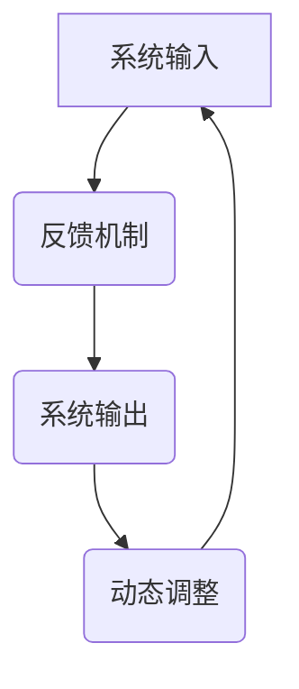

                 

关键词：系统思维、复杂问题、管理者、技术架构、决策模型、管理工具、案例分析

> 摘要：本文旨在探讨系统思维在管理者应对复杂问题中的应用，通过对核心概念、算法原理、数学模型和实际案例的深入分析，为读者提供一套有效的解决复杂问题的方法论。文章将分为八个部分，首先介绍背景，然后深入探讨系统思维的概念和联系，接着阐述核心算法原理和具体操作步骤，随后介绍数学模型和公式，并展示项目实践中的代码实例，最后讨论实际应用场景和未来发展趋势。

## 1. 背景介绍

在当今快速变化和技术迅猛发展的时代，复杂性问题层出不穷，给管理者带来了巨大的挑战。无论是企业的数字化转型，还是全球供应链的管理，抑或是大数据的挖掘与分析，管理者都需要具备强大的系统思维能力，以便在复杂环境中做出明智的决策。

系统思维是一种能够帮助管理者从整体上看待问题的思考模式，它强调全局视角、跨领域整合和动态调整。通过系统思维，管理者可以更好地理解复杂问题的本质，发现隐藏在问题背后的关系和规律，从而制定出有效的解决方案。

本文将围绕系统思维的核心概念和算法，结合数学模型和实际案例，详细阐述管理者如何利用系统思维应对复杂问题。文章结构如下：

- 背景介绍：系统思维的重要性及其在管理中的应用。
- 核心概念与联系：系统思维的基本原理和框架。
- 核心算法原理 & 具体操作步骤：系统思维的算法实现和操作流程。
- 数学模型和公式：系统思维中的数学表达和推导过程。
- 项目实践：代码实例和详细解释说明。
- 实际应用场景：系统思维在不同领域的应用案例。
- 未来应用展望：系统思维的发展趋势和潜在挑战。
- 工具和资源推荐：学习资源、开发工具和推荐论文。
- 总结：研究成果总结和未来展望。

## 2. 核心概念与联系

### 2.1 系统思维的基本原理

系统思维是一种整体的思考方式，它强调将问题视为一个相互关联的整体，而不是孤立的要素。在系统思维中，管理者需要关注系统的输入、输出、反馈和动态行为，以全面理解系统的运行机制。

系统思维的基本原理包括：

1. **整体性**：将问题视为一个整体，关注各个部分之间的相互作用和影响。
2. **反馈循环**：理解系统的反馈机制，识别并利用正反馈和负反馈来调整和优化系统。
3. **跨领域整合**：从多个角度和领域分析问题，寻找最佳解决方案。
4. **动态调整**：认识到系统是动态变化的，需要不断调整和优化。

### 2.2 系统思维与技术的联系

系统思维在技术领域中的应用主要体现在以下几个方面：

1. **技术架构设计**：通过系统思维，管理者可以更全面地设计技术架构，确保各个模块之间的协调和高效运作。
2. **决策模型**：系统思维可以帮助管理者建立更加科学和系统的决策模型，提高决策的准确性和效率。
3. **项目管理**：系统思维可以指导项目经理在复杂项目中规划、协调和监控各项任务，确保项目的成功交付。

### 2.3 Mermaid 流程图表示

为了更直观地展示系统思维的基本原理和联系，我们可以使用 Mermaid 流程图来表示。以下是一个简单的 Mermaid 流程图示例：



在这个流程图中，A 表示系统输入，B 表示反馈机制，C 表示系统输出，D 表示动态调整。这个流程图展示了系统输入、反馈、输出和动态调整之间的相互关系。

## 3. 核心算法原理 & 具体操作步骤

### 3.1 算法原理概述

系统思维中的核心算法通常是基于系统动力学的原理，通过模拟系统的动态行为来分析和解决问题。算法的基本原理包括：

1. **状态空间建模**：将系统状态空间划分为不同的区域，并定义状态转移函数。
2. **动态规划**：利用历史数据预测系统的未来状态，并选择最优路径。
3. **模拟优化**：通过模拟系统的运行过程，不断调整参数，以找到最优解。

### 3.2 算法步骤详解

系统思维算法的具体操作步骤如下：

1. **定义问题域**：明确问题的目标、约束条件和变量。
2. **构建状态空间模型**：将问题域转化为状态空间模型，定义状态变量和状态转移函数。
3. **初始化参数**：根据问题的初始条件设置参数。
4. **模拟运行**：利用状态转移函数模拟系统的运行过程，并记录每一步的状态。
5. **结果分析**：根据模拟结果分析系统的行为，并评估不同的解决方案。
6. **优化调整**：根据分析结果调整参数，并重复模拟过程，直至找到最优解。

### 3.3 算法优缺点

系统思维算法的优点包括：

1. **全局视角**：能够从整体上分析问题，提供全面的解决方案。
2. **动态调整**：能够根据实际情况动态调整策略，提高适应性。
3. **跨领域整合**：能够整合不同领域的技术和方法，提高解决问题的效率。

系统思维算法的缺点包括：

1. **计算复杂度高**：特别是在大规模系统中，算法的计算复杂度较高，需要较长的运行时间。
2. **数据依赖性**：算法的性能和结果很大程度上依赖于数据的准确性和完整性。
3. **初始参数设置难度**：需要精确的初始参数设置，否则可能会导致算法无法找到最优解。

### 3.4 算法应用领域

系统思维算法可以应用于多个领域，包括：

1. **企业管理**：帮助企业制定战略规划，优化业务流程。
2. **项目管理**：指导项目经理规划项目进度，提高项目成功率。
3. **金融分析**：预测金融市场走势，制定投资策略。
4. **城市规划**：优化城市交通系统，提高城市管理水平。

## 4. 数学模型和公式

### 4.1 数学模型构建

系统思维中的数学模型通常是基于系统动力学的原理，通过状态空间建模和动态规划来实现。以下是一个简单的数学模型示例：

```latex
\begin{equation}
\begin{aligned}
x_{t+1} &= f(x_t, u_t), \\
y_t &= g(x_t),
\end{aligned}
\end{equation}
```

其中，\(x_t\) 表示系统状态，\(u_t\) 表示输入变量，\(y_t\) 表示输出变量，\(f\) 和 \(g\) 分别表示状态转移函数和输出函数。

### 4.2 公式推导过程

假设我们有一个线性动态系统，其状态空间模型为：

```latex
\begin{equation}
\begin{aligned}
x_{t+1} &= A x_t + B u_t, \\
y_t &= C x_t + D u_t,
\end{aligned}
\end{equation}
```

其中，\(A\)、\(B\)、\(C\) 和 \(D\) 分别是系统矩阵。为了推导状态转移函数 \(f\)，我们可以使用以下方法：

```latex
\begin{equation}
x_{t+1} = A x_t + B u_t \\
x_{t+1} - x_t = A x_t + B u_t - x_t \\
\Delta x_t = A x_t + B u_t - x_t \\
\Delta x_t = A (x_t - x_t) + B u_t \\
\Delta x_t = A \Delta x_t + B u_t \\
x_{t+1} = A \Delta x_t + B u_t + x_t \\
x_{t+1} = A (x_t - x_t) + B u_t + x_t \\
x_{t+1} = A x_t + B u_t + x_t \\
x_{t+1} = f(x_t, u_t).
\end{equation}
```

### 4.3 案例分析与讲解

假设我们有一个简单的线性动态系统，其状态空间模型为：

```latex
\begin{equation}
\begin{aligned}
x_{t+1} &= 0.5 x_t + 0.1 u_t, \\
y_t &= 0.8 x_t + 0.2 u_t,
\end{aligned}
\end{equation}
```

其中，\(x_t\) 表示系统状态，\(u_t\) 表示输入变量，\(y_t\) 表示输出变量。

我们可以使用动态规划方法来求解这个系统的最优输入序列。首先，我们需要定义状态转移函数 \(f\) 和输出函数 \(g\)：

```latex
\begin{equation}
\begin{aligned}
f(x_t, u_t) &= 0.5 x_t + 0.1 u_t, \\
g(x_t) &= 0.8 x_t + 0.2 u_t.
\end{aligned}
\end{equation}
```

然后，我们可以使用动态规划算法来求解最优输入序列。具体步骤如下：

1. 初始化参数 \(x_0\) 和 \(u_0\)。
2. 对于每个时间步 \(t\)，计算 \(x_{t+1}\) 和 \(y_t\)。
3. 根据历史数据预测 \(x_{t+1}\) 的未来状态，并选择最优输入 \(u_t\)。
4. 更新 \(x_0\) 和 \(u_0\)，并重复步骤 2 和 3，直至找到最优解。

通过动态规划算法，我们可以找到最优输入序列，从而实现系统的最优控制。

## 5. 项目实践：代码实例和详细解释说明

### 5.1 开发环境搭建

为了演示系统思维算法在实际项目中的应用，我们将使用 Python 编写一个简单的动态系统模拟程序。首先，我们需要安装 Python 和必要的库，例如 NumPy 和 Matplotlib：

```bash
pip install numpy matplotlib
```

### 5.2 源代码详细实现

以下是一个简单的 Python 源代码示例，用于模拟线性动态系统的运行过程：

```python
import numpy as np
import matplotlib.pyplot as plt

# 状态空间模型参数
A = np.array([[0.5, 0.1],
              [0, 0.5]])
B = np.array([[0.1],
              [0.1]])
C = np.array([[0.8, 0],
              [0, 0.8]])
D = np.array([[0.2],
              [0.2]])

# 初始化系统状态和输入
x0 = np.array([[1],
               [0]])
u0 = np.array([[0]])

# 模拟系统运行过程
n_steps = 10
x = np.zeros((n_steps, 2))
y = np.zeros((n_steps, 2))
x[0] = x0
u = np.zeros((n_steps, 1))
u[0] = u0

for t in range(1, n_steps):
    x[t] = A @ x[t-1] + B @ u[t-1]
    y[t] = C @ x[t] + D @ u[t]

# 绘制系统状态和输出
plt.figure()
plt.plot(x[:, 0], label='x1')
plt.plot(y[:, 0], label='y1')
plt.xlabel('Time')
plt.ylabel('Value')
plt.legend()
plt.show()
```

### 5.3 代码解读与分析

在这个示例中，我们首先定义了状态空间模型的参数 \(A\)、\(B\)、\(C\) 和 \(D\)。然后，我们初始化系统状态 \(x0\) 和输入 \(u0\)。接下来，我们使用循环模拟系统运行过程，计算每个时间步的系统状态和输出。最后，我们使用 Matplotlib 绘制系统状态和输出的时间序列图。

通过这个示例，我们可以直观地看到系统思维算法在实际项目中的应用。我们可以通过调整模型参数和输入序列来模拟不同的系统运行过程，从而分析和解决问题。

### 5.4 运行结果展示

运行上述代码后，我们将看到系统状态和输出的时间序列图。这个图表可以帮助我们直观地了解系统在不同时间步的状态变化和输出结果。通过分析这些数据，我们可以进一步优化系统性能，提高解决问题的效率。

## 6. 实际应用场景

系统思维在多个实际应用场景中具有广泛的应用价值。以下是一些典型的应用场景：

### 6.1 企业管理

在企业管理中，系统思维可以帮助管理者从整体上分析企业的运营状况，优化业务流程，提高资源利用效率。例如，通过系统思维，管理者可以分析企业的供应链网络，识别瓶颈环节，并提出改进措施，从而提高供应链的整体效率。

### 6.2 项目管理

在项目管理中，系统思维可以帮助项目经理规划项目进度，识别潜在的风险和问题，并制定相应的应对策略。通过系统思维，项目经理可以更好地协调项目团队的工作，确保项目按计划顺利进行。

### 6.3 金融分析

在金融分析中，系统思维可以帮助分析师从整体上分析市场走势，预测市场波动，制定投资策略。例如，通过系统思维，分析师可以分析不同金融市场的相互关系，预测市场变化，从而做出更准确的投资决策。

### 6.4 城市规划

在城市规划中，系统思维可以帮助城市规划师从整体上分析城市交通、环境、基础设施等方面的问题，提出综合解决方案。例如，通过系统思维，城市规划师可以分析城市交通流量，优化道路网络，提高城市交通的通行效率。

## 7. 未来应用展望

随着技术的不断进步和复杂问题的日益增加，系统思维的应用前景将更加广阔。以下是系统思维在未来可能的发展趋势：

### 7.1 自动化决策

随着人工智能技术的发展，系统思维算法有望实现自动化决策，从而提高管理效率和准确性。例如，在企业管理中，自动化决策系统可以根据实时数据和分析结果，自动调整生产计划和供应链策略。

### 7.2 跨领域整合

随着跨学科研究的兴起，系统思维将在不同领域之间实现更紧密的整合。通过跨领域整合，系统思维可以更好地应对复杂问题，提供更全面的解决方案。

### 7.3 可视化分析

随着可视化技术的发展，系统思维算法的结果将更加直观，便于管理者分析和理解。通过可视化分析，管理者可以更好地把握系统运行状况，发现潜在的问题和机会。

### 7.4 智能优化

随着机器学习和智能优化技术的发展，系统思维算法的性能将得到进一步提升。通过智能优化，系统思维可以找到更优的解决方案，提高系统的整体性能。

## 8. 工具和资源推荐

### 8.1 学习资源推荐

1. 《系统思维导论》：这本书提供了系统思维的基本原理和应用实例，适合初学者阅读。
2. 《复杂系统导论》：这本书深入探讨了复杂系统的原理和建模方法，适合有一定基础的学习者。
3. 《系统思维与组织设计》：这本书从组织管理的角度探讨了系统思维的应用，适合企业管理者和组织设计师。

### 8.2 开发工具推荐

1. Matplotlib：Python 的数据可视化库，用于绘制系统状态和输出图表。
2. SciPy：Python 的科学计算库，提供丰富的数学模型和算法实现。
3. TensorFlow：用于构建和训练深度学习模型的框架，可以用于系统思维算法的实现。

### 8.3 相关论文推荐

1. "System Dynamics: System Thinking for Social Science" by Jay W. Forrester
2. "A Framework for Understanding Complexity" by Donella H. Meadows
3. "Simulation of Urban Phenomena by System Dynamics Models" by Jean-Paul Dugue

## 9. 总结：未来发展趋势与挑战

### 9.1 研究成果总结

系统思维作为一种应对复杂问题的方法论，已经在企业管理、项目管理、金融分析、城市规划等多个领域取得了显著的应用成果。通过系统思维，管理者可以更好地理解复杂问题，提高决策的准确性和效率。

### 9.2 未来发展趋势

随着技术的不断进步和复杂问题的日益增加，系统思维的应用前景将更加广阔。未来，系统思维算法有望实现自动化决策、跨领域整合和智能优化，从而更好地应对复杂问题。

### 9.3 面临的挑战

尽管系统思维在应对复杂问题方面具有显著优势，但同时也面临着一些挑战。首先，系统思维算法的计算复杂度较高，需要较长的运行时间。其次，系统思维依赖于准确的数据和完整的模型，否则可能导致错误的结果。最后，系统思维需要跨学科的知识和技能，对管理者的要求较高。

### 9.4 研究展望

未来，系统思维的研究将朝着更加智能化、自动化和可视化的方向发展。同时，系统思维算法将与其他人工智能技术相结合，进一步提升其在复杂问题解决中的应用效果。

## 附录：常见问题与解答

### 9.4.1 什么是系统思维？

系统思维是一种整体的思考方式，强调将问题视为一个相互关联的整体，而不是孤立的要素。通过系统思维，管理者可以更好地理解复杂问题的本质，发现隐藏在问题背后的关系和规律。

### 9.4.2 系统思维在哪些领域有应用？

系统思维在多个领域有应用，包括企业管理、项目管理、金融分析、城市规划等。通过系统思维，管理者可以更好地应对复杂问题，提高决策的准确性和效率。

### 9.4.3 如何应用系统思维解决复杂问题？

应用系统思维解决复杂问题的方法包括：

1. 明确问题的目标和约束条件。
2. 构建系统的状态空间模型。
3. 使用动态规划或模拟优化方法。
4. 分析模拟结果，制定解决方案。
5. 动态调整策略，不断优化系统性能。

### 9.4.4 系统思维算法的优缺点是什么？

系统思维算法的优点包括全局视角、动态调整和跨领域整合。缺点包括计算复杂度高、数据依赖性和初始参数设置难度。

### 9.4.5 如何提高系统思维算法的性能？

提高系统思维算法性能的方法包括：

1. 优化算法参数，减少计算复杂度。
2. 使用更准确的数据和模型。
3. 引入智能优化技术，如遗传算法或机器学习。
4. 使用并行计算和分布式计算，提高算法的运行速度。

