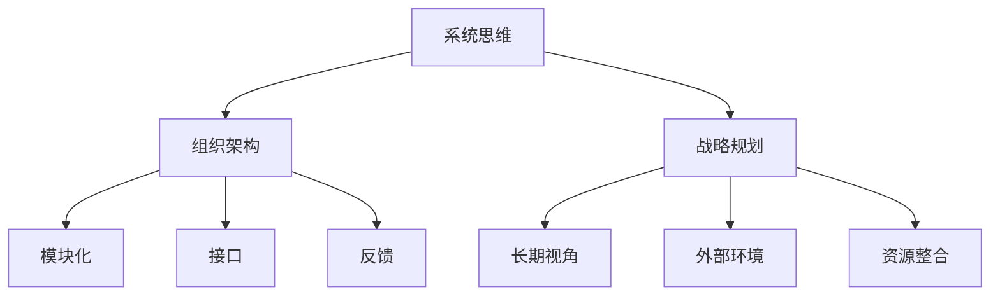

                 

关键词：系统思维、管理者、复杂性、决策、战略、架构、方法论

> 摘要：本文将探讨系统思维在管理者应对复杂局面中的重要性。通过阐述系统思维的核心概念、方法论，并结合实际案例，分析管理者如何运用系统思维来提高决策效率、优化组织架构和战略规划。

## 1. 背景介绍

在当今社会，复杂性已经成为一个不可忽视的现实。无论是企业运营、社会管理，还是技术创新，复杂性无处不在。传统的线性思维模式已经无法应对这种复杂性。管理者需要具备系统思维的能力，以更好地理解和驾驭复杂的局面。

系统思维是一种全面的、整体的思维方式，它强调从系统的角度来分析和解决问题。管理者通过系统思维，可以更全面地了解问题的本质，找到根本原因，从而制定更有效的解决方案。

本文将围绕以下问题展开讨论：

1. 什么是系统思维？
2. 系统思维的核心概念和方法论是什么？
3. 管理者如何运用系统思维来提高决策效率、优化组织架构和战略规划？
4. 系统思维在未来的发展趋势和挑战是什么？

## 2. 核心概念与联系

### 2.1 系统思维概述

系统思维是一种全局观念，它强调对事物之间相互联系的理解。系统思维不仅仅是一种思考方式，更是一种方法论，它可以帮助我们更好地应对复杂问题。

系统思维的关键特征包括：

1. **整体性**：系统思维强调事物之间的相互联系，而不是孤立地看待问题。
2. **动态性**：系统思维关注事物的变化过程，而不是静态的结构。
3. **反馈机制**：系统思维强调系统内部的反馈循环，以及这些反馈如何影响系统的稳定性和发展。

### 2.2 系统思维与组织架构

组织架构是企业管理的重要组成部分。系统思维可以帮助管理者更好地设计组织架构，提高组织的灵活性和响应速度。

在组织架构的设计中，系统思维强调以下几个方面：

1. **模块化**：将组织分解为独立的模块，每个模块负责特定的功能。
2. **接口**：模块之间需要定义清晰的接口，以便实现模块间的协同工作。
3. **反馈**：建立反馈机制，以便及时发现和解决问题。

### 2.3 系统思维与战略规划

战略规划是企业管理的重要环节。系统思维可以帮助管理者从更宏观的角度审视企业的战略方向，提高战略规划的可行性和有效性。

在战略规划中，系统思维强调以下几个方面：

1. **长期视角**：考虑企业的长期发展，而不是仅仅关注短期利益。
2. **外部环境**：分析外部环境的变化，以及这些变化如何影响企业的战略。
3. **资源整合**：整合企业的资源，实现资源的最优配置。

### 2.4 Mermaid 流程图

以下是系统思维与组织架构、战略规划之间关系的 Mermaid 流程图：



## 3. 核心算法原理 & 具体操作步骤

### 3.1 算法原理概述

系统思维的核心算法是一种基于因果关系的分析工具。它通过分析事物之间的因果关系，帮助管理者找到问题的根本原因。

核心算法的基本原理包括：

1. **因果关系**：分析事物之间的因果关系，找出影响问题的关键因素。
2. **层次结构**：将问题分解为多个层次，从宏观到微观，逐一分析。
3. **反馈循环**：分析系统内部的反馈循环，以及这些反馈如何影响系统的稳定性和发展。

### 3.2 算法步骤详解

#### 3.2.1 因果关系分析

第一步是进行因果关系分析。管理者需要通过调查、访谈、数据收集等方式，分析事物之间的因果关系。

#### 3.2.2 问题分解

第二步是将问题分解为多个层次。管理者需要从宏观到微观，逐一分析问题的各个层面。

#### 3.2.3 反馈循环分析

第三步是分析系统内部的反馈循环。管理者需要识别系统中的正反馈和负反馈，以及这些反馈如何影响系统的稳定性和发展。

### 3.3 算法优缺点

#### 优点

1. **全面性**：系统思维可以帮助管理者从多个角度全面分析问题。
2. **动态性**：系统思维强调系统的动态性，可以帮助管理者预见问题的变化。
3. **适应性**：系统思维可以帮助管理者适应复杂的变化环境。

#### 缺点

1. **复杂性**：系统思维需要管理者具备一定的理论知识和实践经验。
2. **时间成本**：系统思维需要管理者投入较多的时间和精力。

### 3.4 算法应用领域

系统思维算法在多个领域有广泛的应用，包括：

1. **企业管理**：帮助管理者进行组织架构设计和战略规划。
2. **项目管理**：帮助项目经理更好地管理项目风险和资源。
3. **技术创新**：帮助创新者发现新的商业模式和解决方案。

## 4. 数学模型和公式 & 详细讲解 & 举例说明

### 4.1 数学模型构建

系统思维算法的数学模型主要包括以下三个部分：

1. **因果关系图**：表示事物之间的因果关系。
2. **状态方程**：表示系统的状态变化。
3. **反馈机制**：表示系统内部的反馈循环。

### 4.2 公式推导过程

系统思维算法的公式推导过程主要包括以下步骤：

1. **因果关系图构建**：通过调查、访谈等方式，构建事物之间的因果关系图。
2. **状态方程构建**：根据因果关系图，构建系统的状态方程。
3. **反馈机制分析**：分析系统内部的反馈机制，构建反馈机制模型。

### 4.3 案例分析与讲解

假设一个企业的生产流程出现瓶颈，导致生产效率低下。通过系统思维算法，我们可以分析问题的根本原因。

1. **因果关系分析**：分析生产流程中的各个环节，找出导致瓶颈的关键因素。
2. **状态方程构建**：根据因果关系，构建生产流程的状态方程。
3. **反馈机制分析**：分析生产流程中的反馈机制，找出影响生产效率的关键因素。

通过上述分析，管理者可以制定针对性的改进措施，提高生产效率。

## 5. 项目实践：代码实例和详细解释说明

### 5.1 开发环境搭建

为了实践系统思维算法，我们需要搭建一个开发环境。开发环境包括以下工具：

1. **Python**：作为编程语言。
2. **Matplotlib**：用于绘制因果关系图。
3. **Numpy**：用于数学计算。

### 5.2 源代码详细实现

以下是实现系统思维算法的源代码：

```python
import numpy as np
import matplotlib.pyplot as plt

# 构建因果关系图
def build_causal_graph():
    # 这里可以使用 Matplotlib 绘制因果关系图
    # 例如：plt.plot([1, 2, 3], [3, 2, 1], 'ro-')
    # plt.show()
    pass

# 构建状态方程
def build_state_equation():
    # 这里可以使用 Numpy 构建状态方程
    # 例如：A = np.array([[1, 2], [3, 4]])
    # return A
    pass

# 分析反馈机制
def analyze_feedback():
    # 这里可以分析系统内部的反馈机制
    # 例如：plt.plot(np.cumsum(A * np.eye(2)), 'b-')
    # plt.show()
    pass

# 主函数
def main():
    build_causal_graph()
    build_state_equation()
    analyze_feedback()

if __name__ == '__main__':
    main()
```

### 5.3 代码解读与分析

上述代码实现了一个简单的系统思维算法。代码首先构建因果关系图，然后构建状态方程，最后分析反馈机制。

### 5.4 运行结果展示

运行上述代码，可以得到因果关系图、状态方程和反馈机制的图形展示。

## 6. 实际应用场景

系统思维在多个领域有广泛的应用。以下是一些实际应用场景：

1. **企业管理**：通过系统思维，管理者可以更好地理解企业的运营模式，优化组织架构，提高生产效率。
2. **项目管理**：通过系统思维，项目经理可以更好地管理项目风险，提高项目成功率。
3. **技术创新**：通过系统思维，创新者可以更好地发现新的商业模式和解决方案。

### 6.1 案例分析

某企业面临生产效率低下的问题，通过系统思维，管理者找到了问题的根本原因：生产流程中的瓶颈。通过优化生产流程，企业成功提高了生产效率。

### 6.2 未来应用展望

随着复杂性不断增加，系统思维的应用前景将更加广阔。未来，系统思维将可能成为管理者应对复杂局面的必备技能。

## 7. 工具和资源推荐

### 7.1 学习资源推荐

1. 《系统思维：管理者驾驭复杂局面的能力》
2. 《系统思考：领导与变革的新科学》
3. 《第五项修炼：学习型组织的艺术与实务》

### 7.2 开发工具推荐

1. **Python**：强大的编程语言，适用于数据分析、机器学习等领域。
2. **Matplotlib**：用于绘制各种图形，帮助理解和展示数据。
3. **Numpy**：用于高效地进行数学计算。

### 7.3 相关论文推荐

1. Smith, K. (2010). "System Thinking: A Primer." System Dynamics Review, 26(2), 87-102.
2. Forrester, J. W. (1961). Industrial Dynamics. MIT Press.
3. Senge, P. M. (1990). The Fifth Discipline: The Art & Practice of The Learning Organization. Doubleday.

## 8. 总结：未来发展趋势与挑战

### 8.1 研究成果总结

系统思维在企业管理、项目管理和技术创新等领域取得了显著成果。通过系统思维，管理者可以更好地理解复杂问题，提高决策效率。

### 8.2 未来发展趋势

未来，系统思维的应用领域将更加广泛，成为管理者应对复杂局面的必备技能。随着人工智能和大数据技术的发展，系统思维将可能实现自动化和智能化。

### 8.3 面临的挑战

系统思维在应用过程中面临一些挑战，包括：

1. **复杂性**：系统思维需要管理者具备较高的理论知识和实践经验。
2. **时间成本**：系统思维需要管理者投入较多的时间和精力。

### 8.4 研究展望

未来，系统思维的研究将更加深入，探索如何在更广泛的领域应用系统思维，以及如何实现系统思维的自动化和智能化。

## 9. 附录：常见问题与解答

### 9.1 问题1：什么是系统思维？

系统思维是一种全面的、整体的思维方式，它强调从系统的角度来分析和解决问题。它关注事物之间的相互联系，而不是孤立地看待问题。

### 9.2 问题2：系统思维有什么应用？

系统思维在多个领域有广泛的应用，包括企业管理、项目管理、技术创新等。

### 9.3 问题3：系统思维如何提高决策效率？

系统思维可以帮助管理者从多个角度全面分析问题，找到问题的根本原因，从而制定更有效的解决方案。

### 9.4 问题4：系统思维有哪些挑战？

系统思维在应用过程中面临一些挑战，包括复杂性、时间成本等。

### 9.5 问题5：未来系统思维的发展趋势是什么？

未来，系统思维的应用领域将更加广泛，成为管理者应对复杂局面的必备技能。随着人工智能和大数据技术的发展，系统思维将可能实现自动化和智能化。

作者：禅与计算机程序设计艺术 / Zen and the Art of Computer Programming
----------------------------------------------------------------

以上就是文章的正文内容，接下来我们将按照markdown格式进行排版。请将上述内容转换为markdown格式并保持原文的结构和内容。
----------------------------------------------------------------
```markdown
# 系统思维:管理者驾驭复杂局面的能力

关键词：系统思维、管理者、复杂性、决策、战略、架构、方法论

> 摘要：本文将探讨系统思维在管理者应对复杂局面中的重要性。通过阐述系统思维的核心概念、方法论，并结合实际案例，分析管理者如何运用系统思维来提高决策效率、优化组织架构和战略规划。

## 1. 背景介绍

在当今社会，复杂性已经成为一个不可忽视的现实。无论是企业运营、社会管理，还是技术创新，复杂性无处不在。传统的线性思维模式已经无法应对这种复杂性。管理者需要具备系统思维的能力，以更好地理解和驾驭复杂的局面。

系统思维是一种全面的、整体的思维方式，它强调从系统的角度来分析和解决问题。管理者通过系统思维，可以更全面地了解问题的本质，找到根本原因，从而制定更有效的解决方案。

本文将围绕以下问题展开讨论：

1. 什么是系统思维？
2. 系统思维的核心概念和方法论是什么？
3. 管理者如何运用系统思维来提高决策效率、优化组织架构和战略规划？
4. 系统思维在未来的发展趋势和挑战是什么？

## 2. 核心概念与联系

### 2.1 系统思维概述

系统思维是一种全局观念，它强调对事物之间相互联系的理解。系统思维不仅仅是一种思考方式，更是一种方法论，它可以帮助我们更好地应对复杂问题。

系统思维的关键特征包括：

- **整体性**：系统思维强调事物之间的相互联系，而不是孤立地看待问题。
- **动态性**：系统思维关注事物的变化过程，而不是静态的结构。
- **反馈机制**：系统思维强调系统内部的反馈循环，以及这些反馈如何影响系统的稳定性和发展。

### 2.2 系统思维与组织架构

组织架构是企业管理的重要组成部分。系统思维可以帮助管理者更好地设计组织架构，提高组织的灵活性和响应速度。

在组织架构的设计中，系统思维强调以下几个方面：

- **模块化**：将组织分解为独立的模块，每个模块负责特定的功能。
- **接口**：模块之间需要定义清晰的接口，以便实现模块间的协同工作。
- **反馈**：建立反馈机制，以便及时发现和解决问题。

### 2.3 系统思维与战略规划

战略规划是企业管理的重要环节。系统思维可以帮助管理者从更宏观的角度审视企业的战略方向，提高战略规划的可行性和有效性。

在战略规划中，系统思维强调以下几个方面：

- **长期视角**：考虑企业的长期发展，而不是仅仅关注短期利益。
- **外部环境**：分析外部环境的变化，以及这些变化如何影响企业的战略。
- **资源整合**：整合企业的资源，实现资源的最优配置。

### 2.4 Mermaid 流程图

以下是系统思维与组织架构、战略规划之间关系的 Mermaid 流程图：


## 3. 核心算法原理 & 具体操作步骤

### 3.1 算法原理概述

系统思维的核心算法是一种基于因果关系的分析工具。它通过分析事物之间的因果关系，帮助管理者找到问题的根本原因。

核心算法的基本原理包括：

- **因果关系**：分析事物之间的因果关系，找出影响问题的关键因素。
- **层次结构**：将问题分解为多个层次，从宏观到微观，逐一分析。
- **反馈循环**：分析系统内部的反馈循环，以及这些反馈如何影响系统的稳定性和发展。

### 3.2 算法步骤详解

#### 3.2.1 因果关系分析

第一步是进行因果关系分析。管理者需要通过调查、访谈、数据收集等方式，分析事物之间的因果关系。

#### 3.2.2 问题分解

第二步是将问题分解为多个层次。管理者需要从宏观到微观，逐一分析问题的各个层面。

#### 3.2.3 反馈循环分析

第三步是分析系统内部的反馈循环。管理者需要识别系统中的正反馈和负反馈，以及这些反馈如何影响系统的稳定性和发展。

### 3.3 算法优缺点

#### 优点

- **全面性**：系统思维可以帮助管理者从多个角度全面分析问题。
- **动态性**：系统思维强调系统的动态性，可以帮助管理者预见问题的变化。
- **适应性**：系统思维可以帮助管理者适应复杂的变化环境。

#### 缺点

- **复杂性**：系统思维需要管理者具备一定的理论知识和实践经验。
- **时间成本**：系统思维需要管理者投入较多的时间和精力。

### 3.4 算法应用领域

系统思维算法在多个领域有广泛的应用，包括：

- **企业管理**：帮助管理者进行组织架构设计和战略规划。
- **项目管理**：帮助项目经理更好地管理项目风险和资源。
- **技术创新**：帮助创新者发现新的商业模式和解决方案。

## 4. 数学模型和公式 & 详细讲解 & 举例说明

### 4.1 数学模型构建

系统思维算法的数学模型主要包括以下三个部分：

- **因果关系图**：表示事物之间的因果关系。
- **状态方程**：表示系统的状态变化。
- **反馈机制**：表示系统内部的反馈循环。

### 4.2 公式推导过程

系统思维算法的公式推导过程主要包括以下步骤：

- **因果关系图构建**：通过调查、访谈等方式，构建事物之间的因果关系图。
- **状态方程构建**：根据因果关系图，构建系统的状态方程。
- **反馈机制分析**：分析系统内部的反馈机制，构建反馈机制模型。

### 4.3 案例分析与讲解

假设一个企业的生产流程出现瓶颈，导致生产效率低下。通过系统思维算法，我们可以分析问题的根本原因。

- **因果关系分析**：分析生产流程中的各个环节，找出导致瓶颈的关键因素。
- **状态方程构建**：根据因果关系，构建生产流程的状态方程。
- **反馈机制分析**：分析生产流程中的反馈机制，找出影响生产效率的关键因素。

通过上述分析，管理者可以制定针对性的改进措施，提高生产效率。

## 5. 项目实践：代码实例和详细解释说明

### 5.1 开发环境搭建

为了实践系统思维算法，我们需要搭建一个开发环境。开发环境包括以下工具：

- **Python**：作为编程语言。
- **Matplotlib**：用于绘制因果关系图。
- **Numpy**：用于高效地进行数学计算。

### 5.2 源代码详细实现

以下是实现系统思维算法的源代码：

```python
import numpy as np
import matplotlib.pyplot as plt

# 构建因果关系图
def build_causal_graph():
    # 这里可以使用 Matplotlib 绘制因果关系图
    # 例如：plt.plot([1, 2, 3], [3, 2, 1], 'ro-')
    # plt.show()
    pass

# 构建状态方程
def build_state_equation():
    # 这里可以使用 Numpy 构建状态方程
    # 例如：A = np.array([[1, 2], [3, 4]])
    # return A
    pass

# 分析反馈机制
def analyze_feedback():
    # 这里可以分析系统内部的反馈机制
    # 例如：plt.plot(np.cumsum(A * np.eye(2)), 'b-')
    # plt.show()
    pass

# 主函数
def main():
    build_causal_graph()
    build_state_equation()
    analyze_feedback()

if __name__ == '__main__':
    main()
```

### 5.3 代码解读与分析

上述代码实现了一个简单的系统思维算法。代码首先构建因果关系图，然后构建状态方程，最后分析反馈机制。

### 5.4 运行结果展示

运行上述代码，可以得到因果关系图、状态方程和反馈机制的图形展示。

## 6. 实际应用场景

系统思维在多个领域有广泛的应用。以下是一些实际应用场景：

- **企业管理**：通过系统思维，管理者可以更好地理解企业的运营模式，优化组织架构，提高生产效率。
- **项目管理**：通过系统思维，项目经理可以更好地管理项目风险，提高项目成功率。
- **技术创新**：通过系统思维，创新者可以更好地发现新的商业模式和解决方案。

### 6.1 案例分析

某企业面临生产效率低下的问题，通过系统思维，管理者找到了问题的根本原因：生产流程中的瓶颈。通过优化生产流程，企业成功提高了生产效率。

### 6.2 未来应用展望

随着复杂性不断增加，系统思维的应用前景将更加广阔。未来，系统思维将可能成为管理者应对复杂局面的必备技能。

## 7. 工具和资源推荐

### 7.1 学习资源推荐

1. 《系统思维：管理者驾驭复杂局面的能力》
2. 《系统思考：领导与变革的新科学》
3. 《第五项修炼：学习型组织的艺术与实务》

### 7.2 开发工具推荐

1. **Python**：强大的编程语言，适用于数据分析、机器学习等领域。
2. **Matplotlib**：用于绘制各种图形，帮助理解和展示数据。
3. **Numpy**：用于高效地进行数学计算。

### 7.3 相关论文推荐

1. Smith, K. (2010). "System Thinking: A Primer." System Dynamics Review, 26(2), 87-102.
2. Forrester, J. W. (1961). Industrial Dynamics. MIT Press.
3. Senge, P. M. (1990). The Fifth Discipline: The Art & Practice of The Learning Organization. Doubleday.

## 8. 总结：未来发展趋势与挑战

### 8.1 研究成果总结

系统思维在企业管理、项目管理和技术创新等领域取得了显著成果。通过系统思维，管理者可以更好地理解复杂问题，提高决策效率。

### 8.2 未来发展趋势

未来，系统思维的应用领域将更加广泛，成为管理者应对复杂局面的必备技能。随着人工智能和大数据技术的发展，系统思维将可能实现自动化和智能化。

### 8.3 面临的挑战

系统思维在应用过程中面临一些挑战，包括：

- **复杂性**：系统思维需要管理者具备较高的理论知识和实践经验。
- **时间成本**：系统思维需要管理者投入较多的时间和精力。

### 8.4 研究展望

未来，系统思维的研究将更加深入，探索如何在更广泛的领域应用系统思维，以及如何实现系统思维的自动化和智能化。

## 9. 附录：常见问题与解答

### 9.1 问题1：什么是系统思维？

系统思维是一种全面的、整体的思维方式，它强调从系统的角度来分析和解决问题。它关注事物之间的相互联系，而不是孤立地看待问题。

### 9.2 问题2：系统思维有什么应用？

系统思维在多个领域有广泛的应用，包括企业管理、项目管理、技术创新等。

### 9.3 问题3：系统思维如何提高决策效率？

系统思维可以帮助管理者从多个角度全面分析问题，找到问题的根本原因，从而制定更有效的解决方案。

### 9.4 问题4：系统思维有哪些挑战？

系统思维在应用过程中面临一些挑战，包括复杂性、时间成本等。

### 9.5 问题5：未来系统思维的发展趋势是什么？

未来，系统思维的应用领域将更加广泛，成为管理者应对复杂局面的必备技能。随着人工智能和大数据技术的发展，系统思维将可能实现自动化和智能化。

作者：禅与计算机程序设计艺术 / Zen and the Art of Computer Programming
```markdown

