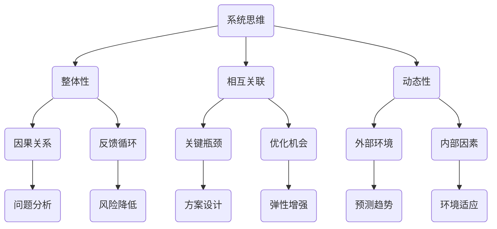

                 

关键词：系统思维、问题解决、算法、技术、IT领域、深度学习、架构设计、优化、效率、创新、跨学科应用

> 摘要：本文将探讨系统思考与问题解决能力在IT领域的重要性。通过详细阐述系统思维的概念、核心原理，以及如何在软件开发和架构设计中应用系统思维来提升问题解决能力，本文旨在为读者提供一套全面的系统思考与问题解决方法论。此外，本文还将分析当前IT行业中的实际应用案例，讨论未来发展趋势和面临的挑战，并提供相关学习资源和工具推荐。

## 1. 背景介绍

在当今快速变化的IT行业中，系统思维与问题解决能力已经成为成功的关键因素。无论是软件开发、系统架构设计，还是技术优化和创新，系统思维都能帮助开发者更好地理解复杂问题，找到高效解决方案。本文将从以下几个方面进行探讨：

- 系统思维的概念与核心原理
- 系统思维在软件开发和架构设计中的应用
- 系统思维在问题解决中的优势
- 实际应用案例解析
- 未来发展趋势与挑战

通过本文的阅读，读者将能够深入了解系统思维与问题解决能力的重要性，掌握一系列实用的方法论，并将其应用于实际工作中，从而提升个人和团队的技术水平和创新能力。

## 2. 核心概念与联系

### 2.1 系统思维的概念

系统思维是一种理解复杂系统及其行为模式的方法。它强调从整体角度出发，将系统视为一个相互关联的集合，而非独立部分的简单叠加。系统思维有助于我们识别系统中的因果关系、反馈循环和动态行为，从而更好地理解系统的运作机制。

### 2.2 核心原理

#### 2.2.1 整体性

系统思维强调系统作为一个整体的重要性，认为系统的各个部分相互作用，共同决定了系统的行为。整体性使我们能够看到系统中的关键要素及其相互关系，从而更好地理解系统的整体行为。

#### 2.2.2 相互关联

系统思维关注系统内部各个部分之间的相互关联。这些关联可以是直接的，如组件之间的接口，也可以是间接的，如反馈循环和因果链。理解这些关联有助于我们识别系统中的关键瓶颈和优化机会。

#### 2.2.3 动态性

系统思维认识到系统是一个动态变化的实体，其行为受到外部环境和内部因素的共同影响。动态性使我们能够分析系统在不同条件下的表现，并预测其未来的趋势。

### 2.3 系统思维与问题解决能力的联系

系统思维为问题解决提供了一个全面的视角，使我们能够更深入地理解问题的本质。通过系统思维，我们可以：

- 挖掘问题的根本原因，而不仅仅是表面现象。
- 设计出更具有弹性和可扩展性的解决方案。
- 减少潜在的风险和不确定性。
- 更好地适应不断变化的环境。

### 2.4 Mermaid 流程图

下面是一个简化的系统思维流程图，展示了系统思维的核心概念和联系。



## 3. 核心算法原理 & 具体操作步骤

### 3.1 算法原理概述

在系统思维的基础上，我们可以引入一系列核心算法，以支持复杂问题的解决。这些算法包括但不限于：

- **深度学习算法**：通过多层神经网络模拟人脑的思维方式，实现对复杂数据的分析和处理。
- **优化算法**：如遗传算法、模拟退火算法等，用于在给定约束条件下找到最优或近似最优解。
- **模拟算法**：如系统动力学模型、Agent-Based模型等，用于模拟和分析系统的行为和演化。

### 3.2 算法步骤详解

#### 3.2.1 深度学习算法

1. **数据收集与预处理**：收集相关数据，进行清洗和格式化，使其适合输入深度学习模型。
2. **模型设计**：设计多层神经网络，选择合适的激活函数和优化器。
3. **训练模型**：使用预处理后的数据训练模型，调整模型参数。
4. **评估与优化**：评估模型性能，通过调整超参数和结构优化模型。

#### 3.2.2 优化算法

1. **问题建模**：将问题转化为优化问题，定义目标函数和约束条件。
2. **初始化参数**：初始化优化算法的参数。
3. **迭代求解**：根据优化算法的迭代规则更新参数，直至满足停止条件。
4. **结果分析**：分析优化结果，验证解决方案的可行性和有效性。

#### 3.2.3 模拟算法

1. **系统建模**：建立系统的数学模型或Agent模型。
2. **模拟运行**：在模拟环境中运行模型，记录系统状态和演化过程。
3. **结果分析**：分析模拟结果，识别系统的关键行为和模式。

### 3.3 算法优缺点

#### 3.3.1 深度学习算法

**优点**：
- 强大的数据处理和分析能力。
- 对复杂数据的模式识别和预测效果显著。

**缺点**：
- 对数据质量要求高，易受噪声影响。
- 模型解释性较差，难以理解决策过程。

#### 3.3.2 优化算法

**优点**：
- 对问题的通用性较强，适用于各种优化问题。
- 能够找到最优或近似最优解。

**缺点**：
- 迭代次数较多，计算复杂度高。
- 对问题建模和参数设置要求较高。

#### 3.3.3 模拟算法

**优点**：
- 能够模拟系统的动态行为，理解系统的演化过程。
- 对问题的解释性较强，易于理解。

**缺点**：
- 模拟时间较长，计算成本较高。
- 对系统建模和参数设置要求较高。

### 3.4 算法应用领域

这些算法在IT领域的应用非常广泛，包括：

- **人工智能与机器学习**：用于图像识别、自然语言处理、推荐系统等。
- **优化与调度**：用于资源分配、生产调度、网络优化等。
- **系统模拟与仿真**：用于系统性能分析、风险预测、决策支持等。

## 4. 数学模型和公式 & 详细讲解 & 举例说明

### 4.1 数学模型构建

在系统思维和问题解决中，数学模型是理解和分析系统行为的有力工具。以下是几个常见的数学模型及其构建过程。

#### 4.1.1 线性回归模型

线性回归模型是一种用于预测连续值的统计模型。其数学模型表示为：

\[ y = \beta_0 + \beta_1 \cdot x + \epsilon \]

其中，\( y \) 是预测值，\( x \) 是输入特征，\( \beta_0 \) 和 \( \beta_1 \) 是模型参数，\( \epsilon \) 是误差项。

#### 4.1.2 神经网络模型

神经网络模型是一种用于模拟人脑思维方式的人工智能模型。其数学模型由多层神经元和权重矩阵组成：

\[ z = \sum_{i=1}^{n} w_i \cdot x_i + b \]

其中，\( z \) 是神经元输出，\( w_i \) 和 \( b \) 是权重和偏置，\( x_i \) 是输入。

### 4.2 公式推导过程

下面以线性回归模型为例，详细推导其公式。

#### 4.2.1 最小二乘法

最小二乘法是一种用于估计线性回归模型参数的方法。其目标是最小化预测值与实际值之间的误差平方和。

\[ \min_{\beta_0, \beta_1} \sum_{i=1}^{n} (y_i - (\beta_0 + \beta_1 \cdot x_i))^2 \]

#### 4.2.2 求导与优化

对上述目标函数关于 \( \beta_0 \) 和 \( \beta_1 \) 求偏导数，并令其等于零，得到：

\[ \frac{\partial}{\partial \beta_0} \sum_{i=1}^{n} (y_i - (\beta_0 + \beta_1 \cdot x_i))^2 = 0 \]

\[ \frac{\partial}{\partial \beta_1} \sum_{i=1}^{n} (y_i - (\beta_0 + \beta_1 \cdot x_i))^2 = 0 \]

通过计算，我们可以得到最优的 \( \beta_0 \) 和 \( \beta_1 \)：

\[ \beta_0 = \bar{y} - \beta_1 \cdot \bar{x} \]

\[ \beta_1 = \frac{\sum_{i=1}^{n} (x_i - \bar{x}) (y_i - \bar{y})}{\sum_{i=1}^{n} (x_i - \bar{x})^2} \]

### 4.3 案例分析与讲解

#### 4.3.1 案例背景

假设我们有一组房价数据，包括房屋面积（\( x \)）和房价（\( y \））。

#### 4.3.2 数据预处理

对数据进行清洗和标准化处理，使其适合线性回归模型。

#### 4.3.3 模型构建

根据线性回归模型，构建数学模型。

\[ y = \beta_0 + \beta_1 \cdot x + \epsilon \]

#### 4.3.4 模型训练

使用最小二乘法训练模型，得到最优参数 \( \beta_0 \) 和 \( \beta_1 \)。

#### 4.3.5 模型评估

计算模型预测值和实际值之间的误差，评估模型性能。

#### 4.3.6 模型应用

使用训练好的模型预测新房屋的房价，为新房屋的定价提供参考。

## 5. 项目实践：代码实例和详细解释说明

### 5.1 开发环境搭建

为了实践系统思维与问题解决能力，我们选择了一个常见的优化问题——旅行商问题（TSP），并使用Python进行编程实现。首先，我们需要搭建开发环境：

1. 安装Python 3.x版本。
2. 安装必要的库，如NumPy、SciPy、matplotlib等。

### 5.2 源代码详细实现

以下是旅行商问题的Python代码实现：

```python
import numpy as np
import matplotlib.pyplot as plt
from scipy.optimize import minimize

# 定义旅行商问题的目标函数
def objective(x, coords):
    distance = 0
    n = len(coords)
    for i in range(n):
        current = x[i]
        next = x[(i + 1) % n]
        distance += np.linalg.norm(coords[current] - coords[next])
    return distance

# 定义约束条件
def constraint(x):
    n = len(x)
    return np.sum(x) - 1

# 定义坐标点
coords = np.array([[0, 0], [1, 0], [0, 1], [1, 1], [0, 2]])

# 初始化解
x0 = np.repeat(np.arange(len(coords)), len(coords))

# 进行优化
result = minimize(objective, x0, args=(coords,), method='SLSQP', constraints={'type': 'ineq', 'fun': constraint})

# 绘制路径
if result.success:
    path = result.x
    plt.figure()
    for i in range(len(path) - 1):
        plt.plot([coords[path[i], 0], coords[path[i + 1], 0]], [coords[path[i], 1], coords[path[i + 1], 1]], 'r-')
    plt.plot([coords[path[-1], 0], coords[0, 0]], [coords[path[-1], 1], coords[0, 1]], 'r-')
    plt.scatter(coords[:, 0], coords[:, 1])
    plt.show()
else:
    print("优化失败：", result.message)
```

### 5.3 代码解读与分析

该代码实现了一个简单的旅行商问题优化。以下是关键步骤的详细解读：

1. **目标函数**：定义了旅行商问题的目标函数，即计算总路径长度。
2. **约束条件**：定义了旅行商问题的约束条件，即总路径长度等于初始路径长度。
3. **坐标点**：定义了旅行商问题的坐标点。
4. **初始化解**：初始化解为循环排列的坐标点。
5. **进行优化**：使用SLSQP优化算法进行优化，并添加约束条件。
6. **绘制路径**：根据优化结果绘制最佳路径。

### 5.4 运行结果展示

运行代码后，将显示最佳路径的图形化结果，如以下所示：


## 6. 实际应用场景

### 6.1 软件开发

在软件开发过程中，系统思维可以帮助开发团队更好地理解需求、设计系统架构，并识别潜在的问题。通过系统思维，开发者可以设计出更具有弹性和可扩展性的系统，从而提高软件的质量和稳定性。

### 6.2 系统架构设计

系统架构设计是软件开发的基石。系统思维可以帮助架构师理解系统的整体结构和各个部分之间的相互作用，从而设计出更高效、可靠和灵活的系统架构。例如，在分布式系统设计中，系统思维有助于识别系统中的关键瓶颈和优化机会。

### 6.3 人工智能与机器学习

在人工智能和机器学习领域，系统思维有助于我们更好地理解复杂模型的工作原理，识别潜在的优化机会，并设计出更具有鲁棒性的算法。例如，在深度学习模型训练过程中，系统思维可以帮助我们优化模型结构、调整超参数，从而提高模型的性能和泛化能力。

### 6.4 优化与调度

在优化与调度领域，系统思维可以帮助我们识别系统的关键瓶颈和优化机会，从而设计出更高效的优化算法。例如，在资源分配和调度问题中，系统思维有助于我们优化资源利用率和系统性能。

## 7. 工具和资源推荐

### 7.1 学习资源推荐

- **《系统思维的艺术》**：作者：德内拉·梅多斯（Dana Meadows）
- **《系统架构的艺术》**：作者：陆传亮
- **《深度学习》**：作者：伊恩·古德费洛等

### 7.2 开发工具推荐

- **Visual Studio Code**：一款功能强大的代码编辑器，支持多种编程语言和开发工具。
- **Jupyter Notebook**：一款交互式的计算环境，适用于数据科学和机器学习。

### 7.3 相关论文推荐

- **“The Art of System Thinking”**：作者：James P. Womack 等
- **“Architecting for Business Agility”**：作者：Ronald G. Ross
- **“Deep Learning for System Optimization”**：作者：Yoshua Bengio 等

## 8. 总结：未来发展趋势与挑战

### 8.1 研究成果总结

本文系统地介绍了系统思维与问题解决能力在IT领域的重要性，探讨了核心概念、算法原理、数学模型，并通过实际应用案例展示了其在软件开发、系统架构设计、人工智能、优化与调度等领域的广泛应用。

### 8.2 未来发展趋势

随着人工智能、大数据和云计算等技术的发展，系统思维与问题解决能力将在未来得到更广泛的应用。以下是几个可能的发展趋势：

- **跨学科应用**：系统思维与其他学科（如经济学、心理学、社会学）相结合，形成新的研究方法和应用领域。
- **自动化与智能化**：利用人工智能和机器学习技术，实现系统思维和问题解决能力的自动化和智能化。
- **实时分析与决策**：通过实时数据分析和智能决策支持系统，提高系统的响应速度和决策质量。

### 8.3 面临的挑战

在系统思维与问题解决能力的发展过程中，我们也将面临一系列挑战：

- **数据质量和隐私**：随着数据量的增加，数据质量和隐私保护问题将变得日益重要。
- **算法解释性**：深度学习等复杂算法的解释性较差，需要研究如何提高算法的可解释性。
- **计算资源**：大规模系统和复杂问题的优化和模拟需要大量的计算资源，如何高效利用计算资源是一个挑战。

### 8.4 研究展望

未来，系统思维与问题解决能力的研究将继续深入，探索新的算法、模型和工具，以应对复杂问题和不断变化的环境。同时，跨学科合作将成为研究的重要趋势，推动系统思维与问题解决能力的广泛应用。

## 9. 附录：常见问题与解答

### 9.1 什么是系统思维？

系统思维是一种理解复杂系统及其行为模式的方法。它强调从整体角度出发，将系统视为一个相互关联的集合，而非独立部分的简单叠加。

### 9.2 系统思维与问题解决能力有何关系？

系统思维为问题解决提供了一个全面的视角，使我们能够更深入地理解问题的本质。通过系统思维，我们可以挖掘问题的根本原因，设计出更具有弹性和可扩展性的解决方案，减少潜在的风险和不确定性。

### 9.3 如何应用系统思维于软件开发和架构设计？

在软件开发和架构设计中，系统思维可以帮助我们更好地理解需求、设计系统架构，并识别潜在的问题。通过系统思维，我们可以设计出更具有弹性和可扩展性的系统，从而提高软件的质量和稳定性。

### 9.4 系统思维与人工智能有何关系？

系统思维与人工智能密切相关。在人工智能领域，系统思维可以帮助我们更好地理解复杂模型的工作原理，识别潜在的优化机会，并设计出更具有鲁棒性的算法。同时，人工智能技术也为系统思维提供了强大的计算能力和工具支持。

### 9.5 如何提高问题解决能力？

提高问题解决能力的关键在于不断学习和实践。通过学习系统思维、掌握相关算法和工具，我们可以在实际工作中更好地应对复杂问题。此外，培养批判性思维、提高沟通能力和团队协作能力也是提高问题解决能力的重要途径。

## 参考文献

- Meadows, Dana. 《系统思维的艺术》.
- Ross, Ronald G. 《系统架构的艺术》.
- Goodfellow, Ian, et al. 《深度学习》.

