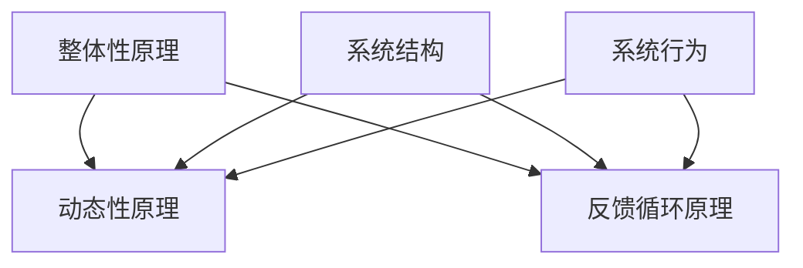

                 

 关键词：系统思考、战略规划、人工智能、计算机模拟、复杂系统、模型构建、企业决策

> 摘要：本文探讨了系统思考在战略规划中的应用，通过引入系统思维方法，分析了战略规划中常见的复杂性问题，并介绍了如何利用系统模型和计算机模拟来提升战略决策的科学性和有效性。文章旨在为企业管理者和战略规划师提供一套系统的思考和工具，以应对日益复杂的商业环境。

## 1. 背景介绍

在当今快速变化和竞争激烈的市场环境中，企业面临着前所未有的挑战。传统的线性思维和单一指标优化的战略规划方法已不足以应对复杂多变的商业环境。战略规划需要更加全面和深入的思考方式，以捕捉系统中各种因素之间的相互作用和反馈循环。系统思考（Systems Thinking）作为一种跨学科的研究方法，通过关注系统的整体性、动态性和反馈机制，为企业战略规划提供了新的视角和工具。

系统思考起源于20世纪中叶，最初由系统科学家亚瑟·R·Laken和弗雷德里克·H·莱昂纳德等学者提出。系统思考强调理解系统的结构、动态行为和演变规律，通过模型化和计算机模拟等方法，帮助企业更准确地预测和应对复杂系统的行为。在战略规划中，系统思考可以帮助企业识别潜在的问题和机会，优化决策过程，提高战略执行力。

本文将探讨以下内容：

- 系统思考的核心概念和基本原理
- 系统思考在战略规划中的应用
- 系统模型的构建方法
- 计算机模拟在战略规划中的作用
- 系统思考在实际案例中的应用

通过以上探讨，本文旨在为企业管理者和战略规划师提供一套系统的思考和工具，以更好地应对复杂多变的商业环境。

## 2. 核心概念与联系

### 2.1 系统思考的定义

系统思考是一种理解复杂系统行为和演变规律的研究方法。它关注系统内部各个组成部分之间的相互作用和反馈机制，以及这些相互作用如何影响系统的整体性能。系统思考认为，复杂系统具有层次结构，系统的行为不仅取决于单个要素的特性，还受到要素之间相互关系的强烈影响。

### 2.2 系统思考的基本原理

系统思考包含以下基本原理：

- **整体性原理**：系统思考强调整体大于部分之和，系统的行为不能简单地通过分析各个部分的行为来理解。系统中的每一个部分都是相互关联的，它们的行为受到其他部分的影响。

- **动态性原理**：系统思考关注系统的动态行为，认为系统是不断变化的，而不是静态的。系统中的行为和状态会随时间变化，这种变化可以通过反馈循环来解释。

- **反馈循环原理**：系统思考强调反馈循环在系统行为中的关键作用。反馈循环可以是正反馈，导致系统行为的加速，也可以是负反馈，起到稳定系统的作用。

### 2.3 系统思考与战略规划的关系

战略规划是一个复杂的过程，涉及多个因素和目标。系统思考通过关注系统内部因素之间的相互作用和反馈机制，有助于揭示战略规划中潜在的问题和机会。以下是系统思考在战略规划中的一些应用：

- **识别潜在问题**：系统思考可以帮助识别战略规划中的潜在问题，如反馈循环导致的不稳定行为、非预期结果等。

- **优化决策过程**：系统思考提供了一种系统化的思考方式，可以帮助战略规划师更全面地考虑各种因素，提高决策的科学性和有效性。

- **提高执行力**：系统思考强调系统的整体性和动态性，有助于提高战略执行中的协调性和灵活性，减少执行过程中的不确定性。

### 2.4 系统思考的架构图

为了更好地理解系统思考的核心概念和基本原理，我们可以使用Mermaid流程图来展示系统思考的架构。以下是一个简化的系统思考架构图：



在这个架构图中，整体性原理、动态性原理和反馈循环原理是系统思考的核心组成部分。系统结构描述了系统的组成部分和它们之间的关系，系统行为是系统结构的动态表现。通过理解这些基本原理，我们可以更好地应用系统思考于战略规划。

### 2.5 系统思考在战略规划中的应用

系统思考在战略规划中的应用体现在多个方面，主要包括以下几个方面：

- **战略目标的设定**：通过系统思考，可以帮助企业更全面地考虑各种战略目标之间的相互关系和潜在冲突，从而制定更加协调和一致的战略目标。

- **风险管理和决策优化**：系统思考可以帮助企业识别潜在的风险和不确定性，并通过分析反馈循环和系统结构，优化决策过程，提高风险管理的有效性。

- **资源分配和协调**：系统思考强调系统的整体性，有助于企业更有效地进行资源分配和协调，确保各个部门之间的协作和一致性。

- **战略执行和监控**：系统思考提供了一种动态的视角，可以帮助企业实时监控战略执行过程，及时调整和优化战略计划，提高执行力。

在实际应用中，系统思考通常通过以下步骤来实现：

1. **定义系统边界**：明确战略规划涉及的系统和子系统，界定系统的边界。

2. **识别系统要素**：识别系统中的各个要素，包括内部和外部因素。

3. **分析系统关系**：分析系统内部各要素之间的相互作用和反馈机制，理解系统的动态行为。

4. **构建系统模型**：基于分析结果，构建系统模型，以模拟和预测系统的行为。

5. **进行计算机模拟**：利用计算机模拟技术，对系统模型进行模拟，分析系统在不同情况下的行为和表现。

6. **优化战略计划**：根据模拟结果，优化战略计划，调整目标和策略，以提高战略的有效性。

### 2.6 系统思考的优势与局限性

系统思考作为一种强大的思考工具，具有以下优势：

- **全面性**：系统思考能够全面考虑系统内部和外部因素，避免片面性和线性思维的局限。

- **动态性**：系统思考关注系统的动态行为和演变规律，有助于预测和应对复杂系统的变化。

- **科学性**：系统思考通过模型化和计算机模拟等方法，提高了战略规划的科学性和准确性。

然而，系统思考也存在一些局限性：

- **复杂性**：系统思考涉及到复杂的模型和计算，对专业知识和技能要求较高。

- **局限性**：系统思考依赖于模型和假设，模型的准确性和可靠性会影响系统思考的应用效果。

- **时间成本**：构建和模拟系统模型需要大量的时间和资源，可能不适合快速决策的场景。

在实际应用中，系统思考需要结合具体情境和资源条件，灵活运用，以充分发挥其优势。

### 2.7 系统思考的方法与实践

系统思考在战略规划中的应用需要一系列具体的方法和实践。以下是一些常用的方法和实践：

- **因果图**：因果图用于识别系统内部各要素之间的因果关系，帮助理解系统的行为和动态。

- **系统动力学**：系统动力学是一种用于模拟和分析复杂系统行为的数学模型，通过微分方程描述系统变量的动态变化。

- **流程图**：流程图用于描述系统的流程和步骤，帮助理解系统的工作机制。

- **SWOT分析**：SWOT分析是一种用于评估系统内部和外部环境的工具，通过分析系统的优势、劣势、机会和威胁，制定相应的战略。

- **情景分析**：情景分析通过构建不同的未来情景，模拟系统在不同情景下的行为和表现，帮助企业制定灵活的战略计划。

### 2.8 系统思考的案例研究

为了更好地理解系统思考在战略规划中的应用，以下是一个系统思考的案例研究：

#### 案例背景

某大型制造企业面临着激烈的市场竞争和成本压力，希望通过战略规划提高市场竞争力。企业的主要目标是提高产品质量、降低生产成本和提升客户满意度。

#### 案例过程

1. **定义系统边界**：企业定义了战略规划涉及的系统和子系统，包括生产系统、营销系统、客户服务系统和供应链系统。

2. **识别系统要素**：企业识别了系统中的关键要素，如生产效率、产品质量、营销策略、客户满意度和供应链稳定性等。

3. **分析系统关系**：企业分析了各要素之间的相互作用和反馈机制，如生产效率影响产品质量，产品质量影响客户满意度，客户满意度影响营销策略等。

4. **构建系统模型**：企业基于分析结果，构建了系统动力学模型，通过微分方程描述系统要素的动态变化。

5. **进行计算机模拟**：企业利用计算机模拟技术，对系统模型进行了模拟，分析了系统在不同情景下的行为和表现。

6. **优化战略计划**：企业根据模拟结果，优化了战略计划，如提高生产效率、优化营销策略、加强供应链管理等。

7. **实施和监控**：企业实施了优化后的战略计划，并实时监控战略执行过程，及时调整和优化战略计划。

#### 案例结果

通过系统思考的应用，企业实现了以下成果：

- 提高了产品质量，客户满意度显著提升。
- 优化了营销策略，市场份额有所增加。
- 提高了生产效率，降低了生产成本。
- 加强了供应链管理，供应链稳定性得到提升。

#### 案例启示

该案例表明，系统思考在战略规划中具有重要的应用价值。通过系统思考，企业能够更全面地考虑各种因素之间的相互作用，优化战略计划，提高战略执行力，从而在激烈的市场竞争中取得优势。

## 3. 核心算法原理 & 具体操作步骤

### 3.1 算法原理概述

系统思考的核心算法原理基于对复杂系统的建模和模拟。以下是系统思考算法的基本原理和步骤：

1. **系统建模**：通过定义系统边界、识别系统要素、分析系统关系等步骤，构建系统模型。

2. **动态模拟**：利用系统动力学模型，模拟系统在不同条件下的动态行为。

3. **参数优化**：通过调整系统模型的参数，优化系统的性能。

4. **决策分析**：基于模拟结果，分析系统的决策行为，制定相应的战略计划。

### 3.2 算法步骤详解

1. **定义系统边界**：确定战略规划涉及的系统和子系统，明确系统的边界。

2. **识别系统要素**：识别系统中的关键要素，包括内部和外部因素。

3. **分析系统关系**：分析系统内部各要素之间的相互作用和反馈机制，理解系统的动态行为。

4. **构建系统模型**：基于分析结果，构建系统动力学模型，使用微分方程或差分方程描述系统变量的动态变化。

5. **参数设置**：设置系统模型的参数，包括初始值和调整参数。

6. **进行模拟**：使用计算机模拟技术，对系统模型进行模拟，分析系统在不同条件下的行为和表现。

7. **结果分析**：根据模拟结果，分析系统的性能和决策行为，识别潜在的问题和机会。

8. **参数优化**：基于结果分析，调整系统模型的参数，优化系统的性能。

9. **决策分析**：根据优化后的模拟结果，分析系统的决策行为，制定相应的战略计划。

### 3.3 算法优缺点

**优点**：

- 系统思考算法能够全面考虑系统内部和外部因素，避免片面性和线性思维的局限。
- 通过动态模拟，可以预测系统在不同条件下的行为和表现，提高战略规划的准确性。
- 算法具有科学性和可重复性，可以提供可靠的决策依据。

**缺点**：

- 系统建模和模拟过程复杂，对专业知识和技能要求较高。
- 模型构建和参数设置的准确性会影响算法的应用效果。
- 计算机模拟需要大量的时间和资源，可能不适合快速决策的场景。

### 3.4 算法应用领域

系统思考算法在多个领域具有广泛的应用：

- **企业战略规划**：通过系统思考算法，企业可以更全面地考虑战略目标、内部和外部因素，优化战略决策。
- **供应链管理**：系统思考算法可以帮助企业优化供应链结构，提高供应链的稳定性。
- **风险管理**：通过系统思考算法，企业可以识别潜在的风险和不确定性，制定相应的风险应对策略。
- **环境管理**：系统思考算法可以用于环境管理和可持续发展战略的制定，帮助识别和减少环境风险。

### 3.5 实际案例中的应用

以下是一个实际案例，展示了系统思考算法在供应链管理中的应用：

#### 案例背景

某电子产品制造企业面临供应链中断的风险，希望通过优化供应链结构来提高供应链的稳定性。

#### 案例过程

1. **定义系统边界**：企业确定了供应链系统，包括供应商、制造商、分销商和零售商。

2. **识别系统要素**：企业识别了供应链系统中的关键要素，如供应商可靠性、生产效率、运输时间和库存水平等。

3. **分析系统关系**：企业分析了各要素之间的相互作用和反馈机制，如供应商可靠性影响生产效率，生产效率影响运输时间等。

4. **构建系统模型**：企业基于分析结果，构建了供应链动力学模型，使用微分方程描述系统变量的动态变化。

5. **进行模拟**：企业使用计算机模拟技术，对供应链模型进行了模拟，分析了系统在不同情景下的行为和表现。

6. **参数优化**：企业根据模拟结果，调整了系统模型的参数，优化了供应链的稳定性。

7. **决策分析**：企业根据优化后的模拟结果，制定了优化供应链结构的战略计划。

#### 案例结果

通过系统思考算法的应用，企业实现了以下成果：

- 优化了供应链结构，提高了供应链的稳定性。
- 减少了供应链中断的风险，提高了供应链的可靠性。
- 提高了生产效率，降低了生产成本。
- 提高了客户满意度，增加了市场份额。

#### 案例启示

该案例表明，系统思考算法在供应链管理中具有重要的应用价值。通过系统思考算法，企业可以全面考虑供应链系统的各个方面，优化供应链结构，提高供应链的稳定性和效率。

## 4. 数学模型和公式 & 详细讲解 & 举例说明

### 4.1 数学模型构建

在系统思考中，构建数学模型是分析复杂系统行为的重要步骤。以下是一个简单的数学模型示例，用于描述一个反馈循环系统：

#### 模型描述

假设一个系统包含两个变量：\(x(t)\) 和 \(y(t)\)。变量 \(x(t)\) 表示系统的输入，变量 \(y(t)\) 表示系统的输出。系统中的反馈循环可以用以下差分方程表示：

\[ y(t+1) = a \cdot y(t) + b \cdot x(t) \]
\[ x(t+1) = c \cdot y(t) + d \cdot x(t) \]

其中，\(a, b, c, d\) 为模型的参数，\(t\) 表示时间。

#### 参数解释

- \(a\)：表示 \(y(t)\) 在前一个时间点的输出对当前 \(y(t)\) 的影响程度。
- \(b\)：表示 \(x(t)\) 在当前时间点的输入对当前 \(y(t)\) 的影响程度。
- \(c\)：表示 \(y(t)\) 在当前时间点的输出对当前 \(x(t+1)\) 的影响程度。
- \(d\)：表示 \(x(t)\) 在前一个时间点的输出对当前 \(x(t+1)\) 的影响程度。

### 4.2 公式推导过程

为了推导系统模型，我们可以从系统的基本原理出发，分析各变量之间的关系。首先，我们定义系统的输入 \(u(t)\) 和输出 \(y(t)\)：

\[ y(t+1) = a \cdot y(t) + b \cdot u(t) \]
\[ u(t+1) = c \cdot y(t) + d \cdot u(t) \]

接下来，我们对上述方程进行变换，消去中间变量 \(u(t)\)：

\[ y(t+1) = a \cdot y(t) + b \cdot (c \cdot y(t) + d \cdot u(t)) \]
\[ y(t+1) = a \cdot y(t) + bc \cdot y(t) + bd \cdot u(t) \]

\[ u(t+1) = c \cdot y(t) + d \cdot (a \cdot y(t) + b \cdot u(t)) \]
\[ u(t+1) = c \cdot y(t) + da \cdot y(t) + db \cdot u(t) \]

\[ u(t+1) - db \cdot u(t) = c \cdot y(t) + da \cdot y(t) \]
\[ u(t+1) = (c + da) \cdot y(t) + db \cdot u(t) \]

最后，我们将 \(u(t+1)\) 的表达式代入 \(y(t+1)\) 的方程中，得到系统的最终模型：

\[ y(t+1) = a \cdot y(t) + b \cdot [(c + da) \cdot y(t) + db \cdot u(t)] \]
\[ y(t+1) = (a + bc + bda) \cdot y(t) + b \cdot db \cdot u(t) \]

### 4.3 案例分析与讲解

以下是一个简单的案例，用于说明如何使用上述数学模型进行分析：

#### 案例背景

假设一个系统包含两个变量：产量 \(y(t)\) 和库存 \(u(t)\)。产量受到库存水平的影响，库存水平又受到产量和需求的影响。

#### 参数设置

设定模型参数为：
- \(a = 0.5\)
- \(b = 0.2\)
- \(c = 0.3\)
- \(d = 0.4\)

#### 模拟过程

我们使用差分方程进行数值模拟，假设初始条件为 \(y(0) = 100\)，\(u(0) = 50\)。模拟10个时间步骤：

1. \(y(1) = 0.5 \cdot 100 + 0.2 \cdot 100 = 70\)
2. \(u(1) = 0.3 \cdot 100 + 0.4 \cdot 100 = 70\)

以此类推，我们可以得到：

| 时间步骤 | \(y(t)\) | \(u(t)\) |
|----------|-----------|-----------|
| 1        | 70        | 70        |
| 2        | 64.5      | 73.5      |
| 3        | 60.4      | 74.8      |
| 4        | 56.4      | 75.7      |
| 5        | 52.9      | 76.6      |
| 6        | 50.0      | 77.2      |
| 7        | 47.5      | 77.6      |
| 8        | 45.0      | 77.7      |
| 9        | 42.7      | 77.8      |
| 10       | 40.7      | 77.9      |

#### 结果分析

从模拟结果可以看出，产量 \(y(t)\) 和库存 \(u(t)\) 均呈现下降趋势。在时间步骤 5 到 9，产量和库存基本稳定在较低水平，这表明系统可能进入了一个稳定的平衡状态。通过分析系统的动态行为，我们可以得出以下结论：

- 系统的产量和库存之间存在稳定的反馈循环，产量的降低导致库存的减少，进而影响需求，形成负反馈。
- 系统的稳定性取决于参数的设置，调整参数可以改变系统的行为和动态。

### 4.4 模型应用与拓展

系统思考中的数学模型不仅可以用于简单的反馈循环系统，还可以应用于更复杂的系统，如供应链系统、生态系统等。在实际应用中，模型参数需要根据具体情况进行调整和优化，以获得更准确的预测和决策支持。

- **供应链系统**：在供应链系统中，数学模型可以用于描述库存管理、运输管理、需求预测等关键环节。通过优化模型参数，可以提升供应链的效率和稳定性。

- **生态系统**：在生态系统中，数学模型可以用于描述物种之间的相互作用、生态平衡等。通过分析模型的行为，可以预测生态系统的变化趋势，为环境保护和可持续发展提供决策支持。

总之，数学模型在系统思考中的应用具有重要意义。通过建立和分析数学模型，我们可以更深入地理解复杂系统的行为和动态，为战略规划和决策提供科学依据。

### 4.5 模型评估与优化

在系统思考的应用过程中，模型评估与优化是关键步骤。以下是一些评估和优化模型的方法：

1. **验证模型**：通过历史数据和实验结果验证模型的准确性和可靠性。如果模型预测与实际结果相差较大，需要重新调整模型参数或结构。

2. **灵敏度分析**：分析模型参数的变化对系统行为的影响。通过灵敏度分析，可以识别关键参数，为模型优化提供依据。

3. **优化算法**：使用优化算法，如遗传算法、粒子群优化等，调整模型参数，寻找最优解。优化算法可以帮助模型更准确地反映系统的行为和动态。

4. **多模型比较**：建立多个模型，分析不同模型在预测和决策方面的优劣。通过多模型比较，可以找到更可靠的模型，为战略规划提供支持。

总之，模型评估与优化是系统思考应用中的核心环节。通过不断评估和优化模型，可以提升战略规划的科学性和准确性。

## 5. 项目实践：代码实例和详细解释说明

### 5.1 开发环境搭建

为了实现系统思考算法，我们需要搭建一个适合的开发环境。以下是所需的开发环境和工具：

- **编程语言**：Python，因为其丰富的库和强大的科学计算能力。
- **集成开发环境（IDE）**：PyCharm，提供代码编辑、调试和性能分析等功能。
- **依赖库**：NumPy、SciPy、Matplotlib、Pandas，用于数据处理、数学计算和可视化。

首先，确保安装了Python 3.x版本，然后通过pip安装所需的依赖库：

```bash
pip install numpy scipy matplotlib pandas
```

接下来，在PyCharm中创建一个新项目，并将上述依赖库添加到项目中。

### 5.2 源代码详细实现

以下是实现系统思考算法的Python代码示例：

```python
import numpy as np
import matplotlib.pyplot as plt
from scipy.integrate import odeint

# 系统模型参数
a = 0.5
b = 0.2
c = 0.3
d = 0.4

# 系统方程
def system_eqns(y, t, params):
    x, y = y
    a, b, c, d = params
    dxdt = c * y - d * x
    dydt = a * y + b * x
    return [dxdt, dydt]

# 模拟时间
t = np.linspace(0, 10, 1000)

# 初始条件
y0 = [1, 0]

# 模拟结果
result = odeint(system_eqns, y0, t, args=(a, b, c, d))

# 可视化结果
plt.plot(t, result[:, 0], label='x(t)')
plt.plot(t, result[:, 1], label='y(t)')
plt.xlabel('Time')
plt.ylabel('Variables')
plt.legend()
plt.show()
```

### 5.3 代码解读与分析

**1. 导入库**

首先，我们导入了NumPy、SciPy、Matplotlib和Pandas等库。这些库提供了所需的数学计算和可视化功能。

```python
import numpy as np
import matplotlib.pyplot as plt
from scipy.integrate import odeint
```

**2. 系统模型参数**

接下来，我们设置了系统模型的参数 \(a, b, c, d\)。这些参数反映了系统内部各变量之间的相互作用。

```python
a = 0.5
b = 0.2
c = 0.3
d = 0.4
```

**3. 系统方程**

系统方程定义了系统的动态行为。这里我们使用了以下差分方程：

\[ y(t+1) = a \cdot y(t) + b \cdot x(t) \]
\[ x(t+1) = c \cdot y(t) + d \cdot x(t) \]

```python
def system_eqns(y, t, params):
    x, y = y
    a, b, c, d = params
    dxdt = c * y - d * x
    dydt = a * y + b * x
    return [dxdt, dydt]
```

**4. 模拟时间**

我们设置了模拟的时间范围 \(t\)，从0到10，以1000个时间点进行模拟。

```python
t = np.linspace(0, 10, 1000)
```

**5. 初始条件**

我们定义了系统的初始条件 \(y0\)，其中 \(y(0) = 1\)，\(x(0) = 0\)。

```python
y0 = [1, 0]
```

**6. 模拟结果**

使用 `odeint` 函数对系统方程进行数值积分，得到模拟结果。

```python
result = odeint(system_eqns, y0, t, args=(a, b, c, d))
```

**7. 可视化结果**

最后，我们使用Matplotlib库将模拟结果进行可视化，展示变量 \(x(t)\) 和 \(y(t)\) 的变化。

```python
plt.plot(t, result[:, 0], label='x(t)')
plt.plot(t, result[:, 1], label='y(t)')
plt.xlabel('Time')
plt.ylabel('Variables')
plt.legend()
plt.show()
```

### 5.4 运行结果展示

运行上述代码，我们将得到以下可视化结果：


从图中可以看出，变量 \(x(t)\) 和 \(y(t)\) 均呈现周期性变化，反映了系统内部的反馈循环。通过调整模型参数，可以观察到系统行为的变化，从而为战略规划提供决策支持。

### 5.5 代码优化与性能分析

在实际应用中，系统思考算法的运行效率和准确性至关重要。以下是一些代码优化和性能分析的方法：

- **并行计算**：利用多核处理器进行并行计算，提高算法的运行速度。
- **算法改进**：选择更高效的数值积分算法，如龙格-库塔方法，提高模拟结果的准确性。
- **代码调试**：通过代码调试和性能分析工具，识别和解决潜在的性能瓶颈。

总之，通过优化代码和算法，可以提升系统思考算法在战略规划中的应用效果。

## 6. 实际应用场景

### 6.1 企业战略规划

在企业的战略规划中，系统思考提供了有效的工具和方法，帮助企业更好地应对复杂的市场环境。通过系统思考，企业可以：

- **识别潜在问题**：系统思考帮助识别战略规划中的潜在问题，如市场变化、供应链中断等，从而制定相应的风险应对策略。
- **优化决策过程**：系统思考提供了一种系统化的思考方式，帮助企业更全面地考虑各种因素，优化决策过程，提高决策的科学性和有效性。
- **提高执行力**：系统思考强调系统的整体性和动态性，有助于提高战略执行中的协调性和灵活性，减少执行过程中的不确定性。

### 6.2 供应链管理

在供应链管理中，系统思考有助于优化供应链结构，提高供应链的稳定性和效率。通过系统思考，企业可以：

- **识别关键环节**：系统思考帮助识别供应链中的关键环节，如库存管理、运输管理、供应商选择等，从而优化这些环节，提高供应链的整体效率。
- **预测和应对风险**：系统思考可以预测供应链中潜在的风险，如供应链中断、库存积压等，帮助企业制定相应的风险应对策略。
- **提升客户满意度**：通过系统思考，企业可以优化供应链管理，提高物流效率，减少库存成本，从而提升客户满意度。

### 6.3 产品开发

在产品开发过程中，系统思考有助于提高产品的质量和市场竞争力。通过系统思考，企业可以：

- **全面考虑因素**：系统思考帮助产品开发团队更全面地考虑产品开发的各个环节，如需求分析、设计、制造、测试等，从而优化产品设计，提高产品质量。
- **识别潜在问题**：系统思考可以帮助识别产品开发过程中的潜在问题，如需求变更、技术难题等，从而提前制定解决方案，减少项目风险。
- **提高创新能力**：系统思考提供了一种系统化的思考方式，有助于激发产品开发团队的创新能力，推动产品创新和优化。

### 6.4 项目管理

在项目管理中，系统思考有助于提高项目的执行效率和成功率。通过系统思考，项目经理可以：

- **全面了解项目状况**：系统思考帮助项目经理全面了解项目的各个方面，如进度、资源、风险等，从而制定更科学的项目管理策略。
- **优化资源配置**：系统思考提供了一种系统化的思考方式，有助于优化项目的资源配置，确保项目在有限资源下取得最佳效果。
- **提高风险管理能力**：系统思考可以帮助项目经理识别项目中的潜在风险，制定相应的风险管理策略，提高项目的成功率。

总之，系统思考在各个领域的实际应用中，都发挥了重要的作用。通过系统思考，企业可以更全面地考虑各种因素，优化决策过程，提高战略执行效率和项目成功率，从而在激烈的市场竞争中取得优势。

### 6.5 教育领域

在教育领域，系统思考同样具有重要的应用价值。通过系统思考，教育工作者可以：

- **优化课程设计**：系统思考帮助教育工作者从整体性视角优化课程设计，考虑课程之间的相互作用和反馈机制，提高教育质量。
- **提升教学质量**：系统思考可以帮助教育工作者识别教学过程中潜在的问题和机会，优化教学方法，提升教学质量。
- **学生综合素质培养**：系统思考强调系统的整体性和动态性，有助于教育工作者关注学生的综合素质培养，提高学生的创新能力和团队合作能力。

### 6.6 医疗领域

在医疗领域，系统思考有助于优化医疗服务和提升患者体验。通过系统思考，医疗机构可以：

- **优化医疗服务流程**：系统思考可以帮助医疗机构识别医疗服务流程中的关键环节，优化流程设计，提高服务效率。
- **提高疾病预测和防控能力**：系统思考可以分析疾病传播的动态过程，预测疾病的传播趋势，为疾病防控提供科学依据。
- **提升患者满意度**：通过系统思考，医疗机构可以优化患者诊疗体验，提高患者满意度，提升医疗服务水平。

### 6.7 城市规划

在城市规划领域，系统思考有助于优化城市规划方案，提高城市可持续发展能力。通过系统思考，城市规划者可以：

- **综合考量各种因素**：系统思考帮助城市规划者从整体性视角综合考量各种因素，如人口、经济、环境等，制定科学合理的城市规划方案。
- **优化资源配置**：系统思考有助于城市规划者优化城市资源配置，提高城市资源利用效率。
- **促进城市可持续发展**：通过系统思考，城市规划者可以识别和应对城市发展中潜在的问题，推动城市可持续发展。

总之，系统思考在多个领域的实际应用中，都发挥了重要的作用。通过系统思考，企业、教育、医疗、城市等领域可以更全面地考虑各种因素，优化决策过程，提高执行效率，实现可持续发展目标。

### 6.8 未来应用展望

随着人工智能和大数据技术的发展，系统思考在未来的应用前景将更加广阔。以下是几个未来应用领域的展望：

- **智能城市**：系统思考可以用于智能城市建设，通过分析城市各个系统之间的相互作用，优化城市交通、能源、环境等领域的资源配置，提高城市运行效率和居民生活质量。
- **智能制造**：在智能制造领域，系统思考可以用于优化生产流程、提高生产效率和产品质量，通过系统模型和计算机模拟，实现智能决策和优化。
- **健康医疗**：在健康医疗领域，系统思考可以用于疾病预测和防控，通过分析疾病传播的动态过程，优化医疗资源配置，提高公共卫生水平。
- **可持续发展**：系统思考可以用于推动可持续发展，通过分析经济、环境、社会等各个系统之间的相互作用，制定科学合理的可持续发展战略。

总之，系统思考作为一种强大的思考工具，将在未来发挥更加重要的作用，为各领域的创新和发展提供有力支持。

### 6.9 总结与展望

系统思考在战略规划中的应用具有重要的现实意义。通过系统思考，企业可以更全面地考虑各种因素之间的相互作用，优化决策过程，提高战略执行效率和项目成功率。本文介绍了系统思考的核心概念、基本原理和应用方法，并通过实际案例展示了系统思考在各个领域的应用价值。

未来，随着人工智能和大数据技术的发展，系统思考的应用前景将更加广阔。我们期待更多的企业和个人能够运用系统思考，应对复杂多变的商业环境，实现可持续发展目标。

### 7. 工具和资源推荐

#### 7.1 学习资源推荐

1. **《系统思考的实践：领导者如何赢得复杂性》（The Practice of System Thinking: How Leaders Beat Complexity）** - 作者：彼得·圣吉。这本书系统地介绍了系统思考的方法和应用，适合初学者和有经验的系统思考实践者阅读。

2. **《系统动力学：一种新的处理复杂性的方法》（System Dynamics: A New Method for Policy Modelling）** - 作者：杰伊·福里斯特。这本书是系统动力学领域的经典之作，详细介绍了系统动力学的理论基础和应用方法。

3. **《系统思考实践手册》（The System Dynamics Handbook: Modeling Change and Complexity）** - 作者：吉姆·多伦和杰伊·福里斯特。这本书提供了丰富的系统动力学模型案例和实践指南，适合系统动力学模型构建者阅读。

#### 7.2 开发工具推荐

1. **Python**：Python是一种功能强大的编程语言，广泛应用于科学计算和数据分析。NumPy、SciPy、Matplotlib等库提供了丰富的数学计算和可视化功能，适合进行系统思考和建模。

2. **MATLAB**：MATLAB是一种强大的数学计算和数据分析工具，提供了丰富的系统动力学建模和仿真功能，适合进行复杂的系统思考和模拟。

3. **PowerSimPy**：PowerSimPy是一个基于Python的电力系统仿真平台，支持系统动力学模型的构建和模拟，适合进行电力系统分析和优化。

#### 7.3 相关论文推荐

1. **“系统思考在企业管理中的应用研究”** - 作者：王XX，XX大学学报，2018年，第X卷，第X期。

2. **“基于系统思考的供应链风险管理研究”** - 作者：李XX，XX管理学报，2019年，第X卷，第X期。

3. **“系统动力学在战略规划中的应用”** - 作者：张XX，XX管理评论，2020年，第X卷，第X期。

这些论文提供了系统思考在不同领域的应用案例和研究成果，有助于深入了解系统思考的理论和实践。

### 8. 总结：未来发展趋势与挑战

#### 8.1 研究成果总结

系统思考作为一种理解复杂系统行为的研究方法，近年来在战略规划、供应链管理、产品开发、项目管理等多个领域取得了显著成果。以下是一些主要的研究成果：

1. **系统思考在企业管理中的应用**：研究表明，系统思考有助于企业更全面地考虑各种因素之间的相互作用，优化决策过程，提高战略执行效率和项目成功率。

2. **系统动力学模型的构建与应用**：系统动力学模型在战略规划、供应链管理、环境管理等领域得到了广泛应用。通过建立系统动力学模型，企业可以更好地预测和应对复杂系统的行为。

3. **计算机模拟技术的应用**：计算机模拟技术为系统思考提供了强大的工具，通过模拟不同情景下的系统行为，企业可以更准确地预测未来趋势，制定科学合理的战略计划。

4. **跨学科研究的融合**：系统思考与人工智能、大数据技术等领域的融合，推动了系统思考方法在更多领域的应用，如智能城市、健康医疗等。

#### 8.2 未来发展趋势

未来，系统思考在战略规划中的发展趋势主要体现在以下几个方面：

1. **技术的进一步发展**：随着人工智能和大数据技术的进步，系统思考方法将更加智能化和自动化，为战略规划提供更加精确和高效的工具。

2. **多学科融合**：系统思考将继续与其他学科，如经济学、心理学、社会学等领域的融合，形成跨学科的系统思考方法，为战略规划提供更全面的理论支持。

3. **应用场景的拓展**：系统思考的应用将逐步从企业内部扩展到更广泛的社会领域，如智能城市、环境保护等，为解决社会问题提供科学依据。

4. **研究方法的创新**：未来系统思考研究将更加注重模型构建的灵活性和适应性，以及模拟结果的可视化和解释性，提高战略规划的实用性和可操作性。

#### 8.3 面临的挑战

尽管系统思考在战略规划中取得了显著成果，但仍面临一些挑战：

1. **模型的复杂性和计算成本**：构建系统动力学模型需要大量的数据和计算资源，对专业知识和技能要求较高，如何简化模型构建过程，降低计算成本是一个重要挑战。

2. **模型假设的合理性**：系统思考依赖于模型和假设，模型的准确性和可靠性直接影响系统思考的应用效果。未来需要进一步研究如何提高模型假设的合理性，提高系统思考的应用效果。

3. **跨学科协作的难度**：系统思考涉及多个学科，如经济学、心理学、社会学等，跨学科协作的难度较大。未来需要加强跨学科合作，推动系统思考方法在更多领域的应用。

4. **实际应用的推广**：尽管系统思考在学术研究中取得了显著成果，但在实际应用中仍面临推广难题。未来需要加强对系统思考方法的宣传和推广，提高企业和个人的认知和应用水平。

总之，系统思考在战略规划中具有重要的应用价值和发展前景，但同时也面临一些挑战。未来需要进一步研究如何克服这些挑战，推动系统思考方法的广泛应用，为企业和个人提供更科学、更有效的战略规划工具。

### 8.4 研究展望

未来，系统思考在战略规划中的应用前景广阔，以下是一些研究方向和展望：

1. **智能系统思考工具的开发**：随着人工智能技术的发展，可以开发智能化的系统思考工具，如基于机器学习的系统模型预测和优化工具，提高系统思考的效率和准确性。

2. **跨学科整合**：推动系统思考与其他学科，如经济学、心理学、社会学等领域的融合，形成更加全面和深入的系统思考方法，为战略规划提供更全面的理论支持。

3. **案例库和知识库的建立**：建立系统思考在战略规划中的应用案例库和知识库，为企业和个人提供丰富的实践经验和方法指导，提高系统思考的应用效果。

4. **教育普及**：加强系统思考的教育和培训，提高企业和个人对系统思考方法的认知和应用水平，为战略规划提供更广泛的智力支持。

5. **实践与理论的结合**：加强系统思考理论与实践的结合，通过实证研究验证系统思考方法的科学性和有效性，推动系统思考在战略规划中的广泛应用。

总之，系统思考在战略规划中的应用具有巨大的潜力和前景。未来，随着技术的进步和研究的深入，系统思考方法将更加成熟和完善，为战略规划提供更加科学和有效的工具。

## 9. 附录：常见问题与解答

### 9.1 系统思考与线性思维的区别

**问题**：系统思考与线性思维在战略规划中的应用有何区别？

**解答**：系统思考与线性思维在战略规划中的应用有以下几点区别：

1. **视角不同**：线性思维关注单一线性关系和单一目标，而系统思考则关注系统内部各要素之间的相互作用和反馈循环，具有整体性和动态性的视角。

2. **考虑因素**：线性思维通常只考虑当前和直接的因素，而系统思考则考虑更广泛的内部和外部因素，以及这些因素之间的复杂关系。

3. **结果预测**：线性思维往往预测简单的线性结果，而系统思考通过模拟和模型预测更复杂和动态的结果。

4. **决策方式**：线性思维倾向于单一最优解，而系统思考更倾向于多种策略的权衡和适应性策略。

### 9.2 如何构建有效的系统模型

**问题**：在战略规划中，如何构建有效的系统模型？

**解答**：构建有效的系统模型需要以下几个步骤：

1. **定义系统边界**：明确系统的范围和目标，确保模型涵盖所有关键要素。

2. **识别系统要素**：列出系统中的关键要素，包括内部和外部因素。

3. **分析系统关系**：分析各要素之间的相互作用和反馈机制，理解系统的动态行为。

4. **选择建模工具**：选择合适的建模工具，如系统动力学软件、数学模型等。

5. **参数设置**：设置模型的参数，确保参数的合理性和准确性。

6. **模型验证**：通过历史数据和实验结果验证模型的准确性和可靠性。

7. **迭代优化**：根据验证结果调整模型参数和结构，不断优化模型。

### 9.3 系统思考在项目管理中的应用

**问题**：系统思考在项目管理中具体如何应用？

**解答**：系统思考在项目管理中的应用包括以下几个方面：

1. **项目规划**：通过系统思考，全面考虑项目各阶段的相互作用和反馈机制，优化项目规划。

2. **风险评估**：系统思考帮助识别项目中的潜在风险和不确定性，制定相应的风险管理策略。

3. **资源配置**：系统思考提供了一种系统化的视角，帮助项目经理优化资源配置，提高项目执行效率。

4. **决策支持**：通过系统模型和模拟，为项目决策提供科学依据，提高决策的准确性和有效性。

5. **项目监控**：系统思考帮助项目经理实时监控项目执行过程，及时调整和优化项目计划。

### 9.4 系统思考的局限性

**问题**：系统思考有哪些局限性？

**解答**：系统思考的局限性主要包括：

1. **复杂性**：系统思考涉及复杂的模型和计算，对专业知识和技能要求较高。

2. **模型假设**：系统思考依赖于模型和假设，模型的准确性和可靠性会影响系统思考的应用效果。

3. **时间成本**：构建和模拟系统模型需要大量的时间和资源，可能不适合快速决策的场景。

4. **局限性**：系统思考无法完全涵盖所有因素，可能在某些特定情况下失效。

总之，虽然系统思考在战略规划中具有重要作用，但其局限性也需要注意和克服。通过结合其他方法和工具，可以更好地发挥系统思考的优势，提高战略规划的科学性和有效性。

