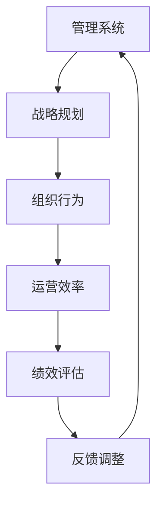

                 

关键词：系统思考，管理，复杂性科学，组织行为，战略规划

> 摘要：本文从系统思考的角度出发，探讨其在管理领域的应用。系统思考作为一种分析工具，能够帮助我们理解组织的复杂性，提升战略规划能力，优化组织行为，从而实现组织的高效运营和持续发展。

## 1. 背景介绍

在当今快速变化和高度复杂的市场环境中，组织面临着前所未有的挑战。传统的管理思维和方法已经难以应对这些挑战。因此，系统思考作为一种分析工具，应运而生。系统思考起源于复杂性科学，它强调从整体和动态的角度来理解问题，强调系统内部的相互关系和反馈机制。

## 2. 核心概念与联系

### 2.1 复杂性科学

复杂性科学是一门研究复杂系统的科学，它试图理解系统中的复杂性现象，如混沌、自组织和涌现等。复杂性科学的核心观点是，复杂系统的行为不是简单元素的直接叠加，而是由系统内部的结构和动态相互作用所决定的。

### 2.2 系统思维

系统思维是一种分析问题的方式，它强调从整体和动态的角度来理解问题，关注系统内部的相互关系和反馈机制。系统思维的核心观点是，问题往往不是孤立的，而是与其他问题相互关联和影响的。

### 2.3 管理与系统思维

管理系统是一个复杂的系统，它涉及到多个层面的互动和反馈。系统思维可以帮助管理者更好地理解组织的复杂性，从而制定更有效的管理策略。

## 2.4 Mermaid 流程图

以下是一个简单的 Mermaid 流程图，展示系统思维在管理中的应用：



## 3. 核心算法原理 & 具体操作步骤

### 3.1 算法原理概述

系统思考的核心算法是动态系统建模。动态系统建模是一种用于描述系统内部变量之间关系和动态变化的方法。它通常使用差分方程或微分方程来表示。

### 3.2 算法步骤详解

1. **定义系统变量**：首先，需要明确系统中各个变量的含义和作用。
2. **建立变量关系**：接下来，需要确定变量之间的相互关系，通常使用差分方程或微分方程来表示。
3. **模拟系统行为**：使用计算机模拟系统行为，观察系统在不同条件下的响应。
4. **分析系统特性**：根据模拟结果，分析系统的稳定性、可控性和适应性等特性。
5. **调整系统策略**：根据分析结果，调整管理策略，以优化系统性能。

### 3.3 算法优缺点

**优点**：
- 强调系统的整体性和动态性，有助于理解复杂系统的行为。
- 提供了一种预测和优化系统性能的方法。

**缺点**：
- 需要大量的数据和计算资源。
- 结果的解释和验证可能具有挑战性。

### 3.4 算法应用领域

系统思考在管理领域有广泛的应用，包括战略规划、组织行为分析、运营效率优化等。

## 4. 数学模型和公式 & 详细讲解 & 举例说明

### 4.1 数学模型构建

系统思考的数学模型通常基于差分方程或微分方程。以下是一个简单的例子：

$$
\frac{dX(t)}{dt} = f(X(t), Y(t)), \quad \frac{dY(t)}{dt} = g(X(t), Y(t))
$$

其中，$X(t)$ 和 $Y(t)$ 分别表示系统中的两个变量，$f$ 和 $g$ 分别表示它们之间的关系。

### 4.2 公式推导过程

推导过程通常涉及到对系统变量的微分或差分操作。以下是一个简化的推导过程：

$$
\frac{dX(t)}{dt} = f(X(t), Y(t))
$$

$$
\frac{dY(t)}{dt} = g(X(t), Y(t))
$$

通过对上述方程进行微分，可以得到：

$$
X'(t) = f(X(t), Y(t)), \quad Y'(t) = g(X(t), Y(t))
$$

### 4.3 案例分析与讲解

假设一个公司有两个主要部门：销售部和生产部。销售部的产出取决于生产部的产能，而生产部的产能又受到销售部订单数量的影响。我们可以建立以下模型：

$$
\frac{dS(t)}{dt} = f(P(t)), \quad \frac{dP(t)}{dt} = g(S(t))
$$

其中，$S(t)$ 表示销售部的订单数量，$P(t)$ 表示生产部的产能。

通过模拟，我们可以分析不同条件下系统的行为，例如，订单数量的变化对生产部产能的影响，或者产能的变化对订单数量的影响。这些分析可以帮助管理者制定更有效的策略。

## 5. 项目实践：代码实例和详细解释说明

### 5.1 开发环境搭建

为了演示系统思考在管理中的应用，我们将使用 Python 编写一个简单的动态系统模型。

### 5.2 源代码详细实现

```python
import numpy as np
import matplotlib.pyplot as plt

def f(x, y):
    return 0.1 * x - 0.1 * x * y

def g(x, y):
    return 0.1 * y - 0.1 * x * y

def simulate_system(t_max, dt):
    t = np.arange(0, t_max, dt)
    x = np.zeros_like(t)
    y = np.zeros_like(t)
    
    for i in range(1, len(t)):
        x[i] = x[i-1] + f(x[i-1], y[i-1]) * dt
        y[i] = y[i-1] + g(x[i-1], y[i-1]) * dt
    
    return t, x, y

t_max = 100
dt = 0.1
t, x, y = simulate_system(t_max, dt)

plt.plot(t, x, label='X(t)')
plt.plot(t, y, label='Y(t)')
plt.legend()
plt.show()
```

### 5.3 代码解读与分析

这段代码定义了一个简单的动态系统模型，并使用 Python 进行模拟。模型中，$X(t)$ 和 $Y(t)$ 分别表示系统的两个变量，$f$ 和 $g$ 分别表示它们之间的关系。通过模拟，我们可以观察系统在不同条件下的行为。

### 5.4 运行结果展示

运行上述代码，我们可以得到 $X(t)$ 和 $Y(t)$ 随时间变化的图。这个图可以帮助我们直观地理解系统的动态行为。

## 6. 实际应用场景

系统思考在管理领域有广泛的应用，例如战略规划、组织行为分析、运营效率优化等。以下是一些实际应用场景：

- **战略规划**：通过系统思考，管理者可以更全面地了解组织的复杂性，从而制定更有效的战略规划。
- **组织行为分析**：系统思考可以帮助管理者理解组织内部各个部分之间的相互关系，从而优化组织行为。
- **运营效率优化**：系统思考可以帮助管理者识别系统中的瓶颈和关键因素，从而优化运营效率。

## 7. 工具和资源推荐

- **学习资源**：
  - 《系统思考》（作者：彼得·圣吉）
  - 《复杂性科学导论》（作者：约翰·H·霍兰）
  
- **开发工具**：
  - Python
  - MATLAB

- **相关论文**：
  - "Complexity Science in Management: A Review"（作者：Sandra L. Chia、Mark J. Grieco）

## 8. 总结：未来发展趋势与挑战

### 8.1 研究成果总结

系统思考在管理领域的应用已经取得了一系列的研究成果，包括战略规划、组织行为分析、运营效率优化等方面。

### 8.2 未来发展趋势

随着人工智能和大数据技术的不断发展，系统思考在管理领域的应用前景将更加广阔。

### 8.3 面临的挑战

系统思考在管理领域面临的主要挑战是数据获取和处理能力的提升，以及模型的有效性和验证。

### 8.4 研究展望

未来的研究应关注如何将系统思考与其他管理理论相结合，以提供更全面的管理解决方案。

## 9. 附录：常见问题与解答

### Q：系统思考与管理学的关系是什么？

A：系统思考是管理学的一个重要工具，它帮助管理者理解组织的复杂性，从而制定更有效的管理策略。

### Q：如何将系统思考应用于战略规划？

A：将系统思考应用于战略规划，管理者可以更全面地分析组织内外部的环境因素，从而制定更具前瞻性的战略规划。

## 作者署名

作者：禅与计算机程序设计艺术 / Zen and the Art of Computer Programming
----------------------------------------------------------------

文章正文部分撰写完成，接下来将根据要求使用 Markdown 格式对文章进行排版，确保文章结构清晰、逻辑性强。

